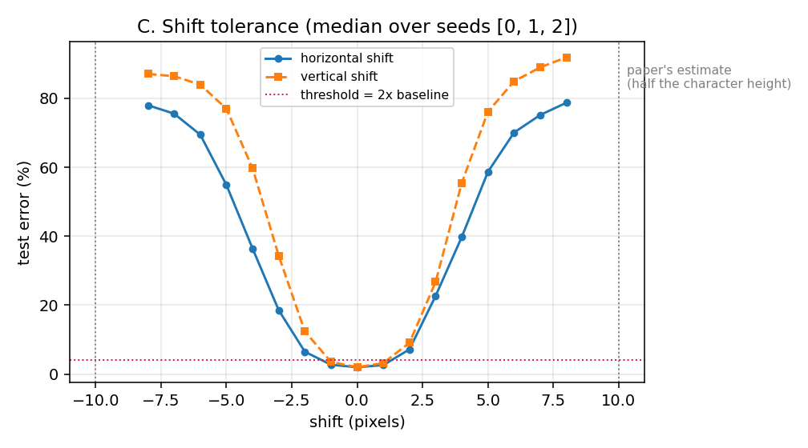
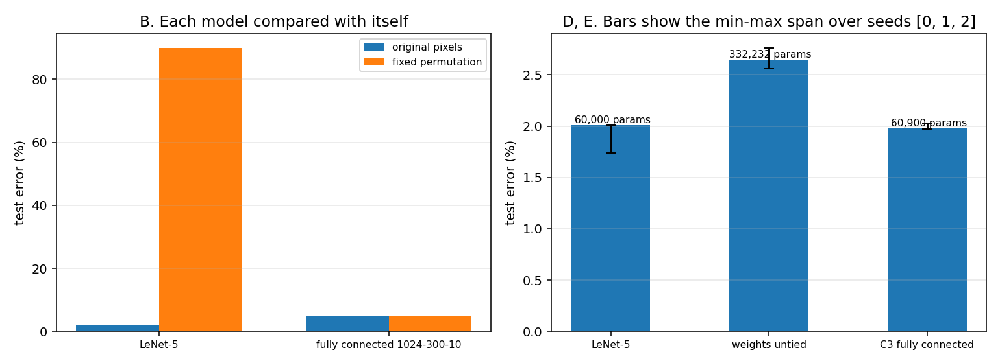

# LeNet (1998) — 논문이 문장으로만 적은 자리를 재 본다

**질문과 가설은 돌리기 전에 적었다.** 「가설」과 「설정」과 「판정 규칙」은 2026-09-21 에 노트북을 만들면서 적었고, 「결과」와 「판정」은 같은 날 돌린 뒤에 채웠다.

## 질문

**LeNet-5 를 이루는 세 생각 중 무엇이 얼마를 내는가.** 그리고 논문이 문장으로만 적고 재지 않은 둘 — **픽셀을 섞으면 어떻게 되는가**와 **얼마나 옮겨도 견디는가** — 이 숫자로 어떤 모양인가.

## 왜 이것을 돌리는가

LeNet 노트 14절에 논문이 적지 않은 자리를 아홉 적었다. 그중 **직접 잴 수 있는 다섯**을 여기서 잰다.

**하나(실험 D·E).** 논문은 국소 수용장 · 가중치 공유 · 부분 표본 뽑기 셋을 함께 넣고 쟀고, **하나씩 끈 행이 표에 없다.** 그래서 「합성곱 망이 완전연결보다 낫다」까지는 보이지만 「셋 중 무엇이 얼마를 냈는가」가 논문 안에서 답이 안 난다.

**둘(실험 B).** 논문 III-D 가 SVM 을 두고 **"이미지 픽셀을 고정된 대응으로 섞어 그림 구조를 잃어도 똑같이 잘할 것"** 이라고 적는다. 이 문장은 「합성곱 망은 그렇지 않다」를 전제로 쓴 것인데 **섞어서 잰 표가 논문에 없다.**

**셋(실험 C).** 논문 III-E 가 견디는 범위를 **크기 약 2 배 · 세로 이동 글자 높이의 절반 · 회전 30 도**로 적는데, 셋 다 **"추정된다(estimated)"** 로만 적혀 있고 곡선도 표도 없다.

**넷(실험 A).** 위 넷을 재려면 먼저 논문의 망이 내 손에서 서야 한다. 자유 파라미터가 **60,000 개로 떨어지는지**가 그 확인이다.

## 가설

- **H1 (A)**: 노트 5절의 표대로 세우면 **학습되는 값이 정확히 60,000 개**가 되고, 층별 값도 156 · 12 · 1,516 · 32 · 48,120 · 10,164 로 맞는다. 시험 오차는 이 축소 규모에서 **1% 에서 3% 사이**에 든다.
  - **H1 반대 방향**: 파라미터 수가 어긋나면 표 I 의 연결이나 부분 표본 층의 값 개수를 잘못 세운 것이다. 오차가 이 범위를 벗어나면 **학습이 덜 된 것과 구현이 틀린 것을 가른 뒤에** 다음으로 간다.
- **H2 (B)**: 픽셀을 고정 순열로 섞으면 **합성곱 망의 오차는 크게 오르고, 완전연결 망의 오차는 변동 폭 안에 머문다.**
  - **H2 반대 방향**: 합성곱 망도 별로 안 오른다. 그러면 이 규모에서는 2차원 이웃 관계가 오차에 값을 덜 한 것이고, 논문의 전제를 이 규모에서 재현하지 못한 것이다.
  - **읽는 방향을 고정한다** — **각 모델을 자기 자신과 견준다.** 섞은 합성곱 망과 섞은 완전연결 망의 절대값을 견주지 않는다. 둘은 파라미터 수도 손실도 다르다.
- **H3 (C)**: 시험 이미지를 옮기면 오차가 오르되 **부분 표본 뽑기가 두 번 들어간 만큼 몇 픽셀까지는 완만하다.** 논문이 적은 「글자 높이의 절반」은 MNIST 의 글자 높이가 20 픽셀이므로 **10 픽셀**로 읽힌다.
  - **H3 반대 방향**: 1~2 픽셀만 옮겨도 오차가 뛴다. 그러면 이 망이 견디는 범위는 논문의 추정보다 훨씬 좁고, 그 차이는 **학습 집합에 이동이 안 들어 있었다**는 것으로 설명해야 한다(논문의 왜곡 학습은 이동을 포함한다).
- **H4 (D)**: 같은 연결 구조에서 **가중치 공유만 끄면** 학습되는 값이 60,000 에서 332,232 로 늘고, **시험 오차는 올라간다.**
  - **H4 반대 방향**: 오차가 같거나 내려간다. 그러면 이 규모에서 공유의 값은 오차가 아니라 다른 자리(파라미터 수 · 메모리)에 있는 것이고, 그것도 답이다.
- **H5 (E)**: 표 I 대신 C3 를 전부 연결하면 학습되는 값이 1,516 에서 2,416 으로 늘고, **오차 차이는 seed 셋의 변동 폭 안에 있다.**
  - **H5 반대 방향**: 전부 연결 쪽이 변동 폭보다 크게 낫거나 나쁘다. 어느 쪽이든 논문이 근거로 든 「대칭을 깬다」에 처음으로 숫자가 붙는다.

### 예비 실행을 한 번 했다는 것을 밝혀 둔다

학습률을 고르느라 **seed 0 으로 합성곱 망을 한 번 미리 돌렸다.** 0.02 에서는 첫 바퀴에 주저앉았고(오차 90.2% 에서 안 움직였다) 0.003 에서 12 바퀴에 1.88% 가 나왔다. 완전연결 쪽도 같은 식으로 0.03 을 골랐다.

**그래서 H1 의 범위(1~3%)는 그 예비 실행을 보고 적은 것이다.** H2 · H3 · H4 · H5 는 그 실행에서 보지 않은 것이라 예비 실행과 무관하다.

## 설정

| 항목 | 값 |
|---|---|
| 데이터 | MNIST. 학습 12,000 장 · 시험 10,000 장. 28×28 을 배경값으로 32×32 로 넓히고 배경 −0.1 · 글자 1.175 로 맞춘다 |
| 모델 | 노트 5절의 LeNet-5 그대로 — C1(6@28×28) · S2 · C3(표 I) · S4 · C5(120) · F6(84) · 유클리드 RBF 10 |
| 누름 함수 | $1.7159\tanh(\tfrac{2}{3}a)$, 초기화 $[-2.4/F_i, 2.4/F_i]$ (부록 A 그대로) |
| 손실 | 식 9 의 판별 기준. 상수 $j$ 는 논문에 값이 없어 1.0 으로 둔다 |
| 최적화 | 관성 0.9 의 확률적 기울기 하강, 묶음 32, 12 바퀴, 세 번에 한 번 학습률을 0.3 배로 |
| 학습률 | **합성곱 0.003 · 완전연결 0.03.** 두 모델의 벌점 크기가 달라(RBF 는 84 차원 제곱 거리, 로짓은 한 자릿수) 같은 값으로는 한쪽이 안 배워진다. 값은 **비교를 돌리기 전에** 짧은 예비 실행으로 골랐고, **한 모델의 두 조건에는 같은 값을 쓴다** |
| 대조군 | 완전연결 1024-300-10 · 공유를 끈 국소 연결망 · C3 를 전부 연결한 망 |
| 격자 | A 1칸 · B 4칸 · C 이동 17칸(다시 학습하지 않는다) · D 1칸 · E 1칸, 전부 seed 3 개 |
| 재는 값 | 시험 오차 · 학습 오차 · 학습되는 값 개수 · 에폭당 시간 |
| 장비 | Colab GPU 하나. PyTorch. 판은 노트북 첫 칸이 찍는다 |
| seed | 3 개 (0 · 1 · 2) |

**축소 규칙을 미리 적는다.** 실험 하나가 6 분을 넘으면 `FAST = True` 로 **학습 장수를 12,000 에서 6,000 으로** 줄인다. **에폭 수와 망 크기는 줄이지 않는다** — 줄이면 「구조가 값을 못 했다」와 「둘 다 덜 배웠다」가 섞인다.

### 논문과 다르게 한 것 넷

**하나. 규모를 줄였다.** 논문은 학습 60,000 장을 20 바퀴 돌았다. 여기서는 **12,000 장 · 12 바퀴**다. **절대 오차율을 논문의 0.95% 와 같은 칸에 놓지 않는다.**

**둘. 최적화가 논문의 것이 아니다.** 논문은 확률적 대각 레벤버그-마콰르트(부록 C)에 바퀴마다 내려가는 전역 학습률을 쓴다. 여기서는 **관성 붙은 확률적 기울기 하강**을 쓴다. 바꾼 이유는 A~E 가 묻는 것이 전부 **조건 사이의 차이**이고, 그 차이는 최적화를 고정해 두어야 읽히기 때문이다.

> **그래서 A 의 절대 오차는 「논문의 절차를 재현한 값」이 아니다.** 옮길 때 이 문장을 함께 옮긴다.

**셋. 왜곡 학습을 하지 않는다.** 논문의 0.8% 는 왜곡 540,000 장을 더한 값이다. **C 가 묻는 것이 「왜곡을 안 넣고 배운 망이 얼마나 견디는가」라서** 일부러 넣지 않는다.

**넷. 완전연결 대조군의 입력이 1024 다.** 논문의 행은 28×28 = 784 이지만, 여기서는 같은 입력을 두 모델에 주려고 32×32 를 쓴다. **그래서 이 값을 논문의 4.7% 와 같은 칸에 놓지 않는다.**

## 판정 규칙

- **변동 폭을 먼저 적고 그 폭보다 작은 차이로 순서를 매기지 않는다.** seed 셋의 최소~최대를 칸마다 적는다.
- **B 는 모델을 자기 자신과 견준다.** 섞기 전과 뒤의 차이를 그 모델의 변동 폭과 견준다.
- **C 의 「견디는 폭」을 미리 정의한다** — 이동 0 일 때의 오차를 기준 오차라 하고, **오차가 기준 오차의 2 배를 넘지 않는 가장 큰 이동 픽셀 수**를 그 망이 견디는 폭으로 적는다. 이 정의를 결과와 함께 옮긴다.
- **시험 오차가 80% 를 넘은 칸은 「배우지 못한 것」으로 따로 표시한다.** 그런 칸이 섞이면 구조의 몫과 학습 실패가 구별되지 않는다.
- 완주하지 못한 조건은 빈칸으로 두지 않고 **「돌지 않았다」와 그때의 값**을 함께 적는다.

## 실행

| 무엇 | 파일 | 결과 파일 | 언제 |
|---|---|---|---|
| A~E 전부 | `lenet_1998.ipynb` | `results/*.csv` · `figures/*.png` | 2026-09-21 · run_id `20260921_090831` · Tesla T4 |

**돈 시간.** 학습이 든 칸을 모두 더해 274 초다. 가장 오래 걸린 칸이 D(공유 끔)로 seed 하나에 18.5~19.3 초이고, **축소 규칙의 기준(실험 하나 6 분)을 넘은 칸이 없어 `FAST` 를 켜지 않았다.**

**바탕화면에 같은 노트북 사본을 두었다**(Colab 에 올리려는 것이다). **정본은 이 폴더다** — Colab 에서 고친 것이 있으면 여기로 되돌려 넣고, 결과 CSV 와 그림도 여기에 받는다.

**돌리는 법.** 위에서 아래로 모두 실행한다. Colab 이면 런타임을 GPU 로 두고 첫 칸이 찍는 장치 이름을 확인한다. 결과는 `results/` 에 CSV 로, 그림은 `figures/` 에 PNG 로 떨어지고 맨 아래 칸이 요약을 찍는다.

## 결과

**전부 seed 셋(0 · 1 · 2)의 중앙값이고, 괄호가 최소~최대다.** 시험은 10,000 장, 학습은 12,000 장 · 12 바퀴다.

### A. 표대로 세운 LeNet-5

| 무엇 | 값 |
|---|---|
| 층별 학습되는 값 | 156 · 12 · 1,516 · 32 · 48,120 · 10,164 — **여섯 칸이 모두 논문과 같다** |
| 합계 | **60,000** (논문과 같다) |
| 시험 오차 | **2.01%** (1.74~2.01) |
| 학습 오차 | 0.30% (0.300~0.308) |
| 시간 | seed 하나에 14.3~14.8 초 |

### B. 픽셀을 고정 순열로 섞었을 때

| 모델 | 원본 | 픽셀 섞음 | 차이 | 변동 폭 | 판정 |
|---|---|---|---|---|---|
| LeNet-5 | 1.97% (1.94~2.01) | **89.90%** (58.80~90.26) | +87.93 | 31.46 | 폭보다 크다 |
| 완전연결 1024-300-10 | 4.96% (4.79~5.04) | 4.87% (4.77~4.89) | −0.09 | 0.25 | **폭 안이다** |

**판정 규칙대로 표시한다 — 섞은 LeNet-5 의 세 칸 중 둘이 80% 를 넘어 「배우지 못한 것」이다.** 학습 오차도 89.5% · 90.6% · 59.2% 라 시험만 나쁜 것이 아니라 **학습 자체가 되지 않았다.** seed 2 만 58.80% 로 절반쯤 배웠고, 그래서 이 칸의 변동 폭이 31.46 으로 크다.

### C. 시험 이미지를 옮겼을 때

| 이동 | −4 | −3 | −2 | −1 | 0 | +1 | +2 | +3 | +4 |
|---|---|---|---|---|---|---|---|---|---|
| 가로 | 36.45 | 18.56 | 6.51 | 2.73 | **2.01** | 2.64 | 7.20 | 22.71 | 39.79 |
| 세로 | 59.72 | 34.36 | 12.40 | 3.54 | **2.01** | 3.22 | 9.10 | 26.73 | 55.48 |

기준 오차 2.01%, 판정선(그 2 배) 4.02%. **견디는 폭이 가로 ±1 픽셀 · 세로 ±1 픽셀이다.** ±8 픽셀에서는 가로 78.71% · 세로 91.88% 로 찍기와 같아진다.

### D. 가중치 공유만 껐을 때

| 조건 | 학습되는 값 | 시험 오차 | 시간(seed 하나) |
|---|---|---|---|
| 공유 | 60,000 | 2.01% (1.74~2.01) | 14.3~14.8 초 |
| 공유 끔 | **332,232** (5.5 배) | **2.65%** (2.56~2.76) | 18.5~19.3 초 |

차이 +0.64 백분율 점, 변동 폭 0.27 → **폭보다 크다.**

### E. C3 를 전부 연결했을 때

| 조건 | 학습되는 값 | 시험 오차 |
|---|---|---|
| 표 I | 60,000 | 2.01% (1.74~2.01) |
| 전부 연결 | 60,900 (+900) | 1.98% (1.97~2.03) |

차이 −0.03 백분율 점, 변동 폭 0.27 → **폭 안이다.**

## 판정

- **H1 (A): 맞았다.** 층별 값 여섯이 모두 논문과 같고 합계가 정확히 60,000 이다. 시험 오차 2.01% 로 적어 둔 범위(1~3%) 안이다. **이 값을 논문의 0.95% 와 같은 칸에 놓지 않는다** — 학습 장수가 5 분의 1 이고 최적화가 논문의 것이 아니며 왜곡 학습이 없다.
- **H2 (B): 맞았다.** 합성곱 쪽만 변동 폭보다 크게 올랐고(+87.93), 완전연결 쪽은 폭 안(−0.09)이다. **논문이 SVM 을 두고 문장으로만 적은 「픽셀을 섞어도 똑같이 할 것」이, 완전연결 망에서는 이 규모에서 숫자로 확인된다.**
  - **다만 합성곱 쪽은 「나빠졌다」가 아니라 「배우지 못했다」이고, 둘은 다른 말이다.** 학습률과 바퀴 수를 이 과제에 맞춰 다시 고르면 얼마쯤은 배울 수 있다. **곧 이 결과는 「합성곱 망이 섞인 픽셀을 못 배운다」가 아니라 「이 설정에서 배우지 못했다」이다.**
- **H3 (C): 틀렸다.** 견디는 폭이 **±1 픽셀**로, 논문의 추정(세로로 글자 높이의 절반, 곧 ±10 픽셀)보다 좁다. 미리 적어 둔 반대 방향 그대로 **이 망은 학습 집합에 이동이 들어 있지 않았다** — 논문이 그 범위를 말하는 자리의 망은 왜곡(이동을 포함한다)으로 불린 데이터로 배운 것이다. **그래서 이 숫자는 논문의 추정을 반박하지 않는다. 왜곡 학습을 넣고 다시 재야 같은 칸에 놓인다.**
- **H4 (D): 맞았다.** 공유를 끄면 학습되는 값이 5.5 배가 되고 시험 오차가 +0.64 백분율 점 오른다. 차이가 변동 폭(0.27)보다 크다. **연결 구조를 그대로 두고 공유만 껐으므로, 이 +0.64 는 국소 수용장이 아니라 공유의 몫이다.**
- **H5 (E): 맞았다.** 차이 −0.03 이 변동 폭 0.27 안이라 **순서를 매기지 않는다.** 이 규모에서는 표 I 의 비완전 연결이 오차로는 값을 하지도 해를 끼치지도 않았고, 남는 이점은 **학습되는 값 900 개**다.

## 남은 것

- **B 를 학습률을 다시 골라 돌린다.** 섞은 입력에 맞춰 학습률을 다시 고르면 합성곱 망이 얼마까지 가는가. 그래야 「못 배운다」와 「이 학습률에서 안 배워졌다」가 갈린다.
- **C 를 왜곡 학습을 넣고 다시 돌린다.** 논문처럼 이동·크기·밀림을 넣어 불린 데이터로 배운 뒤 같은 이동 곡선을 그린다. 그때 ±1 픽셀이 몇 픽셀까지 넓어지는지가 논문의 추정과 견줄 수 있는 유일한 값이다.
- **D 의 +0.64 를 규모를 키워 다시 본다.** 학습 장수를 12,000 에서 60,000 으로 올리면 공유의 몫이 줄어드는가 — 공유의 이점이 용량 제약이라면 데이터가 늘수록 줄어야 한다.
