# Wide ResNet — Wide Residual Networks (요약)

> **한 줄.** 잔차 망을 더 깊게 하는 대신 **블록 안 합성곱의 채널 수를 k 배로 넓히고 층 수를 줄였다.** 16 층짜리 넓은 망(WRN-16-8, 11.0M)이 가늘고 깊은 1001 층 망(10.2M)보다 CIFAR-10 시험 오차가 낮고(4.27 대 4.92), 비슷한 정확도의 40 층 망(WRN-40-4)은 같은 GPU 에서 한 번 갱신하는 시간이 7.5 배 짧다(68 대 512 ms). 같은 생각을 ImageNet 병목 망에 옮긴 **WRN-50-2** 가 PatchCore 가 쓰는 특징 추출기다. 새 부품은 없고, **「블록 모양 · 블록 안 층 수 · 폭 · 드롭아웃」을 하나씩 바꿔 잰 실험 연구**다.

---

## Paper Metadata

| Item | Content |
|---|---|
| Title | Wide Residual Networks |
| Authors | Sergey Zagoruyko, Nikos Komodakis |
| 소속 | 둘 다 Université Paris-Est, École des Ponts ParisTech (파리) |
| Conference / Journal | BMVC 2016 (British Machine Vision Conference). **파일 안에는 학회 이름이 적혀 있지 않다** — 쪽 머리말 꼴과 첫 쪽 아래의 「c 2016. The copyright of this document resides with its authors」 문구가 BMVC 양식이고, 학회 이름은 바깥에서 알고 있는 것이다 |
| Year | 2016 (arXiv 첫 판 2016-05, arXiv:1605.07146) |
| 코드 | `https://github.com/szagoruyko/wide-residual-networks` (초록과 18절에 적혀 있다). 구현은 Torch, ImageNet 은 fb.resnet.torch |
| Stored PDF | `papers/BMVC16_WRN_Wide_Residual_Networks.pdf` (바탕화면에서 받은 이름은 `1605.07146v4.pdf`) |
| 왜 읽었는가 | 연구에서 쓰는 PatchCore 의 특징 추출기가 이 논문의 **WRN-50-2** 다. 앞 노트(ResNet)가 그 망을 「ResNet-50 의 병목 안쪽 폭을 두 배로 한 것」이라고 세기만 하고, 왜 그렇게 정했는지는 이 논문에 있다고 다음 읽을 것으로 넘겼다 |
| 읽은 범위 | **2026-10-04 에 15 쪽을 전부 읽었다.** 곧 초록 · 1~5절 · 그림 1~4 와 캡션 · 표 1~9 · 식 (1) · 참고 문헌 32 건의 목록 |

### 저장한 파일의 상태

- **arXiv 넷째 판(v4, 2017-06-14)** 이다. 학회 발표 뒤에 고친 판이라, 학회 판과 수치가 다를 수 있다. 이 노트는 v4 의 수치만 옮긴다.
- **본문 12 쪽 + 참고 문헌 3 쪽, 부록이 없다.** COCO 검출 설정은 표 9 캡션 한 줄이 전부다.
- **글자 층이 살아 있다.** 표는 글자로 옮겼고, 표 1 의 괄호 묶음처럼 글자가 흩어진 자리는 쪽을 그림으로 띄워 맞췄다. **그림 2 · 3 의 곡선 값은 본문에 없어 300 · 400 dpi 로 키워 눈금을 읽었다.** 읽기 오차를 그 자리마다 적는다. 그림 4 의 값은 막대 위에 숫자로 적혀 있어 그대로 옮겼다.

---

## 1. 용어

이 노트에서 쓸 이름을 먼저 정한다. 논문의 원래 용어는 괄호로 함께 적는다.

- **잔차 블록 (residual block)**: 입력 $x_l$ 에 층 몇 개를 거친 값 $F(x_l)$ 을 더해 다음 입력 $x_{l+1}$ 을 만드는 묶음. 앞 노트(ResNet)의 블록과 같다.
- **사전 활성 (pre-activation)**: 블록 안 순서를 「합성곱 → BN → ReLU」 대신 **「BN → ReLU → 합성곱」** 으로 둔 것. He 외(2016, Identity Mappings)의 순서이고, 이 논문의 CIFAR · SVHN 망이 모두 이 순서다. 작은 예시로, 기본 블록은 BN-ReLU-3x3-BN-ReLU-3x3 이다.
- **가는 망 / 넓은 망 (thin / wide)**: 폭 인자 $k = 1$ 인 원래 잔차 망 / $k > 1$ 인 망. 논문의 낱말 그대로다.
- **폭 인자 (widening factor)** $k$: 블록 안 합성곱의 채널 수에 곱하는 수. 작은 예시로, 첫 단계의 채널이 원래 16 인데 $k = 10$ 이면 160 이다.
- **깊이 인자 (deepening factor)** $l$: 블록 하나 안의 합성곱 층 수. 기본 블록은 $l = 2$.
- **블록 수** $N$: 단계 하나에 쌓는 블록 수. 논문은 망 전체의 블록 수를 $d$ 로 적는다($d = 3N$).
- **B(M)**: 블록 안 합성곱 커널 크기의 목록. 작은 예시로, **B(3,3)** 은 3x3 두 층, **B(3,1)** 은 3x3 다음 1x1.
- **WRN-n-k**: 합성곱 층이 $n$ 개이고 폭 인자가 $k$ 인 넓은 잔차 망. 작은 예시로, **WRN-28-10** 은 28 층, 첫 단계 채널 160. 블록 종류를 붙여 WRN-40-2-B(3,3) 처럼도 적는다.
- **WRN-50-2 (논문 표기 WRN-50-2-bottleneck)**: ImageNet 용. ResNet-50 의 **병목 블록 안쪽 폭을 두 배**로 한 망. CIFAR 의 WRN-n-k 와 이름 규칙이 다르다(15절).
- **단계 (group)**: 같은 공간 크기의 블록 묶음. CIFAR 망은 conv2 · conv3 · conv4 셋(32 · 16 · 8 칸), ImageNet 망은 넷이다. PyTorch 구현은 ImageNet 망의 단계를 `layer1` ~ `layer4` 라 부른다.
- **특징 재사용 감소 (diminishing feature reuse)**: 항등 지름길이 있으면 기울기가 블록의 가중치를 거치지 않고도 흐를 수 있어, **몇 블록만 쓸모 있는 표현을 배우거나, 많은 블록이 조금씩만 기여하는** 상태. Highway Networks 논문이 붙인 이름을 이 논문이 가져다 쓴다.
- **곱-덧셈 (multiply-adds)**: 이 노트가 계산량으로 세는 값. 논문은 계산량을 세지 않고 시간만 잰다. 작은 예시로, 3x3 합성곱이 160 채널을 받아 160 채널을 32x32 에 내면 $9 \times 160 \times 160 \times 1024 = 235{,}929{,}600$ 번이다.
- **ZCA 백색화 / 평균·표준편차 정규화 (ZCA whitening / mean/std normalization)**: CIFAR 입력 전처리 둘. 표 4 는 ZCA, 표 5 · 6 은 평균·표준편차다. **같은 망도 전처리에 따라 값이 다르다**(WRN-28-10 이 4.17 대 4.00).

---

## 2. 한 문단 요약

잔차 망은 층을 천 개까지 쌓아도 배워지지만, **정확도를 몇 분의 일 퍼센트 올리는 데 층 수를 거의 두 배로 해야 한다**(초록). 그리고 항등 지름길이 있으면 기울기가 블록을 거치지 않아도 되므로 블록 대부분이 일을 적게 할 수 있다(특징 재사용 감소). 논문은 원래 잔차 망이 **깊이를 위해 폭을 줄인 것**을 되돌려 본다. CIFAR 에서 블록 모양 여섯(표 2), 블록 안 층 수 넷(표 3), 깊이 넷 x 폭 여섯 중 열 조합(표 4)을 재서, **B(3,3) 기본 블록을 쓰고 깊이를 16~28 로 줄이고 폭을 8~10 배로 늘리는 것**이 가장 낫다는 결론에 닿는다. WRN-28-10(36.5M)은 CIFAR-10 4.00% · CIFAR-100 19.25% 로 1001 층 망(4.92 · 22.71)보다 낮고, 블록 안 두 합성곱 사이에 드롭아웃을 넣으면 3.89 · 18.85 로 더 내려간다(표 6). ImageNet 에서는 ResNet-50 의 병목 안쪽 폭을 두 배로 한 WRN-50-2(68.9M)가 ResNet-152(60.2M)보다 top-1 이 0.26 낮고 시간은 0.81 배다(표 8). 넓은 망이 빠른 이유는 **계산량이 적어서가 아니라 GPU 가 큰 텐서를 병렬로 처리하기 때문**이라고 적는다 — 이 노트가 센 곱-덧셈으로 보면 WRN-40-4 는 ResNet-1001 과 계산이 0.87 배인데 시간은 0.13 배다(17절).

---

## 3. 문제 — 깊이로 사는 정확도가 비싸다 (초록 · 1절)

**논문이 문제를 적는 순서.** 합성곱 망은 AlexNet → VGG → Inception → ResNet 으로 깊어졌다 → 깊은 망을 배우는 어려움(기울기 폭발·소실, 퇴화)에 여러 처방이 나왔다(초기화, 최적화기, 지름길, 지식 전이, 층별 학습) → ResNet 이 ImageNet · COCO 2015 를 이겼다 → **그 뒤 연구는 블록 안 활성 순서와 깊이에만 집중했다.**

**지적하는 약점 둘.**

1. **비용.** 초록의 문장 그대로 옮기면 「정확도를 몇 분의 일 퍼센트 올릴 때마다 층 수가 거의 두 배가 된다」. 예를 들면 표 5 의 사전 활성 ResNet 이 164 층 5.46% → 1001 층 4.92% 로, 층 6.1 배에 0.54 백분율 점이다.
2. **특징 재사용 감소.** 항등 지름길 덕에 아주 깊은 망이 배워지지만, 같은 이유로 **기울기가 블록 가중치를 꼭 거칠 필요가 없다.** 그래서 몇 블록만 일하거나 많은 블록이 조금씩만 일할 수 있다고 적는다.

**논문이 둘째 약점의 근거로 드는 것.** 학습 중에 블록을 무작위로 통째로 끄는 확률 깊이(stochastic depth, Huang 외 2016)가 잘 된다는 것. 논문은 「이 방법의 효과가 위 가설을 증명한다(proves)」고 적는다. **이 논문 안에서 블록별 기여를 잰 자리는 없다**(20절 하나).

**물음.** 그렇다면 잔차 망은 얼마나 넓어야 하는가. 그리고 넓히면 파라미터가 늘어나니 어떻게 정칙화하는가.

**얕음 대 깊음에 대한 앞선 논의.** 논문은 회로 복잡도 이론에서 「얕은 회로가 깊은 회로보다 지수적으로 많은 소자를 요구할 수 있다」는 지적을 인용하고, 원래 ResNet 저자들이 그 방향으로 **가능한 한 가늘게** 만들고 병목까지 도입했다고 정리한다. 이 논문은 그 방향을 실험으로 다시 잰다.

---

## 4. 망의 모양 — 식 (1) · 표 1 · 그림 1 (2절)

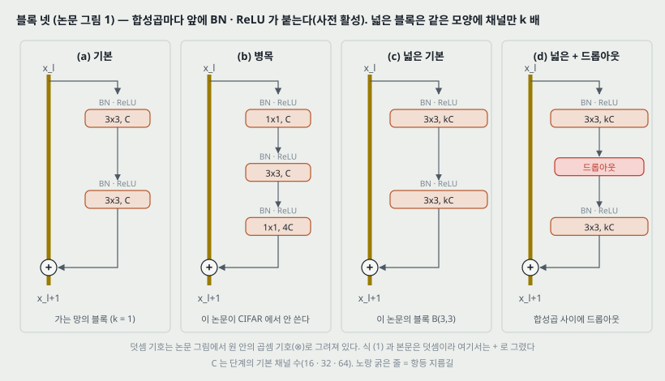

잔차 블록은

$$x_{l+1} = x_l + F(x_l, W_l) \qquad (1)$$

이다. $x_l$ 과 $x_{l+1}$ 은 $l$ 번째 블록의 입력과 출력, $F$ 는 잔차 함수, $W_l$ 은 블록의 파라미터다. **논문의 문장은 「$x_{l+1}$ 과 $x_l$ 은 입력과 출력」으로 순서가 뒤바뀌어 있다** — 식으로 보면 $x_l$ 이 입력이다.

**쓰지 않기로 한 둘.**

- **원래 순서(합성곱-BN-ReLU)**: 사전 활성 순서(BN-ReLU-합성곱)가 더 빨리 배워지고 결과가 좋다고 보고된 것을 따른다. **다만 ImageNet 망은 원래 순서를 쓴다** — 100 층 아래에서는 사전 활성이 차이를 내지 않았다고 3절에 적는다.
- **병목 블록**: 블록을 가늘게 해서 층을 늘리려고 만든 것이라, 넓히는 효과를 보려는 이 연구에서는 빼고 **기본 블록**만 다룬다(CIFAR). ImageNet 에서는 15절에서 다시 병목으로 돌아온다.

**그림 1 의 덧셈 기호.** 원 그림은 두 길이 만나는 자리를 **원 안의 곱셈 기호(⊗)** 로 그렸다. 식 (1) 과 본문은 덧셈이다. 위 그림은 + 로 다시 그렸다.

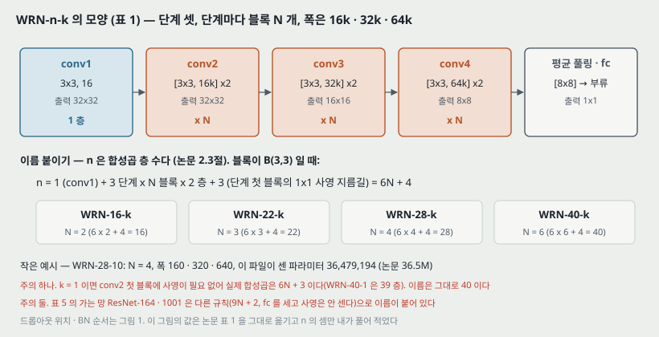

**표 1 — CIFAR 망의 모양.**

| 단계 | 출력 크기 | B(3,3) 블록 |
|---|---|---|
| conv1 | 32x32 | [3x3, 16] |
| conv2 | 32x32 | [3x3, 16k ; 3x3, 16k] x N |
| conv3 | 16x16 | [3x3, 32k ; 3x3, 32k] x N |
| conv4 | 8x8 | [3x3, 64k ; 3x3, 64k] x N |
| 평균 풀링 | 1x1 | [8x8] |

공간 크기를 줄이는 것은 conv3 · conv4 의 첫 층이다. conv1 의 크기(16 채널)는 모든 실험에서 고정이고 $k$ 는 conv2~4 에만 걸린다. $k = 1$ 이 원래 사전 활성 ResNet 이다.

**이름의 $n$ 을 세는 법 (논문은 적지 않았다, 내가 맞춘 것).** B(3,3) 이면 $n = 6N + 4$ 이다 — conv1 하나, 블록 안 $6N$, 그리고 세 단계 첫 블록의 1x1 사영 지름길 셋. 이렇게 세면 표 4 의 깊이 16 · 22 · 28 · 40 이 $N$ = 2 · 3 · 4 · 6 이 되고, 그 $N$ 으로 센 파라미터가 표 4 의 열 행과 모두 맞는다(6절). 블록 안 층이 $l$ 개이면

$$n = 3 l N + 4 \qquad (2)$$

이다. 작은 예시로, WRN-28-10 은 $3 \cdot 2 \cdot 4 + 4 = 28$.

---

## 5. 표현력을 늘리는 세 길과 두 인자 (2 · 2.3절)

**블록의 표현력을 늘리는 길 셋.**

1. 블록마다 합성곱 층을 더한다 → **깊이 인자 $l$**.
2. 합성곱 층에 특징 평면(채널)을 더한다 → **폭 인자 $k$**.
3. 커널을 키운다 → **다루지 않는다.** 3x3 같은 작은 커널이 여러 연구(VGG, Inception-v4)에서 효과적이었다는 이유다.

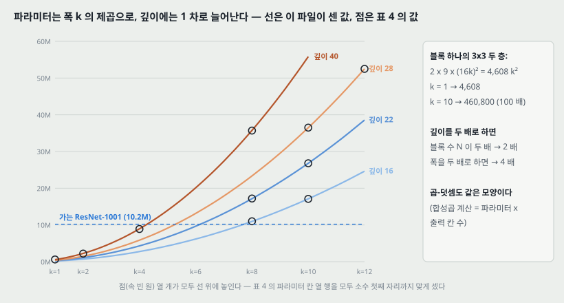

**파라미터와 계산은 $k$ 의 제곱으로 는다** (2.3절). 단계 $g$ ($g = 0, 1, 2$) 의 블록 하나는 채널 $C_g = 16k \cdot 2^g$ 인 3x3 두 층이라

$$P_{\text{블록}} \approx 2 \cdot 9 \cdot C_g^2 = 4{,}608 \, k^2 \cdot 4^g \qquad (3)$$

이다. 단계마다 블록 $N$ 개를 더하면 망 전체는 대략

$$P \approx 18 N (16k)^2 (1 + 4 + 16) = 96{,}768 \, N k^2 \qquad (4)$$

이다. 작은 예시로, WRN-28-10 은 $96{,}768 \times 4 \times 100 = 38{,}707{,}200$ 인데 정확히 세면 36,479,194 다. 식 (4) 가 6% 많은 것은 conv3 · conv4 첫 층의 입력 채널이 절반이라는 것을 빼서다. **식 (3) · (4) 는 내가 적은 것이고 논문은 「$k$ 에 대해 제곱」이라는 문장만 적는다.**

곧 **깊이를 두 배로 하면 파라미터가 두 배, 폭을 두 배로 하면 네 배**다. 그런데도 넓히는 쪽을 고르는 이유를 논문은 둘로 든다.

- **GPU 가 큰 텐서를 병렬로 처리하는 데 훨씬 효율적이다.** 작은 커널 수천 개를 차례로 거치는 것보다 층을 넓히는 쪽이 계산적으로 효과적이다(17절에서 잰다).
- **ResNet 이전의 성공한 망은 모두 넓었다.** Inception 과 VGG 가 그렇다. WRN-22-8 과 WRN-16-10 은 폭 · 깊이 · 파라미터 수가 VGG 와 매우 비슷하다고 적는다. **어느 VGG 와 어떻게 비슷한지는 수치가 없다.** 내 셈으로는 WRN-22-8 이 17.2M, WRN-16-10 이 17.1M 이고, VGG-16(ImageNet)은 1억 3800만이라 **파라미터 수로는 같은 칸이 아니다**(VGG 의 합성곱 부분만 세면 1,470 만 남짓이라 그쪽과는 가깝다. 논문이 어느 쪽을 뜻했는지는 적혀 있지 않다).

---

## 6. 파라미터를 직접 세서 맞춰 보기

`figures/BMVC16_WRN/make_figures.py` 가 표준 라이브러리로 센 값이다. **사전 활성 순서라 BN 을 합성곱의 입력 채널마다 둘씩**(γ, β) 세고, 합성곱에는 치우침이 없고, 마지막 BN 과 fc(치우침 있음)를 넣었다. ImageNet 망은 torchvision 과 맞춰 봤다(torchvision 0.26 의 `resnet18` · `resnet34` · `resnet50` · `resnet101` · `resnet152` · `wide_resnet50_2`).

**표 4 의 열 행 (CIFAR-10 머리)** — 모두 소수 첫째 자리까지 맞는다.

| 망 | N | 내 셈 | 논문 |
|---|---:|---:|---:|
| WRN-40-1 | 6 | 563,930 | 0.6M |
| WRN-40-2 | 6 | 2,243,546 | 2.2M |
| WRN-40-4 | 6 | 8,949,210 | 8.9M |
| WRN-40-8 | 6 | 35,748,314 | 35.7M |
| WRN-28-10 | 4 | 36,479,194 | 36.5M |
| WRN-28-12 | 4 | 52,517,850 | 52.5M |
| WRN-22-8 | 3 | 17,158,106 | 17.2M |
| WRN-22-10 | 3 | 26,797,914 | 26.8M |
| WRN-16-8 | 2 | 10,961,370 | 11.0M |
| WRN-16-10 | 2 | 17,116,634 | 17.1M |

CIFAR-100 머리로 세면 fc 가 늘어 5,850~57,690 개 많다(WRN-28-10 은 36,536,884). 반올림하면 같은 칸이다.

**가는 망 (표 5).** 사전 활성 병목 ResNet 을 깊이 $9N + 2$ 로 세면 ResNet-164($N = 18$) 1,703,258(논문 1.7M), ResNet-1001($N = 111$) 10,327,706(논문 10.2M). **1001 층은 내 셈이 0.13M 많다** — 반올림으로는 10.3 이 된다. 차이가 어디서 오는지(BN 을 어떻게 셌는지, 첫 블록 구성)는 원 논문을 봐야 가린다.

**본문의 배수 둘.** 「WRN-28-10 과 WRN-40-10 이 ResNet-1001 보다 파라미터가 각각 3.6 배와 5 배」 — 논문의 값으로 나누면 36.5 / 10.2 = 3.58, 56 / 10.2 = 5.49 다. **둘째는 5 가 아니라 5.5 배**다. 내 셈으로 WRN-40-10 은 55,841,754.

**ImageNet (표 7 · 8)** 은 14 · 15절에 함께 적는다. 요약하면 표 8 의 다섯이 모두 맞고(WRN-50-2 는 **68,883,240**, torchvision 의 `wide_resnet50_2` 와 한 자리까지 같다), 표 7 은 폭 2.0 · 3.0 에서 내 셈이 0.09~0.21M 많다.

---

## 7. 블록 종류 — 표 2 (2.1절 · 3절)

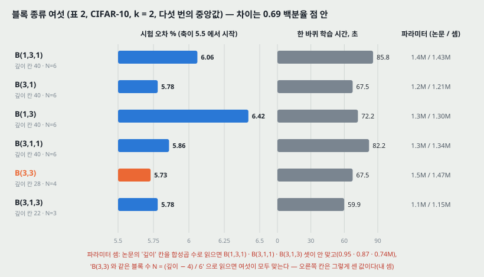

**물음.** 기본 블록의 3x3 두 층이 각각 얼마나 중요한가. 더 싼 1x1 로 바꾸거나 섞어도 되는가. 견준 여섯은

1. **B(3,3)** — 원래 기본 블록
2. **B(3,1,3)** — 1x1 하나를 사이에 더함
3. **B(1,3,1)** — 모든 층의 폭이 같은 「곧게 편 병목」
4. **B(1,3)** — 1x1 과 3x3 이 번갈아
5. **B(3,1)** — 4 와 같은 생각을 거꾸로
6. **B(3,1,1)** — Network-in-Network 꼴

이다. 모두 $k = 2$ 이고 블록 안 폭이 일정하다(병목처럼 줄였다 늘리지 않는다). **원문 5쪽에 「B(1,3) or B(1,3)」 으로 같은 것이 두 번 적힌 오기가 있다.**

**표 2 (CIFAR-10, 다섯 번의 중앙값, 시간은 한 바퀴 학습).**

| 블록 | 깊이 칸 | 파라미터 | 시간 (초) | 시험 오차 % |
|---|---:|---:|---:|---:|
| B(1,3,1) | 40 | 1.4M | 85.8 | 6.06 |
| B(3,1) | 40 | 1.2M | 67.5 | 5.78 |
| B(1,3) | 40 | 1.3M | 72.2 | 6.42 |
| B(3,1,1) | 40 | 1.3M | 82.2 | 5.86 |
| **B(3,3)** | 28 | 1.5M | 67.5 | **5.73** |
| B(3,1,3) | 22 | 1.1M | 59.9 | 5.78 |

**논문의 읽기.** B(3,3) 이 「작은 차이로」 가장 낫고, B(3,1) 과 B(3,1,3) 은 파라미터 · 층이 적으면서 B(3,3) 에 매우 가깝다. B(3,1,3) 이 조금 빠르다. 그래서 **파라미터가 비슷한 블록은 결과도 대체로 같다**고 보고, 뒤로는 다른 연구와 맞추려고 3x3 만 쓴다.

**내가 센 것 — 「깊이 칸」은 합성곱 수가 아니다.** 깊이 40 을 식 (2) 의 합성곱 수로 읽으면 3 층 블록 둘(B(1,3,1) · B(3,1,1))은 $N = 4$ 가 되어 파라미터가 0.95M · 0.87M 으로 표의 1.4M · 1.3M 과 안 맞는다. B(3,1,3) 의 깊이 22 도 $N = 2$ 면 0.74M 으로 1.1M 과 안 맞는다. 대신 **「B(3,3) 와 같은 블록 수 $N = (\text{깊이} - 4)/6$」으로 읽으면 여섯이 모두 맞는다**(1.43 · 1.21 · 1.30 · 1.34 · 1.47 · 1.15M). 그렇다면 B(1,3,1) · B(3,1,1) 은 실제로 합성곱이 **58 층**, B(3,1,3) 은 **31 층**이다. 본문의 「B(3,1,3) 이 층이 적다」(22 대 28)는 깊이 칸의 이름으로만 맞고, 이 읽기로는 오히려 많다. **이 읽기는 파라미터를 맞춰 본 내 추정이고, 논문은 어느 쪽으로 셌는지 적지 않는다.**

**차이의 크기.** 여섯의 범위가 5.73~6.42, 0.69 백분율 점이다. 「가장 낫다」는 B(3,3) 와 다음 둘(5.78)의 차이는 0.05 다. 다섯 번의 중앙값이지만 흩어짐이 없어, **0.05 가 실행마다 흔들리는 폭 안인지 밖인지 이 표로는 모른다.**

---

## 8. 블록 안 합성곱 수 l — 표 3 (2.2절 · 3절)

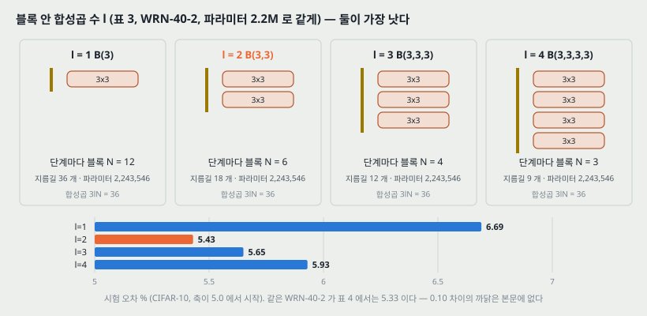

**물음.** 블록 하나에 3x3 을 몇 층 넣는가. **파라미터 수를 맞춰야 비교가 된다**고 2.2절에 적고, 그러려면 $l$ 이 늘 때 블록 수를 줄여야 한다.

**표 3 (WRN-40-2, 2.2M, CIFAR-10, 다섯 번의 중앙값).**

| $l$ | 블록 | 단계당 블록 $N$ (내 셈) | 지름길 수 | 시험 오차 % |
|---:|---|---:|---:|---:|
| 1 | B(3) | 12 | 36 | 6.69 |
| **2** | **B(3,3)** | 6 | 18 | **5.43** |
| 3 | B(3,3,3) | 4 | 12 | 5.65 |
| 4 | B(3,3,3,3) | 3 | 9 | 5.93 |

$3 l N = 36$ 이 되는 $N$ 을 고르면 넷 모두 파라미터가 **정확히 2,243,546** 으로 같고 합성곱도 40 층으로 같다 — **이 비교는 파라미터와 층 수가 모두 맞춰져 있다.** 이 노트에서 가장 깨끗한 대조다.

**논문의 읽기.** B(3,3) 이 가장 낫고, B(3,3,3) · B(3,3,3,3) 은 **잔차 연결 수가 줄어 최적화가 어려워졌을 것**이라고 추측한다(speculate). B(3) 은 꽤 나쁘다. 그래서 뒤로는 B(3,3) 만 쓴다.

**층 하나짜리 블록이 나쁜 것은 ResNet 논문의 관찰과 같은 자리다.** 그 논문은 $F$ 가 한 층이면 블록이 선형 층과 비슷해져 이점을 못 봤다고 적었다. 여기서는 그것이 **6.69 대 5.43, 1.26 백분율 점**으로 잰 값이 된다.

**같은 망의 두 값.** $l = 2$ 의 WRN-40-2 가 여기서 5.43, 표 4 에서 5.33 이다. 표 3 은 전처리를 적지 않았고 표 4 는 ZCA 다. **0.10 의 차이가 어디서 오는지 본문에 없다.**

---

## 9. 폭 — 표 4 (2.3절 · 3절)

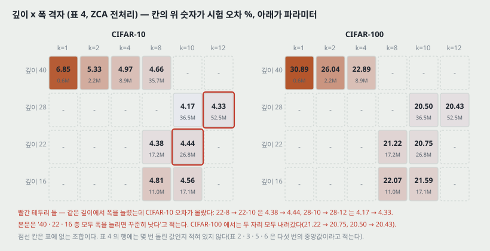

$k$ 를 2~12, 깊이를 16~40 으로 바꿨다. **폭을 늘리면 층을 줄여야 한다**(파라미터가 제곱으로 늘어서)고 적는다.

**표 4 (ZCA 전처리, 시험 오차 %).**

| 깊이 | k | 파라미터 | CIFAR-10 | CIFAR-100 |
|---:|---:|---:|---:|---:|
| 40 | 1 | 0.6M | 6.85 | 30.89 |
| 40 | 2 | 2.2M | 5.33 | 26.04 |
| 40 | 4 | 8.9M | 4.97 | 22.89 |
| 40 | 8 | 35.7M | 4.66 | - |
| 28 | 10 | 36.5M | **4.17** | 20.50 |
| 28 | 12 | 52.5M | 4.33 | **20.43** |
| 22 | 8 | 17.2M | 4.38 | 21.22 |
| 22 | 10 | 26.8M | 4.44 | 20.75 |
| 16 | 8 | 11.0M | 4.81 | 22.07 |
| 16 | 10 | 17.1M | 4.56 | 21.59 |

**논문의 읽기 둘.**

- 40 · 22 · 16 층 모두 **폭을 1 배에서 12 배로 늘리면 꾸준히 나아진다**(consistent gains).
- $k$ 를 8 이나 10 으로 고정하고 깊이를 16 → 28 로 늘리면 꾸준히 나아지지만 40 으로 가면 나빠진다(WRN-40-8 4.66 이 WRN-22-8 4.38 보다 높다).

**표와 맞춰 보면.**

- **「꾸준히」에 어긋나는 칸이 CIFAR-10 에 둘 있다.** 22-8 → 22-10 이 4.38 → 4.44(+0.06), 28-10 → 28-12 가 4.17 → 4.33(+0.16). CIFAR-100 에서는 두 자리 모두 내려간다(21.22 → 20.75, 20.50 → 20.43). 40 층 행(1 → 2 → 4 → 8)은 꾸준히 내려간다.
- **「$k$ = 8 로 고정하고 16 → 28」의 28-8 칸이 표에 없다.** $k = 8$ 은 16 · 22 · 40 만 있다.
- **표 4 의 행에는 몇 번 돌린 값인지 적혀 있지 않다.** 표 2 · 3 · 5 · 6 의 캡션은 「다섯 번의 중앙값」이라고 적는다.

**요약 셋 (원문 9쪽의 글머리표).**

1. 폭을 늘리면 깊이가 다른 잔차 망 모두에서 꾸준히 나아진다.
2. 깊이와 폭을 함께 늘리는 것은 **파라미터가 너무 많아져 더 강한 정칙화가 필요해질 때까지** 도움이 된다.
3. 아주 깊은 것에서 오는 정칙화 효과는 없어 보인다. 같은 파라미터의 넓은 망이 가는 망만큼이나 그보다 나은 표현을 배운다. 그리고 넓은 망은 두 배 이상의 파라미터도 배우는데, 가는 망이 그만큼 가려면 깊이를 두 배로 해야 해서 학습 비용이 감당이 안 된다.

---

## 10. 가는 망 대 넓은 망 — 표 5 (3절)

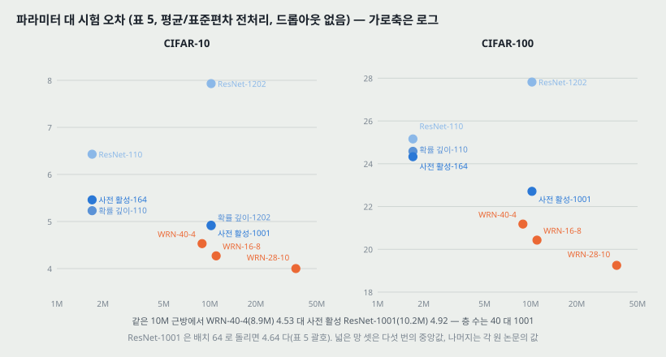

**표 5 (평균·표준편차 전처리, 뒤집기 · 옮기기 늘리기, 드롭아웃 없음, 시험 오차 %).** 넓은 망 셋은 다섯 번의 중앙값이고, 다른 행은 각 원 논문의 값이다.

| 방법 | 깊이-k | 파라미터 | CIFAR-10 | CIFAR-100 |
|---|---|---:|---:|---:|
| NIN | | | 8.81 | 35.67 |
| DSN | | | 8.22 | 34.57 |
| FitNet | | | 8.39 | 35.04 |
| Highway | | | 7.72 | 32.39 |
| ELU | | | 6.55 | 24.28 |
| 원래 ResNet | 110 | 1.7M | 6.43 | 25.16 |
| 원래 ResNet | 1202 | 10.2M | 7.93 | 27.82 |
| 확률 깊이 | 110 | 1.7M | 5.23 | 24.58 |
| 확률 깊이 | 1202 | 10.2M | 4.91 | - |
| 사전 활성 ResNet | 110 | 1.7M | 6.37 | - |
| 사전 활성 ResNet | 164 | 1.7M | 5.46 | 24.33 |
| 사전 활성 ResNet | 1001 | 10.2M | 4.92 (4.64) | 22.71 |
| **WRN** | 40-4 | 8.9M | 4.53 | 21.18 |
| **WRN** | 16-8 | 11.0M | 4.27 | 20.43 |
| **WRN** | 28-10 | 36.5M | **4.00** | **19.25** |

괄호의 4.64 는 ResNet-1001 을 **배치 64** 로 돌린 값이다. 이 논문의 모든 실험은 배치 128 이라, 같은 배치로 견주려고 128 의 값(4.92)을 표의 앞에 둔다.

**논문의 읽기.**

- **WRN-40-4(8.9M)가 ResNet-1001(10.2M)보다 두 데이터 모두 낮다**(4.53 대 4.92, 21.18 대 22.71). 파라미터가 비슷하므로 「이 수준에서는 깊이가 폭에 견줘 정칙화 효과를 더하지 않는다」고 읽는다. 그리고 WRN-40-4 가 8 배 빨리 배워진다(17절)니 **원래 가는 잔차 망의 깊이 대 폭 비는 최적과 멀다.**
- **WRN-28-10 은 ResNet-1001 보다 CIFAR-10 0.92, CIFAR-100 3.46 낮고 층이 36 분의 1 이다.** 뺄셈은 맞다(4.92 − 4.00, 22.71 − 19.25). 층 비는 1001 / 28 = 35.75.
- **「깊이는 정칙화를, 폭은 과적합을 준다」는 이전 주장과 달리** 파라미터가 ResNet-1001 의 몇 배인 망도 배워진다.
- 평균·표준편차 전처리로는 더 넓고 깊은 망이 더 잘 배워지고, **WRN-40-10(56M)이 CIFAR-100 에서 18.3%** 를 낸다(표 9, 드롭아웃 포함). ResNet-1001 보다 4.4 낮다(22.71 − 18.3 = 4.41).

**「깊이가 정칙화를 더하지 않는다」를 받치는 것은 한 쌍의 비교다.** WRN-40-4 대 ResNet-1001 하나이고, 파라미터는 8.9 대 10.2 로 0.87 배다. 넓은 쪽이 다섯 번의 중앙값, 가는 쪽은 원 논문 값이라 **같은 조건에서 몇 번씩 돌린 대조가 아니다.** 0.39 의 차이를 판정할 흩어짐도 없다.

---

## 11. 학습 곡선과 「거슬리는 효과」 — 그림 2 (3절)

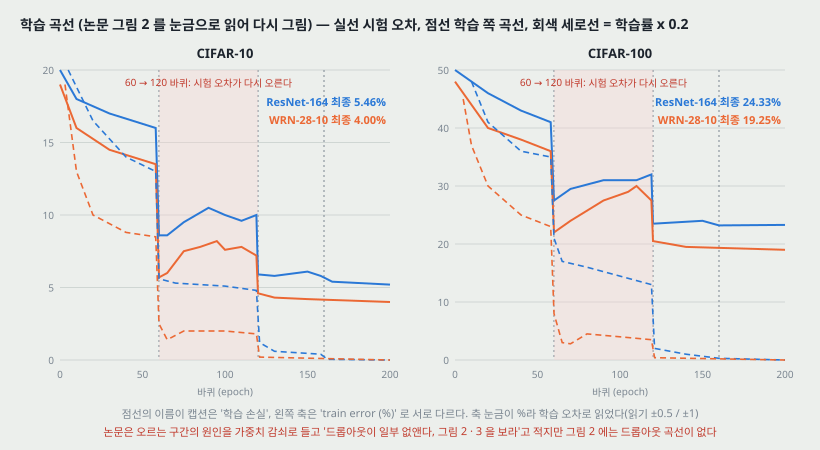

그림 2 는 사전 활성 ResNet-164 와 WRN-28-10 의 곡선이다. 학습률은 60 · 120 · 160 바퀴에서 0.2 배로 줄인다(18절). 다시 그린 값은 300 · 400 dpi 로 눈금을 읽은 것이다(CIFAR-10 읽기 ±0.5, CIFAR-100 읽기 ±1). 첫 60 바퀴의 들쭉날쭉은 가운데를 지나는 선으로 줄였다.

| 읽은 값 (시험 오차 %) | 60 바퀴 직후 | 60~120 의 꼭대기 근처 | 120 바퀴 직후 | 최종 (캡션) |
|---|---:|---:|---:|---:|
| CIFAR-10 ResNet-164 | 8.6 | 10.5 | 5.9 | 5.46 |
| CIFAR-10 WRN-28-10 | 5.7 | 8.2 | 4.6 | 4.00 |
| CIFAR-100 ResNet-164 | 27.5 | 32 | 23.5 | 24.33 |
| CIFAR-100 WRN-28-10 | 22 | 30 | 20.5 | 19.25 |

**보이는 것 셋.**

1. **첫 학습률 낮춤 뒤에 시험 오차가 다시 오른다.** WRN-28-10 의 CIFAR-10 이 5.7 → 8.2 로 2.5 백분율 점 오르고, 다음 낮춤에서 내려간다. 논문은 이것을 「거슬리는 효과(disturbing effect)」라 부르고 **원인을 가중치 감쇠로 찾았다**고 적는다. 그런데 가중치 감쇠를 낮추면 정확도가 크게 떨어진다고 한다. **원인을 확인한 실험(감쇠를 바꾼 곡선)은 본문에 없다.**
2. **넓은 망의 학습 쪽 곡선이 60 바퀴 뒤 1.5~2.0 근방까지 내려간다**(CIFAR-10). 가는 망은 5 근방이다. 넓은 망이 학습 집합을 더 빨리 맞춘다.
3. **최종 값의 차이는 첫 60 바퀴부터 벌어져 있다.** 60 바퀴 직후에 이미 2.9 백분율 점 차이(8.6 대 5.7)가 나고 끝에서 1.46 이다.

**캡션과 축이 어긋난다.** 캡션은 점선을 「학습 손실(training loss), 왼쪽 축」이라 적는데 왼쪽 축 이름은 「train error (%)」이고 눈금이 퍼센트다. 위 그림은 축 이름을 따라 학습 오차로 읽었다.

**캡션이 가리키는 그림이 다르다.** 3절의 「드롭아웃이 이 효과를 대부분 경우에 일부 없앤다, 그림 2 · 3 을 보라」에서 **그림 2 에는 드롭아웃 곡선이 없다.** 그림 3 오른쪽(13절)만 드롭아웃을 견준다.

---

## 12. 블록 안 드롭아웃 — 2.4절 · 표 6

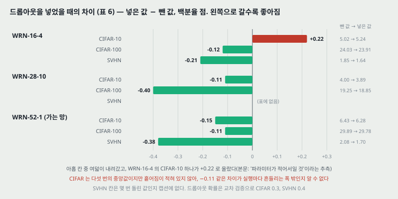

**왜 넣는가.** 넓히면 파라미터가 늘어나니 정칙화가 필요하다. 잔차 망에는 이미 BN 이 정칙화 효과를 주지만 **센 데이터 늘리기가 함께 있어야 하고, 그것을 늘 할 수는 없다**고 적는다.

**어디에 넣는가.** 블록 안 **두 합성곱 사이, ReLU 뒤**(그림 1(d)). ReLU 뒤라서 **다음 블록의 BN 을 흔들어 과적합을 막는다**고 설명한다. 아주 깊은 망에서는 특징 재사용 감소를 다루는 데도 도울 것이라고 적는다(같은 자리의 실험은 없다).

**앞선 연구와 다른 자리.** 사전 활성 ResNet 논문은 드롭아웃을 **항등 지름길 쪽**에 넣어 나쁜 결과를 봤다. 이 논문은 **잔차 가지 안**에 넣는다.

**설정.** 확률은 교차 검증으로 CIFAR 0.3, SVHN 0.4. 드롭아웃을 넣어도 학습 바퀴 수를 늘리지 않았다.

**표 6 (평균·표준편차 전처리, CIFAR 는 다섯 번의 중앙값).**

| 깊이 | k | 드롭아웃 | CIFAR-10 | CIFAR-100 | SVHN |
|---:|---:|---|---:|---:|---:|
| 16 | 4 | 없음 | 5.02 | 24.03 | 1.85 |
| 16 | 4 | 있음 | 5.24 | 23.91 | 1.64 |
| 28 | 10 | 없음 | 4.00 | 19.25 | - |
| 28 | 10 | 있음 | 3.89 | 18.85 | - |
| 52 | 1 | 없음 | 6.43 | 29.89 | 2.08 |
| 52 | 1 | 있음 | 6.28 | 29.78 | 1.70 |

**차이 (있음 − 없음, 백분율 점).**

| 망 | CIFAR-10 | CIFAR-100 | SVHN |
|---|---:|---:|---:|
| WRN-16-4 | **+0.22** | −0.12 | −0.21 |
| WRN-28-10 | −0.11 | −0.40 | - |
| WRN-52-1 (가는 망) | −0.15 | −0.11 | −0.38 |

**논문의 읽기.** WRN-28-10 에서 CIFAR-10 0.11 · CIFAR-100 0.4 를 내리고 다른 망에서도 나아진다. CIFAR-100 에서 20% 에 다가선 첫 결과이고 센 늘리기를 쓴 방법들보다도 낫다. **WRN-16-4 의 CIFAR-10 만 조금 나빠졌는데 파라미터가 비교적 적어서일 것이라고 추측한다.** 드롭아웃은 BN 과 함께 쓰는 것에 대한 반론이 있지만 **가는 망과 넓은 망 모두에 효과적인 정칙화**이고 넓히기와 보완적이라고 맺는다.

**표와 맞춰 보면.** 여덟 칸이 내려가고 한 칸이 올랐다. **1절(기여 목록)의 「꾸준한 이득(consistent gains)」은 그 한 칸과 어긋난다.** 그리고 CIFAR 의 차이가 0.11~0.40 이라 크기가 표 2 의 블록 간 차이(0.05~0.69)와 같은 범위인데, **어느 표에도 흩어짐이 없다.** 그래서 이 노트는 「드롭아웃이 낫다」가 아니라 **「아홉 칸 중 여덟에서 중앙값이 내려갔다」**로 적는다.

---

## 13. SVHN — 그림 3 (3절)

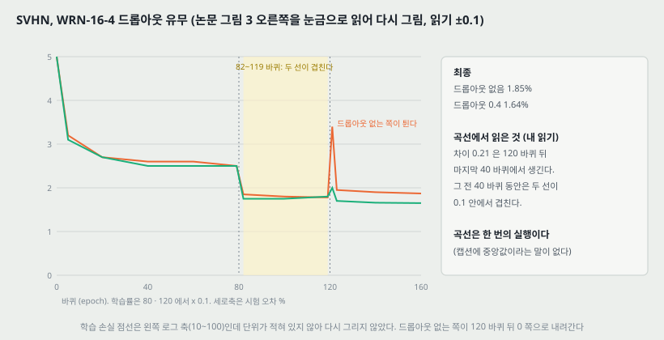

**데이터.** Google 스트리트뷰 집 번호 숫자 약 60 만 장. **전처리는 255 로 나누어 [0, 1] 로 만드는 것뿐이고 늘리기가 없다.** 그래서 BN 이 과적합하고 드롭아웃이 정칙화 효과를 더 분명히 낸다고 본다. 학습 집합에 추가 집합(extra)까지 넣었는지는 「약 600,000 장」이라는 수로 짐작할 뿐 적혀 있지 않다.

**결과.** 가는 50 층 망도 드롭아웃을 넣으면 확률 깊이의 가는 152 층 망을 넘는다고 적는다(그 152 층의 수치는 이 논문에 없다). WRN-16-8 에 드롭아웃을 넣어 **1.54%**(없으면 1.81%)로 저자들이 아는 한 가장 좋은 결과다.

**그림 3 을 읽은 것 (오른쪽, WRN-16-4 드롭아웃 유무, 읽기 ±0.1).** 학습률은 80 · 120 에서 0.1 배다.

| 구간 | 드롭아웃 없음 | 드롭아웃 0.4 |
|---|---:|---:|
| 1~79 바퀴 | 2.5~3.0 들쭉날쭉 | 같은 모양 |
| 82~119 바퀴 | 1.8 | 1.75 |
| 121 바퀴 | **3.4 로 튐** | 2.0 |
| 최종 | 1.85 | 1.64 |

**내가 읽은 것.** 최종 차이 0.21 은 **마지막 40 바퀴에서 생긴다.** 그 전 40 바퀴 동안은 두 선이 0.1 안에서 겹친다. 그리고 드롭아웃 없는 쪽이 둘째 학습률 낮춤 직후에 튀었다가 내려온다. 학습률을 **낮췄는데** 튀는 것은 11절의 「거슬리는 효과」와 같은 자리일 수 있지만, 논문은 이 튐을 따로 설명하지 않는다. **곡선은 한 번의 실행이다**(캡션에 중앙값이라는 말이 없다).

**왼쪽 그림의 이름.** 왼쪽은 「ResNet-50(오차 2.07%)」 대 WRN-16-4 다. 표 6 의 가는 망은 깊이 52 로 2.08 이다. **이름(50 대 52)과 값(2.07 대 2.08)이 조금씩 다르다.**

**학습 손실 축.** 왼쪽 로그 축이 10~100 인데 단위가 없다. 교차 엔트로피라면 이 값이 나오기 어려워 **합한 손실이거나 다른 척도**일 텐데 적혀 있지 않아 다시 그리지 않았다.

---

## 14. ImageNet — 병목 없는 망의 폭 (표 7)

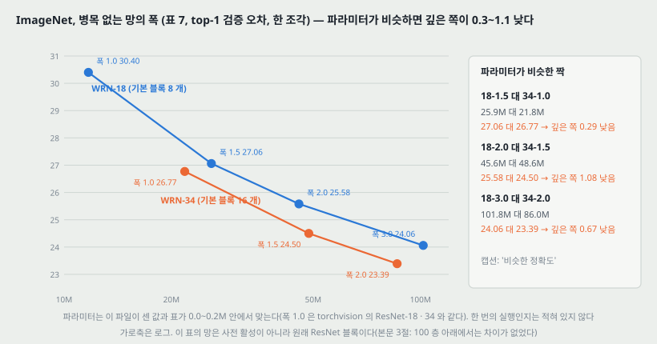

ResNet-18 · 34(기본 블록, 병목 없음)의 폭을 1.0 에서 3.0 까지 늘렸다. **이 망들은 사전 활성이 아니라 원래 ResNet 블록이다.**

**표 7 (ILSVRC-2012 검증 오차, 한 조각, top-1 / top-5 %).**

| 폭 | 1.0 | 1.5 | 2.0 | 3.0 |
|---|---|---|---|---|
| WRN-18 | 30.4 / 10.93 | 27.06 / 9.0 | 25.58 / 8.06 | 24.06 / 7.33 |
| 파라미터 (논문) | 11.7M | 25.9M | 45.6M | 101.8M |
| 파라미터 (내 셈) | 11,689,512 | 25,901,896 | 45,693,032 | 102,011,560 |
| WRN-34 | 26.77 / 8.67 | 24.5 / 7.58 | 23.39 / 7.00 | |
| 파라미터 (논문) | 21.8M | 48.6M | 86.0M | |
| 파라미터 (내 셈) | 21,797,672 | 48,639,688 | 86,110,824 | |

내 셈은 conv1 부터 fc 까지 **모든 폭에 같은 배수**를 걸었다. 폭 1.0 은 torchvision 의 `resnet18` · `resnet34` 와 같다. 폭 2.0 · 3.0 에서 0.09~0.21M 많은데, 배수를 어디에 걸었는지(첫 합성곱이나 fc 를 넓혔는지) 논문이 적지 않아 가르지 못했다. 차이는 0.2% 안이다.

**논문의 읽기.** 폭을 늘리면 두 망 모두 정확도가 점점 오르고, **파라미터가 비슷한 망은 깊이가 달라도 비슷한 결과를 낸다**(캡션: 층이 두 배 적어도).

**파라미터가 비슷한 짝 셋을 맞대 보면 깊은 쪽이 매번 낮다.**

| 짝 | 파라미터 | top-1 | 깊은 쪽이 낮은 폭 |
|---|---|---|---:|
| WRN-18 폭 1.5 대 WRN-34 폭 1.0 | 25.9M 대 21.8M | 27.06 대 26.77 | 0.29 |
| WRN-18 폭 2.0 대 WRN-34 폭 1.5 | 45.6M 대 48.6M | 25.58 대 24.50 | 1.08 |
| WRN-18 폭 3.0 대 WRN-34 폭 2.0 | 101.8M 대 86.0M | 24.06 대 23.39 | 0.67 |

셋째 짝은 **깊은 쪽이 파라미터가 0.84 배인데도** 0.67 낮다. 「비슷하다」를 어디까지로 볼지 논문이 정하지 않았고 흩어짐도 없지만, 세 짝 모두 방향이 같다. **ImageNet 에서는 CIFAR 의 「깊이가 덧붙는 것이다」가 그대로 서지 않는다** — 논문도 바로 뒤에 「CIFAR 와 달리 ImageNet 망은 같은 깊이에서 더 많은 폭이 있어야 같은 정확도에 닿는다」고 적는다.

**병목 망이 이긴다.** 이 망들은 파라미터가 많은데도 병목 망(표 8)에 진다. 논문은 이유를 둘 중 하나로 본다 — 병목 구조가 ImageNet 분류에 그냥 더 맞거나, 이 어려운 과제가 더 깊은 망을 필요로 하거나. 이것을 가르려고 15절의 실험을 한다.

---

## 15. ImageNet — 병목 망과 WRN-50-2 (표 8)

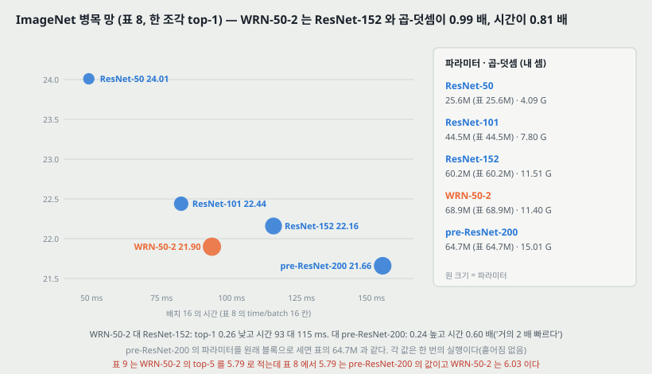

**만든 것.** ResNet-50 을 가져와 **안쪽 3x3 층의 폭을 늘렸다.** 폭 인자 2.0 이면 WRN-50-2-bottleneck 이 된다.

**표 8 (ILSVRC-2012 검증, 한 조각).** 시간은 배치 16 의 값(ms)이다. 곱-덧셈과 파라미터는 내 셈이다.

| 모델 | top-1 % | top-5 % | 파라미터 (논문) | 파라미터 (내 셈) | 곱-덧셈 (내 셈) | 시간 |
|---|---:|---:|---:|---:|---:|---:|
| ResNet-50 | 24.01 | 7.02 | 25.6M | 25,557,032 | 4.09 G | 49 |
| ResNet-101 | 22.44 | 6.21 | 44.5M | 44,549,160 | 7.80 G | 82 |
| ResNet-152 | 22.16 | 6.16 | 60.2M | 60,192,808 | 11.51 G | 115 |
| **WRN-50-2** | **21.9** | 6.03 | 68.9M | **68,883,240** | 11.40 G | 93 |
| pre-ResNet-200 | 21.66 | 5.79 | 64.7M | 64,673,832 | 15.01 G | 154 |

내 셈은 보폭 2 를 3x3 에 두었다(torchvision 과 같다. 보폭을 첫 1x1 에 두는 원 ResNet 논문의 셈과는 곱-덧셈만 다르다). pre-ResNet-200 은 블록 수 [3, 24, 36, 3] 의 병목으로 셌다.

**논문의 읽기.**

- WRN-50-2 는 **층이 3 분의 1 인데 ResNet-152 를 넘고 훨씬 빠르다.** 차이는 top-1 0.26, 시간 93 대 115 ms 로 **0.81 배**다.
- 가장 좋은 사전 활성 ResNet-200 보다 **조금 나쁘고 거의 2 배 빠르다.** 시간은 93 / 154 = **0.60 배**(1.66 배 빠름), top-1 은 0.24 높다. 파라미터는 조금 많다(68.9 대 64.7).
- 계산상의 이유로 **50 층보다 깊은 잔차 망은 필요 없다는 것이 분명하다**고 적는다.
- 8-GPU 기계가 필요해서 더 큰 병목 망은 배우지 않았다.

**내 셈으로 보탠 것.** WRN-50-2 와 ResNet-152 는 **곱-덧셈이 0.99 배(11.40 대 11.51 G)** 다. 그러니 「훨씬 빠르다」는 계산을 덜 해서가 아니라 **같은 계산을 층 50 개로 나눠 하느냐 152 개로 나눠 하느냐**의 차이다. 17절의 CIFAR 쪽 관찰과 같은 모양이다. 그리고 파라미터는 WRN-50-2 가 1.14 배 많다.

**「50 층보다 깊을 필요가 없다」의 근거.** 같은 계산량에서 WRN-50-2 가 ResNet-152 보다 top-1 0.26 낮다는 한 행이고, 한 번의 실행이다. 더 넓은 50 층(예를 들어 폭 3)이나 넓힌 101 층은 재지 않았다(8-GPU 이유). **「필요 없다」는 이 표가 닿은 범위보다 센 말**이라 이 노트는 「50 층 넓은 망이 152 층 가는 망과 같은 계산으로 0.26 낮았다」로 적는다.

### 15.1 WRN-50-2 는 병목의 어디를 넓혔나

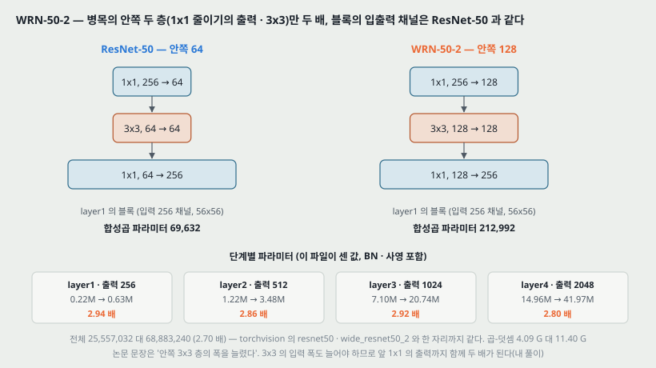

논문 문장은 「안쪽 3x3 층의 폭을 늘렸다」 한 줄이다. 3x3 층의 **입력과 출력** 둘 다 넓어져야 하므로, 앞 1x1(줄이기)의 출력과 뒤 1x1(늘리기)의 입력이 함께 두 배가 된다. **블록의 입출력 채널(256 · 512 · 1,024 · 2,048)은 그대로다.** torchvision 의 `wide_resnet50_2` 도 이렇게 만들어져 있고(층 하나를 찍어 보면 `layer2[0]` 이 1x1 256→256, 3x3 256→256, 1x1 256→512), 파라미터 68,883,240 이 표 8 의 68.9M 과 같다.

**단계별 파라미터 (내 셈, BN · 사영 포함).**

| 단계 | 안쪽 폭 (R50 → WRN) | 출력 채널 | 224 입력의 출력 | ResNet-50 | WRN-50-2 | 배수 |
|---|---|---:|---|---:|---:|---:|
| layer1 | 64 → 128 | 256 | 56x56 | 215,808 | 634,368 | 2.94 |
| layer2 | 128 → 256 | 512 | 28x28 | 1,219,584 | 3,482,624 | 2.86 |
| layer3 | 256 → 512 | 1,024 | 14x14 | 7,098,368 | 20,736,000 | 2.92 |
| layer4 | 512 → 1,024 | 2,048 | 7x7 | 14,964,736 | 41,971,712 | 2.80 |

3x3 은 폭의 제곱으로 4 배, 두 1x1 은 한쪽만 넓어져 2 배라 블록 전체가 3 배 남짓이다. 작은 예시로, layer1 의 블록 하나는 합성곱만 세면 $256 \cdot 64 + 9 \cdot 64^2 + 64 \cdot 256 = 69{,}632$ 에서 $256 \cdot 128 + 9 \cdot 128^2 + 128 \cdot 256 = 212{,}992$ 로 3.06 배다. conv1 과 fc 는 그대로라 망 전체로는 **2.70 배**다.

**CIFAR 의 WRN-n-k 와 이름 규칙이 다르다.** CIFAR 망은 $k$ 를 블록의 모든 합성곱에 걸지만(블록 입출력도 넓어진다), WRN-50-2 는 **병목 안쪽에만** 건다. 그리고 50 은 원래 ResNet-50 의 이름을 그대로 쓴 것이라 식 (2) 의 $n$ 이 아니다.

### 15.2 torchvision 가중치와의 관계

torchvision 의 `Wide_ResNet50_2_Weights.IMAGENET1K_V1` 메타데이터는 top-1 정확도 78.468%(오차 **21.53%**)를 적는다. 표 8 의 21.9 와 **0.37 다르다.** 그래서 이 노트는 **torchvision 가중치를 이 논문의 학습 실행과 같은 것으로 보지 않는다** — 모양과 파라미터 수가 같은 것까지만 확인했다. 메타데이터가 가리키는 학습 기록은 torchvision 저장소의 풀 리퀘스트 912 이고, 이 노트는 그 기록을 읽지 않았다.

---

## 16. COCO 와 최고 결과 모음 (표 9)

**COCO 2016 검출 대회.** WRN-34-2(넓힌 기본 블록)를 MultiPathNet · LocNet 과 함께 썼다. 34 층뿐인데 **단일 모델로 최고 성능**이고 ResNet-152 와 Inception-v4 기반 모델보다 낫다고 적는다. **견준 모델의 수치는 이 논문에 없다.** 표 9 캡션에 따르면 후보 영역은 **VGG-16 기반 AttractioNet**, 위치 보정은 LocNet 꼴이라, 35.2 mAP 에 WRN 백본이 낸 몫이 얼마인지는 이 설정으로 가를 수 없다.

**표 9 (데이터마다 가장 좋은 WRN, 한 번의 실행).**

| 데이터 | 모델 | 드롭아웃 | 시험 성능 |
|---|---|---|---|
| CIFAR-10 | WRN-40-10 | 있음 | 3.8% |
| CIFAR-100 | WRN-40-10 | 있음 | 18.3% |
| SVHN | WRN-16-8 | 있음 | 1.54% |
| ImageNet (한 조각) | WRN-50-2-bottleneck | | 21.9% top-1, **5.79% top-5** |
| COCO test-std | WRN-34-2 | | 35.2 mAP |

**표 9 의 ImageNet top-5 는 표 8 과 다르다.** 표 8 에서 WRN-50-2 의 top-5 는 **6.03** 이고, **5.79 는 pre-ResNet-200 의 값**이다. 한 칸이 옆 행에서 옮겨 적힌 것으로 보인다(22절).

**한 번 대 중앙값.** 표 9 의 캡션은 「한 번의 실행 결과」라고 적는다. 표 5 · 6 은 다섯 번의 중앙값이다. 그래서 CIFAR-10 3.8 은 중앙값들(3.89 등)과 같은 잣대가 아니다.

---

## 17. 계산 효율 — 그림 4

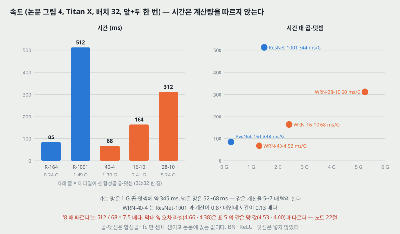

**논문의 주장.** 작은 커널을 쓰는 가늘고 깊은 망은 **차례로 계산하는 구조라 GPU 계산의 성질과 맞지 않는다.** 폭을 늘리면 계산을 훨씬 알맞게 나눌 수 있다.

**잰 것.** cuDNN v5, Titan X, 배치 32, 앞+뒤 갱신 한 번의 시간.

| 망 | 시간 (ms) | 막대 옆 오차 라벨 | 같은 망의 표 5 값 | 곱-덧셈 (내 셈) | ms / G |
|---|---:|---:|---:|---:|---:|
| ResNet-164 (가는) | 85 | 5.46 | 5.46 | 0.245 G | 348 |
| ResNet-1001 (가는) | 512 | 4.64 | 4.92 (배치 64 면 4.64) | 1.488 G | 344 |
| WRN-40-4 | 68 | 4.66 | 4.53 | 1.299 G | 52 |
| WRN-16-10 | 164 | 4.56 | (표 4 의 4.56) | 2.412 G | 68 |
| WRN-28-10 | 312 | 4.38 | 4.00 | 5.243 G | 60 |

곱-덧셈은 32x32 한 장에 합성곱과 fc 만 센 내 셈이다. BN · ReLU · 덧셈은 넣지 않았다. 논문에는 계산량 값이 없다.

**논문의 읽기.** 가장 좋은 CIFAR 넓은 망 WRN-28-10 이 ResNet-1001 보다 1.6 배 빠르고(512 / 312 = 1.64), 정확도가 거의 같은 WRN-40-4 는 **8 배 빠르다.** 시험 시간은 이 시간의 일정한 비율이라고 적는다.

**내 셈으로 보탠 것.**

- **「8 배」는 512 / 68 = 7.5 배다.**
- **시간은 계산량을 따르지 않는다.** 가는 망 둘은 1 G 곱-덧셈에 344~348 ms, 넓은 망 셋은 52~68 ms 다. **같은 계산을 5~7 배 빨리 한다.** WRN-40-4 는 ResNet-1001 과 계산이 0.87 배인데 시간이 0.13 배다. 그러니 이 그림이 보이는 것은 「넓은 망이 계산을 덜 한다」가 아니라 **「같은 계산량이면 층 수가 적고 텐서가 큰 쪽이 GPU 에서 빨리 돈다」** 이다. 논문의 설명(병렬성)과 같은 방향이고, 계산량을 따로 세어 그 설명을 숫자로 받친 것이 이 노트의 몫이다.
- **막대 옆 오차 라벨 둘이 표 5 와 다르다.** WRN-40-4 는 4.66(표 5 4.53, 표 4 4.97), WRN-28-10 은 4.38(표 5 4.00, 표 4 4.17)이다. 4.66 은 표 4 의 WRN-40-8, 4.38 은 표 4 의 WRN-22-8 값과 같다. ResNet-1001 은 배치 64 의 값(4.64)이 붙어 있다. **그림의 라벨을 표에서 가져오면서 행이 어긋난 것으로 보인다**(22절).
- 그림의 가로축은 「1004」인데 본문과 캡션은 ResNet-1001 이다.

---

## 18. 구현 설정 (3절 끝)

| 항목 | 값 |
|---|---|
| 최적화 | 네스테로프 모멘텀 SGD, 교차 엔트로피 |
| 첫 학습률 | 0.1 (SVHN 0.01) |
| 가중치 감쇠 | 0.0005 |
| 모멘텀 · 감쇠(dampening) | 0.9 · 0 |
| 미니배치 | 128 |
| CIFAR 일정 | 60 · 120 · 160 바퀴에서 x 0.2, 모두 200 바퀴 |
| SVHN 일정 | 80 · 120 바퀴에서 x 0.1, 모두 160 바퀴 |
| CIFAR 늘리기 | 좌우 뒤집기, 4 픽셀 반사 채움 후 무작위 자르기. 센 늘리기는 안 씀 |
| CIFAR 전처리 | 기본 ZCA 백색화. 다른 ResNet 연구와 견줄 때(표 5 · 6)는 평균·표준편차 |
| SVHN 전처리 | 255 로 나누기만 |
| 드롭아웃 확률 | CIFAR 0.3, SVHN 0.4 (교차 검증) |
| 구현 | Torch, 메모리 줄이기에 optnet, ImageNet 은 fb.resnet.torch |

**블록 종류 · 블록 안 층 수 실험(표 2 · 3)은 학습을 빨리하려고 $k = 2$ 에 깊이를 줄였다**고 3절에 적는다.

**적혀 있지 않은 것.** 초기화 방법, ImageNet 의 학습 일정 · 늘리기(fb.resnet.torch 를 썼다고만 적는다), 다섯 번 돌린 실행 사이에 무엇을 바꿨는지(seed 만인지).

---

## 19. 이 논문이 스스로 적은 한계와 조건

1. **블록 셋 이상이 나쁜 이유는 추측이다** — 잔차 연결이 줄어 최적화가 어려워졌을 것이라고(8절).
2. **WRN-16-4 의 CIFAR-10 에서 드롭아웃이 조금 나쁘게 나왔다** — 파라미터가 적어서일 것이라는 추측(12절).
3. **첫 학습률 낮춤 뒤의 오름은 가중치 감쇠 탓이지만, 감쇠를 낮추면 정확도가 크게 떨어진다**(11절). 이 문제를 풀지 않고 드롭아웃이 일부 덜어 준다는 데서 멈춘다.
4. **ImageNet 에서는 CIFAR 와 달리 같은 깊이에서 폭이 더 필요하다**(14절).
5. **더 큰 병목 망은 8-GPU 기계가 필요해 배우지 않았다**(15절).
6. **커널을 키우는 길은 다루지 않았다**(5절).
7. **ImageNet 망은 사전 활성이 아니라 원래 블록이다** — 100 층 아래에서는 차이가 없었다는 관찰을 근거로 든다(4절).

---

## 20. 논문이 적지 않은 것 — 내가 읽으며 짚은 자리

**하나. 특징 재사용 감소를 이 논문은 재지 않았다.** 문제를 세우는 근거가 「확률 깊이가 잘 된다」이고 논문은 그것이 가설을 「증명한다」고 적는다. 그런데 블록별 기여(예를 들어 블록 출력 대비 잔차의 크기, 블록 하나를 뺐을 때의 오차)를 넓은 망과 가는 망에서 견준 자리가 없다. **넓히면 특징 재사용 감소가 줄어든다는 것은 이 논문 안에서 결과로 확인되지 않았고**, 결과가 좋다는 것만 있다.

**둘. 흩어짐이 한 군데도 없다.** 다섯 번의 중앙값은 적었지만 범위나 표준편차가 없다. 그래서 이 논문의 차이들 — 블록 종류의 0.05(표 2), 폭을 늘렸을 때의 +0.06(22-8 → 22-10), 드롭아웃의 −0.11(WRN-28-10 CIFAR-10) — 이 **실행마다 흔들리는 폭 안인지 밖인지 판정할 잣대가 없다.** 앞 노트의 ResNet 논문은 ResNet-110 에서 다섯 번의 표준편차 0.16 을 적었다. 같은 크기의 흔들림이 여기에도 있다면 0.16 아래의 차이 여럿이 순서를 매길 수 없는 칸에 들어간다. **이것은 앞 논문의 수치를 빌린 가정이지 이 논문에서 잰 것이 아니다.**

**셋. 「얕고 넓은 게 낫다」는 파라미터를 맞춘 비교가 한 쌍이다.** 표 3 은 파라미터와 층 수를 모두 맞췄지만 그것은 블록 안 층 수를 견준 것이다. **깊이 대 폭**을 파라미터를 맞춰 견준 자리는 WRN-40-4(8.9M) 대 ResNet-1001(10.2M) 하나다. 그마저 블록 종류(기본 대 병목)와 실행 조건(이 논문 대 원 논문)이 함께 다르다. 표 4 는 파라미터가 0.6M 에서 52.5M 까지 퍼져 있어서, **넓은 쪽이 낫다는 것과 파라미터가 많은 쪽이 낫다는 것이 갈리지 않는다.** ImageNet 의 표 7 에서는 파라미터가 비슷하면 깊은 쪽이 세 짝 모두 낮았다(14절).

**넷. 「빠르다」는 시간이고 계산량이 아니다.** 시간은 Titan X · cuDNN v5 · 배치 32 라는 한 환경의 값이다. 내 셈으로 넓은 망은 같은 곱-덧셈을 5~7 배 빨리 하는데(17절), 이 배수는 GPU · 라이브러리 · 배치가 바뀌면 달라질 수 있다. 배치가 아주 작거나 CPU 에서 돌리면 차이가 줄어들 수 있다는 것은 **내 추측이고 재지 않았다.**

**다섯. 「8 배」·「5 배」·「50 배 적은 층」.** 8 배는 7.5 배(17절), 5 배는 5.5 배(6절)다. 1절의 「[13] 보다 층이 50 배 적고 2 배 넘게 빠르다」는 어느 두 망의 비인지 적혀 있지 않다. 1001 층 대 16 층이면 62.6 배, 대 28 층이면 35.8 배이고 시간 비는 3.1 배(512 / 164)와 1.6 배(512 / 312)다. **50 · 2 와 짝이 맞는 조합을 이 논문의 표에서 찾지 못했다.**

**여섯. ZCA 와 평균·표준편차가 표마다 바뀐다.** 같은 WRN-28-10 이 표 4(ZCA) 4.17, 표 5(평균·표준편차) 4.00 이다. 「평균·표준편차가 더 넓고 깊은 망을 더 잘 배우게 한다」고 3절에 적는데 그 비교의 표는 없다. 그래서 **표 4 의 결론(깊이 x 폭)과 표 5 의 결론(가는 대 넓은)이 다른 전처리 위에 서 있다.**

**일곱. COCO 의 몫이 갈리지 않는다.** 16절에 적었다. 검출 파이프라인 셋(AttractioNet 후보, MultiPathNet, LocNet)이 함께 들어 있고 같은 파이프라인에 ResNet-152 를 꽂은 수치가 없다.

---

## 21. 읽을 때 헷갈리는 지점

**하나. 깊이 이름이 세 가지 규칙으로 붙어 있다.**

| 이름 | 규칙 | 무엇을 세는가 |
|---|---|---|
| WRN-n-k (CIFAR) | $n = 3lN + 4$ | 합성곱 + 사영 지름길 셋. fc 는 안 센다 |
| ResNet-164 · 1001 (CIFAR, 표 5) | $9N + 2$ | 합성곱(병목 세 층) + conv1 + fc. 사영은 안 센다 |
| WRN-50-2 (ImageNet) | ResNet-50 의 이름 | 원래 ResNet 의 셈(가중치 층 50) |

그리고 $k = 1$ 이면 conv2 첫 블록에 사영이 필요 없어 WRN-40-1 의 실제 합성곱은 39 층인데 이름은 40 이다. 표 2 의 「깊이」는 7절에서 본 것처럼 또 다른 뜻으로 읽힌다.

**둘. 「k 배 넓다」의 대상.** CIFAR 망의 $k$ 는 블록 안 모든 합성곱과 블록 입출력에 걸린다. WRN-50-2 의 2 는 **병목 안쪽에만** 걸린다(15.1절). 그래서 WRN-50-2 의 단계 출력은 ResNet-50 과 같은 256 · 512 · 1,024 · 2,048 이다.

**셋. 드롭아웃 자리 두 곳.** 사전 활성 ResNet 논문이 해 본 것은 **지름길 쪽**이고 나빴다. 이 논문은 **잔차 가지 안, 두 합성곱 사이**다. 「잔차 망에 드롭아웃은 안 좋다」와 「좋다」가 서로 다른 자리 이야기다.

**넷. 그림 1 의 ⊗ 는 덧셈이다.** 4절.

**다섯. 그림 2 의 점선은 학습 오차로 읽는다.** 캡션은 학습 손실, 축은 학습 오차(%)다(11절).

**여섯. 표 3 · 4 의 WRN-40-2 가 다른 값이다**(5.43 대 5.33, 8절).

---

## 22. 원문 안의 어긋남 모음

읽다가 맞지 않는 자리를 한곳에 모은다. **틀렸다고 단정하지 않고, 두 값이 같은 것을 가리키는데 다르다는 것만 적는다.**

| 자리 | 한쪽 | 다른 쪽 |
|---|---|---|
| 표 9 ImageNet top-5 | WRN-50-2 5.79 | 표 8 의 WRN-50-2 6.03. 5.79 는 표 8 의 pre-ResNet-200 값 |
| 그림 4 라벨 WRN-40-4 | 4.66 | 표 5 4.53, 표 4 4.97. 4.66 은 표 4 의 WRN-40-8 |
| 그림 4 라벨 WRN-28-10 | 4.38 | 표 5 4.00, 표 4 4.17. 4.38 은 표 4 의 WRN-22-8 |
| 그림 4 가로축 | 1004 | 본문 · 캡션 ResNet-1001 |
| 그림 4 캡션 · 본문 | 8 배 빠르다 | 512 / 68 = 7.5 |
| 3절 | 파라미터 5 배 (WRN-40-10) | 56 / 10.2 = 5.5 |
| 표 3 대 표 4 | WRN-40-2 5.43 | 5.33 |
| 그림 3 왼쪽 | ResNet-50, 2.07% | 표 6 의 깊이 52, 2.08 |
| 3절 드롭아웃 | 「그림 2 · 3 을 보라」 | 그림 2 에 드롭아웃 곡선이 없다 |
| 그림 2 | 캡션 「학습 손실」 | 축 「train error (%)」 |
| 그림 1 | 합치는 자리 ⊗ | 식 (1) 덧셈 |
| 2절 | 「$x_{l+1}$ 과 $x_l$ 은 입력과 출력」 | 식으로는 $x_l$ 이 입력 |
| 2.1절 | 「B(1,3) or B(1,3)」 | 같은 것을 두 번 적음 |
| 3절 오탈자 | correnspondingly · techique · Althouth · normalzation | |

---

## 23. ResNet 노트와 맞춰 보기

| | ResNet (CVPR 2016) | Wide ResNet (이 논문) |
|---|---|---|
| 푸는 문제 | 퇴화 — 깊게 하면 학습 오차부터 높아진다 | 깊이로 사는 정확도가 비싸고, 블록 대부분이 일을 적게 할 수 있다 |
| 답 | $F = H - x$ 를 배우고 항등으로 더한다 | 같은 블록을 넓히고 층을 줄인다, 블록 안 드롭아웃 |
| 블록 순서 | 합성곱-BN-ReLU, 덧셈 뒤 ReLU | BN-ReLU-합성곱 (CIFAR), ImageNet 은 원래 순서 |
| 병목 | 50 층 이상에서 「학습 시간 때문에」 | CIFAR 에서 뺐다가 ImageNet 에서 안쪽만 넓혀 다시 씀 |
| CIFAR-10 대표 | ResNet-110 6.43, 1202 층 7.93 | WRN-28-10 4.00, 드롭아웃 3.89, WRN-40-10 3.8 |
| ImageNet 대표 (한 조각 top-1) | ResNet-152 (이 논문 표 8 에서 22.16) | WRN-50-2 21.9 |
| 흩어짐 | ResNet-110 다섯 번 6.61 ± 0.16 한 자리 | 다섯 번의 중앙값만, 흩어짐 없음 |
| 계산 | 152 층 11.3 G 가 VGG-19 19.6 G 보다 적다 | 시간만 잼. 같은 계산량에서 층이 적은 쪽이 빠르다(내 셈) |

**두 논문이 1202 층을 다르게 읽는다.** ResNet 논문은 1202 층의 7.93 을 **과적합**으로 보고 강한 정칙화를 앞으로의 일로 미뤘다. 이 논문은 **깊이가 정칙화를 주지 않는다**는 쪽에서 출발해, 넓힌 뒤에 드롭아웃으로 정칙화를 더한다. 두 해석이 다른 것을 잰 것은 아니고, 같은 표(1202 층이 110 층보다 나쁘다)를 다른 방향으로 이어 간 것이다.

---

## 24. 계보와 PatchCore

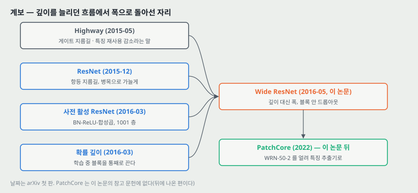

**하나. 이 저장소의 노트들이 다뤄 온 흐름에서의 자리.** 역전파 노트에서 깊이마다 기울기가 줄었고, DBN · 오토인코더의 사전학습, AlexNet 의 ReLU, VGG 의 3x3 깊이, BN, ResNet 의 지름길이 차례로 **깊이를 가능하게** 만들었다. 이 논문은 **깊이가 가능해진 뒤에 깊이가 꼭 필요한가**를 묻는다. 답은 CIFAR 에서 「16~28 층이면 충분하고 폭이 낫다」, ImageNet 에서 「50 층 넓은 망이 152 층 가는 망과 같은 계산으로 0.26 낮다」다. VGG 노트가 「깊이를 바꿀 때 계산량도 함께 바뀐다」고 짚었는데, 이 논문의 비교는 **파라미터를 맞추는 쪽**이고 계산량을 맞추지 않는다. 17절의 내 셈이 그 빈칸을 일부 채운다.

**둘. PatchCore 가 쓰는 자리 (논문은 이 쓰임을 적지 않는다. 내가 잇는 것이다).**

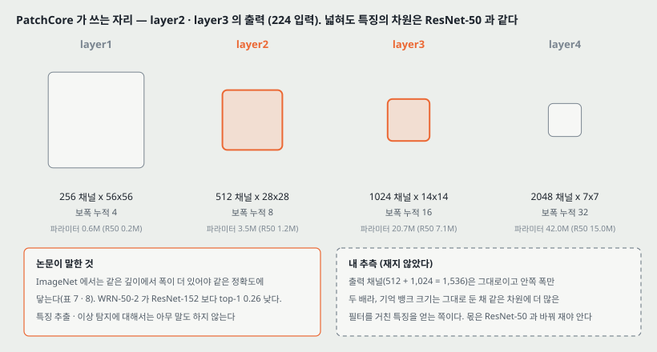

PatchCore 는 ImageNet 으로 배운 WRN-50-2 를 얼려 **layer2 와 layer3** 의 출력을 조각 특징으로 쓴다.

| 단계 | 224 입력의 출력 | 출력 채널 | 보폭 누적 | WRN-50-2 파라미터 | ResNet-50 파라미터 |
|---|---|---:|---:|---:|---:|
| layer2 | 28x28 | 512 | 8 | 3.48M | 1.22M |
| layer3 | 14x14 | 1,024 | 16 | 20.74M | 7.10M |

- **특징 차원은 넓혀도 그대로다.** 15.1절에서 본 것처럼 WRN-50-2 는 병목 안쪽만 넓혀서 단계 출력이 ResNet-50 과 같다. 이어 붙인 채널은 512 + 1,024 = 1,536 이고, 224 입력이면 조각이 28 x 28 = 784 개다. **그러니 기억 뱅크의 차원과 조각 수는 ResNet-50 을 쓸 때와 같다.** 바뀌는 것은 그 1,536 차원이 만들어지기까지 거친 필터 수다(layer2 · layer3 의 파라미터가 2.86 · 2.92 배).
- **논문이 말한 것.** ImageNet 에서 같은 깊이면 폭이 더 있어야 같은 정확도에 닿고(표 7 · 8), WRN-50-2 가 ResNet-152 보다 top-1 이 0.26 낮다. **특징 추출 · 전이 · 이상 탐지에 대해서는 이 논문이 아무것도 재지 않았다.** 1절에서 ResNet 이 Inception 보다 일반화가 좋아 전이 학습에 효율적이라는 문장이 있지만 그것은 ResNet 에 대한 인용이다.
- **내 추측 (재지 않았다).** 같은 차원 · 같은 해상도의 특징을 내면서 안쪽 필터가 더 많으니, 같은 조각 수의 기억 뱅크에 **분류 정확도가 더 높은 백본의 중간 특징**을 담는 셈이다. 이것이 PatchCore 의 이상 탐지 성능에 얼마를 내는지는 **같은 설정에서 ResNet-50 과 바꿔 재야 안다**(26절 D).
- **계산 쪽.** WRN-50-2 의 곱-덧셈 11.40 G 는 ResNet-50 4.09 G 의 2.79 배다. layer3 까지만 돌리면 layer4 의 몫이 빠져 더 적어진다(그 몫은 이 노트에서 따로 세지 않았다).

> 둘째 문단의 「내 추측」과 「계산 쪽」은 내가 읽고 이은 것이고 이 논문이 측정한 것이 아니다.

---

## 25. 다음에 읽을 것

**한계를 적고 그 한계를 푼 것이 다음 논문이다.** 이 논문이 남긴 자리에서 넷을 꼽는다.

| 다음 | 이 노트의 어느 자리에서 나오는가 | 무엇을 확인하고 싶은가 |
|---|---|---|
| **Identity Mappings in Deep Residual Networks** (He 외, ECCV 2016, arXiv:1603.05027) | 4절 — 이 논문의 CIFAR 망이 모두 그 사전 활성 블록 위에 서 있다. 12 · 21절 셋 — 지름길 쪽 드롭아웃이 나빴다는 결과 | 사전 활성 순서가 왜 낫다고 했는지, 지름길에 무엇을 넣으면 왜 나빠지는지. ResNet-1001 의 4.92 / 4.64 가 어떤 조건의 값인지 |
| **Deep Networks with Stochastic Depth** (Huang 외, ECCV 2016, arXiv:1603.09382) | 3 · 20절 하나 — 특징 재사용 감소의 유일한 근거 | 블록을 통째로 꺼도 되는 망에서 블록별 기여를 실제로 쟀는지. 1202 층 4.91 이 어떻게 나왔는지 |
| **Aggregated Residual Transformations (ResNeXt)** (Xie 외, CVPR 2017) — 후보 | 15.1 · 20절 셋 — 병목 안쪽을 넓히는 다른 길(묶음 합성곱). 이 논문의 참고 문헌에는 없다(뒤에 나온 편) | 같은 계산량에서 폭을 늘리는 것과 갈래(cardinality)를 늘리는 것 중 무엇이 나은지. 계산량을 맞춘 비교를 하는지 |
| **PatchCore** — Towards Total Recall in Industrial Anomaly Detection (Roth 외, CVPR 2022) | 24절 둘 — 이 망을 얼려 쓰는 쪽 | 백본을 바꾼 비교(ResNet-50 · WRN-50-2 · 다른 망)가 있는지, layer2 · layer3 를 고른 근거가 무엇인지 |

읽는 순서로는 **첫째가 먼저**다. 이 논문의 블록이 그대로 그 편의 블록이고, ResNet 노트도 그것을 다음 읽을 것 첫째로 두었다. 넷째는 연구와 바로 닿는다.

---

## 26. 돌려 볼 것

노트를 쓰며 나온 물음 중 **직접 잴 수 있는 것 넷**이다. **아직 실험 폴더를 만들지 않았고 돌리지 않았다.** 돌리게 되면 질문과 가설을 먼저 적는 규칙대로 폴더를 만든다.

| 무엇 | 이 노트의 어느 자리 | 묻는 것 |
|---|---|---|
| A | 7 · 12 · 20절 둘 | CIFAR-10 에서 WRN-16-4 를 seed 다섯으로 드롭아웃 유무만 바꿔 돌려, **차이가 흩어짐 밖인가.** 논문의 +0.22 / −0.21 이 같은 망에서 데이터에 따라 방향이 바뀐 자리다 |
| B | 17 · 20절 넷 | 이 PC 와 Colab(L4) 에서 WRN-40-4 와 ResNet-1001 의 앞+뒤 시간을 배치 1 · 32 · 128 로 재서, **같은 계산량에서 5~7 배라는 비가 환경에 따라 얼마나 바뀌는가** |
| C | 3 · 20절 하나 | 배운 WRN-16-8 과 ResNet-164 에서 **블록 하나씩을 빼고** 시험 오차가 얼마 오르는지 재서, 넓은 망의 블록이 가는 망의 블록보다 더 많이 일하는가(특징 재사용 감소를 직접 재기) |
| D | 24절 둘 | MVTec AD 한 부류에서 PatchCore 백본을 **ResNet-50 대 WRN-50-2** 로만 바꿔 AUROC 가 얼마 달라지는가. 특징 차원 · 조각 수 · 뱅크 크기는 같게 둔다(15.1절에서 본 대로 같다) |

D 는 ResNet 노트가 적어 둔 같은 실험(단계 끝 대 가운데 블록, ResNet-50 대 WRN-50-2)과 합쳐 한 폴더로 만든다.

---

## 27. 물어 두는 것

- **표 2 의 「깊이」 칸은 무엇을 센 것인가.** 7절에서 「B(3,3) 와 같은 $N$」으로 읽어야 파라미터가 맞았다. 3 층 블록의 실제 합성곱이 58 층이었는지.
- **표 4 는 몇 번 돌린 값인가.** 표 2 · 3 · 5 · 6 은 다섯 번의 중앙값이라고 적는데 표 4 만 없다.
- **다섯 번의 범위.** 중앙값과 함께 최솟값 · 최댓값이 있으면 20절 둘의 판정이 된다. 공개된 코드 저장소에 기록이 있는지.
- **표 7 의 폭 배수를 어디에 걸었나.** 폭 2.0 · 3.0 에서 내 셈이 0.09~0.21M 많다.
- **ResNet-1001 의 파라미터.** 내 셈 10,327,706 대 표의 10.2M.
- **연구 코드가 부르는 WRN-50-2 가중치는 어느 것인가.** torchvision V1(오차 21.53%) · V2 · timm 중 무엇인지, 그리고 그것이 이 논문 표 8 의 모델과 같은 학습인지(15.2절).

---

## 28. 참고 문헌

이 노트가 부른 편만 적는다. 원리는 원 출처를, 구현은 그 라이브러리의 편을 적는 규칙을 따른다. 그림 코드는 파이썬 표준 라이브러리만 쓴다. 파라미터 수를 맞춰 본 **torchvision** 은 값을 대조하는 데만 썼고 그림 코드에서 부르지 않았다.

- Zagoruyko, S. and Komodakis, N. (2016). Wide residual networks. BMVC. arXiv:1605.07146 (v4, 2017-06). — 이 노트의 대상.
- He, K., Zhang, X., Ren, S., and Sun, J. (2016). Deep residual learning for image recognition. CVPR. — 원래 잔차 망, 병목, ImageNet 망(참고 문헌 11).
- He, K., Zhang, X., Ren, S., and Sun, J. (2016). Identity mappings in deep residual networks. ECCV. arXiv:1603.05027. — 사전 활성 블록, ResNet-164 · 1001, 지름길 쪽 드롭아웃(참고 문헌 13).
- Huang, G., Sun, Y., Liu, Z., Sedra, D., and Weinberger, K. Q. (2016). Deep networks with stochastic depth. ECCV. arXiv:1603.09382. — 블록을 무작위로 끄기, 3절의 근거(참고 문헌 14).
- Srivastava, R. K., Greff, K., and Schmidhuber, J. (2015). Highway networks. arXiv:1505.00387. — 게이트 지름길, 「특징 재사용 감소」라는 이름(참고 문헌 28).
- Srivastava, N., Hinton, G., Krizhevsky, A., Sutskever, I., and Salakhutdinov, R. (2014). Dropout: A simple way to prevent neural networks from overfitting. JMLR. — 드롭아웃(참고 문헌 27).
- Ioffe, S. and Szegedy, C. (2015). Batch normalization. ICML. — BN(참고 문헌 15).
- Simonyan, K. and Zisserman, A. (2015). Very deep convolutional networks for large-scale image recognition. ICLR. — 작은 커널, 폭 비교의 상대(참고 문헌 26).
- Lin, M., Chen, Q., and Yan, S. (2013). Network in network. arXiv:1312.4400. — B(3,1,1) 꼴(참고 문헌 20).
- Gross, S. and Wilber, M. (2016). Training and investigating residual nets. `https://github.com/facebook/fb.resnet.torch`. — ImageNet 구현(참고 문헌 10).
- Collobert, R., Kavukcuoglu, K., and Farabet, C. (2011). Torch7. BigLearn, NIPS Workshop. — 구현 바탕(참고 문헌 6).
- Zagoruyko, S. 외 (2016). A multipath network for object detection. BMVC. — COCO 의 MultiPathNet(참고 문헌 32).
- Gidaris, S. and Komodakis, N. (2016). LocNet: Improving localization accuracy for object detection. CVPR. — COCO 의 위치 보정(참고 문헌 7).
- Marcel, S. and Rodriguez, Y. (2010). Torchvision the machine-vision package of torch. ACM MM. — 파라미터 수와 가중치 메타데이터를 대조한 라이브러리. **이 논문의 참고 문헌에는 없다.**
- Roth, K. 외 (2022). Towards total recall in industrial anomaly detection (PatchCore). CVPR. — 24절 둘의 연결. **이 논문의 참고 문헌에는 없다(뒤에 나온 편이다).**

---

## 29. 경로

| 무엇 | 어디 |
|---|---|
| 원문 PDF (arXiv v4, 부록 없음) | `papers/BMVC16_WRN_Wide_Residual_Networks.pdf` |
| 이 노트 | `notes/BMVC16_WRN_Wide_Residual_Networks.md` |
| 이 노트의 그림 | `figures/BMVC16_WRN/fig01_blocks.svg` 부터 `fig16_lineage.svg` 까지 열여섯 |
| 그림을 만드는 코드 | `figures/BMVC16_WRN/make_figures.py` — 바깥 데이터를 읽지 않으므로 `python make_figures.py` 로 어디서나 다시 만든다. 표 2 · 3 · 4 · 5 · 7 · 8 의 파라미터, CIFAR · ImageNet 망의 곱-덧셈, WRN-50-2 단계별 크기를 이 파일이 계산해 화면에도 찍는다 |
