# GAN — Generative Adversarial Networks (요약)

> **한 줄.** 밀도 함수 $p(x)$ 를 적지 않고, **잡음을 이미지로 바꾸는 생성기**와 **진짜와 가짜를 가르는 판별기**를 서로 겨루게 해서 생성 모델을 배운다. 생성기는 판별기를 거쳐 돌아온 기울기로 배운다. 학습은 최적화가 아니라 **두 사람 게임의 평형 찾기**다. 그래서 가능도를 계산할 수 없어도 되고, 대신 **학습이 수렴한다는 보장이 없다.**

> **이 파일에 대해 먼저.** 바탕화면에 받은 파일은 **2014 년 NIPS 원 논문이 아니다.** 같은 저자 여덟 명이 2020 년 **Communications of the ACM** 의 「Research Highlights」에 낸 **6 쪽짜리 개관판**이다. 원 논문의 증명 · 알고리즘 · 실험 표가 없고, 표시된 식이 **하나**뿐이다. 이 노트는 그래서 **이 파일이 적은 것**과 **내가 유도한 식**을 절마다 갈라 적는다. 원 논문은 22절에서 다음 읽을 것 첫째로 올린다.

---

## Paper Metadata

| Item | Content |
|---|---|
| Title | Generative Adversarial Networks |
| Authors | Ian Goodfellow, Jean Pouget-Abadie, Mehdi Mirza, Bing Xu, David Warde-Farley, Sherjil Ozair, Aaron Courville, Yoshua Bengio |
| 소속 | Goodfellow 는 Google Brain 에서 썼다고 적혀 있고, 나머지 일곱은 Université de Montréal |
| Conference / Journal | Communications of the ACM, 63권 11호, 139–144쪽 (research highlights) |
| Year | 2020 년 11월호. 최종 제출 2018-05-09 (파일 끝에 적혀 있다) |
| DOI | 10.1145/3422622 |
| 원판 | 「Generative adversarial nets」, Advances in Neural Information Processing Systems 27 (NIPS 2014), 2672–2680쪽. 파일 첫 쪽 각주가 「이 글의 원판은 NIPS 2014 에 실렸다」고 적는다 |
| 코드 | 파일에 코드 주소가 없다 |
| Stored PDF | `papers/CACM20_GAN_Generative_Adversarial_Networks.pdf` (바탕화면에서 받은 이름은 `3422622.pdf`, DOI 의 끝자리다) |
| 왜 읽었는가 | 로드맵(퍼셉트론 → 역전파 → DBN → CNN → AE → VAE → **GAN** → Diffusion ...)의 다음 칸이다. VAE 는 복호기의 픽셀별 가능도(베르누이 · 가우스)를 **사람이 정해야** 했다. 가능도를 적지 않고 생성 모델을 배우면 무엇을 얻고 잃는지 본다 |
| 읽은 범위 | **2026-09-28 에 6 쪽을 전부 읽었다.** 곧 초록 · 1~6절 · 그림 1~6 과 캡션 · 참고 문헌 35 건의 목록. 원 NIPS 2014 논문은 이 노트를 쓸 때 **읽지 않았다**(2026-10-04 에 읽었다 — 아래 인용 블록들이 그때 덧붙인 것이다) |

### 저장한 파일의 상태

- **잡지 판형이라 두 단 조판이고 그림이 본문 사이에 끼어 있다.** 3절 끝 문장이 그림 사이로 끊겨 4 쪽으로 넘어가고, 3절의 「GAN 은 근사가 적다」 문단이 4 쪽과 5 쪽에 나뉘어 있다.
- **글자 층이 살아 있다**(Adobe InDesign 으로 만든 파일). 다만 그림 4 캡션의 식 둘($D^*(x)$ 와 $D(x) = \frac{1}{2}$)과 4 쪽 위의 표시된 식은 글자로 뽑히지 않아 **쪽을 그림으로 띄워 읽었다.**
- **그림 2 · 3 · 5 · 6 은 사진**이다(ImageNet 사진, 나비와 가짜 개 사진, Progressive GAN 얼굴, 네 해의 얼굴). 잰 값이 붙은 그림은 하나도 없다.

---

## 1. 용어

이 노트에서 쓸 이름을 먼저 정한다. 논문의 원래 용어는 괄호로 함께 적는다.

- **생성 모델링 (generative modeling)**: 모르는 분포 $p_\text{data}(x)$ 에서 뽑힌 학습 예시를 보고, 그것에 가장 가까운 $p_\text{model}(x)$ 를 배우는 일. 작은 예시로, 얼굴 사진 수만 장을 보고 **없는 사람의 얼굴**을 새로 만들 수 있게 되는 것.
- **명시적 밀도 모델 (explicit density)**: $p_\text{model}(x; \theta)$ 를 식으로 적어 두고, 어느 $x$ 에나 확률(밀도) 값을 줄 수 있는 모델. 작은 예시로, 가우스 $\mathcal{N}(0.24, 0.98^2)$ 는 $x = 1$ 에 밀도 0.30 을 준다.
- **암묵적 생성 모델 (implicit generative model)**: 밀도 값을 주지 않고 **표본만 뽑을 수 있는** 모델. GAN 이 여기 든다.
- **최대가능도 추정 (maximum likelihood estimation)**: 학습 데이터의 로그 확률 합을 가장 크게 하는 $\theta$ 를 고르는 것. 논문은 이것을 「$p_\text{data}$ 와 $p_\text{model}$ 사이의 KL 발산을 줄이는 것」이라고 적는다. 작은 예시로, 관측의 평균을 가우스의 평균으로 삼는 것이 최대가능도다(4절).
- **생성기 (generator)** $G(z; \theta^{(G)})$: 잡음 $z$ 를 받아 표본 $x = G(z)$ 를 내는 신경망. 논문은 $\theta^{(G)}$ 를 「게임에서 생성기의 전략」이라고 부른다.
- **잠재 변수 / 잡음 (latent variable)** $z$: 생성기의 입력. 사전분포 $p(z)$ 는 고차원 가우스나 초입방체 위 균등처럼 **구조가 없는** 분포다. 논문은 이것을 「결정적 체계 안의 무작위 원천, 의사난수 생성기의 씨앗」에 빗댄다.
- **판별기 (discriminator)** $D(x; \theta^{(D)})$: 입력 $x$ 가 진짜(학습 분포)인지 가짜(생성기)인지의 추정을 내는 신경망. 원판에서는 **진짜일 확률**을 낸다(진짜와 가짜가 같은 비율로 들어온다고 가정).
- **비용 (cost)** $J^{(G)}$, $J^{(D)}$: 각 사람이 줄이려는 값. 둘 다 **두 사람의 파라미터 모두의 함수**인데, 각자는 **자기 파라미터만** 움직인다. 이것이 최적화가 아니라 게임인 이유다.
- **M-GAN (minimax GAN)**: 생성기 비용을 판별기 비용에 음수를 붙인 것으로 둔 원판 하나. $J^{(G)} = -J^{(D)}$.
- **NS-GAN (non-saturating GAN)**: 생성기 비용을 **판별기의 라벨을 뒤집어** 둔 원판 둘. 기울기 포화를 피한다(10절).
- **내시 평형 (Nash equilibrium)** / **국소 내시 평형 (local Nash equilibrium)**: 상대가 가만히 있다면 어느 쪽도 자기 비용을 더 줄일 수 없는 자리 / 그것을 **국소적인 움직임**으로 한정한 것. 논문 3절이 기계 학습 알고리즘의 목표로 적는다.
- **젠슨-섀넌 발산 (Jensen-Shannon divergence, JSD)**: 두 분포 $P$, $Q$ 와 그 평균 $M = \frac{1}{2}(P + Q)$ 사이의 KL 둘을 평균한 값. 0 에서 $\log 2 = 0.693$ nat 사이다. **이 파일에는 나오지 않고** 9절에서 내가 유도할 때 쓴다.
- **받침 (support)**: 분포의 확률(밀도)이 0 이 아닌 자리의 모음. 작은 예시로, 2 차원 평면의 원 위에만 표본을 내는 모델은 받침이 원 하나다(16절).

---

## 2. 한 문단 요약

최대가능도로 배우는 명시적 밀도 모델은 신경망처럼 복잡한 함수를 쓰면 밀도를 계산할 수 없게 되고, 그 해법이던 두 길 — 밀도가 계산되게 모델을 짜는 것, 밀도의 근사로 배우는 것(VAE) — 은 고해상도 이미지를 만드는 데서 연구자들을 아직 만족시키지 못했다(2절). GAN 은 셋째 길로, **밀도를 적지 않고 표본만 뽑는** 암묵적 모델을 마르코프 사슬 없이 **한 번에** 뽑게 만든다. 생성기 $G$ 는 잡음 $z$ 를 표본 $G(z)$ 로 바꾸고, 판별기 $D$ 는 진짜와 가짜를 가르는 이진 분류기로 배우며, 생성기는 판별기의 출력을 입력에 대해 미분한 기울기로 판별기를 속이도록 배운다(3절, 그림 3). 생성기 비용은 판별기 비용에 음수를 붙인 M-GAN 과 라벨을 뒤집은 NS-GAN 둘이 원판에 있다. 원 논문의 두 이론 결과는 **밀도 함수 공간에서** 국소 내시 평형이 $p_\text{model} = p_\text{data}$ 하나뿐이고, 판별기를 끝까지 배운 뒤 생성기를 조금씩 움직이면 그리로 수렴한다는 것이다(4절). 다만 실제 학습은 유한한 신경망의 파라미터 공간에서 두 쪽을 동시에 한 걸음씩 움직이며, 논문은 **실제로 자주 수렴에 실패한다**고 적는다. 결론은 GAN 이 믿을 만한 기술이 되려면 **좋은 내시 평형을 늘, 빨리 찾는** 모델 · 비용 · 알고리즘이 필요하다는 것이다.

---

## 3. 무엇을 읽었는가 — 이 파일과 원 논문

이 파일은 원 논문을 **다시 싣지 않고 요약하고 넓힌** 글이다. 무엇이 들어 있고 무엇이 없는지를 먼저 적는다.

| 원 논문(NIPS 2014)에 있을 것 | 이 파일에서 |
|---|---|
| 가치 함수 $V(D, G)$ 의 식 | **없다.** 비용을 말로만 적는다(3절). 7절의 식은 내가 그 문장을 옮겨 적은 것이다 |
| 최적 판별기 $D^*$ | **그림 4 캡션에 식 한 줄**로 있다. 유도는 없다 |
| 전역 최적이 $p_\text{model} = p_\text{data}$ 라는 정리와 증명 | **결과 두 줄만** 있다(4절). 증명은 없다 |
| 학습 알고리즘 | **없다.** 「가장 흔한 알고리즘은 두 쪽에 동시에 기울기 걸음」이라는 한 문장뿐이다 |
| 실험 설정과 결과 표 | **없다.** 그림 6 의 2014 년 얼굴 한 장이 원 논문의 표본으로 인용된다 |
| 원 논문 뒤 6 년의 흐름 | **있다** — 조건부 GAN, 비용의 변형, 수렴 이론, 응용 (5절) |

**그래서 이 노트가 옮기는 식은 셋으로 갈린다.** (가) 이 파일에 표시된 식 — 4 쪽의 $J^{(G)}(\theta^{(G)}, \arg\min J^{(D)})$ 하나와 그림 4 캡션의 둘. (나) 이 파일의 **문장을 식으로 옮긴 것** — 7절의 비용. (다) **내가 유도한 것** — 8절의 $D^*$ 유도, 9절의 JSD, 10절의 기울기. (나)와 (다)는 절마다 그렇게 밝힌다. 원 논문의 표기와 다를 수 있다.

---

## 4. 문제 — 밀도를 적으면 계산할 수 없게 된다 (논문 1 · 2절)

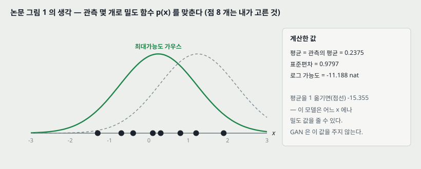

### 4.1 왜 생성 모델인가 (1절)

지도 학습은 학습이 끝난 뒤 사람보다 정확할 때가 많지만, **학습 과정은 사람에 한참 못 미친다** — 입력마다 사람이 출력을 붙여야 하고, 사람을 넘으려면 예시가 수백만 개 필요한 경우가 많다. 사람의 지도와 예시 수를 둘 다 줄이려고 비지도 학습, 그 가운데 생성 모델을 연구한다는 것이 1절의 동기다.

### 4.2 명시적 밀도와 최대가능도 (2절, 그림 1)

가장 곧은 길은 $p_\text{model}(x; \theta)$ 를 식으로 적고 $p_\text{data}$ 와 가장 비슷해지는 $\theta$ 를 찾는 것이다. 가장 흔한 방법이 최대가능도이고, 논문은 이것이 **$p_\text{data}$ 와 $p_\text{model}$ 사이의 KL 발산을 줄이는 것**이라고 적는다. 논문 그림 1 이 실수 직선 위 점 몇 개에 가우스를 맞추는 그림이다.

위 그림은 같은 생각을 숫자로 옮긴 것이다(점 8 개는 내가 골랐다). 최대가능도 가우스는 평균 0.2375(= 관측의 평균), 표준편차 0.9797 이고 로그 가능도는 −11.188 nat 이다. 평균을 1 옮기면 −15.355 로 떨어진다. **이 모델은 어느 $x$ 에나 밀도 값을 줄 수 있다** — GAN 이 포기하는 것이 이것이다.

### 4.3 신경망을 쓰면 밀도를 계산할 수 없다

전통 통계에서는 단순한 분포를 적은 수의 변수에 썼다. 깊은 신경망으로 데이터를 만들면 **그 밀도 함수를 계산할 수 없게 될 수 있다.** 논문이 적는 전통적 해법은 둘이다.

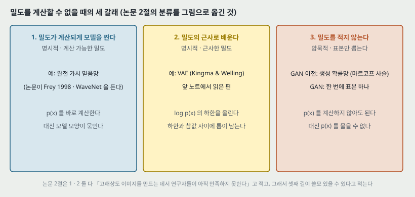

| 길 | 방법 | 논문이 든 예 |
|---|---|---|
| 1 | 밀도가 계산되게 모델을 **조심스럽게 설계**한다 | Frey 1998 (완전 가시 믿음망), WaveNet 계열 |
| 2 | 밀도의 **계산 가능한 근사**로 학습 알고리즘을 짠다 | Kingma & Welling (VAE) |
| 3 | 밀도를 적지 않고 **표본 뽑는 과정만** 배운다 | 생성 확률망(GSN), GAN |

논문은 1 · 2 둘 다 **어려웠고**, 고해상도 사실적 이미지를 만드는 일에서 **연구자들이 아직 만족하지 못했다**고 적는다. 그래서 두 길을 고치는 연구와 함께 셋째 길이 쓸모 있을 수 있다는 것이다.

> **주의.** 「만족하지 못했다」는 논문의 평가이고 잰 값이 붙어 있지 않다. 앞 노트의 VAE 논문도 표본 품질을 수치로 재지 않았다.

---

## 5. 암묵적 모델과 마르코프 사슬 (2절)

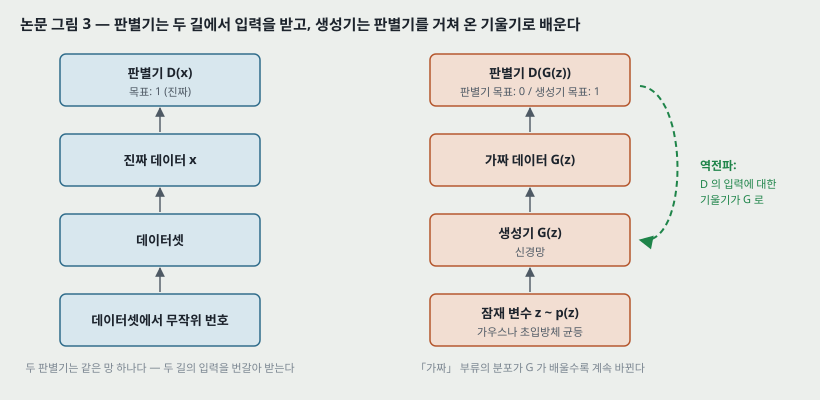

생성 모델은 $x$ 를 받아 그 확률을 내는 것 말고도, $p_\text{model}$ 에서 **표본을 뽑을 수 있으면** 쓸모가 있다(논문 그림 2 — ImageNet 사진으로 「완벽한 모델이 닿을 목표」를 보인다. 그림의 「모델 표본」도 실은 ImageNet 사진이라고 캡션이 밝힌다).

- 밀도를 나타내는 모델도 대개 표본을 뽑을 수 있지만, **표본 뽑기가 매우 비싸거나 근사로만 되는** 경우가 있다.
- **밀도를 설계하는 일 자체를 피하고 표본 뽑는 과정만 배우는** 모델이 암묵적 생성 모델이다.
- GAN 이전의 가장 앞선 깊은 암묵적 모델은 **생성 확률망(GSN)** 이었고, 이것은 **마르코프 사슬로 조금씩** 표본에 다가간다.
- GAN 은 **한 번의 생성 단계로 참 표본을** 뽑는, 마르코프 사슬이 없는 깊은 암묵적 모델로 도입됐다.

**논문이 스스로 적는 반전.** 2020 년 기준으로 가장 인기 있는 생성 모델은 GAN · VAE · 완전 가시 믿음망이고 **셋 다 마르코프 사슬을 쓰지 않는다.** 그래서 오늘 GAN 에 관심이 모이는 이유는 **원래 목표(마르코프 사슬 없는 생성)를 이뤄서가 아니라**, 고품질 이미지를 만들고 생성 말고 다른 일에도 쓸모가 있어서라고 적는다.

---

## 6. 두 사람 — 생성기와 판별기 (3절, 그림 3)

GAN 은 두 기계 학습 모델 사이의 **게임 이론 의미의 게임**이다. 둘 다 대개 신경망이다.

**생성기.** $p_\text{model}(x)$ 를 **암묵적으로** 정한다. 밀도 값을 계산할 수 있어야 하는 것은 아니다 — 논문은 밀도를 계산할 수 있는 모델도 표본 뽑기가 계산 가능하고 미분 가능하면 GAN 생성기로 배울 수 있지만(Danihelka 외의 실수값 NVP 예) **그것이 요구되지는 않는다**고 적는다. 생성기의 주된 일은 **구조 없는 잡음 $z$ 를 사실적인 표본으로 바꾸는 함수 $G(z)$ 를 배우는 것**이다.

**판별기.** 표본 $x$ 를 보고 진짜인지 가짜인지의 추정 $D(x; \theta^{(D)})$ 를 낸다. 원판에서는 **진짜일 확률**이고, 진짜와 가짜가 **같은 비율로 들어온다고 가정**한다. 다른 꼴(Arjovsky 외의 Wasserstein GAN)도 있지만 말로 하면 모두 「진짜인지 가짜인지 맞히려 한다」.

**학습의 두 길 (그림 3).**

| | 왼쪽 길 | 오른쪽 길 |
|---|---|---|
| 입력의 출처 | 데이터셋에서 무작위 번호로 한 장 | 사전분포에서 $z$ 를 뽑아 $x = G(z)$ |
| 판별기의 목표 | 「진짜」 부류 | 「가짜」 부류 |
| 생성기의 목표 | (관여하지 않는다) | 판별기가 「진짜」라 하게 |

**판별기의 학습은 보통 이진 분류기와 거의 같다.** 한 가지 다른 점은 「가짜」 부류의 데이터가 고정된 분포가 아니라 **생성기가 배울수록 계속 바뀌는 분포**에서 온다는 것이다. **생성기의 학습은 독특하다** — 출력의 구체적 정답이 주어지지 않고, (계속 바뀌는) 상대를 속이면 보상을 받을 뿐이다. 역전파가 **판별기 출력을 판별기 입력에 대해 미분한 값**을 생성기까지 흘려 보낸다.

**위조범과 경찰.** 위조범은 가짜 돈을 만들고 경찰은 위조범을 잡으면서 진짜 돈은 쓰게 둔다. 경쟁이 가짜를 점점 진짜처럼 만들어, 마침내 경찰이 가를 수 없는 완벽한 위조에 이른다. **이 비유가 틀리는 자리 하나** — 생성기는 판별기의 기울기로 배우므로, **경찰 안에 위조범의 끄나풀이 있어 경찰이 가짜를 알아보는 방법을 그대로 알려 주는 것**과 같다고 논문이 적는다.

---

## 7. 비용 — M-GAN 과 NS-GAN (3절)

**이 절의 식은 이 파일의 문장을 내가 식으로 옮긴 것이다.** 파일은 비용을 말로만 적는다.

논문이 적는 것: 원판에서 $J^{(D)}$ 는 **판별기가 진짜-가짜 라벨에 매기는 음의 로그 가능도**다. 진짜와 가짜가 같은 비율로 들어온다고 가정하므로, 두 쪽에 $\frac{1}{2}$ 씩 무게를 둔다.

$$J^{(D)} = -\frac{1}{2} \mathbb{E}_{x \sim p_\text{data}}\left[\log D(x)\right] - \frac{1}{2} \mathbb{E}_{z \sim p(z)}\left[\log\left(1 - D(G(z))\right)\right] \qquad (\text{a})$$

작은 예시로, 진짜 한 장에 $D = 0.9$, 가짜 한 장에 $D = 0.2$ 를 매겼다면 $J^{(D)} = -\frac{1}{2}(\ln 0.9 + \ln 0.8) = 0.164$ nat 이다.

**생성기 비용 둘.**

| 이름 | 논문의 말 | 식 (내가 옮긴 것) |
|---|---|---|
| M-GAN | 판별기 비용의 **부호를 뒤집는다**. 이론으로 분석하기 곧다 | $J^{(G)} = -J^{(D)}$, 생성기에 닿는 부분은 $\frac{1}{2}\mathbb{E}_z[\log(1 - D(G(z)))]$ |
| NS-GAN | 판별기의 **라벨을 뒤집는다** — 판별기가 **틀린** 라벨에 매기는 음의 로그 가능도를 줄인다. 기울기 포화를 피한다 | $J^{(G)} = -\frac{1}{2}\mathbb{E}_z[\log D(G(z))]$ |

M-GAN 에서 두 비용의 합은 늘 0 이므로 **영합 게임**이다. 이것을 하나의 가치 함수로 적으면 이렇다(원 논문의 $V(D, G)$ 에 해당할 것으로 보이는데, **원 논문을 안 읽어 표기는 확인하지 않았다**).

> **2026-10-04 원판을 읽고 덧붙인다.** 원판 식 (1) 과 같다. 무게 $\frac{1}{2}$ 은 없고, 기댓값 첨자도 $x \sim p_\text{data}(x)$ · $z \sim p_z(z)$ 로 같은 꼴이다.

$$V(D, G) = \mathbb{E}_{x \sim p_\text{data}}\left[\log D(x)\right] + \mathbb{E}_{z \sim p(z)}\left[\log\left(1 - D(G(z))\right)\right] = -2 J^{(D)} \qquad (\text{b})$$

판별기는 $V$ 를 올리고 생성기는 $V$ 를 내린다: $\min_G \max_D V(D, G)$.

**비용의 꼴은 아주 많다.** 논문은 「매우 많은 꼴이 가능하고 지금까지 가장 인기 있는 꼴들은 **대체로 비슷하게** 동작하는 것 같다」고 적고 Lucic 외(「Are GANs created equal?」)를 단다.

---

## 8. 최적 판별기 — 그림 4(b)(d)

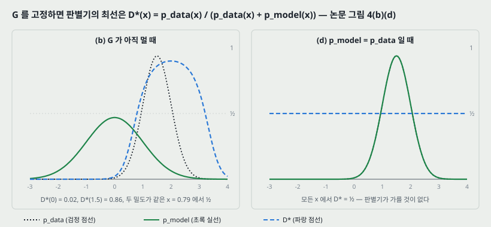

**이 파일이 적은 것.** 그림 4 캡션 (b): $G$ 를 고정하고 $D$ 를 수렴할 때까지 배우면

$$D^*(x) = \frac{p_\text{data}(x)}{p_\text{data}(x) + p_\text{model}(x)} \qquad (\text{c})$$

로 간다. (d): 평형에서는 $p_\text{model} = p_\text{data}$ 라서 판별기가 두 분포를 가를 수 없고 **모든 $x$ 에서 $D(x) = \frac{1}{2}$** 이다.

**내가 붙인 유도.** 식 (b) 를 $x$ 에 대한 적분으로 적으면 $\int \left[p_\text{data}(x) \log D(x) + p_\text{model}(x) \log(1 - D(x))\right] dx$ 다. $D$ 가 어떤 함수든 될 수 있다면 $x$ 마다 따로 최대화하면 된다. $a \log y + b \log(1 - y)$ 를 $y$ 로 미분해 0 으로 두면 $a / y = b / (1 - y)$, 곧 $y = a / (a + b)$ 이고 이것이 식 (c) 다.

**숫자로.** $p_\text{data} = \mathcal{N}(1.5, 0.5^2)$, $p_\text{model} = \mathcal{N}(0, 1)$ 로 두고 그림 코드가 계산했다.

| $x$ | $D^*(x)$ | 읽는 법 |
|---:|---:|---|
| 0 | 0.022 | 모델이 몰린 자리 — 거의 가짜로 본다 |
| 0.791 | 0.500 | 두 밀도가 같은 자리 |
| 1.5 | 0.860 | 데이터가 몰린 자리 |
| 3.0 | 0.667 | 데이터 꼬리가 모델 꼬리보다 빨리 줄어 다시 내려온다 |

**그림 4(c)** 는 $G$ 를 조금 움직이면 생성된 표본이 **$D$ 가 커지는 쪽으로 흘러간다**고 적는다 — 데이터로 분류될 가능성이 큰 자리로. 그 사이 $D$ 도 새 $G$ 에 맞춰 갱신된다.

> **주의.** 식 (c) 는 **$D$ 가 모든 함수를 나타낼 수 있을 때**의 최선이다. 유한한 신경망 판별기가 여기에 닿는다는 보장은 없다. 캡션도 「실제로는 $D$ 가 매 걸음 최적일 필요가 없다」고 적는다.

---

## 9. 게임의 값과 젠슨-섀넌 발산 — 4절 결과 하나의 모양

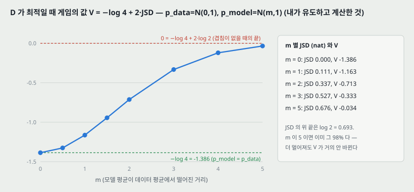

**이 절 전체가 내가 유도한 것이다.** 이 파일은 결과만 적는다: **밀도 함수와 판별기 함수의 공간에서 국소 내시 평형은 $p_\text{model} = p_\text{data}$ 하나뿐이다.** 왜 그 자리인지를 식 (b)(c) 로 보인다.

식 (c) 의 $D^*$ 를 식 (b) 에 넣고, 평균 분포 $M = \frac{1}{2}(p_\text{data} + p_\text{model})$ 을 쓰면

$$V(D^*, G) = \mathbb{E}_{p_\text{data}}\left[\log \frac{p_\text{data}}{2M}\right] + \mathbb{E}_{p_\text{model}}\left[\log \frac{p_\text{model}}{2M}\right] = -\log 4 + 2 \cdot \text{JSD}(p_\text{data} \,\Vert\, p_\text{model}) \qquad (\text{d})$$

JSD 는 0 이상이고 두 분포가 같을 때만 0 이므로, **판별기가 최적일 때 생성기가 $V$ 를 가장 낮추는 자리는 $p_\text{model} = p_\text{data}$ 하나**이고 그때 값이 $-\log 4 = -1.386$ 이다.

**숫자로 맞춰 보기.** $p_\text{data} = \mathcal{N}(0, 1)$, $p_\text{model} = \mathcal{N}(m, 1)$ 로 두고, 그림 코드가 $V(D^*, G)$ 를 **직접 적분한 값**과 **$-\log 4 + 2 \cdot \text{JSD}$** 를 따로 계산했다. 여덟 $m$ 모두에서 넷째 자리까지 같았다.

| $m$ | JSD (nat) | $V(D^*, G)$ |
|---:|---:|---:|
| 0 | 0.000 | −1.386 |
| 0.5 | 0.030 | −1.326 |
| 1 | 0.111 | −1.163 |
| 2 | 0.337 | −0.713 |
| 3 | 0.527 | −0.333 |
| 5 | 0.676 | −0.034 |

**읽는 법.** JSD 의 위 끝은 $\log 2 = 0.693$ 이다. $m = 5$ 에서 이미 그 97.5% 라서, 두 분포가 **더 멀어져도 $V$ 가 거의 안 바뀐다.** 곧 모델이 데이터에서 멀리 떨어져 있을 때 이 값은 「어느 쪽으로 가야 가까워지는지」를 거의 알려 주지 않는다. 이 파일은 이 자리를 말하지 않고, 5절에서 Wasserstein GAN(참고 문헌 1)과 최적 수송을 이름만 든다 — **그 편이 이 자리를 다루는지는 그 편을 읽고 확인한다**(22절).

> 식 (d) 의 $V$ 는 식 (b) 의 무게($\frac{1}{2}$ 없음)로 적은 값이다. $J^{(D)}$ 로 적으면 $-\frac{1}{2}$ 배다.

---

## 10. 기울기 포화 — 왜 NS-GAN 을 쓰는가

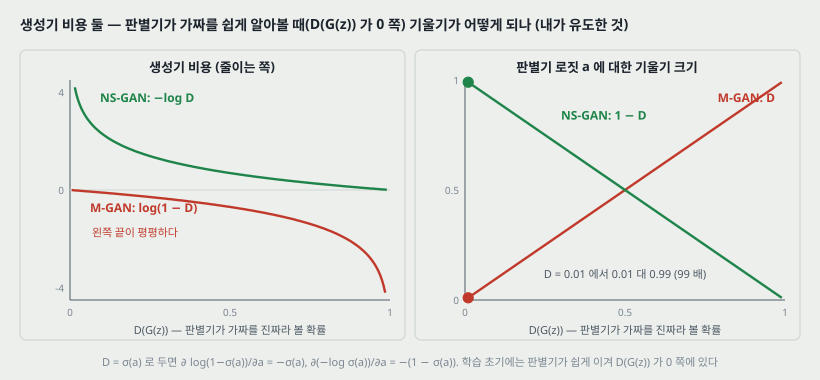

**이 파일이 적은 것은 한 문장이다** — NS-GAN 이 「모델을 배울 때 기울기 포화를 피하는 데 돕는다」. **아래 유도와 수는 내가 붙인 것이다.**

판별기의 마지막 출력을 로짓 $a$ 로, $D = \sigma(a)$ 로 두자. 가짜 한 장에 대한 생성기 비용의 $a$ 에 대한 기울기는

| 비용 | $a$ 에 대한 기울기 | 크기 |
|---|---|---|
| M-GAN: $\log(1 - \sigma(a))$ | $-\sigma(a)$ | $D(G(z))$ |
| NS-GAN: $-\log \sigma(a)$ | $-(1 - \sigma(a))$ | $1 - D(G(z))$ |

**학습 초기에는 생성기가 서툴러 판별기가 가짜를 쉽게 알아본다** — 곧 $D(G(z))$ 가 0 쪽이다. 그 자리에서 M-GAN 의 기울기 크기는 $D(G(z))$ 자체라 0 으로 간다(**포화**). NS-GAN 은 $1 - D(G(z))$ 라 1 쪽이다. 작은 예시로, $D(G(z)) = 0.01$ 이면 M-GAN 0.01 대 NS-GAN 0.99 로 **99 배** 차이다.

**두 비용이 같은 자리를 목표로 한다는 것**도 볼 수 있다 — 둘 다 $D(G(z))$ 를 올리는 쪽으로 기울기가 향한다. 다른 것은 **어디서 기울기가 크냐**다. 다만 NS-GAN 은 $J^{(G)} = -J^{(D)}$ 가 아니므로 **영합 게임이 아니고, 9절의 유도가 그대로 적용되지 않는다**(18절 둘).

---

## 11. 생성기는 분포를 옮기는 함수다 — 그림 4 의 화살표

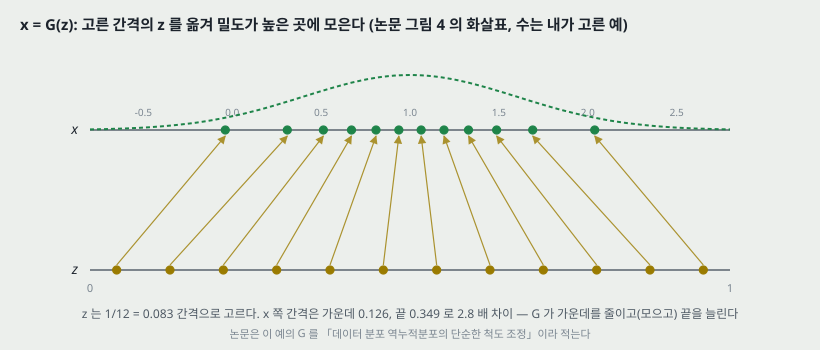

논문 그림 4 는 1 차원 가우스를 맞추는 예다. 아래 가로선이 $z$ 의 정의역(이 예에서 **균등**), 위 가로선이 $x$ 의 정의역이고, 위로 가는 화살표가 $x = G(z)$ 가 **균등한 $z$ 를 균등하지 않은 $p_\text{model}$ 로 옮기는** 모습이다. 캡션은 두 가지를 적는다.

- 이 예에서 생성기의 목표는 **데이터 분포 역누적분포 함수의 단순한 척도 조정**을 배우는 것으로 이해할 수 있다.
- $G$ 는 $p_\text{model}$ 의 **밀도가 높은 곳에서 줄이고(수축), 낮은 곳에서 늘린다(팽창).**

**숫자로 (내가 고른 예).** $G(z) = 1.0 + 0.6 \cdot \Phi^{-1}(z)$ 로 두고 $z$ 를 1/12 = 0.083 간격 열두 점으로 고르면, $x$ 쪽 간격이 가운데 0.126, 끝 0.349 로 **2.8 배** 벌어진다. 같은 확률 질량(1/12)이 가운데는 좁은 폭에, 꼬리는 넓은 폭에 들어간다.

> 앞 노트의 VAE 논문 그림 4 가 **같은 도구**($\Phi^{-1}$)를 반대 방향으로 썼다 — 고른 격자를 $\Phi^{-1}$ 로 $z$ 에 옮겨 복호기를 훑었다. 여기서는 $G$ 가 그 $\Phi^{-1}$ 자체를 배운다.

---

## 12. 게임인가 최적화인가 — 이 파일에 표시된 유일한 식

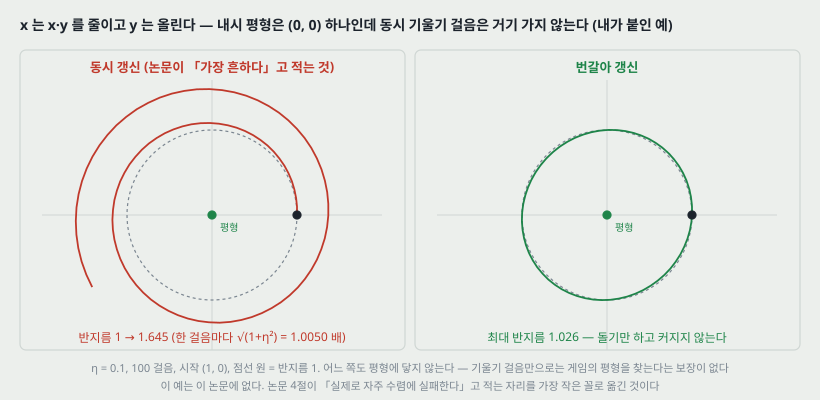

각 사람의 비용이 **상대 파라미터의 함수**인데 각자는 **자기 파라미터만** 움직이므로, 곧바로 최적화 문제로 적히지 않는다. 최적화로 줄일 수는 있다 — 이 파일에 표시된 식은 이것 하나다.

> **2026-10-04 원판을 읽고 덧붙인다.** 원판 알고리즘 1 은 **판별기 $k$ 걸음 뒤 생성기 한 걸음의 번갈아 갱신**이다(실험은 $k = 1$). 이 파일이 「가장 흔하다」고 적는 동시 갱신은 원판에 나오지 않는다.

$$\min_{\theta^{(G)}} \; J^{(G)}\left(\theta^{(G)}, \; \arg\min_{\theta^{(D)}} J^{(D)}\left(\theta^{(G)}, \theta^{(D)}\right)\right) \qquad (\text{e})$$

(바깥의 $\min$ 은 파일 원문에 「the goal is to minimize」라고 문장으로 적혀 있어 내가 붙였다.) 곧 **판별기가 늘 최선으로 응답한다고 보고 생성기만의 문제로 만드는 것**이다. 논문은 Metz 외(Unrolled GAN)가 이 길을 보였지만 **$\arg\min$ 연산은 다루기 어렵다**고 적는다.

**그래서 가장 흔한 접근은 두 사람의 게임으로 보는 것**이다. 게임 이론 문헌은 대부분 행동 공간이 이산 · 유한이거나 비용이 볼록한 게임을 다루는데, GAN 은 **비용이 볼록하지 않고 행동과 전략이 연속 · 고차원**인, 아직 잘 탐구되지 않은 자리다. 목표는 **국소 내시 평형** — 각 사람의 비용이 자기 파라미터에 대해 국소 최소인 점 — 이다.

**가장 흔한 학습 알고리즘은 두 쪽에 동시에 기울기 걸음을 되풀이하는 것**이라고 논문이 적는다.

**위 그림은 그 알고리즘이 가장 작은 게임에서 어떻게 되는지를 내가 계산한 것이다.** $V(x, y) = x \cdot y$ 에서 $x$ 는 줄이고 $y$ 는 올린다. 평형은 $(0, 0)$ 하나다.

| 갱신 | 규칙 ($\eta = 0.1$) | 100 걸음 뒤 (시작 반지름 1) |
|---|---|---|
| 동시 | $x \leftarrow x - \eta y$, $y \leftarrow y + \eta x$ (둘이 같은 순간의 값을 본다) | 반지름 **1.645** — 한 걸음마다 $\sqrt{1 + \eta^2} = 1.005$ 배로 **멀어진다** |
| 번갈아 | $x$ 를 먼저 움직이고 $y$ 는 새 $x$ 를 본다 | 최대 반지름 **1.026** — 돌기만 하고 커지지 않는다 |

**둘 다 평형에 닿지 않는다.** 각자 자기 비용의 기울기를 따라 내려가는 것이 **함께 평형으로 가는 것을 보장하지 않는다**는 것이 이 예의 요점이다. 동시 갱신의 반지름은 식 $(1 + \eta^2)^{50} = 1.6446$ 과 그림 코드의 반복 계산이 같았다.

> **이 예는 이 파일에 없다.** 논문 4절이 「최선의 학습 알고리즘도 실제로 자주 수렴에 실패하는 것 같다」고 적는 자리를 가장 작은 꼴로 옮긴 것이다. 신경망 GAN 이 이 모양으로 실패한다고 이 예가 보이는 것은 아니다.

---

## 13. 수렴 — 원 논문의 두 결과와 그 거리 (4절)

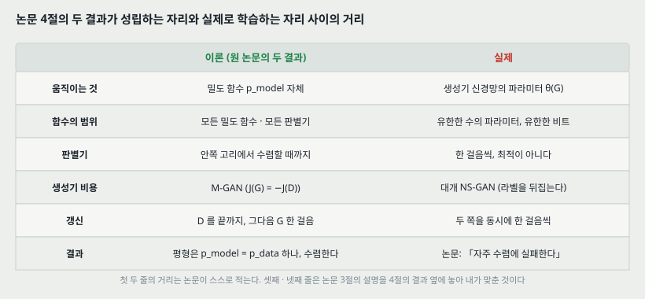

논문이 원 논문의 **중심 이론 결과**로 적는 것은 둘이다.

1. **밀도 함수 $p_\text{model}$ 과 판별기 함수 $D$ 의 공간에서** 국소 내시 평형은 하나뿐이고, 그 자리는 $p_\text{model} = p_\text{data}$ 다.
2. **그런 밀도 함수 위에서 직접 최적화할 수 있다면**, 안쪽 고리에서 $D$ 를 수렴할 때까지 배우고 바깥 고리에서 $p_\text{model}$ 을 작은 기울기 걸음만큼 움직이는 알고리즘이 그 평형으로 수렴한다.

**논문이 스스로 짚는 거리.** 밀도 함수 공간에서의 국소 움직임이라는 이론 모델은 **실제 학습과 그다지 관련이 없을 수 있다** — 실제로는 **유한한 수의 파라미터**를 가진 신경망으로 나타낼 수 있는 함수들 가운데에서, **각 파라미터가 유한한 비트로 나타내진** 채로, **생성기 파라미터 공간**에서 국소 움직임을 한다.

**그 뒤로 열린 물음들.** 여러 이론 모델에서 **내시 평형이 있는지**(Arora 외), **가짜 내시 평형이 있는지**(Unterthiner 외), **학습 알고리즘이 내시 평형으로 수렴하는지**(Nagarajan & Kolter), **수렴한다면 얼마나 빨리인지**(Mescheder 외)가 연구되고 있다. 논문은 **실용적으로 관심 있는 많은 경우에 이 물음들이 열려 있고, 최선의 학습 알고리즘도 실제로 자주 수렴에 실패하는 것 같다**고 적는다.

**위 그림의 셋째 · 넷째 줄은 내가 맞춘 것이다.** 결과 2 는 「$D$ 를 끝까지」 배우는 안쪽 고리를 가정하는데, 3절이 적는 가장 흔한 알고리즘은 **동시 한 걸음**이다. 그리고 결과가 서는 비용은 M-GAN 인데, 3절이 포화를 피하려고 쓴다고 적는 것은 NS-GAN 이다. 이 파일은 두 자리를 한 문장으로 잇지 않는다.

---

## 14. 「근사가 적다」 — 논문이 내세우는 성공의 이유 (3절)

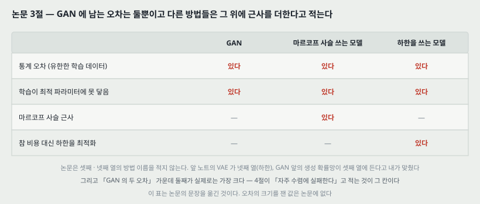

논문은 GAN 틀이 성공한 이유 하나를 **근사가 매우 적다**는 데서 찾는다. 다른 생성 모델 방법들은 계산할 수 없는 밀도 함수를 근사해야 하지만 GAN 은 참 과제에 대한 근사가 없고, **진짜 오차는 둘뿐**이라고 적는다.

1. **통계 오차** — 참 데이터 생성 분포를 재는 대신 유한한 학습 데이터를 뽑아 쓴다.
2. **학습 알고리즘이 정확한 최적 파라미터에 수렴하지 못하는 것.**

많은 다른 방법은 이 둘에 더해 **마르코프 사슬에 기댄 근사**, **참 비용 대신 비용의 하한을 최적화하는 것** 같은 근사 오차를 더 들인다고 적는다.

**내가 읽는 법.** 논문의 말 그대로 둘째 오차가 GAN 의 약점이다 — 12 · 13절이 보이듯 게임은 수렴이 보장되지 않으므로, 「오차가 둘뿐」이 「오차가 작다」는 뜻은 아니다. **오차의 크기를 방법끼리 잰 값은 이 파일에 없다.** 위 표의 「하한을 쓰는 모델」에 VAE 를, 「마르코프 사슬 쓰는 모델」에 생성 확률망을 넣은 것은 내가 맞춘 것이다(논문은 방법 이름을 적지 않는다).

그리고 논문은 **GAN 의 세부에 대해 구체적 지침을 주기 어렵다** — 연구가 너무 활발해서 구체적 조언이 금방 낡는다 — 고 적는다.

---

## 15. 결과 — 그림으로 보인 것 (그림 5 · 6)

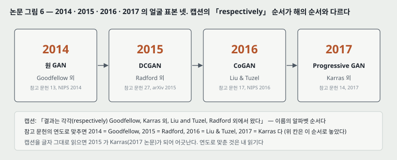

| 그림 | 보인 것 | 붙은 수치 |
|---|---|---|
| 5 | 연예인 사진으로 학습한 **Progressive GAN** 의 표본 한 장 — 「존재하지 않는 사람」 | 없다 |
| 6 | 2014 · 2015 · 2016 · 2017 의 얼굴 표본 한 장씩. GAN 도입 뒤 약 세 해의 진척 | 없다 |

**그림 6 캡션이 진척의 원인으로 드는 셋**: GAN 알고리즘의 변화, 바탕 딥러닝 알고리즘의 개선, 딥러닝 소프트웨어 · 하드웨어의 개선. 그리고 **이 빠른 진척 때문에 어떤 문서도 최신 GAN 능력이나 모범 사례를 요약할 수 없다**고 적는다. 그림은 Brundage 외(AI 오용 보고서)에서 허락받아 옮긴 것이다.

**캡션의 순서가 어긋난다.** 캡션은 네 결과가 「각각(respectively) Goodfellow, Karras 외, Liu and Tuzel, Radford 외」에서 왔다고 적는데, 이것은 **이름의 알파벳 순서**다. 참고 문헌의 연도로 맞추면 2014 = Goodfellow(NIPS 2014), 2015 = Radford 외(DCGAN, arXiv 2015), 2016 = Liu & Tuzel(CoGAN, NIPS 2016), 2017 = Karras 외(Progressive GAN, 2017)다. **연도로 맞춘 것은 내 읽기**이고, 캡션을 글자 그대로 읽으면 2015 의 얼굴이 2017 논문의 것이 된다.

**내 눈으로 본 것** — 2014 의 얼굴은 흐리고 잡음이 끼어 있고, 2017 의 얼굴은 사진과 가를 수 없을 만큼 또렷하다. **이것은 인상이다.** 그림 6 의 네 장은 해마다 **데이터셋 · 해상도 · 모델이 모두 다르다**(2014 원 논문의 얼굴 데이터와 2017 의 연예인 고해상도 데이터가 같지 않다). 곧 이 그림은 「같은 과제에서 얼마나 나아졌는가」를 재지 않는다.

---

## 16. 다른 주제들 (5절) — 얇은 다양체 하나를 그림으로

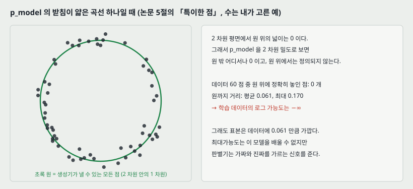

5절은 지면 때문에 한 문장씩만 적은 목록이다. 묶으면 이렇다.

| 묶음 | 논문이 적은 것 | 참고 문헌 |
|---|---|---|
| 조건부 | $p(x \mid y)$ 에서 뽑아 입력에 맞는 표본을 만든다 | Mirza & Osindero, Odena 외 |
| 다른 이론과의 연결 | 모멘트 맞추기(MMD), 최적 수송 | Li 외, Arjovsky 외 |
| 얇은 다양체 | $p_\text{model}$ 의 받침이 **얇은 다양체뿐**이고 학습 데이터에 **가능도 0** 을 매기는 모델도 배울 수 있다 | (MMD · 최적 수송과의 연결에서 특히 분명하다고 적는다) |
| 약점 | **이산 데이터**를 만들기 어렵다 — 판별기에서 생성기 출력을 거쳐 기울기를 보내야 하므로. 「점차 풀리는 중」 | Fedus 외 (MaskGAN) |
| 쓰임 | 빠진 데이터 채우기, **라벨 아주 적은 분류**, 비디오처럼 **정답이 여럿인** 예측, 짝 없는 도메인 변환(말 → 얼룩말), 과학 시뮬레이션, 학습용 가짜 데이터(구하기 어렵거나 개인정보 걱정이 있을 때), 도메인 적응, 대화형 이미지 효과, 다른 생성 모델의 변분 추론 풀기, 성별 같은 개념을 지도 없이 찾는 임베딩 | Yeh 외, Salimans 외, Mathieu 외, Zhu 외 등 |
| 평가 | 생성 모델(GAN 포함)의 성능 평가는 **그 자체로 어려운 연구 분야**다 | Salimans 외, Theis 외, Unterthiner 외, Wu 외 |
| 해석 | GAN 은 기계 학습이 **자기 비용 함수를 배우는** 길이고, 특정 예시 출력 대신 **학습 알고리즘 스스로 받아들일 만하다고 인정하는 출력**을 내도록 지도하는 길이다 | — |

**얇은 다양체 그림은 내가 고른 예다.** 2 차원 평면에서 생성기가 반지름 1 인 원 위의 점만 낸다고 하자. 원의 넓이는 0 이므로, 2 차원 밀도로 보면 $p_\text{model}$ 은 원 밖 어디서나 0 이다. 반지름 1 ± 가우스 잡음(표준편차 0.06)으로 뽑은 데이터 60 점 가운데 **원 위에 정확히 놓인 점은 0 개**다(원까지 거리 평균 0.061, 최대 0.170). 그래서 **학습 데이터의 로그 가능도는 $-\infty$** 이고 최대가능도는 이 모델을 배울 수 없다. 그래도 표본은 데이터와 평균 0.061 거리로 가깝고, 판별기는 가짜와 진짜를 가르는 신호를 준다. 논문의 「특이한 점(quirk)」이 이것이다.

---

## 17. 이 논문이 스스로 적은 한계와 조건

1. **학습이 어렵다.** 결론이 「현재 여전히 학습시키기 어렵다」고 적는다.
2. **수렴이 보장되지 않는다.** 실용적으로 관심 있는 많은 경우에 평형의 존재 · 수렴 · 속도의 물음이 열려 있고, 최선의 알고리즘도 실제로 자주 수렴에 실패하는 것 같다(4절).
3. **이론 결과가 실제 학습과 거리가 있다.** 밀도 함수 공간의 결과는 유한한 신경망 파라미터 공간의 학습과 그다지 관련이 없을 수 있다(4절).
4. **이산 데이터가 어렵다**(5절).
5. **평가가 어렵다**(5절). 가능도를 계산하지 않는 모델이라 흔한 비교 지표가 없다.
6. **세부 지침이 금방 낡는다**(3절, 그림 6 캡션).
7. **결론의 요구**: GAN 이 더 믿을 만한 기술이 되려면 **좋은 내시 평형을 늘, 빨리 찾을 수 있는** 모델 · 비용 · 학습 알고리즘을 설계해야 한다.

---

## 18. 논문이 적지 않은 것 — 내가 읽으며 짚은 자리

**하나. 이 파일에는 잰 값이 하나도 없다.** 표본 품질 · 가능도 · 학습 시간 어느 것도 수치로 나오지 않는다. 「GAN 은 가장 성공적인 생성 모델 가운데 하나」(초록), 「가장 인기 있는 비용들은 대체로 비슷하다」(3절), 「라벨 적은 분류에 매우 효과적」(5절)은 모두 인용으로 받친 문장이다. 개관판의 성격이므로 흠이라기보다 **이 파일만으로는 어느 주장도 확인할 수 없다**는 뜻이다.

**둘. 이론이 서는 비용과 권하는 비용이 다르다.** 4절의 두 결과는 M-GAN(영합 게임) 위에서 선다. 3절은 NS-GAN 이 포화를 피한다고 적는다. NS-GAN 에서는 $J^{(G)} \neq -J^{(D)}$ 라 9절의 「$-\log 4 + 2 \cdot \text{JSD}$」 유도가 그대로 서지 않는다. **실제로 쓰는 쪽의 이론이 이 파일에 없다.**

> **2026-10-04 원판을 읽고 고쳐 적는다.** 원판에는 NS 꼴에 대해 「$G$ 와 $D$ 의 움직임에서 **같은 고정점**이 나온다」는 문장이 한 줄 있다. 증명과 수렴 분석은 없다. 그러니 「이론이 없다」가 아니라 **「고정점이 같다는 주장만 있고 수렴 분석은 없다」**가 맞다. 그 주장은 따로 확인했다 — 판별기가 최적일 때 NS 꼴의 기준은 $\log 2 + \frac{1}{2}\mathrm{KL}$ 이상이고 최소는 $p_g = p_\text{data}$ 하나다.

**셋. 「근사가 적다」와 「수렴에 자주 실패한다」가 한 글에 함께 있다.** 3절은 GAN 의 오차가 통계 오차와 수렴 실패 둘뿐이라 근사가 적다고 적고, 4절은 그 수렴이 자주 실패한다고 적는다. 둘째 오차의 크기를 재지 않는 한 「근사가 적다」는 **오차의 종류를 센 것이지 크기를 잰 것이 아니다.**

**넷. 그림 6 은 같은 과제의 진척을 재지 않는다**(15절). 데이터셋과 해상도가 해마다 다르고, 한 해에 한 장이다. 캡션의 「각각」 순서도 연도와 어긋난다.

**다섯. 판별기가 멀리 있는 모델에게 주는 신호.** 9절의 계산에서 $m = 5$ 면 JSD 가 위 끝의 97.5% 에 있어 $V$ 가 거의 평평하다. 이 파일은 이 모양이 학습에 무엇을 뜻하는지 적지 않는다. **이 계산은 $D$ 가 최적이라는 가정 위에 있고, 실제 판별기는 최적이 아니다** — 그래서 이 자리가 실제 학습을 막는지는 이 노트가 말하지 않는다.

**여섯. 모드 붕괴를 말하지 않는다.** 생성기가 데이터의 일부 모양만 되풀이해 내는 실패는 GAN 에서 흔히 거론되는데, **이 파일 안에서는 찾지 못했다**(6 쪽 전체를 읽었다). 「수렴 실패」 한 묶음 안에 들어가 있다고 읽을 수도 있지만 파일이 그렇게 적지는 않는다.

---

## 19. 읽을 때 헷갈리는 지점

**이 파일은 원 논문이 아니다**(3절). 「GAN 논문을 읽었다」고 적으려면 원 NIPS 2014 논문을 따로 읽어야 한다. 이 노트의 식 대부분은 내가 옮기거나 유도한 것이다.

**생성기는 결정적 함수다.** 무작위는 $z$ 에만 있다. VAE 복호기가 $p(x \mid z)$ 라는 **분포**를 낸 것과 다르다 — GAN 에서는 같은 $z$ 가 늘 같은 $x$ 를 낸다.

**GAN 의 $z$ 는 부호기가 없다.** VAE 에서는 $x$ 를 넣으면 $q(z \mid x)$ 가 나왔지만, 원 GAN 에는 $x \to z$ 방향이 없다. 주어진 이미지의 $z$ 를 알려면 따로 찾아야 한다(21절 넷).

**판별기가 최종 산물이 아니다.** 평형에서 판별기는 어디서나 $\frac{1}{2}$ 을 내는 것이 목표다(그림 4(d)). 학습이 끝나면 대개 생성기만 쓴다.

**「최소화」의 주어를 늘 확인한다.** 판별기는 $V$ 를 **올리고**(= $J^{(D)}$ 를 내리고), 생성기는 M-GAN 에서 $V$ 를 **내린다.** NS-GAN 에서 생성기가 줄이는 것은 $-\log D(G(z))$ 이고 $V$ 가 아니다.

**원문의 오기 셋.** 그림 4 캡션이 데이터 분포를 「$p_x$」라고 한 번 적는다(나머지는 $p_\text{data}$). 3절에 「the generator is tried to minimize」와 「The later helps」(latter 의 오기)가 있다.

**「암묵적」이 「밀도가 없다」는 뜻은 아니다.** 논문은 밀도를 계산할 수 있는 모델도 GAN 생성기로 배울 수 있다고 적는다(Danihelka 외). 요점은 **밀도가 요구되지 않는다**는 것이다.

---

## 20. VAE(2014)와 맞춰 보기

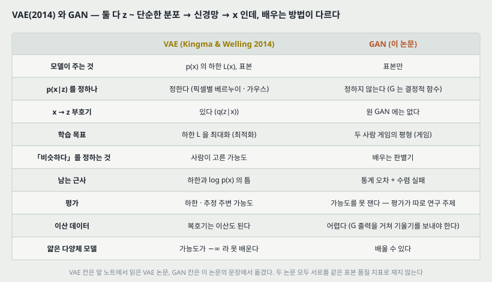

| | VAE (Kingma & Welling 2014) | GAN (이 파일) |
|---|---|---|
| 모델이 주는 것 | $\log p(x)$ 의 하한 $\mathcal{L}(x)$, 표본 | 표본만 |
| $p(x \mid z)$ 를 정하나 | 정한다 — 픽셀별 베르누이 · 가우스 | 정하지 않는다 — $G$ 는 결정적 함수 |
| $x \to z$ 부호기 | 있다 — $q_\phi(z \mid x)$ | 원 GAN 에는 없다 |
| 학습 목표 | 하한 $\mathcal{L}$ 최대화 — **최적화** | 두 사람 게임의 평형 — **게임** |
| 「비슷하다」를 정하는 것 | 사람이 고른 가능도 | 배우는 판별기 |
| 남는 근사 | 하한과 $\log p(x)$ 의 틈 | 통계 오차 + 수렴 실패 |
| 평가 | 하한, 추정 주변 가능도 | 가능도를 못 잰다 — 평가가 따로 연구 주제 |
| 이산 데이터 | 복호기 쪽은 이산도 된다 | 어렵다 |
| 얇은 다양체 모델 | 가능도가 $-\infty$ 라 못 배운다 | 배울 수 있다 |

**둘은 같은 뼈대 위에 있다** — 단순한 분포에서 $z$ 를 뽑아 신경망으로 $x$ 를 만든다. 다른 것은 **그 신경망을 무엇으로 고치느냐**다. VAE 는 **사람이 고른 가능도**가 「이 재구성이 얼마나 좋은가」를 정하고, GAN 은 **함께 배우는 판별기**가 「이 표본이 얼마나 진짜 같은가」를 정한다.

**두 논문으로는 「어느 쪽 표본이 더 좋다」를 말할 수 없다.** VAE 논문은 표본 품질을 재지 않았고, 이 파일도 두 방법을 같은 지표로 견주지 않는다.

---

## 21. 계보와 내가 가져갈 것

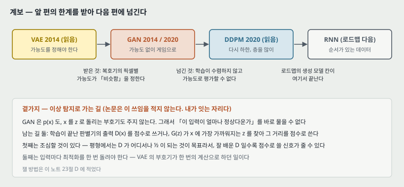

**하나. 앞 칸(VAE)에서 받은 것.** VAE 의 복호기는 픽셀별 가능도를 정해야 했고, 그 선택이 「무엇을 비슷하다고 보는가」를 정했다. GAN 은 그 선택을 **판별기에 맡긴다.** 이 파일의 말로는 「기계 학습이 자기 비용 함수를 배우는 길」이다.

**둘. 다음으로 넘기는 것.** GAN 이 얻은 것(사람이 가능도를 안 정함, 한 번에 표본)의 값으로 **수렴 보장과 가능도 평가**를 잃었다. 이미 읽은 DDPM(2020)은 다시 **변분 하한**으로 돌아가 층을 많이 쌓는 쪽이다 — 곧 로드맵의 생성 모델 칸 셋(VAE · GAN · Diffusion)이 **하한 → 게임 → 다시 하한**으로 오간다. **이 연결은 내가 이은 것이다.**

**셋. 로드맵의 생성 모델 칸이 여기서 끝난다.** 다음 칸 Diffusion 은 DDPM 노트가 이미 있다. 로드맵의 그다음은 RNN 이다.

**넷. 이상 탐지로 가는 곁가지 — 논문은 이 쓰임을 적지 않는다.** GAN 은 $p(x)$ 도, $x$ 를 $z$ 로 돌리는 부호기도 주지 않는다. 그래서 「이 입력이 얼마나 정상다운가」를 바로 물을 수 없다. 남는 길은 둘이다.

- **판별기 출력 $D(x)$ 를 점수로 쓰기.** 조심할 것 — 평형에서는 $D$ 가 어디서나 $\frac{1}{2}$ 이 되는 것이 목표다(8절). **잘 배운 판별기일수록 점수로 쓸 신호가 줄 수 있다.**
- **$G(z)$ 가 $x$ 에 가장 가까워지는 $z$ 를 찾아 그 거리를 점수로 쓰기.** 입력마다 최적화를 한 번 돌려야 한다 — VAE 의 부호기가 한 번의 계산으로 하던 일이다. 그리고 16절의 얇은 다양체처럼 생성기가 내는 자리가 좁으면, 정상 입력도 거리가 0 이 아니다.

> 넷째 문단은 내가 읽고 이은 것이고 이 파일이 측정한 것이 아니다. 23절에 잴 방법을 적어 둔다.

---

## 22. 다음에 읽을 것

**한계를 적고 그 한계를 푼 것이 다음 논문이다.** 이 파일이 남긴 자리에서 넷을 꼽는다.

| 다음 | 이 노트의 어느 자리에서 나오는가 | 무엇을 확인하고 싶은가 |
|---|---|---|
| **원 GAN** — Generative Adversarial Nets (NIPS 2014) | 3절 — 이 파일에 가치 함수 · 증명 · 알고리즘 · 실험이 없다 | 7절 식 (b) 의 표기가 원문과 같은가. 9절의 JSD 유도가 원문의 정리와 같은가. 원 논문의 실험이 무엇을 쟀는가. **2026-10-04 에 읽었다** — 식 (b) · (c) · JSD 셋이 원문과 같았다 |
| **Wasserstein GAN** (Arjovsky 외 2017, 이 파일의 참고 문헌 1) | 9절 · 18절 다섯 — 모델이 멀 때 JSD 가 평평하다 | 판별기 대신 다른 거리를 쓰면 멀리 있는 모델에 어떤 신호가 가는가 |
| **DCGAN** (Radford 외 2015, 참고 문헌 27) | 15절 — 그림 6 의 2015 칸. 5절의 「지도 없이 성별 같은 개념을 찾는 임베딩」 | 합성곱 구조로 무엇을 바꿔서 학습이 되게 했는가 |
| **수렴을 다룬 편** (Mescheder 외 「The numerics of GANs」 또는 Nagarajan & Kolter, 참고 문헌 21 · 24) | 12 · 13절 — 동시 갱신이 평형에 가지 않는 모양 | 12절의 $x \cdot y$ 예가 그 편들의 분석과 같은 자리인가 |

읽는 순서로는 **첫째가 먼저**다. 이 노트의 식 절반이 내가 유도한 것이라, 원문과 맞춰 봐야 한다. 로드맵 쪽으로는 Diffusion 칸이 이미 있으므로 다음 새 칸은 **RNN** 이다.

---

## 23. 돌려 볼 것

노트를 쓰며 나온 물음 중 **직접 잴 수 있는 것 넷**이다. **아직 실험 폴더를 만들지 않았고 돌리지 않았다.** 돌리게 되면 질문과 가설을 먼저 적는 규칙대로 폴더를 만든다.

| 무엇 | 이 노트의 어느 자리 | 묻는 것 |
|---|---|---|
| A | 8 · 11절 (그림 4) | 1 차원 가우스 데이터에 작은 GAN 을 배워 **그림 4 의 네 장면을 실제로 재현**한다. 판별기 출력이 식 (c) 의 $D^*$ 에 얼마나 가까이 가는가, 끝에 $\frac{1}{2}$ 근처로 모이는가(「근처」의 기준은 돌리기 전에 정한다) |
| B | 10절 | MNIST 에서 **M-GAN 과 NS-GAN** 을 같은 설정으로 배워, 처음 몇 백 걸음의 생성기 기울기 크기와 $D(G(z))$ 를 적는다. 99 배 같은 차이가 실제로 나오는가. seed 셋 |
| C | 12절 | 같은 GAN 을 **동시 갱신과 번갈아 갱신**으로 배워 수렴 여부와 표본을 비교한다. 1 차원 · 2 차원 섞인 가우스에서 먼저 |
| D | 21절 넷 | MNIST 한 숫자만으로 GAN 을 배운 뒤 나머지 아홉 숫자를 가를 때 **판별기 점수 · $z$ 찾기 거리**의 AUROC 가 얼마인가. 같은 조건의 VAE 하한과 견준다(VAE 노트의 돌려 볼 것 D 와 짝이다) |

---

## 24. 물어 두는 것

- **원 논문의 가치 함수 표기가 7절 식 (b) 와 같은가.** 무게 $\frac{1}{2}$ 이 있는지, 기댓값의 첨자를 어떻게 적는지.
- **원 논문이 NS-GAN 을 이론 절에서 다루는가.** 이 파일은 「원 논문이 비용 두 판을 냈다」고만 적는다.
- **그림 6 의 2014 얼굴은 원 논문의 어느 데이터셋인가.** 캡션은 「Goodfellow」만 적는다.
> **2026-10-04 원판을 읽고 답한다.** 가치 함수는 식 (b) 와 같다. NS 꼴은 이론 절에서 다루지 않고 「같은 고정점」 한 문장만 있다. 2014 얼굴은 원판의 얼굴 데이터(TFD)로 추정되나 캡션으로 확인되지 않는다. 그림 4 는 원판 그림 1 과 같은 그림이고 손그림으로 읽히는데, **(a) 캡션이 원판은 「수렴에 가까운 쌍」, 이 파일은 「초기화 때」로 다르다.**

- **그림 4 의 판별기는 어떻게 그렸는가.** 캡션은 「(a) 무작위 초기화된 깊은 신경망」이라고 적는데, 그림 전체가 직관을 위한 만화(cartoon)라고 스스로 적는다 — 실제 학습 곡선인지 손으로 그린 것인지.

---

## 25. 참고 문헌

이 노트가 부른 편만 적는다. 원리는 원 출처를, 구현은 그 라이브러리의 편을 적는 규칙을 따른다. 이 노트는 라이브러리를 부르지 않았다(그림 코드는 파이썬 표준 라이브러리만 쓴다).

- Goodfellow, I., Pouget-Abadie, J., Mirza, M., Xu, B., Warde-Farley, D., Ozair, S., Courville, A., and Bengio, Y. (2020). Generative adversarial networks. **Communications of the ACM**, 63(11):139–144. DOI 10.1145/3422622. — 이 노트의 대상.
- Goodfellow, I. 외 (2014). Generative adversarial nets. NIPS 27, 2672–2680. — 원판(이 파일의 참고 문헌 13). 이 노트를 쓸 때는 읽지 않았고 **2026-10-04 에 읽어 노트를 따로 썼다.**
- Kingma, D. P. and Welling, M. (2014). Auto-encoding variational Bayes. ICLR. — 둘째 길의 예(참고 문헌 15), 20절의 비교 상대.
- Bengio, Y., Thibodeau-Laufer, E., Alain, G., and Yosinski, J. (2014). Deep generative stochastic networks trainable by backprop. ICML. — GAN 이전의 암묵적 모델(참고 문헌 4).
- Arjovsky, M., Chintala, S., and Bottou, L. (2017). Wasserstein GAN. arXiv:1701.07875. — 다른 판별기 꼴, 최적 수송(참고 문헌 1).
- Lucic, M., Kurach, K., Michalski, M., Gelly, S., and Bousquet, O. (2017). Are GANs created equal? A large-scale study. arXiv:1711.10337. — 비용들이 대체로 비슷하다는 근거(참고 문헌 18).
- Metz, L., Poole, B., Pfau, D., and Sohl-Dickstein, J. (2016). Unrolled generative adversarial networks. arXiv:1611.02163. — 식 (e) 를 최적화로 다룬 편(참고 문헌 22).
- Ratliff, L. J., Burden, S. A., and Sastry, S. S. (2013). Characterization and computation of local Nash equilibria in continuous games. Allerton. — 국소 내시 평형(참고 문헌 28).
- Nagarajan, V. and Kolter, J. Z. (2017). Gradient descent GAN optimization is locally stable. NIPS 30. — 수렴(참고 문헌 24).
- Mescheder, L., Nowozin, S., and Geiger, A. (2017). The numerics of GANs. NIPS. — 수렴 속도(참고 문헌 21).
- Radford, A., Metz, L., and Chintala, S. (2015). Unsupervised representation learning with deep convolutional generative adversarial networks. arXiv:1511.06434. — 그림 6 의 2015 칸(참고 문헌 27).
- Karras, T., Aila, T., Laine, S., and Lehtinen, J. (2017). Progressive growing of GANs for improved quality, stability, and variation. arXiv:1710.10196. — 그림 5, 그림 6 의 2017 칸(참고 문헌 14).
- Ho, J., Jain, A., and Abbeel, P. (2020). Denoising Diffusion Probabilistic Models. NeurIPS. — 21절 둘의 연결. **이 파일의 참고 문헌에는 없다.**

---

## 26. 경로

| 무엇 | 어디 |
|---|---|
| 원문 PDF (CACM 2020 개관판) | `papers/CACM20_GAN_Generative_Adversarial_Networks.pdf` |
| 이 노트 | `notes/CACM20_GAN_Generative_Adversarial_Networks.md` |
| 이 노트의 그림 | `figures/CACM20_GAN/fig01_three_paths.svg` 부터 `fig14_lineage.svg` 까지 열넷 |
| 그림을 만드는 코드 | `figures/CACM20_GAN/make_figures.py` — 바깥 데이터를 읽지 않으므로 `python make_figures.py` 로 어디서나 다시 만든다. 2 · 4 · 5 · 6 · 7 · 8 · 12 번 그림의 수는 이 파일이 계산해 화면에도 찍는다 |
