# ResNet — Deep Residual Learning for Image Recognition (요약)

> **한 줄.** 층을 더 쌓았는데 **학습 오차부터** 높아지는 퇴화 문제를, 층들이 원하는 함수 $H(x)$ 를 직접 배우는 대신 **그 함수와 입력의 차 $F(x) = H(x) - x$ 를 배우고 입력을 지름길로 더하게** 바꿔서 푼다. 지름길은 파라미터도 계산도 더하지 않는다. 그 결과 152 층 망이 VGG-19 보다 계산이 적으면서 ImageNet top-5 오차를 앙상블 3.57% 까지 내렸다. 새로운 것은 망을 깊게 만드는 새 부품이 아니라 **같은 층에게 배울 대상을 바꿔 준 것**이다.

---

## Paper Metadata

| Item | Content |
|---|---|
| Title | Deep Residual Learning for Image Recognition |
| Authors | Kaiming He, Xiangyu Zhang, Shaoqing Ren, Jian Sun |
| 소속 | 넷 다 Microsoft Research |
| Conference / Journal | CVPR 2016 (IEEE Conference on Computer Vision and Pattern Recognition), 770–778쪽 |
| Year | 2016 (arXiv 첫 판 2015-12, arXiv:1512.03385) |
| 코드 | 본문에 코드 주소가 없다. 구현은 Caffe 로 쉽게 할 수 있다고만 적는다 |
| Stored PDF | `papers/CVPR16_ResNet_Deep_Residual_Learning_for_Image_Recognition.pdf` (바탕화면에서 받은 이름은 `He_Deep_Residual_Learning_CVPR_2016_paper.pdf`) |
| 왜 읽었는가 | 로드맵의 CNN 칸이 AlexNet(2012)에서 멈춰 있었다. 지금까지의 노트가 모두 「깊어지면 배워지지 않는다」를 다뤘고(역전파의 기울기 감쇠, DBN · 오토인코더의 사전학습, AlexNet 의 ReLU), 이 논문이 그 흐름의 결론 자리다. 그리고 연구에서 쓰는 PatchCore 의 특징 추출기가 이 논문의 망을 넓힌 WideResNet-50 이다 |
| 읽은 범위 | **2026-09-29 에 9 쪽을 전부 읽었다.** 곧 초록 · 1~4절 · 그림 1~7 과 캡션 · 표 1~8 · 식 (1)(2) · 참고 문헌 49 건의 목록 |

### 저장한 파일의 상태

- **CVF 오픈 액세스판**이다. 첫 쪽 위에 「IEEE Xplore 판과 워터마크 말고는 같다」는 문구가 있다.
- **부록이 없다.** 4.3절과 표 7 · 8 이 「부록을 보라」고 적는 검출 구현 세부와 ILSVRC · COCO 2015 검출 · 위치 찾기 · 분할 1 위 결과는 arXiv 판의 부록에 있고, **이 파일에는 들어 있지 않다.** 이 노트는 그 부록의 수치를 옮기지 않는다.
- **글자 층이 살아 있다.** 표는 글자로 옮겼고, 표 1 의 괄호 묶음처럼 글자가 흩어진 자리는 쪽을 그림으로 띄워 맞췄다. **그림 1 · 4 · 6 · 7 의 곡선 값은 본문에 없어 300 dpi 로 키워 눈금을 읽었다.** 읽기 오차를 표마다 적는다.

---

## 1. 용어

이 노트에서 쓸 이름을 먼저 정한다. 논문의 원래 용어는 괄호로 함께 적는다.

- **평범한 망 (plain network)**: 층을 그냥 차례로 쌓은 망. 이 논문의 비교 기준이다. 작은 예시로, 3x3 합성곱 34 층을 이어 붙인 「평범한 34 층」.
- **잔차 망 (residual network, ResNet)**: 평범한 망의 층 둘(또는 셋)마다 입력을 출력에 더하는 지름길을 붙인 망. 층 수 · 폭 · 파라미터가 평범한 망과 같게 만들 수 있다.
- **퇴화 문제 (degradation problem)**: 망을 깊게 하면 정확도가 포화했다가 빠르게 떨어지는데, **그것이 과적합 때문이 아니라 학습 오차부터 높아지는** 현상. 작은 예시로, CIFAR-10 평범한 망에서 20 층의 학습 오차가 약 1.5% 인데 56 층은 약 6% 다(그림 1).
- **바탕 함수 (underlying mapping)** $H(x)$: 층 몇 개가 입력 $x$ 에서 만들어 내야 하는 함수.
- **잔차 함수 (residual function)** $F(x) := H(x) - x$: 바탕 함수에서 입력을 뺀 것. 작은 예시로, $H(x) = 2.1$ 을 내야 하는데 $x = 2.0$ 이면 $F(x) = 0.1$ 만 배우면 된다.
- **지름길 연결 (shortcut connection)**: 층 하나 이상을 건너뛰는 연결. 이 논문에서는 **항등 사상**(입력을 그대로 넘긴다)이고, 층의 출력에 원소별로 더한다.
- **항등 지름길 / 사영 지름길 (identity / projection shortcut)**: 입력을 그대로 더하는 것 / 1x1 합성곱 $W_s$ 를 거쳐 더하는 것. 사영은 채널 수나 공간 크기가 바뀌어 그대로 더할 수 없을 때 쓴다.
- **블록 (building block)**: 지름길 하나가 건너뛰는 층 묶음. **기본 블록**은 3x3 합성곱 둘, **병목 블록 (bottleneck)** 은 1x1 · 3x3 · 1x1 셋이다.
- **단계 (stage)**: 같은 공간 크기의 블록 묶음. 표 1 의 `conv2_x` ~ `conv5_x` 넷이다. 224 입력이면 크기가 56 · 28 · 14 · 7 이다. PyTorch 구현은 이것을 `layer1` ~ `layer4` 라 부른다.
- **FLOPs**: 이 논문에서는 **곱-덧셈 수 (multiply-adds)** 다. 작은 예시로, 3x3 합성곱이 64 채널을 받아 64 채널을 56x56 에 내면 $9 \times 64 \times 64 \times 56 \times 56 = 115{,}605{,}504$ 번이다.
- **top-1 / top-5 오차**: 1 등 답이 틀린 비율 / 상위 5 개 안에 정답이 없는 비율.
- **10-crop 시험**: 시험 이미지 하나에서 네 모서리 · 가운데 다섯 조각과 그 좌우 뒤집기 다섯, 모두 열 조각의 점수를 평균하는 것(AlexNet 의 방식).
- **배치 정규화 (batch normalization, BN)**: 미니배치 안에서 층 출력을 평균 0 · 분산 1 로 맞춘 뒤 학습되는 척도 $\gamma$ 와 이동 $\beta$ 를 씌우는 층. 이 논문은 **모든 합성곱 바로 뒤, 활성 앞**에 둔다.

---

## 2. 한 문단 요약

깊이가 중요하다는 것이 알려지자 「층을 더 쌓기만 하면 더 좋은 망이 되는가」라는 물음이 생긴다. 사라지는/터지는 기울기는 정규화된 초기화와 BN 으로 대부분 해결됐는데, 그러자 **퇴화 문제**가 드러났다 — 깊은 평범한 망이 얕은 망보다 **학습 오차부터** 높다(그림 1). 얕은 망을 베끼고 더한 층을 항등으로 두면 깊은 망도 같은 학습 오차를 낼 수 있으므로, 이것은 해가 없는 것이 아니라 **풀이기가 그 해를 못 찾는 것**이다. 논문은 층들이 $H(x)$ 대신 $F(x) = H(x) - x$ 를 배우게 하고 입력을 항등 지름길로 더한다(식 1). 지름길은 파라미터도 계산도 더하지 않아 평범한 망과 공정하게 비교할 수 있다. ImageNet 에서 평범한 34 층은 18 층보다 top-1 오차가 높지만(28.54 대 27.94), 잔차 34 층은 18 층보다 낮다(25.03 대 27.88, 표 2). 1x1 · 3x3 · 1x1 병목 블록으로 50 · 101 · 152 층을 만들었고, 152 층(11.3 G FLOPs)이 VGG-19(19.6 G)보다 계산이 적으면서 단일 모델 top-5 4.49%(검증), 여섯 모델 앙상블 3.57%(시험)로 ILSVRC 2015 분류 1 위를 했다. CIFAR-10 에서는 110 층이 6.43%, 1202 층도 학습 오차 0.1% 아래까지 배워졌지만 시험 오차는 7.93% 로 110 층보다 높았다(표 6). 층 응답의 표준편차가 잔차 망에서 더 작다는 분석(그림 7)으로 「잔차 함수는 0 에 가깝다」는 동기를 받친다.

---

## 3. 문제 — 퇴화: 깊게 했더니 학습 오차부터 높아진다 (1절, 그림 1)

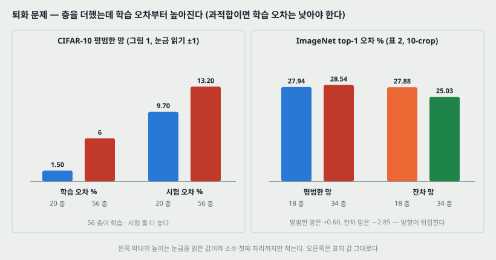

**논문이 문제를 적는 순서.** 깊이가 중요하다 → 층을 쌓기만 하면 되는가 → 걸림돌이던 사라지는/터지는 기울기는 **정규화된 초기화**(LeCun 1998, Glorot 2010, Saxe 2013, He 2015)와 **중간 정규화 층**(BN)으로 「대부분 해결됐다」 → 그러자 **퇴화 문제**가 드러났다.

**퇴화의 두 특징.**

1. 깊이를 늘리면 정확도가 포화하고(놀랍지 않다) **그다음 빠르게 떨어진다.**
2. 그 떨어짐이 **과적합 때문이 아니다** — 층을 더하면 **학습 오차**가 높아진다.

그림 1 은 CIFAR-10 의 평범한 20 층과 56 층이다. 오른쪽 끝(약 64,000 반복)의 값을 300 dpi 로 읽었다(눈금 10 → 읽기 ±1).

| | 20 층 | 56 층 |
|---|---:|---:|
| 학습 오차 % | 1.5 | 6 |
| 시험 오차 % | 9.7 | 13.2 |

**과적합이면 학습 오차는 깊은 쪽이 더 낮아야 한다.** 여기서는 학습 · 시험 둘 다 깊은 쪽이 높다. 그래서 문제는 일반화가 아니라 **최적화**다.

ImageNet 에서도 같다(표 2, top-1 %, 10-crop).

| | 평범한 망 | 잔차 망 |
|---|---:|---:|
| 18 층 | 27.94 | 27.88 |
| 34 층 | 28.54 | **25.03** |

평범한 망은 34 층이 18 층보다 0.60 높고, 잔차 망은 2.85 낮다. **층을 늘렸을 때의 방향이 뒤집힌다.**

---

## 4. 구성 논증 — 깊은 망에는 얕은 망만큼 좋은 해가 늘 있다 (1절)

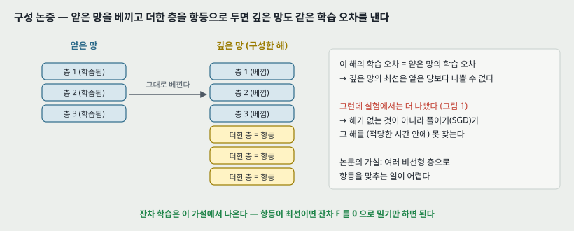

얕은 망 하나와, 그 위에 층을 더 얹은 깊은 망을 생각한다. 깊은 망에는 **구성으로 만든 해**가 있다 — 얕은 망에서 배운 층을 그대로 베끼고, **더한 층을 항등 사상**으로 두는 것. 이 해의 학습 오차는 얕은 망과 같다. 그러므로 **깊은 망의 최선은 얕은 망보다 나쁠 수 없다.**

그런데 실험에서는 더 나빴다. 논문의 결론은 「지금 가진 풀이기가 구성한 해만큼 좋거나 더 좋은 해를 **찾지 못한다**(또는 적당한 시간 안에 못 찾는다)」이다. 곧 **해가 없는 것이 아니라 찾지 못하는 것**이다.

**여기서 나오는 가설** (3.1절): 퇴화는 풀이기가 **여러 비선형 층으로 항등 사상을 근사하는 데 어려움을 겪을 수 있음**을 시사한다. 이 가설이 잔차 학습의 출발점이다.

---

## 5. 잔차 학습 — 식 (1)(2) (3.1 · 3.2절, 그림 2)

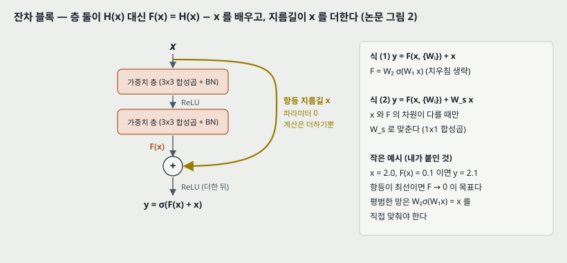

### 5.1 바꿔 적기

층 몇 개가 맞춰야 할 바탕 함수를 $H(x)$ 라 하자. 여러 비선형 층이 복잡한 함수를 점근적으로 근사할 수 있다고 가정하면(논문 각주 2 는 **이 가설 자체가 아직 열린 물음**이라고 적는다), 그 층들이 잔차 $H(x) - x$ 도 근사할 수 있다고 가정하는 것과 같다(입력과 출력의 차원이 같다고 할 때). 그래서 층들에게 $H$ 대신

$$F(x) := H(x) - x$$

를 배우게 하고, 원래 함수는 $F(x) + x$ 로 되살린다. **두 꼴 모두 원하는 함수를 근사할 수 있지만 배우기 쉬운 정도가 다를 수 있다**는 것이 논문의 주장이다.

**극단의 경우.** 항등이 최적이면, 평범한 망은 비선형 층 여럿으로 $x$ 를 그대로 내는 함수를 맞춰야 하고, 잔차 망은 **층들의 가중치를 0 쪽으로 밀기만** 하면 된다.

**실제로는** 항등이 최적일 가능성은 낮다. 논문은 그래도 이 바꿔 적기가 **전처리(preconditioning)** 로 도울 수 있다고 적는다 — 최적 함수가 영 사상보다 항등 사상에 가까우면, 새 함수를 처음부터 배우는 것보다 **항등을 기준으로 한 섭동**을 찾는 편이 쉬울 것이다. 이것을 받치는 실험이 14절(그림 7)이다.

### 5.2 블록의 식

$$y = F(x, \{W_i\}) + x \qquad (1)$$

$x$, $y$ 는 블록의 입력과 출력, $F(x, \{W_i\})$ 는 배울 잔차 사상이다. 그림 2 처럼 층이 둘이면 $F = W_2 \sigma(W_1 x)$ 이고 $\sigma$ 는 ReLU 다(치우침은 생략). $F + x$ 는 지름길과 원소별 덧셈으로 하고, **둘째 비선형은 더한 뒤에** 둔다: $\sigma(y)$.

**지름길은 파라미터도 계산도 더하지 않는다**(원소별 덧셈은 무시할 만큼 작다고 논문이 적는다). 이것이 실용적으로도 좋지만, **평범한 망과 잔차 망을 파라미터 수 · 깊이 · 폭 · 계산량이 모두 같은 채로 비교할 수 있게** 해 준다는 점이 더 중요하다.

$x$ 와 $F$ 의 차원이 다르면(채널 수가 바뀔 때) 지름길에서 선형 사영 $W_s$ 로 맞춘다.

$$y = F(x, \{W_i\}) + W_s x \qquad (2)$$

식 (1) 에도 정사각 행렬 $W_s$ 를 쓸 수 있지만, 논문은 **항등으로 퇴화 문제를 푸는 데 충분하고 경제적**이라 차원을 맞출 때만 $W_s$ 를 쓴다(7절에서 실험으로 보인다).

**$F$ 의 층 수.** 이 논문은 층 둘 또는 셋을 쓴다. **층 하나면** 식 (1) 이 $y = W_1 x + x$ 라는 선형 층과 비슷해지고, **이점을 관찰하지 못했다**고 적는다. 식은 완전연결 층으로 적었지만 합성곱에도 그대로 쓰고, 덧셈은 두 특징 지도에 채널별로 한다.

---

## 6. 왜 쉬워지는가 — 논문의 설명과 내가 붙인 예

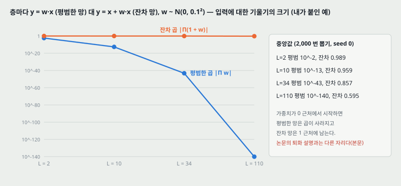

**논문의 설명은 5.1절의 전처리 논리 하나다.** 기울기로 설명하지 **않는다** — 오히려 11절에서 평범한 망의 퇴화가 사라지는 기울기 때문이 **아닐 것**이라고 적는다(BN 이 순방향 신호의 분산을 0 이 아니게 지키고, 역방향 기울기의 노름도 건강하다는 것을 **확인했다**고 적는다).

**그래도 「항등을 기준으로 한다」가 무엇을 바꾸는지를 가장 작은 꼴로 계산해 봤다(내가 붙인 예).** 층마다 스칼라 하나를 곱하는 선형 사슬이다.

- 평범한 층: $y = w \cdot x$ → 입력에 대한 기울기는 $\prod_l w_l$
- 잔차 층: $y = x + w \cdot x$ → 입력에 대한 기울기는 $\prod_l (1 + w_l)$

$w_l$ 을 $\mathcal{N}(0, 0.1^2)$ 에서 뽑아(가중치가 0 근처에서 시작하는 상황) 2,000 번 되풀이한 중앙값이다(seed 0).

| 층 수 $L$ | 평범한 곱 $\prod w$ | 잔차 곱 $\prod (1 + w)$ |
|---:|---:|---:|
| 2 | $10^{-2.4}$ | 0.989 |
| 10 | $10^{-12.6}$ | 0.959 |
| 34 | $10^{-43.3}$ | 0.857 |
| 110 | $10^{-140.1}$ | 0.595 |

**읽는 법.** 가중치가 0 근처일 때 평범한 사슬은 곱이 사라지고, 잔차 사슬은 1 근처에 남는다. **항등이 「아무것도 안 배운 상태」의 기본값이 된다**는 것이 이 예의 요점이다 — 평범한 망이 항등을 내려면 모든 $w_l = 1$ 로 **맞춰야** 하고, 잔차 망은 $w_l = 0$ 이면 **이미** 항등이다.

> **주의.** 이 예는 선형 · 스칼라이고 BN 이 없다. 논문의 망은 BN 을 쓰므로 평범한 망도 이렇게 곱이 사라지지 않는다 — **그래서 이 예는 퇴화의 원인을 보인 것이 아니라 「항등이 기준점이 된다」는 전처리 논리를 숫자로 옮긴 것이다.** 110 층에서 잔차 곱도 0.595 로 줄어드는 것은 $\log(1 + w)$ 의 평균이 약 $-w^2/2$ 로 음수라서다.

---

## 7. 지름길 선택지 A · B · C (3.3 · 4.1절, 표 3)

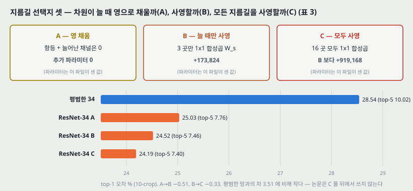

차원이 늘어나는 자리(단계가 바뀌는 곳, 그림 3 의 점선 지름길)에서 셋을 견줬다. 공간 크기가 반으로 줄 때는 지름길도 보폭 2 로 한다.

| 선택지 | 방법 | ResNet-34 파라미터 (내가 센 값) | top-1 | top-5 |
|---|---|---:|---:|---:|
| 평범한 34 | 지름길 없음 | 21,623,848 | 28.54 | 10.02 |
| A | 늘어난 채널은 **0 으로 채운** 항등 | 21,623,848 (+0) | 25.03 | 7.76 |
| B | 늘 때만 **사영**(1x1 합성곱), 나머지는 항등 | 21,797,672 (+173,824) | 24.52 | 7.46 |
| C | **모든** 지름길이 사영 | 22,716,840 (B 보다 +919,168) | 24.19 | 7.40 |

(오차는 표 3 의 값, 10-crop. 파라미터는 합성곱 + BN($\gamma$, $\beta$) + fc 를 그림 코드가 센 것이다.)

**논문의 해석.** 셋 다 평범한 망보다 크게 낫다. **B 가 A 보다 조금 나은 것**은 A 의 영으로 채운 채널에서는 잔차 학습이 일어나지 않기 때문이라고 본다. **C 가 B 보다 아주 조금 나은 것**은 사영 지름길 **열셋**이 더한 파라미터 때문이라고 본다(34 층의 지름길 16 개 중 B 가 3 개를 이미 사영하므로 16 − 3 = 13, 그림 코드로 맞춰 봤다). **A/B/C 의 차이가 작으므로 사영은 퇴화를 푸는 데 필수가 아니다** — 그래서 뒤에서는 C 를 쓰지 않는다.

A → B 가 −0.51, B → C 가 −0.33 이고, 평범한 망과 A 의 차이는 3.51 이다.

---

## 8. 망의 모양 (3.3절, 그림 3 · 표 1)

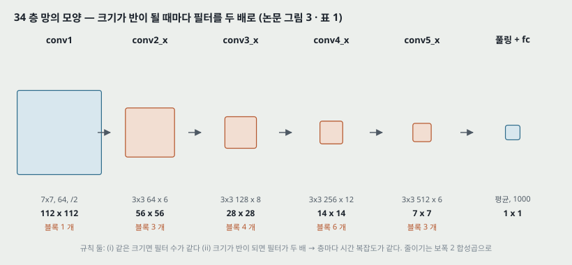

### 8.1 평범한 기준 망

VGG 의 철학을 따른다. 합성곱은 대부분 3x3 이고 **규칙 둘**을 지킨다.

1. 같은 출력 크기에서는 층들의 필터 수가 같다.
2. 크기가 반이 되면 필터 수를 두 배로 해 **층마다 시간 복잡도를 유지**한다.

줄이기는 **보폭 2 합성곱**으로 직접 하고, 끝은 전역 평균 풀링과 1000 갈래 완전연결 층 + 소프트맥스다. 가중치 층이 34 개다. **VGG 보다 필터가 적고 복잡도가 낮다** — 34 층 기준 망이 3.6 G FLOPs 로 VGG-19(19.6 G)의 18% 라고 적는다(내가 센 값으로는 3.66 / 19.63 = 18.6%).

**잔차 망**은 이 평범한 망의 3x3 층 둘마다 지름길을 넣은 것이다.

### 8.2 표 1 — 다섯 깊이

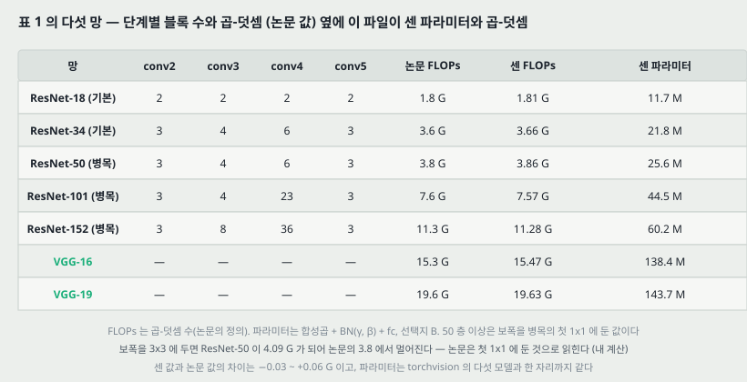

| 단계 | 출력 크기 | 18 층 | 34 층 | 50 층 | 101 층 | 152 층 |
|---|---|---|---|---|---|---|
| conv1 | 112x112 | 7x7, 64, 보폭 2 | 같다 | 같다 | 같다 | 같다 |
| conv2_x | 56x56 | 3x3 최댓값 풀링 보폭 2, 이어서 [3x3 64, 3x3 64] x 2 | [3x3 64, 3x3 64] x 3 | [1x1 64, 3x3 64, 1x1 256] x 3 | 같다 x 3 | 같다 x 3 |
| conv3_x | 28x28 | [3x3 128, 3x3 128] x 2 | x 4 | [1x1 128, 3x3 128, 1x1 512] x 4 | x 4 | x 8 |
| conv4_x | 14x14 | [3x3 256, 3x3 256] x 2 | x 6 | [1x1 256, 3x3 256, 1x1 1024] x 6 | x 23 | x 36 |
| conv5_x | 7x7 | [3x3 512, 3x3 512] x 2 | x 3 | [1x1 512, 3x3 512, 1x1 2048] x 3 | x 3 | x 3 |
| 끝 | 1x1 | 평균 풀링, 1000 fc, 소프트맥스 | | | | |
| FLOPs (논문) | | 1.8 G | 3.6 G | 3.8 G | 7.6 G | 11.3 G |

줄이기는 conv3_1 · conv4_1 · conv5_1 에서 보폭 2 로 한다.

**그림 코드가 센 값** (선택지 B, 합성곱 + BN + fc).

| 망 | 파라미터 | FLOPs (센 값) | FLOPs (논문) |
|---|---:|---:|---:|
| ResNet-18 | 11,689,512 | 1.81 G | 1.8 G |
| ResNet-34 | 21,797,672 | 3.66 G | 3.6 G |
| ResNet-50 | 25,557,032 | 3.86 G | 3.8 G |
| ResNet-101 | 44,549,160 | 7.57 G | 7.6 G |
| ResNet-152 | 60,192,808 | 11.28 G | 11.3 G |
| VGG-16 | 138,357,544 | 15.47 G | 15.3 G |
| VGG-19 | 143,667,240 | 19.63 G | 19.6 G |

**맞춰 본 것 둘.** (가) 다섯 ResNet 의 파라미터가 **torchvision 의 같은 이름 모델과 한 자리까지 같다.** (나) FLOPs 는 논문 값과 −0.03 ~ +0.06 G 안에서 맞는다. 다만 **50 층 이상의 병목에서 보폭 2 를 어디에 두느냐**에 따라 값이 갈린다 — 첫 1x1 에 두면 ResNet-50 이 3.86 G, 3x3 에 두면 4.09 G 다. 논문의 3.8 은 첫 1x1 쪽과 맞는다. 표 1 캡션은 「conv3_1 에서 보폭 2」라고만 적어 블록 안의 어느 층인지 밝히지 않으므로 **이것은 내 계산으로 읽은 것**이다.

---

## 9. 병목 블록 (4.1절, 그림 5)

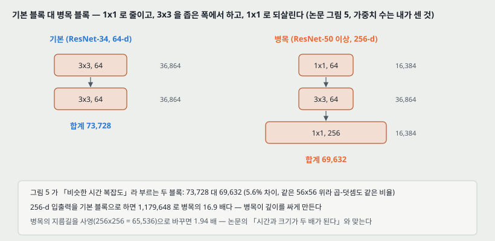

감당할 수 있는 학습 시간 때문에 50 층 이상에서는 블록을 **병목 설계**로 바꾼다. 잔차 함수 하나에 층 둘 대신 **1x1, 3x3, 1x1** 셋을 쓴다. 1x1 두 층이 차원을 **줄였다가 되살리고**, 3x3 층은 좁은 폭에서 일한다.

**가중치 수를 세면 이렇다(내가 센 것, 치우침과 BN 제외).**

| 블록 | 층 | 가중치 |
|---|---|---:|
| 기본 (ResNet-34, 64-d) | 3x3 64→64, 3x3 64→64 | 36,864 + 36,864 = **73,728** |
| 병목 (ResNet-50, 256-d) | 1x1 256→64, 3x3 64→64, 1x1 64→256 | 16,384 + 36,864 + 16,384 = **69,632** |
| 기본 블록을 256-d 로 | 3x3 256→256 두 번 | **1,179,648** |

- 그림 5 가 「비슷한 시간 복잡도」라 부르는 두 블록이 73,728 대 69,632 로 5.6% 차이다. 둘 다 56x56 위에 있어 곱-덧셈도 같은 비율이다.
- 256-d 입출력을 기본 블록으로 하면 병목의 **16.9 배**다. 병목이 깊이를 싸게 만드는 이유가 이것이다.

**병목에서는 항등 지름길이 특히 중요하다.** 지름길이 **고차원인 양 끝(256-d)** 을 잇기 때문에, 그것을 사영으로 바꾸면 256 x 256 = 65,536 이 더해져 블록이 **1.94 배**가 된다. 논문의 「시간 복잡도와 모델 크기가 두 배가 된다」와 맞는다.

**각주 4 가 적는 것 둘.** 병목이 아닌 더 깊은 ResNet 도 깊이에서 정확도를 얻지만(CIFAR-10 에서 보인다) 병목만큼 경제적이지 않다 — 곧 병목은 **실용적 이유**다. 그리고 **평범한 망의 퇴화는 병목 설계에서도 관찰됐다.**

**50 · 101 · 152 층.** 34 층의 2 층 블록을 3 층 병목으로 바꾸면 50 층이 된다(차원이 늘 때는 선택지 B, 3.8 G FLOPs). 병목을 더 쌓아 101 층(7.6 G)과 152 층(11.3 G)을 만든다. **152 층도 VGG-16/19(15.3/19.6 G)보다 복잡도가 낮다.**

---

## 10. 구현 설정 (3.4 · 4.2절)

| 항목 | ImageNet | CIFAR-10 |
|---|---|---|
| 데이터 | 학습 128 만 장, 검증 5 만 장, 시험 10 만 장(서버), 1000 부류 | 학습 5 만 장, 시험 1 만 장, 10 부류 |
| 늘리기 | 짧은 변을 [256, 480] 에서 무작위로 크기 조정, 224x224 무작위 자르기 또는 뒤집기, 픽셀 평균 빼기, AlexNet 의 색 늘리기 | 가장자리에 4 픽셀 채우고 32x32 무작위 자르기 또는 뒤집기 |
| BN | 모든 합성곱 바로 뒤, 활성 앞 | 같다 |
| 초기화 | He 외 2015 (PReLU 논문)의 방식, 처음부터 학습 | 같다 |
| 최적화 | SGD, 미니배치 256, 학습률 0.1 에서 시작해 오차가 멈추면 10 으로 나눔, 최대 60 만 반복 | SGD, 미니배치 128 (GPU 둘), 학습률 0.1, 32k · 48k 반복에서 10 으로 나눔, 64k 에서 끝 |
| 가중치 감쇠 · 관성 | 0.0001 · 0.9 | 같다 |
| 드롭아웃 | 쓰지 않는다 (BN 논문의 관행) | 쓰지 않는다 |
| 시험 | 비교 연구는 10-crop, 최고 결과는 완전 합성곱 꼴 + 다중 크기(짧은 변 224 · 256 · 384 · 480 · 640) 평균 | 원래 32x32 한 장 |

CIFAR-10 의 64k 반복 끝점은 **학습 45k / 검증 5k 로 나눠 정했다**고 적는다.

---

## 11. 결과 1 — ImageNet 에서 평범한 망 대 잔차 망 (4.1절, 그림 4 · 표 2)

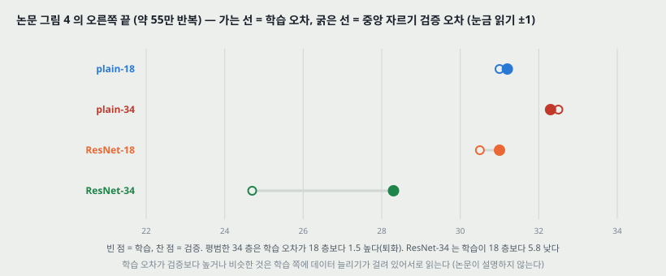

그림 4 의 가는 선은 학습 오차, 굵은 선은 **중앙 자르기 한 장의** 검증 오차다(표 2 의 10-crop 과 다르다). 오른쪽 끝(약 55 만 반복)의 값을 읽었다(눈금 10 → 읽기 ±1).

| 망 | 학습 오차 % | 검증 오차 % (중앙 자르기) |
|---|---:|---:|
| plain-18 | 31.0 | 31.2 |
| plain-34 | 32.5 | 32.3 |
| ResNet-18 | 30.5 | 31.0 |
| ResNet-34 | 24.7 | 28.3 |

**평범한 망.** 34 층이 **학습 내내** 학습 오차가 더 높다 — 18 층의 해 공간이 34 층의 해 공간의 부분 공간인데도. 논문은 이것이 **사라지는 기울기 때문일 가능성은 낮다**고 적는다. 망이 BN 으로 학습돼 순방향 신호의 분산이 0 이 아니고, 역방향 기울기의 노름도 건강하다는 것을 **확인했다**고 적는다. 34 층 평범한 망도 경쟁력 있는 정확도에 닿으므로 풀이기가 어느 정도는 일한다. 논문의 추측은 **깊은 평범한 망의 수렴 속도가 지수적으로 낮을 수 있다**는 것이고, 이유는 앞으로 연구한다고 적는다. 각주 3: 반복을 **세 배** 늘려도 퇴화가 남았다.

**잔차 망 — 관찰 셋.**

1. **상황이 뒤집힌다.** ResNet-34 가 ResNet-18 보다 2.8% 낫고(27.88 − 25.03 = 2.85), 학습 오차가 상당히 낮으며 검증으로 일반화된다.
2. **같은 34 층끼리** 잔차 망이 top-1 을 3.5% 줄인다(28.54 − 25.03 = 3.51). 학습 오차를 성공적으로 줄인 결과다.
3. **18 층에서는 둘이 비슷하다**(27.94 대 27.88). 다만 ResNet-18 이 **더 빨리 수렴한다.** 「지나치게 깊지 않을 때」는 SGD 가 평범한 망에서도 좋은 해를 찾고, 잔차 망은 초기 수렴을 빠르게 해 준다.

---

## 12. 결과 2 — ImageNet 최신 방법과의 비교 (표 3 · 4 · 5)

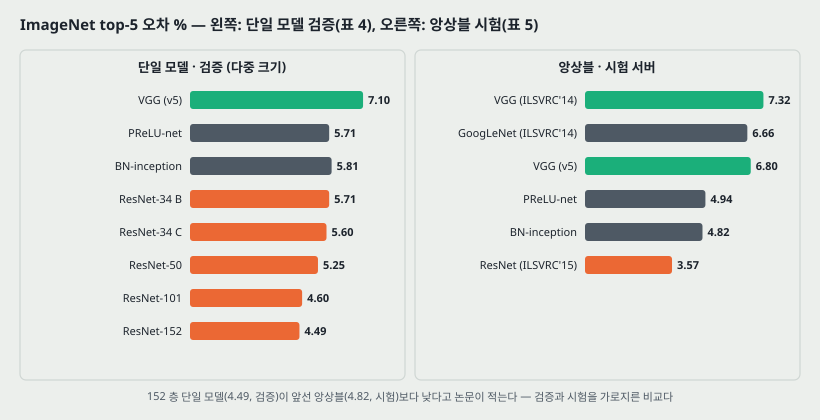

**표 3 (검증, 10-crop, 오차 %).** ResNet-50/101/152 는 선택지 B.

| 모델 | top-1 | top-5 |
|---|---:|---:|
| VGG-16 (저자들이 직접 시험) | 28.07 | 9.33 |
| GoogLeNet | - | 9.15 |
| PReLU-net | 24.27 | 7.38 |
| plain-34 | 28.54 | 10.02 |
| ResNet-34 A | 25.03 | 7.76 |
| ResNet-34 B | 24.52 | 7.46 |
| ResNet-34 C | 24.19 | 7.40 |
| ResNet-50 | 22.85 | 6.71 |
| ResNet-101 | 21.75 | 6.05 |
| ResNet-152 | 21.43 | 5.71 |

**표 4 (단일 모델, 검증, 다중 크기, † 는 시험).**

| 방법 | top-1 | top-5 |
|---|---:|---:|
| VGG (ILSVRC'14) | - | 8.43 † |
| GoogLeNet (ILSVRC'14) | - | 7.89 |
| VGG (v5) | 24.4 | 7.1 |
| PReLU-net | 21.59 | 5.71 |
| BN-inception | 21.99 | 5.81 |
| ResNet-34 B | 21.84 | 5.71 |
| ResNet-34 C | 21.53 | 5.60 |
| ResNet-50 | 20.74 | 5.25 |
| ResNet-101 | 19.87 | 4.60 |
| ResNet-152 | **19.38** | **4.49** |

**표 5 (앙상블, 시험 서버, top-5 %).**

| 방법 | top-5 |
|---|---:|
| VGG (ILSVRC'14) | 7.32 |
| GoogLeNet (ILSVRC'14) | 6.66 |
| VGG (v5) | 6.8 |
| PReLU-net | 4.94 |
| BN-inception | 4.82 |
| **ResNet (ILSVRC'15)** | **3.57** |

**읽는 법 셋.**

1. **50 · 101 · 152 층에서 퇴화가 보이지 않는다.** 표 3 · 4 의 모든 지표에서 깊이가 늘수록 오차가 준다(표 3 top-1 22.85 → 21.75 → 21.43).
2. **앙상블 3.57%** 는 깊이가 다른 여섯 모델을 묶은 것이고, 제출 당시 그중 152 층은 둘뿐이었다고 적는다. ILSVRC 2015 분류 1 위다.
3. 논문은 **152 층 단일 모델(4.49%)이 앞선 모든 앙상블 결과(표 5)를 넘는다**고 적는다. 다만 4.49 는 **검증**, 표 5 는 **시험 서버**의 값이다(18절 넷).

---

## 13. 결과 3 — CIFAR-10 과 1000 층 (4.2절, 그림 6 · 표 6)

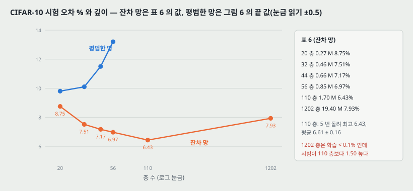

**목적은 최고 성능이 아니라 아주 깊은 망의 행동**이라서 일부러 단순한 구조를 쓴다. 입력 32x32, 첫 층 3x3 합성곱, 그다음 3x3 합성곱 $6n$ 층을 특징 지도 크기 {32, 16, 8} 에 $2n$ 층씩, 필터 {16, 32, 64}. 줄이기는 보폭 2 합성곱, 끝은 전역 평균 풀링 + 10 갈래 fc + 소프트맥스. 가중치 층이 모두 $6n + 2$ 다.

| 출력 크기 | 32x32 | 16x16 | 8x8 |
|---|---|---|---|
| 층 수 | 1 + 2n | 2n | 2n |
| 필터 수 | 16 | 32 | 64 |

지름길은 3x3 층 둘마다(모두 $3n$ 개), **모두 선택지 A** 라 잔차 망과 평범한 망의 깊이 · 폭 · 파라미터가 정확히 같다.

**표 6 (시험 오차 %, 모두 데이터 늘리기 사용).** 파라미터 칸 옆에 그림 코드가 센 값을 붙였다.

| 방법 | 층 | 파라미터 (표) | 파라미터 (센 값) | 오차 |
|---|---:|---:|---:|---:|
| Maxout | | | | 9.38 |
| NIN | | | | 8.81 |
| DSN | | | | 8.22 |
| FitNet | 19 | 2.5M | | 8.39 |
| Highway | 19 | 2.3M | | 7.54 (7.72 ± 0.16) |
| Highway | 32 | 1.25M | | 8.80 |
| ResNet | 20 | 0.27M | 0.270M | 8.75 |
| ResNet | 32 | 0.46M | 0.464M | 7.51 |
| ResNet | 44 | 0.66M | 0.659M | 7.17 |
| ResNet | 56 | 0.85M | 0.853M | 6.97 |
| ResNet | 110 | 1.7M | 1.728M | **6.43 (6.61 ± 0.16)** |
| ResNet | 1202 | 19.4M | 19.421M | 7.93 |

ResNet-110 은 **5 번 돌려 「최고 (평균 ± 표준편차)」** 로 적었다(Highway 논문의 방식).

**평범한 망 (그림 6 왼쪽).** 깊을수록 학습 오차가 높다. 오른쪽 끝의 값을 읽었다(눈금 5 → 읽기 ±0.5).

| 평범한 망 | 20 | 32 | 44 | 56 |
|---|---:|---:|---:|---:|
| 시험 오차 % | 9.8 | 10.1 | 11.5 | 13.2 |
| 학습 오차 % | 1.2 | 1.2 | 3.3 | 5.8 |

평범한 110 층은 오차가 60% 를 넘어 그림에 그리지 않았다. 논문은 이것이 ImageNet(그림 4 왼쪽)과 MNIST(Highway 논문)에서와 같아 **최적화 어려움이 근본적인 문제**임을 시사한다고 적는다.

**110 층.** 처음 학습률 0.1 은 수렴을 시작하기에 **조금 크다**. 그래서 학습 오차가 80% 아래가 될 때까지(약 400 반복) 0.01 로 **데우고** 0.1 로 돌아간다. 각주 5: 0.1 로 시작해도 몇 에폭 뒤 수렴을 시작하고(< 90%) 비슷한 정확도에 닿는다.

**1202 층 ($n = 200$).** 최적화 어려움이 없고 **학습 오차 0.1% 아래**에 닿는다(그림 6 오른쪽). 시험 오차는 7.93% 로 여전히 괜찮지만 **110 층(6.43%)보다 1.50 높다.** 둘 다 학습 오차가 비슷하므로 논문은 이것을 **과적합**으로 본다 — 이 작은 데이터에 19.4M 은 불필요하게 클 수 있다. 이 데이터의 최고 결과들은 maxout 이나 드롭아웃 같은 강한 정규화를 쓰는데, 이 논문은 **최적화에 집중하려고** 쓰지 않았고, 결합은 앞으로의 일이라고 적는다.

---

## 14. 결과 4 — 층 응답의 크기 (4.2절, 그림 7)

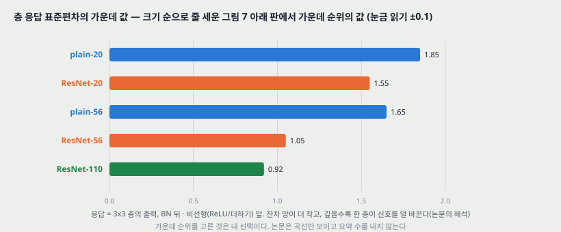

**응답**은 각 3x3 층의 출력이고, **BN 뒤 · 다른 비선형(ReLU / 덧셈) 앞**에서 잰다. 잔차 망에서는 이것이 **잔차 함수의 응답 세기**다. 그림 7 위 판은 층 순서대로, 아래 판은 크기 순으로 줄 세운 표준편차다.

아래 판에서 **가운데 순위의 값**을 읽었다(눈금 1 → 읽기 ±0.1). 가운데 순위를 고른 것은 내 선택이고, 논문은 요약 수를 내지 않는다.

| 망 | 가운데 순위의 표준편차 |
|---|---:|
| plain-20 | 1.85 |
| ResNet-20 | 1.55 |
| plain-56 | 1.65 |
| ResNet-56 | 1.05 |
| ResNet-110 | 0.92 |

**논문이 적는 것 둘.** (가) **잔차 망의 응답이 대체로 평범한 망보다 작다** — 잔차 함수가 비잔차 함수보다 대체로 0 에 가까울 것이라는 5.1절의 동기를 받친다. (나) **깊은 잔차 망일수록 응답이 작다**(20 → 56 → 110). 층이 많으면 **한 층이 신호를 덜 바꾸는** 경향이 있다.

> **주의.** 이 응답은 **BN 뒤**에서 잰 값이다. BN 은 출력을 평균 0 · 분산 1 로 맞춘 뒤 학습되는 척도 $\gamma$ 를 곱하므로, 여기서 잰 표준편차는 **대체로 그 층의 $\gamma$ 의 크기**를 보는 것에 가깝다고 나는 읽는다(18절 다섯). 논문은 이 점을 말하지 않는다.

---

## 15. 결과 5 — 검출 (4.3절, 표 7 · 8)

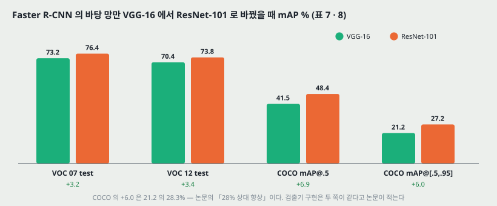

Faster R-CNN 의 바탕 망만 VGG-16 에서 ResNet-101 로 바꿨다. 두 쪽의 검출 구현(부록, 이 파일에 없다)이 같아 **이득은 더 나은 망 때문**이라고 적는다.

| 데이터 | 지표 | VGG-16 | ResNet-101 | 차 |
|---|---|---:|---:|---:|
| PASCAL VOC 07 test (학습 07+12) | mAP | 73.2 | 76.4 | +3.2 |
| PASCAL VOC 12 test (학습 07++12) | mAP | 70.4 | 73.8 | +3.4 |
| COCO val | mAP@.5 | 41.5 | 48.4 | +6.9 |
| COCO val | mAP@[.5, .95] | 21.2 | 27.2 | +6.0 |

COCO 표준 지표의 +6.0 은 21.2 의 28.3% 로, 초록의 「28% 상대 향상」이다(그림 코드가 나눠 확인했다). ILSVRC & COCO 2015 의 ImageNet 검출 · ImageNet 위치 찾기 · COCO 검출 · COCO 분할 1 위는 부록에 세부가 있다고 적는다 — **이 파일에는 없다.**

---

## 16. 관련 연구 — 논문이 자리를 매긴 곳 (2절)

**잔차 표현.** 이미지 인식에서 VLAD 는 사전에 대한 **잔차 벡터**로 부호화하고, 피셔 벡터는 VLAD 의 확률판이다. 벡터 양자화에서도 원래 벡터보다 **잔차를 부호화하는 편이 효과적**이다(Jegou 외의 곱 양자화). 편미분 방정식을 푸는 **다중 격자법**은 거친 크기와 고운 크기 사이의 **잔차**를 맡는 부분 문제로 나누고, 계층 기저 전처리도 두 크기 사이의 잔차 벡터를 변수로 쓴다. 이런 풀이기가 잔차 성질을 모르는 풀이기보다 **훨씬 빨리 수렴한다** — 좋은 바꿔 적기나 전처리가 최적화를 단순하게 할 수 있다는 것이 논문이 가져오는 교훈이다.

**지름길 연결.** 오래 연구됐다. 초기 MLP 학습에서 입력에서 출력으로 선형 층을 잇는 관행, 사라지는/터지는 기울기를 막으려 중간 층을 보조 분류기에 잇는 GoogLeNet · DSN, 층 응답 · 기울기 · 오차의 중심을 맞추는 방법들, 지름길 가지와 깊은 가지로 된 인셉션 층.

**Highway 망 (같은 시기).** 지름길에 **게이트 함수**를 둔다. 게이트는 데이터에 의존하고 **파라미터가 있다.** 게이트가 「닫히면」(0 에 가까우면) 층이 비잔차 함수를 나타낸다. 이 논문의 항등 지름길은 **파라미터가 없고 결코 닫히지 않아**, 늘 모든 정보가 지나가고 잔차 함수가 추가로 배워진다. 그리고 Highway 망은 **극단적으로 깊이를 늘렸을 때(예: 100 층 넘게) 정확도 이득을 보이지 않았다**고 적는다.

---

## 17. 이 논문이 스스로 적은 한계와 조건

1. **퇴화의 원인은 밝히지 못했다.** 사라지는 기울기가 아닐 것이라는 것과 「수렴 속도가 지수적으로 낮을 수 있다」는 추측까지이고, 이유는 앞으로 연구한다고 적는다(11절).
2. **여러 비선형 층이 복잡한 함수를 근사한다는 가설 자체가 열린 물음이다**(각주 2).
3. **층 하나짜리 잔차 함수는 이점을 관찰하지 못했다**(5.2절).
4. **1202 층은 110 층보다 시험 오차가 높다** — 과적합으로 보고, 강한 정규화와의 결합은 앞으로의 일이다(13절).
5. **110 층은 학습률을 데워야 했다**(13절).
6. **병목은 학습 시간 때문의 실용적 선택이다**(각주 4).
7. 항등이 최적일 가능성은 낮다 — 잔차 학습은 **전처리**로 도울 **수 있다**고 적는다(5.1절).

---

## 18. 논문이 적지 않은 것 — 내가 읽으며 짚은 자리

**하나. 「기울기 노름이 건강하다」는 확인의 수치가 없다.** 퇴화가 사라지는 기울기 때문이 아니라는 핵심 논거가 「확인했다(verify)」 한 문장이다. 층별 기울기 노름의 그림이나 표가 본문에 없어서, **어느 층에서 얼마였는지 이 파일로는 알 수 없다.**

**둘. 변동 폭이 한 자리에만 있다.** CIFAR-10 ResNet-110 의 5 번(6.61 ± 0.16)뿐이다. 그 표준편차 0.16 을 잣대로 보면, 선택지 B → C 의 −0.33(ImageNet, 한 번), 표 2 의 18 층 평범 대 잔차 0.06 같은 차이는 **이 실행의 순서**로만 읽는다. 특히 **C 가 나은 이유를 「열세 개 사영의 추가 파라미터」로 돌린 것**은 파라미터를 맞춘 대조 없이 붙인 설명이다.

**셋. 표 6 의 110 층 대표값이 「최고」다.** 6.43 은 다섯 번 중 최고이고 평균은 6.61 이다. 다른 행(20 · 32 · 44 · 56 · 1202 층)은 한 번이라 최고인지 아닌지 적혀 있지 않다. 1202 층의 7.93 을 110 층과 견줄 때 **평균 6.61 과 견주면 차이는 1.32** 가 된다.

**넷. 「단일 모델이 모든 앙상블을 넘는다」는 검증과 시험을 가로지른다.** 152 층 4.49 는 표 4 의 **검증**, 앙상블 4.82 · 4.94 는 표 5 의 **시험 서버** 값이다. 표 4 에 시험 값이 있는 행은 VGG 8.43 † 하나다.

**다섯. 그림 7 은 BN 뒤에서 잰다.** BN 이 분산을 1 로 맞춘 뒤 $\gamma$ 를 곱하므로, 여기의 표준편차는 **입력 분포보다 학습된 $\gamma$ 를 더 많이 반영**한다고 읽는다. 「잔차 함수가 0 에 가깝다」를 보이려면 BN 앞이나 **블록 출력 대비 잔차의 비율**을 재는 편이 곧을 것이다. 이것은 내 읽기이고 재지 않았다.

**여섯. 퇴화를 푸는 것과 정확도를 올리는 것이 한 실험에 겹쳐 있다.** 잔차 34 층이 평범한 34 층보다 3.51 낫다는 것은 선택지 A(파라미터 같음)로 보였다 — 이 비교는 깨끗하다. 그런데 50 층 이상은 **병목 + 선택지 B** 라서, 「깊이 덕」과 「병목 구조 덕」이 갈리지 않는다. 같은 병목의 **평범한 50 층**의 수치는 각주 4 의 한 문장(퇴화가 관찰됐다)뿐이다.

**일곱. 원문의 오기 하나.** 4.1절 「the same as the above plain nets, **expect** that a shortcut ...」(except).

---

## 19. 읽을 때 헷갈리는 지점

**이 논문은 사라지는 기울기를 푼 논문이 아니다.** 논문 스스로 사라지는 기울기는 초기화와 BN 으로 「대부분 해결됐다」고 적고 시작하며, 풀려는 것은 **그 뒤에 드러난 퇴화**다. 흔히 「ResNet 이 기울기 소실을 해결했다」고 요약하지만, 이 논문의 주장은 아니다.

**퇴화는 과적합이 아니다.** 학습 오차가 높아지는 것이 요점이다. 반대로 1202 층의 시험 오차 상승은 논문이 **과적합**으로 본다 — 한 논문 안에 두 현상이 다 있다.

**ReLU 는 덧셈 뒤에 있다.** 그림 2 에서 둘째 ReLU 는 $F(x) + x$ 를 더한 **뒤**다. 그래서 이 논문의 블록 출력은 늘 0 이상이고, 지름길이 엄밀한 항등 경로는 아니다(ReLU 를 한 번 지난다). 이 순서를 바꾼 것이 22절의 다음 편이다.

**「34 층」은 가중치 층을 센 것이다.** 합성곱과 fc 만 세고 풀링 · BN · ReLU 는 세지 않는다. 34 = 7x7 합성곱 1 + 3x3 합성곱 32 + fc 1.

**선택지 A · B · C 는 34 층에서만 비교했다.** 50 층 이상은 B 로 고정이고, CIFAR-10 은 모두 A 다.

**FLOPs 는 곱-덧셈 수다.** 곱과 덧셈을 따로 세는 관례면 값이 두 배쯤 된다.

**그림 4 의 검증 오차와 표 2 는 다르다.** 그림은 **중앙 자르기 한 장**, 표는 **10-crop** 이다. 그래서 그림 끝의 ResNet-34 약 28.3 과 표의 25.03 이 다르다.

---

## 20. VGG 와 맞춰 보기

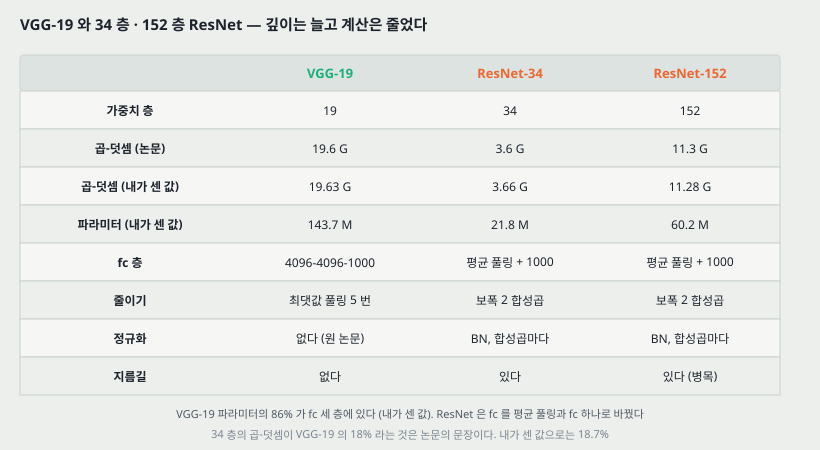

| | VGG-19 | ResNet-34 | ResNet-152 |
|---|---|---|---|
| 가중치 층 | 19 | 34 | 152 |
| FLOPs (논문) | 19.6 G | 3.6 G | 11.3 G |
| FLOPs (센 값) | 19.63 G | 3.66 G | 11.28 G |
| 파라미터 (센 값) | 143.7 M | 21.8 M | 60.2 M |
| 끝 | fc 4096-4096-1000 | 평균 풀링 + fc 1000 | 평균 풀링 + fc 1000 |
| 줄이기 | 최댓값 풀링 | 보폭 2 합성곱 | 보폭 2 합성곱 |
| 정규화 | 없다 | BN, 합성곱마다 | BN, 합성곱마다 |
| 지름길 | 없다 | 있다 | 있다 (병목) |

**같은 것.** 3x3 합성곱을 주로 쓰고, 크기가 반이 되면 필터를 두 배로 한다 — 논문이 스스로 **평범한 기준 망은 VGG 의 철학에서 왔다**고 적는다.

**다른 것 셋.** (가) **VGG-19 파라미터의 86% 가 fc 세 층**에 있다(그림 코드가 센 값). ResNet 은 그것을 평균 풀링 + fc 하나로 바꿔 파라미터가 34 층 21.8M 으로 줄었다. (나) 줄이기를 풀링 대신 보폭 2 합성곱으로 한다. (다) BN 과 지름길이 있어 **152 층까지** 간다.

**깊이와 계산이 반대로 간다.** 152 층이 19 층보다 계산이 적다(11.3 대 19.6 G). 파라미터의 대부분이 있던 fc 를 없애고 병목으로 3x3 을 좁은 폭에서 하기 때문이다.

---

## 21. 계보와 내가 가져갈 것

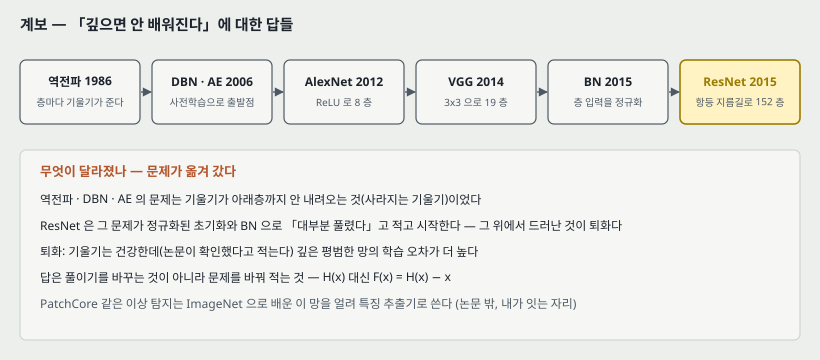

**하나. 이 저장소의 노트들이 다뤄 온 한 문제의 결론 자리.** 역전파 노트에서 층마다 기울기가 10~12 배씩 줄었고, DBN 과 오토인코더는 사전학습으로 출발점을 찾아 그것을 우회했고, AlexNet 은 ReLU 로 8 층을 배웠다. VGG(19 층)와 BN 을 거쳐 이 논문에 오면, **문제가 옮겨 가 있다** — 사라지는 기울기는 초기화와 BN 으로 대부분 풀렸다고 보고, 그 위에서 드러난 **퇴화**를 푼다. 그리고 그 답은 풀이기를 바꾸는 것이 아니라 **문제를 바꿔 적는 것**($H$ 대신 $F = H - x$)이다.

**둘. DBN 실험과 겹치는 자리.** DBN 실험에서 사전학습은 기울기를 **키우는 것이 아니라 편다**(3 층 → 1 층 감쇠 14.8 배 대 4.9 배)는 것을 쟀다. 이 논문의 항등 지름길은 **학습 없이** 모든 블록에 1 이라는 경로를 깔아 둔다(6절의 스칼라 예). 둘 다 「깊이에 걸쳐 신호가 한쪽으로 몰리지 않게」 하는 쪽이라는 것은 **내가 이은 연결**이고, 같은 조건에서 잰 적은 없다.

**셋. 이상 탐지로 가는 곁가지 — PatchCore 가 쓰는 자리 (논문은 이 쓰임을 적지 않는다. 내가 잇는 것이다).**

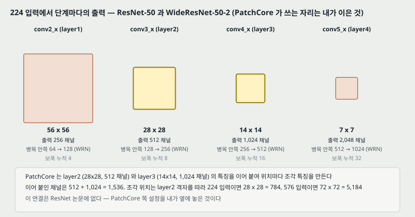

PatchCore 는 ImageNet 으로 배운 **WideResNet-50-2** 를 얼려 특징 추출기로 쓴다. WideResNet-50-2 는 이 논문의 ResNet-50 과 단계 · 블록 수가 같고 **병목 안쪽 폭만 두 배**다(그림 코드가 센 파라미터 68,883,240, torchvision 의 같은 모델과 같다).

| 단계 (PyTorch 이름) | 224 입력의 출력 | 출력 채널 | 보폭 누적 | 블록 |
|---|---|---:|---:|---:|
| conv2_x (layer1) | 56x56 | 256 | 4 | 3 |
| conv3_x (layer2) | 28x28 | 512 | 8 | 4 |
| conv4_x (layer3) | 14x14 | 1,024 | 16 | 6 |
| conv5_x (layer4) | 7x7 | 2,048 | 32 | 3 |

- PatchCore 는 **layer2 와 layer3** 을 쓴다. 이어 붙인 채널은 512 + 1,024 = 1,536 이고, 조각 위치는 layer2 격자(보폭 8)를 따른다 — 224 입력이면 28 x 28 = 784, 576 입력이면 72 x 72 = 5,184 조각이다.
- **왜 가운데 두 단계인가를 이 논문의 말로 옮기면**: layer1 은 너무 국소적이고, layer4 는 ImageNet 분류 과제에 맞춰져 있다(마지막 단계 뒤가 곧 평균 풀링 + 1000 부류 fc 다). **이 이유는 PatchCore 쪽 설명이고 이 논문이 한 말이 아니다.**
- **14절과 이어지는 물음.** 깊은 잔차 망일수록 한 블록이 신호를 덜 바꾼다면, 단계 안의 **마지막 블록 출력**과 **가운데 블록 출력**은 얼마나 다른가. PatchCore 가 단계 끝을 쓰는 것이 합당한지 잴 수 있다(23절 D).

> 셋째 문단은 내가 읽고 이은 것이고 이 논문이 측정한 것이 아니다.

---

## 22. 다음에 읽을 것

**한계를 적고 그 한계를 푼 것이 다음 논문이다.** 이 논문이 남긴 자리에서 셋을 꼽는다.

| 다음 | 이 노트의 어느 자리에서 나오는가 | 무엇을 확인하고 싶은가 |
|---|---|---|
| **Identity Mappings in Deep Residual Networks** (He 외, ECCV 2016, arXiv:1603.05027) | 19절 — 둘째 ReLU 가 덧셈 뒤에 있어 지름길이 엄밀한 항등이 아니다. 17절 넷 — 1202 층이 110 층보다 나쁘다 | BN · ReLU 를 잔차 가지 앞으로 옮기면(사전 활성) 지름길이 순수 항등이 되는가. 1000 층의 시험 오차가 나아지는가 |
| **Wide Residual Networks** (Zagoruyko & Komodakis, BMVC 2016, arXiv:1605.07146) | 21절 셋 — PatchCore 의 특징 추출기. 13절 — 깊고 가는 1202 층이 과적합 | 깊이 대신 폭을 늘리면 무엇이 달라지는가. WideResNet-50-2 가 어떻게 정해졌는가 |
| **Highway Networks** (Srivastava 외, 2015, arXiv:1505.00387) | 16절 — 게이트가 있는 지름길 | 게이트가 닫힐 수 있는 지름길과 늘 열린 항등의 차이가 실험에서 어디서 갈리는가 |

읽는 순서로는 **첫째가 먼저**다. 같은 저자들이 이 논문의 블록을 스스로 고친 편이다. 둘째는 연구와 바로 닿는다.

---

## 23. 돌려 볼 것

노트를 쓰며 나온 물음 중 **직접 잴 수 있는 것 넷**이다. **아직 실험 폴더를 만들지 않았고 돌리지 않았다.** 돌리게 되면 질문과 가설을 먼저 적는 규칙대로 폴더를 만든다.

| 무엇 | 이 노트의 어느 자리 | 묻는 것 |
|---|---|---|
| A | 3 · 13절 | CIFAR-10 에서 평범한 망과 잔차 망 20 · 56 층을 seed 셋으로 배워 **퇴화가 변동 폭 밖에서 나타나는가.** 표 6 의 ResNet-110 표준편차 0.16 과 같은 잣대로 |
| B | 11 · 18절 하나 | 같은 실행에서 **층별 기울기 노름**을 적어, 평범한 56 층의 기울기가 정말 「건강한가」. 잔차 망과 층별로 몇 배 다른가 |
| C | 14 · 18절 다섯 | 그림 7 의 표준편차를 **BN 앞 · BN 뒤 · 블록 출력 대비 잔차 비율** 셋으로 재서, 「잔차가 0 에 가깝다」가 어느 잣대에서 서는가. BN 의 $\gamma$ 와 얼마나 같이 움직이는가 |
| D | 21절 셋 | MVTec AD 한 부류에서 PatchCore 특징을 **단계 끝 대 단계 가운데 블록**, 그리고 **ResNet-50 대 WideResNet-50-2** 로 바꿔 AUROC 가 얼마 달라지는가 |

---

## 24. 물어 두는 것

- **병목에서 보폭 2 는 어느 층에 있었나.** 8.2절의 계산으로는 첫 1x1 이 논문의 FLOPs 와 맞는데, 표 1 캡션은 블록 이름(conv3_1)까지만 적는다.
- **「기울기 노름이 건강하다」를 어떻게 확인했나.** 층별 값이 부록이나 뒤 논문에 있는지.
- **앙상블 여섯 모델의 구성.** 「깊이가 다른 여섯, 그중 152 층 둘」 말고는 적혀 있지 않다.
- **CIFAR-10 의 1202 층은 몇 번 돌렸나.** 7.93 이 한 번의 값인지.
- **그림 7 의 첫 층 값(약 3)** 이 모든 망에서 튀는 이유 — 첫 층은 잔차 블록 밖의 합성곱이라서인지.

---

## 25. 참고 문헌

이 노트가 부른 편만 적는다. 원리는 원 출처를, 구현은 그 라이브러리의 편을 적는 규칙을 따른다. 그림 코드는 파이썬 표준 라이브러리만 쓴다. 파라미터 수를 맞춰 본 **torchvision** 은 값을 대조하는 데만 썼고 코드에서 부르지 않았다.

- He, K., Zhang, X., Ren, S., and Sun, J. (2016). Deep residual learning for image recognition. CVPR, 770–778. arXiv:1512.03385. — 이 노트의 대상.
- Simonyan, K. and Zisserman, A. (2015). Very deep convolutional networks for large-scale image recognition. ICLR. — 평범한 기준 망의 철학, 20절의 비교 상대(참고 문헌 40).
- Ioffe, S. and Szegedy, C. (2015). Batch normalization: Accelerating deep network training by reducing internal covariate shift. ICML. — 모든 합성곱 뒤의 BN(참고 문헌 16).
- He, K., Zhang, X., Ren, S., and Sun, J. (2015). Delving deep into rectifiers: Surpassing human-level performance on ImageNet classification. ICCV. — 초기화, PReLU-net(참고 문헌 12).
- Srivastava, R. K., Greff, K., and Schmidhuber, J. (2015). Highway networks. arXiv:1505.00387 / Training very deep networks. — 게이트 지름길(참고 문헌 41 · 42).
- Bengio, Y., Simard, P., and Frasconi, P. (1994). Learning long-term dependencies with gradient descent is difficult. IEEE TNN, 5(2):157–166. — 사라지는/터지는 기울기(참고 문헌 1).
- Glorot, X. and Bengio, Y. (2010). Understanding the difficulty of training deep feedforward neural networks. AISTATS. — 정규화된 초기화(참고 문헌 8).
- Krizhevsky, A., Sutskever, I., and Hinton, G. (2012). ImageNet classification with deep convolutional neural networks. NIPS. — 10-crop 시험과 색 늘리기(참고 문헌 21).
- Ren, S., He, K., Girshick, R., and Sun, J. (2015). Faster R-CNN. NIPS. — 15절의 검출기(참고 문헌 32).
- Zagoruyko, S. and Komodakis, N. (2016). Wide residual networks. BMVC. — 21절의 WideResNet-50-2. **이 논문의 참고 문헌에는 없다(뒤에 나온 편이다). 아직 읽지 않았다.**
- Roth, K. 외 (2022). Towards total recall in industrial anomaly detection (PatchCore). CVPR. — 21절 셋의 연결. **이 논문의 참고 문헌에는 없다.**

---

## 26. 경로

| 무엇 | 어디 |
|---|---|
| 원문 PDF (CVF 오픈 액세스판, 부록 없음) | `papers/CVPR16_ResNet_Deep_Residual_Learning_for_Image_Recognition.pdf` |
| 이 노트 | `notes/CVPR16_ResNet_Deep_Residual_Learning_for_Image_Recognition.md` |
| 이 노트의 그림 | `figures/CVPR16_ResNet/fig01_degradation.svg` 부터 `fig16_lineage.svg` 까지 열여섯 |
| 그림을 만드는 코드 | `figures/CVPR16_ResNet/make_figures.py` — 바깥 데이터를 읽지 않으므로 `python make_figures.py` 로 어디서나 다시 만든다. 표 1 의 파라미터 · FLOPs, 병목 · 지름길 파라미터, CIFAR-10 파라미터, 스칼라 사슬, WideResNet-50-2 단계 크기를 이 파일이 계산해 화면에도 찍는다 |
