# VAE — Auto-Encoding Variational Bayes (요약)

> **한 줄.** 잠재 변수가 연속이고 사후분포를 계산할 수 없는 생성 모델을, **표본을 뽑는 자리를 미분 가능한 식 $z = \mu + \sigma \odot \varepsilon$ 으로 바꿔** 보통의 확률적 경사 하강으로 배운다. 그 부호기를 신경망으로 두면 오토인코더와 같은 모양이 나오는데, 다른 점은 **부호기가 점이 아니라 분포를 내고, 그 분포가 사전분포 $\mathcal{N}(0, I)$ 에서 멀어질수록 벌점을 받는다**는 것이다. 새로운 것은 VAE 라는 망이 아니라 **하한의 기울기를 낮은 분산으로 추정하는 방법**이다.

---

## Paper Metadata

| Item | Content |
|---|---|
| Title | Auto-Encoding Variational Bayes |
| Authors | Diederik P. Kingma, Max Welling |
| 소속 | 둘 다 Machine Learning Group, Universiteit van Amsterdam |
| Conference / Journal | ICLR 2014 (International Conference on Learning Representations). **저장한 파일 안에는 학회 이름이 없다** — arXiv 판이다 |
| Year | 2013 (arXiv 첫 판 2013-12), 저장한 판은 **arXiv:1312.6114v10, 2014-05-01** |
| arXiv | 1312.6114 |
| 코드 | 본문에 코드 주소가 없다 |
| Stored PDF | `papers/ICLR14_VAE_Auto_Encoding_Variational_Bayes.pdf` |
| 왜 읽었는가 | 로드맵(퍼셉트론 → 역전파 → DBN → CNN → AE → **VAE** → GAN → Diffusion ...)의 다음 칸이다. 오토인코더(2006)의 코드에는 **분포가 없어서** 코드 공간에서 점을 골라 새 이미지를 만들 길이 없었다. 부호기가 점 대신 분포를 내면 무엇이 바뀌는지 본다 |
| 읽은 범위 | **2026-09-28 에 14 쪽을 전부 읽었다.** 곧 초록 · 1~7절(본문 1~8 쪽) · 참고 문헌 17 건의 목록 · 부록 A~F(9~14 쪽). 그림 1~5 와 캡션 · 식 (1)~(24) · 알고리즘 1·2 |

### 저장한 파일의 상태

- **14 쪽짜리 arXiv 판이고 부록이 붙어 있다.** 본문이 8 쪽, 참고 문헌이 9 쪽, 부록 A(시각화) · B(KL 풀이) · C(MLP 부호기·복호기) · D(주변 가능도 추정량) · E(몬테카를로 EM) · F(파라미터까지 변분 추론)가 9~14 쪽이다.
- **글자 층이 살아 있다**(pdfTeX 로 만든 파일). 다만 식은 글자가 한 줄씩 흩어져 나와서 **그림 2 · 3 · 4 · 5 가 있는 쪽은 그림으로 띄워 읽었다.**
- **그림 2 · 3 의 숫자는 본문에 없다.** 이 노트가 옮긴 두 그림의 값은 **300 dpi 로 키워 눈금을 읽은 값**이고, 읽기 오차를 표마다 함께 적는다.

---

## 1. 용어

이 노트에서 쓸 이름을 먼저 정한다. 논문의 원래 용어는 괄호로 함께 적는다.

- **잠재 변수 (latent variable)** $z$: 데이터 $x$ 를 만든 숨은 원인. 관측하지 않는다. 작은 예시로, 숫자 이미지 $x$(784 픽셀)를 만든 「어떤 숫자를 어느 기울기와 굵기로 썼는가」를 수 20 개로 적은 것.
- **사전분포 (prior)** $p_\theta(z)$: 데이터를 보기 전의 $z$ 의 분포. VAE 에서는 $\mathcal{N}(0, I)$ 로 못 박아 파라미터가 없다.
- **가능도 (likelihood)** $p_\theta(x \mid z)$: $z$ 가 주어졌을 때 $x$ 의 분포. 신경망이 계산한다. 이 노트에서 **복호기**라 부른다.
- **주변 가능도 (marginal likelihood)** $p_\theta(x) = \int p_\theta(z)\, p_\theta(x \mid z)\, dz$: 모든 $z$ 에 대해 합친 $x$ 의 확률. 학습이 올리고 싶은 값이다.
- **사후분포 (posterior)** $p_\theta(z \mid x)$: $x$ 를 봤을 때 그것을 만든 $z$ 의 분포. 베이즈 규칙으로 $p_\theta(x \mid z) p_\theta(z) / p_\theta(x)$ 이고, 분모의 적분 때문에 **계산할 수 없다(intractable).**
- **근사 사후분포 (approximate posterior)** $q_\phi(z \mid x)$: 사후분포 대신 쓰는, 계산할 수 있는 분포. 논문은 **인식 모델 (recognition model)** 이라고도 하고 **확률적 부호기 (probabilistic encoder)** 라고도 한다. 이 노트에서 **부호기**라 부른다.
- **$\theta$ / $\phi$**: 복호기(생성 모델)의 파라미터 / 부호기(근사 추론)의 파라미터. 둘을 **함께** 배운다.
- **KL 발산 (Kullback-Leibler divergence)** $D_\text{KL}(q \Vert p)$: 분포 $q$ 가 $p$ 와 얼마나 다른지. 늘 0 이상이고 같을 때만 0 이다. 작은 예시로, $\mathcal{N}(1, 0.5^2)$ 와 $\mathcal{N}(0, 1)$ 사이는 0.818 nat 이다(11절).
- **변분 하한 (variational lower bound)** $\mathcal{L}(\theta, \phi; x)$: $\log p_\theta(x)$ 보다 늘 작거나 같은, 계산할 수 있는 값. 오늘날 ELBO(evidence lower bound)라고 더 흔히 부른다.
- **nat**: 자연로그로 잰 정보량 단위. 논문의 식이 $\log(2\pi)$ 처럼 자연로그로 적혀 있어 이 노트는 그림 2 · 3 의 세로축을 nat 으로 읽는다(**논문이 단위를 이름 짓지는 않는다**).
- **재매개변수화 (reparameterization)**: $z \sim q_\phi(z \mid x)$ 를 뽑는 대신, $\phi$ 와 상관없는 잡음 $\varepsilon$ 을 뽑고 $z = g_\phi(\varepsilon, x)$ 로 계산하는 것. 7절에서 풀어 적는다.
- **SGVB (Stochastic Gradient Variational Bayes)**: 재매개변수화로 만든 **하한의 추정량**. 논문의 첫째 기여다.
- **AEVB (Auto-Encoding Variational Bayes)**: SGVB 로 부호기와 복호기를 함께 배우는 **알고리즘**. 논문의 둘째 기여다.
- **VAE (variational auto-encoder)**: AEVB 에서 부호기와 복호기를 신경망으로 둔 **한 예**. 논문 3절의 제목이 「예시: 변분 오토인코더」다.
- **깨어남-잠 알고리즘 (wake-sleep)**: 같은 종류의 모델을 인식 모델과 함께 온라인으로 배우는, 이 논문 앞의 방법(Hinton 등 1995). 실험의 비교 상대다.
- **몬테카를로 EM (Monte Carlo EM, MCEM)**: 사후분포에서 마르코프 사슬로 표본을 뽑아 EM 을 흉내 내는 방법. 부호기가 없다. 둘째 비교 상대다.
- **Nz**: 잠재 변수 $z$ 의 차원. 식에서는 $J$ 로 적는다. 작은 예시로, 그림 2 의 「MNIST, Nz=20」 판은 $z$ 가 수 20 개다.

---

## 2. 한 문단 요약

잠재 변수가 연속이고 복호기가 비선형 신경망이면 주변 가능도 $p_\theta(x)$ 도 사후분포 $p_\theta(z \mid x)$ 도 계산할 수 없고, 평균장 변분 추론이 요구하는 적분도 풀리지 않는다. 논문은 계산할 수 있는 근사 사후분포 $q_\phi(z \mid x)$ 를 두어 $\log p_\theta(x)$ 를 **KL 발산 + 변분 하한**으로 가르고(식 1), 하한을 **재구성 항 − KL 항**으로 다시 적는다(식 3). 하한의 $\phi$ 에 대한 기울기를 소박하게 추정하면 분산이 너무 크므로, $z = g_\phi(\varepsilon, x)$ 로 **무작위를 $\phi$ 밖으로 빼내어**(식 4) 몬테카를로 추정을 미분 가능하게 만든다(식 5~7). 미니배치 100 장, 데이터 점당 표본 1 개로 부호기와 복호기를 함께 배우는 것이 AEVB(알고리즘 1)이고, 사전분포 $\mathcal{N}(0, I)$ · 대각 가우스 부호기 · 은닉층 하나짜리 MLP 로 두면 VAE 가 된다(식 9·10). MNIST 와 Frey Face 에서 AEVB 는 깨어남-잠보다 하한을 빨리, 더 높이 올렸고(그림 2), 잠재 3 차원 MNIST 에서 추정 주변 가능도로도 깨어남-잠과 몬테카를로 EM 에 견줬다(그림 3). 2 차원 잠재 공간의 격자를 복호기에 넣으면 숫자와 얼굴이 연속으로 바뀌는 그림이 나온다(그림 4).

---

## 3. 문제 — 오토인코더의 코드에는 분포가 없다, 그리고 사후분포를 계산할 수 없다

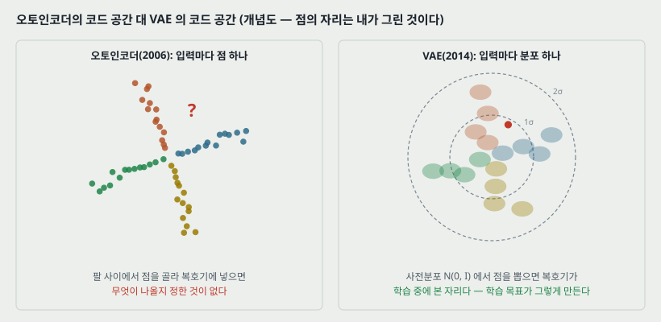

### 3.1 로드맵에서 넘어온 빈칸

2006 년의 깊은 오토인코더는 입력 하나를 코드 공간의 **점 하나**로 보낸다. 점들이 코드 공간에 어떻게 퍼져야 하는지를 정한 것이 없으므로, 코드 공간에서 새 점을 골라 복호기에 넣으면 무엇이 나올지 보장이 없다. 그 논문의 2 차원 코드 그림에서 부류들이 팔 모양으로 뻗고 **팔 사이가 비어 있던** 것이 이 모습이다.

**이 빈칸은 이 논문이 적은 동기가 아니다.** VAE 논문은 오토인코더에서 출발하지 않고 **확률 모델의 추론 문제**에서 출발해 끝에 오토인코더 모양에 닿는다. 위 그림은 로드맵의 앞 칸과 잇기 위해 내가 그린 개념도이고, 점의 자리는 계산한 것이 아니다.

### 3.2 논문이 적은 문제

논문 2.1절은 데이터가 이렇게 만들어졌다고 가정한다.

1. 사전분포 $p_{\theta^*}(z)$ 에서 $z^{(i)}$ 를 뽑는다.
2. 조건부 분포 $p_{\theta^*}(x \mid z)$ 에서 $x^{(i)}$ 를 뽑는다.

참 파라미터 $\theta^*$ 도, 데이터 점마다의 $z^{(i)}$ 도 모른다. 논문은 **흔히 하는 단순화 가정을 하지 않고** 다음 두 경우에도 도는 알고리즘을 원한다고 적는다.

| 경우 | 논문이 적은 내용 |
|---|---|
| 계산할 수 없음 (intractability) | 주변 가능도의 적분 $\int p_\theta(z) p_\theta(x \mid z) dz$ 를 계산할 수 없고(그래서 미분도 못 한다), 사후분포도 계산할 수 없어 **EM 을 쓸 수 없고**, 평균장 변분 베이즈의 적분도 풀리지 않는다. 논문은 **비선형 은닉층 하나짜리 신경망**만 되어도 이렇게 된다고 적는다 |
| 큰 데이터 | 배치 최적화가 너무 비싸서 작은 미니배치나 데이터 점 하나로 갱신하고 싶다. 몬테카를로 EM 처럼 **데이터 점마다 표본 뽑기 고리를 도는** 방법은 느리다 |

그리고 이 조건에서 풀고 싶은 것이 셋이다.

| | 무엇을 | 무엇에 쓰는가 (논문의 예) |
|---|---|---|
| 1 | $\theta$ 의 근사 최대가능도(ML) 또는 최대사후(MAP) 추정 | 자연 과정 분석, **숨은 과정을 흉내 내 가짜 데이터 만들기** |
| 2 | $x$ 가 주어졌을 때 $z$ 의 근사 사후 추론 | 부호화, 데이터 표현 |
| 3 | $x$ 의 근사 주변 추론 | $x$ 의 사전분포가 필요한 일 — 잡음 제거, 빈칸 채우기, 초해상 |

**3.1절의 빈칸은 여기서 1번의 「가짜 데이터 만들기」에 해당한다.** 사전분포 $p_\theta(z)$ 가 모델 안에 있으므로 $z$ 를 거기서 뽑아 복호기에 넣으면 된다.

---

## 4. 생성 모델의 그림 — 실선은 만드는 길, 점선은 되짚는 길

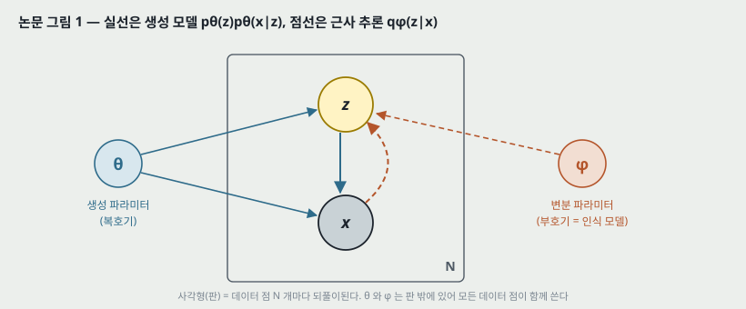

논문 그림 1 이다. 실선은 생성 모델 $p_\theta(z) p_\theta(x \mid z)$, 점선은 계산할 수 없는 사후분포 $p_\theta(z \mid x)$ 의 근사 $q_\phi(z \mid x)$ 다. 사각형(판, plate)은 데이터 점 $N$ 개마다 되풀이된다는 뜻이고, $\theta$ 와 $\phi$ 는 판 밖에 있어 모든 데이터 점이 함께 쓴다.

**$q_\phi(z \mid x)$ 가 $x$ 를 받는 함수라는 것이 핵심이다.** 평균장 변분 추론은 데이터 점 $i$ 마다 따로 변분 파라미터를 두고 닫힌 꼴의 기댓값으로 푸는데, 여기서는 **파라미터 $\phi$ 한 벌이 모든 $x$ 에 대해 분포를 낸다.** 논문은 $q$ 가 반드시 곱꼴(factorial)일 필요도 없다고 적는다. 작은 예시로, 데이터 60,000 장에 잠재 20 차원이면 평균장은 평균과 분산만 60,000 x 40 = 2,400,000 개를 따로 풀지만, 부호기는 그 모두를 $\phi$ 한 벌(10절 표로 412,540 개)이 계산한다. 이 방식을 오늘날 **분할 상환 추론(amortized inference)** 이라 부르는데, **이 이름은 이 논문에 없다.**

논문은 부호화 이론의 말로도 옮긴다. $z$ 는 **코드**이고, $q_\phi(z \mid x)$ 는 $x$ 를 받아 **그 $x$ 를 만들었을 법한 코드들의 분포**(예: 가우스)를 내므로 **확률적 부호기**, $p_\theta(x \mid z)$ 는 코드를 받아 $x$ 의 분포를 내므로 **확률적 복호기**다.

---

## 5. 변분 하한 — 식 (1)(2)(3)

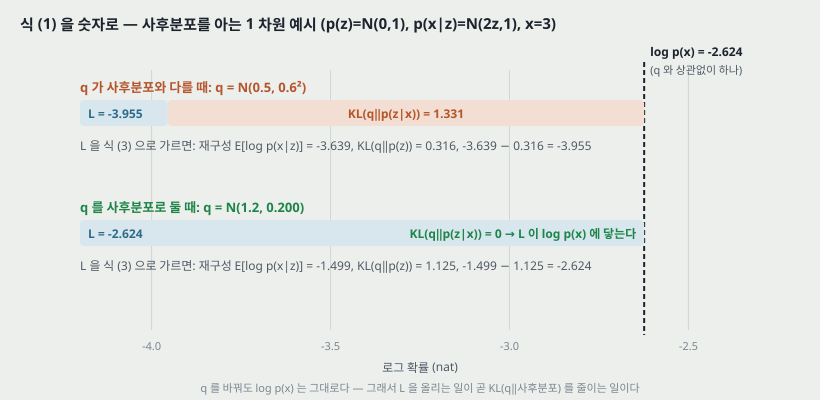

데이터 전체의 주변 가능도는 데이터 점별 주변 가능도의 합이다: $\log p_\theta(x^{(1)}, \ldots, x^{(N)}) = \sum_i \log p_\theta(x^{(i)})$. 그 하나를 이렇게 가른다.

$$\log p_\theta(x^{(i)}) = D_\text{KL}\left(q_\phi(z \mid x^{(i)}) \,\Vert\, p_\theta(z \mid x^{(i)})\right) + \mathcal{L}(\theta, \phi; x^{(i)}) \qquad (1)$$

첫 항은 근사 사후분포와 참 사후분포의 KL 이다. **늘 0 이상이므로** 둘째 항 $\mathcal{L}$ 은 $\log p_\theta(x^{(i)})$ 의 하한이다.

$$\log p_\theta(x^{(i)}) \geq \mathcal{L}(\theta, \phi; x^{(i)}) = \mathbb{E}_{q_\phi(z \mid x)}\left[-\log q_\phi(z \mid x) + \log p_\theta(x, z)\right] \qquad (2)$$

같은 것을 이렇게도 적는다.

$$\mathcal{L}(\theta, \phi; x^{(i)}) = -D_\text{KL}\left(q_\phi(z \mid x^{(i)}) \,\Vert\, p_\theta(z)\right) + \mathbb{E}_{q_\phi(z \mid x^{(i)})}\left[\log p_\theta(x^{(i)} \mid z)\right] \qquad (3)$$

**식 (1) 과 식 (3) 의 KL 은 다른 것이다.** 식 (1) 은 $q$ 와 **사후분포** 사이(계산할 수 없다), 식 (3) 은 $q$ 와 **사전분포** 사이(계산할 수 있다)다. 헷갈리기 쉬워서 그림에 둘을 나란히 두었다.

### 5.1 숫자로 맞춰 보기 (내가 붙인 예시)

사후분포를 닫힌 꼴로 아는 가장 작은 모델을 골랐다: $p(z) = \mathcal{N}(0, 1)$, $p(x \mid z) = \mathcal{N}(2z, 1)$, 관측 $x = 3$. 이때 $p(x) = \mathcal{N}(0, 5)$ 라서 $\log p(x) = -2.624$ 이고, 사후분포는 $\mathcal{N}(1.2, 0.2)$ 다. 그림 코드가 $q$ 두 개로 식 (1)(3) 의 모든 항을 계산했다.

| $q$ | 재구성 $\mathbb{E}_q[\log p(x \mid z)]$ | $D_\text{KL}(q \Vert p(z))$ | $\mathcal{L}$ | $D_\text{KL}(q \Vert p(z \mid x))$ | $\mathcal{L}$ + 사후 KL |
|---|---:|---:|---:|---:|---:|
| $\mathcal{N}(0.5, 0.6^2)$ | −3.639 | 0.316 | −3.955 | 1.331 | −2.624 |
| $\mathcal{N}(1.2, 0.2)$ = 사후분포 | −1.499 | 1.125 | −2.624 | 0 | −2.624 |

**읽는 법 둘.**

1. **$q$ 를 바꿔도 마지막 칸은 −2.624 그대로다.** 그래서 $\phi$ 로 $\mathcal{L}$ 을 올리는 것은 곧 사후 KL 을 줄이는 것이다. $q$ 가 사후분포와 같아지면 하한이 $\log p(x)$ 에 닿는다.
2. **하한이 올라가는 동안 사전 KL 은 오히려 늘었다**(0.316 → 1.125). 사전분포에 가까운 것이 목표가 아니라, **재구성을 얻는 만큼(−3.639 → −1.499) 사전분포에서 떨어지는 값을 치르는 것**이 식 (3) 의 셈이다.

---

## 6. 왜 그대로는 기울기를 못 구하는가 — 소박한 추정량의 분산

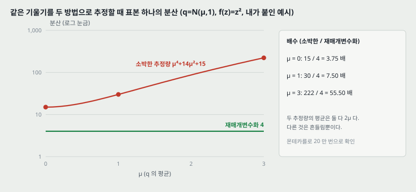

$\mathcal{L}$ 을 $\theta$ 와 $\phi$ 둘 다로 미분해 올리고 싶다. $\theta$ 쪽은 기댓값 안으로 미분을 넣으면 된다. **문제는 $\phi$ 쪽이다** — 기댓값을 매기는 분포 $q_\phi$ 자체가 $\phi$ 에 달려 있다. 이런 문제에 흔히 쓰는 소박한 몬테카를로 추정량은 이렇다(논문 2.2절, 번호 없음).

$$\nabla_\phi \mathbb{E}_{q_\phi(z)}[f(z)] = \mathbb{E}_{q_\phi(z)}\left[f(z) \nabla_\phi \log q_\phi(z)\right] \simeq \frac{1}{L} \sum_{l=1}^{L} f(z^{(l)}) \nabla_\phi \log q_\phi(z^{(l)})$$

논문은 이 추정량이 **분산이 매우 커서 쓸 수 없다**고 적고 [BJP12] 를 단다. **얼마나 큰지는 적지 않는다.**

그래서 가장 작은 경우를 골라 두 추정량의 분산을 계산했다. $q = \mathcal{N}(\mu, 1)$, $f(z) = z^2$ 이면 참 기울기는 $\frac{d}{d\mu}\mathbb{E}[z^2] = 2\mu$ 다.

| 추정량 | 표본 하나의 값 | 평균 | 분산 |
|---|---|---|---|
| 소박한 (점수 함수) | $f(z)(z - \mu) = (\mu + \varepsilon)^2 \varepsilon$ | $2\mu$ | $\mu^4 + 14\mu^2 + 15$ |
| 재매개변수화 (7절) | $f'(\mu + \varepsilon) = 2(\mu + \varepsilon)$ | $2\mu$ | $4$ |

분산은 정규분포의 적률($\mathbb{E}[\varepsilon^2] = 1$, $\mathbb{E}[\varepsilon^4] = 3$, $\mathbb{E}[\varepsilon^6] = 15$)로 풀었고, 그림 코드가 표본 20 만 개로 다시 쟀다.

| $\mu$ | 소박한 (식 / 몬테카를로) | 재매개변수화 (식 / 몬테카를로) | 배수 |
|---:|---:|---:|---:|
| 0 | 15 / 14.8 | 4 / 3.99 | 3.75 |
| 1 | 30 / 30.8 | 4 / 4.02 | 7.50 |
| 3 | 222 / 222.5 | 4 / 3.99 | 55.5 |

**두 추정량의 평균은 같고 다른 것은 흔들림뿐이다.** 소박한 추정량은 $f$ 의 **값**만 쓰고 $f$ 가 어느 쪽으로 기우는지(도함수)를 모르기 때문에, $f$ 의 크기가 커지는 자리($\mu$ 가 클 때)에서 분산이 함께 커진다. 재매개변수화는 $f$ 의 도함수를 직접 쓴다.

> **주의.** 이 표는 1 차원 · $f = z^2$ 한 경우다. 신경망 복호기에서 배수가 얼마인지는 이 논문도 나도 재지 않았다. 논문의 관련 연구 절이 [BJP12] 와 [RGB13] 이 **제어 변량(control variate)** 으로 소박한 추정량의 분산을 줄였다고 적는데, 이 논문은 그 방법과 수치로 견주지 않는다.

---

## 7. 재매개변수화 — 식 (4)(5)

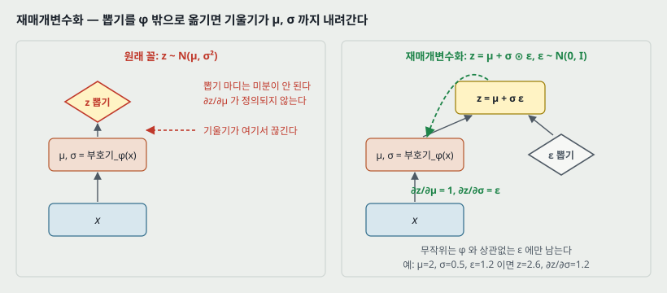

$\tilde{z} \sim q_\phi(z \mid x)$ 를 뽑는 대신, **$\phi$ 와 상관없는 보조 잡음** $\varepsilon$ 을 뽑고 미분 가능한 변환 $g_\phi$ 로 계산한다.

$$\tilde{z} = g_\phi(\varepsilon, x) \quad \text{with} \quad \varepsilon \sim p(\varepsilon) \qquad (4)$$

그러면 $q_\phi$ 에 대한 기댓값을 $p(\varepsilon)$ 에 대한 기댓값으로 옮길 수 있고, 몬테카를로 추정이 $\phi$ 에 대해 미분 가능해진다.

$$\mathbb{E}_{q_\phi(z \mid x^{(i)})}[f(z)] = \mathbb{E}_{p(\varepsilon)}\left[f(g_\phi(\varepsilon, x^{(i)}))\right] \simeq \frac{1}{L} \sum_{l=1}^{L} f(g_\phi(\varepsilon^{(l)}, x^{(i)})), \quad \varepsilon^{(l)} \sim p(\varepsilon) \qquad (5)$$

**왜 성립하는가** — 논문 2.4절의 증명은 한 줄이다. 결정적 사상 $z = g_\phi(\varepsilon, x)$ 아래에서 확률 질량이 보존되므로 $q_\phi(z \mid x) \prod_i dz_i = p(\varepsilon) \prod_i d\varepsilon_i$ 이고, 그래서 $\int q_\phi(z \mid x) f(z) dz = \int p(\varepsilon) f(g_\phi(\varepsilon, x)) d\varepsilon$ 이다.

**1 차원 가우스로 보면 이렇다.** $z \sim \mathcal{N}(\mu, \sigma^2)$ 이면 $z = \mu + \sigma \varepsilon$, $\varepsilon \sim \mathcal{N}(0, 1)$ 로 적을 수 있다. 그러면 $\partial z / \partial \mu = 1$, $\partial z / \partial \sigma = \varepsilon$ 이 정의되어, 역전파가 $z$ 를 지나 부호기의 출력 $\mu$, $\sigma$ 까지, 그리고 그 뒤 $\phi$ 까지 내려간다. 작은 예시로, 부호기가 $\mu = 2$, $\sigma = 0.5$ 를 내고 뽑힌 잡음이 $\varepsilon = 1.2$ 면 $z = 2.6$ 이고, 이 표본에서 $\sigma$ 로 가는 기울기에는 1.2 가 곱해진다.

**그림의 왼쪽이 막히는 이유**는 「$z$ 뽑기」 마디가 $\mu$, $\sigma$ 에 대해 미분이 정의되지 않기 때문이다. 오른쪽은 무작위를 $\varepsilon$ 에만 남기고 $\mu$, $\sigma$ 에서 $z$ 까지를 결정적 계산으로 만든다.

> 논문이 관련 연구에서 밝히듯 **비슷한 재매개변수화는 [SK13](Salimans & Knowles 2013)이 먼저 썼고**, [RMW14](Rezende, Mohamed & Wierstra 2014)는 **따로** 같은 연결에 닿았다. 원리의 출처를 적을 때 이 둘을 함께 적는다.

---

## 8. 어떤 분포에 쓸 수 있는가 — 세 갈래

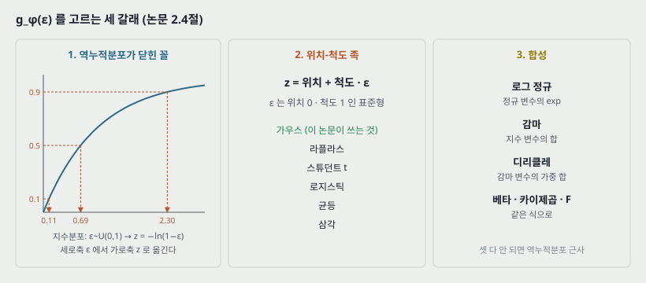

논문 2.4절은 미분 가능한 $g_\phi$ 와 $p(\varepsilon)$ 을 고를 수 있는 기본 방법 셋을 적는다.

| 갈래 | 방법 | 논문이 든 예 |
|---|---|---|
| 1. 역누적분포가 닫힌 꼴 | $\varepsilon \sim \mathcal{U}(0, I)$, $g_\phi$ = $q_\phi$ 의 역누적분포 | 지수, 코시, 로지스틱, 레일리, 파레토, 와이블, 역수, 곰페르츠, 굼벨, 얼랑 |
| 2. 위치-척도 족 | 표준형(위치 0, 척도 1)을 $\varepsilon$ 으로, $g$ = 위치 + 척도 · $\varepsilon$ | 라플라스, 타원, 스튜던트 t, 로지스틱, 균등, 삼각, **가우스** |
| 3. 합성 | 보조 변수를 여러 번 바꿔 적는다 | 로그 정규(정규의 exp), 감마(지수의 합), 디리클레(감마의 가중 합), 베타, 카이제곱, F |

셋이 다 안 되면 역누적분포의 좋은 근사가 있고 계산량이 밀도 함수와 비슷하다고 적는다([Dev86]).

첫째 갈래의 작은 예시로, 지수분포($\lambda = 1$)의 역누적분포는 $z = -\ln(1 - \varepsilon)$ 이다. $\varepsilon = 0.1$, $0.5$, $0.9$ 면 $z = 0.105$, $0.693$, $2.303$ 이다(그림 코드가 계산).

**세 갈래 모두 연속 분포다.** 이 조건이 논문의 범위를 정한다 — 18절 한계 하나.

---

## 9. SGVB 추정량 두 가지와 미니배치 — 식 (6)(7)(8), 알고리즘 1

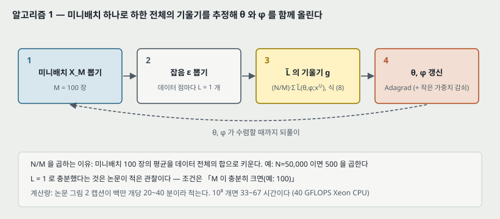

식 (5) 를 식 (2) 에 쓰면 **일반형 SGVB 추정량** $\tilde{\mathcal{L}}^A$ 가 나온다.

$$\tilde{\mathcal{L}}^A(\theta, \phi; x^{(i)}) = \frac{1}{L} \sum_{l=1}^{L} \log p_\theta(x^{(i)}, z^{(i,l)}) - \log q_\phi(z^{(i,l)} \mid x^{(i)}), \quad z^{(i,l)} = g_\phi(\varepsilon^{(i,l)}, x^{(i)}) \qquad (6)$$

그런데 식 (3) 의 KL 항은 **흔히 해석적으로 적분된다**(11절). 그러면 표본으로 추정할 것이 재구성 항 하나만 남는다. 이것이 **둘째 SGVB 추정량** $\tilde{\mathcal{L}}^B$ 이고, 논문은 이쪽이 **대개(typically) 분산이 더 작다**고 적는다.

$$\tilde{\mathcal{L}}^B(\theta, \phi; x^{(i)}) = -D_\text{KL}\left(q_\phi(z \mid x^{(i)}) \,\Vert\, p_\theta(z)\right) + \frac{1}{L} \sum_{l=1}^{L} \log p_\theta(x^{(i)} \mid z^{(i,l)}) \qquad (7)$$

데이터 $N$ 개 전체의 하한은 $M$ 개짜리 미니배치로 추정한다.

$$\mathcal{L}(\theta, \phi; X) \simeq \tilde{\mathcal{L}}^M(\theta, \phi; X^M) = \frac{N}{M} \sum_{i=1}^{M} \tilde{\mathcal{L}}(\theta, \phi; x^{(i)}) \qquad (8)$$

$N/M$ 은 미니배치의 합을 데이터 전체의 합으로 키우는 배수다. 작은 예시로, $N = 50{,}000$, $M = 100$ 이면 500 을 곱한다.

**알고리즘 1** 은 이것을 되풀이하는 것이 전부다 — 미니배치 $X^M$ 을 뽑고, 잡음 $\varepsilon$ 을 뽑고, $\nabla_{\theta, \phi} \tilde{\mathcal{L}}^M$ 을 계산해 SGD 나 Adagrad 로 $\theta$, $\phi$ 를 함께 갱신한다. 논문의 실험 설정은 $M = 100$, $L = 1$ 이다.

**$L = 1$ 에 붙은 조건.** 논문은 「미니배치 크기 $M$ 이 충분히 크면(예: $M = 100$) 데이터 점당 표본 수 $L$ 을 1 로 둘 수 있었다」고 적는다. **관찰로 적은 것이고, $L$ 을 바꾼 표나 곡선은 본문에 없다.**

### 9.1 오토인코더가 보이는 자리

식 (7) 을 오토인코더의 말로 읽으면 이렇다(논문 2.3절 끝).

| 항 | 확률 모델의 말 | 오토인코더의 말 |
|---|---|---|
| $-D_\text{KL}(q_\phi(z \mid x) \Vert p_\theta(z))$ | 근사 사후분포가 사전분포에서 떨어진 정도 | **정규화 항** |
| $\log p_\theta(x^{(i)} \mid z^{(i,l)})$ | $z$ 가 주어졌을 때 원래 $x$ 의 확률(밀도) | **음의 재구성 오차** |

$g_\phi$ 가 데이터 점 $x^{(i)}$ 와 잡음 $\varepsilon^{(l)}$ 을 받아 $z$ 를 내는 것이 **부호기**, 그 $z$ 로 $\log p_\theta(x^{(i)} \mid z)$ 를 계산하는 것이 **복호기**다. 작은 예시로, 베르누이 복호기에서 픽셀 셋이 $(0, 1, 1)$ 이고 복호기가 $(0.1, 0.8, 0.9)$ 를 내면 재구성 항은 $\ln 0.9 + \ln 0.8 + \ln 0.9 = -0.434$ nat 이다.

---

## 10. VAE — 식 (9)(10), 부록 C 의 식 (11)(12)

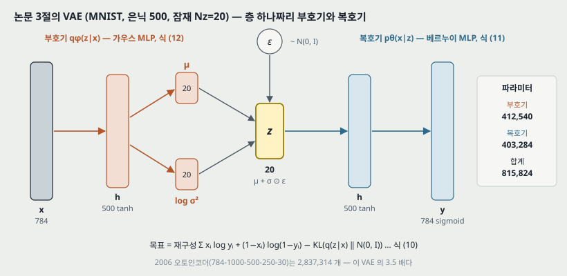

논문 3절은 AEVB 의 한 예로 다음을 고른다.

- **사전분포**: 중심이 0 이고 등방인 가우스 $p_\theta(z) = \mathcal{N}(z; 0, I)$. **파라미터가 없다.**
- **복호기** $p_\theta(x \mid z)$: 실수 데이터면 다변량 가우스, 이진 데이터면 베르누이. 분포의 파라미터를 **은닉층 하나짜리 완전연결 망(MLP)** 이 $z$ 에서 계산한다.
- **부호기** $q_\phi(z \mid x)$: 대각 공분산 가우스.

$$\log q_\phi(z \mid x^{(i)}) = \log \mathcal{N}(z; \mu^{(i)}, \sigma^{2(i)} I) \qquad (9)$$

$\mu^{(i)}$ 와 $\sigma^{(i)}$ 는 부호기 MLP 의 출력이다. 표본은 $z^{(i,l)} = \mu^{(i)} + \sigma^{(i)} \odot \varepsilon^{(l)}$, $\varepsilon^{(l)} \sim \mathcal{N}(0, I)$ 로 뽑는다($\odot$ 은 원소별 곱). 사전분포와 부호기가 둘 다 가우스라서 식 (7) 의 KL 을 **추정 없이** 계산하고 미분할 수 있다.

$$\mathcal{L}(\theta, \phi; x^{(i)}) \simeq \frac{1}{2} \sum_{j=1}^{J} \left(1 + \log\left((\sigma_j^{(i)})^2\right) - (\mu_j^{(i)})^2 - (\sigma_j^{(i)})^2\right) + \frac{1}{L} \sum_{l=1}^{L} \log p_\theta(x^{(i)} \mid z^{(i,l)}) \qquad (10)$$

**대각 가우스는 단순화한 선택이다.** 논문 각주 2 가 「이것은 단순화한 선택일 뿐 방법의 한계가 아니다」라고 적는다.

### 10.1 부록 C — 두 MLP

**베르누이 MLP (복호기, MNIST).**

$$\log p(x \mid z) = \sum_{i=1}^{D} x_i \log y_i + (1 - x_i) \log(1 - y_i), \qquad y = f_\sigma\left(W_2 \tanh(W_1 z + b_1) + b_2\right) \qquad (11)$$

**가우스 MLP (부호기, 그리고 Frey Face 의 복호기).**

$$\log p(x \mid z) = \log \mathcal{N}(x; \mu, \sigma^2 I), \quad \mu = W_4 h + b_4, \quad \log \sigma^2 = W_5 h + b_5, \quad h = \tanh(W_3 z + b_3) \qquad (12)$$

부호기로 쓸 때는 $z$ 와 $x$ 를 바꿔 넣고, 가중치가 $\phi$ 가 된다. **망이 내는 것은 $\sigma$ 가 아니라 $\log \sigma^2$ 이다** — 출력에 범위 제약을 걸지 않고도 분산이 늘 양수다.

**파라미터 수** (식 11·12 대로 가중치와 치우침을 센 값, MNIST 784 픽셀 · 은닉 500):

| Nz | 부호기 | 복호기 | 합계 |
|---:|---:|---:|---:|
| 3 | 395,506 | 394,784 | 790,290 |
| 5 | 397,510 | 395,784 | 793,294 |
| 10 | 402,520 | 398,284 | 800,804 |
| 20 | 412,540 | 403,284 | 815,824 |
| 200 | 592,900 | 493,284 | 1,086,184 |

부호기는 $784 \times 500 + 500$ 에 $\mu$ 와 $\log \sigma^2$ 두 머리 $2 \times (500 \times J + J)$ 를 더하고, 복호기는 $J \times 500 + 500 + 500 \times 784 + 784$ 다. 작은 예시로 Nz=20 이면 부호기가 392,500 + 20,040 = 412,540 이다. **Nz 가 3 에서 200 으로 67 배 늘어도 파라미터는 1.37 배(790,290 → 1,086,184)** 다 — 대부분이 784 x 500 두 벌에 있어서다. 이 표는 14절의 「잠재 변수를 늘려도 과적합이 늘지 않는다」를 읽을 때 쓴다.

---

## 11. KL 항 — 부록 B

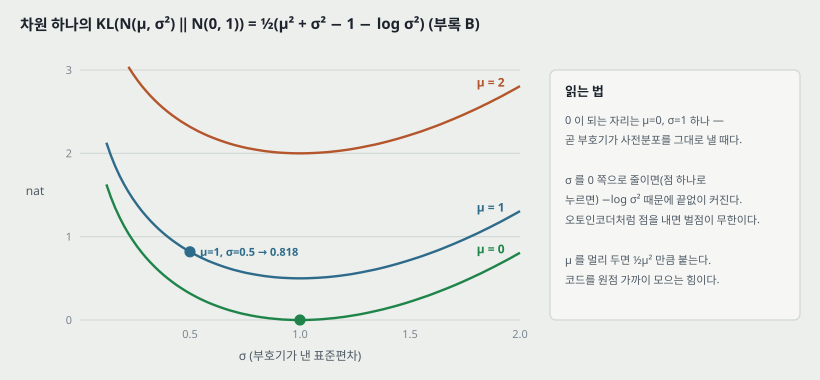

사전분포 $\mathcal{N}(0, I)$ 와 근사 사후분포 $\mathcal{N}(\mu, \sigma^2)$ 가 둘 다 가우스일 때, 부록 B 는 두 적분을 따로 푼다($J$ 는 $z$ 의 차원).

$$\int q_\theta(z) \log p(z)\, dz = -\frac{J}{2} \log(2\pi) - \frac{1}{2} \sum_{j=1}^{J} (\mu_j^2 + \sigma_j^2)$$

$$\int q_\theta(z) \log q_\theta(z)\, dz = -\frac{J}{2} \log(2\pi) - \frac{1}{2} \sum_{j=1}^{J} (1 + \log \sigma_j^2)$$

빼면 $\log(2\pi)$ 가 지워지고 식 (10) 의 첫 항이 나온다.

$$-D_\text{KL}\left(q_\phi(z) \,\Vert\, p_\theta(z)\right) = \frac{1}{2} \sum_{j=1}^{J} \left(1 + \log \sigma_j^2 - \mu_j^2 - \sigma_j^2\right)$$

(부록 B 의 적분 기호에 $q_\theta$ 라고 적힌 자리가 있는데 문맥상 $q_\phi$ 다. 원문 그대로 옮겼다.)

작은 예시로, 한 차원에서 $\mu = 1$, $\sigma = 0.5$ 면 KL $= \frac{1}{2}(1 + 0.25 - 1 - \ln 0.25) = 0.818$ nat 이다. 그림 코드가 표본 20 만 개로 다시 재서 0.8179 를 얻었다.

**그림이 보이는 것 셋.**

1. **0 이 되는 자리는 $\mu = 0$, $\sigma = 1$ 하나다** — 부호기가 입력과 상관없이 사전분포를 그대로 낼 때다.
2. **$\sigma \to 0$ 이면 $-\log \sigma^2$ 때문에 KL 이 끝없이 커진다.** 부호기가 오토인코더처럼 **점 하나를 내면 벌점이 무한이다.** 그래서 VAE 의 부호기는 늘 폭이 있는 분포를 낸다.
3. **$\mu$ 를 원점에서 멀리 두면 $\frac{1}{2}\mu^2$ 만큼 붙는다.** 코드들을 원점 가까이 모으는 힘이다. 3.1절의 「팔 사이가 빈다」를 막는 것이 이 항과 2번이다.

---

## 12. 관련 연구 — 논문이 스스로 자리를 매긴 곳

논문 4절이 적은 것을 셋으로 묶는다.

**깨어남-잠 알고리즘 [HDFN95].** 같은 종류의 연속 잠재 변수 모델에 쓸 수 있는 **유일한 다른 온라인 학습 방법**이라고 적는다(「우리가 아는 한」). 인식 모델을 쓰는 것은 같다. **단점**: 목적 함수 둘을 동시에 최적화하는데, **둘을 합쳐도 주변 가능도(의 하한)를 최적화하는 것이 아니다.** **장점**: 이산 잠재 변수에도 쓸 수 있다. 데이터 점당 계산량은 AEVB 와 같다.

**오토인코더와의 연결.** 선형 오토인코더와 선형 가우스 생성 모델의 연결은 오래 알려져 있었다 — [Row98] 이 **주성분 분석이 $p(z) = \mathcal{N}(0, I)$, $p(x \mid z) = \mathcal{N}(x; Wz, \epsilon I)$ 인 선형 가우스 모델에서 $\epsilon$ 을 한없이 작게 한 경우의 최대가능도 해**임을 보였다. 정규화 없는 오토인코더의 학습 기준은 입력과 표현 사이 상호 정보량의 하한을 올리는 것이지만 [VLL+10], 그 재구성 기준만으로는 쓸모 있는 표현을 배우기에 충분하지 않다고 알려져 있어 [BCV13] 잡음 제거 · 수축 · 희소 오토인코더 같은 정규화가 제안됐다. **SGVB 의 목적 함수에는 변분 하한이 정해 주는 정규화 항이 들어 있어, 쓸모 있는 표현을 배우는 데 흔히 필요한 성가신 정규화 하이퍼파라미터가 없다**고 적는다.

**가까운 방법들.** 예측 희소 분해(PSD) [KRL08] 에서 영감을 얻었다고 적는다. 생성 확률 망 [BTL13], 깊은 볼츠만 기계에 인식 모델을 쓴 [SL10] 은 비정규화(방향 없는) 모델이거나 희소 부호화 모델에 한정된다. DARN [GMW13] 도 오토인코더 구조로 방향 모델을 배우지만 **잠재 변수가 이진**이다. [RMW14] 는 같은 연결을 **독립적으로** 냈다.

> **오토인코더(2006) 와의 연결을 이 논문은 적지 않는다.** 참고 문헌 17 건에 그 논문이 없다. 이 노트 21절의 비교는 내가 이은 것이다.

---

## 13. 실험 설정

| 항목 | 값 | 근거 |
|---|---|---|
| 데이터 | MNIST, Frey Face | 5절 |
| MNIST 복호기 | 베르누이 MLP | 3절 · 부록 C.1 |
| Frey Face 복호기 | 가우스 MLP, **평균을 시그모이드로 (0, 1) 에 가둔다** | 5절 |
| 부호기 | 가우스 MLP (두 데이터 모두) | 부록 C.2 |
| 은닉 유닛 | 그림 2: MNIST 500, Frey Face 200 (**데이터가 작아 과적합을 막으려고**) · 그림 3: 100 | 5절 |
| 잠재 차원 Nz | 그림 2: MNIST 3 · 5 · 10 · 20 · 200, Frey Face 2 · 5 · 10 · 20 · 그림 3: 3 | 그림 2 · 3 |
| 목적 | 하한 + 작은 가중치 감쇠(사전분포 $p(\theta) = \mathcal{N}(0, I)$ 에 해당) → **근사 MAP 추정** | 5절 |
| 초기화 | 모든 파라미터를 $\mathcal{N}(0, 0.01)$ 에서 뽑는다 | 5절 |
| 최적화 | Adagrad. 전역 걸음 크기를 $\{0.01, 0.02, 0.1\}$ 에서 **학습 집합의 처음 몇 번 반복의 성능으로** 골랐다 | 5절 |
| 미니배치 · 표본 | $M = 100$, $L = 1$ | 5절 · 알고리즘 1 |
| 계산 | 학습 표본 백만 개당 20~40 분, 실효 40 GFLOPS 인텔 제온 CPU | 그림 2 캡션 |
| 비교 상대 | 깨어남-잠(같은 부호기), 몬테카를로 EM(그림 3 만) | 5절 |

**계산 시간을 늘여 보면**, 그림 2 의 Frey Face 판 가로축 끝(학습 표본 $10^8$ 개)까지 가는 데 곡선 하나에 33~67 시간이다(그림 코드가 계산). 학습 집합이 50,000 장이라면 2,000 바퀴에 해당한다 — **다만 그림 2 의 MNIST 학습 장수는 본문에 적혀 있지 않다**(그림 3 만 $N_\text{train}$ = 1,000 과 50,000 을 적는다).

**은닉 유닛 수를 고른 근거**를 논문은 「오토인코더에 관한 앞선 문헌」이라고만 적고, 다른 알고리즘 사이의 상대 성능은 **이 선택에 아주 민감하지는 않았다**고 적는다. 그 민감도를 보인 표는 없다.

---

## 14. 결과 1 — 하한 (논문 그림 2)

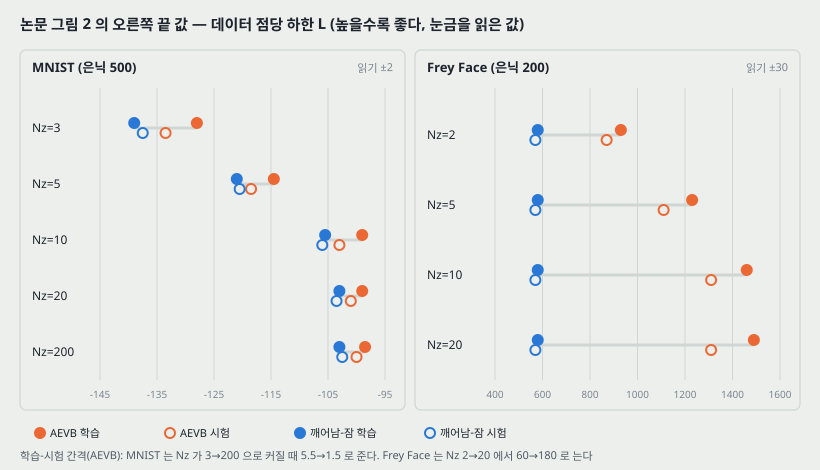

세로축은 **데이터 점당 평균 변분 하한의 추정값**이고 가로축은 **본 학습 표본 수**(로그 눈금)다. 캡션은 추정량의 분산이 작아서(< 1) 생략했다고 적는다.

각 판 오른쪽 끝의 값을 300 dpi 로 읽었다. MNIST 판은 눈금이 10 이라 ±2, Frey Face 판은 눈금이 200 이라 ±30 으로 읽는다.

**MNIST (은닉 500)**

| Nz | AEVB 학습 | AEVB 시험 | 깨어남-잠 학습 | 깨어남-잠 시험 | AEVB 학습 − 시험 |
|---:|---:|---:|---:|---:|---:|
| 3 | −128 | −133.5 | −139 | −137.5 | 5.5 |
| 5 | −114.5 | −118.5 | −121 | −120.5 | 4.0 |
| 10 | −99 | −103 | −105.5 | −106 | 4.0 |
| 20 | −99 | −101 | −103 | −103.5 | 2.0 |
| 200 | −98.5 | −100 | −103 | −102.5 | 1.5 |

**Frey Face (은닉 200)**

| Nz | AEVB 학습 | AEVB 시험 | 깨어남-잠 학습 · 시험 | AEVB 학습 − 시험 |
|---:|---:|---:|---:|---:|
| 2 | 930 | 870 | 580 · 570 | 60 |
| 5 | 1,230 | 1,110 | 580 · 570 | 120 |
| 10 | 1,460 | 1,310 | 580 · 570 | 150 |
| 20 | 1,490 | 1,310 | 580 · 570 | 180 |

**논문이 적은 것 둘.** (가) AEVB 가 **모든 실험에서 훨씬 빨리 수렴했고 더 좋은 해에 닿았다.** (나) **잠재 변수가 많아도 과적합이 늘지 않았고**, 이것을 하한의 정규화 효과로 설명한다.

**읽는 법 넷.**

1. **(가)는 Frey Face 에서는 끝 값으로 서고, MNIST 에서는 곡선의 모양으로 선다.** Frey Face 시험에서 AEVB 가 깨어남-잠보다 300~740 높아 읽기 오차 ±30 보다 크다. MNIST 시험에서는 차이가 Nz 에 따라 2~4 nat(Nz=3 은 4, Nz=5 는 2)으로, 두 값의 읽기 오차를 합친 폭 4 와 같거나 작다. 그래서 MNIST 는 끝 값의 차이로 순서를 매기지 않고, **다섯 판 모두 빨간 곡선이 가로축 $10^6$ 부근부터 오른쪽 끝까지 초록 곡선 위에 있다**는 것만 적는다.
2. **(나)는 MNIST 판에서는 눈금이 보여 주는 것과 맞는다** — AEVB 학습-시험 간격이 Nz 3 → 200 에서 5.5 → 1.5 로 **준다**. 10절 표대로 Nz 를 67 배 늘려도 파라미터가 1.37 배라는 것도 함께 놓아 둔다.
3. **(나)는 Frey Face 판에서는 눈금과 어긋난다.** 간격이 Nz 2 → 20 에서 **60 → 180 으로 는다.** 시험 값은 Nz=10 과 20 이 같은 1,310 에 머무르는데 학습 값만 올라간다. 캡션의 「잠재 변수가 많아도 과적합이 늘지 않는다」는 **MNIST 판에만 맞는 문장으로 읽는다.** 논문은 두 데이터를 갈라 말하지 않는다.
4. **Frey Face 의 깨어남-잠 네 곡선이 모두 학습 표본 약 $5 \times 10^5$ 개부터 580 근처 한 값에 멈춘다**(그림에서 오른쪽 끝까지 평평하다). Nz 를 2 에서 20 으로 바꿔도 같은 값이다. 논문은 이것을 설명하지 않는다.

**MNIST 와 Frey Face 의 세로축은 서로 견주지 않는다.** MNIST 는 이산(베르누이) 확률의 로그라 늘 0 이하이고, Frey Face 는 연속 밀도의 로그라 양수가 될 수 있다(밀도는 1 을 넘을 수 있다).

> **주의.** 모든 곡선이 한 번의 실행이다. 캡션의 「분산 < 1」은 **하한 추정량**의 분산이지 seed 에 따른 흔들림이 아니다. 그래서 1번의 2.5 nat 같은 작은 차이는 이 실행에서의 순서로만 적는다.

---

## 15. 결과 2 — 추정 주변 가능도 (논문 그림 3, 부록 D · E)

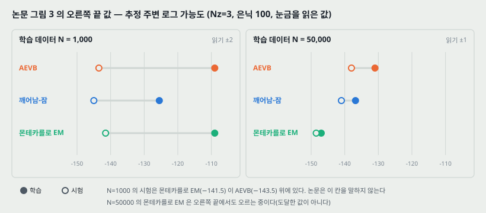

**하한 말고 주변 가능도 자체를 보려는 실험이다.** 잠재 차원이 아주 낮으면 MCMC 로 주변 가능도를 추정할 수 있어서, 부호기와 복호기를 은닉 100 · 잠재 3 으로 두고 MNIST 로 AEVB · 깨어남-잠 · 몬테카를로 EM 의 **수렴 속도**를 학습 데이터 1,000 장과 50,000 장에서 견줬다. 논문은 **잠재 차원이 더 높으면 추정이 믿을 만하지 않게 된다**고 적는다.

오른쪽 끝(가로축 약 6,000~6,800 만 개)의 값을 읽었다. 왼쪽 판 눈금이 10 이라 ±2, 오른쪽 판 눈금이 5 라 ±1 로 읽는다.

| 학습 데이터 | 방법 | 학습 | 시험 |
|---:|---|---:|---:|
| 1,000 | AEVB | −109 | −143.5 |
| 1,000 | 깨어남-잠 | −125.5 | −145 |
| 1,000 | 몬테카를로 EM | −109 | −141.5 |
| 50,000 | AEVB | −131 | −138 |
| 50,000 | 깨어남-잠 | −136.8 | −141 |
| 50,000 | 몬테카를로 EM | −147 (오르는 중) | −148.5 (오르는 중) |

**읽는 법 셋.**

1. **50,000 장에서 AEVB 가 학습 · 시험 둘 다 가장 높다.** 몬테카를로 EM 은 가로축 끝에서도 오르고 있어 **도달한 값이 아니라 그 시점의 값**이다. 캡션이 「몬테카를로 EM 은 온라인 알고리즘이 아니라 MNIST 전체에 효율적으로 쓸 수 없다」고 적는 자리가 이것이다.
2. **1,000 장에서는 시험 칸의 순서가 다르다.** 몬테카를로 EM(−141.5)이 AEVB(−143.5) 위에 있고, 그림에서 두 점선은 약 2,000 만 개 이후 겹치지 않는다. 학습 칸에서는 둘이 −109 에서 만난다. 곧 **작은 데이터에서 AEVB 는 학습 쪽을 같은 곳까지 올리고 시험 쪽은 2 nat 낮다.** 논문은 이 칸을 말하지 않는다.
3. **1,000 장의 학습-시험 간격이 크다** — AEVB 34.5, 몬테카를로 EM 32.5, 깨어남-잠 19.5. 50,000 장에서는 AEVB 7, 깨어남-잠 4.2 다. 데이터가 작을 때 과적합이 이 모형 크기(은닉 100)에서도 크게 나타난다.

**추정량 (부록 D).** 데이터 점 하나의 주변 가능도를 셋으로 추정한다. (1) 기울기 기반 MCMC(하이브리드 몬테카를로)로 사후분포에서 $z$ 를 $L$ 개 뽑는다. (2) 그 표본에 밀도 추정기 $q(z)$ 를 맞춘다. (3) 사후분포에서 $L$ 개를 새로 뽑아 이 식에 넣는다.

$$p_\theta(x^{(i)}) \simeq \left(\frac{1}{L} \sum_{l=1}^{L} \frac{q(z^{(l)})}{p_\theta(z)\, p_\theta(x^{(i)} \mid z^{(l)})}\right)^{-1}, \quad z^{(l)} \sim p_\theta(z \mid x^{(i)})$$

유도는 $1 / p_\theta(x) = \int q(z) dz / p_\theta(x)$ 에 $p_\theta(x, z)$ 를 곱하고 나눈 한 줄이다. 논문은 이것이 **표본 공간의 차원이 낮고(5 미만) 표본이 충분할 때** 좋은 추정을 준다고 적는다. 평가는 학습 · 시험 집합의 **처음 1,000 개** 데이터 점에서, 점마다 사후분포 표본 50 개(하이브리드 몬테카를로, 도약 4 걸음)로 했다(부록 E).

**몬테카를로 EM 의 설정 (부록 E).** 부호기가 없고, 사후분포의 기울기 $\nabla_z \log p_\theta(z \mid x) = \nabla_z \log p_\theta(z) + \nabla_z \log p_\theta(x \mid z)$ 로 표본을 뽑는다. 한 번에 하이브리드 몬테카를로 도약 10 걸음(수락률이 90% 가 되게 걸음 크기 자동 조정) 뒤에 그 표본으로 가중치 갱신 5 번.

> **주의.** 추정량의 정확도(참값과의 차이, 추정 분산)가 본문과 부록에 없다. 그림 3 의 세 방법은 **같은 추정량**으로 쟀으므로 순서 비교는 선다고 보지만, 값 자체의 오차는 모른다.

---

## 16. 결과 3 — 그림으로 보인 것 (논문 그림 4 · 5, 부록 A)

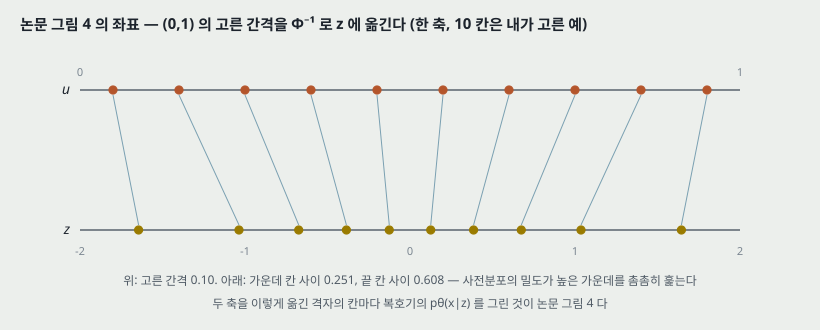

**그림 4 는 잠재 2 차원 모델의 복호기를 격자에 대고 그린 것이다.** 사전분포가 가우스이므로, **단위 정사각형 위의 고른 간격 좌표를 가우스 역누적분포 $\Phi^{-1}$ 로 옮겨** $z$ 를 만들고, 그 $z$ 마다 $p_\theta(x \mid z)$ 를 그렸다. 곧 격자의 칸마다 **사전분포에서 확률 질량이 같은** 자리를 하나씩 고른 것이다.

한 축을 10 칸으로 나눈 예(칸 가운데 $u = 0.05, 0.15, \ldots, 0.95$, 칸 수는 내가 고른 것)를 그림 코드로 옮기면 $z$ 는 −1.645 에서 1.645 사이이고, 가운데 칸 사이는 0.251, 끝 칸 사이는 0.608 이다. **사전분포 밀도가 높은 가운데를 촘촘히, 꼬리를 성기게 훑는다.** 논문은 격자의 칸 수도, 끝점을 어떻게 다뤘는지(0 과 1 에서는 $\Phi^{-1}$ 이 무한이다)도 적지 않는다.

| 그림 | 보인 것 | 논문이 붙인 수치 |
|---|---|---|
| 4a Frey Face, 2 차원 | 한 축을 따라 표정(웃음 ↔ 찡그림), 다른 축을 따라 얼굴 방향이 바뀌어 보인다 — **내 눈의 인상이다** | 없다 |
| 4b MNIST, 2 차원 | 0 · 6 · 2 · 3 · 5 · 8 · 9 · 7 · 1 이 이웃한 숫자로 연속해서 바뀌어 보인다 — 이것도 내 눈의 인상이다 | 없다 |
| 5 MNIST 표본, 2 · 5 · 10 · 20 차원 | 사전분포에서 뽑은 무작위 표본 100 장씩 | 없다 |

**그림 5 에 수치가 없다.** 표본이 얼마나 그럴듯한지, 차원이 커지면 어떻게 달라지는지를 잰 값이 없다. 내 눈으로는 2 차원 표본이 가장 또렷하고 20 차원 표본에 알아보기 어려운 글자가 섞여 있는데, **이것은 인상이고 논문이 적은 것이 아니다.**

---

## 17. 부록 F — 파라미터까지 변분 추론 (Full VB)

본문은 잠재 변수 $z$ 에만 변분 추론을 하고 $\theta$ 는 점 추정(ML 또는 MAP)했다. 부록 F 는 $\theta$ 에도 근사 사후분포 $q_\phi(\theta)$ 를 두고 초사전분포 $p_\alpha(\theta)$ 를 붙이는 경우를 유도한다.

$$\log p_\alpha(X) = D_\text{KL}\left(q_\phi(\theta) \,\Vert\, p_\alpha(\theta \mid X)\right) + \mathcal{L}(\phi; X) \qquad (13)$$

$z$ 에 $\varepsilon$ 을 쓴 것처럼 $\theta$ 에도 $\tilde{\theta} = h_\phi(\zeta)$, $\zeta \sim p(\zeta)$ 로 재매개변수화한다(식 19). 그러면 하한의 몬테카를로 추정이 $p(\varepsilon)$ 과 $p(\zeta)$ 의 표본에만 달려 $\phi$ 로 미분할 수 있다(식 22, 알고리즘 2). 모두 가우스로 두면 KL 넷을 해석적으로 풀어 분산이 더 작은 추정량(식 24)이 나온다.

**논문은 이 경우의 실험을 하지 않았다** — 2절 첫 문단이 「그 알고리즘은 부록에 두고 실험은 앞으로의 일로 남긴다」고 적는다. 그래서 이 노트는 식의 모양만 옮긴다.

---

## 18. 이 논문이 스스로 적은 한계와 조건

1. **잠재 변수가 연속이어야 한다.** 재매개변수화의 세 갈래(8절)가 모두 연속 분포이고, 논문이 깨어남-잠의 **장점**으로 「이산 잠재 변수에도 쓸 수 있다」를 적는다. 곧 이산 잠재 변수는 이 방법의 범위 밖이다.
2. **$p_\theta(z)$ 와 $p_\theta(x \mid z)$ 가 $\theta$ 와 $z$ 둘 다에 대해 거의 모든 곳에서 미분 가능해야 한다**(2.1절 가정, 초록의 「가벼운 미분 가능성 조건」).
3. **데이터 점마다 잠재 변수가 있는 i.i.d. 데이터**에 한정해 AEVB 를 적는다. 시계열(동적 베이즈 망)은 앞으로의 일이다.
4. **$L = 1$ 은 $M$ 이 충분히 클 때의 관찰이다**(9절).
5. **주변 가능도 추정은 잠재 5 차원 미만에서만 믿을 만하다**(부록 D). 그래서 그림 3 이 Nz=3 한 경우다.
6. **앞으로의 일 넷**(7절): (i) 합성곱 망 같은 **깊은 신경망**을 부호기 · 복호기로 쓰는 계층적 생성 구조 (ii) 시계열 모델 (iii) SGVB 를 전역 파라미터에 쓰기(= 부록 F 의 실험) (iv) 복잡한 잡음 분포를 배우는 **잠재 변수 있는 지도 학습 모델**.

---

## 19. 논문이 적지 않은 것 — 내가 읽으며 짚은 자리

**하나. 변동 폭이 한 곳도 없다.** 그림 2 · 3 의 모든 곡선이 한 번의 실행이다. 그림 2 캡션의 「분산 < 1」은 하한 추정량의 분산이다. 그래서 그림 2 MNIST 에서 AEVB 와 깨어남-잠의 시험 차이가 2~4 nat 인 자리, 그림 3 의 1,000 장에서 2 nat 인 자리는 **이 실행의 순서**로만 적는다.

**둘. 「잠재 변수가 많아도 과적합이 늘지 않는다」는 두 데이터 중 하나에서만 눈금과 맞는다**(14절 읽는 법 3). Frey Face 의 학습-시험 간격은 Nz 를 따라 60 → 180 으로 는다. 이 노트의 값은 눈금 읽기(±30)라서, 간격 60 과 180 의 차이 120 은 읽기 오차보다 크다.

**셋. 하한 $\mathcal{L}$ 과 $\log p(x)$ 의 틈을 재지 않는다.** 그림 2 는 하한만, 그림 3 은 Nz=3 의 주변 가능도만 보인다. **같은 모델에서 둘을 함께 적은 자리가 없어서** 식 (1) 의 KL(근사 사후분포 ↔ 참 사후분포)이 얼마인지 모른다. 대각 가우스 $q$ 가 얼마나 좋은 근사인지가 이 값이다.

**넷. 늘어난 잠재 차원이 실제로 쓰이는지를 보지 않는다.** MNIST Nz=20 과 200 의 끝 값이 −99 대 −98.5 로 읽기 오차 안이다. 11절 그림의 2번대로 KL 항은 **쓰이지 않는 차원을 사전분포 그대로($\mu = 0$, $\sigma = 1$) 두게** 밀기 때문에, 180 개 차원이 꺼져 있을 가능성이 있다. 논문이 「정규화 효과」라고 부른 것이 이것일 수 있는데, **차원별 KL 을 적지 않아 확인할 수 없다.** 이것은 내 해석이고 논문이 잰 것이 아니다.

**다섯. 초기화의 두 번째 숫자가 분산인지 표준편차인지 적혀 있지 않다.** $\mathcal{N}(0, 0.01)$ 을 표준편차로 읽으면 0.01, 분산으로 읽으면 표준편차 0.1 이다. 은닉 500 층에서 10 배 차이다.

**여섯. 걸음 크기를 학습 집합으로 골랐다.** 후보 셋 $\{0.01, 0.02, 0.1\}$ 을 **학습 집합의 처음 몇 번 반복**의 성능으로 골랐다. 시험 값을 보고 고른 것이 아니라서 시험 칸을 오염시키지는 않는다. 다만 처음 몇 번의 반복에서 빠른 것을 고르는 규칙은 **빨리 수렴한다**는 결론 쪽으로 기운다 — 두 방법이 같은 규칙을 썼으므로 한쪽에만 유리하지는 않다.

**일곱. 표본의 품질을 재지 않는다.** 그림 4 · 5 는 그림만 있다. 로드맵의 다음 칸(GAN)이 겨냥하는 자리가 여기다.

---

## 20. 읽을 때 헷갈리는 지점

**「VAE 를 제안한 논문」이라고만 기억하면 반쯤 틀린다.** 논문의 두 기여는 **SGVB 추정량**(연속 잠재 변수와 파라미터가 있는 거의 모든 모델에 쓴다)과 **AEVB 알고리즘**(i.i.d. 데이터에 인식 모델을 맞춘다)이다. VAE 는 3절의 예시다.

**5절 첫 문단에서 부호기와 복호기의 이름이 바뀌어 있다.** 원문이 「The generative model (encoder) and variational approximation (decoder)」라고 적는데, 이 논문의 나머지(2.1절, 3절, 부록 C)에서는 **생성 모델이 복호기, 변분 근사가 부호기**다. 원문의 오기로 읽는다. 원문에는 「exhibits exhibits」 같은 오타와, 소박한 추정량을 2.2절에서 다뤘는데 4절이 「2.1절」로 부르는 자리도 있다.

**식 (1) 의 KL 과 식 (3) 의 KL 은 다르다**(5절). 앞은 참 사후분포와, 뒤는 사전분포와의 KL 이다.

**식 (10) 의 첫 항은 KL 에 음수를 붙인 것이다.** $\frac{1}{2}\sum(1 + \log \sigma^2 - \mu^2 - \sigma^2)$ 는 늘 0 이하이고, **하한을 올리는 쪽이 이 항을 0 쪽으로 미는** 것이다. 부호를 뒤집어 「KL 을 더한다」고 적으면 방향이 반대가 된다.

**$\log p_\theta(x \mid z)$ 는 「재구성 오차」 그 자체가 아니다.** 베르누이면 교차 엔트로피에 음수를 붙인 것이고, 가우스면 제곱 오차를 $\sigma^2$ 로 나눈 것에 $\log \sigma$ 항이 붙는다. 그래서 가우스 복호기에서 **$\sigma$ 를 망이 함께 배우면**(식 12) 재구성 항의 크기가 제곱 오차와 다르게 움직인다.

**가로축이 「반복」이 아니라 「본 학습 표본 수」다**(그림 2 · 3). 미니배치 100 이면 $10^8$ 개는 $10^6$ 번 갱신이다.

**VAE 의 망은 얕다.** 부호기 · 복호기 모두 은닉층 **하나**다(부록 C). 2006 오토인코더가 층 넷을 쌓고 사전학습이 필요했던 것과 다르고, 깊은 망은 논문 7절이 앞으로의 일로 꼽는다.

---

## 21. 오토인코더(2006)와 맞춰 보기

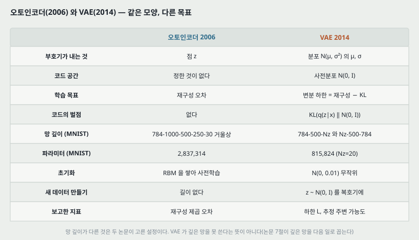

| | 오토인코더 (Science 2006) | VAE (이 논문) |
|---|---|---|
| 부호기가 내는 것 | 점 $z$ | 분포 $\mathcal{N}(\mu, \sigma^2)$ 의 $\mu$, $\sigma$ |
| 코드 공간 | 정한 것이 없다 | 사전분포 $\mathcal{N}(0, I)$ |
| 학습 목표 | 재구성 오차 | 변분 하한 = 재구성 − KL |
| 코드의 벌점 | 없다 | KL(부호기 분포 ↔ $\mathcal{N}(0, I)$) |
| 망 (MNIST) | 784-1000-500-250-30 과 거울상, 층 넷 | 784-500-Nz 와 Nz-500-784, 층 하나 |
| 파라미터 (MNIST) | 2,837,314 | 815,824 (Nz=20) |
| 초기화 | RBM 을 쌓아 사전학습 | $\mathcal{N}(0, 0.01)$ 무작위 |
| 새 데이터 만들기 | 길이 없다 | $z \sim \mathcal{N}(0, I)$ 를 복호기에 |
| 보고한 지표 | 재구성 제곱 오차 | 하한, 추정 주변 가능도 |

**같은 표 안에서도 견줄 수 없는 칸이 있다.** 두 논문은 지표가 다르고(제곱 오차 대 로그 가능도), 망 깊이와 파라미터 수가 3.48 배 다르다. **「VAE 가 오토인코더보다 재구성을 잘한다/못한다」는 이 두 논문으로는 말할 수 없다.**

**한 줄로 적으면**, 2006 논문은 **깊은 망이 배워지는 출발점**을 찾았고, 이 논문은 **부호기의 출력을 분포로 바꾸고 그 분포에 사전분포를 걸어** 오토인코더를 생성 모델로 만들었다. 앞 논문의 문제(깊이)와 이 논문의 문제(분포)는 다른 자리다.

---

## 22. 계보와 내가 가져갈 것

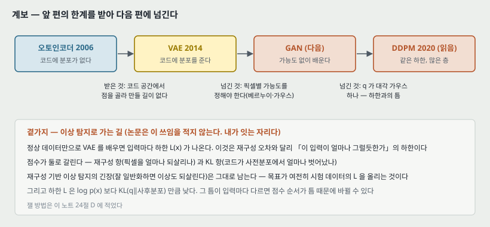

**하나. 앞 칸에서 받은 것.** 오토인코더의 코드에 분포가 없던 자리를, 사전분포 $\mathcal{N}(0, I)$ 와 KL 항이 채운다(11절의 2번 · 3번). 이제 $z \sim \mathcal{N}(0, I)$ 를 뽑아 복호기에 넣는 것이 **학습 목표가 직접 다룬 자리**다.

**둘. 다음 칸(GAN)으로 넘기는 것.** VAE 는 $p_\theta(x \mid z)$ 를 **픽셀별로 독립인 베르누이나 가우스**로 정해야 한다(식 11·12). 그 선택이 곧 「무엇을 비슷하다고 보는가」를 정한다. 가능도를 적지 않고 생성 모델을 배우는 쪽이 로드맵의 다음 칸이다. **이 논문은 표본 품질을 재지 않으므로(19절 일곱) 「VAE 표본이 흐리다」는 이 논문에서 나온 말이 아니다.** 그 비교는 GAN 쪽 논문에서 확인한다.

**셋. 이미 읽은 DDPM 과 이어지는 자리.** DDPM 의 학습 목표도 식 (1)(3) 과 같은 변분 하한이다. 다른 것은 (가) 잠재 변수가 한 층이 아니라 **여러 층**이고 (나) 부호기(정방향 과정)가 **배우지 않는 고정된 잡음 더하기**이고 (다) 그래서 식 (3) 의 KL 들이 가우스끼리의 닫힌 꼴이 된다는 것이다. 이 논문 7절의 「계층적 생성 구조」가 그쪽으로 이어진다 — **이 연결은 내가 이은 것이고 이 논문이 적은 것이 아니다.**

**넷. 이상 탐지로 가는 곁가지 — 논문은 이 쓰임을 적지 않는다.** 정상 데이터만으로 VAE 를 배우면 입력마다 하한 $\mathcal{L}(x)$ 가 나온다. 재구성 오차 하나만 나오던 오토인코더와 달리, 이 점수는 두 조각으로 갈린다.

- **가져갈 것**: 재구성 항(픽셀을 얼마나 되살리나)과 KL 항(코드가 사전분포에서 얼마나 벗어났나)을 **따로** 볼 수 있다. 픽셀은 잘 되살리는데 코드가 사전분포 꼬리에 있는 입력, 또는 그 반대를 가를 수 있다.
- **조심할 것 둘**: (가) 재구성 기반 이상 탐지의 긴장 — 학습 목표가 **시험 데이터의 하한을 올리는 것**이라, 잘 일반화하는 VAE 는 이상도 잘 설명할 수 있다. (나) $\mathcal{L}(x)$ 는 $\log p(x)$ 보다 식 (1) 의 KL 만큼 낮다. **그 틈이 입력마다 다르면, 점수의 순서가 $\log p(x)$ 의 순서가 아니라 틈의 순서를 따를 수 있다**(19절 셋).

> 넷째 문단은 내가 읽고 이은 것이고 이 논문이 측정한 것이 아니다. 24절에 잴 방법을 적어 둔다.

---

## 23. 다음에 읽을 것

**한계를 적고 그 한계를 푼 것이 다음 논문이다.** 이 논문이 남긴 자리에서 넷을 꼽는다.

| 다음 | 이 논문의 어느 자리에서 나오는가 | 무엇을 확인하고 싶은가 |
|---|---|---|
| **GAN** — Generative Adversarial Nets (NeurIPS 2014) | 22절 둘 · 19절 일곱 — 복호기의 가능도를 정해야 하고, 표본 품질을 재지 않는다 | 가능도 없이 생성 모델을 배우면 무엇을 얻고 무엇을 잃는가. 로드맵의 다음 칸이다 |
| **하한을 조이는 편** (중요도 가중 하한) | 19절 셋 — 하한과 $\log p(x)$ 의 틈을 재지 않는다 | 표본 여러 개로 하한을 조이면 틈이 얼마나 줄고, 부호기가 어떻게 달라지는가 |
| **대각 가우스 $q$ 를 넓힌 편** (흐름 기반 사후분포) | 10절 · 18절 — 각주 2 가 「한계가 아니다」라고 적지만 실험은 대각 가우스뿐이다 | $q$ 를 더 유연하게 하면 식 (1) 의 KL 이 얼마나 줄어드는가 |
| **이산 잠재 변수로 가는 편** | 18절 하나 — 재매개변수화가 연속 분포에만 된다 | 이산 코드를 쓰면서 기울기를 어떻게 흘리는가 |

읽는 순서로는 **첫째가 먼저**다. 로드맵의 다음 칸이다. 둘째와 셋째는 이 논문의 식 (1) 을 직접 이어 받는 편이라 GAN 뒤에 VAE 계열로 돌아와 읽는다.

---

## 24. 돌려 볼 것

노트를 쓰며 나온 물음 중 **직접 잴 수 있는 것 넷**이다. **아직 실험 폴더를 만들지 않았고 돌리지 않았다.** 돌리게 되면 질문과 가설을 먼저 적는 규칙대로 폴더를 만든다.

| 무엇 | 이 노트의 어느 자리 | 묻는 것 |
|---|---|---|
| A | 6절 | 논문의 MNIST VAE(은닉 500, Nz=20)에서 $\phi$ 의 기울기를 **소박한 추정량과 재매개변수화로** 같은 미니배치에서 여러 번 추정하면 분산이 몇 배 다른가. 1 차원 예시의 3.75~55.5 배가 신경망에서는 얼마인가 |
| B | 14절 · 19절 넷 | Nz 를 3 · 5 · 10 · 20 · 200 으로 두고 **차원별 KL 을 적어** 몇 차원이 실제로 쓰이는가(KL 이 0.01 nat 을 넘는 차원 수 같은 기준을 먼저 정한다). 그림 2 의 끝 값이 Nz=20 부터 멈추는 것과 맞는가 |
| C | 19절 셋 | 같은 모델에서 하한 $\mathcal{L}$ 과 중요도 표집으로 추정한 $\log p(x)$ 를 함께 적어 **틈이 얼마인가.** seed 셋으로 변동 폭도 함께 |
| D | 22절 넷 | MNIST 한 숫자만으로 배운 VAE 로 나머지 아홉 숫자를 가를 때, **재구성 항 · KL 항 · 하한 전체**를 각각 점수로 쓰면 AUROC 가 얼마인가. 같은 조건의 결정적 오토인코더 재구성 오차와 견준다 |

---

## 25. 물어 두는 것

- **MNIST 를 이진화했는가.** 베르누이 복호기(식 11)를 썼으므로 픽셀이 0/1 이어야 식이 확률이 되는데, 본문이 이진화 방법(고정 문턱 · 확률적 표집)을 적지 않는다. 그림 2 의 −100 근처 값이 어느 쪽인지에 따라 다르다.
- **Frey Face 의 이미지 크기와 장수.** 본문은 데이터 주소만 각주로 달고 크기와 학습 · 시험 분할을 적지 않는다.
- **그림 2 의 학습 · 시험 분할.** MNIST 의 학습 장수(50,000 인가 60,000 인가)가 그림 2 에는 없다.
- **Frey Face 의 깨어남-잠이 왜 580 에서 멈추는가**(14절 읽는 법 4). 네 Nz 에서 같은 값인 것이 학습이 멈춘 것인지, 복호기의 분산 쪽에 걸린 것인지.
- **$\mathcal{N}(0, 0.01)$ 의 0.01 은 분산인가 표준편차인가**(19절 다섯).

---

## 26. 참고 문헌

이 노트가 부른 편만 적는다. 원리는 원 출처를, 구현은 그 라이브러리의 편을 적는 규칙을 따른다. 이 노트는 라이브러리를 부르지 않았다(그림 코드는 파이썬 표준 라이브러리만 쓴다).

- Kingma, D. P. and Welling, M. (2014). Auto-Encoding Variational Bayes. ICLR. arXiv:1312.6114v10. — 이 노트의 대상.
- Hinton, G. E., Dayan, P., Frey, B. J., and Neal, R. M. (1995). The "wake-sleep" algorithm for unsupervised neural networks. **Science**, 268:1158. — 비교 상대(논문의 [HDFN95]).
- Salimans, T. and Knowles, D. A. (2013). Fixed-form variational posterior approximation through stochastic linear regression. **Bayesian Analysis**, 8(4). — 비슷한 재매개변수화를 먼저 쓴 편([SK13]).
- Rezende, D. J., Mohamed, S., and Wierstra, D. (2014). Stochastic backpropagation and variational inference in deep latent Gaussian models. arXiv:1401.4082. — 같은 연결을 독립적으로 낸 편([RMW14]).
- Blei, D. M., Jordan, M. I., and Paisley, J. W. (2012). Variational Bayesian inference with stochastic search. ICML. — 소박한 추정량의 분산이 크다는 근거([BJP12]).
- Roweis, S. (1998). EM algorithms for PCA and SPCA. NIPS. — 주성분 분석과 선형 가우스 모델의 연결([Row98]).
- Duchi, J., Hazan, E., and Singer, Y. (2011). Adaptive subgradient methods for online learning and stochastic optimization. **JMLR**, 12:2121–2159. — Adagrad([DHS10], 논문은 2010 으로 적는다).
- Duane, S., Kennedy, A. D., Pendleton, B. J., and Roweth, D. (1987). Hybrid Monte Carlo. **Physics Letters B**, 195(2):216–222. — 몬테카를로 EM 과 주변 가능도 추정의 표본 뽑기([DKPR87]).
- Hinton, G. E. and Salakhutdinov, R. R. (2006). Reducing the dimensionality of data with neural networks. **Science**, 313(5786):504–507. — 21절의 비교 상대. **이 논문의 참고 문헌에는 없다.**
- Ho, J., Jain, A., and Abbeel, P. (2020). Denoising Diffusion Probabilistic Models. NeurIPS. — 22절 셋의 연결. **이 논문의 참고 문헌에는 없다(뒤에 나온 편이다).**

---

## 27. 경로

| 무엇 | 어디 |
|---|---|
| 원문 PDF | `papers/ICLR14_VAE_Auto_Encoding_Variational_Bayes.pdf` |
| 이 노트 | `notes/ICLR14_VAE_Auto_Encoding_Variational_Bayes.md` |
| 이 노트의 그림 | `figures/ICLR14_VAE/fig01_gap.svg` 부터 `fig14_lineage.svg` 까지 열넷 |
| 그림을 만드는 코드 | `figures/ICLR14_VAE/make_figures.py` — 바깥 데이터를 읽지 않으므로 `python make_figures.py` 로 어디서나 다시 만든다. 3 · 4 · 6 · 7 · 8 · 9 · 10 · 12 번 그림의 수는 이 파일이 계산해 화면에도 찍는다 |
