# VGG — Very Deep Convolutional Networks for Large-Scale Image Recognition (요약)

> **한 줄.** 합성곱 망의 다른 설계는 모두 한 규칙(**3x3 합성곱, 보폭 1, 2x2 풀링**)으로 고정하고 **깊이만** 11 층에서 19 층까지 다섯 단계로 바꿔, 깊이가 정확도에 무엇을 하는지 잰다. 3x3 을 쌓으면 넓은 필터와 같은 범위를 **더 적은 파라미터와 더 많은 비선형**으로 본다. 16 · 19 층 망이 ILSVRC-2014 에서 위치 찾기 1 등, 분류 2 등을 했다. 새로운 것은 부품이 아니라 **「깊이를 늘리는 것 하나만으로 얼마나 가는가」를 체계적으로 잰 것**이다.

---

## Paper Metadata

| Item | Content |
|---|---|
| Title | Very Deep Convolutional Networks for Large-Scale Image Recognition |
| Authors | Karen Simonyan, Andrew Zisserman |
| 소속 | Visual Geometry Group, University of Oxford. 각주에 현재 소속이 Simonyan 은 Google DeepMind, Zisserman 은 Oxford 와 Google DeepMind 로 적혀 있다 |
| Conference / Journal | ICLR 2015 (conference paper) |
| Year | 2015. 저장한 판은 **arXiv:1409.1556v6, 2015-04-10** (최종 카메라 준비판) |
| arXiv | 1409.1556 |
| 코드 · 모델 | 가장 좋은 두 망(D, E)의 가중치를 `http://www.robots.ox.ac.uk/~vgg/research/very_deep/` 에 공개했다고 적는다. **열어 보지 않았다** |
| Stored PDF | `papers/ICLR15_VGG_Very_Deep_Convolutional_Networks_for_Large_Scale_Image_Recognition.pdf` (바탕화면에서 받은 이름은 `1409.1556v6.pdf`) |
| 왜 읽었는가 | 로드맵의 CNN 칸이 AlexNet(2012)에서 멈춰 있었다. AlexNet 노트가 「층을 빼면 top-1 이 약 2% 나빠진다」가 숫자 하나에 얹혀 있다고 적고 **「더 깊게 · 커널을 작게 간 편」**을 다음 읽을 것으로 올려 두었다. 이 논문이 그 자리다 |
| 읽은 범위 | **2026-09-29 에 14 쪽을 전부 읽었다.** 곧 초록 · 1~5절(본문 1~8 쪽) · 참고 문헌 · 부록 A(위치 찾기) · B(다른 데이터로 옮기기) · C(판 이력). 표 1~12 |

### 저장한 파일의 상태

- **arXiv 여섯째 판이고 부록이 붙어 있다.** 본문 8 쪽, 참고 문헌 9~10 쪽, 부록 10~14 쪽. 부록 C 가 판마다 무엇을 더했는지 적는다(19절).
- **글자 층이 살아 있고 표도 글자로 뽑힌다**(pdfTeX 파일). 표 1 만 굵은 글씨(더한 층 표시)가 글자로는 안 보여서 **그 쪽을 그림으로 띄워 확인했다.**
- **그림이 하나도 없다.** 결과는 모두 표 1~12 에 있고, 이 노트의 그림 열여섯은 전부 내가 그렸다(표를 옮긴 것과 계산한 것).

---

## 1. 용어

이 노트에서 쓸 이름을 먼저 정한다. 논문의 원래 용어는 괄호로 함께 적는다.

- **가중 층 (weight layer)**: 학습되는 가중치가 있는 층(합성곱과 완전연결). 풀링과 ReLU 는 세지 않는다. 작은 예시로, 망 D 는 합성곱 13 + 완전연결 3 = 16 가중 층이라 「VGG-16」이라 부른다.
- **수용장 (receptive field)**: 한 층의 한 칸이 입력 그림에서 보는 범위. 논문은 합성곱 필터의 크기를 가리킬 때도 이 말을 쓴다(「3 × 3 receptive field」). 작은 예시로, 3x3 합성곱을 두 층 쌓으면 위층 한 칸이 입력 5x5 를 본다(6절).
- **conv⟨k⟩-⟨C⟩**: 표 1 의 표기. 커널 k x k, 출력 채널 C. 작은 예시로, conv3-256 은 3x3 필터 256 개다.
- **top-1 / top-5 오차 (top-1 / top-5 error)**: 가장 높은 점수 하나가 정답이 아닌 비율 / 가장 높은 다섯 안에 정답이 없는 비율. ILSVRC 의 주 지표는 top-5 다. 작은 예시로, 검증 50,000 장 가운데 3,750 장에서 정답이 다섯 안에 없으면 top-5 오차 7.5% 다.
- **학습 척도 (training scale) S**: 학습 그림을 가로세로 비를 유지한 채 **짧은 변이 S 가 되게** 줄인 값. 그다음 224x224 를 무작위로 잘라 낸다. 작은 예시로, S = 256 이면 자른 조각이 짧은 변의 87.5% 를 덮는다(9절).
- **척도 흔들기 (scale jittering)**: 그림마다 S 를 범위 $[S_\text{min}, S_\text{max}]$ 에서 무작위로 뽑는 것. 논문은 [256, 512] 를 쓴다. 표에서는 `[256;512]` 로 적는다.
- **시험 척도 (test scale) Q**: 시험 그림의 짧은 변을 맞추는 값. S 와 같을 필요가 없다.
- **조밀 평가 (dense evaluation)**: 완전연결 층을 합성곱 층으로 바꿔, 자르지 않은 그림 전체에 망을 한 번에 돌리는 평가. 결과가 점수 **지도**로 나오고 그것을 평균한다(10절).
- **여러 조각 평가 (multi-crop evaluation)**: 그림에서 조각을 여러 개 잘라 각각 망에 넣고 평균하는 평가. 논문은 척도마다 5x5 격자 x 뒤집기 2 = 50 조각, 척도 셋이면 150 조각을 쓴다.
- **망 합치기 (ConvNet fusion)**: 여러 망의 소프트맥스 출력을 평균하는 것. 앙상블이라고도 한다.
- **미리 초기화 (pre-initialisation)**: 깊은 망의 일부 층을 먼저 배운 얕은 망 A 의 가중치로 채우고 시작하는 것(9.2절).
- **위치 찾기 (localisation)**: 그림에서 물체의 테두리 상자를 맞히는 과제. 예측 상자와 정답 상자의 **교집합 / 합집합**이 0.5 를 넘으면 맞은 것으로 친다(17절).
- **곱셈-덧셈 (multiply-add)**: 이 노트가 계산량을 세는 단위. 합성곱 한 층에서 (출력 칸 수) x (커널 넓이) x (입력 채널) x (출력 채널) 이다. **논문은 계산량을 세지 않는다** — 8절의 수는 모두 내가 센 것이다.

---

## 2. 한 문단 요약

AlexNet 이후의 개선들은 첫 층의 필터와 보폭을 줄이거나 그림 전체 · 여러 척도에서 학습하고 시험하는 쪽이었다. 이 논문은 다른 설계를 모두 고정하고 **깊이 하나**를 바꾼다. 모든 합성곱을 3x3 · 보폭 1 · 여백 1 로, 풀링을 2x2 · 보폭 2 다섯 번으로, 완전연결을 4096 · 4096 · 1000 으로 두고, 합성곱을 8 개(망 A)에서 16 개(망 E)까지 늘린다(표 1). 파라미터는 1 억 3,300 만에서 1 억 4,400 만으로 거의 같다(표 2). 3x3 세 층은 7x7 한 층과 수용장이 같으면서 파라미터가 27 대 49 이고 ReLU 가 셋이다. 학습은 AlexNet 을 따르되 깊은 망은 얕은 망 A 의 층을 옮겨 와 시작하고, 학습 그림의 척도를 [256, 512] 에서 흔든다. 시험은 완전연결을 합성곱으로 바꿔 그림 전체에 돌린다. ILSVRC-2012 검증에서 오차는 깊이를 따라 줄다가 19 층에서 멈추고(표 3), 척도 흔들기 · 여러 시험 척도 · 여러 조각 · 망 둘 합치기를 더해 top-5 시험 오차 6.8% 에 닿는다(표 7). 망 하나로는 7.0% 로 GoogLeNet 망 하나(7.9%)보다 낮다. 부록은 이 망을 얼려 특징만 떼어 VOC · Caltech 에 붙여도 앞선 최고를 넘는다는 것을 보인다(표 11 · 12).

---

## 3. 문제 — 깊이만 바꾸면 무엇이 되는가 (1절)

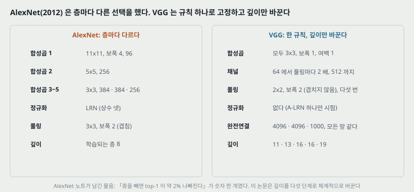

AlexNet(2012)이 ILSVRC 를 이긴 뒤, 합성곱 망은 컴퓨터 비전의 「흔한 도구」가 되었고 그 구조를 고치려는 시도가 이어졌다. 논문 1절이 꼽는 두 갈래는 이렇다.

| 갈래 | 무엇을 바꿨나 | 논문이 든 예 |
|---|---|---|
| 첫 층을 작게 | 첫 합성곱의 **수용장과 보폭을 줄인다** | ILSVRC-2013 의 Zeiler & Fergus, OverFeat |
| 조밀하게 · 여러 척도로 | 그림 **전체 위에서, 여러 척도로** 학습하고 시험한다 | OverFeat, Howard |

이 논문은 **셋째 측면인 깊이**를 다룬다. 방법은 단순하다 — **다른 파라미터는 고정하고 합성곱 층을 더해 깊이를 꾸준히 늘린다.** 그것이 가능한 이유를 논문은 **모든 층에 아주 작은(3x3) 필터를 쓰기 때문**이라고 적는다.

위 그림 왼쪽이 AlexNet 의 선택들이다(앞서 읽은 AlexNet 논문에서 옮겼다). 층마다 필터 크기 · 보폭 · 채널이 다르고 LRN 과 겹치는 풀링이 있다. 오른쪽이 VGG 의 규칙이다. **규칙이 하나라서 「깊이 말고 다른 것이 바뀌었다」는 반론을 줄일 수 있다** — 이것이 이 논문의 실험 설계다. 다만 9.2절(미리 초기화)과 21절에서 보듯 깊이 말고도 바뀌는 것이 남는다.

---

## 4. 구조 규칙 (2.1절)

모든 망이 따르는 규칙을 한곳에 모은다.

| 부분 | 규칙 | 한 줄 이유(논문의 말) |
|---|---|---|
| 입력 | 224x224 RGB. 학습 집합의 **RGB 평균을 픽셀마다 뺀다** — 유일한 전처리 | — |
| 합성곱 | **3x3**, 보폭 1, 여백 1 (크기 보존) | 3x3 은 「왼쪽/오른쪽, 위/아래, 가운데」 개념을 잡는 **가장 작은 크기** |
| 1x1 합성곱 | 망 C 에만 셋 | 입력 채널의 선형 변환 + 비선형 (7절) |
| 풀링 | **최댓값 풀링 다섯 번**, 2x2 · 보폭 2. 모든 합성곱 뒤에 오지는 않는다 | — |
| 채널 | 첫 단계 64, **풀링마다 2 배**, 512 에서 멈춘다 | 폭은 「꽤 작게」 둔다 |
| 완전연결 | 4096 · 4096 · 1000, 그리고 소프트맥스. **모든 망이 같다** | — |
| 비선형 | 모든 은닉 층에 ReLU | — |
| 정규화 | **LRN 없음** (망 A-LRN 하나만 예외) | 표 3 에서 도움이 없었고, 메모리와 계산 시간만 늘렸다 |

작은 예시로, 224 입력이 풀링 다섯 번을 지나면 224 / 2⁵ = 7 이 되고, 마지막 합성곱 출력 7x7x512 = 25,088 개가 첫 완전연결 층의 입력이 된다.

---

## 5. 다섯 망 — 표 1 · 표 2

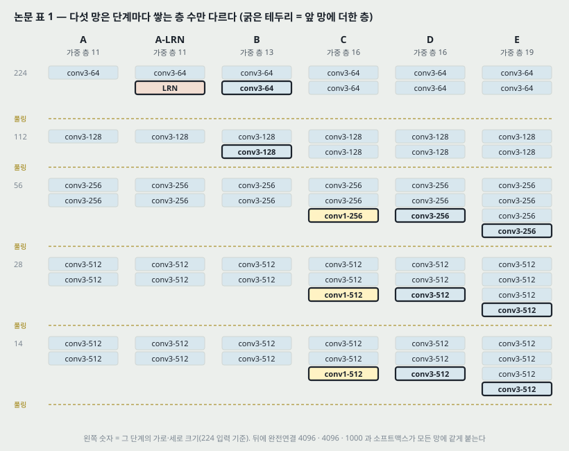

다섯 망 A~E 는 **단계마다 쌓는 합성곱 수만** 다르다. 굵은 테두리가 앞 망에 더해진 층이다(논문 표 1 의 굵은 글씨).

| 망 | 단계별 합성곱 수 (64 · 128 · 256 · 512 · 512) | 가중 층 | 특징 |
|---|---|---:|---|
| A | 1 · 1 · 2 · 2 · 2 | 11 | 가장 얕다. 무작위 초기화로 배운다 |
| A-LRN | A 와 같고 첫 층 뒤에 LRN | 11 | 정규화의 효과만 보는 망 |
| B | 2 · 2 · 2 · 2 · 2 | 13 | 앞 두 단계에 하나씩 더한다 |
| C | 2 · 2 · 3 · 3 · 3 (셋째 칸이 **1x1**) | 16 | 비선형만 더한다 |
| D | 2 · 2 · 3 · 3 · 3 (모두 3x3) | 16 | 흔히 **VGG-16** |
| E | 2 · 2 · 4 · 4 · 4 | 19 | 흔히 **VGG-19** |

### 5.1 파라미터 수를 다시 세기

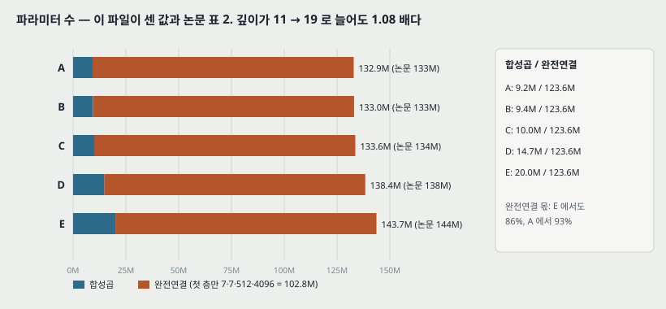

논문 표 2 는 백만 단위 정수만 준다. 그림 코드가 가중치와 치우침을 모두 셌다.

| 망 | 합성곱 | 완전연결 | 합계 | 논문 표 2 | 완전연결 몫 |
|---|---:|---:|---:|---:|---:|
| A | 9,220,480 | 123,642,856 | 132,863,336 | 133M | 93.1% |
| B | 9,404,992 | 123,642,856 | 133,047,848 | 133M | 92.9% |
| C | 9,996,096 | 123,642,856 | 133,638,952 | 134M | 92.5% |
| D | 14,714,688 | 123,642,856 | 138,357,544 | 138M | 89.4% |
| E | 20,024,384 | 123,642,856 | 143,667,240 | 144M | 86.1% |

**다섯 행 모두 논문 값과 반올림해서 같다.** 읽는 법 둘.

1. **깊이가 11 → 19 로 늘어도 파라미터는 1.08 배다.** 합성곱을 여덟 개 더해도 1,080 만 개가 늘 뿐이고, 파라미터의 86~93% 가 완전연결 셋에 있다. 첫 완전연결 층 하나(7·7·512 → 4096)가 102,764,544 + 4,096 개다.
2. 논문은 이것으로 「깊은데도 가중치 수가, 폭과 수용장이 더 큰 얕은 망(OverFeat 의 1 억 4,400 만)보다 많지 않다」고 적는다. **그런데 파라미터가 거의 같다는 것이 계산이 같다는 뜻은 아니다** — 8절.

---

## 6. 왜 3x3 인가 — 쌓은 작은 필터 (2.3절)

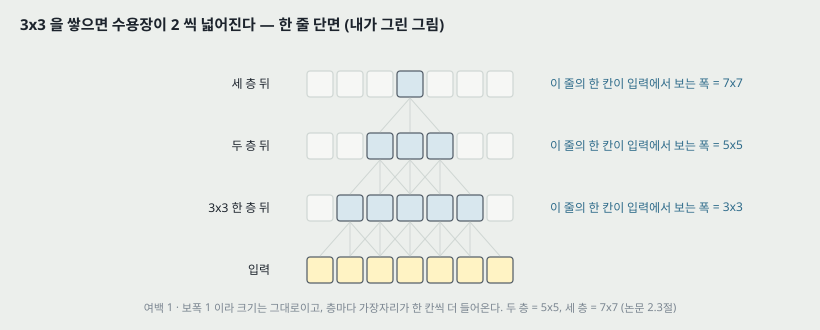

**수용장.** 3x3 합성곱 두 층(사이에 풀링 없이)은 유효 수용장이 5x5, 세 층은 7x7 이다. 층마다 가장자리가 한 칸씩 더 들어오므로 n 층이면 $2n + 1$ 이다(그림 코드: 1 · 2 · 3 · 4 층 → 3 · 5 · 7 · 9).

그러면 7x7 한 층 대신 3x3 세 층을 쓰면 무엇을 얻는가. 논문이 드는 이유는 둘이다.

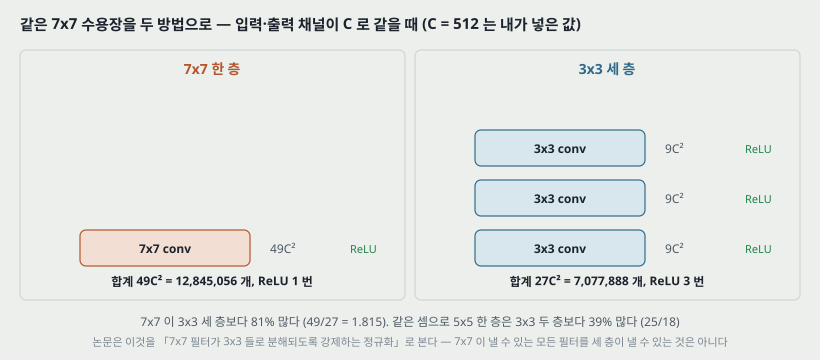

**첫째, 비선형이 셋이다.** ReLU 가 한 번이 아니라 세 번 들어가 「결정 함수가 더 변별적이 된다」.

**둘째, 파라미터가 적다.** 입력과 출력이 모두 C 채널이면(치우침 제외)

$$3 \cdot (3^2 C^2) = 27 C^2 \quad \text{대} \quad 7^2 C^2 = 49 C^2 \qquad (1)$$

곧 7x7 한 층이 **81% 더 많다**(49 / 27 = 1.815). 작은 예시로 C = 512 면 7x7 한 층이 12,845,056 개, 3x3 세 층이 7,077,888 개다. 같은 셈으로 5x5 한 층(25C²)은 3x3 두 층(18C²)보다 39% 많다.

**논문의 해석**: 이것을 **7x7 필터에 걸린 정규화**로 볼 수 있다 — 7x7 필터가 3x3 필터들을 거쳐(사이에 비선형을 끼고) 분해되도록 강제한다는 것이다. 내가 덧붙이면, 이 말은 **3x3 세 층이 낼 수 있는 함수가 7x7 한 층이 낼 수 있는 것의 부분집합이 아니고 그 반대도 아니다**는 뜻이다 — 셋 사이에 ReLU 가 있어 선형 7x7 로는 못 내는 것을 내고, 파라미터가 적어 7x7 이 낼 수 있는 모든 필터를 내지는 못한다.

**그 주장을 잰 자리 하나.** 4.1절이 망 B 에서 3x3 두 층씩을 5x5 한 층으로 바꾼 **얕은 망**(5x5 합성곱 다섯)을 배워 견줬다. 중앙 조각 평가에서 **얕은 망의 top-1 오차가 B 보다 7% 높았다.** 이 비교는 v6 판에서 더해졌고(부록 C) **표 없이 본문 한 문장**이다(21절 셋).

---

## 7. 1x1 합성곱 — 망 C 대 망 D (2.3 · 4.1절)

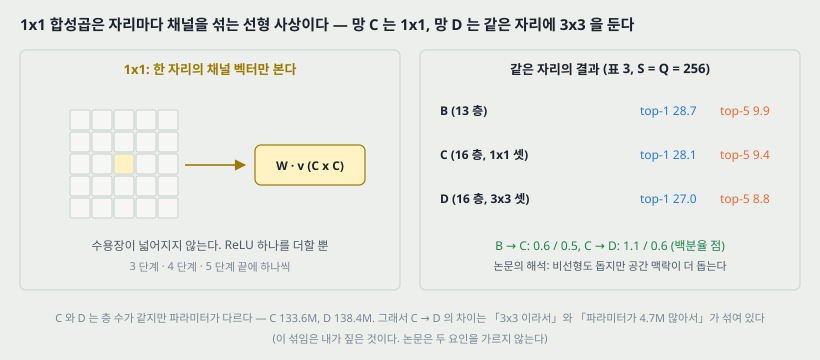

1x1 합성곱은 **자리마다 채널 벡터에 행렬 하나를 곱하는** 선형 사상이다. 수용장을 넓히지 않고, 뒤따르는 ReLU 로 비선형만 하나 더한다. 논문은 입력과 출력 채널이 같아(256 → 256, 512 → 512) 「같은 차원 공간으로의 선형 사영」이라고 적고, Network in Network(Lin 외 2014)가 이미 썼다고 밝힌다. 작은 예시로, 56x56x256 에 1x1 conv-256 을 걸면 3,136 자리마다 256x256 행렬 곱이 한 번씩이고 파라미터는 65,792 개다.

**같은 깊이(16)의 두 망을 견준 결과 (표 3, S = Q = 256).**

| 망 | top-1 | top-5 |
|---|---:|---:|
| B (13 층) | 28.7 | 9.9 |
| C (16 층, 1x1 셋) | 28.1 | 9.4 |
| D (16 층, 3x3 셋) | 27.0 | 8.8 |

논문의 해석: **B 보다 C 가 낫다 → 비선형을 더한 것이 돕는다. C 보다 D 가 낫다 → 크기 있는 수용장으로 공간 맥락을 잡는 것도 중요하다.**

> **내가 짚는 자리.** C 와 D 는 층 수는 같지만 파라미터가 다르다 — C 133.6M, D 138.4M 으로 D 가 4.7M 많다. 그래서 C → D 의 1.1 / 0.6 점은 「3x3 이라서」와 「합성곱 파라미터가 1.47 배라서」가 섞여 있다. 논문은 둘을 가르지 않는다.

---

## 8. 깊이의 비용 — 파라미터는 같아도 계산은 다르다 (내가 센 것)

**이 절의 수는 논문에 없다.** 논문은 파라미터 수(표 2)와 학습 기간(2~3 주)만 적는다. 그림 코드가 224x224 한 장의 순방향 곱셈-덧셈과 활성 수를 셌다.

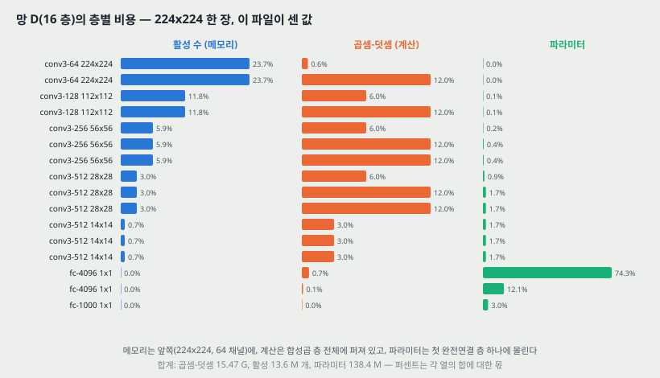

**망 D 한 장(224x224)의 비용.** 곱셈-덧셈 15.47 G, 활성(층 출력) 13,556,712 개 = float32 로 54.2 MB(순방향만, 역전파 저장은 뺐다), 파라미터 138.4 M.

| 무엇 | 어디에 몰리나 |
|---|---|
| 활성 (메모리) | **첫 두 층**(224x224x64 두 번)이 47.4% |
| 곱셈-덧셈 (계산) | 합성곱 층 전체에 퍼져 있다. 완전연결 셋은 0.8% 뿐 |
| 파라미터 | **첫 완전연결 층 하나**가 74.3%, 완전연결 셋이 89.4% |

**세 자원이 서로 다른 층에 몰린다**는 것이 이 표의 요점이다. 메모리를 줄이려면 앞쪽을, 계산을 줄이려면 합성곱 전체를, 파라미터를 줄이려면 첫 완전연결 층을 건드려야 한다.

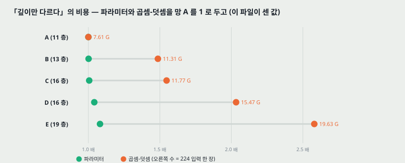

**다섯 망의 비용 (망 A 대비).**

| 망 | 파라미터 배수 | 곱셈-덧셈 (224 한 장) | 곱셈-덧셈 배수 |
|---|---:|---:|---:|
| A | 1.000 | 7.61 G | 1.000 |
| B | 1.001 | 11.31 G | 1.486 |
| C | 1.006 | 11.77 G | 1.547 |
| D | 1.041 | 15.47 G | 2.033 |
| E | 1.081 | 19.63 G | 2.580 |

**「깊이만 다르다」에서 파라미터는 1.08 배지만 계산은 2.58 배다.** B 에서 크게 뛰는 이유는 224x224 · 112x112 단계에 합성곱을 하나씩 더했기 때문이다 — 같은 3x3 이라도 큰 지도 위에서는 비싸다. 작은 예시로, 망 B 가 더한 conv3-64 한 층(224x224, 64 → 64)만 224·224·9·64·64 = 1.85 G 다.

---

## 9. 학습 (3.1절)

### 9.1 설정

| 항목 | 값 |
|---|---|
| 목적 | 다항 로지스틱 회귀(소프트맥스 교차 엔트로피) |
| 최적화 | 미니배치 경사 하강 + 모멘텀 0.9, 배치 256 |
| 정규화 | 가중치 감쇠(L2) $5 \cdot 10^{-4}$, 앞 두 완전연결 층에 드롭아웃 0.5 |
| 학습률 | $10^{-2}$ 에서 시작, **검증 정확도가 멈추면 10 으로 나눈다.** 모두 3 번 나눴다 |
| 길이 | 370K 반복 (74 에폭) |
| 늘리기 | 무작위 224 자르기(반복마다 그림당 하나), 좌우 뒤집기, RGB 색 흔들기(AlexNet 방식) |

작은 예시로, 370,000 반복 x 256 장 = 94,720,000 장이고 학습 집합 1.3M 장으로 나누면 약 73 바퀴라 논문의 74 에폭과 맞는다(1.3M 이 반올림 값이라 1 차이가 난다).

**논문의 추측.** AlexNet 보다 파라미터가 많고 깊은데도 **더 적은 에폭에 수렴**한 이유를 (a) 깊이와 작은 필터가 거는 암묵적 정규화, (b) 일부 층의 미리 초기화로 **추측(conjecture)** 한다. 잰 것은 아니다.

### 9.2 초기화 — 얕은 망에서 옮겨 온다

나쁜 초기화는 깊은 망에서 **기울기가 불안정해 학습을 멈춰 세울 수 있다.** 그래서:

1. 무작위 초기화로도 배울 만큼 얕은 **망 A 를 먼저 배운다.**
2. 깊은 망을 배울 때 **처음 네 합성곱 층과 마지막 세 완전연결 층**을 A 의 층으로 채우고, 가운데 층은 무작위로 둔다.
3. 옮겨 온 층의 학습률을 낮추지 않아 학습 중에 바뀔 수 있게 둔다.
4. 무작위 초기화는 평균 0, **분산** $10^{-2}$ 의 정규분포, 치우침은 0.

**논문이 덧붙인 것**: 제출 뒤에 **Glorot & Bengio(2010)의 무작위 초기화를 쓰면 미리 학습 없이도 초기화할 수 있다**는 것을 알았다고 적는다. **그 방식으로 표를 다시 낸 것은 없다.**

> **내가 짚는 자리.** 「처음 네 합성곱 층」을 옮긴다는데 **모양이 맞지 않는다.** A 의 처음 넷은 conv3-64 · conv3-128 · conv3-256 · conv3-256 이고, B~E 의 처음 넷은 conv3-64 · conv3-64 · conv3-128 · conv3-128 이다. A 의 둘째 층(64 → 128)은 B 의 둘째 층(64 → 64)에 들어가지 않는다. 어느 층을 어디에 넣었는지 본문에 없다(27절).

### 9.3 학습 척도 S

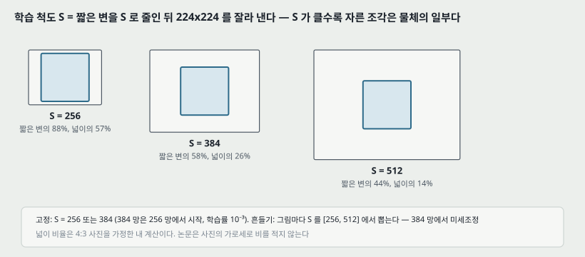

224x224 입력은 **짧은 변이 S 가 되게 줄인 그림에서** 잘라 낸다. S = 224 면 조각이 짧은 변을 가득 덮어 그림 전체의 통계를 보고, S 가 224 보다 훨씬 크면 조각이 물체 하나나 물체의 일부만 본다.

| S | 조각이 덮는 짧은 변 | 조각이 덮는 넓이 (4:3 사진이라 가정) |
|---:|---:|---:|
| 256 | 87.5% | 57.4% |
| 384 | 58.3% | 25.5% |
| 512 | 43.8% | 14.4% |

(넓이 비율은 내 계산이다. 논문은 사진의 가로세로 비를 적지 않는다.)

**두 방식.**

- **한 척도 학습**: S = 256(앞선 연구들이 널리 쓴 값) 또는 S = 384. S = 384 망은 **S = 256 망의 가중치로 시작**하고 첫 학습률을 $10^{-3}$ 으로 낮춘다.
- **여러 척도 학습(척도 흔들기)**: 그림마다 S 를 [256, 512] 에서 무작위로 뽑는다. 물체 크기가 그림마다 다르므로 한 모델이 넓은 범위의 척도에서 알아보게 배운다. 속도 때문에 **S = 384 로 미리 배운 같은 구조의 망에서 모든 층을 미세조정**한다.

---

## 10. 시험 — 조밀 평가와 여러 조각 (3.2절)

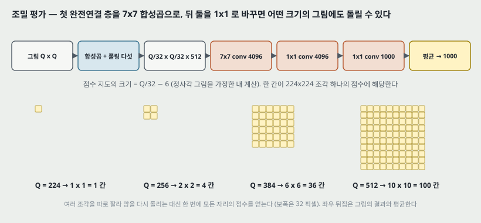

**조밀 평가.** 시험 그림의 짧은 변을 Q 로 맞춘 뒤, **완전연결 층을 합성곱 층으로 바꾼다** — 첫 완전연결 층을 7x7 합성곱으로, 뒤 둘을 1x1 합성곱으로. 이 완전 합성곱 망을 **자르지 않은 그림 전체**에 돌리면, 채널이 부류 수(1000)이고 가로세로가 그림 크기에 따라 달라지는 **점수 지도**가 나온다. 이것을 공간 평균해 부류 점수 하나로 만들고, 좌우 뒤집은 그림의 소프트맥스 출력과 평균한다(OverFeat 와 비슷한 방식).

**점수 지도의 크기 (내가 계산한 것).** 정사각 그림이면 마지막 합성곱 출력이 Q / 32 이고 7x7 합성곱(여백 없음)을 지나 Q / 32 − 6 이 된다.

| Q | 점수 지도 | 칸 수 |
|---:|---:|---:|
| 224 | 1 x 1 | 1 |
| 256 | 2 x 2 | 4 |
| 384 | 6 x 6 | 36 |
| 512 | 10 x 10 | 100 |

한 칸이 224x224 조각 하나의 점수에 해당하고 이웃 칸 사이가 32 픽셀이다. **여러 조각을 따로 잘라 망을 다시 돌리지 않아도** 모든 자리의 점수를 한 번에 얻는다 — 겹치는 계산을 나눠 쓰기 때문이다.

**여러 조각 평가.** 논문은 조밀 평가가 효율적이라 실제로는 여러 조각의 늘어난 계산 시간이 정확도 이득을 정당화하지 못한다고 **믿는다**고 적는다. 다만 참고용으로 척도마다 50 조각(5x5 격자 x 뒤집기 2), 척도 셋에 150 조각도 잰다(GoogLeNet 의 척도 넷 144 조각과 견줄 만한 수).

**두 방식이 서로 보완하는 이유(논문의 가설).** 조각에 망을 돌리면 합성곱의 가장자리가 **0 으로 채워지고**, 조밀 평가에서는 같은 조각의 가장자리가 **그림의 이웃 부분에서** 온다. 그래서 조밀 평가가 망 전체의 수용장을 크게 늘려 맥락을 더 잡는다. 이 가설은 14절의 표 5 로만 받친다 — 가장자리 효과를 따로 잰 실험은 없다.

---

## 11. 구현 (3.3절)

- Caffe(2013 년 12 월 갈래)를 고쳐 **한 기계의 여러 GPU**에서 학습 · 평가하고, 자르지 않은 그림을 여러 척도로 다루게 했다.
- **데이터 병렬**: 배치를 GPU 수만큼 나눠 각자 기울기를 계산하고 평균한다. 동기식이라 결과가 GPU 하나로 배운 것과 **정확히 같다.**
- 4-GPU 에서 GPU 하나 대비 **3.75 배** 빨랐다. NVIDIA Titan Black 넷으로 망 하나 학습에 **2~3 주**.

작은 예시로, 3.75 / 4 = 0.94 라 GPU 넷의 병렬 효율이 94% 다.

---

## 12. 결과 1 — 한 척도 평가 (표 3, 4.1절)

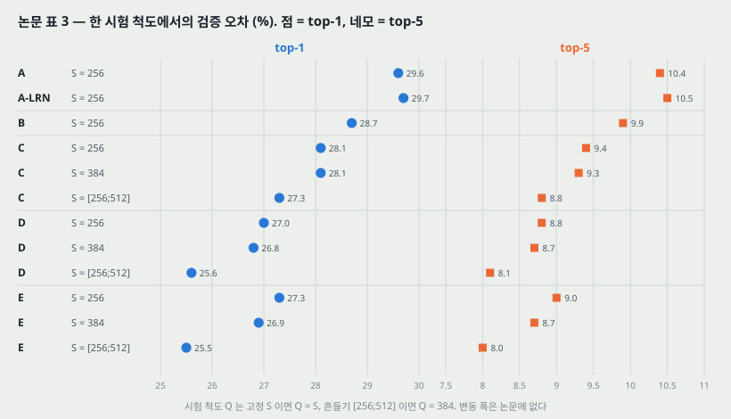

시험 척도 Q 는 고정 S 이면 Q = S, 흔들기이면 Q = 0.5(S_min + S_max) = 384. 검증 집합(50K 장)에서 잰 값이다.

| 망 | 학습 S | 시험 Q | top-1 | top-5 |
|---|---|---:|---:|---:|
| A | 256 | 256 | 29.6 | 10.4 |
| A-LRN | 256 | 256 | 29.7 | 10.5 |
| B | 256 | 256 | 28.7 | 9.9 |
| C | 256 | 256 | 28.1 | 9.4 |
| C | 384 | 384 | 28.1 | 9.3 |
| C | [256;512] | 384 | 27.3 | 8.8 |
| D | 256 | 256 | 27.0 | 8.8 |
| D | 384 | 384 | 26.8 | 8.7 |
| D | [256;512] | 384 | 25.6 | 8.1 |
| E | 256 | 256 | 27.3 | 9.0 |
| E | 384 | 384 | 26.9 | 8.7 |
| E | [256;512] | 384 | 25.5 | 8.0 |

**논문이 읽은 것 넷과 내가 붙인 수.**

1. **LRN 은 돕지 않는다** — A 29.6 / 10.4 대 A-LRN 29.7 / 10.5. 그래서 B~E 에 정규화를 넣지 않았다. 차이가 0.1 점이라 **「돕지 않는다」까지만 서고 「해친다」는 서지 않는다.**
2. **깊이를 따라 오차가 준다** — S = 256 에서 A → D 로 top-1 2.6 점, top-5 1.6 점.
3. **19 층에서 멈춘다** — S = 256 에서 E(27.3)가 D(27.0)보다 **0.3 점 나쁘고**, 흔들기에서는 E(25.5)가 D(25.6)보다 0.1 점 낫다. 논문은 「오차율이 19 층에서 포화한다. 더 큰 데이터라면 더 깊은 모델이 이로울 수도 있다」고 적는다.
4. **척도 흔들기가 확실히 낫다** — 시험은 한 척도인데도, D 에서 S = 384 → [256;512] 로 top-1 1.2 점, top-5 0.6 점.

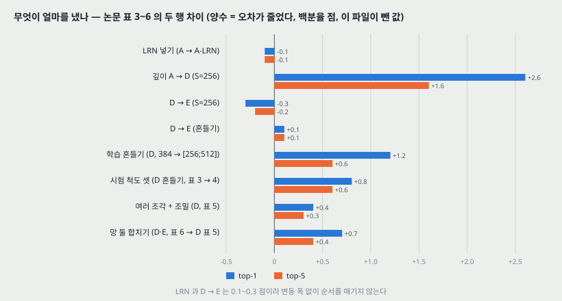

---

## 13. 결과 2 — 여러 시험 척도 (표 4, 4.2절)

한 모델을 여러 크기로 줄인 시험 그림에 돌려 소프트맥스를 평균한다. 학습과 시험 척도가 크게 다르면 성능이 떨어지므로, 고정 S 모델은 **Q = {S − 32, S, S + 32}**, 흔들기 모델은 더 넓게 **Q = {256, 384, 512}** 에서 쟀다.

| 망 | 학습 S | 시험 Q | top-1 | top-5 |
|---|---|---|---:|---:|
| B | 256 | 224, 256, 288 | 28.2 | 9.6 |
| C | 256 | 224, 256, 288 | 27.7 | 9.2 |
| C | 384 | 352, 384, 416 | 27.8 | 9.2 |
| C | [256;512] | 256, 384, 512 | 26.3 | 8.2 |
| D | 256 | 224, 256, 288 | 26.6 | 8.6 |
| D | 384 | 352, 384, 416 | 26.5 | 8.6 |
| D | [256;512] | 256, 384, 512 | **24.8** | **7.5** |
| E | 256 | 224, 256, 288 | 26.9 | 8.7 |
| E | 384 | 352, 384, 416 | 26.7 | 8.6 |
| E | [256;512] | 256, 384, 512 | **24.8** | **7.5** |

**표 3 대비 (내가 뺀 값).** D 흔들기 25.6 / 8.1 → 24.8 / 7.5 로 0.8 / 0.6 점. D 고정 S = 256 은 27.0 / 8.8 → 26.6 / 8.6 으로 0.4 / 0.2 점. **흔들기 모델이 시험 척도를 넓힐 때 더 얻는다** — 넓은 척도에서 배웠으니 넓은 척도를 쓸 수 있다는 논문의 설명과 맞는다.

가장 좋은 **망 하나**의 검증 값이 24.8 / 7.5 (D 와 E 가 같다)이고, 시험 집합에서 E 가 top-5 **7.3%** 다.

---

## 14. 결과 3 — 조밀 대 여러 조각 (표 5, 4.3절)

모든 행이 S ∈ [256;512] 학습, Q = {256, 384, 512} 시험이다.

| 망 | 평가 | top-1 | top-5 |
|---|---|---:|---:|
| D | 조밀 | 24.8 | 7.5 |
| D | 여러 조각 | 24.6 | 7.5 |
| D | 여러 조각 + 조밀 | 24.4 | 7.2 |
| E | 조밀 | 24.8 | 7.5 |
| E | 여러 조각 | 24.6 | 7.4 |
| E | 여러 조각 + 조밀 | 24.4 | 7.1 |

**여러 조각이 조밀보다 0.2 점(top-1) 낫고, 둘을 합치면 각각보다 낫다**(D: 0.4 / 0.3 점). 논문은 이것을 두 방식이 **보완적**이라는 근거로 쓰고, 이유를 10절의 가장자리 처리 차이로 **가설**한다. 차이가 0.1~0.4 점이고 변동 폭이 없다.

---

## 15. 결과 4 — 망 합치기 (표 6, 4.4절)

| 합친 망 | top-1 검증 | top-5 검증 | top-5 시험 |
|---|---:|---:|---:|
| **ILSVRC 제출**: D 셋(256 · 384 · 흔들기), C 둘(256 · 384), E 둘(256 · 384) = 7 망 | 24.7 | 7.5 | 7.3 |
| 제출 뒤: D · E 흔들기 둘, 조밀 | 24.0 | 7.1 | 7.0 |
| 제출 뒤: D · E 흔들기 둘, 여러 조각 | 23.9 | 7.2 | - |
| 제출 뒤: D · E 흔들기 둘, 여러 조각 + 조밀 | **23.7** | **6.8** | **6.8** |

**읽는 법 둘.**

1. **제출 때는 흔들기 모델이 D 하나뿐이었고, 그것도 완전연결 층만 미세조정한 것이다**(모든 층이 아니라). 곧 표 6 첫 행의 「D/[256;512]」는 표 3 · 4 의 같은 이름 행과 **학습이 다른 모델**이다.
2. **망 일곱보다 좋은 망 둘이 낫다** — 7.3 대 7.0(조밀), 6.8(조밀 + 여러 조각). 망 하나(E, 표 5)는 7.1 이다(검증 top-5).

---

## 16. 결과 5 — 앞선 방법과 견주기 (표 7, 4.5절)

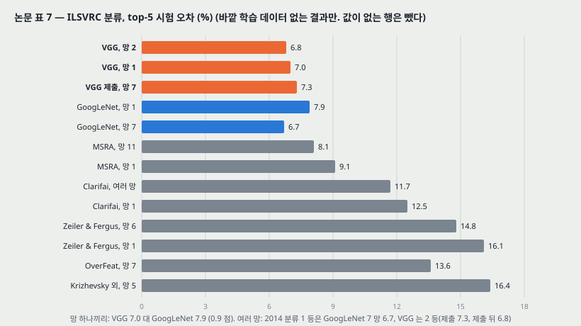

바깥 학습 데이터 없이 낸 결과만 모은 표다.

| 방법 | top-1 검증 | top-5 검증 | top-5 시험 |
|---|---:|---:|---:|
| VGG (망 2, 여러 조각 + 조밀) | 23.7 | 6.8 | 6.8 |
| VGG (망 1, 여러 조각 + 조밀) | 24.4 | 7.1 | 7.0 |
| VGG (ILSVRC 제출, 망 7, 조밀) | 24.7 | 7.5 | 7.3 |
| GoogLeNet (망 1) | - | 7.9 | - |
| GoogLeNet (망 7) | - | 6.7 | - |
| MSRA (망 11) | - | - | 8.1 |
| MSRA (망 1) | 27.9 | 9.1 | 9.1 |
| Clarifai (여러 망) | - | - | 11.7 |
| Clarifai (망 1) | - | - | 12.5 |
| Zeiler & Fergus (망 6) | 36.0 | 14.7 | 14.8 |
| Zeiler & Fergus (망 1) | 37.5 | 16.0 | 16.1 |
| OverFeat (망 7) | 34.0 | 13.2 | 13.6 |
| OverFeat (망 1) | 35.7 | 14.2 | - |
| Krizhevsky 외 (망 5) | 38.1 | 16.4 | 16.4 |
| Krizhevsky 외 (망 1) | 40.7 | 18.2 | - |

(GoogLeNet 두 행은 원문 표에서 값이 한 칸씩만 있다. 본문이 GoogLeNet 7 망을 「6.7% 오차」, 망 하나를 「VGG 망 하나(7.0%)보다 0.9% 나쁘다」고 적으므로 **두 값을 top-5 시험으로 읽었다.** 그림 13 도 그렇게 그렸다.)

**논문이 적는 것.** 2014 분류 과제에서 VGG 팀은 **7 망 7.3% 로 2 등**이었고, 제출 뒤 **2 망 6.8%** 로 낮췄다. 1 등 GoogLeNet(6.7%)과 「경쟁할 만하다」, 2013 우승 Clarifai(바깥 데이터로 11.2%, 없이 11.7%)는 크게 이긴다. **망 하나끼리는 VGG 7.0% 가 GoogLeNet 을 0.9 점 이긴다.** 그리고 이 결과가 LeCun 외(1989)의 **고전적 합성곱 구조에서 벗어나지 않고** 깊이만 크게 늘려 얻은 것이라는 점을 강조한다.

**AlexNet 과 견주면** (같은 표에서): 망 하나 top-5 검증 18.2 → 7.1, 망 여럿 top-5 시험 16.4 → 6.8. 세 해 만에 top-5 오차가 **0.41 배**(6.8 / 16.4)가 되었다. 이 사이에는 깊이 말고도 척도 흔들기 · 조밀 평가 · 여러 조각 · 합치기가 모두 들어 있다(그림 12 가 그 몫을 가른다).

---

## 17. 부록 A — 위치 찾기 (ILSVRC-2014 1 등)

분류망 D 를 거의 그대로 쓰고 **마지막 완전연결 층이 부류 점수 대신 테두리 상자**(중심 좌표, 폭, 높이의 4 차원)를 내게 바꾼다. 상자를 모든 부류가 함께 쓰면 **SCR**(단일 부류 회귀, 마지막 층 4 차원), 부류마다 따로면 **PCR**(부류별 회귀, 4 x 1000 = 4000 차원)이다. 손실은 로지스틱 대신 **유클리드 손실**이고, 학습은 같은 척도의 분류 모델에서 시작해 학습률 $10^{-3}$. 시간 때문에 **척도 흔들기는 쓰지 않았다**(S = 256, 384 두 모델).

**설정 비교 (표 8)** — 중앙 조각 하나, 정답 부류를 준 단순 시험, S = 384.

| 미세조정한 층 | 회귀 | 위치 찾기 오차 |
|---|---|---:|
| 첫 · 둘째 완전연결 | SCR | 36.4 |
| 첫 · 둘째 완전연결 | PCR | 34.3 |
| 모든 층 | PCR | 33.1 |

OverFeat 와 달리 **PCR 이 SCR 보다 낫고**(2.1 점), 모든 층을 미세조정하는 것이 완전연결만보다 낫다(1.2 점).

**전체 시험 (표 9)** — 분류망이 고른 top-5 부류, 그림 전체에 조밀하게 돌린 뒤 OverFeat 의 탐욕 병합.

| 학습 S | 시험 Q | top-5 위치 찾기 오차 검증 | 시험 |
|---|---|---:|---:|
| 256 | 256 | 29.5 | - |
| 384 | 384 | 28.2 | 26.7 |
| 384 | 352, 384 | 27.5 | - |
| 합치기: 256/256 과 384/352,384 | | 26.9 | 25.3 |

**앞선 방법과 (표 10).** VGG 26.9 / **25.3**(시험), GoogLeNet - / 26.7, OverFeat 30.0 / 29.9, Krizhevsky 외 - / 34.2. **25.3% 로 2014 위치 찾기 1 등.** 논문은 OverFeat 보다 **적은 척도를 쓰고 해상도 올리기 기법도 안 썼는데** 더 좋았다며, 더 단순한 방법에 더 강한 표현이라는 점을 강조한다.

---

## 18. 부록 B — 다른 데이터로 옮기기

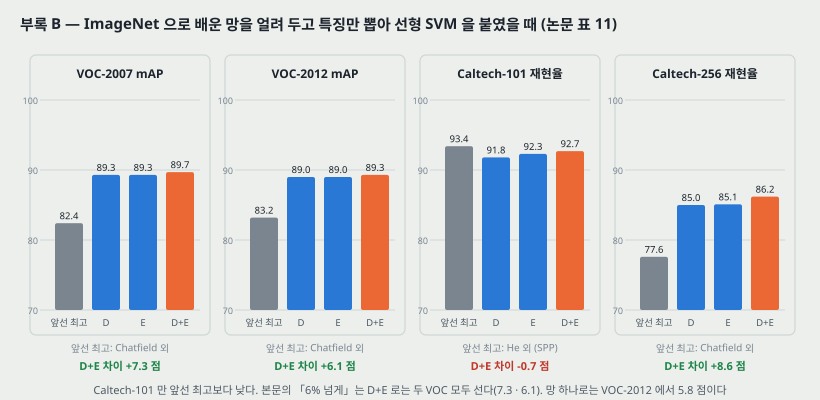

**방법.** ImageNet 으로 배운 D 와 E 에서 마지막 1000 분류 층을 떼고, **끝에서 둘째 층의 4096 차원 활성**을 특징으로 쓴다. 조밀하게 돌려 **전역 평균 풀링**으로 4096 차원 하나를 만들고, 뒤집은 그림의 것과 평균하고, 여러 척도 Q 에서 뽑은 것을 **쌓거나(stack) 평균한다.** L2 정규화 뒤 **선형 SVM** 을 붙인다. **망 가중치는 얼려 둔다**(미세조정 없음).

**표 11.** (VOC 는 평균 정밀도의 평균 mAP, Caltech 는 부류별 재현율의 평균. * 는 2000 부류로 넓힌 ILSVRC 로 미리 배운 것)

| 방법 | VOC-2007 | VOC-2012 | Caltech-101 | Caltech-256 |
|---|---:|---:|---:|---:|
| Zeiler & Fergus | - | 79.0 | 86.5 ± 0.5 | 74.2 ± 0.3 |
| Chatfield 외 | 82.4 | 83.2 | 88.4 ± 0.6 | 77.6 ± 0.1 |
| He 외 (SPP) | 82.4 | - | 93.4 ± 0.5 | - |
| Wei 외 | 81.5 (85.2*) | 81.7 (90.3*) | - | - |
| **VGG Net-D (16 층)** | 89.3 | 89.0 | 91.8 ± 1.0 | 85.0 ± 0.2 |
| **VGG Net-E (19 층)** | 89.3 | 89.0 | 92.3 ± 0.5 | 85.1 ± 0.3 |
| **VGG Net-D & Net-E** | 89.7 | 89.3 | 92.7 ± 0.5 | 86.2 ± 0.3 |

**척도를 합치는 방법이 데이터에 따라 달랐다.** VOC 는 물체가 여러 크기로 나와 **평균이 쌓기와 비슷**했고, 평균은 차원을 안 늘려서 Q ∈ {256, 384, 512, 640, 768} 다섯 척도를 썼다(셋에서 다섯으로 넓힌 이득은 0.3% 로 「미미」). Caltech 는 물체가 그림을 가득 채워 척도마다 뜻이 달라(전체 대 부분) **쌓기가 평균 · 최댓값보다 나았고** 세 척도를 썼다.

**읽는 법 셋 (차이는 그림 코드가 뺀 값).**

1. **VOC 에서 D 와 E 가 같다**(89.3 · 89.0). 깊이 16 과 19 가 이 과제에서는 갈리지 않는다.
2. **본문의 「Chatfield 외보다 6% 넘게」는 D+E 로는 두 VOC 모두 선다**(+7.3, +6.1). 망 하나로 VOC-2012 는 +5.8 이다. Wei 외는 VOC-2012 에서 1% 높은 mAP(90.3*)를 내지만 **VOC 와 뜻이 가까운 1000 부류를 더한 2000 부류 데이터**로 미리 배웠고 검출 보조 파이프라인도 합쳤다고 논문이 밝힌다.
3. **Caltech-101 은 앞선 최고보다 낮다**(92.7 대 He 외 93.4, −0.7). 논문은 「경쟁할 만하다」고 적고, He 외가 VOC-2007 에서는 크게 진다는 것을 덧붙인다. Caltech-256 은 **8.6 점** 앞선다(86.2 대 77.6).

**표 12 — VOC-2012 행동 분류 (mAP).** 사람 상자 없이 그림만 써도 앞선 방법을 넘고, 상자 안의 특징을 함께 쌓으면 더 오른다.

| 방법 | mAP |
|---|---:|
| Oquab 외 | 70.2* |
| Gkioxari 외 | 73.6 |
| Hoai | 76.3 |
| VGG D & E, 그림만 | 79.2 |
| VGG D & E, 그림 + 상자 | 84.0 |

(* 는 1512 부류로 넓힌 ILSVRC 로 미리 배운 것.) 논문은 과제별 휴리스틱 없이 **표현의 힘에만 기댔다**고 적는다. 공개 뒤에 R-CNN 검출(Girshick 외), 의미 분할(Long 외), 캡션 생성, 질감 · 재질 인식에서 AlexNet 대신 이 망을 써서 이득을 봤다는 것도 적는다.

---

## 19. 부록 C — 판 이력

| 판 | 더한 것 |
|---|---|
| v1 | 첫 판. ILSVRC 제출 전 실험 |
| v2 | 제출 뒤 **척도 흔들기** 실험 |
| v3 | 부록 B 의 VOC · Caltech 일반화 실험, 모델 공개 |
| v4 | ICLR 형식으로 바꿈. **여러 조각** 분류 실험 |
| v6 | 카메라 준비판. **망 B 대 얕은 망(5x5)** 비교, VOC 행동 분류 |

(v5 는 목록에 없다.) **이 노트가 짚는 자리 둘이 이 이력과 닿는다** — 척도 흔들기(표 3 의 가장 좋은 행들)는 제출 뒤 더해진 것이고, 3x3 의 근거가 되는 얕은 망 비교는 마지막 판에 한 문장으로 들어왔다.

---

## 20. 이 논문이 스스로 적은 한계와 조건

1. **19 층에서 오차가 포화한다.** 더 깊은 모델은 **더 큰 데이터셋에서** 이로울 수 있다고만 적는다(4.1절).
2. **깊은 망은 미리 초기화가 필요했다** — 나쁜 초기화는 깊은 망에서 기울기 불안정으로 학습을 멈춘다(3.1절). 제출 뒤 Glorot 초기화로 된다는 것을 알았다고 덧붙인다.
3. **에폭이 적게 든 이유는 추측이다**(3.1절).
4. **여러 조각과 조밀의 보완성은 가설이다** — 가장자리 조건 차이로 설명한다(4.3절).
5. **여러 조각의 계산 비용이 정확도 이득을 정당화하지 못한다고 믿는다**(3.2절) — 믿음으로 적었다.
6. **위치 찾기에 척도 흔들기와 OverFeat 의 해상도 올리기를 안 썼다** — 시간 때문. 넣으면 더 나을 것이라 **예상한다**(부록 A).
7. **학습이 비싸다** — Titan Black 넷으로 망 하나에 2~3 주(3.3절).

---

## 21. 논문이 적지 않은 것 — 내가 읽으며 짚은 자리

**하나. 변동 폭이 한 곳도 없다.** 표 3~7 의 모든 행이 한 번의 학습이다(부록 B 의 Caltech ± 만 데이터 분할 셋의 폭이다). LRN(0.1 점), D 대 E(0.1~0.3 점), 조밀 대 여러 조각(0.2 점) 같은 차이는 **이 실행의 순서**로만 적는다.

**둘. 깊이 말고도 바뀐 것이 있다.** 「깊이만 다르다」는 구조 규칙에서는 맞지만 학습에서는 셋이 더 바뀐다. (가) **초기화** — A 는 무작위, B~E 는 A 에서 일부 층을 옮겨 온다. (나) **계산량** — 파라미터는 1.08 배지만 곱셈-덧셈은 2.58 배(8절). (다) **S = 384 · 흔들기 모델의 시작점** — S = 384 는 256 망에서, 흔들기는 384 망에서 미세조정한다. 곧 표 3 의 「흔들기가 낫다」는 **학습을 한 번 더 이어서 한 모델**과의 비교다.

**셋. 3x3 의 근거가 되는 실험이 표 없이 한 문장이다.** 「얕은 5x5 망의 top-1 오차가 B 보다 **7% 높았다**」 — (가) 7 이 **백분율 점**인지 **상대 %**인지 적혀 있지 않다(B 의 28.7 에 7 점이면 35.7, 7% 상대면 30.7). (나) **중앙 조각 평가**라서 표 3 의 조밀 평가 값과 같은 칸에 놓을 수 없다. (다) 두 망의 파라미터가 다르다 — 5x5 한 층이 3x3 두 층보다 39% 많다(6절). **파라미터를 맞춘 얕은 망이 아니다.**

**넷. C 와 D 의 차이에 파라미터가 섞여 있다**(7절). 1x1 대 3x3 비교가 합성곱 파라미터 1.47 배 차이 위에 있다.

**다섯. 검증 집합이 학습 결정에 쓰였다.** 학습률을 「검증 정확도가 멈추면」 나눴고, 대부분의 실험이 **같은 검증 집합을 시험 집합으로** 쓴다(4절). 그래서 표 3~5 의 검증 값은 완전히 떼어 둔 값이 아니다. 공식 시험 서버 값(표 6 · 7 의 top-5 시험)이 그 점에서 더 깨끗하다 — 망 하나 E 는 검증 7.5 대 시험 7.3 으로 오히려 시험이 낮았다.

**여섯. 9.2절의 층 옮기기 모양이 맞지 않는다.** A 의 처음 네 합성곱과 B~E 의 처음 네 합성곱은 채널이 다르다. 어느 층이 어디로 갔는지 본문에서 알 수 없다.

**일곱. 「포화」의 근거가 한 행이다.** S = 256 에서 E 가 D 보다 0.3 점 나쁜 것과 흔들기에서 0.1 점 좋은 것이 전부다. 이것으로 「19 층에서 포화」와 「19 층에서 오히려 나빠지기 시작한다」를 가를 수 없다. **다음 편(ResNet)이 받는 물음이 정확히 이 자리다** — 더 깊은 평범한 망이 **학습 오차까지** 나빠지는가.

---

## 22. 읽을 때 헷갈리는 지점

**「VGG-16」의 16 은 가중 층 수다.** 합성곱 13 + 완전연결 3. 풀링 다섯과 소프트맥스는 안 센다. 망 C 도 16 층이지만 흔히 VGG-16 이라 부르는 것은 D 다.

**S 와 Q 는 다르다.** S 는 학습 때 짧은 변, Q 는 시험 때 짧은 변. 표의 「train (S)」와 「test (Q)」 두 칸이 이것이다. 224 는 둘 다 아니고 **잘라 낸 조각의 크기**다.

**표 6 첫 행의 「D/[256;512]」는 표 3 · 4 의 같은 이름 행과 다른 모델이다**(15절). 제출 때는 완전연결만 미세조정했다.

**조밀 평가는 여러 조각 평가의 빠른 판이 아니다.** 같은 자리의 점수라도 가장자리 처리가 달라 값이 다르다(10절). 그래서 둘을 합치면 오른다.

**「receptive field」가 두 뜻으로 쓰인다.** 논문은 필터 크기(「3 × 3 receptive field」)와 쌓은 층의 유효 범위(「effective receptive field of 5 × 5」) 둘 다에 이 말을 쓴다. 이 노트는 필터 크기는 **커널**, 유효 범위는 **수용장**으로 부른다.

**분산인가 표준편차인가.** 무작위 초기화를 「평균 0, **분산** $10^{-2}$」로 적었다 — 표준편차로는 0.1 이다. 이 논문은 명시했다.

**파라미터 수와 계산량을 섞지 않는다.** 「VGG 는 1 억 3,800 만 파라미터라 무겁다」는 반쯤만 맞다 — 그 89% 가 완전연결에 있고, 계산의 99% 는 합성곱에 있다(8절).

---

## 23. AlexNet(2012)과 맞춰 보기

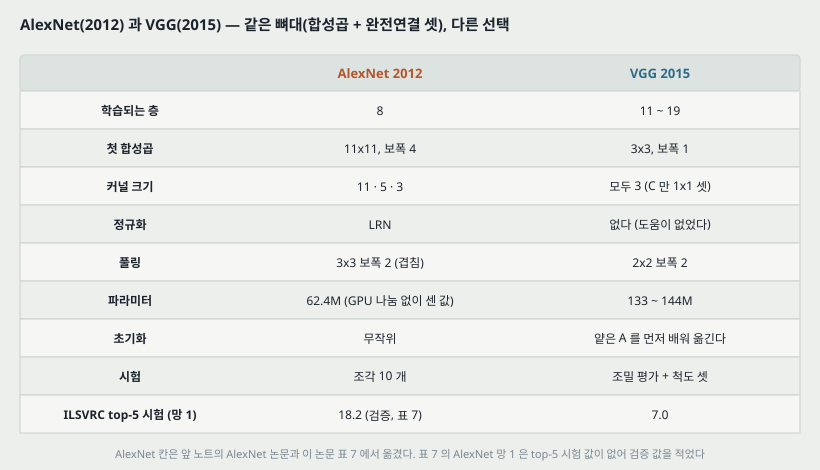

| | AlexNet (NIPS 2012) | VGG (이 논문) |
|---|---|---|
| 학습되는 층 | 8 | 11 ~ 19 |
| 첫 합성곱 | 11x11, 보폭 4 | 3x3, 보폭 1 |
| 커널 크기 | 11 · 5 · 3 | 모두 3 (C 만 1x1 셋) |
| 정규화 | LRN | 없다 (A-LRN 에서 도움이 없었다) |
| 풀링 | 3x3 보폭 2 (겹침) | 2x2 보폭 2 |
| 파라미터 | 62.4M (GPU 나눔 없이 내가 센 값) | 133 ~ 144M |
| 초기화 | 무작위 | 얕은 A 를 먼저 배워 옮긴다 |
| 시험 | 조각 10 개 | 조밀 평가 + 척도 셋 |
| 학습 기간 | 그 논문의 GTX 580 두 대로 5~6 일 | Titan Black 넷으로 2~3 주 |
| top-5 (망 하나, 표 7) | 18.2 (검증) | 7.0 (시험), 7.1 (검증) |

**같은 뼈대 위의 두 선택이다** — 합성곱 몇 층 뒤에 완전연결 셋. 논문도 「고전적 합성곱 구조에서 벗어나지 않았다」고 적는다. 다른 것은 **첫 층에서 해상도를 얼마나 빨리 줄이느냐**와 **깊이**다. AlexNet 은 첫 층에서 보폭 4 로 224 → 55 로 줄이고, VGG 는 첫 단계 두 층을 224x224 그대로 돌린다 — 그래서 8절의 메모리 절반이 거기에 있다.

**AlexNet 노트가 남긴 물음에 이 논문이 답한 것과 안 한 것.** 「층을 빼면 약 2% 나빠진다」가 숫자 하나였던 자리는 **표 3 의 다섯 깊이로 체계적으로 채워졌다**(A → D 2.6 점). 「LRN 을 왜 안 쓰게 되었나」는 **A-LRN 한 행**(0.1 점)이 답이다. 「11x11 보폭 4 가 왜 3x3 으로 바뀌나」는 6절의 파라미터 · 비선형 논리와 얕은 망 한 문장이 답이다. **겹치는 풀링 대 겹치지 않는 풀링은 재지 않았다.**

---

## 24. 계보와 내가 가져갈 것

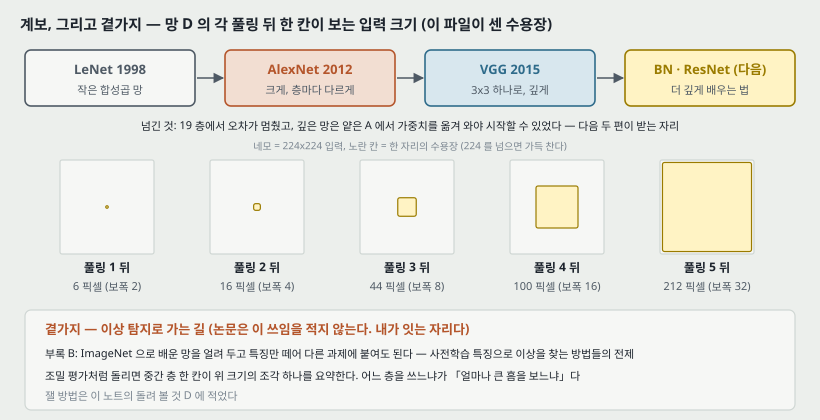

**하나. 앞 칸에서 받은 것.** AlexNet 이 층마다 따로 고른 것을 **규칙 하나**로 바꾸고, 그 규칙 위에서 깊이만 움직였다. 이 논문 이후 「3x3 을 쌓는다」는 합성곱 망의 기본값이 된다.

**둘. 다음 칸으로 넘기는 것.** 이 논문 스스로 두 자리를 남긴다 — (가) **19 층에서 멈췄다**, (나) **깊은 망은 얕은 망에서 층을 옮겨 와야 시작할 수 있었다.** 형제 노트의 두 편이 이 둘을 받는다. Batch Normalization 은 층마다 입력 분포를 맞춰 **초기화와 학습률에 덜 예민하게** 하는 쪽이고, ResNet 은 **더 깊은 평범한 망이 왜 학습 오차부터 나빠지는가**를 묻고 지름길 연결로 수백 층까지 간다. 이 연결은 내가 잇는 것이고, 이 논문은 두 편을 알 수 없다(더 뒤에 나왔다).

**셋. 이상 탐지로 가는 곁가지 — 논문은 이 쓰임을 적지 않는다.** 부록 B 가 보인 것은 **ImageNet 으로 배운 망을 얼려 두고 특징만 떼어 다른 과제에 붙여도 된다**는 것이다. 사전학습 특징으로 이상을 찾는 방법들(사용자의 연구인 PatchCore 계열이 그렇다)의 전제가 여기에 있다. 가져갈 것 둘과 조심할 것 하나.

- **가져갈 것 — 조밀 평가가 곧 조각별 특징이다.** 완전연결을 합성곱으로 바꿔 그림 전체에 돌리면, 중간 층의 **한 칸이 입력의 한 조각을 요약하는 벡터**가 된다. 망 D 에서 그 조각의 크기를 셌다(그림 16): 풀링 1 뒤 6 픽셀, 2 뒤 16, 3 뒤 44, 4 뒤 100, 5 뒤 212 픽셀(보폭 2 · 4 · 8 · 16 · 32). **어느 층의 특징을 쓰느냐가 곧 「얼마나 큰 흠을 보느냐」다.**
- **가져갈 것 — 척도를 합치는 법은 데이터에 따라 다르다.** 부록 B 에서 물체 크기가 다양한 VOC 는 평균, 물체가 그림을 채우는 Caltech 는 쌓기가 나았다. 산업 검사 그림은 대개 물체가 화면을 채우는 쪽이다 — 이것은 내 짐작이고 잰 것이 아니다.
- **조심할 것 — 이 망의 특징은 ImageNet 부류를 가르도록 배웠다.** 부록 B 의 과제들은 모두 **물체 부류**를 묻는 과제다. 긁힘 · 얼룩처럼 부류와 상관없는 작은 흠을 이 특징이 얼마나 잘 가르는지는 이 논문의 범위 밖이다.

> 셋째 문단은 내가 읽고 이은 것이고 이 논문이 측정한 것이 아니다. 26절에 잴 방법을 적어 둔다. 수용장 수는 그림 코드가 층을 따라 센 이론적 수용장이다.

---

## 25. 다음에 읽을 것

**한계를 적고 그 한계를 푼 것이 다음 논문이다.** 이 논문이 남긴 자리에서 넷을 꼽는다.

| 다음 | 이 논문의 어느 자리에서 나오는가 | 무엇을 확인하고 싶은가 |
|---|---|---|
| **ResNet** — Deep Residual Learning for Image Recognition (CVPR 2016) | 12절 셋 · 21절 일곱 — 19 층에서 멈췄다 | 더 깊은 평범한 망이 **학습 오차까지** 나빠지는가. 지름길 연결이 그것을 어떻게 푸는가. VGG-19 가 비교 상대로 나오는가 |
| **Batch Normalization** (ICML 2015) | 9.2절 · 20절 둘 — 미리 초기화가 필요했다 | 층마다 정규화하면 미리 초기화 없이 같은 깊이가 배워지는가 |
| **GoogLeNet** — Going Deeper with Convolutions (2014) | 2.3절 · 16절 — 같은 해 1 등, 망 하나로는 VGG 에 0.9 점 진다 | 1x1 · 3x3 · 5x5 를 나란히 두는 구조가 계산량(8절)을 얼마나 줄이는가 |
| **Glorot & Bengio (2010)** — Understanding the difficulty of training deep feedforward neural networks | 9.2절 — 제출 뒤 이 초기화로 미리 학습 없이 된다고 적는다 | 분산을 어떻게 맞추면 깊은 망이 무작위 초기화로 시작되는가 |

읽는 순서로는 **ResNet · BN 이 먼저**다(바탕화면에 함께 받아 둔 두 편이다).

---

## 26. 돌려 볼 것

노트를 쓰며 나온 물음 중 **직접 잴 수 있는 것 넷**이다. **아직 실험 폴더를 만들지 않았고 돌리지 않았다.** 돌리게 되면 질문과 가설을 먼저 적는 규칙대로 폴더를 만든다.

| 무엇 | 이 노트의 어느 자리 | 묻는 것 |
|---|---|---|
| A | 6절 · 21절 셋 | CIFAR-10 크기에서 **파라미터를 맞춘** 3x3 두 층 대 5x5 한 층(채널로 맞춘다)을 seed 셋으로 배우면 차이가 변동 폭 밖에 있는가. 논문의 「7%」가 파라미터 차이 없이도 남는가 |
| B | 7절 · 21절 넷 | 1x1 대 3x3 비교를 **파라미터를 맞춰서**(3x3 쪽 채널을 줄여서) 다시 하면 C → D 의 차이가 얼마나 남는가 |
| C | 9.2절 · 20절 둘 | 망 D 크기를 작은 데이터에서 **무작위(분산 $10^{-2}$) · Glorot · A 에서 옮기기** 셋으로 시작해, 첫 몇 에폭의 학습 곡선과 층별 기울기 크기를 적는다(역전파 · DBN 실험의 층별 기울기 측정과 같은 방식) |
| D | 24절 셋 | 사전학습 VGG-16 의 풀링 2 · 3 · 4 뒤 특징으로 MVTec 같은 산업 검사 데이터의 이상 점수(최근접 이웃 거리)를 내면, 흠의 크기에 따라 어느 층이 이기는가. **수용장 16 · 44 · 100 픽셀과 흠 크기의 관계**를 본다 |

---

## 27. 물어 두는 것

- **「처음 네 합성곱 층」을 어떻게 옮겼는가**(9.2절, 21절 여섯). A 와 B~E 의 앞 네 층은 채널이 맞지 않는다. 공개한 모델 페이지나 코드에 답이 있을 수 있다.
- **얕은 5x5 망의 「7% 높다」는 점인가 상대 %인가**(21절 셋).
- **학습률을 나눈 시점과 에폭**(3 번). 검증 정확도가 멈춘 것을 어떻게 판정했는지.
- **Glorot 초기화로 다시 배운 망의 오차는 얼마였는가**(20절 둘). 「가능하다」만 적혀 있다.
- **VGG 팀의 제출 7 망 가운데 흔들기 D 가 표 3 · 4 의 D 와 얼마나 다른가**(15절). 완전연결만 미세조정한 판의 한 망 값이 없다.

---

## 28. 참고 문헌

이 노트가 부른 편만 적는다. 원리는 원 출처를, 구현은 그 라이브러리의 편을 적는 규칙을 따른다. 이 노트는 라이브러리를 부르지 않았다(그림 코드는 파이썬 표준 라이브러리만 쓴다). 논문의 구현은 Caffe 다.

- Simonyan, K. and Zisserman, A. (2015). Very deep convolutional networks for large-scale image recognition. ICLR. arXiv:1409.1556v6. — 이 노트의 대상.
- Krizhevsky, A., Sutskever, I., and Hinton, G. E. (2012). ImageNet classification with deep convolutional neural networks. NIPS. — 출발점 구조, 학습 절차, LRN, 색 흔들기의 출처. 23절의 비교 상대.
- LeCun, Y. 외 (1989). Backpropagation applied to handwritten zip code recognition. **Neural Computation**, 1(4):541–551. — 논문이 「고전적 합성곱 구조」로 인용하는 편.
- Sermanet, P. 외 (2014). OverFeat: Integrated recognition, localization and detection using convolutional networks. ICLR. — 조밀 평가와 위치 찾기 방법의 출처.
- Zeiler, M. D. and Fergus, R. (2014). Visualizing and understanding convolutional networks. ECCV. — 첫 층을 작게 한 ILSVRC-2013 방법.
- Lin, M., Chen, Q., and Yan, S. (2014). Network in network. ICLR. — 1x1 합성곱.
- Szegedy, C. 외 (2014). Going deeper with convolutions. arXiv:1409.4842. — GoogLeNet, 25절의 다음 읽을 것.
- Glorot, X. and Bengio, Y. (2010). Understanding the difficulty of training deep feedforward neural networks. AISTATS. — 제출 뒤 쓴 초기화.
- Ciresan, D. C. 외 (2011). Flexible, high performance convolutional neural networks for image classification. IJCAI. — 작은 필터를 먼저 쓴 편.
- Chatfield, K., Simonyan, K., Vedaldi, A., and Zisserman, A. (2014). Return of the devil in the details. BMVC. — 부록 B 의 주 비교 상대.
- Jia, Y. (2013). Caffe: An open source convolutional architecture for fast feature embedding. — 구현이 기댄 라이브러리.

---

## 29. 경로

| 무엇 | 어디 |
|---|---|
| 원문 PDF | `papers/ICLR15_VGG_Very_Deep_Convolutional_Networks_for_Large_Scale_Image_Recognition.pdf` |
| 공개 모델 페이지(열어 보지 않음) | `http://www.robots.ox.ac.uk/~vgg/research/very_deep/` |
| 이 노트 | `notes/ICLR15_VGG_Very_Deep_Convolutional_Networks_for_Large_Scale_Image_Recognition.md` |
| 이 노트의 그림 | `figures/ICLR15_VGG/fig01_gap.svg` 부터 `fig16_lineage.svg` 까지 열여섯 |
| 그림을 만드는 코드 | `figures/ICLR15_VGG/make_figures.py` — 바깥 데이터를 읽지 않으므로 `python make_figures.py` 로 어디서나 다시 만든다. 파라미터 수 · 수용장 · 곱셈-덧셈 · 활성 수 · 점수 지도 크기 · 표 사이의 차이를 이 파일이 계산해 화면에도 찍는다 |
