# BN — Batch Normalization: Accelerating Deep Network Training by Reducing Internal Covariate Shift (요약)

> **한 줄.** 층마다 들어가는 값을 **미니배치의 평균과 분산으로 정규화**하고, 그 뒤에 학습되는 척도 $\gamma$ 와 이동 $\beta$ 를 붙인다. 정규화를 **망의 한 층으로 넣어 역전파가 그것을 통과하게** 한 것이 핵심이다. 그러면 학습률을 크게 잡아도 터지지 않고, 시그모이드도 배워지고, 드롭아웃 · LRN 을 줄이거나 뺄 수 있다. 논문은 이 효과를 **「내부 공변량 이동을 줄여서」**라고 설명하는데, 그 이동을 수치로 잰 자리는 한 곳(그림 1 의 활성 하나)뿐이다.

---

## Paper Metadata

| Item | Content |
|---|---|
| Title | Batch Normalization: Accelerating Deep Network Training by Reducing Internal Covariate Shift |
| Authors | Sergey Ioffe, Christian Szegedy |
| 소속 | 둘 다 Google |
| Conference / Journal | ICML 2015 (Proceedings of the 32nd International Conference on Machine Learning, Lille), JMLR W&CP 37권 |
| Year | 2015 |
| arXiv | 1502.03167 (이 파일은 학회판이라 arXiv 번호가 적혀 있지 않다) |
| 코드 | 본문에 코드 주소가 없다 |
| Stored PDF | `papers/ICML15_BN_Batch_Normalization_Accelerating_Deep_Network_Training_by_Reducing_Internal_Covariate_Shift.pdf` (바탕화면에서 받은 이름은 `ioffe15.pdf`) |
| 왜 읽었는가 | AlexNet 노트가 남긴 자리 — **LRN 의 상수 넷을 검증으로 골랐다고만 적고 이득이 −1.4% 였는데, 오늘날 LRN 을 안 쓰는 이유**가 어디서 갈리는지 본다. 그리고 로드맵에서 역전파 · DBN · AE 노트가 계속 붙들고 온 물음(깊은 망이 왜 안 배워지는가)의 한 답이다 |
| 읽은 범위 | **2026-09-29 에 9 쪽을 전부 읽었다.** 곧 초록 · 1~5절 · 알고리즘 1 · 2 · 그림 1~4(그림 3 · 4 는 표) · 참고 문헌 24 건의 목록 |

### 저장한 파일의 상태

- **학회판 9 쪽이다.** 본문 1~8 쪽, 참고 문헌 9 쪽. 부록은 없다.
- **글자 층이 살아 있다**(pdfTeX 로 만든 파일). 역전파 식 여섯과 알고리즘 2 는 글자가 흩어져 나와서 **4 · 5 쪽은 쪽 그림으로도 맞춰 읽었다.**
- **그림 1 · 2 의 곡선 값은 본문에 없다.** 이 노트가 옮긴 두 그림의 값은 **300 dpi 로 키워 눈금을 읽은 값**이고, 읽기 오차를 함께 적는다. 그림 3 · 4 는 **표라서 숫자를 그대로 옮겼다.**

---

## 1. 용어

이 노트에서 쓸 이름을 먼저 정한다. 논문의 원래 용어는 괄호로 함께 적는다.

- **공변량 이동 (covariate shift)**: 학습 체계에 들어가는 입력의 분포가 바뀌는 것(Shimodaira 2000). 작은 예시로, 낮에 찍은 사진으로 배운 분류기에 밤 사진이 들어오는 경우.
- **내부 공변량 이동 (internal covariate shift)**: 논문의 정의로 **「학습 중 망 파라미터가 바뀌어서 망의 활성 분포가 바뀌는 것」**. 층 하나를 작은 학습 체계로 보면, 그 입력(= 앞 층의 출력)의 분포가 앞 층들이 배우는 동안 계속 바뀐다. 작은 예시로, 그림 1 에서 앞 층 가중치를 1 에서 3 으로 바꾸자 이 층 입력의 평균이 −0.006 에서 0.436 으로, 표준편차가 0.834 에서 1.418 로 바뀌었다(2절).
- **백색화 (whitening)**: 입력을 선형 변환해 평균 0, 분산 1, **서로 상관 없음**으로 만드는 것. 공분산 행렬의 역제곱근이 필요하다.
- **미니배치 (mini-batch)** $\mathcal{B} = \{x_{1 \ldots m}\}$: 한 번의 기울기 걸음에 쓰는 예시 $m$ 개. 논문의 MNIST 실험은 $m = 60$, ImageNet 실험은 $m = 32$.
- **활성 (activation)** $x^{(k)}$: 한 층 입력 벡터의 $k$ 번째 성분 하나. BN 은 성분마다 따로 정규화한다.
- **배치 정규화 변환 (Batch Normalizing Transform)** $\text{BN}_{\gamma, \beta}$: 알고리즘 1. 미니배치 평균과 분산으로 정규화한 $\hat{x}$ 에 $\gamma$ 를 곱하고 $\beta$ 를 더한다. 이 노트에서 **BN** 이라 줄여 부른다.
- **$\gamma$, $\beta$ (척도, 이동)**: 활성마다 학습되는 두 파라미터. 작은 예시로, $\hat{x} = 1.62$ 이고 $\gamma = 2$, $\beta = 0.5$ 면 다음 층은 3.74 를 받는다(5절).
- **$\epsilon$**: 분산에 더하는 작은 상수. 0 으로 나누는 것을 막는다. **논문은 값을 적지 않는다.** 이 노트의 예시는 $10^{-5}$ 로 둔다.
- **모집단 통계 (population statistics)** $\text{E}[x]$, $\text{Var}[x]$: 추론 때 미니배치 대신 쓰는, 학습 데이터 전체에 대한 평균과 분산. 논문은 여러 미니배치의 통계를 평균해 얻는다(알고리즘 2).
- **학습 모드 / 추론 모드**: BN 이 미니배치 통계를 쓰는 때와 얼린 모집단 통계를 쓰는 때. 논문의 기호로는 $N^{tr}_{BN}$ 과 $N^{inf}_{BN}$.
- **포화 (saturation)**: 시그모이드 입력의 절댓값이 커서 기울기 $\sigma'(x)$ 가 0 에 붙는 것. 작은 예시로, $\sigma'(0) = 0.25$ 인데 $\sigma'(4) = 0.0177$ 이라 14 배 작다.
- **LRN (Local Response Normalization, 국소 응답 정규화)**: AlexNet 이 쓴, 같은 자리의 이웃 채널끼리 나누는 정규화. 논문의 BN-Inception 이 뺀다.
- **Inception**: 이 논문의 ImageNet 기준 망. GoogLeNet(Szegedy 외 2014)의 변형으로 $5 \times 5$ 합성곱을 $3 \times 3$ 두 번으로 바꿨고 파라미터 $13.6 \times 10^6$ 개다.

---

## 2. 한 문단 요약

깊은 망의 각 층은 앞 층들의 출력을 입력으로 받는데, 앞 층들이 배우는 동안 그 입력 분포가 계속 바뀐다. 논문은 이것을 **내부 공변량 이동**이라 부르고, 이것 때문에 학습률을 낮게 잡고 초기화를 조심해야 하며 시그모이드처럼 포화하는 비선형은 배우기 어렵다고 본다(1절). 층 입력을 백색화하면 좋겠지만, 정규화를 **기울기 걸음 밖에서** 하면 기울기가 정규화를 모르고 파라미터를 엉뚱하게 키우고(2절), 전체 백색화는 비싸다. 그래서 **(가) 성분마다 따로 평균 0 · 분산 1 로 맞추고 (나) 그 통계를 미니배치에서 계산해 역전파가 통과하게** 한다. 정규화로 잃는 표현력은 학습되는 $\gamma$, $\beta$ 로 되찾는다 — 항등 변환도 나타낼 수 있다(3절, 알고리즘 1). 추론 때는 모집단 통계로 바꿔 선형 변환 하나가 된다(알고리즘 2). 합성곱 층에서는 특징 지도 하나의 모든 자리를 한 묶음으로 정규화한다. MNIST 시그모이드 망에서 BN 이 시험 정확도를 빨리 올리고 활성 분포를 안정시켰고(그림 1), Inception 에 BN 만 넣으면 같은 정확도(72.2%)까지 **2.33 배 적은 걸음**, BN 에 일곱 가지 변경(학습률 ×5, 드롭아웃 제거 등)을 더하면 **14.8 배 적은 걸음**이 걸렸다(그림 3). 앙상블 여섯으로 ImageNet 시험 서버 top-5 오차 **4.82%** 를 냈다(그림 4).

---

## 3. 문제 — 앞 층이 배우면 이 층의 입력이 바뀐다 (논문 1절)

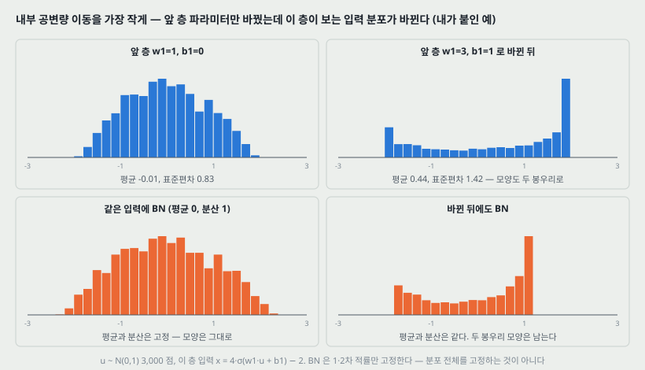

### 3.1 미니배치 확률적 경사 하강

논문은 확률적 경사 하강(SGD)으로 손실 $\frac{1}{N}\sum_i \ell(x_i, \Theta)$ 를 줄이는 데서 시작한다. 미니배치를 쓰는 이유 둘: 미니배치 기울기 $\frac{1}{m}\sum_i \partial \ell(x_i, \Theta) / \partial \Theta$ 가 전체 기울기의 추정이고 $m$ 이 클수록 좋아진다, 그리고 한꺼번에 계산하는 편이 빠르다. 대신 SGD 는 **학습률과 초기값을 조심스럽게 골라야 한다.** 각 층의 입력이 앞 모든 층의 파라미터에 달려 있어 **작은 변화가 깊이를 따라 커지기** 때문이다.

### 3.2 층을 떼어 내면 보이는 것

망 $\ell = F_2(F_1(u, \Theta_1), \Theta_2)$ 에서 $x = F_1(u, \Theta_1)$ 로 두면, $\Theta_2$ 의 기울기 걸음은

$$\Theta_2 \leftarrow \Theta_2 - \frac{\alpha}{m} \sum_{i=1}^{m} \frac{\partial F_2(x_i, \Theta_2)}{\partial \Theta_2}$$

로 **입력이 $x$ 인 독립된 망 $F_2$ 를 배우는 것과 정확히 같다.** 그러면 학습 체계 전체에 좋은 입력 성질 — 예를 들어 학습과 시험의 분포가 같은 것 — 이 이 부분 망에도 좋다. 곧 **$x$ 의 분포가 시간에 따라 고정되어 있으면 $\Theta_2$ 가 그 변화에 맞춰 다시 적응할 필요가 없다.**

### 3.3 그림으로 (내가 붙인 예)

위 그림은 이 생각을 가장 작은 꼴로 옮긴 것이다. $u \sim \mathcal{N}(0, 1)$ 3,000 점을 앞 층 $\sigma(w_1 u + b_1)$ 에 넣고, 이 층은 $x = 4\sigma(\cdot) - 2$ 를 받는다. **이 층 자신의 파라미터는 그대로 두고 앞 층만** $(w_1, b_1) = (1, 0)$ 에서 $(3, 1)$ 로 바꿨다.

| | 평균 | 표준편차 | 15 / 50 / 85 백분위 |
|---|---:|---:|---|
| 앞 층 $(1, 0)$ | −0.006 | 0.834 | −0.935 / −0.019 / 0.962 |
| 앞 층 $(3, 1)$ | 0.436 | 1.418 | −1.540 / 0.878 / 1.938 |
| $(1, 0)$ 에 BN | 0.000 | 1.000 | −1.114 / −0.016 / 1.161 |
| $(3, 1)$ 에 BN | 0.000 | 1.000 | −1.394 / 0.311 / 1.059 |

**읽는 법 둘.** (가) 앞 층만 바뀌었는데 이 층이 보는 분포의 평균 · 폭 · 모양(한 봉우리에서 두 봉우리로)이 모두 바뀐다. (나) **BN 은 평균과 분산만 고정한다.** 두 봉우리 모양과 중앙값 0.311 은 그대로 남는다. 논문도 「$\hat{x}$ 들의 결합 분포는 학습 중에 바뀔 수 있다」고 스스로 적는다(3절).

---

## 4. 포화 — 분포가 밀리면 기울기가 사라진다 (논문 1절)

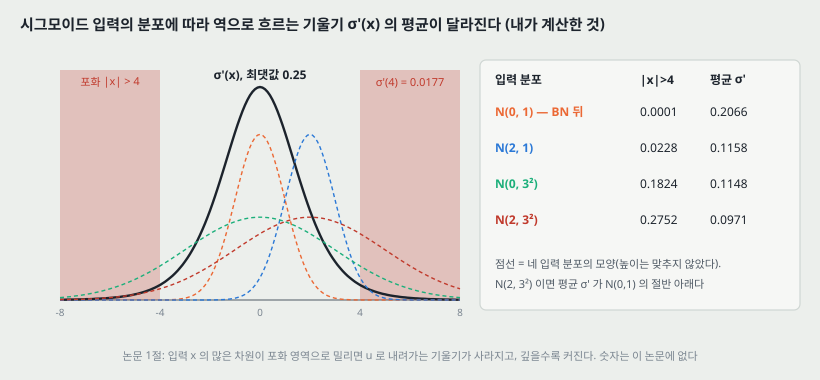

시그모이드 층 $z = g(Wu + b)$, $g(x) = 1 / (1 + e^{-x})$ 에서 $\lvert x \rvert$ 가 커지면 $g'(x) \to 0$ 이다. 그래서 $x = Wu + b$ 의 차원 중 절댓값이 작은 것 말고는 $u$ 로 내려가는 기울기가 사라지고 학습이 느려진다. $x$ 는 $W$, $b$ 와 **아래 모든 층의 파라미터**에 달려 있으므로, 학습 중에 그 파라미터들이 바뀌면 $x$ 의 많은 차원이 포화 영역으로 밀리고, 이것이 깊이를 따라 커진다.

**논문은 이 효과를 숫자로 적지 않는다.** 그림 코드가 입력 분포 넷에 대해 계산했다($\lvert x \rvert > 4$ 를 포화로 둔 것은 내 기준이고, 그 경계에서 $\sigma'(4) = 0.0177$ 이다).

| 시그모이드 입력의 분포 | $\lvert x \rvert > 4$ 인 비율 | 평균 $\sigma'(x)$ | 최댓값 0.25 대비 |
|---|---:|---:|---:|
| $\mathcal{N}(0, 1)$ — BN 뒤($\gamma = 1$, $\beta = 0$) | 0.0001 | 0.2066 | 83% |
| $\mathcal{N}(2, 1)$ — 평균만 밀림 | 0.0228 | 0.1158 | 46% |
| $\mathcal{N}(0, 3^2)$ — 폭만 커짐 | 0.1824 | 0.1148 | 46% |
| $\mathcal{N}(2, 3^2)$ — 둘 다 | 0.2752 | 0.0971 | 39% |

평균이 2 만큼 밀리거나 폭이 3 배가 되면 **평균 기울기가 BN 뒤의 절반 남짓**(0.2066 → 0.116)으로 준다. 이것이 층마다 곱해진다. 역전파 노트에서 깊이마다 기울기가 10~12 배씩 줄던 것과 같은 자리다.

그동안의 해법으로 논문은 **ReLU**(Nair & Hinton 2010), **조심스러운 초기화**(Glorot & Bengio 2010, Saxe 외 2013), **작은 학습률**을 든다. BN 은 비선형 입력의 분포를 안정시켜 **포화에 갇힐 가능성을 줄인다**는 다른 길이다.

---

## 5. 백색화를 기울기 밖에서 하면 안 되는 이유 (논문 2절)

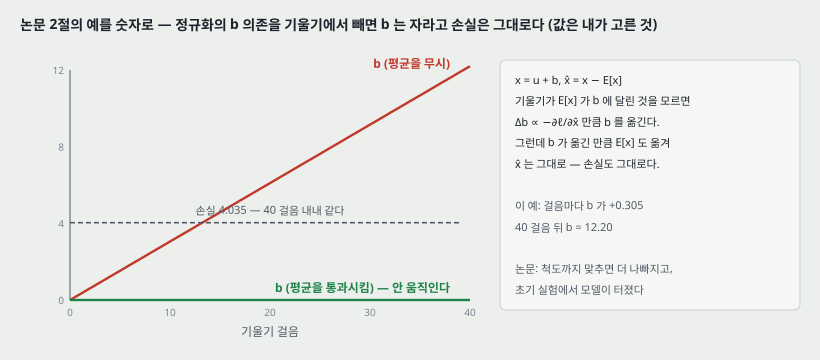

입력을 백색화하면 학습이 빨리 수렴한다는 것은 오래 알려져 있었다(LeCun 외 1998b, Wiesler & Ney 2011). 그러면 층마다 백색화하면 된다. 문제는 **어떻게 끼워 넣느냐**다.

논문의 예: 층이 입력 $u$ 에 학습되는 치우침 $b$ 를 더하고 학습 데이터 평균을 빼서 정규화한다 — $x = u + b$, $\hat{x} = x - \text{E}[x]$. 기울기 걸음이 **$\text{E}[x]$ 가 $b$ 에 달린 것을 모른다면** $b \leftarrow b + \Delta b$, $\Delta b \propto -\partial \ell / \partial \hat{x}$ 로 갱신한다. 그런데

$$u + (b + \Delta b) - \text{E}[u + (b + \Delta b)] = u + b - \text{E}[u + b]$$

라서 **층의 출력도 손실도 바뀌지 않는다.** 학습이 이어지는 동안 **$b$ 는 끝없이 자라고 손실은 그대로다.** 척도까지 맞추면 더 나빠지고, 논문은 **초기 실험에서 정규화 파라미터를 기울기 걸음 밖에서 계산하자 모델이 터졌다**고 적는다.

**숫자로 (값은 내가 고른 것).** 다섯 예시, 목표값의 평균 1.22, 학습률 0.05 로 40 걸음을 돌렸다.

| 기울기 | 40 걸음 뒤 $b$ | 손실 |
|---|---:|---|
| $\text{E}[x]$ 의 $b$ 의존을 무시 | 12.20 (걸음마다 +0.305) | 4.0350 → 4.0350 (변화 $7 \times 10^{-15}$) |
| 평균을 통과시켜 미분 | 0 (움직이지 않는다) | 4.0350 |

평균을 통과시키면 $\partial \ell / \partial b = \sum_i (\partial \ell / \partial \hat{x}_i)(1 - 1) = 0$ 이라 $b$ 가 움직일 이유가 없다. **그래서 논문은 정규화를 기울기가 아는 곳에 두기로 한다** — 어떤 파라미터 값에서든 망이 원하는 분포의 활성을 내게 하고, 그 의존을 역전파가 계산하게.

일반형으로는 $\hat{x} = \text{Norm}(x, \mathcal{X})$ 가 예시 $x$ 뿐 아니라 **학습 데이터 전체 $\mathcal{X}$** 에 달리므로, 역전파에 $\partial \text{Norm} / \partial x$ 와 $\partial \text{Norm} / \partial \mathcal{X}$ 둘이 필요하다. **뒤쪽을 무시하면 위의 폭주가 난다.**

**다른 길을 버린 이유 하나 더.** 예시 하나 안의 통계(또는 이미지에서 같은 자리의 여러 특징 지도)로 정규화하는 방법(Lyu & Simoncelli 2008)은 활성의 **절대 척도를 버려** 표현력을 바꾼다. 논문은 학습 데이터 전체의 통계에 대해 정규화해 정보를 지키고 싶다고 적는다.

---

## 6. 두 단순화 — 차원마다, 그리고 미니배치로 (논문 3절)

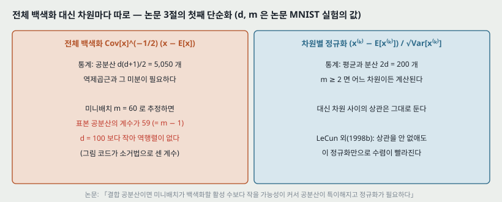

전체 백색화 $\text{Cov}[x]^{-1/2}(x - \text{E}[x])$ 는 공분산 행렬과 그 역제곱근, 그리고 그것들의 미분이 필요해 비싸다. 논문은 **필요한 단순화 둘**을 한다.

**첫째 — 성분마다 따로.** 층 입력 $x = (x^{(1)} \ldots x^{(d)})$ 의 각 차원을

$$\hat{x}^{(k)} = \frac{x^{(k)} - \text{E}[x^{(k)}]}{\sqrt{\text{Var}[x^{(k)}]}}$$

로 맞춘다. LeCun 외(1998b)가 보였듯 **상관을 없애지 않아도** 이 정규화만으로 수렴이 빨라진다.

**둘째 — 미니배치로 추정.** 전체 학습 데이터로 평균과 분산을 내는 것은 확률적 최적화에서 비현실적이다. 그래서 **미니배치마다** 평균과 분산을 추정하고, 그 통계가 역전파에 **온전히 참여**하게 한다.

**둘째가 첫째 덕에 된다.** 결합 공분산을 미니배치로 추정하면, 미니배치 크기가 백색화할 활성 수보다 작을 가능성이 커서 **공분산 행렬이 특이해진다.** 논문의 MNIST 설정(은닉 $d = 100$, 미니배치 $m = 60$)으로 그림 코드가 무작위 데이터의 표본 공분산을 만들고 소거법으로 계수를 셌다.

| | 전체 백색화 | 차원별 정규화 |
|---|---|---|
| 추정할 통계 | 공분산 $d(d+1)/2 = 5{,}050$ 개 | 평균 · 분산 $2d = 200$ 개 |
| $m = 60$ 에서 | 표본 공분산의 계수 **59** ($= m - 1$) < 100 → 역행렬이 없다 | $m \geq 2$ 면 어느 차원이든 계산된다 |
| 잃는 것 | — | 차원 사이의 상관은 그대로 남는다 |

---

## 7. $\gamma$ 와 $\beta$ — 정규화로 잃는 것을 되찾는다 (논문 3절)

입력을 그냥 정규화하면 층이 나타낼 수 있는 것이 바뀐다. 논문의 예: **시그모이드의 입력을 평균 0 · 분산 1 로 묶으면 비선형의 선형 구간에 갇힌다**(4절 표의 $\mathcal{N}(0, 1)$ 에서 $\lvert x \rvert < 1$ 이 68% 이고, 그 구간의 시그모이드는 거의 직선이다).

그래서 끼워 넣는 변환이 **항등 변환을 나타낼 수 있게** 한다. 활성마다 두 파라미터를 둔다.

$$y^{(k)} = \gamma^{(k)} \hat{x}^{(k)} + \beta^{(k)}$$

$\gamma^{(k)} = \sqrt{\text{Var}[x^{(k)}]}$, $\beta^{(k)} = \text{E}[x^{(k)}]$ 로 두면 원래 활성이 그대로 돌아온다 — **그것이 최적이라면.** 이 둘은 원래 파라미터와 함께 배운다.

---

## 8. 알고리즘 1 — 배치 정규화 변환

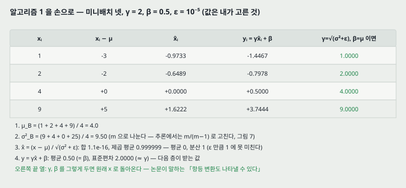

활성 하나 $x$ 와 미니배치 $\mathcal{B} = \{x_{1 \ldots m}\}$ 에 대해(첨자 $k$ 는 생략):

$$\mu_\mathcal{B} = \frac{1}{m} \sum_{i=1}^{m} x_i, \qquad \sigma_\mathcal{B}^2 = \frac{1}{m} \sum_{i=1}^{m} (x_i - \mu_\mathcal{B})^2 \qquad (1)$$

$$\hat{x}_i = \frac{x_i - \mu_\mathcal{B}}{\sqrt{\sigma_\mathcal{B}^2 + \epsilon}}, \qquad y_i = \gamma \hat{x}_i + \beta \equiv \text{BN}_{\gamma, \beta}(x_i) \qquad (2)$$

> 식 (1)(2) 의 번호는 이 노트가 붙인 것이다. 논문은 알고리즘 1 의 네 줄로 적고 번호를 달지 않는다.

**손으로 (값은 내가 고른 것).** $x = (1, 2, 4, 9)$, $\gamma = 2$, $\beta = 0.5$, $\epsilon = 10^{-5}$.

| $x_i$ | $x_i - \mu$ | $\hat{x}_i$ | $y_i = \gamma \hat{x}_i + \beta$ | $\gamma = \sqrt{\sigma^2 + \epsilon}$, $\beta = \mu$ 이면 |
|---:|---:|---:|---:|---:|
| 1 | −3 | −0.9733 | −1.4467 | 1.0000 |
| 2 | −2 | −0.6489 | −0.7978 | 2.0000 |
| 4 | 0 | 0.0000 | 0.5000 | 4.0000 |
| 9 | +5 | 1.6222 | 3.7444 | 9.0000 |

$\mu_\mathcal{B} = 16 / 4 = 4$, $\sigma_\mathcal{B}^2 = (9 + 4 + 0 + 25) / 4 = 9.5$ 다. $\hat{x}$ 는 합이 $1.1 \times 10^{-16}$(= 0), 제곱 평균이 0.999999 다 — $\epsilon$ 만큼 1 에 못 미친다. $y$ 는 평균 0.50(= $\beta$), 표준편차 2.0000(≈ $\gamma$) 이다. **마지막 열이 항등 변환의 회복이다.**

**논문이 짚는 것 둘.**

- $\hat{x}$ 는 변환 안에만 있지만 **그것이 있다는 것이 결정적**이다. 미니배치의 원소들이 같은 분포에서 뽑히고 $\epsilon$ 을 무시하면, 어느 $\hat{x}$ 든 기댓값 0 · 분산 1 이다($\sum_i \hat{x}_i = 0$, $\frac{1}{m}\sum_i \hat{x}_i^2 = 1$ 에 기댓값을 취하면 나온다). 그래서 $\hat{x}^{(k)}$ 를 **평균 · 분산이 고정된 입력을 받는 부분 망** $y^{(k)} = \gamma^{(k)} \hat{x}^{(k)} + \beta^{(k)}$ 의 입력으로 볼 수 있다.
- **$\text{BN}_{\gamma, \beta}(x)$ 는 예시 하나를 따로 처리하지 않는다.** 그 예시와 **같은 미니배치의 다른 예시들**에 함께 달려 있다(11절).

---

## 9. 역전파 — 정규화를 통과하는 기울기 (논문 3절)

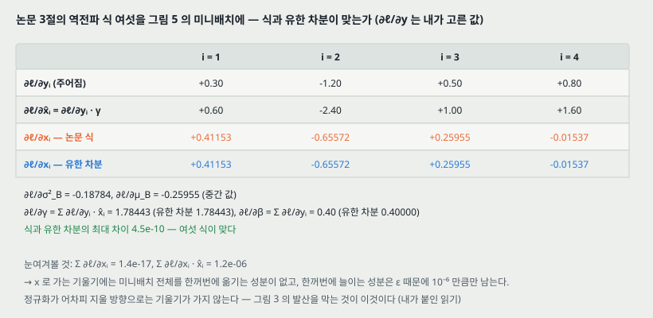

논문은 연쇄 법칙으로 여섯 식을 적는다.

$$\frac{\partial \ell}{\partial \hat{x}_i} = \frac{\partial \ell}{\partial y_i} \cdot \gamma, \qquad \frac{\partial \ell}{\partial \sigma_\mathcal{B}^2} = \sum_{i=1}^{m} \frac{\partial \ell}{\partial \hat{x}_i} (x_i - \mu_\mathcal{B}) \cdot \frac{-1}{2} (\sigma_\mathcal{B}^2 + \epsilon)^{-3/2} \qquad (3)$$

$$\frac{\partial \ell}{\partial \mu_\mathcal{B}} = \sum_{i=1}^{m} \frac{\partial \ell}{\partial \hat{x}_i} \cdot \frac{-1}{\sqrt{\sigma_\mathcal{B}^2 + \epsilon}} \qquad (4)$$

$$\frac{\partial \ell}{\partial x_i} = \frac{\partial \ell}{\partial \hat{x}_i} \cdot \frac{1}{\sqrt{\sigma_\mathcal{B}^2 + \epsilon}} + \frac{\partial \ell}{\partial \sigma_\mathcal{B}^2} \cdot \frac{2(x_i - \mu_\mathcal{B})}{m} + \frac{\partial \ell}{\partial \mu_\mathcal{B}} \cdot \frac{1}{m} \qquad (5)$$

$$\frac{\partial \ell}{\partial \gamma} = \sum_{i=1}^{m} \frac{\partial \ell}{\partial y_i} \hat{x}_i, \qquad \frac{\partial \ell}{\partial \beta} = \sum_{i=1}^{m} \frac{\partial \ell}{\partial y_i} \qquad (6)$$

**식 (5) 의 셋째 · 둘째 항이 5절의 폭주를 막는 자리다** — 평균과 분산이 $x_i$ 에 달린 몫을 기울기가 안다.

**맞춰 보기 (내가 붙인 것).** 8절의 미니배치에 $\partial \ell / \partial y = (0.3, -1.2, 0.5, 0.8)$ 을 주고, 식 (3)~(6) 과 **중심 유한 차분**($h = 10^{-6}$)을 비교했다.

| | $i = 1$ | $i = 2$ | $i = 3$ | $i = 4$ |
|---|---:|---:|---:|---:|
| $\partial \ell / \partial x_i$ 식 (5) | +0.41153 | −0.65572 | +0.25955 | −0.01537 |
| $\partial \ell / \partial x_i$ 유한 차분 | +0.41153 | −0.65572 | +0.25955 | −0.01537 |

$\partial \ell / \partial \gamma = 1.78443$, $\partial \ell / \partial \beta = 0.40$ 도 유한 차분과 같았고, **여섯 식 전체의 최대 차이가 $4.5 \times 10^{-10}$** 이다.

**눈여겨볼 것 (내가 붙인 읽기).** $\sum_i \partial \ell / \partial x_i = 1.4 \times 10^{-17}$, $\sum_i (\partial \ell / \partial x_i) \hat{x}_i = 1.2 \times 10^{-6}$ 이다. 곧 $x$ 로 가는 기울기에는 **미니배치 전체를 한꺼번에 옮기는 성분이 없고, 한꺼번에 늘이는 성분은 $\epsilon$ 때문에 $10^{-6}$ 만큼만 남는다.** 정규화가 어차피 지울 방향으로는 기울기가 가지 않는다.

---

## 10. 추론 — 모집단 통계로 얼린다 (논문 3.1절, 알고리즘 2)

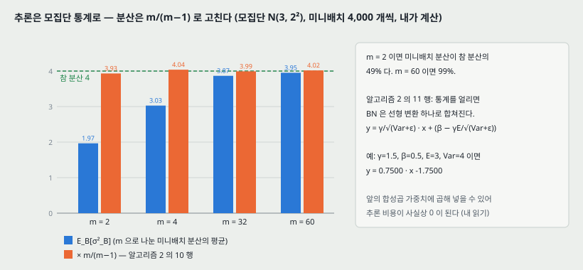

미니배치에 기대는 정규화는 학습에는 효율적이지만 **추론에서는 필요하지도 바람직하지도 않다** — 출력이 입력에만, 결정적으로 달려야 한다. 그래서 학습이 끝나면

$$\hat{x} = \frac{x - \text{E}[x]}{\sqrt{\text{Var}[x] + \epsilon}}, \qquad \text{Var}[x] = \frac{m}{m - 1} \cdot \text{E}_\mathcal{B}[\sigma_\mathcal{B}^2] \qquad (7)$$

로 바꾼다. $\text{E}[x] = \text{E}_\mathcal{B}[\mu_\mathcal{B}]$ 이고, 기댓값은 크기 $m$ 인 학습 미니배치들에 대해 취한다. **$\frac{m}{m-1}$ 은 불편 분산 보정**이다 — 식 (1) 이 $m$ 으로 나누기 때문이다. 이동 평균을 쓰면 학습 중에도 모델의 정확도를 추적할 수 있다고 적는다.

**숫자로 (내가 계산한 것).** 모집단 $\mathcal{N}(3, 2^2)$ 에서 미니배치 4,000 개씩 뽑았다.

| $m$ | $\text{E}_\mathcal{B}[\mu_\mathcal{B}]$ | $\text{E}_\mathcal{B}[\sigma_\mathcal{B}^2]$ | 참 분산 4 대비 | $\times \frac{m}{m-1}$ |
|---:|---:|---:|---:|---:|
| 2 | 3.034 | 1.966 | 49% | 3.932 |
| 4 | 2.992 | 3.029 | 76% | 4.038 |
| 32 | 3.007 | 3.866 | 97% | 3.991 |
| 60 | 3.007 | 3.952 | 99% | 4.019 |

$m = 2$ 에서는 보정하지 않으면 분산을 절반으로 본다. 논문의 $m = 32$ 에서는 보정 폭이 3%($32 / 31 = 1.032$) 다.

**선형 변환 하나로 합치기(알고리즘 2 의 11 행).** 통계가 고정되면 BN 은

$$y = \frac{\gamma}{\sqrt{\text{Var}[x] + \epsilon}} \cdot x + \left(\beta - \frac{\gamma \, \text{E}[x]}{\sqrt{\text{Var}[x] + \epsilon}}\right) \qquad (8)$$

다. 작은 예시로 $\gamma = 1.5$, $\beta = 0.5$, $\text{E}[x] = 3$, $\text{Var}[x] = 4$ 면 $y = 0.75 x - 1.75$ 다. 이 선형 변환은 앞의 합성곱 가중치에 곱해 넣을 수 있으므로 **추론 때 BN 의 비용이 사실상 없어진다** — 이 마지막 문장은 내 읽기이고, 논문은 「한 선형 변환으로 바꿀 수 있다」까지만 적는다.

**알고리즘 2 전체.** (1~5 행) 활성 $K$ 개를 골라 각각 BN 을 넣고 그 층이 BN 출력을 받게 한다. (6 행) $\Theta \cup \{\gamma^{(k)}, \beta^{(k)}\}$ 를 배운다. (7~12 행) 파라미터를 얼리고, 여러 학습 미니배치로 식 (7) 의 통계를 구해 식 (8) 로 바꾼다.

---

## 11. 같은 예시도 미니배치에 따라 다르다 — 정규화가 곧 잡음

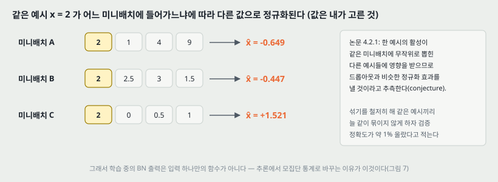

학습 모드의 BN 출력은 예시 하나의 함수가 아니다. 그림 코드로 $x = 2$ 를 세 미니배치에 넣었다(값은 내가 고른 것).

| 미니배치 | $\hat{x}$ ($x = 2$) |
|---|---:|
| A = (2, 1, 4, 9) | −0.649 |
| B = (2, 2.5, 3, 1.5) | −0.447 |
| C = (2, 0, 0.5, 1) | +1.521 |

같은 입력이 **부호까지** 바뀐다. 논문 4.2.1절은 이것 때문에 **BN 이 드롭아웃과 비슷한 정규화 효과를 낸다고 추측(conjecture)** 하고, **학습 데이터를 더 철저히 섞어** 같은 예시끼리 늘 같은 미니배치에 들어가지 않게 하자 검증 정확도가 **약 1%** 올랐다고 적는다 — 「예시를 볼 때마다 다르게 흔들 때 무작위성이 가장 이롭다」는 정규화 관점과 맞는다는 것이다.

---

## 12. 어디에 넣는가 — 비선형 앞, 치우침은 뺀다 (논문 3.2절)

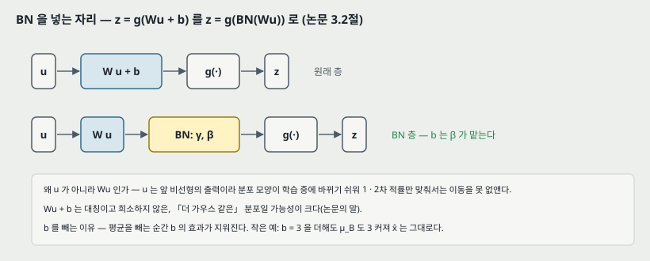

논문은 $z = g(Wu + b)$ 꼴의 층($g$ 는 시그모이드나 ReLU)에 집중한다. 완전연결과 합성곱 둘 다 이 꼴이다. **BN 을 비선형 바로 앞, $x = Wu + b$ 에 넣는다.**

- **왜 $u$ 가 아닌가.** $u$ 는 다른 비선형의 출력일 가능성이 커서 분포 **모양**이 학습 중에 바뀌기 쉽고, 1 · 2차 적률만 묶어서는 공변량 이동을 없애지 못한다. $Wu + b$ 는 대칭이고 희소하지 않은, 「더 가우스 같은」 분포일 가능성이 크다(Hyvärinen & Oja 2000 을 단다).
- **왜 $b$ 를 빼는가.** 평균을 빼는 순간 $b$ 의 효과가 지워진다 — 그 역할은 $\beta$ 가 맡는다. 작은 예시로, $b = 3$ 을 더하면 $\mu_\mathcal{B}$ 도 3 커져 $\hat{x}$ 는 그대로다.

그래서 $z = g(Wu + b)$ 를

$$z = g(\text{BN}(Wu)) \qquad (9)$$

로 바꾸고, $x = Wu$ 의 차원마다 $\gamma^{(k)}$, $\beta^{(k)}$ 한 쌍을 둔다.

> **결론 절이 붙이는 비교 하나.** Gülçehre & Bengio(2013)의 표준화 층은 비선형의 **출력**에 붙어 활성이 더 희소해진다. 논문은 **비선형 입력이 희소한 것을 BN 이 있든 없든 관찰하지 못했다**고 적는다.

---

## 13. 합성곱 층 — 특징 지도마다 하나 (논문 3.2절)

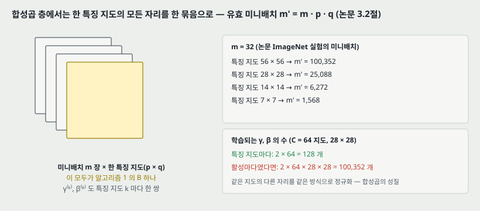

합성곱 층에서는 **같은 특징 지도의 다른 자리들을 같은 방식으로 정규화**하고 싶다(합성곱의 성질). 그래서 알고리즘 1 의 $\mathcal{B}$ 를 **한 특징 지도의 값 전부 — 미니배치의 모든 예시 × 모든 공간 자리** — 로 둔다. 미니배치 $m$, 특징 지도 $p \times q$ 면 유효 미니배치는

$$m' = \lvert \mathcal{B} \rvert = m \cdot p \, q \qquad (10)$$

이고, $\gamma^{(k)}$, $\beta^{(k)}$ 도 **활성마다가 아니라 특징 지도마다** 한 쌍이다. 알고리즘 2 도 같게 바뀌어, 추론 때 한 특징 지도의 모든 활성에 같은 선형 변환을 쓴다.

**숫자로 (그림 코드가 계산).** 논문 ImageNet 실험의 $m = 32$ 로:

| 특징 지도 | $m'$ |
|---|---:|
| 56 × 56 | 100,352 |
| 28 × 28 | 25,088 |
| 14 × 14 | 6,272 |
| 7 × 7 | 1,568 |

작은 지도에서도 통계를 내는 값이 1,568 개라 $m = 32$ 가 작아 보여도 통계는 안정된다. 파라미터로는, 특징 지도 64 개 · 28 × 28 에서 **특징 지도마다 128 개** 대 **활성마다였다면 100,352 개**다.

---

## 14. 왜 학습률을 올릴 수 있는가 (논문 3.3절)

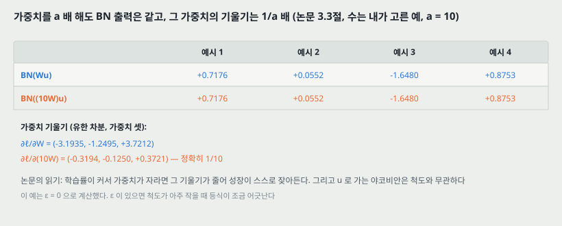

전통적인 깊은 망에서 학습률이 너무 크면 기울기가 폭발하거나 사라지고, 나쁜 국소 최소에 갇힌다. 논문은 BN 이 이것을 돕는 길을 셋 적는다.

1. **작은 파라미터 변화가 깊이를 따라 커지는 것을 막는다.** 예로 시그모이드가 포화하지 않는 구간에 머물기 쉬워진다(4절).
2. **파라미터 척도에 대한 내성.** 스칼라 $a$ 에 대해

$$\text{BN}(Wu) = \text{BN}((aW)u), \qquad \frac{\partial \, \text{BN}((aW)u)}{\partial u} = \frac{\partial \, \text{BN}(Wu)}{\partial u}, \qquad \frac{\partial \, \text{BN}((aW)u)}{\partial (aW)} = \frac{1}{a} \cdot \frac{\partial \, \text{BN}(Wu)}{\partial W} \qquad (11)$$

   이다. 척도는 층의 야코비안에도, 그래서 역전파에도 영향을 주지 않고, **가중치가 크면 그 기울기가 작아져** 파라미터 성장이 스스로 안정된다.

3. **(추측) 야코비안의 특이값이 1 에 가까워진다.** 정규화된 두 층 사이 $\hat{z} = F(\hat{x})$ 를 선형 $J\hat{x}$ 로 근사하고 $\hat{x}$, $\hat{z}$ 가 가우스이며 상관이 없다고 가정하면 $I = \text{Cov}[\hat{z}] = J \, \text{Cov}[\hat{x}] J^\mathsf{T} = JJ^\mathsf{T}$ 라 $J$ 가 직교이고 기울기 크기를 보존한다. **논문은 이 가정들이 실제로는 참이 아니라고 스스로 적고 「더 연구할 자리」로 남긴다.**

**맞춰 보기 (값은 내가 고른 것, $a = 10$, $\epsilon = 0$).** 3 차원 입력 네 예시에서 $\text{BN}(Wu)$ 와 $\text{BN}((10W)u)$ 가 네 자리 모두 (0.7176, 0.0552, −1.6480, 0.8753) 로 같았고, 가중치 기울기는 $(-3.1935, -1.2495, 3.7212)$ 대 $(-0.3194, -0.1250, 0.3721)$ 로 **정확히 1/10** 이었다. $\epsilon > 0$ 이면 척도가 아주 작을 때 등식이 조금 어긋난다.

---

## 15. 실험 1 — MNIST, 활성의 시간 변화 (논문 4.1절, 그림 1)

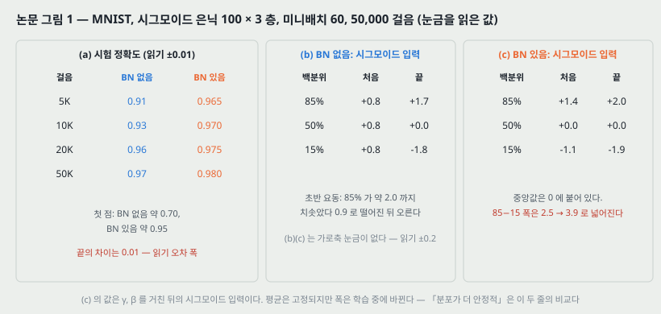

**설정.** 28 × 28 이진 이미지 → 완전연결 은닉 100 × 3 층(시그모이드, 작은 무작위 가우스 초기화) → 10 출력, 교차 엔트로피. 50,000 걸음, 미니배치 60. 은닉층마다 BN. 논문은 **MNIST 최고 성능이 목적이 아니라 BN 유무 비교가 목적**이라고 적는다.

**그림 1(a) — 시험 정확도(눈금 0.1, 읽기 ±0.01).**

| 걸음 | BN 없음 | BN 있음 |
|---:|---:|---:|
| 첫 점 | 약 0.70 | 약 0.95 |
| 5K | 0.91 | 0.965 |
| 10K | 0.93 | 0.970 |
| 20K | 0.96 | 0.975 |
| 50K | 0.97 | 0.980 |

**그림 1(b)(c) — 마지막 은닉층의 「전형적인」 시그모이드 입력 하나의 15 · 50 · 85 백분위(읽기 ±0.2, 가로축 눈금 없음).**

| | 백분위 | 처음 | 끝 |
|---|---|---:|---:|
| (b) BN 없음 | 85% | +0.8 | +1.7 |
| | 50% | +0.8 | 0.0 |
| | 15% | +0.8 | −1.8 |
| (c) BN 있음 | 85% | +1.4 | +2.0 |
| | 50% | 0.0 | 0.0 |
| | 15% | −1.1 | −1.9 |

**논문이 적은 것.** BN 없는 망의 분포는 **평균과 분산 모두** 시간에 따라 크게 바뀌어 뒤 층의 학습을 어렵게 하고, BN 망은 훨씬 안정적이다.

**내가 읽은 것 셋.**

1. (b) 의 큰 변화는 **초반**에 몰려 있다. 세 선이 약 0.8 한 점에서 출발해, 85% 선이 약 2.0 까지 치솟았다 0.9 로 떨어진 뒤 천천히 오른다.
2. (c) 에서 **중앙값은 0 에 붙어 있지만 폭은 바뀐다.** 85−15 폭이 2.5 에서 3.9 로 넓어진다. (c) 는 $\gamma$, $\beta$ 를 거친 뒤의 시그모이드 입력이므로, BN 이 고정하는 것($\hat{x}$ 의 평균 · 분산)을 그대로 보인 그림이 아니다.
3. **끝에서의 폭은 두 망이 비슷하다** — (b) 3.5 대 (c) 3.9. 「더 안정적」은 주로 **초반의 요동**과 **중앙값의 움직임**을 가리킨다.

(a) 의 끝 차이 0.01 은 읽기 오차 폭과 같아서, 이 노트는 **끝 정확도의 순서를 매기지 않는다.** 앞쪽 걸음에서의 차이(5K 에서 0.055)는 폭 밖이다.

---

## 16. 실험 2 — ImageNet, Inception 에 넣기 (논문 4.2절)

### 16.1 설정

Inception 변형(합성곱 · 풀링 여럿, ReLU, 맨 위 소프트맥스 말고는 완전연결 없음, 파라미터 $13.6 \times 10^6$). 대규모 분산 학습(Dean 외 2012) — 모델 복제본 10 개 × 각각 동시 걸음 5, 모멘텀 비동기 SGD, **미니배치 32**. 검증은 **한 장당 한 번 자르기의 top-1**(1,000 부류). BN 은 **모든 비선형의 입력에, 합성곱 방식으로**(13절) 넣고 나머지 구조는 그대로 둔다.

### 16.2 BN-x5 에 함께 들어간 일곱 가지 (4.2.1절)

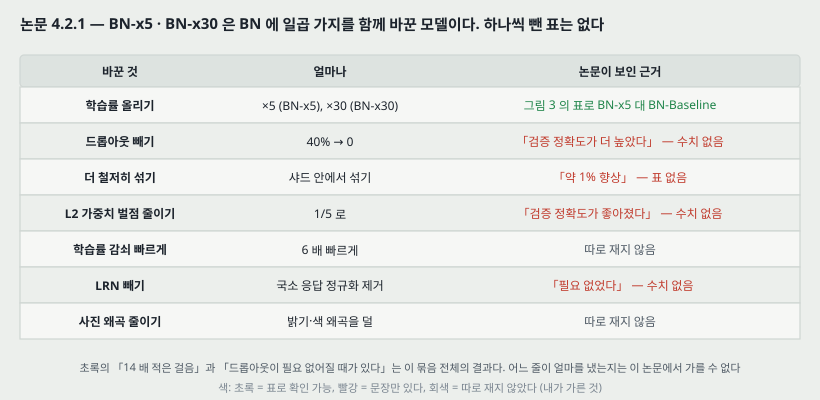

논문은 「BN 을 넣기만 해서는 방법의 이점을 다 쓰지 못한다」며 다음을 함께 바꿨다.

| 바꾼 것 | 얼마나 | 논문이 보인 근거 |
|---|---|---|
| 학습률 올리기 | ×5 (BN-x5), ×30 (BN-x30) | 그림 3 의 표로 BN-x5 대 BN-Baseline 비교 가능 |
| 드롭아웃 빼기 | 40% → 0 | 「검증 정확도가 더 높았다」 — 수치 없음 |
| 더 철저히 섞기 | 샤드 안에서 섞기 | 「약 1% 향상」 — 표 없음 |
| L2 가중치 벌점 줄이기 | 1/5 로 | 「검증 정확도가 좋아졌다」 — 수치 없음 |
| 학습률 감쇠 빠르게 | 6 배 빠르게 | 따로 재지 않음 |
| LRN 빼기 | 제거 | 「BN 이 있으면 필요 없었다」 — 수치 없음 |
| 사진 왜곡 줄이기 | 덜 | 따로 재지 않음 — 「빨리 배워 각 예시를 덜 보므로 더 진짜 같은 사진에 집중」 |

### 16.3 결과 — 논문 그림 3 의 표

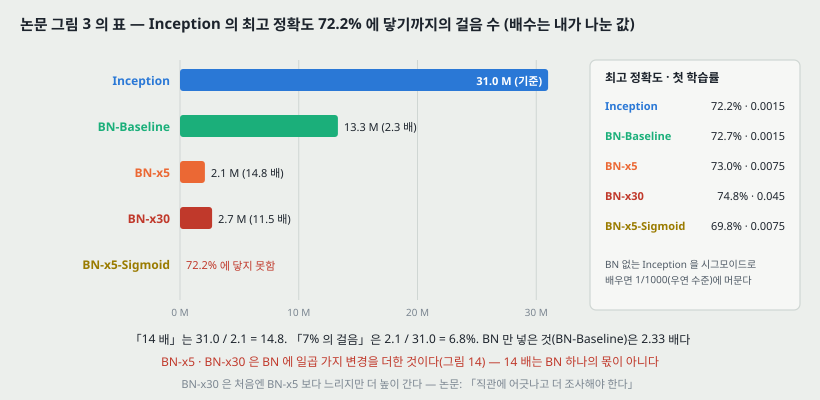

| 모델 | 첫 학습률 | 72.2% 까지 걸음 | 배수 (31.0 / 걸음) | 최고 정확도 |
|---|---:|---:|---:|---:|
| Inception | 0.0015 | $31.0 \times 10^6$ | 1.00 | 72.2% |
| BN-Baseline | 0.0015 | $13.3 \times 10^6$ | 2.33 | 72.7% |
| BN-x5 | 0.0075 | $2.1 \times 10^6$ | 14.76 | 73.0% |
| BN-x30 | 0.045 | $2.7 \times 10^6$ | 11.48 | 74.8% |
| BN-x5-Sigmoid | 0.0075 | 닿지 못함 | — | 69.8% |

배수 열은 내가 나눈 값이다. **초록의 「14 배 적은 걸음」은 31.0 / 2.1 = 14.8, 서론의 「7% 의 걸음」은 2.1 / 31.0 = 6.8%** 다. BN-x30 은 74.8% 에 $6 \times 10^6$ 걸음에 닿아 **Inception 이 72.2% 에 닿은 걸음의 1/5.17** 이다.

**논문이 함께 적는 것.**

- **같은 ×5 학습률을 원래 Inception 에 쓰면 파라미터가 기계 무한대에 닿았다.**
- **원래 Inception 을 시그모이드로 배우면 우연 수준(1/1000)에 머물렀다.** BN-x5-Sigmoid 는 69.8%.
- **BN-x30 은 처음엔 BN-x5 보다 느리지만 더 높은 최종 정확도에 닿는다.** 논문은 「직관에 어긋나고 더 조사해야 한다」고 적는다.

**그림 2 의 곡선(300 dpi 로 읽음, 가로 눈금 5M, 세로 눈금 0.1).** BN-x30 곡선은 약 6.7M 걸음에서 0.747 근처로 끝난다. BN-Baseline 은 약 16.5M, BN-x5-Sigmoid 는 약 7.8M 에서 0.695 로 끝난다. **BN-x5 의 점선은 약 2M 걸음, 0.72 근처에서 끊겨 보인다** — 표의 최고 정확도 73.0% 에 닿는 부분이 그림에서 보이지 않는다.

---

## 17. 실험 3 — 앙상블 (논문 4.2.3절, 그림 4)

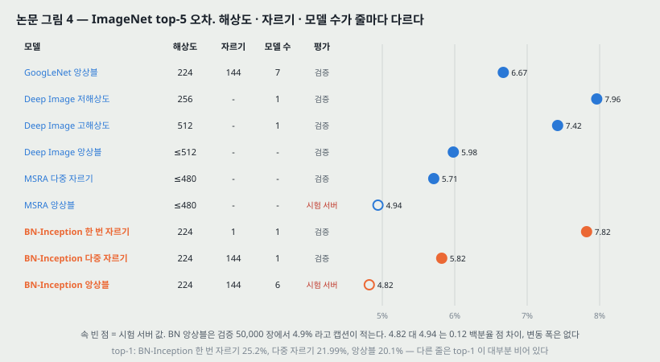

앙상블은 **BN-x30 을 바탕으로 한 망 여섯**이고, 각각 다음 가운데 몇을 바꿨다: 합성곱 층의 초기 가중치를 키움, **드롭아웃을 씀(확률 5% 또는 10%, 원래 Inception 은 40%)**, 마지막 은닉층들에 비합성곱 BN. 각 망은 약 $6 \times 10^6$ 걸음에서 최고 정확도에 닿았다. 예측은 클래스 확률의 산술 평균이고, 다중 자르기 세부는 GoogLeNet 과 비슷하다.

| 모델 | 해상도 | 자르기 | 모델 수 | top-1 | top-5 |
|---|---|---:|---:|---:|---:|
| GoogLeNet 앙상블 | 224 | 144 | 7 | - | 6.67% |
| Deep Image 저해상도 | 256 | - | 1 | - | 7.96% |
| Deep Image 고해상도 | 512 | - | 1 | 24.88 | 7.42% |
| Deep Image 앙상블 | 최대 512 | - | - | - | 5.98% |
| MSRA 다중 자르기 | 최대 480 | - | - | - | 5.71% |
| MSRA 앙상블 | 최대 480 | - | - | - | 4.94%* |
| BN-Inception 한 번 자르기 | 224 | 1 | 1 | 25.2% | 7.82% |
| BN-Inception 다중 자르기 | 224 | 144 | 1 | 21.99% | 5.82% |
| BN-Inception 앙상블 | 224 | 144 | 6 | 20.1% | 4.82%* |

\* 는 **시험 서버**에서 잰 시험 집합 값이고, 나머지는 검증 집합 50,000 장의 값이다. 캡션은 BN 앙상블이 **검증 집합에서는 4.9%** 라고 적는다.

**읽는 법.** BN 앙상블 4.82% 는 MSRA 앙상블 4.94% 보다 **0.12 백분율 점** 낮다(둘 다 시험 서버). 논문은 이것으로 이전 최고를 넘었고 **Russakovsky 외가 추정한 사람 평가자의 정확도를 넘었다**고 적는다(사람 수치는 이 논문 안에 적혀 있지 않다). 변동 폭은 없다. 줄마다 **해상도(224 대 최대 480 · 512) · 자르기 수 · 모델 수가 달라** 방법만의 차이로 읽을 수 있는 쌍은 표 안에 없다.

---

## 18. 이 논문이 스스로 적은 한계와 조건

1. **$\hat{x}$ 들의 결합 분포는 학습 중에 바뀔 수 있다**(3절). BN 은 성분마다 평균 · 분산만 고정한다.
2. **미니배치 크기 $m > 1$ 이 필요하다**(3.1절). $m = 1$ 이면 분산이 0 이다.
3. **야코비안 특이값 추측의 가정은 실제로 참이 아니다**(3.3절). 「더 연구할 자리」.
4. **BN-x30 이 처음엔 느리고 끝엔 높은 것은 직관에 어긋나고 조사가 필요하다**(4.2.2절).
5. **드롭아웃을 대신하는 정규화 효과는 추측이다**(4.2.1절), 그리고 결론이 그 정규화 성질을 「더 연구해야 한다」고 적는다.
6. **앞으로의 일**(5절): RNN 에 쓰기(내부 공변량 이동과 기울기 폭발 · 소실이 특히 심할 것이고, 정규화가 기울기 전파를 좋게 한다는 가설을 더 철저히 시험할 수 있다), **전통적 의미의 도메인 적응** — 새 데이터 분포에 **모집단 평균과 분산만 다시 계산해** 일반화할 수 있는지, 그리고 이론 분석.

---

## 19. 논문이 적지 않은 것 — 내가 읽으며 짚은 자리

**하나. 제목의 「내부 공변량 이동을 줄여서」는 잰 것이 아니라 설명이다.** 이동을 수치로 보인 자리는 그림 1(b)(c) 의 **MNIST 활성 하나의 백분위 셋**뿐이다. 이동의 크기를 재는 지표(예: 걸음 사이 분포 거리)도, 그 크기와 학습 속도의 관계도 없다. 그리고 그 한 그림에서도 BN 쪽 폭이 2.5 → 3.9 로 넓어진다(15절). 논문 스스로도 효과의 원인을 셋 이상 댄다 — 이동 감소(제목), 파라미터 척도 불변(3.3절), 미니배치 잡음의 정규화(4.2.1절). **셋의 몫을 가르는 실험이 없다.**

**둘. 「14 배」는 BN 하나의 몫이 아니다.** BN-x5 는 BN 에 일곱 가지 변경을 더한 모델이다(16.2절). BN 만 넣은 비교는 BN-Baseline 의 **2.33 배**뿐이고, 일곱 가지 가운데 하나씩 뺀 표가 없다. 초록은 「14 배」를 「BN 이 달성한다」고 적는다.

**셋. 「드롭아웃이 필요 없다」에는 수치가 없고, 앙상블은 드롭아웃을 다시 쓴다.** 4.2.1절은 드롭아웃을 빼자 검증 정확도가 높아졌다고 문장으로만 적고, 17절의 앙상블 망들은 5~10% 드롭아웃을 쓴다. 초록의 「어떤 경우에는 드롭아웃이 필요 없어진다」는 이 둘을 함께 놓고 읽어야 한다.

**넷. 변동 폭이 한 곳도 없다.** 그림 1 · 2 · 3 · 4 가 모두 한 번의 실행이다. 그림 3 의 73.0% 대 72.7%, 그림 4 의 4.82% 대 4.94% 처럼 차이가 작은 자리는 순서를 매길 근거가 본문 안에 없다.

**다섯. MNIST 그림의 가로축.** 그림 1(b)(c) 에 걸음 눈금이 없어 (a) 의 어느 걸음과 맞춰 읽어야 하는지 모른다. 50,000 걸음 전체라고 보는 것이 자연스럽지만 적혀 있지 않다.

**여섯. $\epsilon$ 의 값, 이동 평균의 계수, 모집단 통계에 쓴 미니배치 수가 없다.** 추론 결과를 다시 내는 데 필요한 세 숫자다.

**일곱. 그림 2 의 BN-x5 곡선이 약 2M 걸음에서 끊겨 보인다**(16.3절). 표의 최고 정확도 73.0% 가 그림에서 확인되지 않는다.

---

## 20. 읽을 때 헷갈리는 지점

**학습 모드와 추론 모드가 다른 함수다.** 학습 때는 미니배치 통계(식 1)로, 추론 때는 얼린 모집단 통계(식 7)로 정규화한다. 같은 입력이 두 모드에서 다른 출력을 낸다. **미리 배운 망으로 특징을 뽑을 때 추론 모드로 두지 않으면** 한 이미지의 특징이 같은 묶음의 다른 이미지에 달린다(11절).

**분산은 두 번 다르게 나눈다.** 알고리즘 1 은 $m$ 으로 나누고(편향), 알고리즘 2 는 $\frac{m}{m-1}$ 을 곱해 불편 추정으로 고친다. $m = 2$ 에서는 두 배 차이다(10절).

**$\gamma$, $\beta$ 가 있으면 다음 층이 받는 값은 평균 0 · 분산 1 이 아니다.** 고정되는 것은 $\hat{x}$ 이고, $y$ 의 평균 · 분산은 $\beta$, $\gamma$ 가 배우는 대로 움직인다. 그림 1(c) 의 폭이 넓어지는 것이 이것이다.

**BN 뒤의 치우침은 없다.** $z = g(\text{BN}(Wu))$ — $b$ 는 $\beta$ 에 흡수된다. BN 앞 층에 $b$ 를 남겨 두면 학습되지만 아무 효과가 없다.

**합성곱에서는 「미니배치」가 $m$ 이 아니라 $m \cdot pq$ 다**(13절). 그리고 $\gamma$, $\beta$ 는 특징 지도 수만큼이다.

**「14 배」와 「7%」는 같은 숫자다.** $31.0 / 2.1 = 14.8$ 이고 $2.1 / 31.0 = 6.8\%$ 다. 둘 다 BN-x5(BN + 일곱 가지)의 값이다.

**원문의 오기 하나.** 4.2.2절이 시그모이드를 $g(t) = \frac{1}{1 + \exp(-x)}$ 라고 적는다(변수 $t$ 와 $x$ 가 섞였다).

---

## 21. AlexNet(2012)과 맞춰 보기

AlexNet 노트에서 읽은 장치 셋이 이 논문에서 어떻게 되는지를 적는다.

| AlexNet 의 장치 | AlexNet 에서 | 이 논문에서 |
|---|---|---|
| ReLU | 포화하는 tanh 대신 — 학습을 빠르게 | Inception 은 ReLU 그대로. **BN 이 있으면 시그모이드도 69.8% 까지 배워진다**(BN 없으면 1/1000) |
| LRN | 이웃 채널끼리 나누는 정규화, 상수 넷을 검증으로 고름 | **BN-Inception 에서 뺐다** — 「BN 이 있으면 필요 없었다」, 수치 없음 |
| 드롭아웃 | 과적합을 막는 주 장치 | 단일 망에서는 뺐다(40% → 0), 앙상블에서는 5~10% 로 다시 씀 |
| 데이터 늘리기 | 자르기 · 뒤집기 · 색 변환 | 사진 왜곡을 **줄였다** — 빨리 배워 예시를 덜 보므로 |
| 정규화의 단위 | LRN: **한 예시 안**, 한 자리의 이웃 채널 | BN: **미니배치 전체**, 한 특징 지도의 모든 자리 |

**LRN 과 BN 은 정규화하는 축이 다르다.** LRN 은 예시 하나 안에서 채널끼리 나누고(5절의 Lyu & Simoncelli 계열), BN 은 예시들 사이에서 같은 채널을 모은다. 논문 2절이 예시 하나의 통계로 정규화하면 **절대 척도를 버린다**고 적는 것이 LRN 쪽 방식을 두고 하는 말로 읽힌다 — 논문은 LRN 을 그 문장에서 이름 짓지는 않는다.

---

## 22. 계보와 내가 가져갈 것

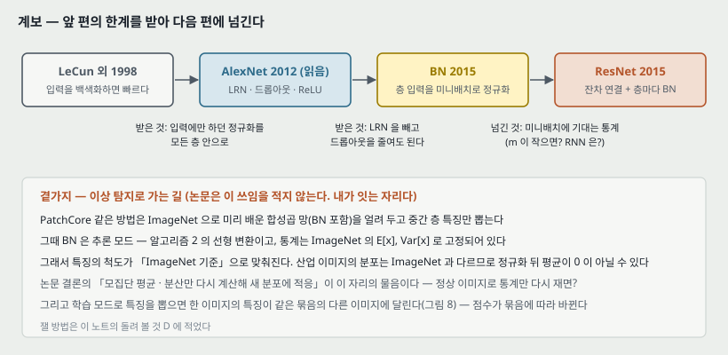

**하나. 앞에서 받은 것.** 입력을 백색화하면 빨리 배운다(LeCun 외 1998b)는 것은 **입력층에만** 하던 일이다. 이 논문은 그것을 **모든 층 안으로**, 그것도 역전파가 통과하는 꼴로 옮겼다. 그리고 로드맵이 계속 붙들고 온 물음 — 역전파 노트의 층마다 10~12 배 기울기 감쇠, DBN · AE 의 사전학습, AlexNet 의 ReLU — 에 **초기화나 활성 함수가 아니라 층 사이의 정규화**로 답한 편이다.

**둘. 다음으로 넘기는 것.** 통계를 **미니배치**에 기댄다. 그래서 (가) $m$ 이 작으면 통계가 흔들리고(10절의 $m = 2$ 에서 분산을 절반으로 본다), (나) 순서가 있는 RNN 에는 그대로 쓰기 어렵다(논문이 앞으로의 일로 적는다), (다) 학습과 추론이 다른 함수다. 같은 해의 ResNet 은 합성곱마다 BN 을 붙여 150 층 넘는 망을 배운다 — BN 이 깊은 망의 기본 부품이 되는 자리다.

**셋. 이상 탐지로 가는 곁가지 — 논문은 이 쓰임을 적지 않는다. 내가 잇는 자리다.** PatchCore 같은 방법은 ImageNet 으로 미리 배운 합성곱 망(BN 포함)을 **얼려 두고** 중간 층 특징만 뽑는다.

- **가져갈 것**: 그때 BN 은 **추론 모드** — 식 (8) 의 선형 변환이고, $\text{E}[x]$, $\text{Var}[x]$ 는 **ImageNet 의 통계로 고정**되어 있다. 곧 뽑힌 특징의 척도가 「ImageNet 기준」으로 맞춰져 있다. 산업 이미지는 분포가 달라 정규화 뒤 평균이 0 이 아닐 수 있다.
- **논문 결론과 닿는 물음**: 결론은 「새 데이터 분포에 **모집단 평균과 분산만 다시 계산해** 일반화할 수 있는지」를 앞으로의 일로 적는다. 이상 탐지에서는 **정상 이미지로 BN 통계만 다시 재면** 특징 거리 기반 점수가 나아지는지가 같은 물음이다.
- **조심할 것**: 특징을 뽑을 때 망을 학습 모드로 두면, 한 이미지의 특징이 **같은 묶음의 다른 이미지에 달린다**(11절, 같은 입력의 $\hat{x}$ 가 −0.649 에서 +1.521 까지 바뀌었다). 이상 점수가 묶음 구성에 따라 바뀐다.

> 셋째 문단은 내가 읽고 이은 것이고 이 논문이 측정한 것이 아니다. 24절에 잴 방법을 적어 둔다.

---

## 23. 다음에 읽을 것

**한계를 적고 그 한계를 푼 것이 다음 논문이다.**

| 다음 | 이 노트의 어느 자리에서 나오는가 | 무엇을 확인하고 싶은가 |
|---|---|---|
| **ResNet** — Deep Residual Learning for Image Recognition (CVPR 2016) | 22절 둘 — 합성곱마다 BN 을 붙인 가장 깊은 망 | BN 이 있는데도 깊은 망이 안 배워지는 자리가 남는가. 잔차 연결이 그 자리를 어떻게 메우는가 |
| **BN 이 정말 내부 공변량 이동을 줄여서 돕는가를 잰 편** (Santurkar 외 2018, 「How Does Batch Normalization Help Optimization?」 — **제목만 알고 읽지 않았다**) | 19절 하나 — 이동을 잰 지표가 없고 효과의 원인 셋이 갈리지 않는다 | 이동을 일부러 키워도 BN 이 여전히 돕는가 |
| **미니배치에 기대지 않는 정규화** (층 정규화 · 그룹 정규화 계열) | 18절 둘 · 22절 둘 — $m$ 이 작거나 RNN 일 때 | 통계를 예시 하나 안에서 내면서도 2절이 걱정한 「절대 척도를 버리는」 문제를 어떻게 피하는가. 로드맵의 RNN 칸과도 닿는다 |

읽는 순서로는 **첫째가 먼저**다. 이 논문의 BN 이 부품으로 들어가는 편이다.

---

## 24. 돌려 볼 것

노트를 쓰며 나온 물음 중 **직접 잴 수 있는 것 넷**이다. **아직 실험 폴더를 만들지 않았고 돌리지 않았다.** 돌리게 되면 질문과 가설을 먼저 적는 규칙대로 폴더를 만든다.

| 무엇 | 이 노트의 어느 자리 | 묻는 것 |
|---|---|---|
| A | 15절 · 19절 하나 | 논문의 MNIST 설정(시그모이드 100 × 3, 미니배치 60, 50,000 걸음)을 **seed 셋**으로 다시 돌려 그림 1(a) 의 끝 차이가 변동 폭 밖인가. 그리고 **걸음 사이 활성 분포의 거리**(예: 백분위 이동의 합)를 지표로 정해 BN 유무로 잰다 |
| B | 19절 둘 | CIFAR-10 크기의 작은 합성곱 망에서 **BN 만** 넣은 것과 **BN + 학습률 ×5** · **BN + 드롭아웃 제거**를 따로 돌려, 「같은 정확도까지의 걸음」이 각각 몇 배인가 |
| C | 10절 · 20절 | 미니배치 크기 2 · 4 · 8 · 32 로 BN 망을 배우고 추론 모드 정확도를 잰다. $\frac{m}{m-1}$ 보정을 끄면 몇이 달라지는가 |
| D | 22절 셋 | ImageNet 으로 미리 배운 WideResNet-50 으로 MVTec 한 부류의 특징을 뽑아 최근접 거리 점수의 AUROC 를 잰다 — (가) ImageNet BN 통계 그대로 (나) **정상 학습 이미지로 BN 통계만 다시 잰 것** (다) 학습 모드로 뽑은 것(묶음 크기 둘) |

---

## 25. 물어 두는 것

- **$\epsilon$ 은 얼마였는가.** 본문에 값이 없다.
- **모집단 통계를 몇 개의 미니배치로 냈는가, 이동 평균이었다면 계수는.** 3.1절은 「이동 평균을 쓰면 학습 중 정확도를 추적할 수 있다」까지만 적는다.
- **그림 1(b)(c) 의 가로축은 (a) 와 같은 50,000 걸음인가.** 그리고 「전형적인」 활성을 어떻게 골랐는가.
- **BN-x5 의 최고 정확도 73.0% 는 몇 걸음에서 나왔는가.** 표 캡션은 「최고 정확도에 닿은 걸음 수」도 보인다고 적는데 표에 그 열이 없다.
- **「약 1% 향상」(섞기)은 어느 모델의 어느 걸음에서 잰 것인가.**

---

## 26. 참고 문헌

이 노트가 부른 편만 적는다. 원리는 원 출처를, 구현은 그 라이브러리의 편을 적는 규칙을 따른다. 이 노트는 라이브러리를 부르지 않았다(그림 코드는 파이썬 표준 라이브러리만 쓴다).

- Ioffe, S. and Szegedy, C. (2015). Batch normalization: Accelerating deep network training by reducing internal covariate shift. **ICML**, JMLR W&CP 37. — 이 노트의 대상.
- Shimodaira, H. (2000). Improving predictive inference under covariate shift by weighting the log-likelihood function. **J. Statistical Planning and Inference**, 90(2):227–244. — 공변량 이동의 원 출처.
- LeCun, Y., Bottou, L., Orr, G., and Müller, K. (1998b). Efficient backprop. In Neural Networks: Tricks of the Trade. Springer. — 입력 백색화 · 차원별 정규화가 수렴을 빠르게 한다는 근거.
- Lyu, S. and Simoncelli, E. P. (2008). Nonlinear image representation using divisive normalization. **CVPR**. — 예시 하나의 통계로 정규화하는 방법.
- Nair, V. and Hinton, G. E. (2010). Rectified linear units improve restricted Boltzmann machines. **ICML**. — ReLU.
- Bengio, Y. and Glorot, X. (2010). Understanding the difficulty of training deep feedforward neural networks. **AISTATS**. — 조심스러운 초기화(논문은 저자 순서를 이렇게 적는다).
- Saxe, A. M., McClelland, J. L., and Ganguli, S. (2013). Exact solutions to the nonlinear dynamics of learning in deep linear neural networks. arXiv:1312.6120. — 야코비안 특이값 1 의 이점.
- Srivastava, N., Hinton, G., Krizhevsky, A., Sutskever, I., and Salakhutdinov, R. (2014). Dropout. **JMLR**, 15(1):1929–1958. — 드롭아웃.
- Szegedy, C. 외 (2014). Going deeper with convolutions. arXiv:1409.4842. — Inception / GoogLeNet.
- Gülçehre, Ç. and Bengio, Y. (2013). Knowledge matters: Importance of prior information for optimization. arXiv:1301.4083. — 표준화 층.
- He, K., Zhang, X., Ren, S., and Sun, J. (2015). Delving deep into rectifiers. arXiv. — 그림 4 의 MSRA 줄.
- Krizhevsky, A., Sutskever, I., and Hinton, G. E. (2012). ImageNet classification with deep convolutional neural networks. NIPS. — 21절의 비교 상대. **이 논문의 참고 문헌에는 없다.**
- Santurkar, S. 외 (2018). How does batch normalization help optimization? — 23절의 다음 읽을 것. **읽지 않았다. 이 논문의 참고 문헌에도 없다(뒤에 나온 편이다).**

---

## 27. 경로

| 무엇 | 어디 |
|---|---|
| 원문 PDF | `papers/ICML15_BN_Batch_Normalization_Accelerating_Deep_Network_Training_by_Reducing_Internal_Covariate_Shift.pdf` |
| 이 노트 | `notes/ICML15_BN_Batch_Normalization_Accelerating_Deep_Network_Training_by_Reducing_Internal_Covariate_Shift.md` |
| 이 노트의 그림 | `figures/ICML15_BN/fig01_covariate_shift.svg` 부터 `fig16_lineage.svg` 까지 열여섯 |
| 그림을 만드는 코드 | `figures/ICML15_BN/make_figures.py` — 바깥 데이터를 읽지 않으므로 `python make_figures.py` 로 어디서나 다시 만든다. 1~10 · 13 · 15 번 그림의 수는 이 파일이 계산해 화면에도 찍는다 |
