# DBN — A fast learning algorithm for deep belief nets

> **한 줄.** 깊은 망을 한 번에 배우지 않고 **한 층씩 배워 얼리고 그 위에 또 한 층을 얹는다.** 그것이 되게 만드는 장치가 **상보 사전분포**이고, 그 장치 덕에 한 층을 배우는 일이 **RBM 하나를 배우는 일**로 줄어든다.

---

## Paper Metadata

| 항목 | 내용 |
|---|---|
| 원제목 | A fast learning algorithm for deep belief nets |
| 저자 | Geoffrey E. Hinton, Simon Osindero (University of Toronto), Yee-Whye Teh (National University of Singapore) |
| 게재처 | Neural Computation, 2006 |
| 원문 | https://www.cs.toronto.edu/~hinton/absps/fastnc.pdf |
| 코드 | 본문에 저장소 주소가 적혀 있지 않다. 부록 B 에 Matlab 꼴 의사코드가 있다 |
| 저장한 PDF | `papers/NC06_DBN_A_Fast_Learning_Algorithm_for_Deep_Belief_Nets.pdf` |
| 왜 읽었는가 | 역전파 노트를 쓰며 남긴 한계 하나 — **로지스틱의 기울기 최댓값 0.25 가 층마다 곱해져 깊어지면 아래층이 안 배워진다** — 를 그대로 받는 편이다 |
| 읽은 범위 | **2026-09-20 에 읽었다.** 초록 · 1 서론 · 2 상보 사전분포 · 3 RBM 과 대조 발산 · 4 탐욕 학습 · 5 위-아래 알고리즘 · 6 MNIST · 7 생성 · 8 결론 · 표 1 · 부록 A. **미독: 부록 B 의 의사코드를 줄 단위로 따라가지는 않았다**(무엇을 하는 코드인지까지만 읽었다). 읽지 않은 절의 수치는 이 노트에 옮기지 않는다 |

---

## 1. 용어

이 노트에서 쓸 이름을 먼저 정한다. 논문의 원래 용어는 괄호로 함께 적는다.

- **믿음망 (belief net)**: 확률변수를 점으로, 「누가 누구를 만드는가」를 화살표로 적은 그림. 화살표가 한 방향이면 **방향 있는 믿음망**이다. 작은 예시로, 지진 → 집 흔들림 은 지진이 집 흔들림의 확률을 정한다는 뜻이다.
- **보이는 층 (visible layer)** / **숨은 층 (hidden layer)**: 데이터가 놓이는 층과 그렇지 않은 층. 이 논문은 **28 x 28 = 784 픽셀**이 보이는 층이고 그 위 세 층이 숨은 층이다.
- **생성 (generation)**: 위층 상태에서 아래층을 만들어 내려오는 것. **추론 (inference)**: 데이터를 보고 숨은 층이 무엇이었을지 거슬러 올라가는 것. **이 논문에서 어려운 쪽은 추론이다.**
- **설명해치우기 (explaining away)**: 관찰을 보고 나면 원래 무관하던 숨은 원인들이 서로 묶이는 현상. 작은 예시로, 집이 흔들린 것을 보면 지진이 켜졌을 때 트럭은 꺼지는 쪽으로 기운다.
- **곱꼴 사후분포 (factorial posterior)**: 데이터를 봤을 때의 숨은 층 분포가 **유닛마다의 확률을 곱한 것**으로 적히는 경우. 곧 $P(h_1,h_2,h_3 \mid v) = P(h_1\mid v)P(h_2\mid v)P(h_3\mid v)$ 다. 작은 예시로, 유닛이 20 개일 때 곱꼴이면 20 개의 수만 정하면 되고 아니면 $2^{20}$ 가지 조합을 봐야 한다.
- **상보 사전분포 (complementary prior)**: 가능도가 만드는 상관을 **정확히 반대로 만드는** 사전분포. 둘을 곱하면 상관이 지워져 사후분포가 곱꼴이 된다.
- **제한 볼츠만 기계 (RBM, restricted Boltzmann machine)**: 보이는 층과 숨은 층이 **방향 없는** 연결로 이어지고 **층 안에는 연결이 없는** 망. 층 안 연결이 없다는 것이 「제한」의 뜻이고, 그래서 한 층을 보면 다른 층의 유닛들이 서로 독립이다.
- **대조 발산 (contrastive divergence, CD)**: RBM 을 배울 때 평형까지 가지 않고 **기브스 표집 n 걸음에서 끊는** 방법. 이 논문의 MNIST 실험은 처음에 $n=1$ 로 쓴다.
- **탐욕 층별 학습 (greedy layer-wise learning)**: 아래층부터 한 층씩 배우고 얼려 올라가는 절차. 이 논문의 이름값이 여기 있다.
- **연상 기억 (associative memory)**: 이 논문에서 **맨 위 두 층**을 가리킨다. 방향이 없고 그 안에서 기브스 표집을 돈다.
- **위-아래 알고리즘 (up-down algorithm)**: 탐욕 학습이 끝난 뒤 **먼저 배운 아래층을 다시 맞추는** 미세조정 절차. 깨어-잠 알고리즘의 변형이다.
- **순열 불변 (permutation-invariant)**: 픽셀 순서를 모르는 조건. 픽셀을 아무렇게나 섞어 놓아도 결과가 같아야 한다는 뜻이고, 합성곱 망처럼 이웃 픽셀 관계를 쓰는 방법과 **같은 칸에 놓지 않기 위한** 구분이다.

---

## 2. 한 문단 요약

깊고 촘촘한 방향 있는 믿음망은 **데이터를 보고 숨은 층을 거슬러 올라가는 일(추론)** 이 어렵다. 설명해치우기 때문에 숨은 변수들이 얽혀 사후분포가 곱꼴이 아니기 때문이다. 이 논문은 얽힘을 근사로 견디는 대신 **아예 없앤다** — 위층들이 **상보 사전분포**를 만들도록 가중치를 묶어 두면 사후분포가 정확히 곱꼴이 된다. 그렇게 묶인 무한 스택이 **RBM 하나와 같다**는 것을 보이고, 그러면 한 층을 배우는 일이 RBM 하나를 대조 발산으로 배우는 일로 줄어든다. 한 층을 배운 뒤 그 가중치를 얼리고 위층을 푸는 것을 되풀이하면(**탐욕 층별 학습**) 변분 하한이 내려가지 않는다. 마지막으로 **위-아래 알고리즘**으로 아래층을 다시 맞춘다. MNIST 순열 불변 조건에서 **오차 1.25%** 로, 같은 조건의 역전파 1.51% 와 서포트 벡터 머신 1.4% 보다 낮다.

---

## 3. 문제 — 역전파가 남긴 빈칸

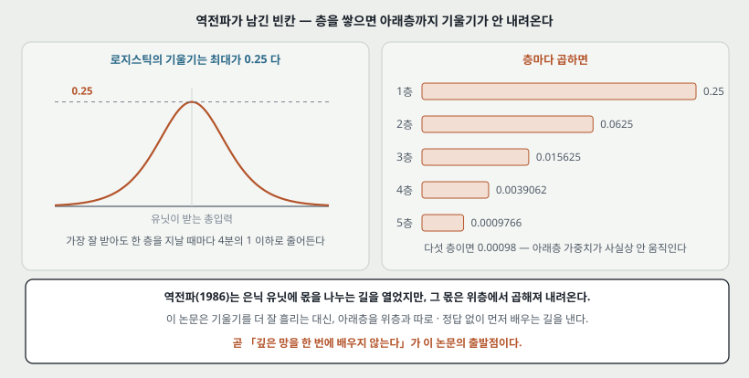

역전파(1986)는 은닉 유닛에 오차의 몫을 나누는 길을 열었다. 그런데 그 몫은 **위층에서 곱해져 내려온다.** 로지스틱 함수의 기울기는 가장 클 때가 0.25 이고, 층을 하나 지날 때마다 그보다 작은 수가 곱해진다.

| 층 수 | 기울기에 곱해지는 최댓값 |
|---:|---:|
| 1 | 0.25 |
| 2 | 0.0625 |
| 3 | 0.015625 |
| 4 | 0.0039062 |
| 5 | 0.0009766 |

이 수는 **가장 잘 받았을 때**의 값이라 실제로는 더 작다. 다섯 층이면 아래층 가중치가 사실상 움직이지 않는다.

**이 논문은 기울기를 더 잘 흘리는 쪽으로 풀지 않는다.** 대신 **아래층을 위층과 따로, 정답 없이 먼저 배우는** 길을 낸다. 곧 이 논문의 출발점은 「깊은 망을 한 번에 배우지 않는다」이다.

> **주의.** 논문 본문은 이것을 기울기 소실이라는 말로 적지 않는다. 논문이 적는 문제는 **추론의 어려움**이다 — 변분 근사가 특히 가장 깊은 층에서 나쁘고, 모든 매개변수를 함께 배워야 해서 매개변수가 늘면 학습 시간이 나빠진다. 위의 0.25 표는 역전파 노트에서 가져온 것이고 **내가 두 편을 잇기 위해 붙인 것**이다.

---

## 4. 방향이 있는 망과 없는 망 — 무엇이 쉬운가

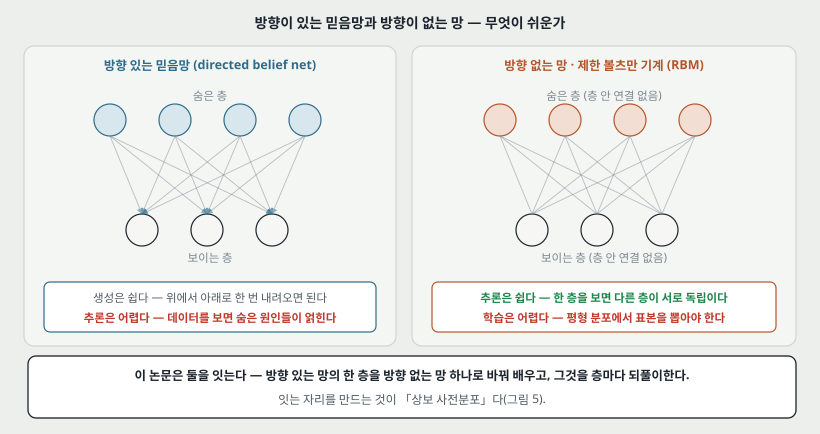

| | 방향 있는 믿음망 | 방향 없는 망 (RBM) |
|---|---|---|
| 생성 | **쉽다** — 위에서 아래로 한 번 내려오면 된다 | 어렵다 — 평형에 이를 때까지 번갈아 돌려야 한다 |
| 추론 | **어렵다** — 설명해치우기로 숨은 원인들이 얽힌다 | **쉽다** — 한 층을 보면 다른 층이 서로 독립이다 |
| 학습 | 추론이 막혀 막힌다 | 평형 표본이 필요해 느리다 |

**이 논문은 둘을 잇는다.** 방향 있는 망의 한 층을 방향 없는 망 하나로 바꿔 배우고, 그것을 층마다 되풀이한다. 잇는 자리를 만드는 것이 상보 사전분포다.

### 4.1 유닛 하나가 하는 계산 (식 1)

로지스틱 믿음망의 유닛은 부모들의 상태를 가중합해 로지스틱에 넣은 확률로 켜진다.

$$p(s_i = 1) = \frac{1}{1 + \exp\left(-b_i - \sum_j s_j w_{ij}\right)} \qquad (1)$$

$b_i$ 는 유닛 $i$ 의 치우침(bias)이고 $w_{ij}$ 는 부모 $j$ 에서 $i$ 로 가는 가중치다. 상태는 **확률적 이진값**이다 — 0 또는 1 이고 위 확률로 정해진다.

작은 예시로, 치우침이 $-10$ 이고 켜진 부모가 없으면 켜질 확률이 $1/(1+e^{10})$ 이라 꺼져 있을 확률이 $e^{10}$ 배 높다.

---

## 5. 설명해치우기 — 추론이 왜 어려운가

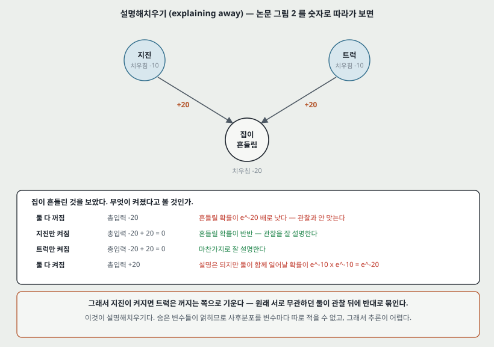

논문 그림 2 를 숫자로 따라가면 이렇다. 지진과 트럭이 각각 치우침 $-10$ 으로 드물게 켜지고, 둘 중 하나라도 켜지면 집 흔들림에 $+20$ 을 준다. 집 흔들림의 치우침은 $-20$ 이다.

| 무엇이 켜졌다고 보는가 | 집 흔들림이 받는 총입력 | 그럴듯한가 |
|---|---|---|
| 둘 다 꺼짐 | $-20$ | 흔들릴 확률이 $e^{-20}$ 배로 낮다 — 관찰과 안 맞는다 |
| 지진만 켜짐 | $-20 + 20 = 0$ | 반반이다 — 관찰을 잘 설명한다 |
| 트럭만 켜짐 | $-20 + 20 = 0$ | 마찬가지로 잘 설명한다 |
| 둘 다 켜짐 | $+20$ | 설명은 되지만 둘이 함께 일어날 확률이 $e^{-10} \times e^{-10} = e^{-20}$ 이라 낭비다 |

그래서 **지진이 켜지면 트럭은 꺼지는 쪽으로 기운다.** 원래 서로 무관하던 두 원인이 관찰 뒤에 반대로 묶인다. 이것이 설명해치우기이고, 숨은 변수들이 얽히므로 사후분포를 변수마다 따로 적을 수 없다.

### 5.1 곱꼴이 되는가 안 되는가

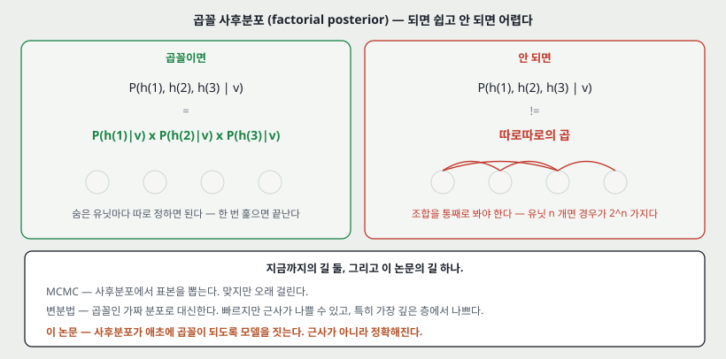

곱꼴이면 숨은 유닛마다 확률 하나씩만 정하면 된다. 아니면 조합을 통째로 봐야 하고, 유닛이 $n$ 개면 경우가 $2^n$ 가지다.

지금까지의 길이 둘 있었고 논문이 낸 길이 하나다.

| 길 | 무엇을 하는가 | 논문이 적은 문제 |
|---|---|---|
| MCMC | 사후분포에서 표본을 뽑는다 | 맞지만 대개 아주 오래 걸린다 |
| 변분법 | 곱꼴인 가짜 분포로 대신한다 | 근사가 나쁠 수 있고 **특히 가장 깊은 층에서 나쁘다**(그 층의 사전분포가 독립을 가정하므로). 또 모든 매개변수를 함께 배워야 한다 |
| **이 논문** | **사후분포가 애초에 곱꼴이 되도록 모델을 짓는다** | 근사가 아니라 정확해진다 |

논문의 말로, 촘촘히 이어진 망에서 설명해치우기를 없애는 것은 **널리 불가능하다고 여겨졌다.**

---

## 6. 상보 사전분포 — 이 논문의 알맹이

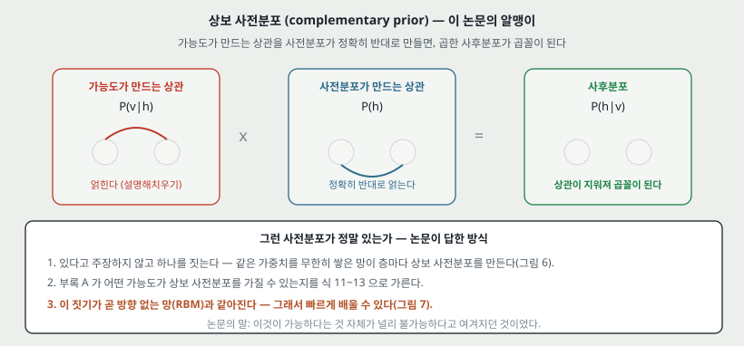

착상은 한 줄이다. **가능도 $P(v \mid h)$ 가 만드는 상관을 사전분포 $P(h)$ 가 정확히 반대로 만들면, 둘을 곱한 사후분포에서 상관이 지워져 곱꼴이 된다.**

그런 사전분포가 정말 있는가. 논문은 있다고 주장하는 대신 **하나를 짓는다.**

1. **같은 가중치를 무한히 쌓은 방향 있는 망**이 층마다 상보 사전분포를 만든다(다음 절).
2. 부록 A 가 **어떤 가능도가 상보 사전분포를 가질 수 있는지**를 가른다. 가능도가 식 11 의 꼴일 때만 가능하고, 그때의 사전분포가 식 12 다.
3. 그 짓기가 곧 **방향 없는 망(RBM)과 같아진다.** 그래서 빠르게 배울 수 있다.

부록 A 의 결론만 옮기면 이렇다. 가능도가

$$P(x \mid y) = \frac{1}{\Omega(y)} \exp\left(\sum_j \Phi_j(x, y_j) + \beta(x)\right) \qquad (11)$$

꼴일 때, 그리고 그때만 상보 사전분포가 있고 그 꼴은

$$P(y) = \frac{1}{C} \exp\left(\log \Omega(y) + \sum_j \alpha_j(y_j)\right) \qquad (12)$$

이다. 증명은 **사후분포가 곱꼴이라는 것이 곧 조건부 독립 $y_j \perp y_k \mid x$ 의 모음**이고, 그 독립 관계를 갖는 결합분포가 Hammersley-Clifford 정리로 식 13 의 꼴이 된다는 것으로 간다.

> **읽으면서 걸린 것.** 가중치를 묶는 것이 「방향 있는 모델을 방향 없는 것과 같게 만드는 잔재주」처럼 보인다. 논문도 그렇게 보일 수 있다고 적고, **그것이 층마다 가중치를 점점 풀어 가는 효율적인 학습 알고리즘으로 이어진다**고 답한다.

---

## 7. 가중치를 묶어 무한히 쌓은 망

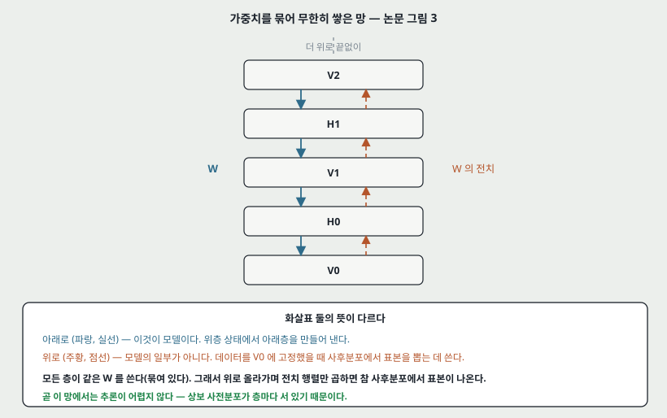

논문 그림 3 이다. 화살표 둘의 뜻이 다르다.

- **아래로 (실선)** — 이것이 모델이다. 위층 상태에서 아래층을 만들어 낸다.
- **위로 (점선)** — **모델의 일부가 아니다.** 데이터를 $V_0$ 에 고정했을 때 각 숨은 층의 사후분포에서 표본을 뽑는 데 쓴다.

모든 층이 같은 $W$ 를 쓴다. 그래서 위로 올라가며 **전치 행렬 $W^\mathsf{T}$ 만 곱하면** 참 사후분포에서 표본이 나온다. 층마다 상보 사전분포가 서 있기 때문이고, 그것이 부록 A 가 보이는 것이다.

곧 **이 망에서는 추론이 어렵지 않다.** 여기까지가 설명해치우기를 없앤 자리다.

---

## 8. 무한 스택은 RBM 과 같다

무한 스택에서 표본을 뽑는 과정이 **RBM 에서 번갈아 기브스 표집을 하는 과정과 같다.** 기브스 한 걸음이 한 층에 해당한다.

근거는 미분이 맞아떨어진다는 것이다. 생성 가중치 하나에 대한 미분을 층마다 적어 더하면

$$\frac{\partial \log p(v^0)}{\partial w_{ij}} = \langle h^0_j (v^0_i - v^1_i) \rangle + \langle v^1_i (h^0_j - h^1_j) \rangle + \langle h^1_j (v^1_i - v^2_i) \rangle + \cdots \qquad (4)$$

가 되고, **세로로 줄지은 항들이 서로 지워진다.** 남는 것이 볼츠만 기계의 학습 규칙이다.

$$\frac{\partial \log p(v^0)}{\partial w_{ij}} = \langle v^0_i h^0_j \rangle - \langle v^\infty_i h^\infty_j \rangle \qquad (5)$$

왼쪽 항은 **데이터를 고정했을 때**의 상관이고, 오른쪽 항은 **평형에 이르렀을 때**의 상관이다. 로그가능도를 키우는 것은 데이터 분포와 모델의 평형 분포 사이의 KL 발산을 줄이는 것과 같다.

---

## 9. 대조 발산 — 평형까지 안 간다

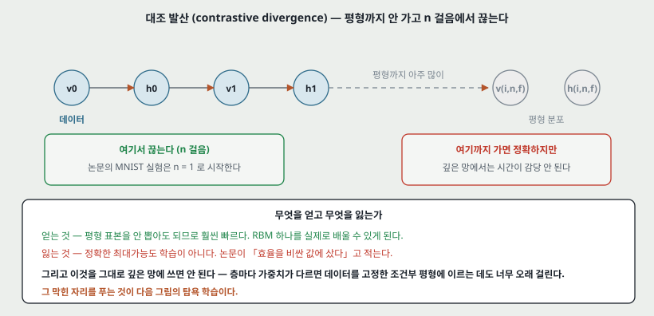

식 5 의 오른쪽 항은 평형 표본이 필요해서 비싸다. 대조 발산은 **기브스를 $n$ 걸음만 돌고 끊는다.** 한 걸음은 $v$ 를 보고 $h$ 를 갱신한 뒤 $h$ 를 보고 $v$ 를 갱신하는 것이다.

| | 얻는 것 | 잃는 것 |
|---|---|---|
| 대조 발산 | 평형 표본을 안 뽑아도 되므로 훨씬 빠르다. RBM 하나를 실제로 배울 수 있게 된다 | 정확한 최대가능도 학습이 아니다 |

논문의 말로 **「효율을 비싼 값에 샀다」**. 그리고 여기서 중요한 문장이 하나 나온다 — **이것을 그대로 깊은 다층 망에 쓰면 안 된다.** 층마다 가중치가 다르면 데이터를 고정한 조건부 평형에 이르는 데도 너무 오래 걸리기 때문이다.

그 막힌 자리를 푸는 것이 다음 절이다.

---

## 10. 탐욕 층별 학습

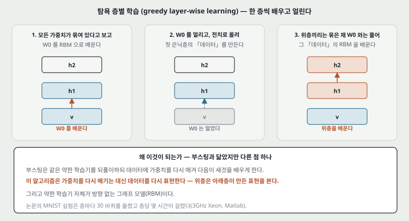

논문이 적은 세 걸음 그대로다.

1. **모든 가중치 행렬이 묶여 있다고 보고 $W_0$ 를 배운다.** 이 가정 아래에서는 $W_0$ 를 배우는 일이 RBM 하나를 배우는 일로 줄어든다.
2. **$W_0$ 를 얼리고, $W_0^\mathsf{T}$ 로 올려** 첫 은닉층에서 곱꼴 근사 사후분포를 얻기로 한다. 위층 가중치가 나중에 바뀌어 이 추론이 더 이상 정확하지 않게 되더라도 그대로 쓴다.
3. **위층끼리는 묶은 채 $W_0$ 와는 풀어**, $W_0^\mathsf{T}$ 가 만든 「더 높은 수준의 데이터」의 RBM 을 배운다.

이것을 재귀적으로 되풀이한다.

**부스팅과 닮았지만 다른 점 하나.** 부스팅은 같은 약한 학습기를 되풀이하되 **데이터에 가중치를 다시 매겨** 다음 학습기가 새것을 배우게 한다. 이 알고리즘은 가중치를 다시 매기는 대신 **데이터를 다시 표현한다.** 그리고 약한 학습기 자체가 방향 없는 그래프 모델이다.

---

## 11. 층을 더해도 나빠지지 않는다는 보장

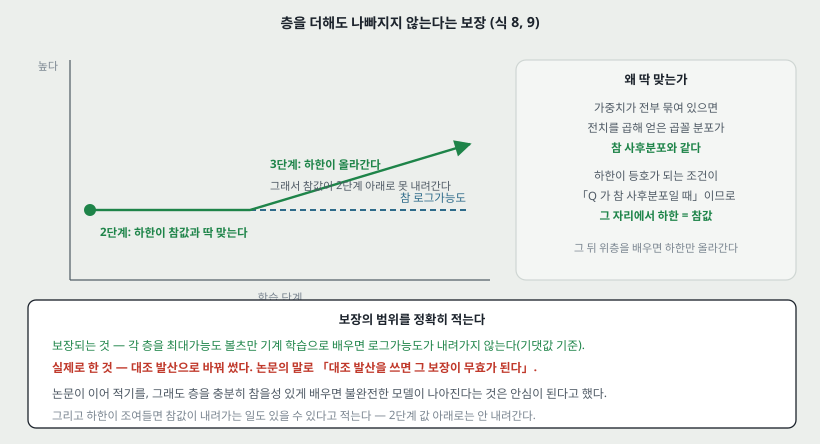

한 데이터 벡터의 로그확률은 변분 하한으로 아래에서 받쳐진다.

$$\log p(v^0) \ \ge\ \sum_{h^0} Q(h^0 \mid v^0)\left[\log p(h^0) + \log p(v^0 \mid h^0)\right] - \sum_{h^0} Q(h^0 \mid v^0) \log Q(h^0 \mid v^0) \qquad (8)$$

이 부등식이 **등호가 되는 조건은 $Q$ 가 참 사후분포일 때**다. 그런데 가중치가 전부 묶여 있으면 $W_0^\mathsf{T}$ 로 얻은 곱꼴 분포가 바로 참 사후분포다. **곧 2단계에서 하한이 참값과 딱 맞는다.**

2단계가 $Q(\cdot \mid v^0)$ 와 $p(v^0 \mid h^0)$ 를 얼리므로, 그 뒤 위층 가중치로 하한을 미분한 것은

$$\sum_{h^0} Q(h^0 \mid v^0) \log p(h^0) \qquad (9)$$

를 미분한 것과 같다. 곧 **위층을 배우는 것은 $h^0$ 가 $Q(h^0 \mid v^0)$ 의 확률로 나오는 데이터셋의 로그확률을 키우는 것과 정확히 같다.**

**보장의 범위를 정확히 적는다.**

| | 내용 |
|---|---|
| 보장되는 것 | 각 층을 **최대가능도 볼츠만 기계 학습**으로 배우면 전체 생성 모델의 로그확률이 내려가지 않는다. 논문 각주로 **기댓값 기준**이다 |
| 실제로 한 것 | 최대가능도 대신 **대조 발산**으로 바꿔 썼다. 논문의 말 — **「대조 발산을 쓰면 그 보장이 무효가 된다」** |
| 논문이 이어 적은 것 | 그래도 충분히 참을성 있게 층을 배우면 불완전한 모델이 나아진다는 것은 안심이 된다 |
| 또 하나 | 하한이 조여들면 **하한이 올라가는데도 $\log p(v^0)$ 가 내려가는 일**이 있을 수 있다. 다만 2단계의 값 아래로는 못 내려간다 |

층 크기를 모두 같게 두면 위층 가중치를 아래에서 배운 값으로 초기화할 수 있어 편하다고 적고, **크기가 달라도 같은 알고리즘을 쓸 수 있다**고 덧붙인다.

---

## 12. 위-아래 알고리즘 — 먼저 배운 것을 다시 맞춘다

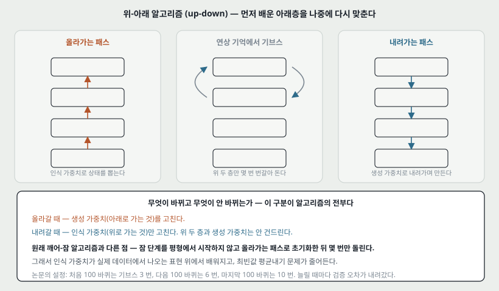

한 층씩 배우는 것은 효율적이지만 최적이 아니다. 위층을 다 배우고 나면 **아래층의 가중치도, 아래층에서 쓰던 간단한 추론 절차도 더 이상 최적이 아니다.**

논문이 이 문제를 지도 학습과 갈라 적는다. 부스팅 같은 지도 방법에서는 라벨이 귀하고 라벨 하나가 매개변수에 주는 제약이 몇 비트뿐이라 **과적합이 문제**이고, 먼저 배운 것을 다시 맞추면 오히려 해로울 수 있다. 비지도 방법은 라벨 없는 큰 데이터를 쓰고 사례 하나가 매개변수에 주는 제약이 많아 **과소적합이 문제**다. 그래서 다시 맞추는 것이 이롭다.

절차는 인식 가중치와 생성 가중치를 **풀어 놓는** 데서 시작한다. 그 뒤 깨어-잠 알고리즘의 변형을 돈다.

| 단계 | 무엇을 하는가 | **무엇이 바뀌는가** |
|---|---|---|
| 올라가는 패스 | 인식 가중치로 모든 숨은 변수의 상태를 확률적으로 고른다 | **생성 가중치**를 고친다 |
| 위 두 층 | 연상 기억의 RBM 을 아래층 사후분포에 맞춘다 | 위 두 층의 가중치 |
| 내려가는 패스 | 생성 연결로 아래층을 차례로 켠다 | **인식 가중치만** 고친다. 위 두 층과 생성 가중치는 안 건드린다 |

**원래 깨어-잠 알고리즘과 다른 점이 여기 있다.** 잠 단계를 평형에서 시작하지 않고 **올라가는 패스로 초기화한 뒤 몇 번만** 돌린다. 이것이 「대조적」이라는 말의 뜻이고, 얻는 것이 셋이다.

1. 연상 기억의 평형 분포에서 표본을 뽑을 필요가 없어진다.
2. 인식 가중치가 **실제 데이터에서 나오는 표현 위에서** 배워진다.
3. **최빈값 평균내기(mode averaging)** 가 줄어든다 — 지금 인식 가중치가 늘 한 최빈값만 고르고 똑같이 좋은 다른 최빈값을 무시할 때, 순수한 조상 패스라면 그 다른 것들을 되찾으려 가중치를 흔들지만 대조적 형태는 그러지 않는다.

그리고 맨 위를 연상 기억으로 둔 덕에 **깨어 단계의 문제도 하나 없앤다** — 조상 패스를 하려면 맨 위 유닛들이 서로 독립이어야 하는데, 그러면 맨 위 가중치의 변분 근사가 아주 나빠진다.

논문의 설정: 처음 100 바퀴는 기브스 3 번, 다음 100 바퀴는 6 번, 마지막 100 바퀴는 10 번. **늘릴 때마다 검증 오차가 눈에 띄게 내려갔다.**

---

## 13. MNIST 결과

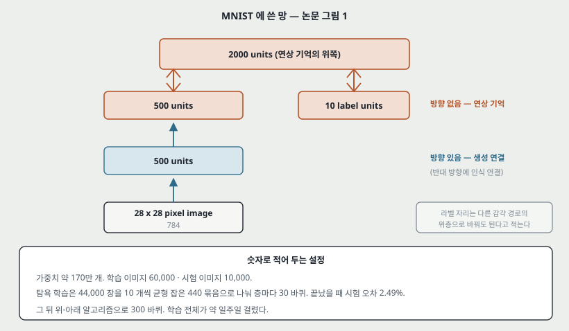

망은 784 픽셀 → 500 → 500 이고, 그 위 2000 과 라벨 10 이 방향 없는 연상 기억을 이룬다. 가중치가 약 170만 개다.

**학습 절차와 그때그때의 오차.**

| 단계 | 설정 | 끝났을 때 시험 오차 |
|---|---|---|
| 탐욕 층별 학습 | 44,000 장을 10 개씩 균형 잡은 440 묶음으로, 층마다 30 바퀴 | **2.49%** |
| 위-아래 미세조정 | 300 바퀴. 검증 10,000 장으로 학습률·관성·가중치 감쇠를 골랐다 | 1.39% (44,000 장으로 고른 망) |
| 60,000 장 전부로 다시 | 59 바퀴 더 | **1.25%** |

전체 학습이 **약 일주일** 걸렸다. 탐욕 학습만 층당 몇 시간이었다(3GHz Xeon, Matlab).

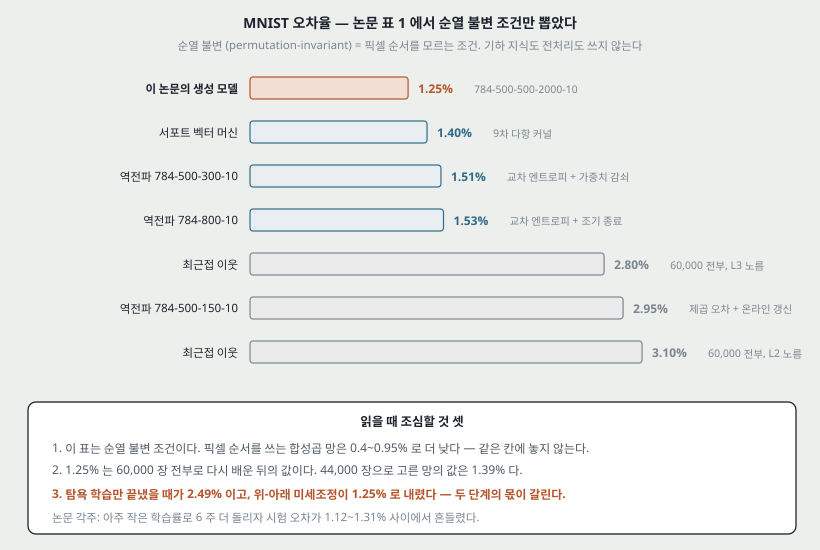

**읽을 때 조심할 것 셋.**

1. **이 표는 순열 불변 조건이다.** 픽셀 순서를 쓰는 합성곱 망은 0.4~0.95% 로 더 낮다. 같은 칸에 놓지 않는다.
2. 1.25% 는 60,000 장 전부로 다시 배운 값이다. 검증으로 고른 시점의 값은 1.39% 다.
3. **탐욕 학습만으로 2.49%, 미세조정까지 1.25%** 다. 두 단계의 몫이 갈린다.

논문 각주 하나를 옮겨 둔다 — 더 배우면 나아졌을지 확인하려고 아주 작은 학습률로 **6 주** 더 돌렸더니 시험 오차가 **1.12~1.31% 사이에서 흔들렸다.**

### 13.1 시험하는 방법이 셋이고 값이 다르다

| 방법 | 무엇을 하는가 | 오차 |
|---|---|---|
| 기브스로 라벨 맞히기 | 500 유닛 상태를 고정하고 라벨 유닛을 0.1 로 두고 몇 번 번갈아 돈다 | 보고값보다 **약 1%p 높다** |
| 자유 에너지 계산 | 라벨 유닛을 하나씩 켜 보며 510 차원 이진 벡터의 자유 에너지를 정확히 계산한다 | 보고값보다 **약 0.5%p 높다** (올라가는 패스의 확률적 결정 때문) |
| **올라가는 패스를 결정적으로** | 이진 상태 대신 켜질 확률을 쓴다 | **보고된 값.** 스무 번 반복해 평균 내는 것과 거의 같은 결과 |

**보고된 1.25% 가 어느 방법의 값인지 적혀 있다는 점**이 이 절의 값이다.

### 13.2 망의 마음 들여다보기

맨 위 연상 기억에서 기브스를 돌려 평형에 이른 뒤, 그 표본을 아래로 한 번 내려보내면 이미지가 나온다. 라벨을 고정하면 그 부류의 조건부 분포에서 나오는 이미지를 볼 수 있다(논문 그림 8, 표본 사이 1000 번). 무작위 이진 이미지로 맨 위 두 층을 초기화한 뒤 라벨만 고정하고 자유롭게 돌리면서 **20 번마다 내려보내 무엇을 떠올리고 있는지 보는** 것이 그림 9 다.

논문이 여기서 「마음(mind)」이라는 말을 **비유로 쓴 것이 아니라고** 못 박는다. 높은 수준의 내부 표현이 참된 지각이 되는 가상의 바깥 세계의 상태 — 그것이 그림이 보여 주는 것이라고 적는다.

---

## 14. 특징 — 무엇이 이 논문을 이 논문이게 하는가

논문 서론이 스스로 꼽은 일곱 가지를 그대로 옮긴다.

1. 매개변수가 수백만 개인 깊은 망에서도 **빠르게** 꽤 좋은 매개변수를 찾는 탐욕 학습 알고리즘이 있다.
2. 학습이 **비지도**인데 라벨 붙은 데이터에도 쓸 수 있다 — 라벨과 데이터를 함께 만들어 내는 모델을 배우면 된다.
3. 미세조정 알고리즘이 있고, 그 결과가 MNIST 에서 판별 방법을 이긴다.
4. 생성 모델이라 깊은 층의 분산 표현을 **해석하기 쉽다.**
5. 지각을 만드는 추론이 **빠르고 정확하다.**
6. 학습이 **국소적이다** — 시냅스 하나의 변화가 앞뒤 뉴런의 상태에만 달려 있다.
7. 소통이 **단순하다** — 뉴런은 확률적 이진 상태만 주고받으면 된다.

6번과 7번이 다른 다섯과 성격이 다르다. 성능이 아니라 **뇌의 학습 모형으로 그럴듯한가**에 관한 것이고, 역전파 논문이 스스로 한계로 적었던 자리와 정확히 맞물린다.

---

## 15. 이 논문이 스스로 적은 한계

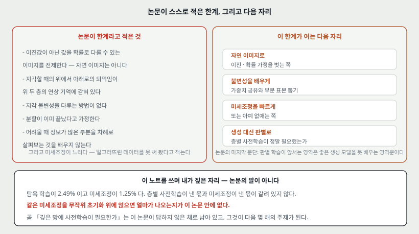

결론 절이 적은 것 그대로다.

1. **이진값이 아닌 값을 확률로 다룰 수 있는 이미지를 전제한다.** 자연 이미지는 그렇지 않다.
2. 지각할 때의 **위에서 아래로의 되먹임이 맨 위 두 층의 연상 기억에 갇혀 있다.**
3. **지각 불변성**을 다루는 체계적인 방법이 없다.
4. **분할(segmentation)이 이미 끝났다고 가정한다.**
5. 판별이 어려울 때 **정보가 많은 부분을 차례로 살펴보는 것**을 배우지 않는다.
6. 미세조정이 **느리다.** 그래서 일그러뜨린 데이터로 학습해 보는 것을 아직 해 보지 못했다.

그리고 탐욕 알고리즘을 쓰는 방식 자체를 의심한다 — **미세조정을 생략하고 그 속도로 더 크고 깊은 망의 앙상블이나 훨씬 큰 학습 집합을 배우는 편이 나을 수도 있다**고 적는다.

논문은 마지막에 생성 모델의 이점 넷을 적는데, 그중 넷째가 이 논문의 성격을 잘 보인다 — **판별 학습이 앞서는 영역은 좋은 생성 모델을 배울 수 없는 영역뿐이고, 그 영역은 무어의 법칙이 깎아내고 있다.**

---

## 16. 논문이 적지 않은 것 — 내가 읽으며 짚은 자리

**여기서부터는 논문의 말이 아니라 내 것이다.**

**하나. 탐욕 학습의 몫과 미세조정의 몫이 갈려 있지 않다.** 탐욕 학습만 끝냈을 때 2.49%, 미세조정까지 1.25% 다. 그런데 **같은 미세조정을 무작위 초기화 위에 얹으면 얼마가 나오는지**가 이 논문 안에 없다. 곧 「깊은 망에 층별 사전학습이 필요한가」는 이 논문이 답하지 않은 채로 남는다.

> **돌려 봤다 (2026-09-20).** 논문에 없는 그 대조군을 직접 만들었다 — 같은 데이터 · 같은 모양 · 같은 지도 미세조정에 초기화만 바꿨다(MNIST 10,000 장, 은닉 256, seed 5).
>
> | 깊이 | 사전학습 | 무작위 | 차이 | seed 변동 폭 |
> |---:|---:|---:|---:|---:|
> | 1 | 0.0435 | 0.0565 | +0.0130 | 0.0055 |
> | 2 | 0.0370 | 0.0585 | +0.0215 | 0.0085 |
> | 3 | **0.0330** | 0.0575 | **+0.0245** | 0.0090 |
>
> **세 깊이 모두 사전학습이 이기고 차이가 변동 폭보다 크다. 그리고 차이가 깊이를 따라 커진다.** 눈에 띄는 것은 무작위 쪽이다 — 층을 늘려도 0.0565 → 0.0585 → 0.0575 로 나아지지 않는데 사전학습 쪽만 0.0435 → 0.0330 으로 내려간다. **이 규모에서 층을 쌓는 값어치가 사전학습이 있을 때만 나온다.**
>
> **다만 이것이 논문의 물음에 그대로 답하는 것은 아니다.** 여기 쓴 미세조정은 지도 역전파이고 논문의 위-아래 알고리즘이 아니다. 그래서 답한 것은 「비지도 사전학습이 지도 미세조정을 돕는가」이고, 「논문의 생성 파이프라인에 탐욕 단계가 필요했나」는 아직 열려 있다. 자세한 것은 문서 끝의 경로에 있다.

**둘. 층 수를 바꿔 보지 않았다.** 세 은닉층 하나만 나온다. 층을 더 쌓으면 어떻게 되는지, 두 층이면 어떤지가 없다. 변분 하한 논증은 「층을 더하면 나빠지지 않는다」를 말하지만 **그 보장은 대조 발산을 쓰는 순간 무효라고 논문이 스스로 적었으므로**, 실제로 몇 층이 좋은지는 측정으로만 답할 수 있는데 그 측정이 없다.

> **돌려 봤다.** 위 표가 그 측정이다. 깊이 1 · 2 · 3 에서 사전학습 쪽이 계속 내려간다. **다만 내려가는 폭이 줄고 있다** — 차이가 0.0130 → 0.0215 → 0.0245 로 커지지만 커지는 폭 자체는 0.0085 에서 0.0030 으로 줄었다. **어디서 멈추는지는 깊이 3 까지만 재서 모른다.**

**셋. 대조 발산의 걸음 수 $n$ 을 바꿔 본 표가 없다.** 본문에 $n$ 이 등장하지만 MNIST 실험에서 얼마를 썼는지가 층별 학습 쪽에는 분명하게 적혀 있지 않다. 위-아래 단계의 기브스 횟수(3 → 6 → 10)는 적혀 있다.

> **돌려 봤다. 그리고 재는 값을 잘못 고르면 거꾸로 읽힌다는 것을 알았다.**
>
> | `n` | 재구성 RMSE | 자유 에너지 간격 | 시간 |
> |---:|---:|---:|---:|
> | 1 | 0.1241 | 358.3 | 1.00 배 |
> | 3 | 0.1558 (+25.5%) | 387.1 (+8.1%) | 1.67 배 |
> | 10 | 0.1896 (+52.8%) | 454.3 (+26.8%) | 4.41 배 |
>
> `n` 을 올리면 **재구성 오차는 올라가고 자유 에너지 간격은 늘어난다.** 거꾸로가 아니라 둘이 다른 것을 재기 때문이다 — CD-1 은 한 걸음 뒤에 되돌아오는 것을 바로 줄이도록 배우므로 재구성 오차에서 유리하고, `n` 이 큰 쪽은 평형에 가까운 기울기를 써서 숫자와 잡음을 더 잘 가른다. **재구성 오차를 RBM 의 품질 지표로 쓰면 안 된다.**

**넷. 학습률과 가중치 감쇠를 층마다 다르게 하지 않았다고 논문이 각주로 밝힌다.** 그리고 **더 잘 고르면 학습이 훨씬 빨라질 가능성이 높지만 더 나쁜 해로 갈 수도 있다**고 덧붙인다. 곧 이 망의 성능이 하이퍼파라미터의 어느 자리에 서 있는지가 확인되지 않았다.

---

## 17. 읽을 때 헷갈리는 지점

**「무한」이 실제로 무한한 망을 만든다는 뜻이 아니다.** 무한 스택은 **분석을 위한 장치**다. 실제로 배우는 것은 RBM 하나이고, 무한 스택은 그 RBM 이 방향 있는 깊은 망과 같다는 것을 보이기 위해 등장한다.

**「사후분포가 정확히 곱꼴」인 것은 가중치가 묶여 있는 동안만이다.** 탐욕 알고리즘 2단계에서 $W_0$ 를 얼리고 위층을 풀기 시작하면 아래층의 참 사후분포는 더 이상 곱꼴이 아니고, $W_0^\mathsf{T}$ 로 올리는 추론도 더 이상 정확하지 않다. 논문은 그것을 알고 그대로 쓴다 — **변분 하한이 여전히 올라간다는 것으로 정당화한다.**

**인식 가중치와 생성 가중치는 처음에 같은 것이다.** 탐욕 학습 동안에는 묶여 있다가($W$ 와 $W^\mathsf{T}$), 위-아래 단계에서 풀린다. 그림 11 의 화살표 둘이 다른 색인 이유가 이것이다.

**맨 위 두 층만 방향이 없다.** 나머지는 방향 있는 생성 연결이다. 「이 논문이 RBM 을 쌓았다」고만 기억하면 이 구분이 사라진다.

**소프트맥스 라벨 유닛의 학습 규칙이 경쟁에 영향받지 않는다.** 논문이 이것을 curiously 라고 적는다 — 경쟁은 유닛이 켜질 확률에 영향을 주고, 학습에 들어가는 것은 그 확률뿐이라서 시냅스가 누구와 경쟁하는지 알 필요가 없다.

---

## 18. 역전파의 한계와 맞춰 보기

역전파 노트에 적어 둔 한계와 이 논문이 어디서 맞물리는지 적는다.

| 역전파(1986)의 한계 | 이 논문이 한 것 | 남는 것 |
|---|---|---|
| 국소 최소에 갇힐 수 있다 | 직접 다루지 않는다. 다만 탐욕 학습이 **좋은 출발점**을 주므로 미세조정이 나쁜 자리에서 시작하지 않는다 | 사전학습이 정말 그 역할을 하는지는 이 논문 안에서 측정되지 않았다 |
| 깊어지면 기울기가 곱해져 줄어든다 | **기울기를 흘리지 않는다.** 층을 따로 배운다 | 미세조정 단계는 여전히 전체를 함께 움직인다 |
| 라벨이 있어야 한다 | **비지도로 배운다.** 라벨은 맨 위에 함께 생성되는 변수로 들어간다 | 라벨을 안 쓰는 대신 생성 모델을 배워야 하고, 그것이 더 비쌀 수 있다 |
| 뇌의 학습 모형으로 그럴듯하지 않다 | **국소 학습 규칙**과 **이진 상태 소통**을 스스로 꼽는다 | 위-아래 단계는 인식과 생성 두 벌의 가중치를 요구한다 |
| 수렴이 느리다 | 탐욕 단계는 빠르지만 **전체 학습이 일주일** 걸렸다 | 미세조정이 느리다는 것을 논문도 한계로 적는다 |

**한 줄로 적으면**, 역전파는 「은닉층에 정답이 없다」를 풀었고 이 논문은 **「깊어지면 그 답이 아래까지 안 내려온다」를 층을 나눠 배우는 것으로 우회했다.**

---

## 19. 다음에 읽을 것

**한계를 적고 그 한계를 푼 것이 다음 논문이다.** 이 논문이 남긴 자리에서 셋을 꼽는다.

| 다음 | 이 논문의 어느 한계에서 나오는가 | 무엇을 확인하고 싶은가 |
|---|---|---|
| **층별 사전학습이 정말 필요한가를 잰 편** | 16절의 하나 — 탐욕의 몫과 미세조정의 몫이 갈려 있지 않다 | 무작위 초기화 + 같은 미세조정이 얼마를 내는가 |
| **자연 이미지로 가는 편** | 한계 1 — 이진·확률 가정 | 실수값 입력을 RBM 이 어떻게 받는가 |
| **불변성을 배우는 편** | 한계 3 — 지각 불변성 | 가중치 공유와 부분 표본 뽑기를 생성 모델에 넣을 수 있는가 |

읽는 순서로는 **첫째가 먼저**다. 이 논문의 결론이 서는지 무너지는지가 거기서 갈리기 때문이다.

---

## 20. 돌려 본 것

노트를 쓰며 「이건 직접 확인하고 싶다」가 된 것 셋을 **2026-09-20 에 전부 돌렸다.** 실험 폴더는 문서 끝의 경로에 있다.

**하나. 0.25 표가 실제로 그 모양인가.** 3절의 표는 로지스틱 기울기의 최댓값을 곱한 것이라 상한이다. 실제 망에서 층마다 몇 배씩 줄어드는지를 **초기화를 바꿔 가며** 쟀다(깊이 3, 미세조정 첫 묶음, seed 5 중앙값).

| 층 | 사전학습 | 무작위 | 사전학습 / 무작위 |
|---:|---:|---:|---:|
| 1 (가장 아래) | 0.0342 | 0.0229 | **1.50** |
| 2 | 0.0476 | 0.0768 | 0.62 |
| 3 (가장 위) | 0.1690 | 0.3387 | 0.50 |

**3층에서 1층까지 나뉘는 배수가 무작위 14.8 배 · 사전학습 4.9 배다.** 역전파 실험이 쟀던 「깊이마다 10~12 배」와 같은 자리이고, **사전학습이 그 감쇠를 3 분의 1 로 줄인다.**

그런데 여기서 예상과 다른 것이 하나 나왔다. **사전학습이 기울기를 키우는 것이 아니다** — 아래층에서는 1.50 배로 크지만 위층에서는 0.50 배로 오히려 작다. **깊이에 걸쳐 고르게 펴는 것**이지 전체를 올리는 것이 아니다.

**둘. RBM 하나를 MNIST 에 배워 보는 것.** CD-1 로 784 x 256 RBM 을 15 에폭(31 초) 배웠다. 재구성 RMSE 가 **0.2366 에서 0.1241** 로 내려가고, 자유 에너지가 시험 숫자에서 **-278.6** · 균등 잡음에서 **79.7** 로 갈린다. 가중치 필터 64 개에 획과 얼룩이 보인다. **이 논문의 알맹이 중 실제로 돌아가는 최소 단위가 돈다.**

**셋. 탐욕 학습의 몫을 직접 가르는 것.** 16절 하나의 인용 블록에 표로 적었다 — 세 깊이 모두 사전학습이 이기고 차이가 깊이를 따라 커진다.

**곁가지로 하나 더 나왔다.** 라벨을 줄여 가며 같은 비교를 했다.

| 라벨 수 | 사전학습 | 무작위 | 차이 |
|---:|---:|---:|---:|
| 100 | **0.2410** | 0.7560 | **+0.5150** |
| 1,000 | 0.0880 | 0.1290 | +0.0410 |
| 10,000 | 0.0370 | 0.0565 | +0.0195 |

**라벨 100 장에서 차이가 0.5150 이다.** 논문 결론이 적은 「판별 학습은 라벨을 적는 데 드는 비트만큼만 매개변수를 제약하고, 생성 모델은 입력을 적는 데 드는 비트만큼 제약한다」가 이 한 줄로 측정된다 — **사전학습은 라벨을 한 장도 안 보고 10,000 장 전부를 썼다.**

### 돌리고 나서 남은 것 넷

1. **논문의 위-아래 알고리즘을 그대로 구현해 같은 비교를 하는 것.** 위의 미세조정은 지도 역전파다. 그것을 바꿔야 「논문의 생성 파이프라인에 탐욕 단계가 필요했나」에 답한다.
2. **깊이를 3 보다 늘려 보는 것.** 차이가 커지는 폭이 0.0085 에서 0.0030 으로 줄고 있는데 어디서 멈추는지 모른다.
3. **규모를 논문 쪽으로 올려 보는 것.** 사전학습의 이점이 데이터가 적을 때 크다는 것을 라벨 실험이 보였으므로, **60,000 장으로 올리면 차이가 줄어들 수 있다.** 줄어드는 모양이 「사전학습이 필요한가」에 대한 다음 답이다.
4. **`n` 을 올린 사전학습이 시험 오차로 이어지는가.** 자유 에너지 간격은 늘었는데 그 이득이 미세조정 뒤에도 남는지는 재지 않았다.

---

## 21. 물어 두는 것

- **부록 A 의 식 11 이 어느 만큼 넓은가.** 상보 사전분포를 가질 수 있는 가능도의 꼴이 저것뿐이라는 것은, 실제 모델 중 얼마가 거기 드는가. 로지스틱 믿음망 말고 무엇이 드는지 논문에 예가 더 없다.
- **하한이 올라가는데 참값이 내려가는 일**이 실제로 얼마나 자주 일어나는가. 논문은 가능성만 적고 관찰을 적지 않았다.
- **층 크기를 다르게 해도 된다**고 적었는데, 초기화를 물려받을 수 없게 되면 탐욕 학습의 이점이 얼마나 줄어드는가. 논문의 MNIST 망은 500-500-2000 으로 실제로 크기가 다르다.

---

## 22. 참고 문헌

이 노트가 인용한 편만 적는다. 원리는 원 출처를, 구현은 그 라이브러리의 편을 적는 규칙을 따른다.

- Hinton, G. E., Osindero, S., and Teh, Y. (2006). A fast learning algorithm for deep belief nets. **Neural Computation**. — 이 노트의 대상.
- Hinton, G. E. (2002). Training products of experts by minimizing contrastive divergence. **Neural Computation**, 14(8):1711–1800. — 대조 발산의 원 출처.
- Hinton, G. E., Dayan, P., Frey, B. J., and Neal, R. (1995). The wake-sleep algorithm for self-organizing neural networks. **Science**, 268:1158–1161. — 위-아래 알고리즘이 변형한 원본.
- Neal, R. (1992). Connectionist learning of belief networks. **Artificial Intelligence**, 56:71–113. — 로지스틱 믿음망의 원 출처.
- Neal, R. M. and Hinton, G. E. (1998). A new view of the EM algorithm that justifies incremental, sparse and other variants. — 변분 하한(식 8)의 출처.
- Pearl, J. (1988). Probabilistic Inference in Intelligent Systems. Morgan Kaufmann. — 부록 A 가 조건부 독립과 무방향 그래프 모델의 대응에 쓴 출처.
- Rumelhart, D. E., Hinton, G. E., and Williams, R. J. (1986). Learning representations by back-propagating errors. **Nature**, 323:533–536. — 3절과 18절이 맞대어 보는 편.
- Decoste, D. and Schoelkopf, B. (2002). Training invariant support vector machines. **Machine Learning**, 46:161–190. — 표 1 의 서포트 벡터 머신 1.4%.
- LeCun, Y., Bottou, L., and Haffner, P. (1998). Gradient-based learning applied to document recognition. **Proceedings of the IEEE**, 86(11):2278–2324. — 표 1 의 LeNet5.

---

## 23. 경로

| 무엇 | 어디 |
|---|---|
| 원문 PDF | `papers/NC06_DBN_A_Fast_Learning_Algorithm_for_Deep_Belief_Nets.pdf` |
| 원문 주소 | https://www.cs.toronto.edu/~hinton/absps/fastnc.pdf |
| 이 노트의 그림 | `figures/NC06_DBN/fig01_gap.svg` 부터 `fig14_limits.svg` 까지 열넷 |
| 그림을 만드는 코드 | `figures/NC06_DBN/make_figures.py` — 바깥 데이터를 읽지 않으므로 `python make_figures.py` 로 어디서나 다시 만든다 |
| 20절의 실험 | `experiments/dbn_2006/` — 노트북 · 결과 CSV 여섯 · 그림 넷. 질문과 가설은 돌리기 전에 커밋했다 |
