# AlexNet — ImageNet Classification with Deep Convolutional Neural Networks (요약)

## Paper Metadata

| Item | Content |
|---|---|
| Title | ImageNet Classification with Deep Convolutional Neural Networks |
| Authors | Alex Krizhevsky, Ilya Sutskever, Geoffrey E. Hinton |
| 소속 | 셋 다 University of Toronto |
| Conference / Journal | NIPS(오늘날의 NeurIPS) 2012 논문집. 저장한 것이 논문집 판이라 본문이 8 쪽이고 참고 문헌이 9 쪽이다. **권·호·쪽 번호는 파일 안에 적혀 있지 않다** |
| Year | 2012 |
| DOI | 이 파일 안에 적혀 있지 않다 |
| 코드 | 본문 각주에 `http://code.google.com/p/cuda-convnet/` 가 적혀 있다(2012년 주소이고 지금 살아 있는지는 확인하지 않았다) |
| Stored PDF | `papers/NIPS12_AlexNet_ImageNet_Classification_with_Deep_Convolutional_Neural_Networks.pdf` |
| 왜 읽었는가 | LeNet 노트 17절이 다음으로 꼽은 둘 — **합성곱 망을 크게 키운 편**과 **부분 표본 뽑기를 최댓값 풀링으로 바꾼 편** — 이 한 편에 함께 들어 있다. 1998년의 6만 파라미터가 2012년에 6천만이 되는 자리이고, 그 사이에 무엇이 바뀌었는지가 이 논문 한 편에 다 적혀 있다 |
| 읽은 범위 | **2026-09-21 에 본문 1~8 쪽을 전부 읽었다.** 곧 1절(서론) · 2절(데이터) · 3절(구조) · 4절(과적합) · 5절(학습 설정) · 6절(결과) · 7절(논의)와 그림 1~4, 표 1~2 다. 미독: 9 쪽의 참고 문헌 26 건, 그리고 본문이 가리키는 **보충 자료**(supplementary material). **읽지 않은 것의 수치는 이 노트에 옮기지 않는다** |

### 저장한 파일의 상태

- **글자 층이 살아 있어 낱말 찾기가 된다.** LeNet 저장본과 달리 쪽을 그림으로 띄우지 않아도 읽힌다.
- **보충 자료는 이 파일에 없다.** 6.1절이 "더 많은 시험 이미지 결과를 보충 자료에 싣는다"고 적는데 그 부분은 저장본에 들어 있지 않다.

---

## 1. 용어

이 노트에서 쓸 이름을 먼저 정한다. 논문의 원래 용어는 괄호로 함께 적는다.

- **정류 선형 유닛 (Rectified Linear Unit, ReLU)**: $f(x) = \max(0, x)$. 작은 예시로, 입력이 −3 이면 0 을 내고 2 면 2 를 낸다. **이 노트는 이것을 「비포화 비선형」이라고도 부르는데**, 논문이 tanh 와 로지스틱을 「포화(saturating)」로 묶어 부르기 때문이다.
- **커널 지도 (kernel map)**: 커널 한 벌을 입력의 모든 자리에 대어 얻은 출력 한 장. LeNet 노트에서 「특징 지도」라고 부른 것과 같은 것이고, **이 노트는 논문을 따라 커널 지도로 적는다.**
- **겹치는 풀링 (overlapping pooling)**: 풀링 유닛을 $s$ 픽셀 간격으로 놓고 각 유닛이 $z \times z$ 를 요약할 때 $s < z$ 인 것. 작은 예시로, 이 논문은 $s = 2$, $z = 3$ 이라 이웃한 두 풀링 창이 한 줄씩 겹친다. $s = z$ 면 겹치지 않는 보통 풀링이다.
- **국소 반응 정규화 (Local Response Normalization, LRN)**: 같은 자리에서 **이웃한 커널 지도들끼리** 크기를 겨루게 해 큰 값을 깎는 것. 작은 예시로, 이 논문은 이웃 $n = 5$ 장을 본다.
- **드롭아웃 (dropout)**: 학습할 때 은닉 유닛의 출력을 확률 0.5 로 0 으로 만드는 것. 시험할 때는 전부 쓰되 출력에 0.5 를 곱한다.
- **top-1 오차 · top-5 오차**: 앞의 것은 가장 그럴듯하다고 고른 라벨 하나가 틀린 비율, 뒤의 것은 **가장 그럴듯한 다섯 안에 정답이 없는 비율**이다. 작은 예시로, 이 논문의 ILSVRC-2010 값이 37.5% 와 17.0% 다.
- **데이터 늘리기 (data augmentation)**: 라벨을 보존하는 변환으로 학습 사례를 불리는 것. 이 논문은 **자르기와 좌우 뒤집기**, 그리고 **RGB 세기 흔들기** 둘을 쓴다.
- **ILSVRC**: ImageNet Large-Scale Visual Recognition Challenge. ImageNet 의 부분집합(1000 부류)으로 해마다 여는 대회다. **이 노트는 「ImageNet 전체」와 「ILSVRC 부분집합」을 갈라 적는다** — 논문이 둘을 다른 자리에서 쓰기 때문이다.

---

## 2. 한 문단 요약

**합성곱 망을 그때까지 나온 것보다 크게 키우고, 커지면서 생기는 두 문제(느린 학습과 과적합)를 각각의 장치로 막아 ILSVRC 에서 이전 최고를 크게 앞질렀다.** 망은 **학습되는 층 여덟**(합성곱 5 + 완전연결 3)에 **파라미터 6천만**이고, 출력이 1000 부류 소프트맥스다. 느린 학습은 **ReLU** 와 **GPU 둘로 쪼개 쓰기**로, 과적합은 **데이터 늘리기**와 **드롭아웃**으로 막는다. ILSVRC-2010 에서 top-1 37.5% · top-5 17.0% 이고, 그전 최고가 47.1% · 28.2% 였다. ILSVRC-2012 에서는 망 일곱을 묶어 **top-5 15.3%** 로 우승했고 2등이 26.2% 였다. 논의 절이 적는 결론 한 줄은 **「깊이가 실제로 중요하다」** 이다 — 합성곱 층 하나를 빼면 top-1 이 약 2% 나빠지는데, 그 층 하나가 파라미터의 1% 도 안 된다.

---

## 3. 문제 — 데이터가 먼저 커졌다

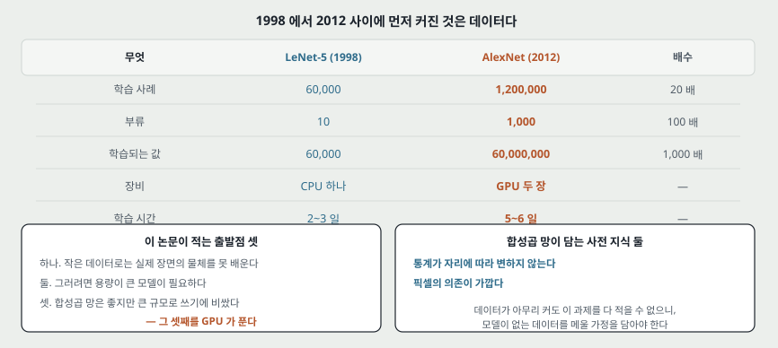

논문 1절의 뼈대는 세 걸음이다.

**하나. 작은 데이터로는 실제 장면의 물체를 못 배운다.** 논문이 드는 예시가 명료하다 — **MNIST 숫자 인식은 0.3% 아래로 내려와 사람 수준에 다가섰지만**, 실제 장면의 물체는 변이가 훨씬 커서 훨씬 큰 학습 집합이 있어야 한다. 그리고 최근에야 **수백만 장에 라벨을 붙인 데이터**가 생겼다고 적는다(LabelMe, 그리고 **22,000 부류가 넘는 1,500만 장의 ImageNet**).

**둘. 그러면 용량이 큰 모델이 필요한데, 데이터가 아무리 커도 이 과제를 다 적을 수는 없다.** 그래서 모델이 **가지고 있지 않은 데이터를 메울 사전 지식**을 담아야 하고, 합성곱 망이 바로 그런 모델이라고 적는다. 담는 가정이 둘로 적혀 있다 — **통계가 자리에 따라 변하지 않는다(stationarity)** 와 **픽셀의 의존이 가깝다(locality)**.

**셋. 그런데 합성곱 망은 고해상도에 큰 규모로 쓰기에 너무 비쌌다.** 이것을 푼 것이 **GPU** 와 **2차원 합성곱을 깎아 만든 구현**이다. 논문은 이 구현을 공개한다고 각주에 적는다.

> **LeNet(1998) 과 이어지는 자리.** LeNet 노트 13절 둘에 적어 둔 것 — **파라미터가 많은 망이 왜 낮은 시험 오차를 내는지가 수수께끼로 남는다** — 와 그림 6 — **데이터가 더 있으면 더 좋아진다** — 이 이 논문의 출발점이다. 다만 **이 논문은 그 수수께끼를 풀지 않고, 데이터와 계산을 키운 뒤 과적합을 장치로 막는 쪽으로 간다.**

---

## 4. 데이터 — ImageNet 과 ILSVRC 를 가른다

- **ImageNet**: 웹에서 모아 Amazon Mechanical Turk 로 사람이 라벨을 붙인 **1,500만 장 · 약 22,000 부류**.
- **ILSVRC**: 그중 **1000 부류에 부류마다 약 1,000 장**을 쓰는 대회 부분집합. 곧 **학습 약 120만 장 · 검증 5만 장 · 시험 15만 장**이다.
- **ILSVRC-2010 만 시험 라벨이 공개되어 있다.** 그래서 대부분의 실험을 이 판에서 했고, 2012 판 결과는 6절에 따로 적는다.

**입력을 고정 크기로 만드는 방법도 적어 둔다.** 짧은 변이 256 이 되게 크기를 줄인 뒤 **가운데 256×256 을 잘라낸다.** 그 밖의 전처리는 **학습 집합의 픽셀별 평균을 빼는 것뿐**이고, 그래서 **가운데를 맞춘 날 RGB 값 위에서 배운다**고 적는다.

---

## 5. 구조 — 학습되는 층 여덟

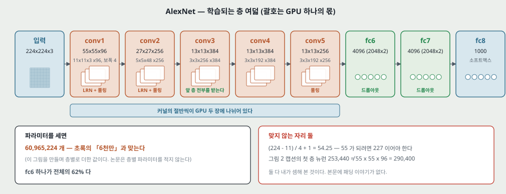

논문 3.5절과 그림 2 가 적는 값을 그대로 옮긴다. 괄호 안은 **GPU 하나가 맡는 몫**이다.

| 층 | 무엇 | 커널 | 출력 | 뒤에 붙는 것 |
|---|---|---|---|---|
| 입력 | 224×224×3 | — | 150,528 차원 | — |
| conv1 | 합성곱, **보폭 4** | 11×11×3 커널 96 개 | 55×55×96 (48×2) | LRN → 최댓값 풀링 |
| conv2 | 합성곱 | 5×5×48 커널 256 개 | 27×27×256 (128×2) | LRN → 최댓값 풀링 |
| conv3 | 합성곱 | 3×3×256 커널 384 개 | 13×13×384 (192×2) | — |
| conv4 | 합성곱 | 3×3×192 커널 384 개 | 13×13×384 (192×2) | — |
| conv5 | 합성곱 | 3×3×192 커널 256 개 | 13×13×256 (128×2) | 최댓값 풀링 |
| fc6 | 완전연결 | — | 4096 (2048×2) | 드롭아웃 |
| fc7 | 완전연결 | — | 4096 (2048×2) | 드롭아웃 |
| fc8 | 완전연결 | — | 1000 | 소프트맥스 |

**연결 규칙이 GPU 를 따라 갈린다.** conv2 · conv4 · conv5 의 커널은 **같은 GPU 에 있는 커널 지도만** 받고, **conv3 만 앞 층 전부**를 받는다. 완전연결 층은 앞 층 전부를 받는다. **LRN 은 conv1 과 conv2 뒤에만** 있고, **최댓값 풀링은 두 LRN 뒤와 conv5 뒤** 셋이다. **ReLU 는 여덟 층 전부의 출력에 붙는다.**

**파라미터가 어디에 있는지도 세어 두었다.** 층별로 더하면 **60,965,224 개**로 초록의 「6천만」과 맞고, **fc6 하나가 전체의 61.9%**, 합성곱 다섯을 다 더해도 3.8% 다. 드롭아웃을 fc6 · fc7 에만 건 이유가 여기서 읽힌다. (층별 파라미터는 논문에 없고 내가 센 것이다.)

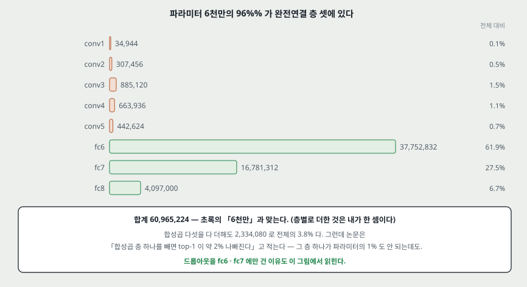

**목적 함수는 다항 로지스틱 회귀**다 — 곧 예측 분포에서 정답 라벨의 로그 확률을 학습 사례에 걸쳐 평균한 값을 키운다.

---

## 6. 새로 넣은 것 넷 — 저자가 중요도 순으로 늘어놓았다

논문 3절이 **"우리가 중요하다고 본 순서대로, 가장 중요한 것을 먼저"** 놓았다고 적는다. 그 순서가 이렇다.

### 6.1 ReLU — 가장 중요하다고 꼽은 것

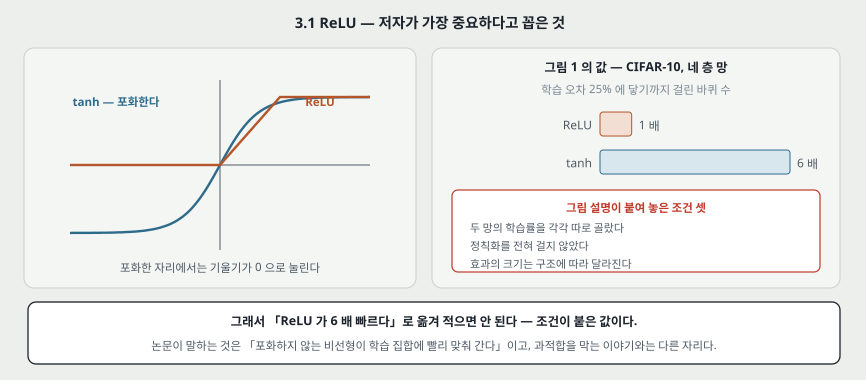

$\tanh(x)$ 나 $(1+e^{-x})^{-1}$ 는 **포화**하고, $\max(0,x)$ 는 포화하지 않는다. 기울기 하강으로 재면 포화하는 쪽이 훨씬 느리다고 적는다.

**그림 1 의 값.** CIFAR-10 에서 **네 층 합성곱 망**이 **학습 오차 25% 에 닿기까지**, ReLU 쪽이 tanh 쪽보다 **여섯 배 빨랐다.** 그림 설명이 조건을 셋 적어 둔다 — **두 망의 학습률을 각각 따로 골랐고**, **정칙화를 전혀 걸지 않았고**, **효과의 크기는 구조에 따라 달라진다.**

논문이 이 자리에서 남의 결과와 자기 결과를 가른다. Jarrett 등이 $|\tanh(x)|$ 가 잘 맞는다고 적은 것은 **Caltech-101 처럼 과적합을 막는 것이 주 관심인 데이터**에서의 이야기라, **학습 집합에 빨리 맞춰 가는 능력**을 말하는 이 논문의 관찰과는 다른 것이라고 적는다.

### 6.2 GPU 둘로 쪼개기

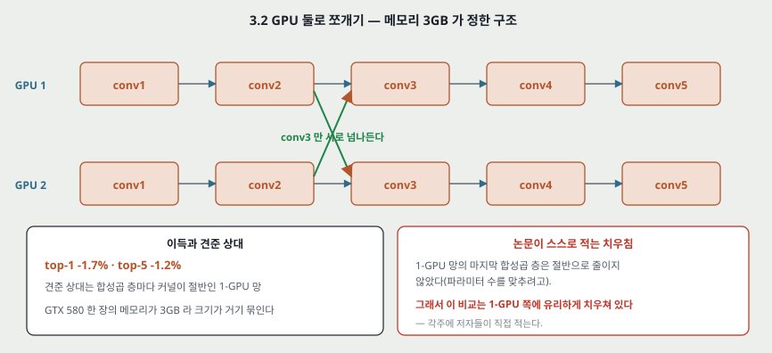

GTX 580 한 장의 메모리가 **3GB** 라 망 크기가 거기 묶인다. 그래서 **커널의 절반씩을 GPU 두 장에 나눠 얹고, 어떤 층에서만 서로 넘나들게** 했다. 어느 층에서 넘나들게 할지는 교차 검증으로 고를 문제라고 적는다.

**이득: top-1 −1.7% · top-5 −1.2%.** 견준 상대는 **합성곱 층마다 커널이 절반인 1-GPU 망**이다.

**논문이 이 비교의 치우침을 스스로 각주에 적는다.** 1-GPU 망의 마지막 합성곱 층은 절반으로 줄이지 않았고(파라미터의 대부분이 그 뒤 첫 완전연결 층에 있어서 둘의 파라미터 수를 맞추려고 그렇게 했다), **그래서 이 비교는 1-GPU 쪽에 유리하게 치우쳐 있다**고 적는다.

### 6.3 국소 반응 정규화

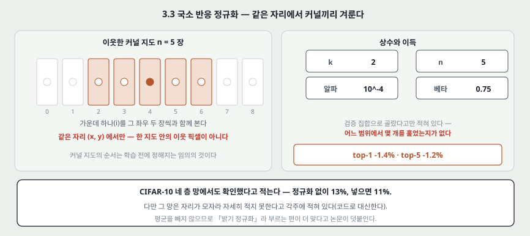

ReLU 는 포화하지 않으니 입력을 정규화할 필요가 없지만, **그래도 다음 정규화가 일반화를 돕는다**고 적는다.

$$b^i_{x,y} = a^i_{x,y} \Big/ \Big(k + \alpha \sum_{j=\max(0,\,i-n/2)}^{\min(N-1,\,i+n/2)} (a^j_{x,y})^2\Big)^{\beta} \qquad (1)$$

합은 **같은 자리 $(x,y)$ 의 이웃한 커널 지도 $n$ 장**에 걸쳐 돈다. $N$ 은 그 층의 커널 수다. **커널 지도의 순서는 학습 전에 정해지는 임의의 것**이라고 논문이 못박는다.

- 상수는 검증 집합으로 골랐고 **$k=2$, $n=5$, $\alpha=10^{-4}$, $\beta=0.75$** 다.
- **이득: top-1 −1.4% · top-5 −1.2%.**
- CIFAR-10 에서도 확인했다고 적는다 — **네 층 합성곱 망이 정규화 없이 13%, 넣으면 11%.**
- 이름에 대해 한 줄 — 평균을 빼지 않으므로 **「밝기 정규화」라고 부르는 편이 더 맞다**고 적는다.

### 6.4 겹치는 풀링

풀링 유닛을 $s$ 픽셀 간격으로 놓고 각각이 $z \times z$ 를 요약한다. $s = z$ 면 보통 풀링이고 $s < z$ 면 겹친다. **이 논문은 $s=2$, $z=3$ 을 망 전체에 쓴다.**

- **이득: top-1 −0.4% · top-5 −0.3%.** 견준 상대는 **출력 크기가 같은 $s=2$, $z=2$** 다.
- 그리고 관찰 하나 — **겹치는 풀링을 쓴 모델이 과적합되기가 더 어렵더라**고 적는다(논문의 말이 "slightly more difficult" 이고 숫자는 없다).

---

## 7. 과적합을 줄인 둘

파라미터가 6천만인데 **ILSVRC 의 1000 부류는 사례 하나가 이미지→라벨 대응에 10 비트의 제약만 건다.** 그래서 120만 장으로도 모자란다고 적는다.

### 7.1 데이터 늘리기

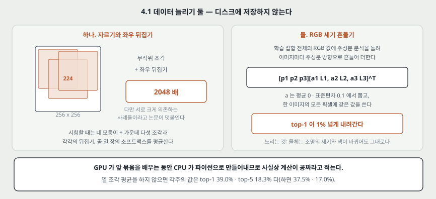

**첫째, 자르기와 좌우 뒤집기.** 256×256 에서 **224×224 조각을 무작위로 뽑고 좌우 뒤집은 것까지** 쓴다. 이것이 학습 집합을 **2048 배**로 불린다. 다만 논문이 바로 덧붙인다 — **그렇게 나온 사례들은 물론 서로 크게 의존한다.**

**시험할 때는 열 조각을 평균한다** — 네 모퉁이와 가운데의 224×224 다섯 조각에 각각의 좌우 뒤집기를 더한 열 장의 소프트맥스를 평균한다. **각주가 이 평균을 하지 않았을 때의 값도 적어 둔다: 39.0% 와 18.3%**(평균하면 37.5% 와 17.0%).

**둘째, RGB 세기 흔들기.** 학습 집합 전체의 RGB 값에 주성분 분석을 돌려, 이미지마다 주성분 방향으로 크기를 흔들어 더한다.

$$[\mathbf{p}_1, \mathbf{p}_2, \mathbf{p}_3][\alpha_1\lambda_1, \alpha_2\lambda_2, \alpha_3\lambda_3]^{\mathsf T} \qquad (2)$$

$\alpha_i$ 는 평균 0 · 표준편차 0.1 의 정규분포에서 뽑고, **한 이미지에 대해 한 번 뽑아 그 이미지의 모든 픽셀에 같은 값을 쓴다.** 노리는 것은 **물체가 무엇인지는 조명의 세기와 색이 바뀌어도 그대로라는 성질**이다. **이득: top-1 이 1% 넘게 내려간다.**

두 방법 모두 **변환한 이미지를 디스크에 저장하지 않는다** — GPU 가 앞 묶음을 배우는 동안 CPU 가 파이썬으로 만들어내므로 **사실상 계산이 공짜**라고 적는다.

### 7.2 드롭아웃

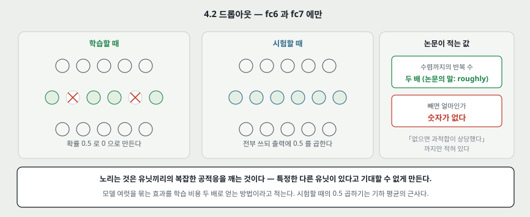

모델 여럿의 예측을 묶는 것은 시험 오차를 줄이는 아주 좋은 방법이지만 **며칠씩 걸리는 큰 망에는 너무 비싸다.** 드롭아웃은 **학습 비용을 두 배쯤 늘리는 값으로 그 묶음 효과를 내는 방법**이라고 적는다.

- 은닉 유닛의 출력을 **확률 0.5 로 0** 으로 만든다. 떨어진 유닛은 순방향에도 역전파에도 끼지 않는다.
- 그래서 입력마다 **다른 구조를 뽑아 쓰되 가중치는 모두 공유**한다.
- 노리는 것은 **유닛끼리의 복잡한 공적응을 깨는 것**이다 — 특정한 다른 유닛이 있다고 기대할 수 없으니 여러 부분집합과 함께 쓸모 있는 특징을 배우게 된다.
- 시험할 때는 전부 쓰되 **출력에 0.5 를 곱한다.** 지수적으로 많은 드롭아웃 망들의 예측 분포의 기하 평균에 대한 **적당한 근사**라고 적는다.
- **fc6 과 fc7 둘에만** 쓴다. 없으면 과적합이 상당했고, **쓰면 수렴까지의 반복 수가 두 배가 된다** — 논문이 쓴 말이 "roughly doubles" 이고 정확한 값은 적혀 있지 않다.

---

## 8. 학습 설정

논문 5절의 값을 그대로 옮긴다. 다시 돌려 보려면 이 절이 필요하다.

| 무엇 | 값 |
|---|---|
| 최적화 | 확률적 기울기 하강, 묶음 **128**, 관성 **0.9**, 가중치 감쇠 **0.0005** |
| 갱신 규칙 | $v_{i+1} = 0.9\,v_i - 0.0005\,\epsilon\,w_i - \epsilon \langle \partial L/\partial w \rangle_{D_i}$, $w_{i+1} = w_i + v_{i+1}$ |
| 초기화 | 평균 0 · 표준편차 **0.01** 의 정규분포 |
| 바이어스 초기화 | **conv2 · conv4 · conv5 와 완전연결 은닉층은 1**, 나머지는 0 |
| 학습률 | 모든 층에 같은 값. **0.01 에서 시작**해 **검증 오차가 더 내려가지 않으면 10 으로 나눈다.** 끝날 때까지 **세 번** 내렸다 |
| 길이 | 120만 장을 **약 90 바퀴**, GTX 580 3GB **두 장에 5~6 일** |

**가중치 감쇠에 대한 한 줄이 이 절에서 가장 눈에 띈다.** 논문이 이렇게 적는다 — **이 작은 가중치 감쇠가 모델이 배우는 데 중요했다. 곧 여기서 가중치 감쇠는 단순한 정칙화가 아니라 학습 오차를 줄인다.**

**바이어스를 1 로 둔 이유도 적혀 있다** — **ReLU 에 양의 입력을 주어 학습 초기를 빠르게** 하려는 것이다.

---

## 9. 결과

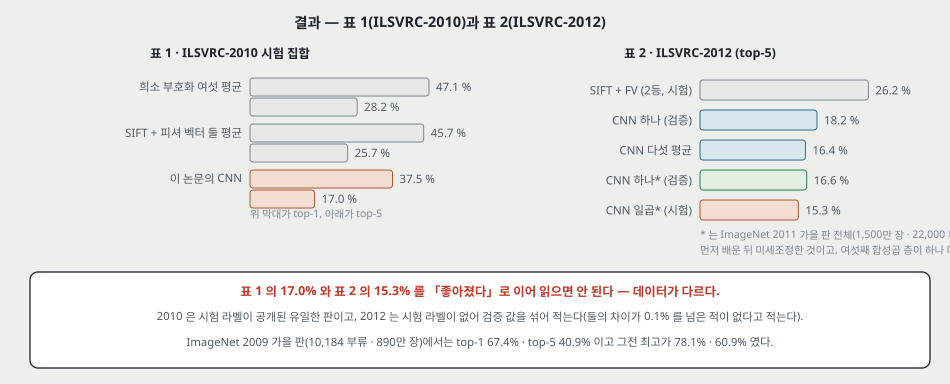

### 표 1 — ILSVRC-2010 시험 집합

| 모델 | top-1 | top-5 |
|---|---|---|
| 희소 부호화(Sparse coding), 여섯 모델 평균 | 47.1% | 28.2% |
| SIFT + 피셔 벡터, 두 분류기 평균 | 45.7% | 25.7% |
| **이 논문의 CNN** | **37.5%** | **17.0%** |

앞의 둘 중 첫째가 **대회 당시 최고**이고 둘째가 **그 뒤 발표된 최고**라고 갈라 적는다.

### 표 2 — ILSVRC-2012 (시험 라벨이 공개되지 않아 검증 값을 함께 적는다)

| 모델 | top-1 (검증) | top-5 (검증) | top-5 (시험) |
|---|---|---|---|
| SIFT + 피셔 벡터 (2등) | — | — | 26.2% |
| CNN 하나 | 40.7% | 18.2% | — |
| CNN 다섯 평균 | 38.1% | 16.4% | 16.4% |
| CNN 하나* | 39.0% | 16.6% | — |
| **CNN 일곱\*** | **36.7%** | **15.4%** | **15.3%** |

**별표가 붙은 것은 ImageNet 2011 가을 판 전체(1,500만 장 · 22,000 부류)로 먼저 배운 뒤 ILSVRC-2012 에 맞춰 미세조정한 것**이고, 그 망에는 **마지막 풀링 층 위에 여섯째 합성곱 층**이 하나 더 있다.

논문은 검증 오차와 시험 오차를 **0.1% 넘게 차이 난 적이 없어서 섞어 쓴다**고 적어 둔다.

### 그리고 또 하나 — ImageNet 2009 가을 판

부류 10,184 개 · 890만 장에서 **top-1 67.4% · top-5 40.9%** 이고, 그전까지 발표된 최고가 **78.1% · 60.9%** 였다. 절반을 학습, 절반을 시험으로 쓰는 관례를 따랐지만 **나눈 방식이 앞선 연구와 같지는 않다**고 적는다.

---

## 10. 질적 평가

**그림 3 — 첫 층이 배운 커널 96 개.** 주파수와 방향을 고르는 커널들과 색 얼룩들이 보인다. 그리고 이 논문에서 가장 자주 인용되는 관찰 하나 — **GPU 1 쪽 커널은 대체로 색과 무관하고 GPU 2 쪽은 대체로 색에 특화된다.** 논문은 이 갈림이 **실행할 때마다 나타나고 가중치 초기화와 무관**하다고 적는다(GPU 번호가 바뀌는 것 빼고).

**그림 4 왼쪽 — top-5 예측.** 물체가 가운데에서 벗어난 경우(왼쪽 위의 진드기)도 알아본다. 표범에 대해 그럴듯하다고 꼽힌 라벨이 **다른 고양이과 동물들뿐**이다.

**그림 4 오른쪽 — 마지막 은닉층 4096 차원에서의 최근접.** 시험 이미지와 그 벡터가 가까운 학습 이미지 여섯 장을 보인다. **픽셀 수준에서는 L2 로 가깝지 않다** — 찾아온 개와 코끼리는 자세가 제각각이다.

여기서 논문이 다음 일을 하나 제안한다. **4096 차원 실수 벡터로 유클리드 거리를 재는 것은 비효율적이지만, 자동부호기를 학습해 짧은 이진 코드로 줄이면 효율적으로 만들 수 있다**는 것이다. 그리고 그것이 **날 픽셀에 자동부호기를 거는 것보다 나은 이미지 검색 방법**일 것이라고 적는다 — 날 픽셀 쪽은 라벨을 쓰지 않아 **의미가 닮았든 아니든 모서리 무늬가 닮은 것을 찾아오기 때문**이다.

---

## 11. 깊이가 값을 한다

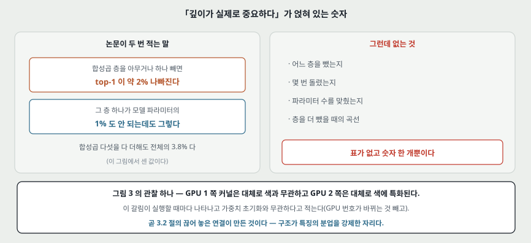

2절과 7절에 같은 말이 두 번 나온다.

- **합성곱 층을 아무거나 하나 빼면 성능이 나빠진다.** 각 합성곱 층은 **모델 파라미터의 1% 도 안 되는데도** 그렇다.
- 7절이 그 크기를 적는다 — **가운데 층 하나를 빼면 top-1 이 약 2% 손해다.**
- 그래서 결론이 **"깊이가 실제로 중요하다"** 이다.

---

## 12. 이 논문이 스스로 적은 한계

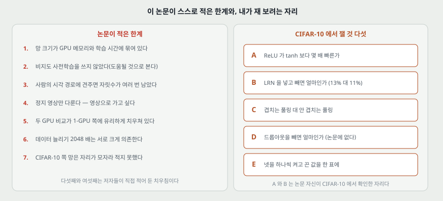

1. **망 크기가 GPU 메모리와 견딜 수 있는 학습 시간에 묶여 있다**(2절). 그리고 **더 빠른 GPU 와 더 큰 데이터를 기다리는 것만으로 결과가 좋아질 것**이라고 적는다.
2. **비지도 사전학습을 쓰지 않았다** — 실험을 단순하게 하려고 뺐고, **도움이 될 것으로 기대한다**고 적는다. 특히 **라벨 수를 그만큼 늘리지 않고 망을 크게 키울 계산력이 생기면** 그렇다.
3. **사람의 시각 경로에 견주면 아직 자릿수가 여러 번 남았다.**
4. **정지 영상만 다룬다.** 시간 구조가 도움을 주는 **영상(video)** 으로 가고 싶다고 적는다.
5. **두 GPU 비교가 1-GPU 쪽에 유리하게 치우쳐 있다**(3.2절 각주, 본인들이 적는다).
6. **데이터 늘리기로 나온 2048 배는 서로 크게 의존하는 사례들**이다(4.1절, 본인들이 적는다).
7. **CIFAR-10 쪽 망은 자리가 모자라 자세히 적지 못한다**(3.3절 각주) — 코드와 파라미터 파일로 대신한다.

---

## 13. 논문이 적지 않은 것 — 내가 읽으며 짚은 자리

**여기서부터는 논문의 말이 아니라 내 것이다.**

**하나. 224 로는 55 가 나오지 않는다.** 3.5절이 **224×224×3 입력을 11×11 커널로 보폭 4 로 훑는다**고 적고 그림 2 가 그 출력을 **55×55** 로 적는다. 그런데 $(224 - 11)/4 + 1 = 54.25$ 라 정수가 아니다. **227 이면 $(227-11)/4+1 = 55$ 로 정확히 맞는다.** 곧 입력이 227 이거나 패딩이 있어야 하는데 **본문에 그 말이 없다.** (이 셈은 내가 한 것이다.)

**둘. 첫 층 뉴런 수가 맞지 않는다.** 그림 2 캡션이 층별 뉴런 수를 **253,440–186,624–64,896–64,896–43,264–4096–4096–1000** 으로 적는다. 뒤의 넷은 맞아떨어진다 — $27^2 \times 256 = 186{,}624$, $13^2 \times 384 = 64{,}896$, $13^2 \times 256 = 43{,}264$. **그런데 첫 층은 $55^2 \times 96 = 290{,}400$ 이지 253,440 이 아니다.**

> 여덟을 그대로 더하면 **622,312** 이고, 첫 층을 290,400 으로 고쳐 더하면 **659,272** 다. 초록이 적는 **"650,000 뉴런"** 은 둘 사이에 있고 어느 쪽과도 정확히 맞지 않는다. (세 값 모두 내가 더한 것이다.)

**셋. 「층 하나를 빼면 top-1 이 약 2%」에 표가 없다.** 어느 층을 뺐는지, 몇 번 돌렸는지, 파라미터 수를 맞췄는지가 없다. **이 논문에서 가장 많이 인용되는 결론(깊이가 중요하다)이 숫자 한 개에 얹혀 있다.**

**넷. 새 요소 넷의 이득이 각각 따로만 재어져 있다.** ReLU · 두 GPU(−1.7) · LRN(−1.4) · 겹치는 풀링(−0.4) 인데, **둘 이상을 함께 끄거나 켠 행이 없다.** 그래서 세 값을 더해 4.5% 라고 읽으면 안 된다 — **상호작용이 없다는 가정이 재어져 있지 않다.**

**다섯. LRN 의 상수 넷을 검증 집합으로 골랐다고만 적는다.** $k, n, \alpha, \beta$ 를 **어느 범위에서 몇 개나 훑었는지**가 없다. 이득이 top-1 −1.4% 인데 그 탐색의 크기를 모르면 그 값을 다른 논문의 −1.4% 와 같은 칸에 놓기 어렵다.

**여섯. 드롭아웃을 뺀 최종 오차가 없다.** "없으면 과적합이 상당했다" 와 "반복 수가 두 배가 된다" 만 있고 **몇 퍼센트인지가 없다.** 넷 중 드롭아웃만 숫자로 된 이득이 안 적혀 있다.

**일곱. 그림 1 의 「여섯 배」는 조건이 붙은 값이다.** CIFAR-10 · 네 층 · 학습률을 각각 따로 고름 · 정칙화 없음 · 학습 오차 25% 라는 기준점. 논문 스스로 **효과의 크기가 구조에 따라 달라진다**고 적는다. **그래서 「ReLU 가 6배 빠르다」로 옮겨 적으면 안 된다.**

**여덟. 90 바퀴와 5~6 일이 어느 망의 것인지 갈려 있지 않다.** 표 2 의 별표 망들은 1,500만 장으로 먼저 배웠으니 시간이 더 들었을 텐데 그 값이 없다.

**아홉. ILSVRC-2010 과 2012 의 수를 한 줄에 놓기 어렵다.** 데이터가 다르고(2010 은 시험 라벨 공개, 2012 는 아님), 표 2 는 검증 값을 섞어 적는다. **표 1 의 17.0% 와 표 2 의 15.3% 를 「좋아졌다」로 이어 읽으면 안 된다** — 논문도 그렇게 적지 않는다.

---

## 14. 읽을 때 헷갈리는 지점

**하나. 224 인가 227 인가.** 위 13절 하나. 오늘날 구현들은 227 을 쓰거나 224 에 패딩 2 를 주고 내림으로 55 를 맞춘다.

**둘. 커널 깊이가 96 이 아니라 48 이다.** conv2 의 커널이 **5×5×48** 인 것은 GPU 하나가 앞 층의 절반(48 장)만 보기 때문이다. 같은 이유로 conv4 · conv5 가 3×3×192 다. **conv3 만 3×3×256 으로 앞 층 전부를 받는다.**

**셋. 그림 2 의 2048 은 층 크기가 아니라 GPU 하나의 몫이다.** 완전연결 층은 **4096** 이다.

**넷. LRN 은 같은 자리에서 커널 지도끼리 겨루는 것**이지, 한 지도 안의 이웃 픽셀끼리가 아니다.

**다섯. 「여섯 모델 평균」과 「CNN 다섯 평균」이 다른 종류의 묶음이다.** 앞은 다른 특징으로 배운 희소 부호화 모델들이고 뒤는 같은 구조의 망 다섯이다.

**여섯. 별표(\*)는 「사전학습」이지만 비지도 사전학습이 아니다.** ImageNet 2011 가을 판 **전체를 라벨로 분류하도록 배운 것**이다. 7절이 "비지도 사전학습은 쓰지 않았다"고 적는 것과 어긋나지 않는다.

**일곱. top-5 는 낮을수록 좋다.** 표에 적힌 것이 전부 **오차율**이다.

---

## 15. LeNet(1998) 과 맞춰 보기

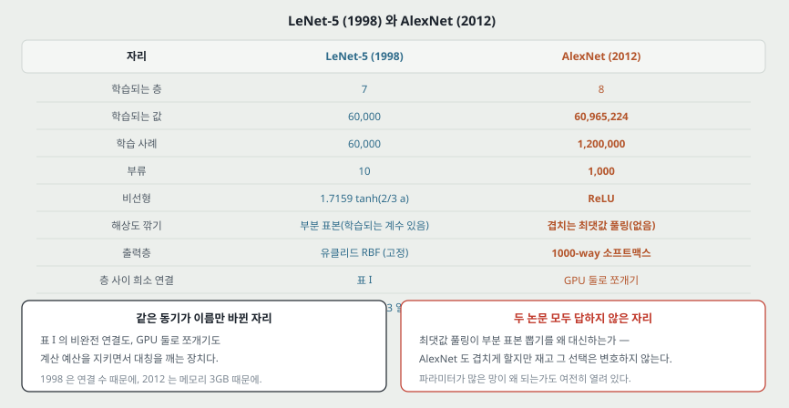

**열네 해 사이에 무엇이 그대로이고 무엇이 바뀌었는가.** 왼쪽이 LeNet-5, 오른쪽이 이 논문이다.

| 자리 | LeNet-5 (1998) | AlexNet (2012) | 성격 |
|---|---|---|---|
| 학습되는 층 | 7 | 8 | 비슷하다 |
| 학습되는 값 | 60,000 | **6천만** (1,000 배) | 바뀌었다 |
| 학습 사례 | 60,000 (왜곡 포함 600,000) | **120만** (자르기·뒤집기로 2048 배) | 바뀌었다 |
| 부류 | 10 | **1,000** | 바뀌었다 |
| 비선형 | $1.7159\tanh(\tfrac23 a)$ | **ReLU** | 바뀌었다 |
| 해상도 깎기 | 부분 표본 뽑기(**학습되는 계수와 바이어스가 있다**) | **겹치는 최댓값 풀링**(학습되는 값이 없다) | 바뀌었다 |
| 출력층 | 유클리드 RBF(파라미터 고정) | **1000-way 소프트맥스** | 바뀌었다 |
| 손실 | 식 9 의 판별 기준 | 다항 로지스틱 회귀 | 같은 성격이다 |
| 층 사이 희소 연결 | **표 I** 로 C3 를 S2 의 일부에만 | **GPU 둘로 쪼개기** | **동기가 같다** — 계산 예산과 대칭 깨기 |
| 2차 정보 | 확률적 대각 레벤버그-마콰르트 | 안 쓴다. 관성 + 손으로 내리는 학습률 | 바뀌었다 |
| 장비 | 200MHz R10000 하나로 CPU 2~3 일 | GTX 580 3GB 둘로 **5~6 일** | 시간은 그대로, 크기가 1,000 배 |

**LeNet 노트가 남긴 물음 둘이 여기서 답을 받는다.**

- **「부분 표본 뽑기의 학습되는 계수를 오늘날 버린 이유가 성능인가 계산인가」** — 이 논문은 최댓값 풀링을 쓰면서 **그 선택을 따로 변호하지 않는다.** 겹치게 할지 말지만 재고(−0.4/−0.3), **평균 대 최댓값**이나 **학습되는 계수를 둘지 말지**는 재지 않는다. 곧 **그 자리는 이 논문에서도 답이 안 난다.**
- **「파라미터가 많은 망이 왜 낮은 시험 오차를 내는가」** — 이 논문도 풀지 않는다. 대신 **과적합이 실제로 문제였다고 적고**(드롭아웃 없으면 상당했다) **장치로 막는다.**

---

## 16. 다음에 읽을 것

**한계를 적고 그 한계를 푼 것이 다음 논문이다.** 이 논문이 남긴 자리에서 셋을 꼽는다.

| 다음 | 이 논문의 어느 자리에서 나오는가 | 무엇을 확인하고 싶은가 |
|---|---|---|
| **더 깊게 · 커널을 작게 간 편** | 11절 — 「층을 빼면 나빠진다」가 숫자 하나에 얹혀 있다 | 깊이를 체계적으로 늘린 표가 있는가. 11×11 보폭 4 가 3×3 으로 바뀌는 이유는 무엇인가 |
| **LRN 을 버리고 다른 정규화로 간 편** | 6.3절 — 상수 넷을 검증으로 골랐고 이득이 −1.4% 다 | 무엇이 LRN 을 대신했고 그 근거가 무엇인가. 오늘날 LRN 을 안 쓰는 이유가 여기서 갈린다 |
| **자동부호기 계열** | 10절 — 4096 차원을 짧은 이진 코드로 줄이자고 이 논문이 제안한다 | 로드맵의 다음 칸(AE)과 바로 닿는다 |

읽는 순서로는 **첫째가 먼저**다. 이 논문의 결론(깊이가 중요하다)이 거기서 표로 서는지 아닌지가 갈리기 때문이다.

---

## 17. 돌려 볼 것

노트를 쓰며 나온 물음 중 **직접 잴 수 있는 것 다섯**을 실험 폴더로 옮겼다. 질문과 가설은 돌리기 전에 적었다.

**논문이 자기 장치를 CIFAR-10 의 네 층 망에서 확인한 자리가 둘 있다**(그림 1 의 ReLU, 6.3절의 LRN 13%→11%). **그 자리를 그대로 쓴다** — ImageNet 120만 장을 돌릴 수 없으니, **논문 자신이 작은 데이터에서 한 확인을 같은 데이터에서 다시 하는 것**이다.

| 무엇 | 13절의 어느 자리 | 묻는 것 |
|---|---|---|
| A | 일곱 | **ReLU 가 tanh 보다 몇 배 빠른가** — 학습 오차 25% 에 닿는 바퀴 수로 잰다 |
| B | 다섯 | **LRN 을 넣고 빼면 얼마인가** — 논문의 13% 대 11% 자리 |
| C | — | **겹치는 풀링($s{=}2,z{=}3$) 대 안 겹치는 것($s{=}2,z{=}2$)** — 논문의 −0.4/−0.3 자리 |
| D | 여섯 | **드롭아웃을 빼면 최종 오차가 얼마인가** — 논문에 숫자가 없는 자리 |
| E | 넷 | **넷을 하나씩 켜고 끈 값을 한 표에 놓는다** — 논문에 상호작용을 잰 행이 없다 |

**아직 돌리지 않았다.** 결과가 나오면 이 절에 인용 블록으로 적어 넣는다.

---

## 18. 물어 두는 것

- **입력이 224 인가 227 인가.** 저자 공개 코드(cuda-convnet)를 보면 갈릴 텐데 2012년 주소라 지금 열리는지 확인하지 않았다.
- **최댓값 풀링과 평균 풀링을 견준 값이 어디에 있는가.** LeNet 의 학습되는 계수가 사라진 자리인데 이 논문에도 없다.
- **드롭아웃을 빼면 top-1 이 몇이었는가.** 넷 중 이것만 이득이 숫자로 없다.
- **가중치 감쇠가 학습 오차를 줄였다는 관찰**은 정칙화의 보통 그림과 어긋난다. 이 자리를 설명한 편이 따로 있는지 찾아본다.

---

## 19. 참고 문헌

이 노트가 인용한 것은 저장한 원문 하나뿐이다.

- A. Krizhevsky, I. Sutskever, G. E. Hinton. ImageNet Classification with Deep Convolutional Neural Networks. NIPS 2012. (저장본 본문 1~8 쪽)

원문의 참고 문헌 26 건은 **읽지 않았다.** 본문이 부른 이름 중 이 노트가 옮긴 것은 Nair 와 Hinton(ReLU), Jarrett 등($|\tanh|$ 과 국소 대비 정규화), Cireşan 등(기둥 모양 CNN), 그리고 비교 상대로 나온 희소 부호화와 SIFT+피셔 벡터 쪽이고, **모두 본문이 그 맥락에서 부른 것만 옮겼다.**

---

## 20. 경로

| 무엇 | 어디 |
|---|---|
| 원문 PDF | `papers/NIPS12_AlexNet_ImageNet_Classification_with_Deep_Convolutional_Neural_Networks.pdf` |
| 이 노트 | `notes/NIPS12_AlexNet_ImageNet_Classification_with_Deep_Convolutional_Neural_Networks.md` |
| 그림과 그림을 만드는 코드 | `figures/NIPS12_AlexNet/` (`make_figures.py` 를 돌리면 SVG 가 다시 만들어진다) |
| 실험 | `experiments/alexnet_2012/` |
