# GAN — Generative Adversarial Nets (원 NIPS 2014 논문, 요약)

> **한 줄.** 생성기 $G$ 가 잡음 $z$ 를 표본 $G(z)$ 로 바꾸고 판별기 $D$ 가 진짜와 가짜를 가르게 한 뒤, 둘을 **가치 함수 하나 $V(D, G)$ 를 두고 한쪽은 올리고 한쪽은 내리는 최소최대 게임**으로 배운다. 밀도 함수 공간에서는 이 게임의 전역 최적이 $p_g = p_\text{data}$ 하나이고 그때 값이 $-\log 4$ 라는 것을 증명한다(정리 1). 다만 그 증명은 **$p_g$ 를 직접 움직일 때**의 것이고, 논문 스스로 「신경망 파라미터 $\theta_g$ 를 최적화하는 실제 학습에는 증명이 적용되지 않는다」고 적는다. 실험은 MNIST · TFD 의 Parzen 창 로그 가능도와 표본 그림이다.

> **이 노트와 앞 노트의 관계.** 같은 저자들의 **CACM 2020 개관판**을 먼저 읽고 노트를 썼다. 그 파일에는 식이 하나뿐이어서 가치 함수 · 최적 판별기 · JSD 를 **내가 유도해** 넣었다. 이 노트는 원판을 읽고 **그 유도가 원문과 같은지를 하나씩 맞춘다**(18절). 결과만 먼저 적으면 — 식 셋은 원문과 같고, 개관판 노트에서 **고쳐 적을 자리가 둘** 나왔다.

---

## Paper Metadata

| Item | Content |
|---|---|
| Title | Generative Adversarial Nets |
| Authors | Ian J. Goodfellow, Jean Pouget-Abadie, Mehdi Mirza, Bing Xu, David Warde-Farley, Sherjil Ozair, Aaron Courville, Yoshua Bengio |
| 소속 | 여덟 모두 Université de Montréal (DIRO). 각주로 Goodfellow 는 「지금은 Google 연구원이지만 이 일은 UdeM 학생 때 했다」, Pouget-Abadie 는 École Polytechnique 에서, Ozair 는 IIT Delhi 에서 방문 중이었다고 적는다 |
| Conference / Journal | Advances in Neural Information Processing Systems 27 (NIPS 2014) |
| Year | 2014. 파일 정보의 주제 칸이 「Neural Information Processing Systems」, 수정일이 2014-12-02 |
| 코드 | 각주 1: 「모든 코드와 초매개변수는 `github.com/goodfeli/adversarial` 에 있다」 |
| Stored PDF | `papers/NIPS14_GAN_Generative_Adversarial_Nets.pdf` (바탕화면에서 받은 이름은 `NIPS-2014-generative-adversarial-nets-Paper.pdf`) |
| 왜 읽었는가 | 앞서 읽은 CACM 2020 개관판에 가치 함수 · 증명 · 알고리즘 · 실험이 없어 그 노트의 식 절반이 내 유도였다. 그 노트가 「다음에 읽을 것」 첫째로 이 원판을 올렸다 |
| 읽은 범위 | **2026-10-04 에 9 쪽을 전부 읽었다.** 곧 초록 · 1~7절 · 그림 1~3 과 캡션 · 알고리즘 1 · 표 1 · 2 · 명제 1 · 정리 1 · 명제 2 와 증명 · 감사의 글 · 참고 문헌 29 건의 목록 |

### 저장한 파일의 상태

- **NIPS 학회 판 9 쪽**이다. 쪽 번호가 1~9 로 찍혀 있고 학회 책의 쪽(2672–2680)은 파일에 없다. 부록은 없다(원 논문에도 부록이 없는 것으로 보이나 확인하지 않았다).
- **글자 층이 살아 있다.** 식과 알고리즘의 첨자 · 괄호가 글자 뽑기에서 흩어져 4 · 5 쪽은 **150 dpi 로 띄워 맞췄다.** 그림 1 의 곡선은 손그림(잰 값이 아니다)이라 눈금을 읽지 않았다.
- **2절에 VAE 와 적대적 예시를 다루는 두 문단이 있다.** VAE 문단은 「이 일을 할 때 Kingma · Welling 과 Rezende 외의 규칙을 몰랐다」로 시작하고 「GANs」라는 줄임말을 쓴다 — arXiv 첫 판(2014-06)에 이 문단이 있었는지는 **확인하지 않았다.** 이 노트는 이 파일에 있는 그대로 옮긴다.
- **그림 2 · 3 은 표본 사진**이라 노트에는 원문에서 잘라 넣었다(15절).

---

## 1. 용어

이 노트에서 쓸 이름을 먼저 정한다. 논문의 원래 용어는 괄호로 함께 적는다. 앞 노트(CACM 개관판)와 같은 이름을 쓴다.

- **생성기 (generative model, generator)** $G(z; \theta_g)$: 잡음 $z$ 를 받아 데이터 공간의 점 $x = G(z)$ 를 내는 다층 퍼셉트론. 파라미터는 $\theta_g$. 작은 예시로(수는 내가 고른 것), 100 차원 균등 잡음을 784 차원 MNIST 이미지로 바꾸는 망.
- **잡음 사전분포 (prior on input noise)** $p_z(z)$: 생성기 입력의 분포. 그림 1 의 예에서는 균등분포다.
- **생성 분포** $p_g$: $z \sim p_z$ 일 때 $G(z)$ 가 따르는 분포. **$G$ 가 암묵적으로 정한다** — 식으로 적히지 않는다(4절 첫 문장).
- **판별기 (discriminative model, discriminator)** $D(x; \theta_d)$: 스칼라 하나를 내는 다층 퍼셉트론. $D(x)$ 는 「$x$ 가 $p_g$ 가 아니라 데이터에서 왔을 확률」이다. 작은 예시로, $D(x) = 0.9$ 면 진짜일 확률을 0.9 로 본다.
- **가치 함수 (value function)** $V(D, G)$: 식 (1). 판별기는 올리고 생성기는 내린다.
- **최소최대 게임 (minimax two-player game)**: 한 사람의 이득이 다른 사람의 손해인 두 사람 게임. 끝나는 자리는 **안장점** — 한 사람의 전략에 대해서는 최소, 다른 사람의 전략에 대해서는 최대인 점(2절).
- **최적 판별기** $D^*_G$: $G$ 를 고정했을 때 $V$ 를 가장 크게 하는 $D$. 식 (2).
- **가상 학습 기준 (virtual training criterion)** $C(G) = \max_D V(G, D)$: 판별기가 늘 최적이라고 보고 생성기만의 함수로 다시 적은 것. 식 (4).
- **KL 발산 · 젠슨-섀넌 발산 (JSD)**: $\text{KL}(P \Vert Q) = \mathbb{E}_P[\log P/Q]$. $\text{JSD}(P \Vert Q) = \frac{1}{2}\text{KL}(P \Vert M) + \frac{1}{2}\text{KL}(Q \Vert M)$, $M = \frac{1}{2}(P + Q)$. JSD 는 0 에서 $\log 2 = 0.693$ nat 사이. 작은 예시로, $\mathcal{N}(0,1)$ 과 $\mathcal{N}(1,1)$ 의 JSD 는 0.111 nat 이다.
- **Parzen 창 추정 (Gaussian Parzen window)**: 생성 표본 하나마다 표준편차 $\sigma$ 인 가우스를 얹어 평균 낸 것을 밀도로 쓰는 방법. 작은 예시로, 표본이 $\{-1, 1\}$ 둘이고 $\sigma = 1$ 이면 $x = 0$ 의 밀도는 $\mathcal{N}(0; -1, 1)$ 과 $\mathcal{N}(0; 1, 1)$ 의 평균인 0.242 다.
- **헬베티카 시나리오 (the Helvetica scenario)**: $G$ 가 너무 많은 $z$ 를 같은 $x$ 로 보내 다양성을 잃는 실패(6절). 오늘 흔히 **모드 붕괴**라고 부르는 것에 해당한다(이 대응은 내가 이은 것).
- **M-GAN · NS-GAN**: 앞 노트에서 정한 이름. 생성기가 $\log(1 - D(G(z)))$ 를 내리는 원래 꼴(식 1 그대로)과 $\log D(G(z))$ 를 올리는 대안(3절 끝). **이 논문은 두 이름을 쓰지 않는다.**

---

## 2. 한 문단 요약

깊은 생성 모델은 최대가능도를 쓰면 계산할 수 없는 확률 계산을 근사해야 했고, 판별 모델에서 성공한 조각 선형 유닛의 기울기를 생성 쪽에 쓰기도 어려웠다(1절). 이 논문은 생성기 $G$ 와 판별기 $D$ 를 둘 다 다층 퍼셉트론으로 두고, $D$ 는 진짜와 $G$ 의 표본을 가르는 확률을 높이고 $G$ 는 $D$ 가 틀릴 확률을 높이는 **최소최대 게임**으로 둘을 함께 배운다(식 1). 학습은 판별기 $k$ 걸음, 생성기 한 걸음을 번갈아 하는 미니배치 확률 기울기 하강이고 실험은 $k = 1$ 이다(알고리즘 1). 생성기가 서툰 초기에는 $\log(1 - D(G(z)))$ 가 포화하므로 $\log D(G(z))$ 를 올리게 바꿀 수 있다고 적는다(3절 끝). 이론은 밀도 함수 공간에서 선다 — $G$ 를 고정한 최적 판별기는 $p_\text{data} / (p_\text{data} + p_g)$ 이고(명제 1), 그것을 넣은 기준 $C(G)$ 는 $-\log 4 + 2 \cdot \text{JSD}$ 라 $p_g = p_\text{data}$ 에서만 최소이며(정리 1), 판별기를 매번 최적으로 두고 $p_g$ 를 조금씩 움직이면 $p_g$ 가 $p_\text{data}$ 로 수렴한다(명제 2). 그러나 실제로는 $\theta_g$ 를 최적화하므로 **증명이 적용되지 않는다**고 스스로 적는다. 실험은 MNIST · TFD · CIFAR-10 에서 배우고, Parzen 창 로그 가능도로 MNIST 225 · TFD 2057 을 보고하며(표 1), 마르코프 사슬 없이 뽑은 표본을 보인다(그림 2 · 3). 단점은 $p_g$ 를 식으로 갖지 않는 것과 $D$ 와 $G$ 를 맞춰 가야 한다는 것(헬베티카 시나리오), 장점은 마르코프 사슬도 추론도 없이 역전파만 쓴다는 것이다.

---

## 3. 문제와 비유 (1절)

**문제.** 1절은 그때까지 딥러닝의 큰 성공이 **판별 모델**(고차원 입력 → 부류 라벨)에 있었고, 그것이 역전파 · 드롭아웃 · 기울기가 잘 행동하는 조각 선형 유닛에 기대었다고 적는다. 깊은 **생성** 모델이 덜 성공한 이유를 둘로 든다.

1. 최대가능도 같은 전략에서 나오는 **계산할 수 없는 확률 계산**을 근사하기 어렵다.
2. **조각 선형 유닛의 이점**을 생성 쪽에서 살리기 어렵다.

**비유.** 생성 모델은 가짜 돈을 만들어 들키지 않고 쓰려는 위조범, 판별 모델은 가짜 돈을 잡으려는 경찰이다. 경쟁이 두 쪽 모두의 방법을 개선시켜 **가짜를 진짜와 가를 수 없을 때까지** 간다.

**이 논문이 다루는 특수한 경우.** 틀 자체는 여러 모델 · 최적화 알고리즘에 쓸 수 있지만, 이 논문은 **생성기가 무작위 잡음을 다층 퍼셉트론에 통과시켜 표본을 내고 판별기도 다층 퍼셉트론인** 경우만 다루고 이것을 「적대 망(adversarial nets)」이라 부른다. 그러면 두 모델을 역전파와 드롭아웃만으로 배우고, 생성기에서 **앞방향 계산만으로** 표본을 뽑는다. 근사 추론도 마르코프 사슬도 필요 없다.

---

## 4. 관련 연구 (2절) — 원문이 견주는 여섯

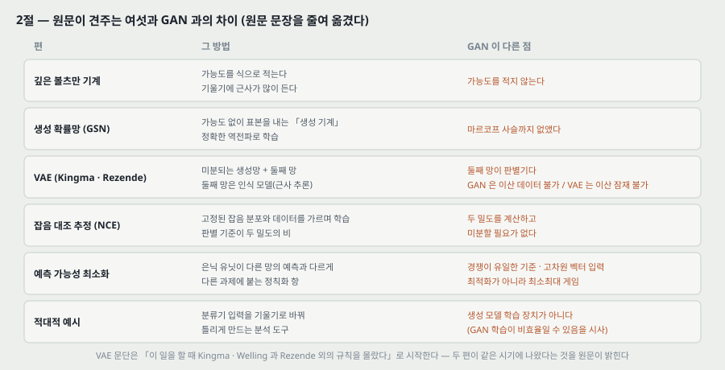

2절은 여섯 갈래를 견준다. 원문 문장을 줄여 옮긴다.

| 편 | 원문이 적는 그 방법 | GAN 과 다른 점 (원문) |
|---|---|---|
| 깊은 볼츠만 기계 [25] | 확률 분포를 파라미터 식으로 적고 로그 가능도를 최대화. 가능도를 계산할 수 없어 기울기에 근사가 많이 든다 | 가능도를 적지 않는다 |
| 생성 확률망 GSN [4] | 가능도를 나타내지 않고 표본을 내는 「생성 기계」. 볼츠만 기계의 근사 대신 정확한 역전파 | **GSN 의 마르코프 사슬을 없앤다** |
| VAE [18, 23] | 미분되는 생성망 + 둘째 망. 둘째 망은 근사 추론을 하는 인식 모델 | 둘째 망이 판별기다. **GAN 은 보이는 유닛을 거쳐 미분해야 해서 이산 데이터를 못 다루고, VAE 는 숨은 유닛을 거쳐 미분해야 해서 이산 잠재 변수를 못 갖는다** |
| 잡음 대조 추정 NCE [13] | 고정된 잡음 분포와 데이터를 가르는 데 쓸모 있게 가중치를 배운다. 앞서 배운 모델을 잡음으로 쓰면 점점 나은 모델의 열 | NCE 의 「판별기」는 잡음 분포와 모델 분포의 **밀도 비**로 정의돼 두 밀도를 계산하고 미분해야 한다 |
| 예측 가능성 최소화 PM [26] | 은닉 유닛 각각이 다른 은닉 유닛으로 그것을 예측하는 둘째 망의 출력과 **다르도록** 배운다 | 셋이 다르다 — (1) GAN 은 경쟁이 **유일한** 학습 기준이고 PM 은 다른 과제에 붙는 정칙화 항이다 (2) PM 은 스칼라 출력 둘을 비교하고 GAN 은 한 망이 낸 고차원 벡터가 다른 망의 입력이 된다 (3) PM 은 목적 함수를 최소화하는 **최적화**, GAN 은 **최소최대 게임**이다 |
| 적대적 예시 [28] | 분류기 입력에 직접 기울기 최적화를 해 데이터와 비슷하면서 틀리게 분류되는 예시를 찾는다 | 생성 모델을 배우는 장치가 아니라 분석 도구다. 다만 그런 예시가 있다는 것은 **GAN 학습이 비효율적일 수 있음을 시사**한다 — 그 부류의 사람 눈에 보이는 속성을 흉내 내지 않고도 판별기가 확신할 수 있으므로 |

**기울기를 생성 과정에 흘리는 근거.** 원문은 이 관찰 하나를 적는다.

$$\lim_{\sigma \to 0} \nabla_x \mathbb{E}_{\epsilon \sim \mathcal{N}(0, \sigma^2 I)} f(x + \epsilon) = \nabla_x f(x) \qquad (\text{관찰})$$

곧 잡음을 더한 뒤 기댓값의 기울기는, 잡음이 작아지면 원래 함수의 기울기로 간다. 원문은 이어서 Kingma · Welling 과 Rezende 외가 **분산이 유한한 가우스를 거쳐서도, 공분산 파라미터까지** 역전파하는 더 일반적인 규칙을 냈는데 **이 일을 할 때 몰랐다**고 적는다. 그 규칙을 쓰면 이 논문에서 초매개변수로 둔 **생성기의 조건부 분산**을 배울 수도 있다고 덧붙인다.

> **읽는 법.** 「조건부 분산을 초매개변수로 두었다」는 문장은 생성기가 완전히 결정적이지 않은 꼴도 염두에 둔 것으로 읽힌다. 다만 5절은 「잡음은 생성기 맨 아래층 입력에만 넣었다」고 적으므로, **실험의 생성기는 결정적 함수 $G(z)$** 다.

---

## 5. 가치 함수 — 식 (1) (3절)

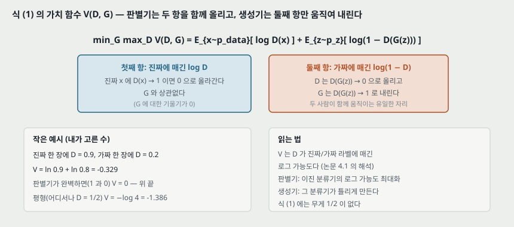

원문 식 (1) 을 그대로 옮긴다.

$$\min_G \max_D V(D, G) = \mathbb{E}_{x \sim p_\text{data}(x)}\left[\log D(x)\right] + \mathbb{E}_{z \sim p_z(z)}\left[\log\left(1 - D(G(z))\right)\right] \qquad (1)$$

원문의 말: $D$ 는 학습 예시와 $G$ 의 표본 **둘 다에 옳은 라벨을 매길 확률**을 최대화하도록 배우고, 동시에 $G$ 는 $\log(1 - D(G(z)))$ 를 최소화하도록 배운다.

**두 항이 하는 일.**

| 항 | 판별기 | 생성기 |
|---|---|---|
| 첫째 $\mathbb{E}_{p_\text{data}}[\log D(x)]$ | 진짜에 $D \to 1$ 로 올린다 | 관여하지 않는다(기울기 0) |
| 둘째 $\mathbb{E}_{p_z}[\log(1 - D(G(z)))]$ | 가짜에 $D \to 0$ 으로 올린다 | $D(G(z)) \to 1$ 로 내린다 |

**작은 예시.** 진짜 한 장에 $D = 0.9$, 가짜 한 장에 $D = 0.2$ 를 매기면 $V = \ln 0.9 + \ln 0.8 = -0.329$ 다. 판별기가 완벽하면(진짜 1, 가짜 0) $V = 0$ 이 위 끝이고, 평형에서 어디서나 $D = \frac{1}{2}$ 이면 $V = 2 \ln \frac{1}{2} = -\log 4 = -1.386$ 이다.

**판별기 쪽의 해석(4.1절).** $D$ 의 목표는 $Y$ 가 「$x$ 가 $p_\text{data}$ 에서 왔다($y = 1$) / $p_g$ 에서 왔다($y = 0$)」를 나타낼 때 조건부 확률 $P(Y = y \mid x)$ 를 추정하는 **로그 가능도 최대화**로 읽을 수 있다. 곧 판별기는 보통의 이진 분류기다.

> **무게.** 식 (1) 에는 두 항에 $\frac{1}{2}$ 무게가 없다. 진짜와 가짜를 같은 수(미니배치 $m$ 개씩)로 넣으므로 두 항의 비중이 같다(알고리즘 1).

---

## 6. 그림 1 — 학습이 어떻게 흘러가는가

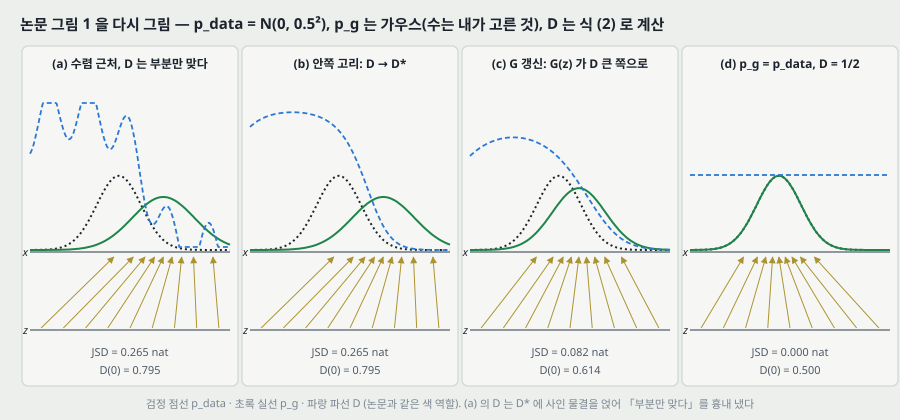

원문 그림 1 은 1 차원 예의 네 장면이다. **위 그림은 내가 같은 모양을 계산으로 다시 그린 것**이다($p_\text{data} = \mathcal{N}(0, 0.5^2)$, $p_g$ 는 가우스, 수는 내가 골랐다). 캡션을 옮긴다.

- 검정 점선 = 데이터 분포 $p_x$(캡션은 여기서만 $p_x$ 라고 적고 나머지는 $p_\text{data}$), 초록 실선 = 생성 분포 $p_g$, 파랑 파선 = 판별기 $D$.
- 아래 가로선 = $z$ 의 정의역(이 예에서 **균등**), 위 가로선 = $x$ 의 정의역 일부. 위로 가는 화살표가 $x = G(z)$ 가 균등하지 않은 $p_g$ 를 만드는 모습이다. **$G$ 는 $p_g$ 의 밀도가 높은 곳에서 수축하고 낮은 곳에서 팽창한다.**

| 장면 | 원문 캡션 | 내 계산 (위 그림) |
|---|---|---|
| (a) | **수렴에 가까운** 적대 쌍: $p_g$ 가 $p_\text{data}$ 와 비슷하고 $D$ 는 **부분적으로만 정확한** 분류기 | $p_g = \mathcal{N}(1.0, 0.7^2)$, JSD 0.265. $D$ 는 $D^*$ 에 물결을 얹어 흉내 냈다 |
| (b) | 안쪽 고리에서 $D$ 를 배워 $D^*(x) = \frac{p_\text{data}(x)}{p_\text{data}(x) + p_g(x)}$ 로 수렴 | 같은 $p_g$, $D^*(0) = 0.795$ |
| (c) | $G$ 를 갱신하면 $D$ 의 기울기가 $G(z)$ 를 **데이터로 분류될 가능성이 큰 곳**으로 흐르게 한다 | $p_g = \mathcal{N}(0.45, 0.6^2)$, JSD 0.082, $D^*(0) = 0.614$ |
| (d) | 몇 걸음 뒤, $G$ 와 $D$ 의 용량이 충분하면 둘 다 더 나아질 수 없는 점 — $p_g = p_\text{data}$, $D(x) = \frac{1}{2}$ | JSD 0, $D = 0.5$ |

> **개관판과 다른 자리.** CACM 개관판의 같은 그림 캡션은 (a) 를 「**초기화 때**의 쌍 — $p_\text{model}$ 은 단위 가우스, $D$ 는 무작위 초기화된 깊은 신경망」이라고 적는다. 원판의 (a) 는 「**수렴에 가까운** 쌍」이다. 두 판의 그림을 겹쳐 보지는 않았고 **캡션만 대조했다.** 그리고 원판 캡션에는 개관판의 「직관을 위한 만화(cartoon)」라는 말이 없지만, 곡선에 잰 값이 붙어 있지 않고 (a) 의 판별기가 물결 모양으로 그려져 있어 **손으로 그린 그림으로 읽힌다**(앞 노트 24절 물음 넷의 답 — 원판도 실제 학습 곡선이라고 적지 않는다).

---

## 7. 알고리즘 1 — 판별기 $k$ 걸음, 생성기 한 걸음

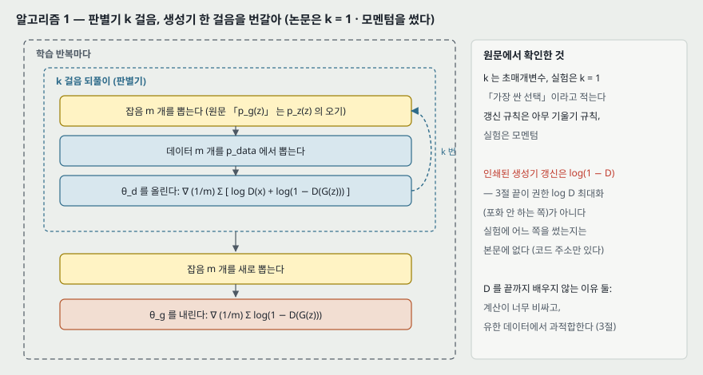

원문 알고리즘 1 을 옮긴다.

> 학습 반복마다
> - $k$ 걸음 동안
>   - 잡음 사전분포에서 잡음 $m$ 개 $\{z^{(1)}, \dots, z^{(m)}\}$ 을 뽑는다.
>   - 데이터 분포에서 예시 $m$ 개 $\{x^{(1)}, \dots, x^{(m)}\}$ 을 뽑는다.
>   - 판별기를 확률 기울기로 **올린다**: $\nabla_{\theta_d} \frac{1}{m} \sum_{i=1}^{m} \left[\log D(x^{(i)}) + \log\left(1 - D(G(z^{(i)}))\right)\right]$
> - 잡음 $m$ 개를 새로 뽑는다.
> - 생성기를 확률 기울기로 **내린다**: $\nabla_{\theta_g} \frac{1}{m} \sum_{i=1}^{m} \log\left(1 - D(G(z^{(i)}))\right)$

**원문이 적는 설정.**

- $k$ 는 초매개변수이고 **실험은 $k = 1$** — 「가장 싼 선택」이라고 적는다.
- 기울기 갱신 규칙은 표준 규칙이면 무엇이든 되고, **실험은 모멘텀**을 썼다.

**왜 안쪽 고리에서 $D$ 를 끝까지 배우지 않는가(3절).** 두 이유를 적는다 — 계산이 **엄두를 못 낼 만큼** 비싸고, 유한 데이터에서는 **과적합**한다. 대신 $D$ 를 $k$ 걸음, $G$ 를 한 걸음 번갈아 하면 「$G$ 가 충분히 천천히 바뀌는 한 $D$ 가 최적해 가까이 유지된다」고 적는다.

> **이 설명의 기준.** 「충분히 천천히」와 「최적해 가까이」에 기준이 붙어 있지 않다. 학습률과 $k$ 를 어떻게 골라야 그것이 성립하는지는 이 논문에 없다.

**인쇄된 것과 권한 것이 다르다.** 알고리즘 1 의 생성기 갱신은 $\log(1 - D(G(z)))$ 를 **내리는** 꼴, 곧 식 (1) 그대로다. 그런데 바로 앞 3절 끝은 이 꼴이 초기에 포화하니 $\log D(G(z))$ 를 **올리게** 바꿀 수 있다고 적는다(8절). **실험에서 어느 쪽을 썼는지는 본문에 적혀 있지 않다** — 각주 1 의 코드 저장소에 있을 것이고, 이 노트는 그것을 확인하지 않았다.

---

## 8. 포화와 대안 (3절 끝)

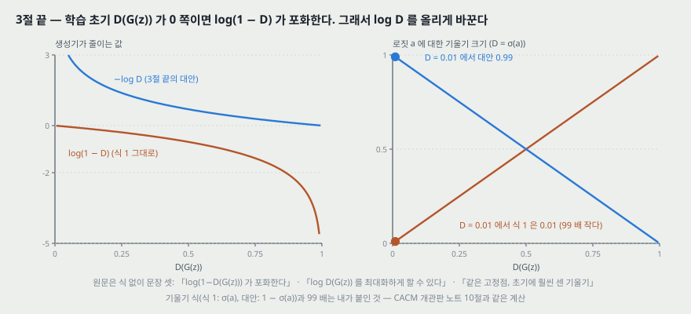

원문은 이 자리를 **식 없이 문장 셋**으로 적는다.

1. 실제로 식 (1) 은 $G$ 가 잘 배우기에 **충분한 기울기를 주지 않을 수 있다.** 학습 초기 $G$ 가 서툴 때 $D$ 는 표본을 **높은 확신으로** 거부할 수 있다 — 학습 데이터와 뚜렷이 다르므로. 이때 $\log(1 - D(G(z)))$ 가 **포화한다.**
2. $G$ 가 $\log(1 - D(G(z)))$ 를 최소화하는 대신 **$\log D(G(z))$ 를 최대화**하도록 배울 수 있다.
3. 이 목적 함수는 $G$ 와 $D$ 의 동역학에서 **같은 고정점**을 내지만 학습 초기에 **훨씬 센 기울기**를 준다.

**위 그림의 기울기 식과 수는 내가 붙인 것이다**(앞 노트 10절과 같은 계산). 판별기 마지막 출력을 로짓 $a$, $D = \sigma(a)$ 로 두면 생성기 비용의 $a$ 에 대한 기울기 크기는 식 (1) 쪽이 $\sigma(a) = D(G(z))$, 대안 쪽이 $1 - D(G(z))$ 다. 작은 예시로, $D(G(z)) = 0.01$ 이면 0.01 대 0.99 로 **99 배** 차이다. 원문의 문장 1(초기에 $D$ 가 확신 있게 거부 → 포화)과 **방향이 같다.**

**「같은 고정점」을 내가 확인한 것.** 원문은 이 문장에 증명을 붙이지 않는다. 두 갈래로 확인했다.

- **고정점 자체.** $p_g = p_\text{data}$ 이면 식 (2) 로 $D^* = \frac{1}{2}$ 이 **상수**다. $D$ 가 상수면 $\mathbb{E}_z[\log D(G(z))]$ 도 $\mathbb{E}_z[\log(1 - D(G(z)))]$ 도 $\theta_g$ 에 대한 기울기가 0 이다. 곧 두 꼴 모두 그 자리에서 멈춘다.
- **대안 꼴의 가상 기준.** $D = D^*_G$ 를 넣으면 대안이 줄이는 값은

$$\mathbb{E}_{x \sim p_g}\left[-\log D^*_G(x)\right] = \text{KL}(p_g \Vert p_\text{data}) - \text{KL}(p_g \Vert M) + \log 2 \qquad (\text{내 유도 1})$$

이다($M = \frac{1}{2}(p_\text{data} + p_g)$). KL 은 둘째 자리에 대해 볼록하므로 $\text{KL}(p_g \Vert M) \le \frac{1}{2}\text{KL}(p_g \Vert p_\text{data})$ 이고, 그래서 이 값은 $\log 2 + \frac{1}{2}\text{KL}(p_g \Vert p_\text{data})$ 이상이다. **최소는 $p_g = p_\text{data}$ 하나이고 값은 $\log 2$** 다.

수로 맞췄다($p_\text{data} = \mathcal{N}(0, 1)$, $p_g = \mathcal{N}(m, 1)$, 수치 적분).

| $m$ | 대안의 가상 기준 (직접 적분) | 내 유도 1 의 우변 | 하한 $\log 2 + \frac{1}{2}\text{KL}$ | 식 (1) 쪽 $2 \cdot \text{JSD}$ |
|---:|---:|---:|---:|---:|
| 0 | 0.6931 | 0.6931 | 0.6931 | 0.000 |
| 1 | 1.0817 | 1.0817 | 0.9431 | 0.222 |
| 2 | 2.3563 | 2.3563 | 1.6931 | 0.674 |
| 5 | 12.5172 | 12.5172 | 6.9431 | 1.353 |

**읽는 법.** 식 (1) 쪽 기준($-\log 4$ 를 뺀 $2 \cdot \text{JSD}$)은 $m = 5$ 에서 위 끝 $2 \log 2 = 1.386$ 의 97.6% 에 붙어 평평한데, 대안 쪽 기준은 $m$ 을 따라 계속 커진다(5 에서 12.52). **둘 다 $D$ 가 최적이라는 가정 위의 계산**이고, 실제 학습에서 이 차이가 얼마나 드러나는지는 이 계산이 말하지 않는다. 그리고 대안의 기준은 KL 과 KL 의 **차**라서, 정리 1 처럼 깔끔한 발산 하나로 묶이지 않는다.

> **앞 노트를 고칠 자리.** 개관판 노트 18절 둘은 「실제로 쓰는 쪽(NS-GAN)의 이론이 이 파일에 없다」고 적었다. 원판에는 **「같은 고정점」이라는 주장 한 문장**이 있다(증명은 없다). 「이론이 없다」보다 「고정점이 같다는 주장만 있고 수렴 분석은 없다」가 정확하다.

---

## 9. 명제 1 — 최적 판별기 (4.1절)

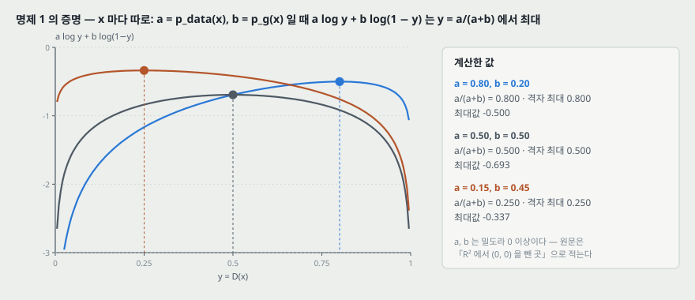

**명제 1.** $G$ 를 고정하면 최적 판별기는

$$D^*_G(x) = \frac{p_\text{data}(x)}{p_\text{data}(x) + p_g(x)} \qquad (2)$$

**원문의 증명.** $G$ 가 주어지면 $D$ 는 $V(G, D)$ 를 최대화한다. $z$ 에 대한 적분을 $x$ 에 대한 적분으로 바꿔 적으면

$$V(G, D) = \int_x p_\text{data}(x) \log(D(x))\,dx + \int_z p_z(z) \log(1 - D(g(z)))\,dz = \int_x \left[p_\text{data}(x) \log(D(x)) + p_g(x) \log(1 - D(x))\right] dx \qquad (3)$$

$(a, b) \in \mathbb{R}^2 \setminus \{0, 0\}$ 에 대해 함수 $y \mapsto a \log(y) + b \log(1 - y)$ 는 $[0, 1]$ 에서 $\frac{a}{a+b}$ 에 최대를 갖는다. 판별기는 $\text{Supp}(p_\text{data}) \cup \text{Supp}(p_g)$ 밖에서 정의될 필요가 없다. 증명 끝.

**위 그림은 그 함수를 세 짝으로 그리고 격자(간격 0.0001)에서 최대를 찾아 식과 맞춘 것이다.**

| $a$ | $b$ | $\frac{a}{a+b}$ | 격자 최대 자리 | 최대값 |
|---:|---:|---:|---:|---:|
| 0.80 | 0.20 | 0.800 | 0.800 | −0.500 |
| 0.50 | 0.50 | 0.500 | 0.500 | −0.693 |
| 0.15 | 0.45 | 0.250 | 0.250 | −0.337 |

**증명에서 짚을 둘.**

- **$x$ 마다 따로 최대화한다.** $D$ 가 **아무 함수나 될 수 있어야** 이 길이 선다 — 이 가정이 명제 1 의 문장에는 없고 4절 첫 문단의 「비모수 설정」에 있다.
- **$(a, b) \in \mathbb{R}^2$ 는 넓게 적은 것이다.** $a$ 나 $b$ 가 음수면 $[0, 1]$ 안에 최대가 없을 수 있다(예: $a = 1, b = -0.5$ 면 $y \to 1$ 로 갈수록 커진다). $a, b$ 는 밀도라 0 이상이므로 실제로는 $\mathbb{R}_{\ge 0}^2$ 다. 결론에는 영향이 없다.
- **식 (3) 의 첫 줄에 $D(g(z))$ 가 소문자 $g$ 로 적혀 있다** — $G$ 의 오기다.

---

## 10. 정리 1 — 전역 최적은 $p_g = p_\text{data}$ (4.1절)

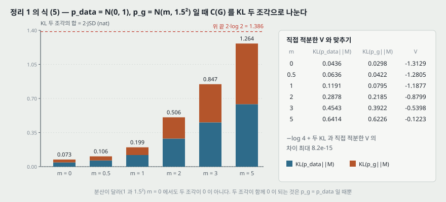

$D^*_G$ 를 식 (1) 에 넣으면 생성기만의 기준이 된다.

$$C(G) = \max_D V(G, D) = \mathbb{E}_{x \sim p_\text{data}}\left[\log \frac{p_\text{data}(x)}{p_\text{data}(x) + p_g(x)}\right] + \mathbb{E}_{x \sim p_g}\left[\log \frac{p_g(x)}{p_\text{data}(x) + p_g(x)}\right] \qquad (4)$$

(원문 식 (4) 는 네 줄이고 위는 마지막 줄이다. 셋째 줄에서 $z$ 의 기댓값을 $x \sim p_g$ 의 기댓값으로 바꾼다.)

**정리 1.** 가상 학습 기준 $C(G)$ 의 전역 최소는 **$p_g = p_\text{data}$ 일 때, 그리고 그때만** 닿는다. 그 자리에서 $C(G) = -\log 4$ 다.

**원문의 증명.** $p_g = p_\text{data}$ 이면 $D^*_G = \frac{1}{2}$ 이므로 $C(G) = \log \frac{1}{2} + \log \frac{1}{2} = -\log 4$. 이것이 가장 좋은 값이고 그 자리에서만 닿음을 보이려고, $\mathbb{E}_{p_\text{data}}[-\log 2] + \mathbb{E}_{p_g}[-\log 2] = -\log 4$ 를 $C(G) = V(D^*_G, G)$ 에서 빼면

$$C(G) = -\log(4) + \text{KL}\left(p_\text{data} \,\Big\Vert\, \frac{p_\text{data} + p_g}{2}\right) + \text{KL}\left(p_g \,\Big\Vert\, \frac{p_\text{data} + p_g}{2}\right) \qquad (5)$$

$$C(G) = -\log(4) + 2 \cdot \text{JSD}\left(p_\text{data} \Vert p_g\right) \qquad (6)$$

JSD 는 늘 0 이상이고 두 분포가 같을 때만 0 이므로 $C^* = -\log 4$ 가 전역 최소이고 유일한 해는 $p_g = p_\text{data}$ 다.

**수로 맞춘 것.** 위 그림은 $p_\text{data} = \mathcal{N}(0, 1)$, $p_g = \mathcal{N}(m, 1.5^2)$ 로 두고 식 (5) 의 두 KL 을 따로 적분한 것이다. **분산을 다르게 둔 것은 두 KL 이 같아지지 않게 하려는 것**이다(분산이 같으면 대칭이라 둘이 같다).

| $m$ | $\text{KL}(p_\text{data} \Vert M)$ | $\text{KL}(p_g \Vert M)$ | 식 (4) 를 직접 적분한 $C(G)$ |
|---:|---:|---:|---:|
| 0 | 0.0436 | 0.0298 | −1.3129 |
| 0.5 | 0.0636 | 0.0422 | −1.2805 |
| 1 | 0.1191 | 0.0795 | −1.1877 |
| 2 | 0.2878 | 0.2185 | −0.8799 |
| 3 | 0.4543 | 0.3922 | −0.5398 |
| 5 | 0.6414 | 0.6226 | −0.1223 |

여섯 $m$ 모두에서 $-\log 4 + $ 두 KL 과 직접 적분한 값의 차이가 최대 $8.2 \times 10^{-15}$ 다. **$m = 0$ 에서도 $C(G) \ne -\log 4$** 인 것은 평균이 같아도 분산(1 대 1.5²)이 달라 $p_g \ne p_\text{data}$ 이기 때문이다.

---

## 11. 명제 2 — 알고리즘 1 의 수렴, 그리고 그 거리 (4.2절)

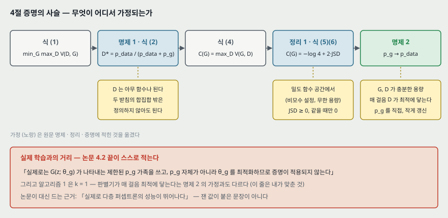

**명제 2.** $G$ 와 $D$ 가 충분한 용량을 갖고, 알고리즘 1 의 매 걸음에서 판별기가 주어진 $G$ 에 대해 **최적에 닿도록** 허용되고, $p_g$ 가 기준 $\mathbb{E}_{p_\text{data}}[\log D^*_G(x)] + \mathbb{E}_{p_g}[\log(1 - D^*_G(x))]$ 를 개선하도록 갱신되면, $p_g$ 는 $p_\text{data}$ 로 수렴한다.

**원문의 증명(요지).** $V(G, D) = U(p_g, D)$ 를 $p_g$ 의 함수로 본다. $U(p_g, D)$ 는 $p_g$ 에 대해 볼록하다(정확히는 **선형**이다 — $p_g$ 가 적분 안에 한 번만 곱해져 있다). 볼록 함수들의 상한(supremum)의 부분 미분은 최대가 닿은 점에서의 함수의 미분을 포함한다. 곧 $f(x) = \sup_{\alpha} f_\alpha(x)$ 이고 $f_\alpha$ 가 모두 볼록이면, $\beta = \arg\sup_\alpha f_\alpha(x)$ 일 때 $\partial f_\beta(x) \in \partial f$ 다. 이것은 **최적 $D$ 에서 $p_g$ 에 대한 기울기 하강을 하는 것과 같다.** $\sup_D U(p_g, D)$ 는 $p_g$ 에 대해 볼록이고 정리 1 로 유일한 전역 최적을 가지므로, **충분히 작은 갱신**으로 $p_g$ 가 $p_x$ 로 수렴한다.

**논문이 바로 뒤에 적는 거리.** 원문 그대로 옮긴다 — 「실제로 적대 망은 함수 $G(z; \theta_g)$ 를 거쳐 **제한된 $p_g$ 분포 가족**을 나타내고, 우리는 $p_g$ 자체가 아니라 **$\theta_g$ 를 최적화하므로 증명이 적용되지 않는다.** 그러나 실제로 다층 퍼셉트론의 뛰어난 성능은 이론적 보장이 없음에도 그것이 쓰기에 합리적인 모델임을 시사한다.」

### 11.1 볼록성이 어디서 깨지는가 — 내가 계산한 예

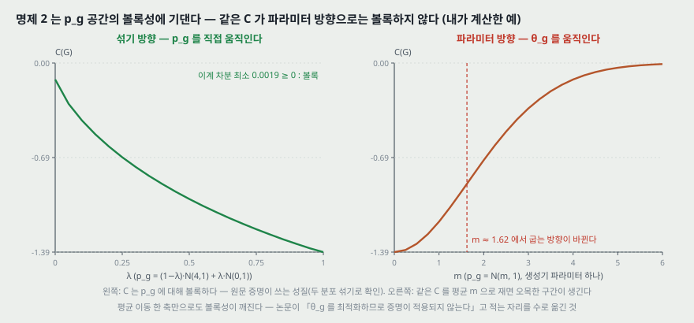

「$\theta_g$ 를 최적화하므로 증명이 적용되지 않는다」를 가장 작은 꼴로 옮겼다. $p_\text{data} = \mathcal{N}(0, 1)$ 로 두고 같은 $C(G)$ 를 두 방향으로 쟀다.

| 방향 | 어떻게 움직이나 | 결과 |
|---|---|---|
| **섞기** (원문 증명이 쓰는 방향) | $p_g = (1 - \lambda)\,\mathcal{N}(4, 1) + \lambda\,\mathcal{N}(0, 1)$, $\lambda$ 를 0 → 1 로 0.05 간격 | 이계 차분이 모두 0 이상(최소 0.0019) — **볼록** |
| **파라미터** (생성기가 실제로 움직이는 방향) | $p_g = \mathcal{N}(m, 1)$, 평균 $m$ 을 0 → 6 으로 0.25 간격 | 이계 차분이 $m$ = 1.5 와 1.75 사이에서 **양에서 음으로 바뀐다** — 그 너머는 오목 |

$C$ 는 $m = 0$ 에서 −1.3863, $m = 6$ 에서 −0.0077 이다. 곧 **파라미터 하나(평균 이동)만으로도 볼록성이 깨지고**, 모델이 멀리 있을 때 $C$ 가 위 끝($0$)에 붙어 평평해진다. 이 예는 $C$ 하나의 모양만 보인다 — 이 예에서는 최소가 하나뿐이라 국소 최소가 생기는 것까지 보이지는 않는다.

**짚을 셋.**

- **「충분히 작은 갱신」에 크기가 없다.** 학습률 조건 · 수렴 속도 · 걸음 수가 증명에 없다.
- **명제 2 의 가정과 알고리즘 1 의 설정이 다르다.** 명제는 「매 걸음 $D$ 가 최적에 닿는다」를 가정하는데, 실험은 $k = 1$ 이다(이 맞춤은 내가 한 것이다).
- **증명이 다루는 꼴은 식 (1) 쪽이다.** 8절의 대안 꼴은 $C$ 를 내리는 것이 아니므로 명제 2 가 그대로 덮지 않는다.

---

## 12. 실험 설정 (5절)

원문이 적는 것을 모두 옮긴다.

| 항목 | 원문 |
|---|---|
| 데이터셋 | MNIST, Toronto Face Database (TFD), CIFAR-10 |
| 생성기 활성 | ReLU 와 시그모이드를 **섞어** 썼다 |
| 판별기 활성 | maxout |
| 드롭아웃 | 판별기 학습에 썼다 |
| 잡음을 넣는 자리 | 이론은 생성기 중간층에 드롭아웃 · 잡음을 넣는 것을 허용하지만, **생성기 맨 아래층 입력에만** 넣었다 |
| $k$ · 최적화 | $k = 1$, 모멘텀 (알고리즘 1 캡션과 끝) |
| 코드 · 초매개변수 | 각주 1 의 저장소 |

**본문에 없는 것.** 층 수 · 폭 · 잡음 차원 · $p_z$ 의 종류(그림 1 예의 균등 말고) · 학습률 · 미니배치 크기 $m$ · 학습 걸음 수 · 학습 시간 · seed 수가 **본문에 없다.** 「모든 초매개변수는 저장소에 있다」는 각주가 전부다. 이 노트는 저장소를 읽지 않았으므로 이 값들을 옮기지 않는다.

---

## 13. 표 1 — Parzen 창 로그 가능도

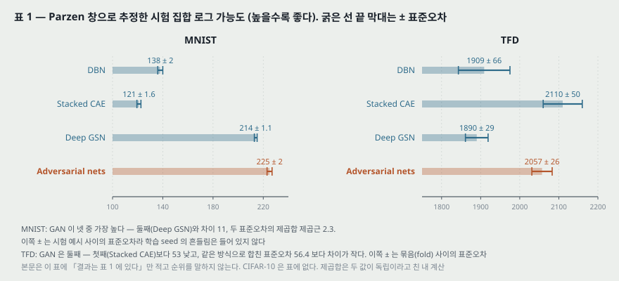

원문 표 1 을 옮긴다. 값이 클수록 시험 집합이 그 모델 아래에서 그럴듯하다.

| 모델 | MNIST | TFD |
|---|---:|---:|
| DBN [3] | 138 ± 2 | 1909 ± 66 |
| Stacked CAE [3] | 121 ± 1.6 | **2110 ± 50** |
| Deep GSN [5] | 214 ± 1.1 | 1890 ± 29 |
| **Adversarial nets** | **225 ± 2** | 2057 ± 26 |

**캡션이 적는 ± 의 뜻 — 두 데이터셋이 다르다.**

- **MNIST**: 시험 집합 표본의 평균 로그 가능도이고, ± 는 **예시들 사이에서 계산한 평균의 표준오차**다. 실수값(이진화하지 않은) MNIST 를 쓴 다른 모델들과 견준다.
- **TFD**: ± 는 **데이터셋의 묶음(fold) 사이에서 계산한 표준오차**이고, 묶음마다 검증 집합으로 다른 $\sigma$ 를 골랐다. 묶음 수는 캡션에 없다.

**읽는 법(내 계산).**

- **MNIST 에서 GAN 이 넷 중 가장 높다.** 둘째(Deep GSN 214)와 차이 11, 두 표준오차를 제곱합한 제곱근 2.3. 다만 이 ± 는 시험 예시가 바뀌는 흔들림이고 **학습을 다시 했을 때의 흔들림(seed)은 들어 있지 않다.**
- **TFD 에서 GAN 은 둘째다.** 첫째(Stacked CAE 2110)보다 53 낮고, 같은 방식으로 합친 표준오차 56.4 보다 차이가 작다. RULES 1 조대로 **두 모델의 순서를 매기지 않는다.**
- **CIFAR-10 은 표에 없다.** 그림 2 (c)(d) 의 표본만 있다.
- **논문 본문은 표 1 에 대해 「결과는 표 1 에 보고한다」만 적고 순위를 말하지 않는다.** 결론도 「틀이 쓸 만함을 보였다」에 머문다.

> **단위.** 캡션에 단위가 없다. 실수값 784 차원(MNIST) 위의 밀도라 로그 가능도가 양수일 수 있다(밀도는 1 을 넘을 수 있다). nat 으로 보이나 확인하지 않았다.

---

## 14. Parzen 창 추정 — 이 숫자는 무엇을 재는가

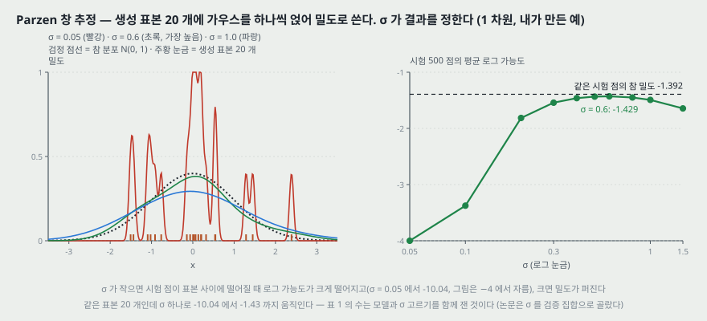

**원문의 방법(5절).** $G$ 로 만든 표본에 **가우스 Parzen 창**을 맞추고, 그 분포 아래에서 시험 집합의 로그 가능도를 보고한다. 가우스의 $\sigma$ 는 검증 집합으로 교차 검증해 골랐다. Breuleux 외 [7] 가 냈고, 가능도를 정확히 계산할 수 없는 여러 생성 모델에 쓰였다고 적는다.

$$\hat p(x) = \frac{1}{n} \sum_{j=1}^{n} \mathcal{N}\left(x;\, G(z^{(j)}),\, \sigma^2 I\right) \qquad (\text{Parzen})$$

**원문이 스스로 적는 한계.** 「이 추정 방법은 **분산이 꽤 크고 고차원 공간에서 잘 동작하지 않지만**, 우리가 아는 가장 나은 방법이다.」 그리고 표본은 뽑을 수 있지만 가능도를 직접 추정할 수 없는 생성 모델의 발전이 **그런 모델을 어떻게 평가할지에 대한 연구를 요구한다**고 적는다.

**위 그림 — $\sigma$ 가 수를 정한다(내가 만든 1 차원 예).** 참 분포 $\mathcal{N}(0, 1)$ 에서 「생성 표본」 20 개와 시험 점 500 개를 뽑았다.

| $\sigma$ | 0.05 | 0.1 | 0.2 | 0.3 | 0.5 | **0.6** | 0.8 | 1.0 | 1.5 |
|---|---:|---:|---:|---:|---:|---:|---:|---:|---:|
| 평균 로그 가능도 | −10.04 | −3.38 | −1.81 | −1.54 | −1.43 | **−1.43** | −1.45 | −1.49 | −1.64 |

같은 시험 점에서 참 밀도로 잰 값은 −1.39 다. **같은 표본 20 개가 $\sigma$ 하나로 −10.04 에서 −1.43 까지 움직인다.** 그래서 표 1 의 수는 생성 모델과 $\sigma$ 고르기를 **함께** 잰 것이다.

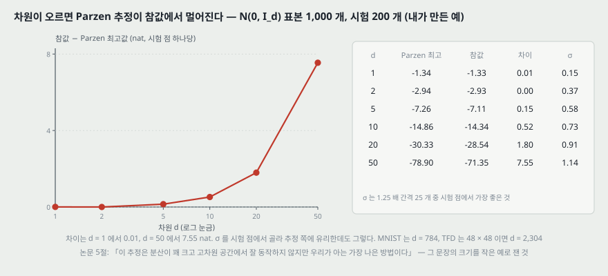

**「고차원에서 잘 동작하지 않는다」의 크기(내가 만든 예).** 참 분포 $\mathcal{N}(0, I_d)$ 에서 표본 1,000 개를 「완벽한 생성기의 표본」으로 쓰고, 시험 점 200 개에서 Parzen 추정과 참 밀도를 견줬다. $\sigma$ 는 1.25 배 간격 25 개 가운데 **시험 점에서 가장 좋은 것**을 골랐다(추정 쪽에 유리하게).

| $d$ | Parzen 최고 | 같은 시험 점의 참 밀도 | 차이 (nat, 시험 점 하나당) | 고른 $\sigma$ |
|---:|---:|---:|---:|---:|
| 1 | −1.34 | −1.33 | 0.01 | 0.15 |
| 2 | −2.94 | −2.93 | 0.00 | 0.37 |
| 5 | −7.26 | −7.11 | 0.15 | 0.58 |
| 10 | −14.86 | −14.34 | 0.52 | 0.73 |
| 20 | −30.33 | −28.54 | 1.80 | 0.91 |
| 50 | −78.90 | −71.35 | 7.55 | 1.14 |

**생성기가 완벽한데도** 차원이 50 이 되면 추정이 참값보다 7.55 nat 낮다. MNIST 는 $d = 784$(28×28), TFD 는 48×48 이면 $d = 2{,}304$ 다(두 크기 모두 원문에는 없고 데이터셋에 알려진 값이다). 이 예는 **추정의 치우침이 차원을 따라 커진다는 모양**만 보인다 — 표본 수 · 데이터 모양이 달라 표 1 의 숫자에 얼마가 섞였는지를 이 예로 셀 수는 없다.

---

## 15. 표본 — 그림 2 · 3

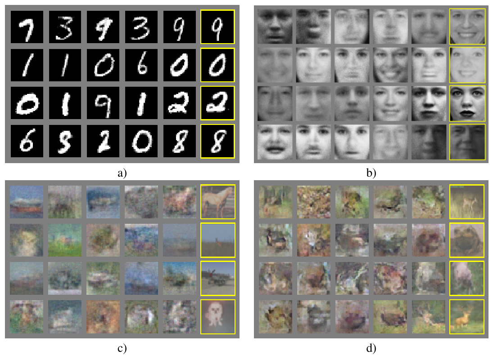

**원문 그림 2 를 PDF 에서 잘라 넣은 것이다**(200 dpi). a) MNIST b) TFD c) CIFAR-10 (완전연결 모델) d) CIFAR-10 (합성곱 판별기와 「역합성곱」 생성기).

캡션이 적는 것:

- **맨 오른쪽 열(노란 테)은 바로 옆 표본에 가장 가까운 학습 예시**다 — 모델이 학습 집합을 외우지 않았음을 보이려는 것.
- 표본은 **골라낸 것이 아니라 공정한 무작위 추출**이다.
- 다른 깊은 생성 모델 그림과 달리 **은닉 유닛 표본이 주어졌을 때의 조건부 평균이 아니라 모델 분포의 실제 표본**이다.
- 표본 뽑기가 마르코프 사슬의 섞임에 기대지 않으므로 **표본들끼리 상관이 없다.**

5절 본문은 이 표본이 기존 방법보다 낫다고 주장하지 않는다 — 「적어도 문헌의 더 나은 생성 모델들과 **견줄 만하다**고 믿는다」고 적는다.

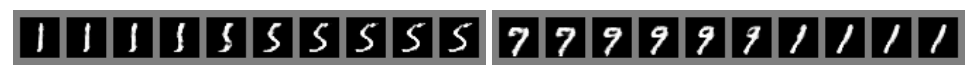

**원문 그림 3 을 잘라 넣은 것이다.** 「전체 모델의 $z$ 공간에서 좌표를 직선으로 보간해 얻은 숫자」. 두 줄이 있고, 내 눈으로 읽으면 왼쪽 열 개는 1 → 5, 오른쪽 열 개는 7 → 9 → 1 로 바뀐다. **어느 데이터셋 모델인지는 캡션에 「full model」 이라고만 있고, 숫자라 MNIST 로 읽힌다.**

> **내 눈으로 본 것 — 인상이다.** MNIST 표본은 획이 또렷하고, TFD 는 얼굴 모양이 보이지만 흐린 것이 섞여 있고, CIFAR-10 (c) 는 색 덩어리에 가깝고 (d) 는 그보다 윤곽이 있다. 잰 값이 붙은 판단이 아니다.

---

## 16. 장단점 (6절)과 표 2

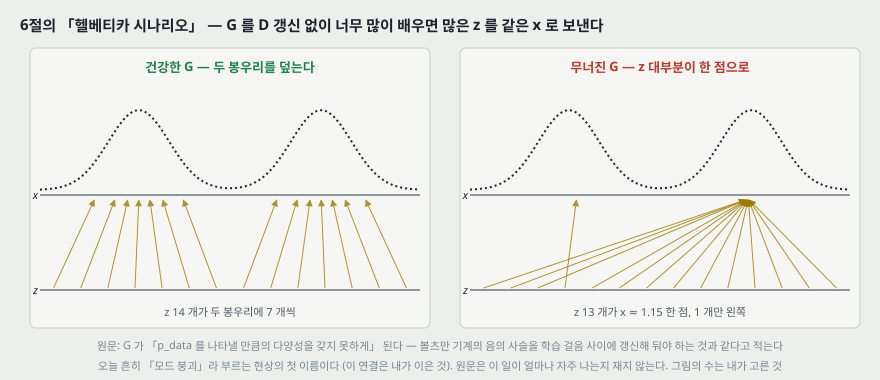

**단점 둘(원문).**

1. **$p_g(x)$ 의 명시적 표현이 없다.**
2. **$D$ 를 $G$ 와 잘 맞춰 가야 한다.** 특히 $D$ 를 갱신하지 않고 $G$ 를 너무 많이 배우면 안 된다 — 그러면 「**헬베티카 시나리오**」, 곧 $G$ 가 너무 많은 $z$ 값을 같은 $x$ 로 무너뜨려 $p_\text{data}$ 를 나타낼 만큼의 다양성을 잃는다. 볼츠만 기계의 음의 사슬을 학습 걸음 사이에 최신으로 유지해야 하는 것과 같다고 적는다.

위 그림의 수(z 14 개 중 13 개가 한 점)는 내가 고른 예다. **원문은 이 실패가 얼마나 자주 나는지 재지 않는다.**

**장점(원문).** 계산 쪽 — 마르코프 사슬이 필요 없고, 기울기는 역전파만으로 얻고, 학습 중 추론이 필요 없고, 다양한 함수를 모델에 넣을 수 있다. 통계 쪽 — 생성기가 **데이터 예시로 직접 갱신되지 않고 판별기를 거쳐 흐르는 기울기로만** 갱신되므로 입력의 성분이 생성기 파라미터로 직접 복사되지 않는다. 그리고 **아주 날카로운, 퇴화된 분포까지** 나타낼 수 있다 — 마르코프 사슬 기반 방법은 사슬이 모드 사이를 섞을 수 있도록 분포가 어느 정도 흐려야 한다.

> **「복사되지 않는다」의 근거.** 원문은 이것을 「통계적 이점을 얻을 **수도** 있다」로 적고 재지 않는다. 그림 2 의 가장 가까운 학습 예시가 그 근거의 전부로 보인다(이 연결은 내가 이은 것).

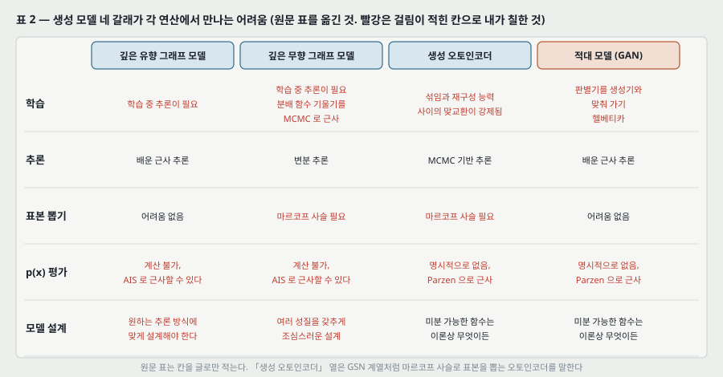

**표 2 를 옮긴다.** 원문 캡션: 「생성 모델링의 어려움 — 깊은 생성 모델링의 갈래들이 모델과 관련된 주요 연산마다 만나는 어려움의 요약」.

| | 깊은 유향 그래프 모델 | 깊은 무향 그래프 모델 | 생성 오토인코더 | 적대 모델 |
|---|---|---|---|---|
| 학습 | 학습 중 추론이 필요 | 학습 중 추론이 필요. 분배 함수 기울기를 MCMC 로 근사 | 섞임과 재구성 능력 사이의 맞교환이 강제됨 | 판별기를 생성기와 맞춰 가기. 헬베티카 |
| 추론 | 배운 근사 추론 | 변분 추론 | MCMC 기반 추론 | 배운 근사 추론 |
| 표본 뽑기 | 어려움 없음 | 마르코프 사슬 필요 | 마르코프 사슬 필요 | 어려움 없음 |
| $p(x)$ 평가 | 계산 불가, AIS 로 근사 가능 | 계산 불가, AIS 로 근사 가능 | 명시적으로 없음, Parzen 밀도 추정으로 근사 가능 | 명시적으로 없음, Parzen 밀도 추정으로 근사 가능 |
| 모델 설계 | 원하는 추론 방식에 맞게 설계해야 한다 — 어떤 추론 방식은 GAN 과 비슷한 모델 가족을 지원한다 | 여러 성질을 갖추도록 조심스러운 설계가 필요 | 미분 가능한 함수는 이론상 무엇이든 | 미분 가능한 함수는 이론상 무엇이든 |

> **표 2 의 「추론」 칸.** 적대 모델 칸에 「배운 근사 추론」이 있는데, 이 논문의 GAN 에는 $x \to z$ 망이 없다. 7절 결론의 확장 2(보조 망으로 $z$ 를 예측)를 가리키는 것으로 읽힌다 — **원문은 그 칸을 설명하지 않는다.**

---

## 17. 결론과 다섯 확장 (7절)

원문은 「이 틀은 곧은 확장을 많이 허용한다」며 다섯을 든다.

| | 확장 | 원문 |
|---|---|---|
| 1 | 조건부 생성 모델 $p(x \mid c)$ | $c$ 를 $G$ 와 $D$ 둘 다의 입력에 더한다 |
| 2 | 배운 근사 추론 | $x$ 가 주어졌을 때 $z$ 를 예측하는 보조 망을 배운다. 깨어남-잠 알고리즘의 추론 망과 비슷하지만, **생성기 학습이 끝난 뒤 고정된 생성기에 대해** 배울 수 있다는 이점 |
| 3 | 모든 조건부 $p(x_S \mid x_{\not S})$ 근사 | 파라미터를 공유하는 조건부 모델 가족을 배운다 — 결정적 MP-DBM [10] 의 확률적 확장 |
| 4 | 준지도 학습 | 라벨이 적을 때 판별기나 추론 망의 특징이 분류기 성능을 올릴 수 있다 |
| 5 | 효율 개선 | $G$ 와 $D$ 를 조율하는 더 나은 방법이나, 학습 중 $z$ 를 뽑을 더 나은 분포로 학습을 **크게** 빠르게 할 수 있다 |

마지막 문장: 「이 논문은 적대 모델링 틀이 **실행 가능함(viability)** 을 보였고, 이 연구 방향들이 쓸모 있을 수 있음을 시사한다.」

---

## 18. CACM 개관판 노트와 맞춰 보기

앞 노트(CACM 2020 개관판)는 그 파일에 식이 없어 셋을 유도하고 넷을 물어 두었다. 원판과 하나씩 맞춘다.

| 앞 노트의 자리 | 앞 노트에 적은 것 | 원판 | 판정 |
|---|---|---|---|
| 7절 식 (b) | $V = \mathbb{E}_{p_\text{data}}[\log D] + \mathbb{E}_{p(z)}[\log(1 - D(G(z)))]$, $\min_G \max_D$ | 식 (1) 과 같다. 무게 $\frac{1}{2}$ 없음. $z$ 의 분포를 원판은 $p_z(z)$ 로 적는다 | **같다** |
| 8절 식 (c) 와 유도 | $D^* = p_\text{data} / (p_\text{data} + p_\text{model})$. $a \log y + b \log(1-y)$ 를 미분해 0 으로 | 명제 1 · 식 (2) 와 같다. 원판은 미분 대신 「그 함수는 $a/(a+b)$ 에서 최대」라고 바로 적고, **받침의 합집합 밖은 정의할 필요가 없다**는 조건을 붙인다 | **같다** (원판의 받침 조건이 더 있다) |
| 9절 식 (d) | $V(D^*, G) = -\log 4 + 2 \cdot \text{JSD}$ | 정리 1 · 식 (5)(6) 과 같다. 원판은 KL 둘의 합(식 5)을 먼저 적고 JSD 로 묶는다. 「그때만」(유일성)까지 정리에 들어 있다 | **같다** |
| 10절 포화 기울기 | 로짓에 대한 기울기 $\sigma(a)$ 대 $1 - \sigma(a)$, 99 배 | 원판은 식 없이 문장 셋. 「초기 $D$ 가 확신 있게 거부 → 포화」의 방향은 같다 | **방향은 같고 식은 여전히 내 것** |
| 18절 둘 | 「실제로 쓰는 쪽(NS-GAN)의 이론이 이 파일에 없다」 | 원판 3절에 「**같은 고정점**」이라는 한 문장이 있다. 증명은 없다 | **고쳐 적을 것** — 「고정점이 같다는 주장만 있고 수렴 분석은 없다」 |
| 24절 물음 넷의 그림 4 (a) | (개관판 캡션을 옮겨) 「무작위 초기화된 깊은 신경망」 | 원판 그림 1 (a) 는 「**수렴에 가까운** 쌍, $D$ 는 부분적으로만 정확」 | **두 판의 캡션이 다르다** — 앞 노트에 적어 둘 것 |
| 24절 물음 하나 | 가치 함수 표기 · 무게 | 위 첫 행 | 답했다 |
| 24절 물음 둘 | 원판이 NS-GAN 을 이론 절에서 다루는가 | **다루지 않는다.** 4절은 식 (1) 의 최소최대 게임만. 대안은 3절 끝 한 문단 | 답했다 |
| 24절 물음 셋 | 그림 6 의 2014 얼굴은 어느 데이터셋인가 | 원판의 얼굴 표본은 **TFD (그림 2 b) 하나뿐**이다. 개관판 그림 6 이 거기서 왔다고 원판이 적지는 않는다 | **추정만 된다** |
| 24절 물음 넷 | 그림 4 는 실제 학습 곡선인가 손그림인가 | 원판 캡션도 잰 값을 적지 않고 (a) 의 $D$ 가 물결로 그려져 있다. 실제 학습에서 뽑았다는 말이 없다 | **손그림으로 읽힌다** (확정 아님) |

**앞 노트의 12절(동시 갱신 $x \cdot y$ 예)** 은 원판과 맞출 자리가 없다 — 원판의 알고리즘 1 은 **번갈아** 갱신($D$ 를 $k$ 걸음 먼저, 그다음 $G$)이다. 앞 노트 12절 표의 「번갈아」 줄이 원판의 알고리즘과 같은 꼴이고, 개관판이 「가장 흔한 알고리즘」으로 적은 **동시** 갱신은 원판에 없다. **이것도 앞 노트에 덧붙일 자리다.**

---

## 19. 이 논문이 스스로 적은 한계와 조건

1. **증명은 밀도 함수 공간에서만 선다.** $\theta_g$ 를 최적화하는 실제 학습에는 적용되지 않는다(4.2절 끝).
2. **식 (1) 은 초기에 기울기가 부족할 수 있다** — 포화(3절 끝).
3. **$D$ 를 안쪽 고리에서 끝까지 배우는 것은 비싸고 과적합한다**(3절).
4. **$p_g(x)$ 를 명시적으로 갖지 않는다**(6절).
5. **$D$ 와 $G$ 를 맞춰 가야 한다** — 헬베티카 시나리오(6절).
6. **평가 방법(Parzen 창)의 분산이 크고 고차원에서 잘 동작하지 않는다**(5절).
7. **이산 데이터를 모델링할 수 없다** — 보이는 유닛을 거쳐 미분해야 하므로(2절).
8. **적대적 예시의 존재는 GAN 학습이 비효율적일 수 있음을 시사한다**(2절).

---

## 20. 논문이 적지 않은 것 — 내가 읽으며 짚은 자리

**하나. 알고리즘 1 에 인쇄된 생성기 갱신과 3절이 권한 꼴이 다르고, 실험이 어느 쪽인지 적혀 있지 않다**(7절). 이론(4절)은 인쇄된 꼴에 서고, 실용 조언(3절 끝)은 다른 꼴을 권한다. 표 1 · 그림 2 가 어느 꼴로 나왔는지는 본문만으로 알 수 없다.

**둘. 명제 2 의 가정 셋이 실험에서 서지 않거나 확인되지 않는다.** (가) 매 걸음 $D$ 가 최적 — 실험은 $k = 1$. (나) $p_g$ 를 직접 갱신 — 실험은 $\theta_g$. (다) 「충분히 작은 갱신」 — 크기 조건이 없어 실험이 그것을 지켰는지 판정할 수 없다. 논문은 (나)만 밝히고 「실제 성능이 뛰어나다」로 대신하는데, 그 문장에 **잰 값이 붙어 있지 않다.** 11.1절의 계산이 보이듯 평균 이동 한 축만으로도 볼록성이 깨진다.

**셋. 표 1 의 비교가 서는 바탕이 얇다.** (가) ± 가 시험 예시(MNIST) · 묶음(TFD) 사이의 표준오차라 **학습 seed 의 흔들림이 없다.** (나) 수치가 $\sigma$ 고르기에 크게 움직인다 — 1 차원 예에서 같은 표본이 −10.04 에서 −1.43 까지(14절). (다) 고차원에서 추정이 치우친다 — 완벽한 생성기로도 $d = 50$ 에서 7.55 nat 낮았다. (라) 다른 모델의 수는 [3] · [5] 에서 가져온 것이라 같은 평가 코드로 다시 잰 것인지 본문에 없다. 감사의 글에 「Yann Dauphin 이 Parzen 창 평가 코드를 나눠 줬다」고 있어 **같은 계열의 코드로 보이나 확인되지 않는다.**

**넷. 「외우지 않았다」의 근거가 가장 가까운 이웃 하나다**(그림 2). 거리를 무엇으로 쟀는지 캡션에 없다. 한 묶음이 넉 줄 · 줄마다 표본 다섯이고, 이웃은 **줄마다 바로 옆 표본 하나에 대해서만** 보인다 — 표본 20 개 중 4 개다. 그래서 이 그림은 **외움이 없다는 것을 재지 않는다.**

**다섯. 학습 안정성 · 실패율에 수가 없다.** 헬베티카 시나리오가 얼마나 자주 나는지, 몇 번 돌려 몇 번 됐는지, $k$ 를 바꾸면 무엇이 달라지는지 본문에 없다. 앞 노트(개관판)가 「실제로 자주 수렴에 실패한다」고 적은 자리의 출발점이 여기다.

---

## 21. 읽을 때 헷갈리는 지점과 원문의 오기

**「min max」의 순서.** 식 (1) 은 $\min_G \max_D$ 다 — 바깥이 생성기다. 판별기가 **먼저 최선으로 응답한다고 보고** 생성기가 그 결과를 내리는 꼴이라, 식 (4) 의 $C(G) = \max_D V$ 가 자연스럽게 나온다. 알고리즘 1 에서 판별기를 먼저 $k$ 걸음 배우는 것도 같은 순서다.

**$C(G)$ 는 「가상」 기준이다.** 판별기가 매번 최적이라는 가정 위의 값이고, 학습 중 실제로 계산되는 값이 아니다. 원문도 「virtual」이라고 적는다.

**$V(D, G)$ 와 $V(G, D)$ 가 섞여 쓰인다.** 식 (1) 은 $V(D, G)$, 4절은 $V(G, D)$. 같은 함수다.

**원문의 오기 · 표기 흔들림.**

| 자리 | 원문 | 바른 것 |
|---|---|---|
| 알고리즘 1, 잡음 뽑기 두 줄 | 「noise prior $p_g(z)$」 | $p_z(z)$ |
| 식 (3) 첫 줄 | $D(g(z))$ | $D(G(z))$ |
| 식 (4) 넷째 줄 분모 | $P_\text{data}(x)$ (대문자) | $p_\text{data}(x)$ |
| 명제 2 증명 끝 | 「$p_g$ converges to $p_x$」 | $p_\text{data}$ (그림 1 캡션도 한 번 $p_x$) |
| 1절 | 「indistiguishable」 | indistinguishable |
| 2절 | 「most succesful」 | most successful |
| 5절 | 「trained adversarial nets an a range」 | on a range |
| 표 2 생성 오토인코더 · 학습 칸 | 「power of reconstruction generation」 | 낱말 하나가 빠졌거나 겹친 것으로 보인다 |
| 참고 문헌 [4] · [5] | 같은 제목(Deep generative stochastic networks trainable by backprop, ICML'14)이 저자 셋 · 넷으로 두 번 | 같은 논문 |
| 참고 문헌 [15] | 쪽 「1558–1161」 | 1158–1161 |

---

## 22. 이상 탐지로 가는 곁가지 — 논문은 이 쓰임을 적지 않는다

앞 노트 21절 넷에서 적은 두 길(판별기 점수 · $z$ 찾기 거리)을 원판에 비춰 하나씩 덧붙인다. **이 절 전체가 내가 이은 것이다.**

- **판별기 점수.** 식 (2) 로 보면 학습이 끝난 판별기는 $p_\text{data} / (p_\text{data} + p_g)$ 를 추정하는데, 평형에서 이것이 $\frac{1}{2}$ 로 간다. 곧 **이 판별기는 정상과 이상을 가르도록 배운 것이 아니라 정상과 가짜를 가르도록 배운 것**이고, 생성기가 좋아질수록 그 신호가 준다.
- **$z$ 찾기.** 원판 7절 확장 2(「$x$ 에서 $z$ 를 예측하는 보조 망을, 생성기를 고정한 뒤에 배울 수 있다」)가 이 길의 원형이다. 입력마다 최적화를 돌리는 대신 망 하나로 $z$ 를 내는 꼴이다.
- **평가 쪽.** 원판이 가능도를 Parzen 창으로밖에 못 잰다는 것은, 「이 입력의 $p_g(x)$ 가 낮다」를 점수로 쓰려면 같은 추정의 치우침(14절)을 안고 가야 한다는 뜻이다.

---

## 23. 계보와 내가 가져갈 것

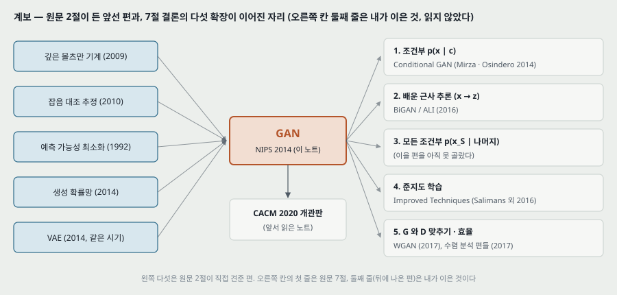

**하나. 앞 칸에서 받은 것.** 원판 2절이 직접 견주는 다섯 — 깊은 볼츠만 기계(가능도를 적어 근사가 많다), GSN(가능도 없이 표본, 그러나 마르코프 사슬), NCE(판별로 생성 모델을 배우지만 밀도 비가 필요), 예측 가능성 최소화(두 망의 경쟁이지만 정칙화 항), VAE(같은 시기, 둘째 망이 추론 망). GAN 은 **이 다섯에서 각각 하나씩을 덜어낸 자리**에 있다 — 가능도 · 마르코프 사슬 · 밀도 계산 · 다른 학습 기준 · 추론 망.

**둘. 다섯 확장이 이어진 자리 — 그림 오른쪽 칸 둘째 줄은 내가 이은 것이고 읽지 않았다.** 조건부(1)는 같은 해 Mirza · Osindero 의 Conditional GAN 으로, 배운 추론(2)은 BiGAN · ALI 로, 준지도(4)는 Salimans 외의 개선 기법으로, $G$ 와 $D$ 맞추기(5)는 WGAN 과 수렴 분석 편들로 이어진 것으로 안다. 확장 3 은 이을 편을 아직 고르지 않았다.

**셋. 로드맵 쪽.** 개관판 노트에서 생성 모델 칸(VAE · GAN · Diffusion)이 끝났다고 적었고, 원판을 읽어 그 칸의 식을 원문과 맞췄다. 로드맵의 다음 새 칸은 그대로 **RNN** 이다.

---

## 24. 다음에 읽을 것

**한계를 적고 그 한계를 푼 것이 다음 논문이다.** 이 노트가 남긴 자리에서 넷을 꼽는다.

| 다음 | 이 노트의 어느 자리에서 나오는가 | 무엇을 확인하고 싶은가 |
|---|---|---|
| **Wasserstein GAN** (Arjovsky 외 2017) | 8 · 11.1절 — 모델이 멀면 $C(G)$ 가 위 끝에 붙어 평평하다($m = 5$ 에서 97.6%). 개관판 노트 9절과 같은 자리 | 다른 거리를 쓰면 멀리 있는 모델에 어떤 신호가 가는가 |
| **DCGAN** (Radford 외 2015) | 15절 — 그림 2 (d) 가 합성곱 판별기 · 「역합성곱」 생성기를 한 장 보이고 설정을 적지 않는다 | 합성곱 구조로 무엇을 바꿔 학습이 되게 했는가 |
| **GAN 평가를 다룬 편** — A note on the evaluation of generative models (Theis 외, ICLR 2016) | 13 · 14절 — Parzen 창 수치의 치우침 · $\sigma$ 의존 | Parzen 추정이 생성 모델 비교에서 얼마나 어긋나는지를 잰 편으로 알고 있다. 14절의 내 예와 같은 모양인지 본다 |
| **GAN 수렴을 다룬 편** — The Numerics of GANs / Gradient descent GAN optimization is locally stable (NeurIPS 2017) | 11절 — 명제 2 의 가정이 실험과 어긋난다 | $\theta$ 공간에서 무엇이 보장되는가 |

읽는 순서로는 **WGAN 이 먼저**다 — 개관판 노트와 이 노트 둘 다 같은 자리(JSD 가 평평하다)를 가리킨다.

---

## 25. 돌려 볼 것

노트를 쓰며 나온 물음 중 **직접 잴 수 있는 것 넷**이다. **아직 실험 폴더를 만들지 않았고 돌리지 않았다.** 돌리게 되면 질문과 가설을 먼저 적는 규칙대로 폴더를 만든다. 개관판 노트 23절의 A~D 와 겹치는 것은 그쪽 번호를 적는다.

| 무엇 | 이 노트의 어느 자리 | 묻는 것 |
|---|---|---|
| A | 7 · 20절 하나 | 각주 1 의 저장소에서 **실험이 어느 생성기 갱신을 썼는지** 확인한다(돌리지 않고 읽기만) |
| B | 8절 (개관판 23절 B) | MNIST 에서 식 (1) 꼴과 대안 꼴을 같은 설정 · seed 셋으로 배워 처음 몇 백 걸음의 생성기 기울기 크기를 적는다 |
| C | 14절 · 20절 셋 | 같은 GAN 표본에 Parzen 추정을 $\sigma$ 를 바꿔 가며 매겨, 표 1 의 225 가 $\sigma$ 선택으로 얼마나 움직이는지 잰다. 학습 seed 셋으로 ± 에 학습 흔들림을 넣는다 |
| D | 16절 · 20절 다섯 | 1 차원 · 2 차원 섞인 가우스에서 $k$ 와 생성기 걸음 수 비를 바꿔 **헬베티카 시나리오가 나는 비율**을 센다(개관판 23절 C 와 같이 돌릴 수 있다) |

---

## 26. 물어 두는 것

- **실험의 생성기 갱신은 어느 꼴이었나**(25절 A).
- **arXiv 첫 판에도 2절의 VAE · 적대적 예시 문단이 있었나.** 이 파일의 VAE 문단은 「GANs」라는 줄임말을 쓰고 Kingma · Welling 의 ICLR 2014 를 인용한다.
- **TFD 의 묶음 수와, 「묶음 사이 표준오차」가 묶음 평균의 표준오차인지 묶음 값의 표준편차인지.** 캡션이 두 문장으로 나눠 적어 분명하지 않다.
- **표 2 의 「적대 모델 · 추론 = 배운 근사 추론」은 확장 2 를 가리키는가.**

---

## 27. 참고 문헌

이 노트가 부른 편만 적는다. 원리는 원 출처를, 구현은 그 라이브러리의 편을 적는 규칙을 따른다. 그림 코드는 파이썬 표준 라이브러리만 쓰고, 원문 그림을 잘라 낸 코드만 PyMuPDF 를 쓴다(PyMuPDF 는 논문이 따로 없어 적지 않는다).

- Goodfellow, I. J., Pouget-Abadie, J., Mirza, M., Xu, B., Warde-Farley, D., Ozair, S., Courville, A., and Bengio, Y. (2014). Generative adversarial nets. **Advances in Neural Information Processing Systems 27 (NIPS 2014)**. — 이 노트의 대상.
- Goodfellow, I. 외 (2020). Generative adversarial networks. Communications of the ACM, 63(11):139–144. — 앞서 읽은 개관판, 18절의 대조 상대.
- Bengio, Y., Thibodeau-Laufer, E., Alain, G., and Yosinski, J. (2014). Deep generative stochastic networks trainable by backprop. ICML. — GSN, 표 1 의 Deep GSN 행(원문 [4] · [5]).
- Bengio, Y., Mesnil, G., Dauphin, Y., and Rifai, S. (2013). Better mixing via deep representations. ICML. — 표 1 의 DBN · Stacked CAE 행(원문 [3]).
- Breuleux, O., Bengio, Y., and Vincent, P. (2011). Quickly generating representative samples from an RBM-derived process. Neural Computation, 23(8):2053–2073. — Parzen 창 평가를 낸 편(원문 [7]).
- Kingma, D. P. and Welling, M. (2014). Auto-encoding variational Bayes. ICLR. — 같은 시기의 VAE(원문 [18]).
- Rezende, D. J., Mohamed, S., and Wierstra, D. (2014). Stochastic backpropagation and approximate inference in deep generative models. arXiv:1401.4082. — 같은 시기의 확률적 역전파(원문 [23]).
- Gutmann, M. and Hyvärinen, A. (2010). Noise-contrastive estimation. AISTATS. — NCE(원문 [13]).
- Schmidhuber, J. (1992). Learning factorial codes by predictability minimization. Neural Computation, 4(6):863–879. — 예측 가능성 최소화(원문 [26]).
- Szegedy, C. 외 (2014). Intriguing properties of neural networks. ICLR. — 적대적 예시(원문 [28]).
- Salakhutdinov, R. and Hinton, G. E. (2009). Deep Boltzmann machines. AISTATS. — 원문 [25].
- Goodfellow, I. J., Warde-Farley, D., Mirza, M., Courville, A., and Bengio, Y. (2013). Maxout networks. ICML. — 판별기 활성(원문 [9]).
- Hinton, G. E., Dayan, P., Frey, B. J., and Neal, R. M. (1995). The wake-sleep algorithm for unsupervised neural networks. Science, 268:1158–1161. — 확장 2 의 비교 상대(원문 [15]).
- Arjovsky, M., Chintala, S., and Bottou, L. (2017). Wasserstein GAN. arXiv:1701.07875. — 다음에 읽을 것.
- Radford, A., Metz, L., and Chintala, S. (2015). Unsupervised representation learning with deep convolutional generative adversarial networks. arXiv:1511.06434. — 다음에 읽을 것.
- Theis, L., van den Oord, A., and Bethge, M. (2016). A note on the evaluation of generative models. ICLR. — 다음에 읽을 것. **읽지 않았다.**

---

## 28. 경로

| 무엇 | 어디 |
|---|---|
| 원문 PDF (NIPS 2014) | `papers/NIPS14_GAN_Generative_Adversarial_Nets.pdf` |
| 이 노트 | `notes/NIPS14_GAN_Generative_Adversarial_Nets.md` |
| 앞서 읽은 개관판 노트 | `notes/CACM20_GAN_Generative_Adversarial_Networks.md` |
| 이 노트의 그림 (직접 그린 것) | `figures/NIPS14_GAN/fig01_value_function.svg` 부터 `fig16_lineage.svg` 까지 열여섯 |
| 이 노트의 그림 (원문에서 잘라 낸 것) | `figures/NIPS14_GAN/paper_fig2_samples.png`, `paper_fig3_interpolation.png` |
| 그림을 만드는 코드 | `figures/NIPS14_GAN/make_figures.py` — 바깥 데이터를 읽지 않으므로 `python make_figures.py` 로 어디서나 다시 만든다(표준 라이브러리만). 2 · 4 · 5 · 7 · 9 · 10 · 11 번 그림의 수는 이 파일이 계산해 화면에도 찍는다 |
| 원문 그림을 잘라 내는 코드 | `figures/NIPS14_GAN/crop_paper_figures.py` — PyMuPDF 가 필요하다 |
