# 역전파 — Learning representations by back-propagating errors

퍼셉트론은 **출력 유닛에 정답이 주어질 때만** 가중치를 고칠 수 있었다. 층을 하나 더 쌓으면 중간 유닛에는 정답이 없어 규칙이 성립하지 않는다. 이 논문은 그 빈칸을 **연쇄 법칙 하나로** 채운다 — 오차의 기울기를 위층에서 아래층으로 넘기면 층마다 자기 몫이 계산된다. 네 쪽짜리 글이고, 식은 아홉 개이며, 그중 새로운 것은 사실상 **식 (4)에서 (7)까지 네 줄**이다.

이 노트의 목적은 그 네 줄이 어떻게 나오는지를 그림으로 따라가고, **논문이 스스로 적은 한계**와 **내가 읽으며 짚은 자리**를 갈라 두는 것이다.

---

## Paper Metadata

| 항목 | 값 |
|---|---|
| 제목 | Learning representations by back-propagating errors |
| 저자 | David E. Rumelhart, Geoffrey E. Hinton, Ronald J. Williams (교신저자는 Hinton) |
| 소속 | Rumelhart · Williams: Institute for Cognitive Science, C-015, University of California, San Diego / Hinton: Department of Computer Science, Carnegie-Mellon University |
| 게재 | Nature 323, 533-536 (Letters to Nature), 1986년 10월 9일 |
| 접수 · 게재 확정 | 1986년 5월 1일 접수, 7월 31일 확정 |
| DOI | `10.1038/323533a0` |
| 저자 사본 | https://www.cs.toronto.edu/~hinton/absps/naturebp.pdf |
| 코드 | 본문에 적혀 있지 않다 (1986년 논문이다) |
| 지원 | System Development Foundation, Office of Naval Research |
| Stored PDF | `papers/Nature86_Backprop_Learning_representations_by_back_propagating_errors.pdf` |
| 왜 읽었는가 | 직전에 읽은 퍼셉트론(1958)에 남아 있던 한계 둘 — 계단 함수라 기울기가 없다는 것, 은닉층에 정답이 없다는 것 — 을 정면으로 푼 편이다 |
| 읽은 범위 | **2026년 9월 19일에 네 쪽 전부 읽었다.** 533쪽 아래 단부터 536쪽 위 단까지, 본문·그림 다섯 개의 설명·참고 문헌 네 개 전부. 미독 없음 |

> **저장한 PDF에 대해 두 가지.** 하나, 스캔 이미지라 **글자 층이 없다** — 복사·검색이 되지 않고 눈으로 읽어야 한다. 둘, Nature의 쪽 단위로 뜬 것이라 533쪽 위 단에는 앞 논문(화석 아미노산)의 끝부분이, 536쪽 아래에는 뒤 논문(새끼 고양이 약시)의 시작이 함께 들어 있다. **역전파 논문은 533쪽 아래 단에서 시작해 536쪽 위 단에서 끝난다.**
>
> 원문의 소속 표기에 `Pittsburgh, Philadelphia 15213`라고 적혀 있다. Carnegie-Mellon은 Pennsylvania주 Pittsburgh에 있으므로 원문의 오기이고, 위 표에는 도시·주 이름을 빼고 옮겼다.

---

## 1. 용어

이 노트에서 쓸 이름을 먼저 정한다. 논문의 원래 용어는 괄호로 함께 적는다.

- **유닛 (unit)**: 입력을 가중치와 곱해 더한 뒤 함수 하나를 통과시켜 값을 내는 소자. 논문은 `neurone-like unit`이라 부른다.
- **총 입력 (total input, $x_j$)**: 유닛 $j$로 들어오는 값들의 가중 합. 작은 예시로, 아래 유닛 둘의 출력이 $(0.5,\ 0.2)$이고 가중치가 $(2,\ -1)$이면 $x_j = 1.0 - 0.2 = 0.8$이다.
- **출력 (output, $y_j$)**: 총 입력을 함수에 통과시킨 값. 이 논문에서는 항상 0과 1 사이다. 위 예시에서 $x_j = 0.8$이면 $y_j = 1/(1+e^{-0.8}) = 0.690$이다.
- **은닉 유닛 (hidden unit)**: 입력층에도 출력층에도 속하지 않는 유닛. **정답이 주어지지 않는 유닛**이라는 뜻이기도 하다.
- **순방향 통과 (forward pass)**: 입력층에서 출력층까지 한 층씩 올라가며 모든 $y$를 정하는 과정.
- **역방향 통과 (backward pass)**: 출력층에서 입력층 쪽으로 내려가며 기울기 $\partial E/\partial y$와 $\partial E/\partial w$를 구하는 과정.
- **훑기 (sweep)**: 학습 예 전부를 한 번 통과하는 것. **지금 말로는 에폭(epoch)이다.** 작은 예시로, 가족 트리 과제는 예가 100개이고 1,500번 훑었으니 가중치 갱신이 1,500번 일어났다.
- **가속 항 (α)**: 식 (9)에서 지난 걸음의 변화량을 이번 변화량에 얼마나 섞을지 정하는 값. **논문은 이것을 `acceleration method`라 부르고 α를 `exponential decay factor`라고 설명한다. 「모멘텀」이라는 말은 이 논문에 나오지 않는다.**
- **가중치 감쇠 (weight-decay)**: 가중치를 바꿀 때마다 모든 가중치를 일정 비율 줄이는 것. 논문은 가족 트리 과제에서만 썼고, 매번 0.2%씩 줄였다.
- **분산 표현**: 하나의 뜻이 여러 유닛의 활성 패턴에 나뉘어 담기는 것. 논문의 말은 `distributed patterns of activity`다.
- **국소 표현**: 위의 반대로, 대상 하나에 유닛 하나를 배정하는 것. **이 이름은 이 노트에서 쓰는 것이고 논문에는 없다.** 논문은 `these use a separate unit for each person`이라고만 적었다.

> **그림 안의 첨자 표기.** 그림에서는 아래첨자를 괄호로 적었다 — `y(j)`는 $y_j$, `w(j,i)`는 $w_{ji}$다. SVG 뷰어마다 아래첨자 처리가 달라 글자가 겹치는 일이 있어서 이렇게 했다. 본문 수식은 첨자 그대로다.

---

## 2. 한 문단 요약

망은 아래에서 위로만 연결된 층 구조이고, 유닛 하나는 아래 유닛들의 출력을 가중 합한 뒤 로지스틱 함수를 통과시킨다(식 1, 2). 오차는 모든 예와 모든 출력 유닛에 걸친 제곱 오차의 절반이다(식 3). 학습은 두 번의 통과로 이루어진다. 순방향으로 모든 유닛의 출력을 정하고, 역방향으로 **출력의 오차에서 시작해 연쇄 법칙을 네 번 적용해** 층마다 $\partial E/\partial w$를 구한다(식 4-7). 이 기울기를 학습 예 전부에 걸쳐 모은 뒤 한 번에 가중치를 바꾸고(식 8), 지난 걸음의 방향을 α만큼 섞어 속도를 올린다(식 9). 이 절차로 **대칭 검출**(은닉 유닛 둘로 풀린다), **가족 트리**(은닉 유닛이 국적·세대·갈래라는 축을 스스로 만든다), **되먹임이 있는 망**(층으로 펼치면 같은 절차가 돈다) 세 가지를 보였다. 논문이 스스로 적은 한계는 **국소 최소가 있을 수 있다**는 것과 **뇌의 학습 모형으로는 그럴듯하지 않다**는 것이다.

---

## 3. 문제 — 퍼셉트론이 남긴 빈칸

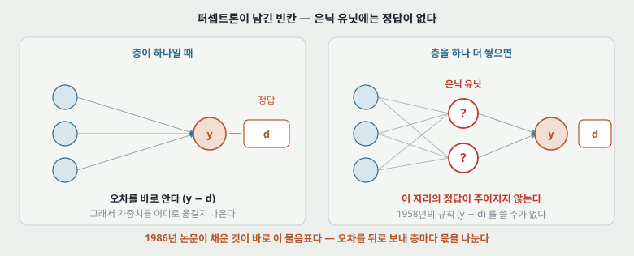

**그림 1.** 층이 하나면 출력 옆에 정답 $d$가 있어 오차 $y-d$를 바로 알고, 그래서 가중치를 어느 쪽으로 옮길지가 나온다. 층을 하나 더 쌓는 순간 가운데 유닛에는 정답이 없다. **무엇을 목표로 이 유닛의 가중치를 고쳐야 하는지가 정해지지 않는다.**

논문은 이 문제를 이렇게 적었다. 학습 절차는 **은닉 유닛이 어떤 상황에서 활성화되어야 목표한 입출력 관계를 이루는 데 도움이 되는지를 스스로 정해야 하고, 이것은 곧 그 유닛들이 무엇을 표현해야 하는지를 정하는 일**이라는 것이다. 제목의 `representations`가 여기서 나온다.

그리고 퍼셉트론을 이름으로 짚어 구분한다. 논문의 말로, 퍼셉트론에도 입력과 출력 사이에 `feature analysers`가 있지만 **그 입력 연결이 사람 손으로 고정되어 있어 상태가 입력 벡터에 의해 완전히 결정되므로 진짜 은닉 유닛이 아니고, 표현을 배우지 않는다.**

> 퍼셉트론에 남아 있던 한계 두 줄이 그대로 이 자리다. 하나는 **출력이 계단 함수라 기울기가 어디서나 0**이라는 것이고, 다른 하나는 **은닉층에 정답이 없다**는 것이다. 아래 4절이 첫째를, 5절이 둘째를 푼다.

---

## 4. 망의 모양과 순방향 통과

### 4.1 유닛 하나가 하는 계산 (식 1, 2)

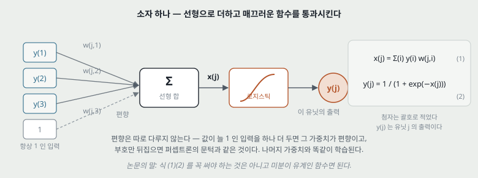

**그림 2.** 아래 유닛들의 출력에 가중치를 곱해 더하고(선형), 그 값을 로지스틱 함수에 통과시킨다(비선형).

$$x_j = \sum_i y_i\, w_{ji} \qquad (1)$$

$$y_j = \frac{1}{1 + e^{-x_j}} \qquad (2)$$

**작은 예시.** 아래 유닛 셋의 출력이 $(1.0,\ 0.5,\ 0.0)$이고 가중치가 $(0.4,\ -0.6,\ 2.0)$, 편향이 $-0.2$라면 $x_j = 0.4 - 0.3 + 0 - 0.2 = -0.1$이고 $y_j = 1/(1+e^{0.1}) = 0.475$다.

**편향은 따로 다루지 않는다.** 값이 항상 1인 입력을 하나 더 두면 그 가중치가 편향이고, 부호만 뒤집으면 퍼셉트론의 문턱과 같은 것이다. 논문의 말로 **나머지 가중치와 똑같이 다룰 수 있다** — 그래서 아래의 어떤 식에도 편향이 따로 나오지 않는다.

**논문이 못 박아 둔 것.** 식 (1)(2)를 꼭 써야 하는 것은 아니고 **미분이 유계인 입출력 함수면 무엇이든 된다.** 다만 비선형을 씌우기 전에 입력을 **선형으로** 합치는 것은 학습 절차를 크게 간단하게 만든다고 적었다. 식 (6)이 한 줄로 끝나는 이유가 이것이다.

### 4.2 계단 대신 로지스틱 — 기울기가 살아난다

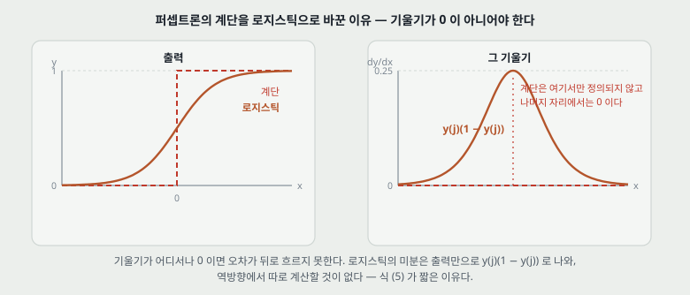

**그림 3.** 왼쪽이 출력, 오른쪽이 그 기울기다. 계단 함수는 문턱에서 정의되지 않고 나머지 자리에서는 기울기가 0이다. 로지스틱은 어디서나 기울기를 가진다.

로지스틱의 미분은 **출력만으로** 적힌다. $y = (1+e^{-x})^{-1}$을 미분하면

$$\frac{dy}{dx} = \frac{e^{-x}}{(1+e^{-x})^2} = y\,(1-y)$$

이 한 줄 덕분에 역방향에서 지수 함수를 다시 계산할 일이 없다. **순방향에서 구해 둔 $y$를 그대로 쓰면 된다.** 아래 식 (5)가 짧은 이유다.

**작은 예시.** $y = 0.8$이면 기울기는 $0.8 \times 0.2 = 0.16$이다. $y$가 0이나 1에 붙을수록 이 값이 작아지고, 최댓값은 $y = 0.5$일 때의 **0.25**다.

### 4.3 층과 허용되는 연결

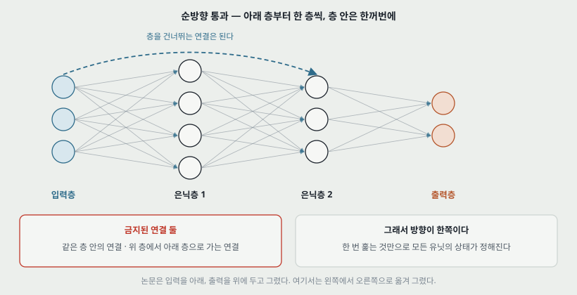

**그림 4.** 논문이 정한 구조는 이렇다. 맨 아래가 입력층, 맨 위가 출력층, 그 사이에 중간층이 **몇 개든** 올 수 있다. **같은 층 안의 연결과 위 층에서 아래 층으로 가는 연결은 금지**이고, **층을 건너뛰는 연결은 허용**된다.

순방향 통과는 아래에서 위로 한 층씩 진행한다. **한 층 안의 유닛들은 상태를 동시에 정하고, 층끼리는 순서대로** 정한다. 이 순서가 성립하는 이유가 곧 위의 금지 조항이다 — 되먹임이 없어야 한 번 훑는 것만으로 모든 상태가 결정된다.

---

## 5. 오차와 역방향 통과 — 이 논문의 알맹이

### 5.1 오차 (식 3)

$$E = \frac{1}{2} \sum_c \sum_j \left( y_{j,c} - d_{j,c} \right)^2 \qquad (3)$$

$c$는 입출력 쌍(학습 예)의 번호, $j$는 출력 유닛의 번호, $y$가 실제 출력, $d$가 목표 출력이다. **앞의 1/2은 미분하면 사라지라고 붙인 것이다** — 식 (4)가 $y_j - d_j$로 깔끔하게 떨어진다.

논문은 전체 기울기가 **예마다 구한 기울기의 단순 합**이라고 못 박는다. 그래서 아래의 유도는 전부 예 하나에 대한 것이고, $c$는 생략한다.

### 5.2 역방향 네 걸음 (식 4-7)

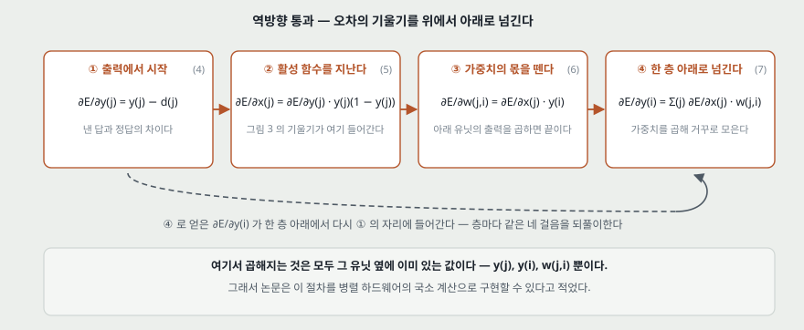

**그림 5.** 출력에서 시작해 네 걸음을 되풀이한다. ④에서 나온 값이 한 층 아래의 ①의 자리에 그대로 들어간다.

**① 출력 유닛에서 시작한다.** 식 (3)을 $y_j$로 미분하면

$$\partial E / \partial y_j = y_j - d_j \qquad (4)$$

**② 활성 함수를 거슬러 올라간다.** 연쇄 법칙으로 $\partial E/\partial x_j = (\partial E/\partial y_j)(dy_j/dx_j)$이고, 여기에 4.2절의 $dy/dx = y(1-y)$를 넣으면

$$\partial E / \partial x_j = \frac{\partial E}{\partial y_j} \cdot y_j (1 - y_j) \qquad (5)$$

**③ 가중치의 몫을 뗀다.** $x_j = \sum_i y_i w_{ji}$이므로 $\partial x_j / \partial w_{ji} = y_i$다. 따라서

$$\partial E / \partial w_{ji} = \frac{\partial E}{\partial x_j} \cdot \frac{\partial x_j}{\partial w_{ji}} = \frac{\partial E}{\partial x_j} \cdot y_i \qquad (6)$$

**④ 한 층 아래로 넘긴다.** 아래 유닛 $i$의 출력은 위 유닛 $j$ 여럿에 들어간다. $i$가 $j$ 하나에 미치는 몫은 $\partial E/\partial x_j \cdot w_{ji}$이고, $i$에서 나가는 연결 전부를 더하면

$$\partial E / \partial y_i = \sum_j \frac{\partial E}{\partial x_j} \cdot w_{ji} \qquad (7)$$

이렇게 얻은 $\partial E/\partial y_i$가 **한 층 아래에서 다시 ①의 자리**에 들어간다. 그래서 층이 몇이든 같은 네 걸음을 되풀이하면 된다. 논문의 말로, 마지막 층의 $\partial E/\partial y$를 알면 그 아래 층의 $\partial E/\partial y$를 구할 수 있고, **이 절차를 앞선 층들에 대해 되풀이하면서 지나는 길에 $\partial E/\partial w$를 함께 구한다.**

**숫자로 한 번 따라가 본다.** 출력 유닛 하나가 $y_j = 0.8$을 냈는데 목표가 $d_j = 1$이고, 그 아래 유닛의 출력이 $y_i = 0.5$, 학습률이 $\varepsilon = 0.1$이라면

| 단계 | 계산 | 값 |
|---|---|---|
| 식 (4) | $0.8 - 1$ | $-0.2$ |
| 식 (5) | $-0.2 \times 0.8 \times 0.2$ | $-0.032$ |
| 식 (6) | $-0.032 \times 0.5$ | $-0.016$ |
| 식 (8) | $-0.1 \times (-0.016)$ | $\Delta w = +0.0016$ |

목표보다 작게 나왔으니 그 연결의 가중치를 키우는 쪽으로 움직인다. 부호가 맞는다.

**여기서 곱해지는 것이 무엇인지 보아 둘 만하다.** $y_j$, $y_i$, $w_{ji}$ 셋뿐이고, 셋 다 그 연결 양 끝에 이미 있는 값이다. 논문이 이 절차를 **병렬 하드웨어에서 국소 계산으로 구현할 수 있다**고 적은 근거가 이것이다.

### 5.3 순방향이 남긴 값을 들고 있어야 한다

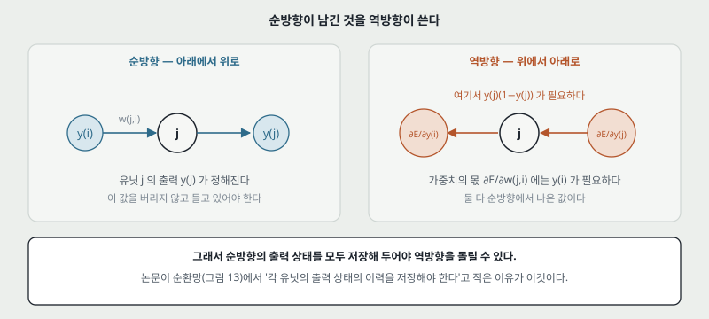

**그림 6.** 식 (5)에는 그 유닛의 출력 $y_j$가, 식 (6)에는 아래 유닛의 출력 $y_i$가 들어간다. 둘 다 순방향에서 나온 값이다. **순방향의 출력을 버리면 역방향을 돌릴 수 없다.**

지금 프레임워크가 순방향에서 중간 결과를 붙들고 있다가 역방향에서 쓰는 것, 그리고 메모리가 모자랄 때 그것을 버렸다가 다시 계산하는 방법(gradient checkpointing)이 나온 자리가 여기다. 논문 자신도 9절의 되먹임 있는 망에서 **각 유닛의 출력 상태의 이력을 저장해야 한다**고 같은 이야기를 한다.

---

## 6. 가중치를 언제 바꾸는가 (식 8, 9)

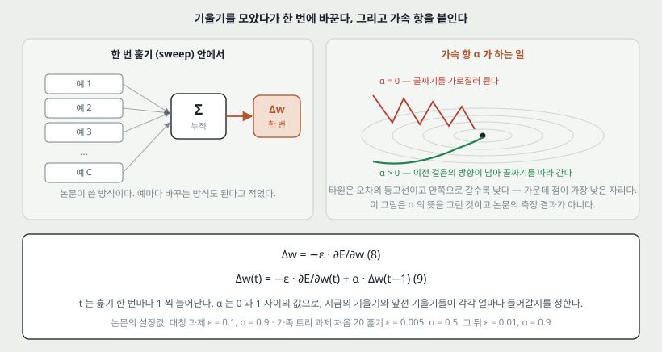

**그림 7.** 왼쪽이 식 (8)의 방식, 오른쪽이 α가 하는 일이다. **오른쪽 그림은 α의 뜻을 그린 것이고 논문의 측정 결과가 아니다.**

**언제 바꾸는가.** 논문은 두 가지를 적고 그중 하나를 골랐다.

| 방식 | 내용 | 논문의 평 |
|---|---|---|
| 예마다 바꾼다 | 입출력 쌍 하나를 처리할 때마다 갱신 | 기울기를 따로 저장할 메모리가 필요 없다 |
| **훑기마다 바꾼다** | 학습 예 전부에 대해 $\partial E/\partial w$를 모은 뒤 한 번 갱신 | **이 논문의 실험에서 쓴 방식이다** |

**얼마나 바꾸는가.**

$$\Delta w = -\varepsilon \frac{\partial E}{\partial w} \qquad (8)$$

논문은 이것을 **가장 단순한 형태의 기울기 하강**이라 부르면서, **2차 미분을 쓰는 방법만큼 빠르게 수렴하지는 않지만 훨씬 간단하고 병렬 하드웨어의 국소 계산으로 쉽게 구현된다**고 적었다. 이어서 단순함과 국소성을 해치지 않고 크게 개선할 수 있다며 가속 항을 붙인다.

$$\Delta w(t) = -\varepsilon \frac{\partial E}{\partial w(t)} + \alpha\, \Delta w(t-1) \qquad (9)$$

$t$는 **훑기 한 번마다 1씩** 늘어난다. α는 0과 1 사이의 값으로, **지금의 기울기와 앞선 기울기들이 각각 얼마나 들어갈지**를 정한다. 논문의 설명은 **기울기로 점의 위치가 아니라 속도를 고치는 것**이다.

**시작점.** 모든 가중치를 같게 두면 같은 층의 유닛들이 영원히 같은 값을 갖는다. 논문은 이것을 한 줄로 적었다 — **대칭을 깨려고 작은 난수에서 시작한다.** 대칭 검출 실험에서는 $-0.3$과 $0.3$ 사이의 균등 난수였다.

**논문이 쓴 설정값을 한자리에 모으면 이렇다.**

| 과제 | ε | α | 훑기 | 그 밖 |
|---|---|---|---|---|
| 대칭 검출 | 0.1 | 0.9 | 1,425 | 처음 가중치 $-0.3 \sim 0.3$ 균등 난수 |
| 가족 트리 | 처음 20회 0.005, 그 뒤 0.01 | 처음 20회 0.5, 그 뒤 0.9 | 1,500 | 가중치 감쇠 0.2%, 출력 0.8 위·0.2 아래면 오차를 0으로 |

**두 과제의 값이 다르고, 한 과제 안에서도 도중에 바뀐다.** 어떻게 고르는지에 대한 규칙은 논문에 적혀 있지 않다.

---

## 7. 실험 하나 — 대칭 검출

**왜 이 과제인가.** 입력 유닛 하나만 따로 보면 **전체 벡터가 대칭인지에 대해 아무 정보도 주지 않는다.** 그래서 개별 입력의 증거를 더하는 것만으로는 풀리지 않고, 중간층이 반드시 필요하다. 논문은 중간 유닛이 필요하다는 형식적 증명이 Minsky와 Papert(1969)에 있다고 가리킨다. **입력 하나하나의 증거를 더하는 것만으로는 안 된다는 점에서, 직선 하나로는 갈라지지 않는 배타적 논리합(XOR)과 같은 종류의 문제다.**

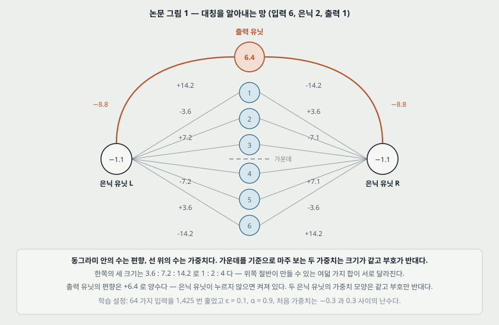

**그림 8.** 학습이 끝난 망이다. 입력 6개, 은닉 2개, 출력 1개. 동그라미 안이 편향, 선 위가 가중치다.

**해가 가진 두 가지 성질**을 논문이 짚는다.

1. **가운데를 기준으로 마주 보는 두 가중치는 크기가 같고 부호가 반대다.** 그래서 입력이 대칭이면 두 은닉 유닛이 받는 합이 정확히 0이 되고, 편향이 음수라 둘 다 꺼진다. 그러면 편향이 양수인 출력 유닛이 켜진다.
2. **한쪽 절반의 세 가중치 크기가 1 : 2 : 4다** (그림의 3.6 : 7.2 : 14.2). 이래야 위쪽 절반이 만들 수 있는 여덟 가지 합이 서로 달라지고, **그 합을 정확히 상쇄할 수 있는 아래쪽 패턴이 대칭인 것 하나뿐**이 된다. 비대칭이면 두 은닉 유닛 중 한쪽이 켜져 $-8.8$로 출력을 누른다.

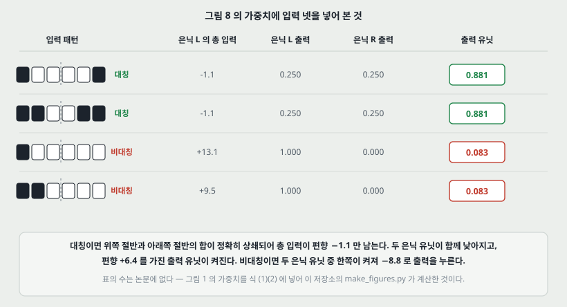

**그림 9.** 그림 8의 가중치에 입력 넷을 실제로 넣어 본 것이다.

| 입력 | 대칭 여부 | 은닉 L 총 입력 | 은닉 L 출력 | 은닉 R 출력 | 출력 유닛 |
|---|---|---|---|---|---|
| 100001 | 대칭 | $-1.1$ | 0.250 | 0.250 | **0.881** |
| 110011 | 대칭 | $-1.1$ | 0.250 | 0.250 | **0.881** |
| 100000 | 비대칭 | $+13.1$ | 1.000 | 0.000 | **0.083** |
| 110000 | 비대칭 | $+9.5$ | 1.000 | 0.000 | **0.083** |

> **이 표의 수는 논문에 없다.** 그림 8의 가중치를 식 (1)(2)에 넣어 이 저장소의 `figures/Nature86_Backprop/make_figures.py`가 계산한 것이다. 논문은 성질만 서술하고 활성값을 적지 않았다.

**읽을 거리 하나.** 대칭일 때 은닉 유닛의 출력은 0이 아니라 **0.250**이다. 편향 $-1.1$이 남기 때문이다. 논문은 이 상태를 `off`라고 부르는데, **완전히 0이라는 뜻이 아니라 출력 유닛을 누르지 못할 만큼 낮다는 뜻**으로 읽어야 한다. 실제로 $-8.8 \times 0.250 \times 2 + 6.4 = +2.0$이라 출력이 켜진다.

---

## 8. 실험 둘 — 가족 트리, 그리고 스스로 만든 특징

### 8.1 과제

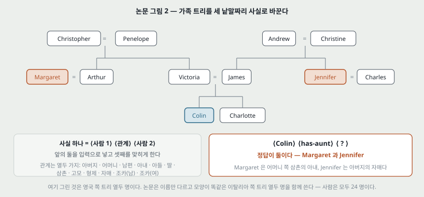

**그림 10.** 가족 관계를 **⟨사람 1⟩ ⟨관계⟩ ⟨사람 2⟩** 세 낱말짜리 사실로 바꾸고, 앞의 둘을 입력으로 주면 셋째를 맞히게 한다. 관계는 열두 가지다(아버지·어머니·남편·아내·아들·딸·삼촌·고모·형제·자매·조카(남)·조카(여)). 정답이 둘인 경우가 있다 — 그림의 Colin은 고모가 둘이다.

**트리가 두 개인 것이 핵심 장치다.** 영국 쪽 열두 명과 이탈리아 쪽 열두 명이 **이름만 다르고 관계 구조가 똑같다.** 사람은 모두 24명, 가능한 사실은 104개다.

### 8.2 망

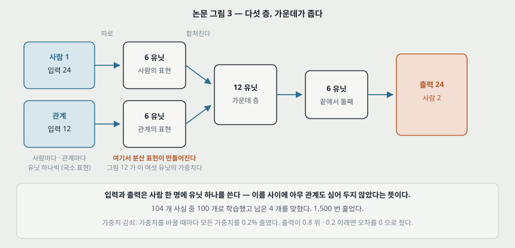

**그림 11.** 다섯 층이다. 입력은 사람 24 + 관계 12이고, 두 묶음이 **각자 따로** 6유닛으로 줄어든 뒤 12유닛의 가운데 층에서 합쳐지고, 6유닛을 거쳐 출력 24로 간다.

**입력과 출력이 국소 표현이라는 점이 중요하다.** 사람 한 명에 유닛 하나씩 쓰므로 **이름들 사이에 아무 관계도 미리 심어 두지 않았다.** 무엇이든 관계가 생겼다면 그것은 학습이 만든 것이다.

학습은 **104개 중 100개로 하고 남은 4개를 시험**했다. 1,500번 훑었다. 두 가지 장치를 덧붙였다.

- **가중치 감쇠 0.2%**: 가중치를 바꿀 때마다 모든 가중치를 0.2% 줄였다. 논문의 설명은, 오래 학습하면 감쇠가 $\partial E/\partial w$와 균형을 이루어 **가중치의 최종 크기가 곧 그 가중치가 오차를 줄이는 데 얼마나 쓸모 있었는지를 나타내게 된다**는 것이다. 가중치 그림을 읽을 수 있게 만들려고 넣은 장치다.
- **오차 판정에 여유**: 켜져야 할 출력이 0.8 위, 꺼져야 할 출력이 0.2 아래면 오차를 0으로 쳤다. 이유도 적혀 있다 — **출력을 1이나 0까지 몰고 가려고 가중치가 커지는 것을 막으려고.**

### 8.3 은닉 유닛이 만든 축

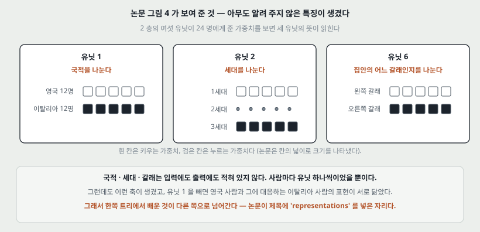

**그림 12.** 2층 여섯 유닛이 24명에게 준 가중치를 보면 뜻이 읽히는 유닛이 있다. 논문이 이름 붙인 것은 셋이다.

| 유닛 | 무엇을 나누는가 |
|---|---|
| 유닛 1 | **국적** — 영국인지 이탈리아인지. 다른 유닛들은 대체로 이 구분을 무시한다 |
| 유닛 2 | **세대** — 그 사람이 몇 번째 세대인지 |
| 유닛 6 | **집안의 어느 갈래**에서 왔는지 |

**여기가 이 논문의 제목이 가리키는 자리다.** 국적도 세대도 갈래도 입력에 적혀 있지 않았다. 사람마다 유닛 하나씩이었을 뿐이다. 그런데 학습이 그런 축을 만들었고, 유닛 1을 빼면 **영국 사람과 그에 대응하는 이탈리아 사람의 표현이 서로 닮는다.** 논문의 말로, 망이 **두 트리 사이의 동형성을 이용해 구조를 공유하므로 한쪽에서 다른 쪽으로 알맞게 일반화하는 경향을 가진다.** 학습에 쓰지 않은 사실 4개를 맞힌 것이 그 결과다.

---

## 9. 실험 셋 — 되먹임이 있는 망

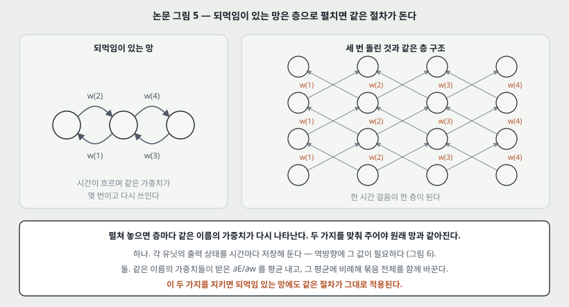

**그림 13.** 되먹임이 있는 망을 세 번 돌리는 것은, 같은 가중치를 세 층에 되풀이해 놓은 층 구조와 같다. **한 시간 걸음이 한 층이 된다.**

논문은 이 대응을 세우면서 맞춰 주어야 할 것 둘을 적는다.

1. **출력 상태의 이력을 저장한다.** 층 구조에서 역방향 통과에는 중간층 유닛들의 순방향 출력이 필요하므로(식 5, 6), 되먹임 망에서는 **각 유닛의 출력 상태를 시간마다 저장해 두어야 한다.** 그림 6에서 본 이야기가 그대로 나온다.
2. **대응하는 가중치를 같은 값으로 묶는다.** 펼친 층들에서 같은 이름의 가중치는 값이 같아야 원래 망과 같아진다. 이를 지키려고 **묶음 안의 모든 가중치가 받은 $\partial E/\partial w$를 평균 내고, 그 평균에 비례해 묶음 전체를 함께 바꾼다.**

이 둘만 지키면 같은 절차가 그대로 돈다고 적었고, 그런 망은 **되풀이 탐색을 수행하거나 순서가 있는 구조를 배울 수 있다**고 덧붙였다. 다만 **이 절에는 실험 결과가 없다** — 자세한 것은 같은 해의 PDP 책(참고 문헌 4번)으로 넘긴다.

> 지금 부르는 이름으로 **BPTT(back-propagation through time)**의 원형이다. 가중치 묶음의 기울기를 평균 내어 함께 바꾼다는 것은 **가중치 공유(weight sharing)** 를 다루는 방법이기도 하고, 몇 해 뒤 합성곱 신경망이 같은 장치를 쓴다.

---

## 10. 특징 — 무엇이 이 논문을 이 논문이게 하는가

| 특징 | 무엇을 뜻하는가 | 왜 중요한가 |
|---|---|---|
| **연쇄 법칙 네 줄** | 식 (4)-(7)이 전부다 | 층이 몇이든 같은 네 걸음을 되풀이하면 된다. **깊이가 절차를 바꾸지 않는다** |
| **계단을 매끄러운 함수로 바꿨다** | 로지스틱의 미분이 $y(1-y)$ | 퍼셉트론의 한계 하나(기울기가 없다)를 여기서 없앤다 |
| **곱해지는 값이 전부 국소적이다** | $y_j$, $y_i$, $w_{ji}$뿐 | 병렬 하드웨어에서 돌릴 수 있다는 근거. 지금 GPU 학습이 되는 이유의 뿌리이기도 하다 |
| **은닉 유닛이 표현을 만든다** | 국적·세대·갈래가 스스로 생겼다 | 사람이 특징을 설계하던 자리를 학습이 가져간다. **제목이 말하는 것이 이것이다** |
| **활성 함수를 갈아 끼울 수 있다** | 미분이 유계이면 된다고 적었다 | 뒤에 ReLU 같은 다른 함수로 바꿀 길이 논문 안에 이미 열려 있다 |
| **훑기 단위로 모아서 갱신** | 식 (8), 예마다 갱신도 된다고 적었다 | 지금의 배치 · 미니배치 구분이 여기서 갈린다 |
| **가속 항** | 식 (9), 기울기로 속도를 고친다 | 지금의 모멘텀이다. 논문은 그 이름을 쓰지 않았다 |
| **되먹임 망으로 확장** | 펼치고 가중치를 묶는다 | BPTT와 가중치 공유의 원형 |
| **네 쪽이다** | Letters to Nature | 유도의 자세한 것과 더 많은 실험은 같은 해 PDP 책 1권 318-362쪽에 있다 |

---

## 11. 이 논문이 스스로 적은 한계

**논문이 한계라고 적은 것만 여기 적는다.** 내가 짚은 것은 12절에 따로 둔다.

### 11.1 국소 최소

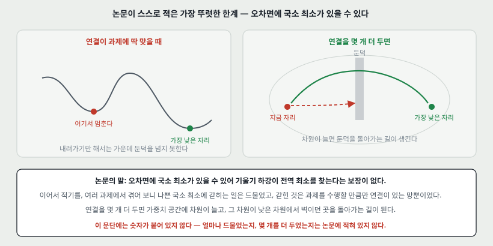

**그림 14.** 논문이 `most obvious drawback`이라고 부른 것이다.

논문의 서술을 순서대로 옮기면 이렇다.

1. **오차면에 국소 최소가 있을 수 있어 기울기 하강이 전역 최소를 찾는다는 보장이 없다.**
2. 그러나 여러 과제를 겪어 보니 **전역 최소보다 크게 나쁜 국소 최소에 갇히는 일은 드물었다.**
3. 갇히는 것을 겪은 것은 **과제를 수행할 만큼만 연결을 가진 망**뿐이었다.
4. **연결을 몇 개 더 두면** 가중치 공간에 차원이 늘고, 그 차원이 **낮은 차원에서 벽이던 곳을 돌아가는 길**이 된다.

> **여기에는 숫자가 하나도 붙어 있지 않다.** 얼마나 드물었는지, 몇 개를 더 두었는지, 어떤 과제였는지가 적혀 있지 않다. **「드물다」는 논문의 말 그대로 옮긴 것이고 측정된 값이 아니다.**

### 11.2 뇌의 학습 모형으로는 그럴듯하지 않다

논문의 마지막 문단이다. **지금 형태의 이 학습 절차는 뇌에서 일어나는 학습의 그럴듯한 모형이 아니다.** 이어서, 그래도 이 절차를 여러 과제에 적용해 보니 **가중치 공간에서의 기울기 하강으로 흥미로운 내부 표현이 만들어진다는 것이 드러났으므로, 생물학적으로 더 그럴듯한 기울기 하강 방법을 찾아볼 값어치가 있다**고 적는다.

**이 대목은 제목의 `brain`이 없는 이유이기도 하다.** 1958년 퍼셉트론 논문은 제목에 `in the Brain`을 달았고, 이 논문은 달지 않았다.

### 11.3 수렴 속도

식 (8) 바로 아래 문장이다. **이 방법은 2차 미분을 쓰는 방법들만큼 빠르게 수렴하지 않는다.** 대신 훨씬 간단하고 병렬 하드웨어의 국소 계산으로 쉽게 구현된다고 적었다. **속도를 내주고 단순함과 국소성을 얻은 거래**라는 것을 논문이 스스로 밝혀 둔 셈이다.

### 11.4 대칭을 깨야 한다

한계라기보다 조건이지만 논문이 명시한 것이다. **가중치를 작은 난수로 시작해야 한다** — 같게 두면 같은 층의 유닛들이 갈라지지 않는다.

---

## 12. 논문이 적지 않은 것 — 내가 읽으며 짚은 자리

**11절과 갈라 둔다. 아래는 논문의 주장이 아니라 내가 읽으며 적어 둔 것이다.**

| 짚은 자리 | 근거 | 이것이 왜 다음으로 이어지는가 |
|---|---|---|
| **평가가 장난감 과제 셋이다** | 본문에 나오는 과제는 대칭 검출 · 가족 트리 · 되먹임 망뿐이고, 되먹임 망은 결과 없이 서술만 있다 | 일반화를 잰 것은 **가족 트리의 미학습 사실 4개**가 전부다. 지금 기준의 시험 집합이라고 부르기 어렵다 |
| **시간 · 비용 측정이 없다** | 훑기 횟수(1,425와 1,500)는 있으나 걸린 시간 · 장비 · 연산량은 적혀 있지 않다 | 「빠르게 수렴하지 않는다」(11.3)가 무엇에 견준 것인지도 숫자로 확인되지 않는다 |
| **깊이가 깊어질 때 기울기가 줄어드는 문제를 다루지 않는다** | 식 (5)의 $y(1-y)$는 최댓값이 0.25다. 층을 지날 때마다 곱해지므로 다섯 층이면 $0.25^5 = 0.00098$까지 줄어들 수 있다(내가 계산한 것이다) | 논문의 망은 최대 다섯 층이라 이 문제가 드러날 깊이가 아니었다. 이 문제가 정리되는 것은 뒤의 일이다 |
| **ε와 α를 고르는 규칙이 없다** | 과제마다 값이 다르고 가족 트리에서는 20번째 훑기에서 바꾼다 | 왜 20번인지, 왜 그 값인지에 대한 서술이 없다 |
| **0.8/0.2 기준과 가중치 감쇠가 왜 필요한지의 일반 규칙이 없다** | 둘 다 가족 트리 과제의 그림 설명에만 나온다 | 대칭 검출에는 쓰이지 않았다. 과제마다 손으로 붙인 장치로 보인다 |
| **출력이 로지스틱 하나로 고정이다** | 모든 유닛이 식 (2)를 쓴다 | 여러 부류 중 하나를 고르는 출력(소프트맥스)이나 값을 내는 출력은 이 논문의 범위에 없다 |
| **최초라고 적지 않았다** | 논문이 스스로 David Parker와 Yann Le Cun이 **독립적으로 변형을 찾아냈다**고 밝힌다 | 아래 13절 |

---

## 13. 읽을 때 헷갈리는 지점

- **이 논문이 역전파를 처음 만든 것은 아니고, 논문도 그렇게 주장하지 않는다.** 본문에 **변형들이 David Parker(개인 교신)와 Yann Le Cun에 의해 독립적으로 발견되었다**고 적혀 있다. (더 앞선 것으로 알려진 Werbos 1974와 Linnainmaa 1970은 **이 논문에 나오지 않는다** — 내가 보탠 것이다.) 이 논문의 자리는 **처음**이 아니라 **은닉 유닛이 쓸모 있는 표현을 만든다는 것을 보이고 그것이 널리 읽히게 만든 편**이다.
- **네 쪽이 전부가 아니다.** 같은 해에 나온 PDP 책 1권 8장(318-362쪽)이 같은 저자들의 긴 판이고, 논문의 참고 문헌 4번이 그것이다. 유도와 실험이 더 많다.
- **식 (9)의 α는 「학습률을 줄이는 값」이 아니다.** 논문은 `exponential decay factor`라고 불렀지만, 하는 일은 **지난 변화량을 이번에 섞는 것**이다. 학습률 감쇠(learning rate decay)와 헷갈리기 쉽다.
- **`sweep`은 에폭이다.** 1,425 sweeps는 1,425 에폭이라는 뜻이고, 가중치 갱신 횟수도 1,425번이다(예마다 갱신이 아니라 훑기마다 갱신이므로).
- **은닉 유닛이 `off`라는 말이 활성값 0을 뜻하지 않는다.** 7절에서 본 것처럼 대칭 입력에서 은닉 유닛의 출력은 0.250이다.
- **층을 건너뛰는 연결이 허용된다는 점**은 그냥 지나치기 쉬운데, 식 (7)의 합이 **위층 전체**가 아니라 **그 유닛에서 나가는 연결 전부**에 대한 합인 이유가 이것이다.
- **그림 1의 가중치 1 : 2 : 4는 사람이 정한 것이 아니다.** 학습이 찾아낸 해이고, 논문은 그 해를 사후에 읽어 낸 것이다.

---

## 14. 퍼셉트론의 한계와 맞춰 보기

퍼셉트론에 남아 있던 한계 일곱 가지를 왼쪽에 적고, 이 논문이 각각을 어떻게 건드렸는지 오른쪽에 적는다.

| 퍼셉트론의 한계 | 이 논문이 한 것 |
|---|---|
| 선형 분리 가능한 문제만 푼다 | 은닉층을 실제로 학습시켜 푼다. 대칭 검출이 그 예다 (7절) |
| 기울기가 없다 | 계단을 로지스틱으로 바꾸고 미분을 $y(1-y)$로 쓴다 (4.2절) |
| **층을 쌓아도 안쪽을 고칠 수 없다** | **식 (4)-(7)이 이 빈칸을 채운다. 이 논문의 알맹이다** (5절) |
| 앞쪽 층이 고정이다 | 모든 층을 함께 배운다. 논문이 퍼셉트론의 `feature analysers`를 이름으로 짚어 구분한다 (3절) |
| 갈라지지 않으면 멈추지 않는다 | **풀리지 않았다.** 대신 다른 성질로 바뀐다 — 언제 멈출지가 아니라 **어디에 멈출지**(국소 최소)가 문제가 된다 (11.1절) |
| 어떤 선인지는 보장하지 않는다 | **풀리지 않았다.** 여유(margin)를 목표로 삼는 이야기는 이 논문에 없다 |
| 출력이 하나, 둘 중 하나 | 출력 유닛을 여럿 두고 0과 1 사이의 값을 낸다. 다만 여러 부류 중 하나를 고르는 출력은 다루지 않는다 |

**퍼셉트론의 한계 일곱 중 넷이 여기서 풀리고, 둘은 남고, 하나는 성질이 바뀐다.** 그리고 이 논문이 새로 만든 한계(국소 최소, 수렴 속도)가 다음 세대의 목차가 된다.

---

## 15. 다음에 읽을 것

| 자리 | 논문 | 무엇을 이어받는가 |
|---|---|---|
| **더 긴 판** | Rumelhart, Hinton, Williams. "Learning Internal Representations by Error Propagation." PDP vol.1, 318-362, MIT Press, 1986 | 같은 저자들의 같은 내용을 길게 쓴 것. 이 논문이 참고 문헌 4번으로 가리키는 자리다 |
| **깊이의 문제** | Hochreiter (1991), Bengio, Simard, Frasconi (1994) | 12절에서 계산해 본 $0.25^5$ 문제. 층이 깊어질 때 기울기가 줄어드는 것을 정리한다 |
| **가중치 공유를 구조로** | LeCun et al. "Backpropagation Applied to Handwritten Zip Code Recognition." Neural Computation, 1989 | 9절의 가중치 묶음을 이미지의 위치 이동에 맞춰 설계한다. 이 논문이 이름을 적은 Le Cun 본인이다 |
| **표현 학습 쪽 (내 관심)** | 이 논문의 8절에서 은닉 유닛이 국적·세대·갈래를 만든 것이 **특징을 사람이 설계하지 않는다**는 계보의 시작이다 | 내 이상 탐지 연구에서 쓰는 사전학습 특징이 같은 계보 위에 있다 |

**다음에 읽을 것은 Hinton, Osindero, Teh. "A Fast Learning Algorithm for Deep Belief Nets." Neural Computation 18(7), 1527-1554, 2006 이다** (저자 사본 https://www.cs.toronto.edu/~hinton/absps/fastnc.pdf). 역전파가 있어도 층이 깊어지면 학습이 되지 않던 시기를 다루는 편이라, **12절에서 계산해 본 $0.25^5$ 자리와 바로 이어진다.**

---

## 16. 내가 가져갈 것

**하나. 어려운 것이 알고리즘이 아니라 「몫을 나누는 일」이었다.** 식 (4)-(7)은 미적분학 첫 학기에 배우는 연쇄 법칙이다. 1958년과 1986년 사이를 가른 것은 수학이 아니라 **은닉 유닛에 목표를 주는 대신 기울기를 주면 된다는 착상**이다. 어떤 문제를 볼 때 **무엇이 없어서 막혀 있는지**를 먼저 적는 습관이 여기서 나온다.

**둘. 논문이 스스로 적은 한계를 그대로 옮겨 적는 것이 값어치가 있다.** 이 논문이 적은 한계 둘(국소 최소, 생물학적 그럴듯함)과 내가 짚은 자리 일곱은 성격이 다르다. 11절과 12절을 가른 것이 이 노트에서 가장 쓸모 있는 부분이라고 본다. **랩 문서에서도 「논문이 말한 것」과 「내가 본 것」을 같은 표에 섞지 않는다.**

**셋. 숫자가 없는 주장은 숫자가 없다고 적어 둔다.** 11.1절의 `드물었다`는 논문의 말이고 측정값이 아니다. 이런 문장을 옮길 때 **「드물다」를 내 문장으로 승격시키지 않는 것**이 규칙 1이 말하는 것이다.

**넷. 지금 확인된 것은 여기까지다.** 원문 네 쪽을 읽었고, 그림 8과 9의 수치는 논문의 가중치를 내가 식에 넣어 계산한 것이다. **직접 구현해 돌려 보지는 않았다.** 대칭 검출은 입력이 6비트라 노트북에서도 재현할 수 있으니, 돌려 보면 1,425번이라는 훑기 횟수와 1 : 2 : 4 구조가 재현되는지 확인할 수 있다 — 아직 하지 않았다.

---

## 17. 남는 질문

- **1 : 2 : 4 구조는 항상 나오는가, 아니면 이 난수 씨앗에서만 나온 해인가?** 논문은 한 번의 결과만 보인다. 씨앗을 바꿔 여러 번 돌려 봐야 답이 나온다.
- **가족 트리에서 미학습 4개를 맞힌 것은 얼마나 재현되는가?** 4개는 작은 수라 우연의 폭이 크다. 논문은 이 실험을 몇 번 돌렸는지 적지 않았다.
- **가중치 감쇠 0.2%가 없으면 그림 12의 축이 읽히지 않는가?** 논문은 **가중치를 해석하기 쉽게 하려고** 넣었다고 적었는데, 그것이 성능에 미친 영향은 적혀 있지 않다.
- **11.1절의 「연결을 몇 개 더 두면 우회로가 생긴다」를 지금 측정할 수 있는가?** 대칭 검출 망에서 은닉 유닛을 2개에서 3개로 늘리면 국소 최소에 갇히는 비율이 달라지는지가 그대로 실험이 된다.

---

## 18. 참고 문헌

1. Rumelhart, D. E., Hinton, G. E., Williams, R. J. "Learning representations by back-propagating errors." Nature 323, 533-536, 1986. DOI 10.1038/323533a0 (이 노트의 대상)
2. Rosenblatt, F. "Principles of Neurodynamics." Spartan, 1961. (논문의 참고 문헌 1번 — 퍼셉트론 수렴 절차)
3. Minsky, M. L., Papert, S. "Perceptrons." MIT Press, 1969. (논문의 참고 문헌 2번 — 중간 유닛이 필요하다는 형식적 증명)
4. Le Cun, Y. Proc. Cognitiva 85, 599-604, 1985. (논문의 참고 문헌 3번 — 독립적으로 찾은 변형)
5. Rumelhart, D. E., Hinton, G. E., Williams, R. J. "Learning Internal Representations by Error Propagation." in Parallel Distributed Processing: Explorations in the Microstructure of Cognition, Vol.1: Foundations (eds Rumelhart, McClelland) 318-362, MIT Press, 1986. (논문의 참고 문헌 4번 — 긴 판)
6. Rosenblatt, F. "The Perceptron: A Probabilistic Model for Information Storage and Organization in the Brain." Psychological Review 65(6), 386-408, 1958. (직전에 읽은 편)

**이 노트가 참조하는 저장소 안의 경로**

- 원문 PDF: `papers/Nature86_Backprop_Learning_representations_by_back_propagating_errors.pdf`
- 그림 열네 개: `figures/Nature86_Backprop/`
- 그림을 만드는 스크립트: `figures/Nature86_Backprop/make_figures.py`

---

*그림 열네 개는 `make_figures.py`를 다시 돌리면 같은 그림이 나온다. 그림 3의 두 곡선은 식을 직접 계산해 그린 것이고, 그림 9의 표는 그림 8의 가중치를 식 (1)(2)에 넣어 계산한 것이라 손으로 맞춘 값이 아니다. 그림 8 · 10 · 11 · 12 · 13은 논문의 그림 1 · 2 · 3 · 4 · 5를 옮겨 그린 것이고, 나머지는 본문을 읽고 새로 그린 것이다.*
