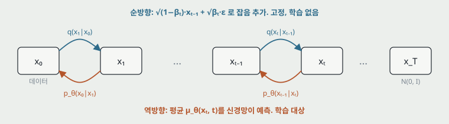
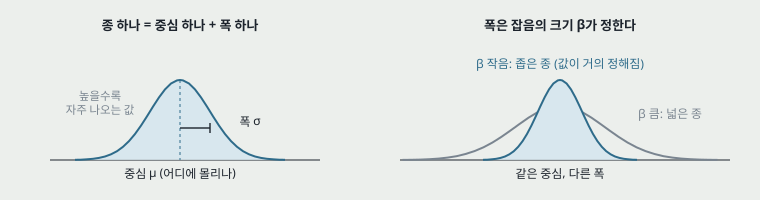
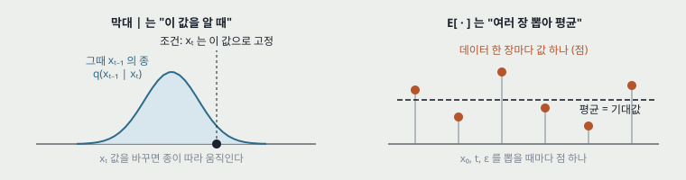
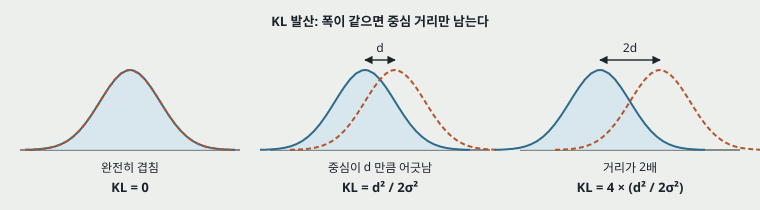
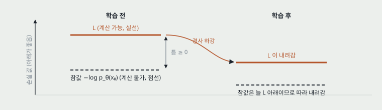
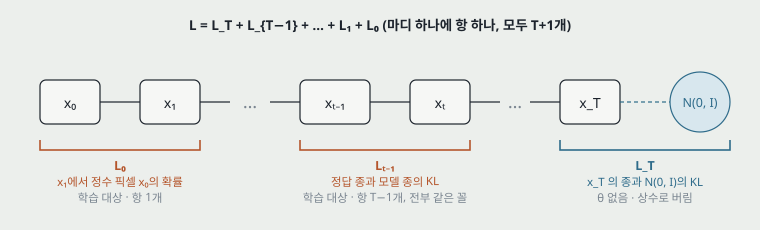
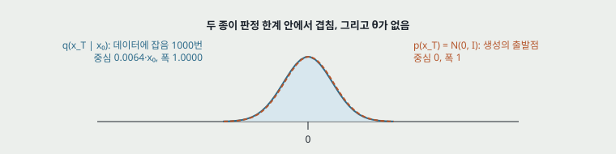
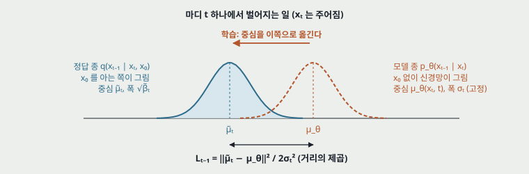
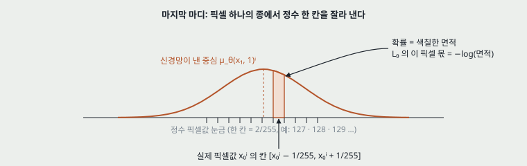
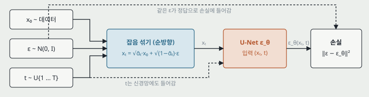

# DDPM 논문 해부

Denoising Diffusion Probabilistic Models (Ho, Jain, Abbeel; NeurIPS 2020). 확산 모델이 왜 이 논문에서부터 "쓸 만한" 생성 모델이 되었는지, 수식 한 줄 한 줄이 무엇을 결정하는지를 따라가는 읽기 안내서다.

| 항목 | 값 |
|---|---|
| 저자 | Jonathan Ho, Ajay Jain, Pieter Abbeel (UC Berkeley) |
| 학회 | NeurIPS 2020 · arXiv 2006.11239 |
| 코드 | github.com/hojonathanho/diffusion (TensorFlow) |
| 핵심 수치 | CIFAR10 무조건부 FID 3.17, IS 9.46, NLL 3.75 bits/dim |
| Stored PDF | **아직 `papers/`에 없다.** arXiv 2006.11239에서 받아 `papers/NeurIPS20_DDPM_Denoising_Diffusion_Probabilistic_Models.pdf`로 두면 이름이 맞는다 |
| 읽은 범위 | 논문 §1~§4와 부록 B. 표 1·2·3·4의 수치와 부록 B의 하이퍼파라미터를 옮겼다 |

> **이 노트의 출처.** 2026-09-17에 만든 아티팩트 「DDPM 논문 해부」를 마크다운으로 옮긴 것이다. 그림 열 개는 그 아티팩트의 SVG를 그대로 떼어 `figures/NeurIPS20_DDPM/`에 두었고, 색만 밝은 판 값으로 고정했다. 원본 그대로의 판은 같은 폴더의 `.artifact.html`에 있다.
>
> **굵은 글씨 중 괄호 설명이 붙은 것은 그 자리에서 처음 나온 용어**다. Section 14와 15는 논문 밖의 해설이다.

## 차례

1. [한 문단 요약](#1-한-문단-요약)
2. [배경과 문제 설정](#2-배경과-문제-설정)
3. [순방향 과정 q](#3-순방향-과정-q)
4. [역방향 과정 p_θ](#4-역방향-과정-p_θ)
5. [변분 하한과 L_t-1](#5-변분-하한과-l_t-1)
6. [ε-예측과 L_simple](#6-ε-예측과-l_simple)
7. [학습·샘플링 알고리즘](#7-학습샘플링-알고리즘)
8. [스코어 매칭과의 연결](#8-스코어-매칭과의-연결)
9. [마지막 단계 L_0](#9-마지막-단계-l_0-이산-픽셀-디코더)
10. [실험 설정](#10-실험-설정)
11. [결과와 소거 실험](#11-결과와-소거-실험)
12. [점진적 부호화 해석](#12-점진적-부호화-확산-모델을-압축기로-읽기)
13. [한계](#13-한계)
14. [이후 연구로 이어지는 선](#14-이후-연구로-이어지는-선)
15. [읽을 때 헷갈리는 지점](#15-읽을-때-헷갈리는-지점)
- [참고 문헌](#참고-문헌)

---

## 1. 한 문단 요약

이 논문은 **확산 모델**(데이터에 잡음을 조금씩 더해 완전한 가우시안 잡음으로 만드는 고정된 과정을 정의하고, 그 과정을 거꾸로 되돌리는 신경망을 학습하는 생성 모델. Sohl-Dickstein 등 2015가 제안)을 세 가지 결정으로 다시 짰다. 첫째, 역방향 신경망이 "평균"이 아니라 "더해진 잡음 ε"을 예측하게 했다. 둘째, 변분 하한의 가중치를 버린 단순 손실 L<sub>simple</sub>로 학습했다. 셋째, 분산은 학습하지 않고 고정했다. 그 결과 CIFAR10 무조건부 생성에서 FID 3.17로 당시 GAN 계열과 같은 수준에 도달했고, 이 학습식이 **잡음 제거 스코어 매칭**(잡음이 섞인 데이터의 로그 밀도 기울기를 학습하는 방법)과 같은 것임을 밝혔다. 또한 확산 모델을 점진적 손실 압축기로 읽을 수 있음을 보여, 비트 수 대부분이 눈에 보이지 않는 세부에 쓰인다는 사실도 확인했다.

| CIFAR10 FID | CIFAR10 IS | NLL (test) | 샘플링 스텝 |
|---|---|---|---|
| **3.17** | **9.46** | **3.75** | **1000** |
| 낮을수록 좋음. 무조건부 모델 중 최저 | 높을수록 좋음. ±0.11 | bits/dim. 자기회귀 모델보다 나쁨 | 신경망을 1000번 통과해야 한 장 |

---

## 2. 배경과 문제 설정

*논문 §1*

2020년 시점의 이미지 생성 모델은 크게 넷이었다. **GAN**(판별기와 생성기를 맞붙이는 방식. 샘플은 좋지만 우도를 계산할 수 없고 학습이 불안정함), **VAE**(잠재 변수를 두고 변분 하한을 최대화. 우도는 있으나 샘플이 흐림), **자기회귀 모델**(픽셀을 하나씩 순서대로 예측. 우도는 가장 좋지만 샘플링이 느림), **흐름 모델**(가역 변환을 쌓아 정확한 우도를 계산. 구조 제약이 큼). 확산 모델은 2015년에 제안되었지만 이 논문 이전에는 위 넷과 겨룰 만한 샘플을 낸 적이 없었다.

확산 모델의 뼈대는 **마르코프 체인**(다음 상태가 바로 앞 상태에만 의존하는 확률 과정) 둘이다.

- **순방향(확산) 과정 q**: 데이터 $\mathbf{x}_0$에서 시작해 $T$단계 동안 가우시안 잡음을 더한다. 학습 파라미터가 없다.
- **역방향(생성) 과정 p<sub>θ</sub>**: 순수 잡음 $\mathbf{x}_T$에서 시작해 한 단계씩 잡음을 걷어 $\mathbf{x}_0$로 돌아온다. 각 단계의 가우시안 평균을 신경망이 낸다.

논문의 질문은 "이 역방향 과정을 어떻게 파라미터화하고 어떤 손실로 학습해야 샘플 품질이 나오는가"다. 답이 나온 자리는 §3.2의 ε-예측과 §3.4의 L<sub>simple</sub>이다.

---

## 3. 순방향 과정 q

*논문 §2*

순방향 과정은 미리 정한 분산 스케줄 $\beta_1,\dots,\beta_T$에 따라 잡음을 더하는 고정된 가우시안 전이다.

$$q(\mathbf{x}_t \mid \mathbf{x}_{t-1}) = \mathcal{N}\!\left(\mathbf{x}_t;\ \sqrt{1-\beta_t}\,\mathbf{x}_{t-1},\ \beta_t\mathbf{I}\right),\qquad q(\mathbf{x}_{1:T}\mid\mathbf{x}_0)=\prod_{t=1}^{T} q(\mathbf{x}_t\mid\mathbf{x}_{t-1})$$

평균에 $\sqrt{1-\beta_t}$를 곱하는 이유는 신호를 조금 줄이면서 잡음을 더해 **분산을 1 근방으로 유지**하기 위해서다. 그래야 $T$ 단계 뒤 $\mathbf{x}_T$가 표준 정규분포 $\mathcal{N}(\mathbf{0},\mathbf{I})$에 닿는다.

가우시안을 여러 번 합성한 결과도 가우시안이므로, 중간 단계를 거치지 않고 $\mathbf{x}_0$에서 임의의 $\mathbf{x}_t$를 한 번에 뽑을 수 있다. 이것이 논문 전체에서 가장 자주 쓰이는 식이다.

$$\alpha_t := 1-\beta_t,\qquad \bar\alpha_t := \prod_{s=1}^{t}\alpha_s,\qquad q(\mathbf{x}_t\mid\mathbf{x}_0)=\mathcal{N}\!\left(\mathbf{x}_t;\ \sqrt{\bar\alpha_t}\,\mathbf{x}_0,\ (1-\bar\alpha_t)\mathbf{I}\right)$$

$$\text{즉}\quad \mathbf{x}_t = \sqrt{\bar\alpha_t}\,\mathbf{x}_0 + \sqrt{1-\bar\alpha_t}\,\boldsymbol\epsilon,\qquad \boldsymbol\epsilon\sim\mathcal{N}(\mathbf{0},\mathbf{I})$$

논문은 $T=1000$, $\beta_1=10^{-4}$에서 $\beta_T=0.02$까지 선형으로 늘리는 스케줄을 썼다. 이 스케줄을 실제로 곱해 보면 신호 계수 $\sqrt{\bar\alpha_t}$가 어떻게 사라지는지 보인다.

선형 스케줄(T=1000, β 10⁻⁴에서 0.02)에서 계산한 값. 신호 계수와 잡음 계수는 x_t = (신호 계수)·x_0 + (잡음 계수)·ε의 두 계수다.

| t | β_t | ᾱ_t | 신호 계수 √ᾱ_t | 잡음 계수 √(1-ᾱ_t) | 상태 |
|---:|---:|---:|---:|---:|---|
| 1 | 0.0001 | 0.9999 | 0.9999 | 0.0100 | 원본과 구별 불가 |
| 100 | 0.0021 | 0.8970 | 0.9471 | 0.3209 | 세부가 흐려짐 |
| 300 | 0.0061 | 0.3964 | 0.6296 | 0.7769 | 큰 구조만 남음 |
| 500 | 0.0100 | 0.0786 | 0.2803 | 0.9599 | 잡음이 주가 됨 |
| 700 | 0.0140 | 0.0070 | 0.0835 | 0.9965 | 신호 계수 1/12 |
| 1000 | 0.0200 | 0.00004 | 0.0064 | 1.0000 | 표준 정규분포와 판정 한계 안 |

$\bar\alpha_T\approx 4\times10^{-5}$이므로 $q(\mathbf{x}_T\mid\mathbf{x}_0)$는 $\mathcal{N}(\mathbf{0},\mathbf{I})$와 KL 발산으로 거의 구별되지 않는다. 이 사실이 §5에서 $L_T$를 상수로 버리는 근거가 된다.



**그림 1.** 같은 사슬을 두 방향으로 읽는다. 위쪽 화살표(순방향 q)는 식으로 완전히 정해져 있고, 아래쪽 화살표(역방향 p<sub>θ</sub>)만 학습한다. 두 방향의 전이가 모두 가우시안이라는 점이 뒤에 나오는 모든 닫힌 형태 계산의 근거다. 파랑이 순방향 q(고정), 주황이 역방향 p<sub>θ</sub>(학습)다.

---

## 4. 역방향 과정 p_θ

*논문 §2, §3.2*

역방향은 $p(\mathbf{x}_T)=\mathcal{N}(\mathbf{0},\mathbf{I})$에서 출발하는 가우시안 전이의 사슬이다. 순방향의 $\beta_t$가 작으면 역방향 전이도 가우시안으로 근사할 수 있다는 것이 확산 모델의 기초 사실이다(Sohl-Dickstein 등 2015, 그 원리는 Feller 1949).

$$p_\theta(\mathbf{x}_{0:T}) = p(\mathbf{x}_T)\prod_{t=1}^{T} p_\theta(\mathbf{x}_{t-1}\mid\mathbf{x}_t),\qquad p_\theta(\mathbf{x}_{t-1}\mid\mathbf{x}_t)=\mathcal{N}\!\left(\mathbf{x}_{t-1};\ \boldsymbol\mu_\theta(\mathbf{x}_t,t),\ \boldsymbol\Sigma_\theta(\mathbf{x}_t,t)\right)$$

### 결정 1: 분산은 학습하지 않는다

논문은 $\boldsymbol\Sigma_\theta(\mathbf{x}_t,t)=\sigma_t^2\mathbf{I}$로 고정한다. 후보는 둘이고, 실험에서 두 후보의 결과 차이는 판정 한계 안이었다.

- $\sigma_t^2=\beta_t$: $\mathbf{x}_0$가 $\mathcal{N}(\mathbf{0},\mathbf{I})$를 따를 때 최적.
- $\sigma_t^2=\tilde\beta_t=\frac{1-\bar\alpha_{t-1}}{1-\bar\alpha_t}\beta_t$: $\mathbf{x}_0$가 한 점에 고정되어 있을 때 최적. 아래 사후분포의 분산과 같다.

분산을 학습하면(표 2의 "learned diagonal Σ") 학습이 불안정해지고 샘플이 나빠졌다. 이 결정은 뒤에 Nichol과 Dhariwal(2021)이 다시 뒤집는다.

### 학습 표적이 되는 사후분포

$\mathbf{x}_0$를 알고 있다면 순방향 사슬을 거꾸로 가는 분포 $q(\mathbf{x}_{t-1}\mid\mathbf{x}_t,\mathbf{x}_0)$는 베이즈 정리로 닫힌 형태가 나온다. 학습은 신경망의 $p_\theta(\mathbf{x}_{t-1}\mid\mathbf{x}_t)$를 이 분포에 맞추는 일이다.

$$q(\mathbf{x}_{t-1}\mid\mathbf{x}_t,\mathbf{x}_0)=\mathcal{N}\!\left(\mathbf{x}_{t-1};\ \tilde{\boldsymbol\mu}_t(\mathbf{x}_t,\mathbf{x}_0),\ \tilde\beta_t\mathbf{I}\right)$$

$$\tilde{\boldsymbol\mu}_t(\mathbf{x}_t,\mathbf{x}_0)=\frac{\sqrt{\bar\alpha_{t-1}}\,\beta_t}{1-\bar\alpha_t}\,\mathbf{x}_0+\frac{\sqrt{\alpha_t}\,(1-\bar\alpha_{t-1})}{1-\bar\alpha_t}\,\mathbf{x}_t,\qquad \tilde\beta_t=\frac{1-\bar\alpha_{t-1}}{1-\bar\alpha_t}\,\beta_t$$

> 사후 평균은 $\mathbf{x}_0$와 $\mathbf{x}_t$의 가중 평균이다. $t$가 작으면 $\mathbf{x}_t$ 쪽 계수가 1에 가깝고(이미 거의 깨끗하니 조금만 움직임), $t$가 크면 $\mathbf{x}_0$ 쪽으로 더 끌린다.

---

## 5. 변분 하한과 L_t-1

*논문 §2, §3.1*

학습은 음의 로그 우도의 **변분 하한** $L$을 최소화한다. 논문은 이를 $T+1$개 KL 항으로 쪼갠다. 이 식을 읽으려면 기호 넷(종 모양 분포, 세로 막대 $\mid$, 기대값 $\mathbb{E}_q$, KL 발산)과 "하한"이라는 말이 무엇을 뜻하는지 알아야 한다. 먼저 그 넷을 그림으로 본 다음 식으로 돌아온다.

$$L=\mathbb{E}_q\Big[\underbrace{D_{\mathrm{KL}}\big(q(\mathbf{x}_T\mid\mathbf{x}_0)\,\|\,p(\mathbf{x}_T)\big)}_{L_T}+\sum_{t>1}\underbrace{D_{\mathrm{KL}}\big(q(\mathbf{x}_{t-1}\mid\mathbf{x}_t,\mathbf{x}_0)\,\|\,p_\theta(\mathbf{x}_{t-1}\mid\mathbf{x}_t)\big)}_{L_{t-1}}\ \underbrace{-\log p_\theta(\mathbf{x}_0\mid\mathbf{x}_1)}_{L_0}\Big]$$

### 준비 1: 이 논문의 분포는 전부 "종 모양"이다

**확률 분포**는 "어떤 값이 나올 가능성이 어디에 얼마나 몰려 있는가"를 그린 곡선이다. 곡선이 높은 자리의 값이 자주 나온다. 이 논문에 나오는 분포는 $q$든 $p_\theta$든 모두 **가우시안**(정규분포)이고, 가우시안은 종 모양 곡선 하나로 완전히 정해진다. 그 종을 정하는 숫자는 둘뿐이다. **중심**(평균 $\mu$, 종의 꼭대기가 어디에 있는가)과 **폭**(표준편차 $\sigma$, 종이 얼마나 퍼져 있는가). 그래서 이 논문에서 "분포를 학습한다"는 말은 결국 "종의 중심을 어디에 둘지 정한다"는 말로 줄어든다.



**그림 2.** 종 하나가 분포 하나다. 이미지는 픽셀 수만큼 차원이 있으므로 실제로는 픽셀마다 이런 종이 하나씩 있지만, 논문의 모든 계산은 픽셀 단위로 갈라져 1차원 종 그림으로 생각해도 틀리지 않는다.

### 준비 2: 세로 막대 "|"와 기대값 E

$q(\mathbf{x}_{t-1}\mid\mathbf{x}_t)$의 세로 막대는 "$\mathbf{x}_t$를 이미 알고 있을 때"라는 뜻이다. 막대 오른쪽 값을 하나로 고정하면, 막대 왼쪽 값의 종이 하나 그려진다. 오른쪽 값을 바꾸면 종도 옮겨진다. 기대값 $\mathbb{E}_q[\cdot]$는 "$q$에서 여러 번 뽑아 괄호 안 값을 평균하라"는 지시다. 실제 학습에서는 미니배치의 평균이 그 역할을 한다.



**그림 3.** 왼쪽은 조건부 분포, 오른쪽은 기대값. 논문의 $\mathbb{E}_q$는 데이터 $\mathbf{x}_0$와 순방향 사슬 전체를 뽑아 평균하라는 뜻이고, 학습 코드에서는 배치 평균 한 줄이다.

### 준비 3: KL 발산은 "두 종이 얼마나 다른가"

**KL 발산** $D_{\mathrm{KL}}(q\,\|\,p)$는 분포 $q$를 분포 $p$로 흉내 낼 때 생기는 어긋남을 하나의 숫자로 잰 것이다. 두 종이 완전히 겹치면 0이고, 멀어질수록 커지며, 음수가 되지 않는다. 폭이 같은 두 가우시안이라면 식이 아주 단순해진다. 중심 사이 거리를 $d$라 할 때 $D_{\mathrm{KL}}=d^2/(2\sigma^2)$이다. 즉 **폭이 같으면 KL은 중심 거리의 제곱**이다. 이 한 줄이 $L_{t-1}$이 왜 "평균 차의 제곱"으로 줄어드는지를 설명한다.



**그림 4.** 실선(파랑)이 정답 쪽 분포 $q$, 점선(주황)이 모델 쪽 분포 $p_\theta$. 폭이 같으므로 두 종을 겹치게 만드는 방법은 중심을 옮기는 것뿐이고, 어긋난 정도는 거리의 제곱으로 벌을 받는다.

### 준비 4: "하한"을 왜 최소화하나

정말 낮추고 싶은 값은 $-\log p_\theta(\mathbf{x}_0)$, 즉 "모델이 실제 데이터에 매기는 확률"의 음의 로그다. 그런데 이 값은 $\mathbf{x}_{1:T}$에 대한 적분이 들어 있어 계산할 수 없다. 대신 **언제나 그 값보다 크거나 같은** 계산 가능한 양 $L$을 만들 수 있다. 이것이 **변분 하한**이다(우도 쪽에서 보면 아래에서 받치는 하한, 손실 쪽에서 보면 위에서 누르는 상한. VAE와 같은 원리). $L$을 밀어 내리면 그 아래에 있는 참값도 함께 내려간다.



**그림 5.** 참값에 손을 댈 수 없어도 그 위에 얹힌 $L$을 낮추면 참값을 위에서 눌러 내릴 수 있다. 논문 §3.4의 $L_{\text{simple}}$은 이 $L$의 각 항에 붙은 계수를 바꾼 것이므로 엄밀한 상한은 아니지만, 같은 방향으로 미는 양이다.

### 세 종류의 항은 사슬의 어디에 있나

이제 식으로 돌아온다. $L$은 사슬의 마디마다 항 하나씩, 모두 $T+1$개의 합이다. 양 끝의 마디 둘만 모양이 다르고, 가운데 $T-1$개는 전부 같은 꼴이다.



**그림 6.** 세 항의 자리. 주황 두 항만 신경망 $\theta$가 들어 있어 학습이 움직이고, 파랑 항은 순방향 사슬만으로 정해져 학습과 무관하다. 아래 세 소절이 각 항을 종 그림으로 푼다.

### L_T: 오른쪽 끝, 겹쳐 버린 두 종

$L_T$는 데이터에서 출발해 $T$단계 잡음을 더한 결과 $q(\mathbf{x}_T\mid\mathbf{x}_0)$의 종과, 생성을 시작할 때 쓰는 $p(\mathbf{x}_T)=\mathcal{N}(\mathbf{0},\mathbf{I})$의 종을 비교한다. 첫 종의 중심은 $\sqrt{\bar\alpha_T}\,\mathbf{x}_0$인데, §3의 표에서 본 대로 $\sqrt{\bar\alpha_T}=0.0064$이므로 중심이 0에서 거의 움직이지 않고 폭은 $\sqrt{1-\bar\alpha_T}=1.0000$이다. 두 종은 사실상 같은 자리에 있어 KL이 0에 가깝다. 더 결정적으로 이 항에는 신경망 파라미터가 하나도 없다($\beta_t$는 고정 스케줄). 어떻게 학습해도 값이 바뀌지 않으므로 상수로 버린다.



**그림 7.** $L_T$. 파랑 종(데이터를 끝까지 흐린 것)과 주황 점선 종(순수 잡음)이 겹쳐 있다. 선형 스케줄을 $T=1000$으로 잡은 이유가 바로 이 겹침을 만들기 위해서다.

### L_t-1: 가운데 모든 마디, 정답 종에 모델 종 맞추기

가운데 마디 하나를 떼어 보자. $\mathbf{x}_t$가 주어져 있을 때 한 단계 전 $\mathbf{x}_{t-1}$이 어디에 있었을지에 대해 종이 둘 있다.

- **정답 종** $q(\mathbf{x}_{t-1}\mid\mathbf{x}_t,\mathbf{x}_0)$: 원본 $\mathbf{x}_0$까지 알고 있는 쪽이 계산한 종. §4의 $\tilde{\boldsymbol\mu}_t$가 중심, $\tilde\beta_t$가 폭이다. 학습 중에는 $\mathbf{x}_0$를 알고 있으니 그릴 수 있고, 생성 중에는 $\mathbf{x}_0$가 없으니 그릴 수 없다.
- **모델 종** $p_\theta(\mathbf{x}_{t-1}\mid\mathbf{x}_t)$: $\mathbf{x}_0$ 없이 $\mathbf{x}_t$만 보고 신경망이 중심 $\boldsymbol\mu_\theta(\mathbf{x}_t,t)$를 낸 종. 폭은 $\sigma_t$로 고정.

$L_{t-1}$은 이 둘의 KL이다. 폭을 둘 다 고정했으므로(준비 3) 남는 것은 중심 사이 거리의 제곱뿐이다. 학습이 하는 일은 매 마디에서 **모델 종의 중심을 정답 종의 중심 쪽으로 옮기는 것**이고, 그것이 전부다.



**그림 8.** $L_{t-1}$. 두 종의 폭은 같으므로 KL은 그림 4의 두 번째 경우와 같다. 정답 종의 중심 $\tilde{\boldsymbol\mu}_t$는 $\mathbf{x}_t$와 $\boldsymbol\epsilon$으로 다시 쓸 수 있고, 그래서 §6에서 "중심 맞추기"가 "잡음 $\boldsymbol\epsilon$ 맞추기"로 바뀐다. 파랑이 정답 종($\mathbf{x}_0$를 앎), 주황이 모델 종($\mathbf{x}_0$를 모름)이다.

$$L_{t-1}=\mathbb{E}_q\Big[\frac{1}{2\sigma_t^2}\big\|\tilde{\boldsymbol\mu}_t(\mathbf{x}_t,\mathbf{x}_0)-\boldsymbol\mu_\theta(\mathbf{x}_t,t)\big\|^2\Big]+C$$

$C$는 $\theta$와 무관한 상수(폭이 서로 다른 데서 오는 항)다. 그림 3의 오른쪽처럼 $\mathbb{E}_q$는 데이터와 잡음을 여러 번 뽑아 평균하라는 뜻이다.

### L_0: 왼쪽 끝, 종을 잘라 정수 한 칸의 확률로

마지막 마디에서는 $\mathbf{x}_1$로부터 실제 이미지 $\mathbf{x}_0$가 나올 확률을 직접 매긴다. 문제는 픽셀값이 0부터 255까지의 정수인데 모델 종은 연속 곡선이라는 점이다. 논문은 픽셀값을 $[-1,1]$로 옮긴 뒤, 종 곡선에서 실제 픽셀값이 차지하는 폭 $2/255$의 구간을 잘라 그 **면적**을 확률로 삼는다. $L_0$는 그 면적의 음의 로그다. 면적이 클수록(신경망이 낸 중심이 실제 픽셀값에 가까울수록) 손실이 작다. 정확한 식은 §9에 있다.



**그림 9.** $L_0$. 픽셀 하나에 대한 그림이고, 실제로는 모든 픽셀의 면적을 곱한다(로그를 취하면 합). 종의 중심이 실제 픽셀 칸 위에 오면 면적이 가장 커지고, 멀어질수록 종의 꼬리에서 잘라 내게 되어 면적이 급격히 준다.

### 정리

| 항 | 뜻 | 논문의 처리 |
|---|---|---|
| L<sub>T</sub> | 잡음 끝점이 표준 정규분포와 얼마나 다른가 | $\beta_t$가 고정이라 파라미터가 없음. 상수로 무시 (§3.1) |
| L<sub>t-1</sub> (t = 2 … T) | 중간 단계마다 사후분포와 신경망 전이의 KL | 두 가우시안의 KL이라 평균 차의 제곱으로 닫힘. 이 항이 ε-예측으로 바뀜 (§3.2) |
| L<sub>0</sub> | 마지막 한 단계에서 실제 픽셀값의 우도 | 이산 픽셀용 디코더를 따로 정의 (§3.3) |

여기까지는 2015년 논문과 같다. 이 식을 그대로 학습하면(표 2의 "μ̃ 예측") 결과가 FID 13.22에 머문다. 차이는 다음 절에서 생긴다.

---

## 6. ε-예측과 L_simple

*논문 §3.2, §3.4*

### 결정 2: 평균 대신 잡음을 예측한다

$\mathbf{x}_t=\sqrt{\bar\alpha_t}\mathbf{x}_0+\sqrt{1-\bar\alpha_t}\boldsymbol\epsilon$을 $\tilde{\boldsymbol\mu}_t$에 대입해 $\mathbf{x}_0$를 지우면, 사후 평균은 $\mathbf{x}_t$와 $\boldsymbol\epsilon$만으로 적힌다.

$$\tilde{\boldsymbol\mu}_t=\frac{1}{\sqrt{\alpha_t}}\Big(\mathbf{x}_t-\frac{\beta_t}{\sqrt{1-\bar\alpha_t}}\,\boldsymbol\epsilon\Big)$$

신경망은 $\mathbf{x}_t$를 이미 입력으로 받으므로, 모르는 것은 $\boldsymbol\epsilon$뿐이다. 그래서 신경망 $\boldsymbol\epsilon_\theta(\mathbf{x}_t,t)$가 $\boldsymbol\epsilon$을 맞히게 하고, 평균은 같은 꼴로 조립한다.

$$\boldsymbol\mu_\theta(\mathbf{x}_t,t)=\frac{1}{\sqrt{\alpha_t}}\Big(\mathbf{x}_t-\frac{\beta_t}{\sqrt{1-\bar\alpha_t}}\,\boldsymbol\epsilon_\theta(\mathbf{x}_t,t)\Big)$$

이를 $L_{t-1}$에 넣으면 손실은 잡음 예측 오차의 가중 제곱이 된다.

$$L_{t-1}-C=\mathbb{E}_{\mathbf{x}_0,\boldsymbol\epsilon}\Big[\frac{\beta_t^2}{2\sigma_t^2\alpha_t(1-\bar\alpha_t)}\big\|\boldsymbol\epsilon-\boldsymbol\epsilon_\theta\big(\sqrt{\bar\alpha_t}\mathbf{x}_0+\sqrt{1-\bar\alpha_t}\boldsymbol\epsilon,\ t\big)\big\|^2\Big]$$

*논문 식 (12)*

### 결정 3: 가중치를 버린다

논문은 앞의 계수 $\frac{\beta_t^2}{2\sigma_t^2\alpha_t(1-\bar\alpha_t)}$를 떼어 내고, $t$를 $\{1,\dots,T\}$에서 균등하게 뽑아 하나의 손실로 만든다.

$$L_{\text{simple}}(\theta):=\mathbb{E}_{t,\mathbf{x}_0,\boldsymbol\epsilon}\Big[\big\|\boldsymbol\epsilon-\boldsymbol\epsilon_\theta\big(\sqrt{\bar\alpha_t}\mathbf{x}_0+\sqrt{1-\bar\alpha_t}\boldsymbol\epsilon,\ t\big)\big\|^2\Big]$$

*논문 식 (14)*

이것은 변분 하한을 **다시 가중치 매긴** 것이지 다른 목적 함수가 아니다. 버린 계수는 $t$가 작을수록 크다. 즉 원래 하한은 "거의 깨끗한 이미지에서 아주 작은 잡음을 걷는" 쉬운 단계에 큰 무게를 두었고, L<sub>simple</sub>은 그 무게를 걷어 큰 $t$의 어려운 단계에 상대적으로 집중하게 만든다. 논문은 이 재가중치가 샘플 품질에 도움이 된다고 실험으로 확인했다(표 2, FID 13.51에서 3.17). 반대로 우도(NLL)는 원래 하한으로 학습할 때가 더 좋다(3.70 대 3.75).

> 한 줄로 줄이면, DDPM의 학습은 **"잡음 섞인 이미지와 시각 t를 주면, 어떤 잡음이 섞였는지 맞혀라"** 라는 회귀 문제다. 확률 모델의 유도는 이 회귀 문제가 어디서 왔는지를 설명하는 역할이다.



**그림 10.** 학습 한 스텝의 데이터 흐름(알고리즘 1). 순방향 사슬을 실제로 1000번 돌리지 않고 닫힌 형태로 $\mathbf{x}_t$를 한 번에 만든다. 신경망의 정답은 픽셀이 아니라 방금 뽑은 잡음 $\boldsymbol\epsilon$이다.

---

## 7. 학습·샘플링 알고리즘

*논문 Algorithm 1, 2*

논문의 두 알고리즘을 그대로 옮긴다. 학습은 한 스텝에 시각 하나만 뽑고, 샘플링은 $T$스텝을 전부 돈다.

**Algorithm 1 · 학습**

```
repeat
  x₀ ~ q(x₀)                    데이터 한 장
  t  ~ Uniform({1, …, T})
  ε  ~ N(0, I)
  경사 하강 on
    ∇_θ ‖ε − ε_θ(√ᾱₜ x₀ + √(1−ᾱₜ) ε, t)‖²
until converged
```

**Algorithm 2 · 샘플링**

```
x_T ~ N(0, I)
for t = T, …, 1:
  z ~ N(0, I) if t > 1 else z = 0
  x_{t−1} = 1/√αₜ · ( xₜ − (1−αₜ)/√(1−ᾱₜ) · ε_θ(xₜ, t) )
            + σₜ z
return x₀
```

샘플링 한 스텝은 §6의 $\boldsymbol\mu_\theta$에 $\sigma_t\mathbf{z}$를 더한 것이다($1-\alpha_t=\beta_t$). 마지막 스텝 $t=1$에서는 잡음을 더하지 않는다. 논문 부록 B 기준으로 CIFAR10 256장 한 묶음을 뽑는 데 17초, 256×256 이미지 128장에는 300초가 걸렸다(TPU v3-8).

중간 상태 $\mathbf{x}_t$에서 깨끗한 이미지의 추정치를 바로 얻는 식도 자주 쓰인다. 순방향 식을 $\mathbf{x}_0$에 대해 풀고 $\boldsymbol\epsilon$ 자리에 예측을 넣은 것이다.

$$\hat{\mathbf{x}}_0(\mathbf{x}_t,t)=\frac{1}{\sqrt{\bar\alpha_t}}\Big(\mathbf{x}_t-\sqrt{1-\bar\alpha_t}\,\boldsymbol\epsilon_\theta(\mathbf{x}_t,t)\Big)$$

논문 §4.3의 점진적 생성 그림과 뒤에 나온 DDIM의 결정적 샘플러가 이 식을 쓴다.

---

## 8. 스코어 매칭과의 연결

*논문 §3.2*

$q(\mathbf{x}_t\mid\mathbf{x}_0)$가 가우시안이므로 로그 밀도의 기울기(**스코어**)는 잡음 방향의 반대다.

$$\nabla_{\mathbf{x}_t}\log q(\mathbf{x}_t\mid\mathbf{x}_0)=-\frac{\mathbf{x}_t-\sqrt{\bar\alpha_t}\mathbf{x}_0}{1-\bar\alpha_t}=-\frac{\boldsymbol\epsilon}{\sqrt{1-\bar\alpha_t}}$$

따라서 $\boldsymbol\epsilon_\theta$를 학습하는 것은 $-\sqrt{1-\bar\alpha_t}$를 곱한 스코어를 학습하는 것과 같다. 이것이 Song과 Ermon(2019)의 **잡음 제거 스코어 매칭**(여러 잡음 크기에서 스코어를 배우는 방법)이고, 알고리즘 2의 한 스텝은 그들의 **Langevin 동역학**(스코어 방향으로 조금 움직이고 잡음을 더하는 샘플러)과 같은 꼴이다. 논문은 이 대응을 "우연히 같아진 것"이 아니라 변분 하한의 ε-파라미터화가 낳는 필연으로 제시한다. 두 흐름(확산 모델과 스코어 모델)이 여기서 하나로 합쳐졌고, 이후 Song 등(2021)이 연속 시간 SDE로 통합한다.

---

## 9. 마지막 단계 L_0: 이산 픽셀 디코더

*논문 §3.3*

이미지 픽셀은 $\{0,\dots,255\}$의 정수인데, 모델은 연속 가우시안이다. 논문은 픽셀을 $[-1,1]$로 선형 변환한 뒤, 마지막 전이 $p_\theta(\mathbf{x}_0\mid\mathbf{x}_1)$를 각 픽셀값이 차지하는 구간의 가우시안 확률로 정의한다. 그래야 이산 데이터에 대한 우도가 제대로 정의되고 다른 모델의 bits/dim과 비교할 수 있다.

$$p_\theta(\mathbf{x}_0\mid\mathbf{x}_1)=\prod_{i=1}^{D}\int_{\delta_-(x_0^i)}^{\delta_+(x_0^i)}\mathcal{N}\big(x;\ \mu_\theta^i(\mathbf{x}_1,1),\ \sigma_1^2\big)\,dx,\qquad \delta_\pm(x)=\begin{cases}\pm\infty & x=\pm1\\ x\pm\tfrac{1}{255} & \text{otherwise}\end{cases}$$

구간 폭이 $2/255$인 이유는 $[-1,1]$ 구간에 256개 값이 놓이기 때문이다. 샘플링 끝에서 잡음을 더하지 않고 $\boldsymbol\mu_\theta(\mathbf{x}_1,1)$를 그대로 출력하는 것도 이 디코더와 짝을 이룬다.

---

## 10. 실험 설정

*논문 §4, 부록 B*

| 항목 | 값 |
|---|---|
| 확산 단계 수 T | 1000 |
| 분산 스케줄 | 선형, β₁ = 10⁻⁴ … β_T = 0.02 |
| 신경망 | U-Net (PixelCNN++ 계열 구조, 그룹 정규화, 16×16 해상도에 자기 주의). 시각 t는 Transformer의 사인 위치 임베딩으로 넣고, 모든 t가 가중치를 공유 |
| 파라미터 수 | CIFAR10 35.7M · CelebA-HQ/LSUN 114M · LSUN 큰 모델 약 256M |
| 드롭아웃 | CIFAR10 0.1, 그 외 0 |
| 학습률 · 배치 | CIFAR10 2×10⁻⁴ / 128 · 256×256 이미지 2×10⁻⁵ / 64 |
| EMA | 가중치 지수 이동 평균, 감쇠 0.9999 (샘플링에 EMA 가중치 사용) |
| 학습 스텝 | CIFAR10 800k · CelebA-HQ 0.5M · LSUN Bedroom 2.4M(작은 모델) / 1.15M(큰 모델) · LSUN Church 1.2M · LSUN Cat 1.8M |
| 데이터 증강 | 가로 뒤집기 (LSUN Bedroom 제외) |
| 하드웨어 | TPU v3-8 |

주목할 점은 신경망이 시각 $t$마다 다른 모델이 아니라 **하나의 U-Net이 $t$를 입력으로 받는다**는 것이다. 1000개의 잡음 제거기를 하나의 가중치로 공유하므로, 서로 다른 잡음 크기에서 배운 것이 전이된다.

---

## 11. 결과와 소거 실험

*논문 §4.1, 표 1·2·3*

### 표 1: CIFAR10

**IS**(Inception Score, 분류기가 샘플을 얼마나 확신 있게 여러 클래스로 나누는가. 높을수록 좋음)와 **FID**(Fréchet Inception Distance, 샘플과 실제 데이터의 특징 분포 거리. 낮을수록 좋음), **NLL**(음의 로그 우도, bits/dim. 낮을수록 좋음)을 함께 보고했다. 확산 모델의 NLL은 변분 하한이므로 "≤"가 붙는다.

CIFAR10. 위 묶음은 클래스 조건부, 아래 묶음은 무조건부. DDPM은 무조건부다.

| 모델 | IS | FID | NLL test (train) |
|---|---:|---:|---:|
| BigGAN (조건부) | 9.22 | 14.73 | – |
| StyleGAN2 + ADA (조건부) | 10.06 | 2.67 | – |
| Gated PixelCNN | 4.60 | 65.93 | 3.03 (2.90) |
| Sparse Transformer | – | – | 2.80 |
| NCSN (스코어 모델) | 8.87 ± 0.12 | 25.32 | – |
| NCSNv2 | – | 31.75 | – |
| SNGAN-DDLS | 9.09 ± 0.10 | 15.42 | – |
| StyleGAN2 + ADA (무조건부) | 9.74 ± 0.05 | 3.26 | – |
| **DDPM (L, 고정 등방 Σ)** | **7.67 ± 0.13** | **13.51** | **≤ 3.70 (3.69)** |
| **DDPM (L_simple)** | **9.46 ± 0.11** | **3.17** | **≤ 3.75 (3.72)** |

읽을 것 세 가지다. 첫째, 같은 스코어 계열인 NCSN의 FID 25.32에서 3.17로 내려왔다. 둘째, 우도는 Sparse Transformer의 2.80에 미치지 못한다. 셋째, L과 L<sub>simple</sub>은 우도와 샘플 품질을 맞바꾼다(NLL 3.70 대 3.75, FID 13.51 대 3.17).

### 표 2: 무엇이 효과를 냈는가 (소거 실험)

CIFAR10. 줄표는 논문이 "학습 불안정, 샘플 품질 나쁨"으로 적은 조합.

| 신경망 출력 | 목적 함수 · 분산 | IS | FID |
|---|---|---:|---:|
| μ̃ 예측 (2015년 방식) | L, 학습된 대각 Σ | 7.28 ± 0.10 | 23.69 |
| μ̃ 예측 (2015년 방식) | L, 고정 등방 Σ | 8.06 ± 0.09 | 13.22 |
| μ̃ 예측 (2015년 방식) | ‖μ̃ − μ_θ‖² (가중치 없음) | – | – |
| ε 예측 (이 논문) | L, 학습된 대각 Σ | – | – |
| ε 예측 (이 논문) | L, 고정 등방 Σ | 7.67 ± 0.13 | 13.51 |
| **ε 예측 (이 논문)** | **‖ε − ε_θ‖² (L_simple)** | **9.46 ± 0.11** | **3.17** |

이 표가 논문의 핵심 주장을 지탱한다. ε-예측만으로는 μ̃-예측과 판정 한계 안(13.51 대 13.22)이고, **ε-예측과 가중치 제거를 함께 써야** FID가 13.51에서 3.17로 떨어진다. 반면 μ̃-예측에서 가중치를 빼면 학습이 되지 않았다. 즉 "잡음을 맞힌다"는 표적과 "쉬운 단계의 무게를 뺀다"는 재가중치가 짝을 이룰 때만 효과가 난다.

### 표 3: LSUN 256×256

| 모델 | Bedroom FID | Church FID |
|---|---:|---:|
| ProgressiveGAN | 8.34 | 6.42 |
| StyleGAN | 2.65 | 4.21 |
| StyleGAN2 | – | 3.86 |
| **DDPM (L_simple)** | **6.36** | **7.89** |
| **DDPM (L_simple, 큰 모델)** | **4.90** | **–** |

고해상도에서는 ProgressiveGAN과 같은 급이고 StyleGAN 계열에는 미치지 못한다. 논문 초록의 "ProgressiveGAN과 비슷한 샘플 품질"이라는 표현이 이 표를 가리킨다. CelebA-HQ 256×256은 샘플 그림만 제시하고 수치 비교는 하지 않았다.

---

## 12. 점진적 부호화: 확산 모델을 압축기로 읽기

*논문 §4.3, 표 4*

변분 하한의 각 항 $L_{t-1}$은 KL 발산이므로 "정보량"으로 읽을 수 있다. 송신자가 $\mathbf{x}_T$부터 $\mathbf{x}_0$까지 차례로 보내는 상황을 가정하면, $t$번째까지 보낸 뒤 수신자가 $\hat{\mathbf{x}}_0$로 복원했을 때의 **율**(rate, 지금까지 쓴 비트)과 **왜곡**(distortion, 원본과의 RMSE)을 곡선으로 그릴 수 있다.

CIFAR10 test. 역방향 진행 단계 수(T−t+1)에 따른 누적 율과 왜곡. 왜곡은 0~255 스케일 RMSE.

| 진행 단계 | 율 (bits/dim) | 왜곡 (RMSE) |
|---:|---:|---:|
| 100 | 0.00000 | 67.60 |
| 300 | 0.00081 | 54.19 |
| 500 | 0.00716 | 38.03 |
| 700 | 0.02866 | 24.44 |
| 900 | 0.11994 | 12.02 |
| 1000 | 1.77581 | 0.95 |

마지막 100단계에서 율이 0.12에서 1.78 bits/dim으로 뛰는데, 그 대가로 줄어드는 왜곡은 RMSE 12.02에서 0.95다. 전체 무손실 부호 길이 3.75 bits/dim 가운데 율 1.78, 나머지 1.97 bits/dim은 마지막 왜곡(RMSE 0.95)을 무손실로 메우는 데 든다. 논문의 결론은 **"무손실 부호 길이의 절반 이상이 지각되지 않는 왜곡을 설명하는 데 쓰인다"** 는 것이다. 이는 확산 모델의 NLL이 자기회귀 모델보다 나쁜 이유를 설명한다. 우도는 눈에 보이지 않는 세부까지 세지만, 샘플 품질은 그것과 무관하다.

### 점진적 생성과 보간

같은 관점에서, 역방향 과정을 큰 $t$에서 멈추고 $\hat{\mathbf{x}}_0$를 보면 큰 구조(배경, 물체 위치)가 먼저 정해지고 세부는 뒤에 채워진다. 또 두 이미지를 순방향으로 $t$까지 보낸 뒤 잠재 공간에서 보간하고 역방향으로 복원하면 이미지 보간이 된다. $t$가 클수록 보간이 자유롭고 원본에서 멀어진다.

---

## 13. 한계

- **샘플링 비용.** 한 장에 신경망 통과 1000번. CIFAR10 256장에 17초, 256×256 128장에 300초(TPU v3-8). GAN은 한 번 통과다. DDIM(2020)과 이후 증류 연구가 이 문제를 다룬다.
- **우도.** 3.75 bits/dim으로 자기회귀 모델(2.80)에 미치지 못한다. §12가 이유를 설명하지만 해결하지는 않는다.
- **고해상도 품질.** LSUN에서 StyleGAN 계열보다 FID가 높다(Bedroom 4.90 대 2.65).
- **조건부 생성 없음.** 클래스나 텍스트 조건이 없다. 조건부 확산은 Dhariwal과 Nichol(2021)의 분류기 안내에서 시작한다.
- **분산 학습 실패.** Σ를 학습하면 불안정했고, 왜 그런지는 설명하지 않았다. Nichol과 Dhariwal(2021)이 β_t와 β̃_t 사이의 보간으로 풀었다.
- **스케줄 선택.** 선형 β 스케줄은 32×32에서는 괜찮았지만, 뒤에 저해상도에서 마지막 단계들이 정보를 너무 빨리 잃는다는 지적(코사인 스케줄)이 나왔다.

---

## 14. 이후 연구로 이어지는 선

*논문 밖의 연결*

아래는 논문 내용이 아니라 이 논문을 어디에 이어 붙여 읽을지에 대한 안내다.

- **DDIM** (Song, Meng, Ermon 2020): 같은 학습 모델을 비마르코프 과정으로 다시 해석해 결정적 샘플러를 만들고, 10~50스텝으로 줄인다. §7의 $\hat{\mathbf{x}}_0$ 식을 그대로 쓴다.
- **Improved DDPM** (Nichol, Dhariwal 2021): 코사인 스케줄, Σ 학습 복원, 하이브리드 손실로 NLL을 개선한다. §4의 "결정 1"을 뒤집는 논문.
- **Score SDE** (Song 등 2021): DDPM과 NCSN을 연속 시간 확률 미분 방정식으로 통합한다. §8의 연결을 일반화한 것.
- **Diffusion beats GANs** (Dhariwal, Nichol 2021): 구조 개선과 분류기 안내로 ImageNet에서 GAN을 넘는다.
- **Latent Diffusion** (Rombach 등 2022): 픽셀이 아니라 오토인코더 잠재 공간에서 확산을 돌려 비용을 줄인다. Stable Diffusion의 바탕.

### 이상 탐지 관점에서 읽을 때

재구성 기반 이상 탐지에 확산 모델을 쓰는 연구(AnoDDPM, Wyatt 등 2022 등)는 이 논문의 두 식을 직접 가져다 쓴다. 정상 데이터로만 $\boldsymbol\epsilon_\theta$를 학습한 뒤, 검사 이미지를 순방향으로 어떤 $t_0$까지만 보내고(§3의 닫힌 형태 식) 역방향으로 복원해(알고리즘 2, 또는 $\hat{\mathbf{x}}_0$) 원본과의 차이를 이상 점수로 삼는다. 여기서 $t_0$의 선택이 §3의 표와 바로 연결된다. $t_0$가 작으면 결함까지 그대로 복원되고, 크면 정상 구조까지 바뀐다. 표에서 신호 계수가 0.63(t=300)에서 0.28(t=500)로 떨어지는 구간이 그 맞바꿈이 일어나는 자리다. 또 이 방식은 한 장을 검사할 때마다 역방향 스텝 수만큼 신경망을 통과하므로, §13의 샘플링 비용이 그대로 추론 지연으로 옮겨진다.

---

## 15. 읽을 때 헷갈리는 지점

- **β, α, ᾱ 셋의 관계.** $\beta_t$는 한 단계에서 더하는 잡음 분산, $\alpha_t=1-\beta_t$는 한 단계의 신호 유지 비율, $\bar\alpha_t$는 그것을 $t$단계 누적한 값이다. 학습·샘플링 식에는 셋이 다 나오고, 어느 것이 누적인지 놓치면 식이 맞지 않는다.
- **$\sigma_t$는 학습 대상이 아니다.** 샘플링 때 더하는 잡음의 크기이며 $\beta_t$ 또는 $\tilde\beta_t$ 중 하나로 정한다.
- **$L_{\text{simple}}$은 새로운 목적 함수가 아니다.** 변분 하한에서 $t$마다 다른 계수를 뗀 것이다. 그래서 논문은 "재가중치된 변분 하한"이라고 부른다.
- **학습 중에는 사슬을 돌지 않는다.** $\mathbf{x}_t$는 닫힌 형태로 한 번에 만든다. 1000번 반복은 샘플링에만 있다.
- **ε-예측과 $\mathbf{x}_0$-예측은 서로 바꿔 쓸 수 있다.** §7의 $\hat{\mathbf{x}}_0$ 식이 그 변환이다. 무엇을 출력하게 하느냐는 손실의 가중치를 바꾸는 것과 같은 효과를 낸다.
- **무조건부 결과다.** 표 1의 조건부 모델(BigGAN, 조건부 StyleGAN2)과 직접 비교하면 안 된다. 논문도 묶음을 나누어 적었다.

---

## 참고 문헌

1. Ho, J., Jain, A., Abbeel, P. Denoising Diffusion Probabilistic Models. NeurIPS 2020. arXiv:2006.11239. 코드: github.com/hojonathanho/diffusion
2. Sohl-Dickstein, J. 등. Deep Unsupervised Learning using Nonequilibrium Thermodynamics. ICML 2015. (확산 모델의 원 출처)
3. Song, Y., Ermon, S. Generative Modeling by Estimating Gradients of the Data Distribution. NeurIPS 2019. (NCSN, 잡음 제거 스코어 매칭)
4. Song, J., Meng, C., Ermon, S. Denoising Diffusion Implicit Models. ICLR 2021. (DDIM)
5. Nichol, A., Dhariwal, P. Improved Denoising Diffusion Probabilistic Models. ICML 2021.
6. Song, Y. 등. Score-Based Generative Modeling through Stochastic Differential Equations. ICLR 2021.
7. Dhariwal, P., Nichol, A. Diffusion Models Beat GANs on Image Synthesis. NeurIPS 2021.
8. Rombach, R. 등. High-Resolution Image Synthesis with Latent Diffusion Models. CVPR 2022.
9. Wyatt, J. 등. AnoDDPM: Anomaly Detection with Denoising Diffusion Probabilistic Models using Simplex Noise. CVPR Workshops 2022.

*표 1·2·3·4의 수치와 부록 B의 하이퍼파라미터는 arXiv 2006.11239 원문에서 옮겼다. §3의 ᾱ_t 표는 논문의 선형 스케줄을 직접 계산한 값이다. §14는 논문 밖의 해설이다.*
