# LeNet — Gradient-Based Learning Applied to Document Recognition (요약)

## Paper Metadata

| Item | Content |
|---|---|
| Title | Gradient-Based Learning Applied to Document Recognition |
| Authors | Yann LeCun, Leon Bottou, Yoshua Bengio, Patrick Haffner |
| 소속 | 저자 약력 절 기준으로 LeCun · Bottou · Haffner 는 AT&T Labs-Research, Bengio 는 Universite de Montreal |
| Conference / Journal | Proceedings of the IEEE. 저장한 것은 저자 배포본이라 머리글이 "PROC. OF THE IEEE, NOVEMBER 1998" 이고 쪽 번호가 1 에서 46 이다. **게재본의 권·호·쪽은 이 파일 안에 적혀 있지 않다** |
| Year | 1998년 11월 (머리글 기준) |
| DOI | 이 파일 안에 적혀 있지 않다 |
| 코드 | 본문에 적혀 있지 않다. 데이터 주소로 `http://www.research.att.com/~yann/ocr/mnist`, 시연 영상 주소로 `http://www.research.att.com/~yann/ocr` 가 적혀 있다(1998년 주소이고 지금 살아 있는지는 확인하지 않았다) |
| Stored PDF | `papers/ProcIEEE98_LeNet_Gradient_Based_Learning_Applied_to_Document_Recognition.pdf` |
| 왜 읽었는가 | DBN 노트가 남긴 한계 셋(지각 불변성을 다루는 체계적인 방법이 없다)과 넷(분할이 이미 끝났다고 가정한다)을 함께 받는 편이다. 앞은 가중치에 건 제약으로, 뒤는 분할을 학습으로 넘기는 얼개로 다룬다 |
| 읽은 범위 | **2026-09-21 에 본문 1~42 쪽을 읽었다.** 곧 I절부터 XI절까지 전부와 부록 A · B · C 다. 미독: 참고 문헌 43~46 쪽(인용 121건)과 저자 약력. **읽지 않은 절의 수치는 이 노트에 옮기지 않는다** |

### 저장한 파일에 없는 것

- 저자 약력 절의 **사진 네 장이 빈 사각형으로 비어 있다.** 본문 그림은 들어 있다.
- 본문에서 글자를 뽑으면 깨져 나온다(Ghostscript 7.07 로 만든 파일이라 글꼴이 그림처럼 박혀 있다). **낱말 찾기가 안 되므로 쪽을 그림으로 띄워 읽었다.** 이 노트의 수치는 그렇게 읽은 것이다.

---

## 1. 용어

이 노트에서 쓸 이름을 먼저 정한다. 논문의 원래 용어는 괄호로 함께 적는다.

- **특징 지도 (feature map)**: 같은 가중치 한 벌을 입력의 모든 자리에 다시 대어 얻은 출력 한 장. 작은 예시로, LeNet-5 의 첫 층은 32×32 입력 위에 5×5 가중치를 대어 28×28 짜리 특징 지도 여섯 장을 만든다.
- **수용장 (receptive field)**: 출력 유닛 하나가 들여다보는 입력의 조각. 작은 예시로, 첫 층 유닛 하나의 수용장은 5×5 = 25 픽셀이고, 가로로 이웃한 두 유닛의 수용장은 4 열이 겹친다.
- **가중치 공유 (weight sharing, 논문은 weight replication 도 함께 쓴다)**: 자리가 다른 유닛들이 **같은 가중치 값 하나**를 쓰게 묶는 것. 작은 예시로, 첫 층의 특징 지도 한 장은 유닛이 784 개인데 학습되는 값은 25 개 더하기 바이어스 1 개, 곧 26 개뿐이다.
- **부분 표본 뽑기 (sub-sampling)**: 2×2 이웃 넷을 **더하고**, 학습되는 계수 하나를 곱하고, 학습되는 바이어스를 더해, 누름 함수를 지나게 하는 층. 작은 예시로, S2 층은 특징 지도 여섯 장에 계수와 바이어스가 한 쌍씩이라 학습되는 값이 12 개다. **이 노트는 「풀링」이라는 말을 쓰지 않는다** — 오늘날의 최댓값 풀링에는 학습되는 값이 없어서 같은 것이 아니다.
- **누름 함수 (squashing function)**: 논문이 쓰는 $f(a) = A\tanh(Sa)$, $A = 1.7159$, $S = 2/3$. **이 노트는 이것을 「시그모이드」라고 부르지 않는다** — 로지스틱과 헷갈리기 때문이다. 논문 본문은 이것을 sigmoid 라고 부른다.
- **벌점 (penalty)**: 낮을수록 좋은 점수. 논문은 V절부터 확률로 읽기를 일부러 미루고 벌점으로만 적는다. 작은 예시로, 그림 18 에서 잉크 조각 하나를 "0" 으로 읽는 벌점이 6.7 이고 "8" 로 읽는 벌점이 0.3 이면 "8" 쪽이 낫다.
- **휴리스틱 과분할 (Heuristic Over-Segmentation)**: 글자 사이를 자를 자리를 **필요한 것보다 많이** 만들어 두고, 어느 조합이 맞는지는 인식기의 벌점으로 고르는 방법.
- **분할 그래프 (segmentation graph)**: 그 자를 자리들을 마디로, 잉크 조각을 간선으로 놓은 방향 있는 비순환 그래프. 작은 예시로, "3412" 한 장에서 경로 하나가 `3·4·1·2` 이고 다른 경로가 `34·12` 다.
- **그래프 변환망 (Graph Transformer Network, GTN)**: 고정 길이 벡터 대신 **그래프를 주고받는** 모듈들로 짠 망. 간선에 붙은 숫자에 대해 기울기를 흘릴 수 있으면 전체를 한 기준으로 학습할 수 있다.
- **공간 변위 신경망 (Space Displacement Neural Network, SDNN)**: 인식기를 입력의 모든 자리에 하나씩 대어 보는 대신, 합성곱 망의 입력 폭을 넓혀 **같은 계산을 한 번에** 하는 것. 자르는 일 자체를 없애는 쪽이다.

---

## 2. 한 문단 요약

**글자를 알아보는 데 필요한 특징을 사람이 설계하지 말고 기울기로 배우게 하고, 그 배움이 망 하나에서 끝나지 않고 문서를 읽는 체계 전체로 이어지게 한다.** 앞은 합성곱 망(II절)이고 뒤는 그래프 변환망(IV~VIII절)이다. 앞에서는 가중치에 **국소 수용장 · 가중치 공유 · 부분 표본 뽑기** 셋을 걸어 2차원 모양의 이동과 일그러짐을 견디게 만들고(LeNet-5, 자유 파라미터 60,000 개), MNIST 시험 10,000 장에서 오차 0.95% 를 낸다. 뒤에서는 자르기와 인식과 언어 지식을 따로 맞추는 대신 **문서 수준 벌점 하나**를 정해 전부에 기울기를 흘린다. 이 얼개로 만든 수표 읽기 체계가 1996년 6월부터 은행에 들어가 있다고 적는다.

---

## 3. 문제 — 완전연결이 남긴 빈칸

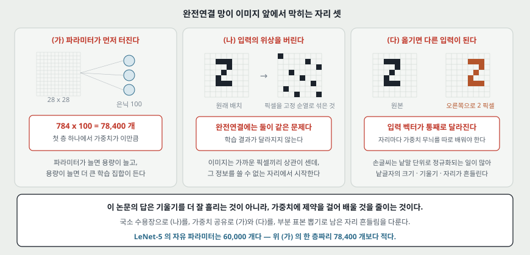

논문이 II절 머리에서 완전연결 망의 결점을 둘로 적는다.

**하나. 크기가 감당이 안 된다.** 논문의 예시 그대로 적으면, 이미지가 픽셀 몇백 개이고 첫 층 은닉 유닛이 100 개면 가중치가 이미 수만 개다. 파라미터가 늘면 용량이 늘고, 용량이 늘면 더 큰 학습 집합이 필요해진다.

**둘. 입력의 위상(topology)을 통째로 버린다.** 논문의 문장은 이렇다 — 입력 변수를 **어떤 고정된 순서로 주어도 학습 결과가 달라지지 않는다.** 그런데 이미지에서는 가까운 픽셀끼리 상관이 세다. 곧 완전연결 망은 「가깝다」는 정보를 쓸 수 없는 자리에서 시작한다.

그리고 셋째가 실전에서 더 아프다고 적는다. **완전연결 망에는 이동과 일그러짐에 대한 불변성이 들어 있지 않다.** 고정 크기 입력에 넣기 전에 글자를 크기 맞춰 가운데로 옮겨야 하는데, 손글씨는 낱말 단위로 정규화되는 일이 많아 낱글자의 크기·기울기·자리가 흔들린다. 원리상으로는 큰 완전연결 망이 불변인 출력을 배울 수도 있지만, 그러려면 **비슷한 가중치 무늬가 여러 자리에 하나씩 생겨야 하고**, 그것을 배우는 데 학습 사례가 아주 많이 든다고 적는다.

> **앞 논문들과 이어지는 자리.** 역전파(1986)는 은닉 유닛에 몫을 나누는 길을 열었고, DBN(2006)은 그 몫이 층을 지나며 곱해져 줄어드는 문제를 층별 학습으로 돌아갔다. **이 논문은 같은 역전파를 쓰되 가중치에 제약을 걸어 문제를 작게 만든다** — 배워야 할 자유 파라미터를 줄이고, 배워야 할 불변성의 일부를 구조로 미리 넣는다.

---

## 4. 세 가지 생각 — 국소 수용장 · 가중치 공유 · 부분 표본 뽑기

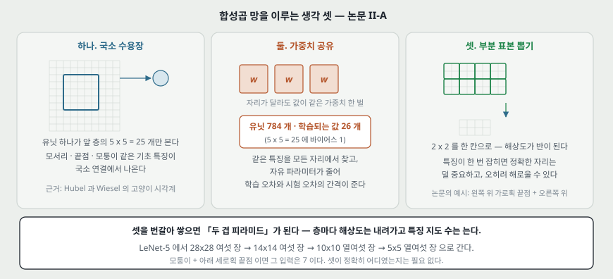

논문이 II-A 에서 합성곱 망을 세 가지 구조적 생각의 묶음이라고 적는다.

**하나. 국소 수용장.** 유닛이 앞 층의 작은 이웃만 본다. 근거로 Hubel 과 Wiesel 의 고양이 시각계 발견을 들고, 국소 연결로 모서리·끝점·모퉁이 같은 기초 특징을 뽑을 수 있다고 적는다.

**둘. 가중치 공유.** 한 특징 지도 안의 유닛들이 같은 가중치 한 벌을 쓴다. 효과가 둘이다. (가) **같은 특징을 모든 자리에서 찾는다.** (나) **자유 파라미터가 줄어 학습 오차와 시험 오차의 간격이 줄어든다.** 그리고 이 연산은 덧셈 바이어스와 누름 함수가 뒤따르는 **합성곱**과 같다고 적는다.

여기서 이 구조의 성질 하나가 나온다. **입력 이미지가 옮겨지면 특징 지도의 출력도 같은 양만큼 옮겨질 뿐 다른 것이 바뀌지 않는다.** 논문은 이것을 이동과 일그러짐에 대한 강건함의 뿌리라고 적는다.

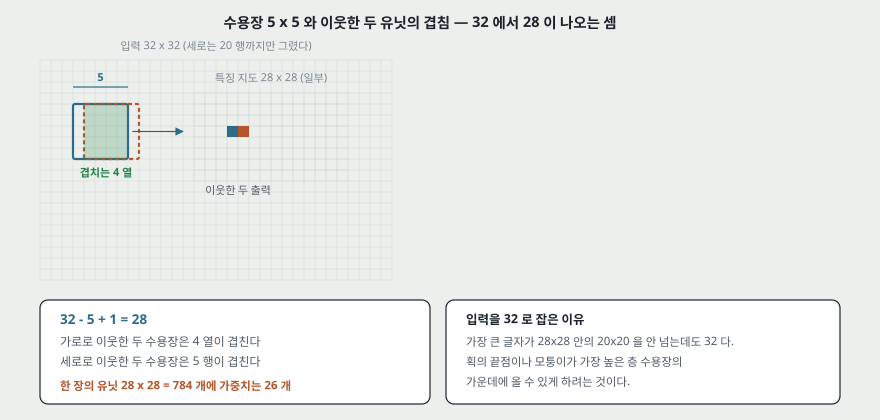

**줄어드는 것이 연결이 아니라 학습되는 값이라는 데 주의한다.** C1 을 예로 들면 연결은 122,304 개 그대로이고 학습되는 값만 156 개다. 곧 **계산량은 연결을 따라가고, 줄어드는 것은 용량이다.**

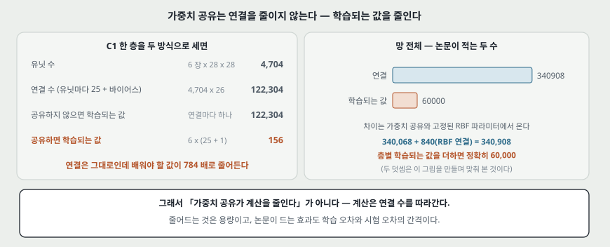

**셋. 부분 표본 뽑기.** 특징이 한 번 잡히고 나면 **정확한 자리는 덜 중요해지고 다른 특징에 대한 상대적인 자리만 쓸모 있다**고 적는다. 오히려 정확한 자리는 사례마다 달라 해로울 수 있다. 그래서 해상도를 반으로 깎아 자리 정밀도를 일부러 떨어뜨린다.

논문이 드는 예시를 그대로 옮기면 — **왼쪽 위에 가로획의 끝점이 있고, 오른쪽 위에 모퉁이가 있고, 아래쪽에 세로획의 끝점이 있으면 그 입력은 7 이다.** 셋이 정확히 어디에 있었는지는 필요 없다.

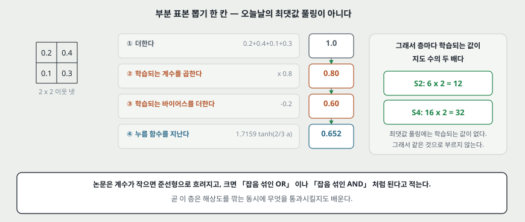

층을 합성곱과 부분 표본으로 번갈아 쌓으면 **「두 겹 피라미드」**가 된다고 적는다. 층마다 공간 해상도는 내려가고 특징 지도 수는 는다.

---

## 5. LeNet-5 의 층 일곱

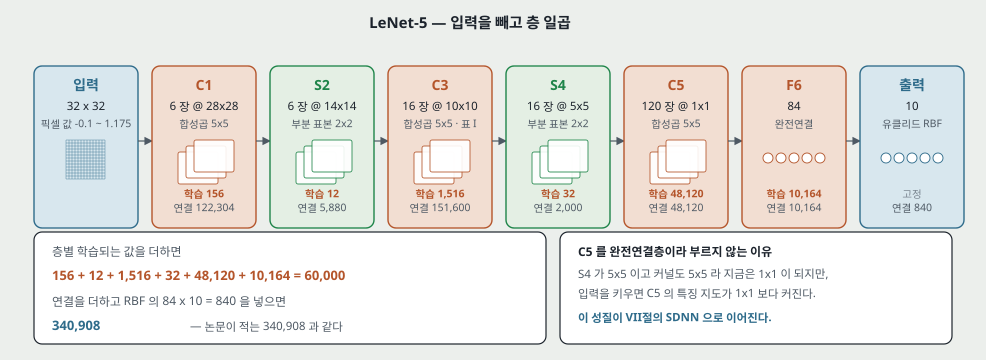

논문 II-B 가 적는 값을 그대로 옮긴다. **입력을 세지 않고 층이 일곱**이고, 모두 학습되는 가중치를 갖는다.

| 층 | 무엇 | 크기 | 학습되는 값 | 연결 |
|---|---|---|---|---|
| 입력 | 32×32 | — | — | — |
| C1 | 합성곱 5×5 | 특징 지도 6 장 × 28×28 | 156 | 122,304 |
| S2 | 부분 표본 2×2 | 6 장 × 14×14 | 12 | 5,880 |
| C3 | 합성곱 5×5 (표 I 의 연결) | 16 장 × 10×10 | 1,516 | 151,600 |
| S4 | 부분 표본 2×2 | 16 장 × 5×5 | 32 | 2,000 |
| C5 | 합성곱 5×5 (S4 열여섯 장 전부에 붙는다) | 120 장 × 1×1 | 48,120 | 48,120 |
| F6 | 완전연결 | 84 | 10,164 | 10,164 |
| 출력 | 유클리드 RBF | 10 | (손으로 정해 고정한다) | 840 |

**입력이 32×32 인 이유를 논문이 적는다.** 데이터베이스에서 가장 큰 글자가 28×28 칸 안의 20×20 을 넘지 않는데도 입력을 더 크게 잡은 것은, **획의 끝점이나 모퉁이 같은 특징이 가장 높은 층 수용장의 가운데에 올 수 있게** 하려는 것이다. LeNet-5 에서 마지막 합성곱층 C3 의 수용장 중심들이 32×32 입력 한가운데의 20×20 을 덮는다.

**입력 픽셀 값도 정규화한다.** 배경(흰색)이 −0.1 이고 글자(검은색)가 1.175 다. 그러면 입력의 평균과 분산이 각각 0 과 1 에 가까워져 학습이 빨라진다고 적는다. **논문이 쓴 말이 "roughly" 이고 실제 값은 적혀 있지 않다** — 내가 MNIST 12,000 장에 이 변환을 걸어 재 보니 평균 0.028 · 표준편차 0.352 였다(18절의 예비 실행에서 나온 값이다).

**C1 의 겹침을 숫자로 적는다.** 가로로 이웃한 두 유닛의 수용장은 4 열이 겹치고, 세로로 이웃한 두 유닛은 5 행이 겹친다.

**C3 가 S2 전부에 붙지 않는 이유 둘.** (가) 연결 수를 다스릴 만한 범위로 묶는다. (나) **망의 대칭을 깬다** — 입력 묶음이 서로 다르면 특징 지도들이 서로 다른(되도록 보완하는) 특징을 뽑게 된다. 표 I 의 연결은 이렇게 짜여 있다: 앞의 여섯 장은 S2 의 **이어진 세 장**씩, 다음 여섯 장은 **이어진 네 장**씩, 다음 세 장은 **이어지지 않은 네 장**씩, 마지막 한 장은 **여섯 장 전부**를 받는다.

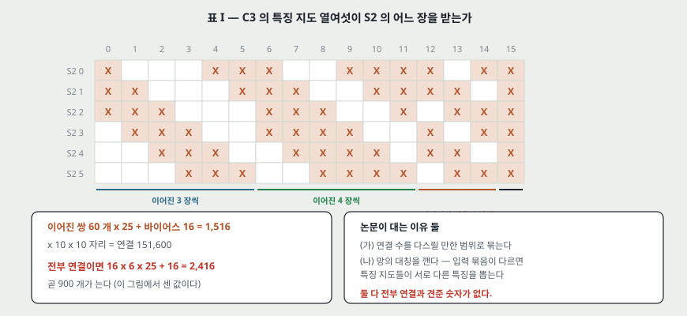

**C5 를 완전연결층이라 부르지 않는 이유도 적는다.** S4 가 5×5 이고 커널도 5×5 라 출력이 1×1 이 되어 결과적으로는 완전연결과 같지만, **입력을 키우면 C5 의 특징 지도가 1×1 보다 커지기 때문에** 합성곱층으로 둔다. 이 성질이 VII절의 SDNN 으로 이어진다.

---

## 6. 출력층과 손실 함수

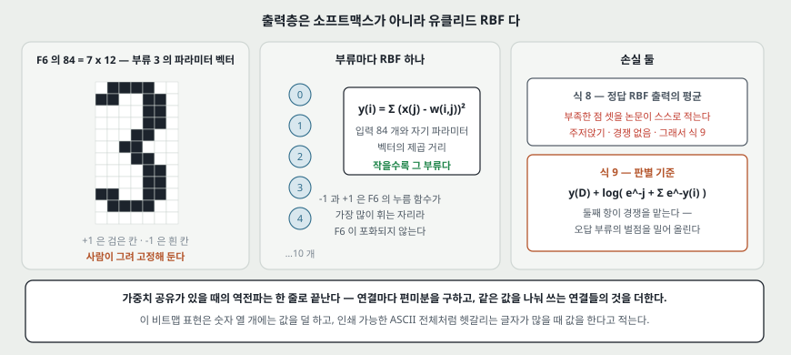

**출력층이 소프트맥스가 아니다.** 부류마다 유클리드 RBF 유닛 하나를 두고, 입력 84 개와 자기 파라미터 벡터의 제곱 거리를 낸다.

$$y_i = \sum_j (x_j - w_{ij})^2 \qquad (7)$$

**파라미터 벡터를 손으로 정했다.** 값은 −1 과 +1 이고, 84 = 7×12 비트맵으로 그 글자의 모양을 그린 것이다(그림 3 이 인쇄 가능한 ASCII 전체의 초기 파라미터를 보인다). 숫자 열 개를 알아보는 데는 이런 표현이 특별히 쓸모 있는 것이 아니지만, **부류가 수십 개를 넘고 뒤에 언어 모델이 붙는 경우에 쓸모 있다**고 적는다 — 대문자 O 와 소문자 o 와 숫자 0 처럼 헷갈리는 글자들이 비슷한 코드를 갖게 되고, 뒤따르는 후처리기가 그 헷갈림을 고칠 수 있기 때문이다.

그리고 −1 과 +1 이 F6 의 누름 함수가 **가장 많이 휘는 자리**라 F6 이 포화되지 않게 한다고 적는다.

**손실 함수 둘.** 가장 단순한 것은 정답 부류 RBF 의 출력을 그대로 평균한 것이다.

$$E(W) = \frac{1}{P}\sum_{p=1}^{P} y_{D^p}(Z^p, W) \qquad (8)$$

논문이 이 식의 부족한 점 셋을 스스로 적는다. (가) RBF 파라미터까지 배우게 두면 **전부 같은 값으로 주저앉는 해**(collapse)가 생긴다. (나) **부류 사이의 경쟁이 없다.** (다) 그래서 더 판별적인 기준을 쓴다.

$$E(W) = \frac{1}{P}\sum_{p=1}^{P}\Big( y_{D^p}(Z^p, W) + \log\big(e^{-j} + \sum_i e^{-y_i(Z^p,W)}\big) \Big) \qquad (9)$$

둘째 항이 **경쟁**을 맡는다. 정답 부류의 벌점을 내리는 동시에 오답 부류의 벌점을 올린다. 상수 $j$ 는 이미 아주 커진 부류의 벌점이 더 밀려 올라가는 것을 막는다.

**가중치 공유가 있을 때 역전파를 어떻게 고치는지도 한 줄로 적는다.** 공유가 없는 보통 망인 것처럼 **연결마다** 편미분을 구한 다음, **같은 파라미터를 나눠 쓰는 연결들의 편미분을 더한다.**

---

## 7. 학습 설정 — 부록 A · B · C

논문의 수치를 다시 돌려 보려면 이 절이 필요하다.

**누름 함수와 초기화 (부록 A).** $A = 1.7159$, $S = 2/3$ 이라 $f(1) = 1$, $f(-1) = -1$ 이 성립한다. 가중치는 $[-2.4/F_i,\ 2.4/F_i]$ 의 균등분포로 뽑는다. $F_i$ 는 그 연결이 들어가는 유닛의 입력 수(팬인)다. **팬인으로 나누는 이유**는 가중합의 초기 표준편차를 유닛마다 같은 범위에 두고 누름 함수의 정상 동작 구간에 떨어뜨리려는 것이다. 가중치가 너무 작으면 기울기가 작아 느려지고, 너무 크면 포화되어 역시 기울기가 작아진다.

**확률적 기울기 대 묶음 기울기 (부록 B).** 크고 겹치는 데이터에서는 확률적 쪽이 묶음보다 빠르며 때로는 자릿수가 다르다고 적는다. 근거로 드는 극단 예시가 명료하다 — **같은 부분집합 두 벌로 만든 학습 집합**이면, 묶음 기울기는 같은 계산을 두 번 하는 셈이고 확률적 기울기는 한 바퀴 도는 동안 두 에폭을 도는 셈이다. 2차 방법(가우스-뉴턴과 레벤버그-마콰르트는 갱신마다 $O(N^3)$, 준뉴턴은 $O(N^2)$)은 큰 망에 맞지 않는다고 적는다.

**확률적 대각 레벤버그-마콰르트 (부록 C).** 파라미터마다 걸음 크기를 따로 둔다.

$$\epsilon_k = \frac{\eta}{\mu + h_{kk}} \qquad (21)$$

$h_{kk}$ 는 손실의 2차 미분 추정값이고 $\mu$ 는 손으로 고른 상수다. 근사가 셋이다. (가) 헤시안의 비대각 항을 버린다. (나) 2차 미분 추정값이 음수가 되지 않도록 **가우스-뉴턴 근사**를 쓴다. (다) 평균을 전체 학습 집합이 아니라 **작은 부분집합**에서 낸다 — 이 논문의 실험에서는 **학습 한 바퀴마다 500 장**으로 다시 추정했고, 학습 집합이 60,000 장이라 그 비용을 따로 세지 않는다.

이 절차를 쓴 이유를 적는 자리가 중요하다. **가중치 공유가 손실 표면의 조건수를 나쁘게 만든다** — 앞쪽 층의 파라미터 하나가 출력에 미치는 영향이 아주 커서, 그 파라미터에 대한 2차 미분이 다른 파라미터보다 훨씬 클 수 있다. 위 알고리즘이 그것을 보정한다.

**MNIST 학습에 쓴 값.** 전체 학습 집합을 20 바퀴 돌았고, 전역 학습률 $\eta$ 를 바퀴에 따라 0.0005(두 바퀴) → 0.0002(세 바퀴) → 0.0001(세 바퀴) → 0.00005(네 바퀴) → 0.00001(나머지)로 내렸다. $\mu = 0.02$. 첫 바퀴에서 파라미터 전체에 걸친 실효 학습률이 $7\times10^{-5}$ 에서 0.016 사이였다.

**학습 시간.** LeNet-5 를 200MHz R10000 프로세서 하나(Silicon Graphics Origin 2000)에서 배우는 데 **CPU 2~3 일**이 들었다고 적는다.

---

## 8. MNIST — 데이터가 어떻게 만들어졌는가

논문 III-A 가 적는다. NIST 의 SD-3 과 SD-1 을 **섞어서** 새 집합을 만든 이유가 분명하다 — **SD-3 은 인구조사국 직원이 썼고 SD-1 은 고등학생이 썼으며, SD-3 쪽이 훨씬 깨끗하고 알아보기 쉽다.** 학습과 시험을 무엇으로 고르느냐에 결과가 딸려 가지 않게 하려면 섞어야 한다.

- SD-1 은 500 명이 쓴 58,527 장이다. 글쓴이 정보가 있어 **앞 250 명을 학습, 뒤 250 명을 시험**으로 갈랐다.
- 각각 30,000 장 가까이가 되고, 여기에 SD-3 을 채워 **학습 60,000 장 · 시험 60,000 장**을 만들었다.
- **이 논문의 실험은 시험 60,000 장 중 10,000 장만 쓴다**(SD-1 에서 5,000 장, SD-3 에서 5,000 장). 학습은 60,000 장 전부를 쓴다.
- 이미지는 **가로세로 비를 지키며 20×20 칸에 맞추고**(그래서 회색조가 생긴다), **픽셀의 무게중심을 28×28 칸의 가운데에 놓는다.** 32×32 는 그 28×28 을 배경으로 넓힌 것이다.

논문은 판을 셋 쓴다 — 보통(regular), 기울기를 편 것(deslanted, 20×20 으로 잘라냈다), 16×16 으로 줄인 것. **표에서 `[deslant]` 와 `[16x16]` 이 붙은 행은 입력이 다른 행이다.**

---

## 9. 결과 — 무엇이 무엇을 이겼는가

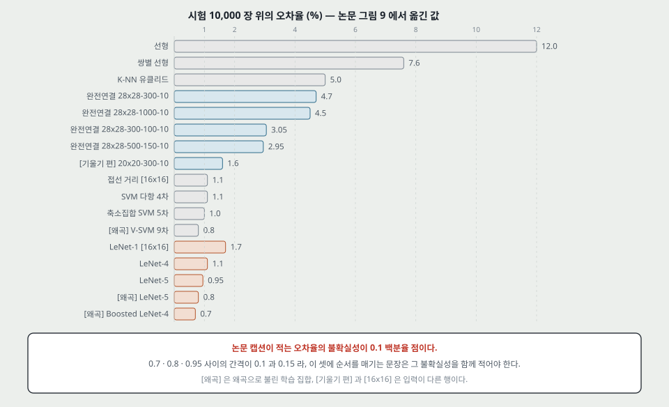

그림 9 가 시험 10,000 장 위의 오차율(%)이다. 본문이 인용한 값만 옮긴다.

| 방법 | 오차(%) | 같은 칸에 두기 전에 볼 것 |
|---|---|---|
| 선형 분류기 | 12.0 | 자유 파라미터 7,850 |
| 선형, 기울기 편 입력 | 8.4 | 자유 파라미터 4,010 |
| 쌍별 선형 | 7.6 | 유닛 45 개 |
| K-최근접이웃(유클리드) | 5.0 | 학습 시간 0, 메모리 24 MB (20×20 픽셀 60,000 장을 픽셀당 1 바이트로) |
| 위, 기울기 편 입력 | 2.4 | $k = 3$ |
| 주성분 40 + 2차 분류기 | 3.3 | |
| RBF 1,000 + 선형 | 3.6 | |
| 접선 거리(16×16) | 1.1 | |
| SVM 다항 4차 | 1.1 | 곱셈-누적 14,000 (그림 11 의 단위로) |
| 축소집합 SVM 5차 | 1.0 | 같은 단위로 650 |
| V-SVM 9차, 왜곡 학습 | 0.8 | 같은 단위로 28,000 |
| 완전연결 28×28-300-10 | 4.7 | |
| 완전연결 28×28-1000-10 | 4.5 | |
| 완전연결 28×28-300-100-10 | 3.05 | 은닉층 둘 |
| 완전연결 28×28-500-150-10 | 2.95 | |
| 완전연결 20×20-300-10, 기울기 편 입력 | 1.6 | **입력이 다르다** |
| LeNet-1 (16×16 입력) | 1.7 | 자유 파라미터 약 2,600 |
| LeNet-4 | 1.1 | 연결 약 260,000, 자유 파라미터 17,000 |
| LeNet-5 | **0.95** | 자유 파라미터 60,000 |
| LeNet-5, 왜곡 학습 | **0.8** | 원본 60,000 + 왜곡 540,000 |
| Boosted LeNet-4, 왜곡 학습 | **0.7** | 망 셋, 평균 계산 비용이 한 망의 1.75 배 |

**논문 자신이 적는 불확실성이 0.1 백분율 점이다**(그림 9 캡션). 그래서 0.7 · 0.8 · 0.95 사이의 간격은 그 불확실성과 같은 자릿수다. 논문 본문도 순서를 매기는 대신 "Boosted LeNet-4 가 가장 잘했고 LeNet-5 가 0.8% 로 바짝 뒤따른다"고 적는다.

**오차만 보지 않는다.** 논문이 네 축을 따로 그린다.

| 축 | 그림 | LeNet-5 | 견줄 값 |
|---|---|---|---|
| 오차율 | 9 | 0.95 (왜곡 학습 0.8) | 완전연결 28×28-1000-10 이 4.5 |
| 기각률(오차 0.5% 를 맞추려면 몇 %를 사람에게 넘겨야 하는가) | 10 | (그림 10 에 LeNet-5 행이 없다) | LeNet-4 1.8 · LeNet-4/Local 1.4 · 왜곡 학습 Boosted LeNet-4 0.5 |
| 곱셈-누적 횟수 | 11 | 401 | 28×28-1000-10 이 795 · 축소집합 SVM 이 650 · K-NN 이 24,000 |
| 메모리(변수 개수) | 12 | 60 | 28×28-1000-10 이 795 · K-NN 이 24,000 |

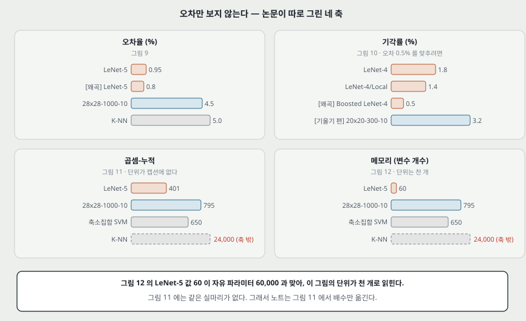

**그림 12 의 단위는 천 개다.** LeNet-5 값 60 이 II-B 가 적은 자유 파라미터 60,000 과 맞아서 그렇게 읽힌다. **그림 11 의 단위는 캡션에 적혀 있지 않다.** 축 눈금이 0·300·600·900 이고 벗어난 값이 화살표와 함께 24,000 처럼 적혀 있다. 그래서 이 노트는 그림 11 에서 **배수만** 옮긴다 — LeNet-5 가 401 이고 축소집합 SVM 이 650 이니 1.6 배다.

**학습 데이터가 더 있으면 더 좋아진다는 것도 쟀다.** 그림 6 이 15,000 · 30,000 · 60,000 장으로 배운 결과다. 그리고 왜곡으로 사례를 불렸다 — 평면 아핀 변환(가로세로 이동 · 크기 · 눌림 · 가로 밀림) 조합으로 **원본 60,000 장에 왜곡 540,000 장**을 더했고, 학습 길이는 그대로 20 바퀴였다. 그래서 **망이 사례 하나를 사실상 두 번씩만 본다.** 시험 오차가 0.95% 에서 0.8% 로 내려갔다.

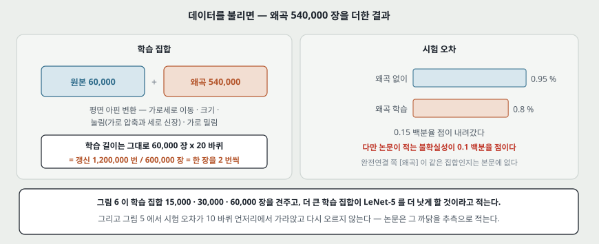

**과학습이 나타나지 않았다는 관찰도 적는다.** 학습 곡선(그림 5)에서 시험 오차가 10 바퀴 언저리에서 가라앉고 그 뒤로 올라가지 않는다. 논문이 대는 이유는 **학습률이 비교적 컸고 가중치가 극소점에 자리 잡지 못한 채 흔들려서** 평균 비용이 더 넓은 극소점 쪽에 놓였다는 것이다. 곧 **확률적 기울기가 정칙화처럼 작용했다**는 설명이고, 논문은 이것을 추측(conjecture)으로 적는다. 학습 오차는 19 바퀴에서 0.35% 다.

---

## 10. 불변성 — 논문이 「추정된다」로 적은 세 값

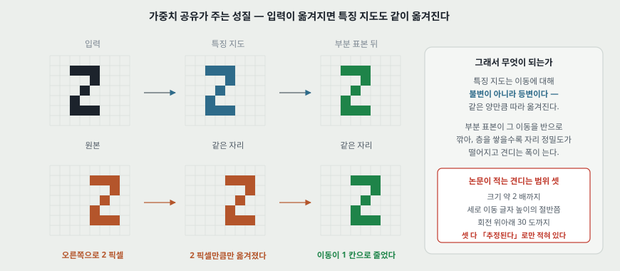

III-E 가 LeNet-5 가 견디는 범위를 적는다. **정확히 알아보는 범위가 「추정된다(estimated)」로 적혀 있고 표도 곡선도 없다.**

- 크기 변화는 **약 2 배까지**
- 세로 이동은 **글자 높이의 절반쯤 위아래로**
- 회전은 **위아래로 30 도까지**

그림 13 이 그 예시를 보이는데, 학습 집합에 **픽셀마다 확률 0.1 로 값을 뒤집는 소금후추 잡음**을 넣어 배운 망이다. 논문의 결론 문장은 조심스럽다 — **복잡한 모양을 온전히 불변으로 알아보는 것은 아직 손에 잡히지 않은 목표이고, 합성곱 망은 기하학적 일그러짐에 대한 부분적인 답이다.**

> **돌려 봤다 (2026-09-21).** 위 세 값 중 이동을 직접 쟀다. **왜곡 학습을 하지 않고 배운 망**(학습 12,000 장 · 12 바퀴 · seed 셋)에 시험 이미지를 옮겨 보니, 기준 오차 2.01% 의 두 배를 넘지 않는 폭이 **가로 ±1 픽셀 · 세로 ±1 픽셀**이었다. 2 픽셀에서 가로 7.20% · 세로 9.10% 이고, 8 픽셀에서는 가로 78.71% · 세로 91.88% 로 찍기와 같아진다.
>
> **이 숫자는 논문의 추정을 반박하지 않는다.** 논문이 그 범위를 말하는 자리의 망은 **이동을 포함한 왜곡으로 불린 데이터**로 배운 것이고 내 망은 아니다. 같은 칸에 놓으려면 왜곡 학습을 넣고 다시 재야 한다. 곧 지금 확인된 것은 **「왜곡 없이 배우면 부분 표본 뽑기 둘만으로는 ±1 픽셀이다」**까지다.

---

## 11. 여러 글자 — 자를 자리를 고르지 않는 두 가지 길

낱글자를 잘 알아보는 것과 문서를 읽는 것은 다르다. 논문이 I-D 에서 문제를 못박는다. **잘못 잘린 글자에 라벨을 붙인 데이터베이스를 만드는 일이 지독하게 비싸고, 일관되게 붙이기도 어렵다.** 논문이 드는 예시가 좋다 — **4 를 반으로 자른 오른쪽 조각을 1 이라고 적어야 하는가, 글자가 아니라고 적어야 하는가. 8 을 반으로 자른 오른쪽 조각은 3 인가.**

그래서 답을 둘 낸다.

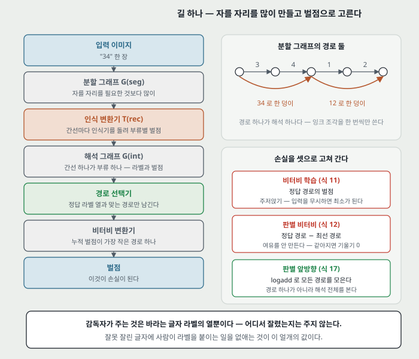

**길 하나 — 휴리스틱 과분할 + GTN (V·VI절).** 자를 자리를 **필요한 것보다 많이** 만들어 **분할 그래프**를 세우고, 인식기가 간선마다 벌점을 매겨 **해석 그래프**로 넓히고, 비터비 알고리즘이 누적 벌점이 가장 작은 경로를 고른다. 마디마다

$$v_n = \min_{i \in U_n}(c_i + v_{s_i}) \qquad (10)$$

이고, $U_n$ 은 마디 $n$ 으로 들어오는 간선들이다.

**학습을 문자열 수준에서 한다.** 감독자가 주는 것은 **바라는 글자 라벨의 열뿐**이고, 어디서 잘렸는지는 주지 않는다. 경로 선택기가 정답 라벨 열과 맞는 경로만 남긴 **제약된 해석 그래프**를 만들고, 그 안의 최소 벌점 경로 벌점 $C_\text{cvit}$ 을 손실로 삼는다.

논문이 이 방식의 함정을 스스로 적는다. **주저앉기(collapse)** — 인식기가 입력을 무시하고 모든 출력에 작은 값을 내면 손실이 가장 작아진다. 출력이 파라미터가 고정된 RBF 면 완전한 주저앉기는 막히지만, **평평한 자리(flat spot)** 는 남는다. 그래서 판별 기준으로 간다.

$$E_\text{dvit} = C_\text{cvit} - C_\text{vit} \qquad (12)$$

곧 **정답 경로의 벌점에서 (제약 없는) 최선 경로의 벌점을 뺀다.** 여기에도 문제가 남는다고 적는다 — **부류 사이에 여유(margin)를 만들지 않는다.** 둘이 같아지는 순간 기울기가 0 이 된다. 그 해법이 앞방향(forward) 기준이다. 경로 하나가 아니라 **같은 해석을 내는 모든 경로**를 모으는데, `min` 대신 `logadd` 를 쓴다.

$$f_n = \operatorname{logadd}_{i \in U_n}(c_i + f_{s_i}), \qquad \operatorname{logadd}(x_1,\dots,x_n) = -\log\Big(\sum_{i=1}^{n} e^{-x_i}\Big) \qquad (13),(14)$$

$$E_\text{dforw} = C_\text{cforw} - C_\text{forw} \qquad (17)$$

**이 두 식의 관계를 논문이 한 줄로 정리한다** — 앞방향 알고리즘을 그래프에 적용하는 것은 신경망에 순방향을 도는 것과 같고, 다만 **곱셈이 덧셈으로, 덧셈이 logadd 로 바뀌고 누름 함수가 없다.**

**길 둘 — SDNN (VII절).** 자를 자리를 아예 고르지 않고 **인식기를 모든 자리에 대어 본다.** 그냥 하면 비싸지만, 합성곱 망은 이웃한 두 인스턴스가 같은 자리를 보는 유닛의 출력을 다시 계산할 필요가 없다. 곧 **입력 폭을 넓히면 같은 계산이 한 번에 된다.** 출력층도 합성곱층이 되어, 자리마다 「여기에 이 글자가 있다」는 증거가 나온다.

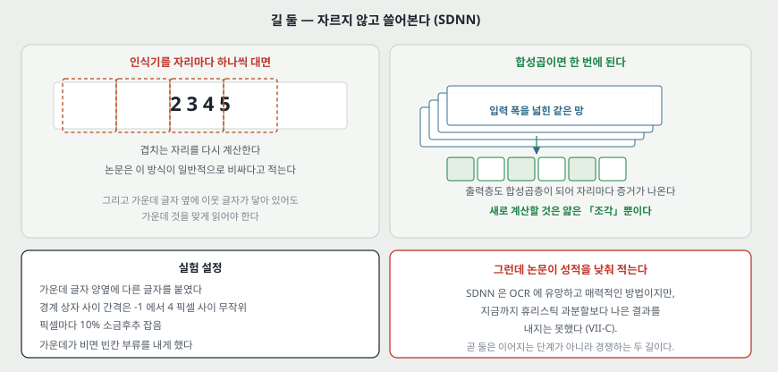

SDNN 실험 설정도 적혀 있다 — 가운데 글자 양옆에 다른 글자를 붙이고, 경계 상자 사이 간격을 **−1 에서 4 픽셀** 사이로 무작위로 두고, **10% 소금후추 잡음**을 넣었다. 가운데에 글자가 없는 경우도 만들어 그때는 빈칸 부류를 내게 했다.

**그런데 SDNN 의 성적을 논문이 낮춰 적는다.** VII-C 끝에 이렇게 적혀 있다 — **SDNN 은 OCR 에 유망하고 매력적인 방법이지만, 지금까지 휴리스틱 과분할보다 나은 결과를 내지는 못했다.**

---

## 12. 전역 학습이 값을 했는가 — 두 응용의 숫자

**온라인 필기 (IX절).** 펜 궤적을 AMAP 이라는 저해상도 이미지로 바꾸고, 그 위에 LeNet-5 와 비슷한 5층 합성곱 망을 쓴다(층 1: 3×3 커널 8 개, 층 2: 2×2 부분 표본, 층 3: 5×5 커널 25 개, 층 4: 4×4 커널 84 개, 층 5: 2×1 부분 표본, 출력: 95 부류 RBF). **낱글자 시험**: 대문자 2.99%(9,122 장) · 소문자 4.15%(8,201 장) · 숫자 1.4%(2,938 장) · 문장 부호 4.3%(881 장).

**전역 학습의 몫이 여기서 숫자로 나온다.** 소문자 낱말 3,500 개로 낱말 수준 판별 학습을 하기 전과 뒤를 견준다.

| 체계 | 사전 | 전역 학습 전 (낱말 / 글자 오차 %) | 전역 학습 뒤 | 상대 감소 |
|---|---|---|---|---|
| SDNN/HMM | 없음 | 38 / 12.4 | 26 / 8.2 | 32% / 34% |
| 휴리스틱 과분할 | 없음 | 22.5 / 8.5 | 17 / 6.3 | 24.4% / 25.6% |
| 휴리스틱 과분할 | 25,461 낱말 | 4.6 / 2.0 | 3.2 / 1.4 | 30.4% / 30.0% |
| 휴리스틱 과분할 | 350 낱말 | (적혀 있지 않다) | 1.6 / 0.94 | — |

**수표 읽기 (X절).** 은행이 보는 경제성의 문턱을 적어 둔 것이 이 절에서 가장 또렷하다 — **수표의 50% 를 오차 1% 미만으로 읽으면 쓸 만하다.** 나머지 50% 는 사람에게 넘긴다. 이 체계는 기계 인쇄로 분류된 수표 646 장에서 **82% 정답 · 1% 오차 · 17% 기각**을 냈고, 같은 시험 집합에서 이전 체계가 **68% / 1% / 31%** 였다. 신경망 인식기는 인쇄 가능한 ASCII 전체에 걸친 글자 이미지 500,000 장으로 먼저 배웠다.

**그런데 이 응용에서는 전역 학습의 몫이 작았다고 적는다.** 이유도 함께 적혀 있다 — **전역 학습이 건드린 것이 전체 파라미터 중 작은 부분집합뿐이었기 때문이다.** 개선의 원인 셋을 따로 꼽는데 (가) 신경망이 더 컸고 더 많은 데이터로 배웠다, (나) GTN 구조 덕에 문법 제약을 효율적으로 쓸 수 있었다, (다) **휴리스틱을 시험하고 파라미터를 맞추는 일이 훨씬 유연해졌다** 이고, 논문은 셋째가 보기보다 중요하다고 적는다.

---

## 13. 이 논문이 스스로 적은 한계

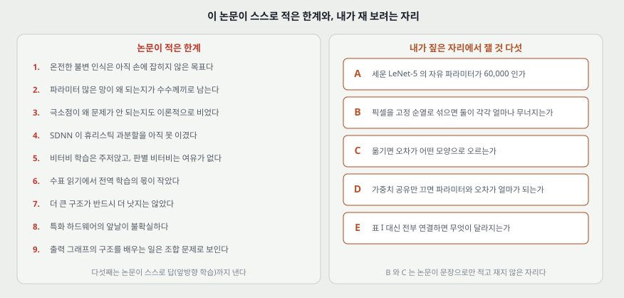

1. **온전한 불변 인식은 아직 손에 잡히지 않은 목표다.** 합성곱 망이 내놓는 것은 기하학적 일그러짐에 대한 **부분적인** 답이다(III-E).
2. **자유 파라미터가 많은 망이 왜 낮은 시험 오차를 내는지가 남아 있다.** 논문이 "somewhat of a mystery" 라고 적고, 자기 설명(작은 가중치에서 시작해 용량이 서서히 커진다)을 **추측**으로 내놓은 뒤 **더 나은 이론적 이해와 실증이 분명히 필요하다**고 적는다(III-C.5).
3. **극소점이 실제로 문제가 되지 않는 까닭도 이론적으로는 수수께끼라고 적는다**(I-C).
4. **SDNN 이 휴리스틱 과분할을 아직 이기지 못했다**(VII-C).
5. **비터비 학습에는 주저앉기가, 판별 비터비 학습에는 여유가 없다는 결함이 있다**(VI-A, VI-B). 앞방향 학습이 그 답이라고 적는다.
6. **수표 읽기에서 전역 학습의 몫이 작았다** — 전역 학습이 파라미터의 작은 부분집합만 건드렸기 때문이다(X-D).
7. **더 큰 구조가 반드시 더 낫지는 않았고 학습 시간만 많이 늘었다**(IX-B).
8. **특화 하드웨어의 앞날이 불확실하다.** 아날로그·디지털 혼합 칩이 초당 1,000 자를 넘겼지만, **보통 프로세서의 발전 속도가 그런 기술을 빠르게 낡게 만든다**고 적는다(III-D, VII-D).
9. **출력 그래프의 구조 자체를 배우는 그래프 변환기는 조합 문제로 보이고 기울기 학습에 맞지 않는다**(VIII-D). 큰 그래프를 만들어 부분 그래프를 고르는 우회를 제안한다.

그리고 결론 절이 앞을 내다보는 문장 하나 — **데이터가 흔해지고 컴퓨터가 빨라지고 학습 알고리즘의 이해가 깊어지면서, 인식 체계는 점점 더 학습에 기대게 될 것이다.**

---

## 14. 논문이 적지 않은 것 — 내가 읽으며 짚은 자리

**여기서부터는 논문의 말이 아니라 내 것이다.**

**하나. 세 가지 생각 각각의 몫이 갈려 있지 않다.** 국소 수용장 · 가중치 공유 · 부분 표본 뽑기를 함께 넣고 쟀고, **하나씩 끈 행이 표에 없다.** 그래서 「합성곱 망이 완전연결보다 낫다」까지는 표가 보이지만 「셋 중 무엇이 얼마를 냈는가」는 이 논문 안에서 답이 안 난다.

> **돌려 봤다 (2026-09-21).** 연결 구조를 그대로 두고 **가중치 공유만** 껐더니 시험 오차가 2.01% 에서 2.65% 로 **+0.64 백분율 점** 올랐다(seed 셋의 변동 폭 0.27). 학습되는 값은 60,000 에서 332,232 가 된다. **셋 중 공유의 몫은 이렇게 갈라 잴 수 있고, 국소 수용장과 부분 표본 뽑기의 몫은 아직 갈리지 않았다.**

**둘. 완전연결 대조군이 같은 조건이 아니다.** 28×28-300-10 이 4.7% 이고 LeNet-5 가 0.95% 인데, 둘은 **입력 크기(28×28 대 32×32)** 도 **자유 파라미터 수(238,510 대 60,000)** 도 **출력층과 손실(선형 출력 대 RBF 와 식 9)** 도 함께 다르다. 차이 3.75 백분율 점 중 얼마가 구조에서 왔는지는 이 표로 갈리지 않는다.

> 완전연결 쪽 파라미터 수는 내가 센 것이다 — $784\times300 + 300 + 300\times10 + 10 = 238{,}510$. 논문은 이 망의 파라미터 수를 적지 않는다.

**셋. 「픽셀을 섞어도 똑같이 할 것」이 재 보지 않은 문장이다.** III-D 에서 SVM 을 두고 이렇게 적는다 — **이 분류기는 이미지 픽셀을 고정된 대응으로 섞어 그림 구조를 잃어도 똑같이 잘할 것이다.** 이 문장은 「합성곱 망은 그렇지 않다」를 전제로 쓴 것인데, **섞어서 잰 표가 논문에 없다.** 곧 합성곱 망이 얼마나 무너지는지도, SVM 이 정말 그대로인지도 숫자가 없다.

> **돌려 봤다 (2026-09-21).** 고정 순열을 학습과 시험에 함께 걸었다. **완전연결 망은 4.96% 에서 4.87% 로 변동 폭(0.25) 안에 머물렀다** — 논문이 SVM 을 두고 적은 문장이 완전연결 망에서는 이 규모에서 숫자로 확인된다. **합성곱 망은 1.97% 에서 89.90% 가 되었는데, 학습 오차도 89.5~90.6% 라 「나빠진 것」이 아니라 「이 학습률에서 배우지 못한 것」이다.** 둘을 가려 적는다.

**넷. 불변 범위 셋이 추정값이다.** 배율 2 배 · 세로 이동 글자 높이의 절반 · 회전 30 도. **곡선도 표도 없고 "estimated" 라고 적혀 있다.** 그런데 이 셋은 재기 쉬운 값이다 — 시험 이미지를 옮기고 돌려 가며 오차를 세면 된다.

> **돌려 봤다 (2026-09-21).** 이동만 쟀고 값은 10절에 적었다 — 왜곡 학습 없이 배운 망이 견디는 폭이 **가로 ±1 픽셀 · 세로 ±1 픽셀**이다. 크기와 회전은 아직 재지 않았다.

**다섯. 표 I 의 근거 둘이 측정이 아니다.** 연결 수를 다스린다는 것과 대칭을 깬다는 것인데, **전부 연결과 견준 숫자가 없다.** 전부 연결이면 C3 의 학습되는 값이 $16\times(6\times25) + 16 = 2{,}416$ 이라 1,516 에서 900 이 는다(내가 센 값이다). 그 900 이 오차에 무엇을 하는지가 비어 있다.

> **돌려 봤다 (2026-09-21).** 전부 연결 1.98% 대 표 I 2.01% 이고 차이 −0.03 이 seed 셋의 변동 폭 0.27 안이라 **순서를 매기지 않는다.** 이 규모에서 표 I 이 남긴 것은 오차가 아니라 **학습되는 값 900 개**다.

**여섯. 왜곡 학습의 몫이 방법마다 다르게 나오는데 그 왜곡이 같은 것인지 적혀 있지 않다.** LeNet-5 는 0.95 → 0.8 이고 28×28-300-100-10 은 3.05 → 2.5 다. LeNet-5 쪽은 원본 60,000 에 왜곡 540,000 을 더했다고 적지만, **완전연결 쪽 `[dist]` 가 같은 집합인지는 본문에 없다.**

**일곱. 0.1 백분율 점과 0.15 백분율 점.** 논문 자신이 오차율의 불확실성을 약 0.1 백분율 점이라고 적는다. Boosted LeNet-4(0.7) · 왜곡 학습 LeNet-5(0.8) · LeNet-5(0.95) 의 간격이 0.1 과 0.15 다. **곧 이 셋에 순서를 매기는 문장은 그 불확실성을 함께 적어야 한다.** 논문 본문은 "가장 잘했다 / 바짝 뒤따른다" 로 적어 이 선을 넘지 않는다.

**여덟. 학습 시간이 한 줄이다.** "CPU 2~3 일" 이 어느 망을 어느 데이터로 배운 것인지(왜곡 540,000 장을 포함하는지) 적혀 있지 않다.

**아홉. 「할 수 있다」와 「해 봤다」가 몇 자리에서 섞인다.** VIII-D 의 「출력 그래프의 구조를 배우는 변환기」와 VII-D 의 얼굴 찾기 · 봉투의 주소 구역 찾기 · 영상 추적은 **가능성으로 적힌 것**이고, 이 논문이 표로 재 놓은 것은 MNIST · 온라인 필기 · 수표 읽기 셋이다.

---

## 15. 읽을 때 헷갈리는 지점

**하나. 60,000 과 340,908.** 자유 파라미터 60,000 은 C1·S2·C3·S4·C5·F6 의 학습되는 값을 더한 것이고 ($156 + 12 + 1{,}516 + 32 + 48{,}120 + 10{,}164 = 60{,}000$, 정확히 떨어진다), 연결 340,908 은 여기에 **출력 RBF 의 연결 840(= 84×10)** 까지 넣은 것이다 ($122{,}304 + 5{,}880 + 151{,}600 + 2{,}000 + 48{,}120 + 10{,}164 + 840 = 340{,}908$). **RBF 파라미터는 고정이라 자유 파라미터에 안 들어가고 연결에는 들어간다.** 두 덧셈은 내가 맞춰 본 것이고, 논문은 두 수를 따로 적는다.

**둘. 부분 표본 뽑기는 오늘날의 풀링이 아니다.** 2×2 를 **더하고**, 학습되는 계수를 곱하고, 학습되는 바이어스를 더하고, 누름 함수를 지난다. 그래서 층마다 학습되는 값이 지도 수의 두 배다(S2 는 12, S4 는 32). 논문은 이 계수가 작으면 준선형으로 흐려지고 크면 "잡음 섞인 OR" 이나 "잡음 섞인 AND" 처럼 동작한다고 적는다.

**셋. 논문의 "sigmoid" 는 로지스틱이 아니다.** $1.7159\tanh(\tfrac{2}{3}a)$ 다.

**넷. 출력이 소프트맥스가 아니다.** 유클리드 거리를 내는 RBF 이고 파라미터가 사람이 그린 7×12 비트맵이다. 그래서 「출력이 클수록 좋다」가 아니라 **작을수록 좋다.**

**다섯. LeNet-1 · LeNet-4 · LeNet-5 가 다른 망이다.** 표에서 나란히 나오지만 입력 크기(LeNet-1 은 16×16)와 규모가 다르다.

**여섯. 그림 11 과 12 의 단위.** 12 는 LeNet-5 의 60 이 60,000 과 맞아 천 개로 읽히지만, **11 의 단위는 캡션에 적혀 있지 않다.**

**일곱. 휴리스틱 과분할과 SDNN 은 같은 문제를 푸는 서로 다른 두 길이다.** 이어지는 단계가 아니다.

---

## 16. 앞 논문들과 맞춰 보기

| 앞 논문이 남긴 자리 | 이 논문이 한 것 |
|---|---|
| 퍼셉트론(1958) — 직선 하나로 갈리는 문제만 푼다 | 해당 없다. 이 논문은 역전파를 전제로 시작한다 |
| 역전파(1986) — 은닉 유닛에 몫을 나누지만 입력의 위상은 여전히 안 쓴다 | **가중치에 제약을 걸어 위상을 구조로 넣는다.** 같은 역전파를 쓰되 파라미터를 공유한다 |
| 역전파(1986) — 기울기가 층마다 줄어든다 | 정면으로 풀지 않는다. 대신 **자유 파라미터를 60,000 으로 줄이고** 2차 정보로 파라미터별 걸음을 맞춘다(부록 C) |
| DBN(2006)이 적은 한계 3 — 지각 불변성을 다루는 체계적인 방법이 없다 | **부분적인 답**을 낸다. 가중치 공유로 이동에 대한 등변성을 얻고, 부분 표본으로 자리 정밀도를 깎는다. 다만 논문 스스로 부분적이라고 적는다 |
| DBN(2006)이 적은 한계 4 — 분할이 이미 끝났다고 가정한다 | **분할을 학습 안으로 넣는다.** 자를 자리를 많이 만들고 문서 수준 벌점 하나로 전부를 배운다 |

**연도 순서를 뒤집어 읽은 것이라 한 가지를 조심한다.** 이 논문(1998)이 DBN(2006)보다 여덟 해 앞이다. 곧 **이 논문이 DBN 의 한계에 답한 것이 아니라, 내가 DBN 노트에서 비어 있다고 적은 자리에 이 논문이 이미 놓여 있던 것이다.** 시간 순서로 보면 DBN 은 이 논문이 **풀지 않은 쪽**(비지도로 깊은 망을 배우는 쪽)으로 갔다.

---

## 17. 다음에 읽을 것

**한계를 적고 그 한계를 푼 것이 다음 논문이다.** 이 논문이 남긴 자리에서 셋을 꼽는다.

| 다음 | 이 논문의 어느 자리에서 나오는가 | 무엇을 확인하고 싶은가 |
|---|---|---|
| 합성곱 망을 크게 키운 편 | 13절 둘 — 파라미터가 많은 망이 왜 되는지가 수수께끼로 남는다. 그리고 그림 6 — 데이터가 더 있으면 더 좋아진다 | 규모를 올렸을 때 이 논문의 설명(작은 가중치에서 시작해 용량이 서서히 커진다)이 그대로 서는가 |
| 부분 표본 뽑기를 최댓값 풀링으로 바꾼 편 | 15절 둘 — 이 논문의 부분 표본에는 학습되는 값이 있고 오늘날의 것과 다르다 | 무엇을 얻고 무엇을 잃었는가. 학습되는 계수를 버린 대가가 있는가 |
| 분할 없이 글자열을 읽는 편 | 11절 — 휴리스틱 과분할과 SDNN 중 어느 쪽도 라벨 열만으로 배우는 문제를 끝내지 못했다 | 이 논문의 제약된 해석 그래프와 앞방향 벌점이 그쪽에서 어떤 모양으로 남는가 |

읽는 순서로는 **둘째가 먼저**다. 지금 쓰는 망이 전부 최댓값 풀링을 쓰는데, 이 논문을 읽고 나니 그 자리가 바뀐 지점이라는 것이 보인다.

---

## 18. 돌려 본 것

노트를 쓰며 나온 물음 중 **직접 잴 수 있는 것 다섯**을 실험 폴더로 옮겼다. 질문과 가설은 돌리기 전에 적었다.

| 무엇 | 14절의 어느 자리 | 묻는 것 |
|---|---|---|
| A | — | 이 노트에 적은 LeNet-5 를 실제로 세우면 자유 파라미터가 60,000 으로 떨어지는가. 시험 오차가 몇인가 |
| B | 셋 | **픽셀을 고정 순열로 섞으면** 합성곱 망과 완전연결 망의 오차가 각각 얼마나 바뀌는가 |
| C | 넷 | 시험 이미지를 옮기면 오차가 어떤 모양으로 오르는가. 「글자 높이의 절반」이 몇 픽셀인가 |
| D | 하나 | 같은 연결 구조에서 **가중치 공유만 끄면** 파라미터와 오차가 각각 얼마가 되는가 |
| E | 다섯 | **표 I 대신 전부 연결**하면 파라미터와 오차와 시간이 얼마나 달라지는가 |

**2026-09-21 에 다섯을 돌렸다** (Tesla T4 하나 · 학습 12,000 장 · 시험 10,000 장 · 12 바퀴 · seed 0·1·2 · 학습이 든 칸을 모두 더해 274 초). 아래 값은 seed 셋의 중앙값이고 괄호가 최소~최대다.

> **A. 표대로 세우니 학습되는 값이 정확히 60,000 이었다.** 층별로도 156 · 12 · 1,516 · 32 · 48,120 · 10,164 여섯이 모두 논문과 같다. 시험 오차 **2.01%** (1.74~2.01), 학습 오차 0.30%. **이 값을 논문의 0.95% 와 같은 칸에 놓지 않는다** — 학습 장수가 5분의 1 이고 최적화가 논문의 것(확률적 대각 레벤버그-마콰르트)이 아니며 왜곡 학습도 없다.
>
> **B. 픽셀을 섞자 둘이 갈렸다.** 합성곱 망은 1.97% (1.94~2.01) 에서 **89.90%** (58.80~90.26) 가 되었고, 완전연결 망은 4.96% (4.79~5.04) 에서 4.87% (4.77~4.89) 로 **변동 폭(0.25) 안**에 머물렀다. **다만 섞은 합성곱 망은 학습 오차도 89.5~90.6% 라 「나빠진 것」이 아니라 「배우지 못한 것」이다.** 곧 여기서 말할 수 있는 것은 **「이 학습률·이 바퀴 수에서 배우지 못했다」**이고, 「합성곱 망이 섞인 픽셀을 못 배운다」가 아니다.
>
> **C. 견디는 폭이 가로 ±1 픽셀 · 세로 ±1 픽셀이었다.** 기준 오차 2.01% 의 두 배(4.02%)를 넘지 않는 가장 큰 이동으로 정의한 값이다. 2 픽셀에서 이미 가로 7.20% · 세로 9.10% 다. **10절이 옮긴 논문의 추정(세로로 글자 높이의 절반)과 나란히 놓을 수 없다** — 그 자리의 망은 이동을 포함한 왜곡으로 불린 데이터로 배웠고 이 망은 아니다.
>
> **D. 가중치 공유만 끄니 오차가 +0.64 백분율 점 올랐다.** 2.01% (1.74~2.01) 에서 2.65% (2.56~2.76) 이고 차이가 변동 폭(0.27)보다 크다. 학습되는 값은 60,000 에서 **332,232** 로 5.5 배가 된다. **연결 구조를 그대로 두고 공유만 껐으므로 이 +0.64 는 국소 수용장이 아니라 공유의 몫이다** — 14절 하나가 「갈려 있지 않다」고 적은 자리에 처음으로 숫자가 붙었다.
>
> **E. 표 I 대신 전부 연결한 차이는 변동 폭 안이었다.** 2.01% 대 1.98% 이고 차이 −0.03 이 변동 폭 0.27 안이라 **순서를 매기지 않는다.** 이 규모에서 표 I 이 남긴 이점은 오차가 아니라 **학습되는 값 900 개**다.

**학습률은 비교를 돌리기 전에 골랐다.** 합성곱 0.003 · 완전연결 0.03 이고, 0.02 에서는 첫 바퀴에 주저앉아 오차가 90.2% 에서 움직이지 않았다. 고르느라 한 예비 실행이 H1 의 범위(1~3%)를 적는 데 들어갔고, 나머지 넷은 그 실행에서 보지 않은 것이다.

---

## 19. 물어 두는 것

- **부분 표본 뽑기의 학습되는 계수를 오늘날 버린 이유가 성능인가 계산인가.** 이 논문은 계수의 크기가 준선형과 "잡음 섞인 AND" 사이를 오간다고 적는다. 그 폭이 실제로 쓸모 있었는지 잰 값을 나는 아직 못 봤다.
- **출력 RBF 의 7×12 비트맵이 부류가 많을 때만 값을 하는가.** 논문도 숫자 열 개에는 특별히 쓸모 있지 않다고 적는다. 그렇다면 열 부류 실험에서 소프트맥스로 바꿨을 때 0.95% 가 얼마가 되는지가 궁금하다.
- **그림 11 의 단위.** 캡션에 없다. 게재본을 구하면 먼저 확인할 자리다.
- **섞인 픽셀에서 합성곱 망이 학습 자체를 못 한 것이 학습률 탓인가 구조 탓인가.** 18절 B 에서 학습 오차가 89.5~90.6% 였다. 같은 망이 원본에서는 0.28% 까지 내려가므로 **구현이 아니라 이 과제에서의 최적화 문제**인데, 학습률을 섞인 입력에 맞춰 다시 골라 봐야 「못 배운다」와 「안 배워졌다」가 갈린다.

---

## 20. 참고 문헌

이 노트가 인용한 것은 저장한 원문 하나뿐이다.

- Y. LeCun, L. Bottou, Y. Bengio, P. Haffner. Gradient-Based Learning Applied to Document Recognition. Proceedings of the IEEE, 1998년 11월. (저장본 쪽 번호 1~46)

원문의 참고 문헌 121 건은 **읽지 않았다.** 본문이 인용한 이름 중 이 노트가 옮긴 것은 Hubel 과 Wiesel(고양이 시각계), Fukushima(Neocognitron), Rumelhart · Hinton · Williams(역전파), Vapnik(구조적 위험 최소화와 SVM)이고, **모두 본문이 그 맥락에서 부른 것만 옮겼다.**

---

## 21. 경로

| 무엇 | 어디 |
|---|---|
| 원문 PDF | `papers/ProcIEEE98_LeNet_Gradient_Based_Learning_Applied_to_Document_Recognition.pdf` |
| 이 노트 | `notes/ProcIEEE98_LeNet_Gradient_Based_Learning_Applied_to_Document_Recognition.md` |
| 그림과 그림을 만드는 코드 | `figures/ProcIEEE98_LeNet/` (`make_figures.py` 를 돌리면 SVG 가 다시 만들어진다) |
| 실험 (노트북 · 결과 CSV · 그림) | `experiments/lenet_1998/` |
