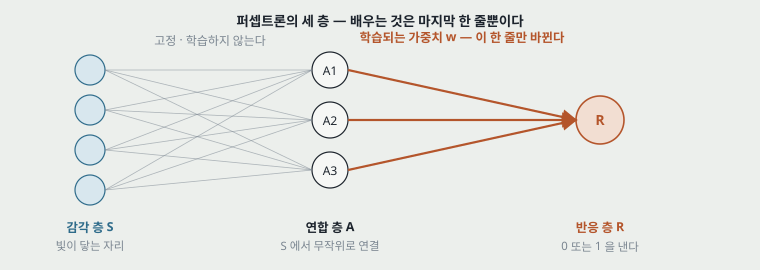
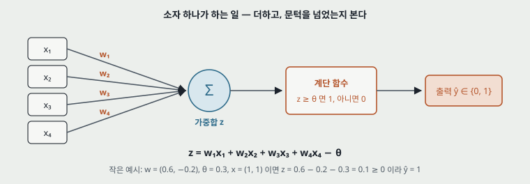
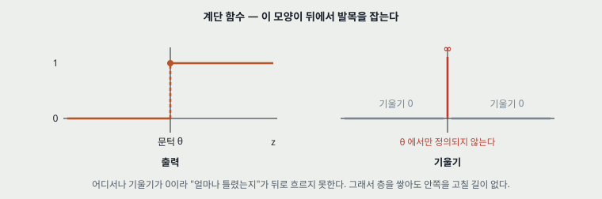
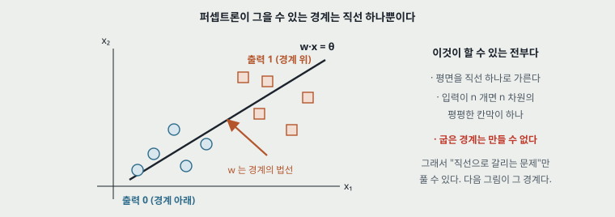
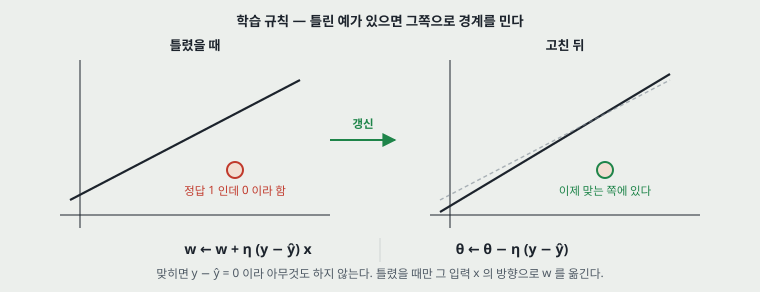
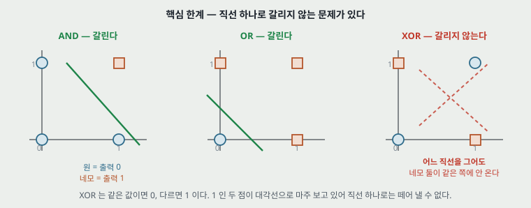
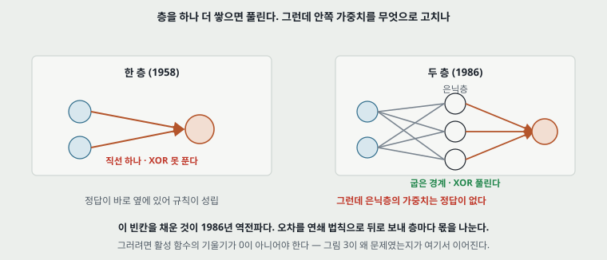

# 퍼셉트론 — The Perceptron: A Probabilistic Model for Information Storage and Organization in the Brain

지금 쓰는 모든 신경망의 첫 자리다. **가중치를 더하고 문턱을 넘으면 1을 내는 소자 하나**와, **틀렸을 때만 가중치를 옮기는 규칙 하나**로 되어 있다. 이 노트의 목적은 그 둘을 그림으로 보고, **무엇을 할 수 있고 무엇을 할 수 없는지를 또렷하게 갈라 두는 것**이다. 할 수 없는 쪽이 다음에 읽을 논문을 정한다.

## Paper Metadata

| 항목 | 값 |
|---|---|
| 제목 | The Perceptron: A Probabilistic Model for Information Storage and Organization in the Brain |
| 저자 | Frank Rosenblatt (Cornell Aeronautical Laboratory) |
| 게재 | Psychological Review 65(6), 386-408, 1958 |
| DOI | `10.1037/h0042519` |
| 서지 확인 | https://pubmed.ncbi.nlm.nih.gov/13602029/ |
| Stored PDF | **없다.** 원문을 구하지 못했다 |
| 읽은 범위 | **원문을 읽지 않았다.** 아래를 보라 |

> **이 노트가 무엇인지 먼저 밝힌다.** 원문 PDF를 구하지 못해 **이 노트는 원문을 인용하지 않는다.** 표준적으로 정리되어 전해지는 내용을 적은 것이고, 그래서 두 가지를 갈라 두었다.
>
> - **원문에서 확인해야 하는 자리**에는 "원문 확인 필요"를 붙였다. 특히 학습 규칙의 정확한 형태와 수렴 증명은 **1958년 논문이 아니라 1962년 책에 있다**고 알려져 있어, 그 경계가 이 노트에서 가장 흐린 자리다.
> - **뒤에 다른 사람이 정리한 것**(수렴 정리, XOR 한계)은 누가 언제 한 것인지 이름을 붙여 적었다.
>
> 원문을 구하면 이 노트의 "특징"과 "한계" 절을 먼저 맞춰 보고, 어긋나는 자리를 고치면 된다.

---

## 1. 용어

- **퍼셉트론 (perceptron)**: 입력마다 가중치를 곱해 더한 값이 문턱을 넘으면 1, 넘지 못하면 0을 내는 소자. 그리고 그 가중치를 오차로 고치는 절차까지를 함께 부른다.
- **가중치 (weight, w)**: 입력 하나가 판단에 얼마나 세게 들어가는지를 정하는 수. **학습이 바꾸는 것은 이것뿐이다.**
- **문턱 (threshold, θ)**: 이 값을 넘어야 1을 낸다. 지금은 부호를 뒤집어 **편향(bias)** 이라 부르고 가중치의 하나로 다룬다.
- **계단 함수 (step function)**: 문턱을 기준으로 0과 1만 내는 함수. 지금의 활성 함수 자리에 있던 것이다.
- **결정 경계 (decision boundary)**: 출력이 0인 쪽과 1인 쪽을 가르는 면. 퍼셉트론에서는 **언제나 평평한 면 하나**다.
- **선형 분리 가능 (linearly separable)**: 두 묶음을 직선(또는 평평한 면) 하나로 갈라 놓을 수 있다는 뜻. 작은 예시로, 평면 위의 점 네 개 중 한 점만 한쪽에 있으면 갈라진다.

---

## 2. 한 문단 요약

이 논문은 **뇌가 정보를 어떻게 저장하는가**를 확률 모델로 설명하려 했다. 감각 세포에서 출발해 무작위로 연결된 중간 소자를 거쳐 반응 소자에 닿는 구조를 세우고, **반응 쪽으로 들어가는 연결의 세기만 경험으로 바뀐다**고 두었다. 이 구조는 입력을 두 묶음으로 가르는 일을 배울 수 있고, **두 묶음이 직선 하나로 갈라지는 경우에는 반드시 정답에 닿는다**는 것이 뒤에 증명되었다. 그러나 **직선 하나로 갈라지지 않는 문제는 원리상 풀 수 없고**, 그 사실이 1969년에 정리되면서 연구가 한 번 얼어붙었다. 층을 하나 더 쌓으면 풀리지만 **안쪽 층의 가중치를 고칠 방법이 없었고**, 그 빈칸을 채운 것이 1986년의 역전파다.

---

## 3. 구조 — 세 층, 그중 한 줄만 배운다



**그림 1.** 감각 층 S에서 연합 층 A로 가는 연결은 **무작위로 정해 두고 바꾸지 않는다.** 배우는 것은 A에서 반응 층 R로 가는 가중치 한 줄뿐이다. 지금 말로 하면 **앞쪽은 고정된 특징 추출기이고 마지막 한 층만 학습하는 선형 분류기**다.

이 구조를 세운 이유가 있다. 망막의 세포가 어느 중간 소자에 붙을지를 사람이 정해 줄 수 없으니 무작위로 두고, **경험이 바꾸는 것은 그 뒤의 세기뿐**이라고 본 것이다. 뇌를 설명하려는 모델이었다는 것이 제목에 그대로 드러난다.

**여기서 짚을 것 하나.** 지금의 신경망은 **앞쪽 층도 함께 배운다.** 그 차이가 이 논문과 오늘 사이의 거리 전부라고 해도 된다. 앞쪽을 고정해 두면 뒤에서 아무리 잘 배워도 **앞쪽이 만든 표현의 한계를 넘을 수 없다.**

---

## 4. 소자 하나가 하는 계산



**그림 2.** 입력마다 가중치를 곱해 더하고, 그 합이 문턱을 넘었는지만 본다. 넘었으면 1, 아니면 0이다.

$$z = \sum_{i} w_i x_i - \theta, \qquad \hat{y} = \begin{cases} 1 & z \ge 0 \\ 0 & z < 0 \end{cases}$$

**작은 예시.** 가중치가 $(0.6, -0.2)$이고 문턱이 $0.3$일 때 입력 $(1, 1)$을 넣으면 $z = 0.6 - 0.2 - 0.3 = 0.1$이라 $\hat{y} = 1$이다. 입력 $(0, 1)$이면 $z = -0.2 - 0.3 = -0.5$라 $\hat{y} = 0$이다.

### 계단 함수 — 이 모양이 뒤에서 발목을 잡는다



**그림 3.** 왼쪽이 출력, 오른쪽이 그 기울기다. **문턱 앞뒤로 평평해서 기울기가 어디서나 0이고, 문턱에서는 정의되지 않는다.**

지금 당장은 문제가 되지 않는다. 층이 하나뿐이라 **정답이 바로 옆에 있어** 기울기 없이도 고칠 수 있기 때문이다. 문제는 층을 쌓았을 때 생긴다. **"얼마나 틀렸는지"가 뒤로 흐르지 못하면 안쪽 층을 고칠 수 없다.** 이 이야기는 아래 「한계」와 「다음 논문」에서 다시 나온다.

---

## 5. 결정 경계는 직선 하나



**그림 4.** $w \cdot x = \theta$를 만족하는 점들이 경계를 이룬다. 입력이 둘이면 직선, 셋이면 평면, $n$개면 $n-1$차원의 평평한 면이다. **가중치 벡터 $w$가 그 면의 법선이고, 학습은 이 면을 돌리고 옮기는 일이다.**

**그래서 이 모델이 할 수 있는 것은 "평평한 칸막이 하나로 갈라지는 문제"가 전부다.** 굽은 경계는 만들 수 없다. 이 한 문장이 아래 한계의 전부이기도 하다.

---

## 6. 학습 규칙 — 틀렸을 때만 움직인다



**그림 5.** 맞히면 아무것도 하지 않는다. 틀렸을 때만 **그 입력 $x$의 방향으로 가중치를 옮겨** 경계를 그쪽으로 민다.

$$w \leftarrow w + \eta\,(y - \hat{y})\,x, \qquad \theta \leftarrow \theta - \eta\,(y - \hat{y})$$

여기서 $y$가 정답, $\hat{y}$가 낸 답, $\eta$가 한 번에 얼마나 옮길지를 정하는 값이다. 맞히면 $y - \hat{y} = 0$이라 식이 통째로 0이 된다.

```
가중치를 0 또는 작은 값으로 둔다
반복:
  학습 예 (x, y) 를 하나 꺼낸다
  ŷ = step(w·x − θ)
  틀렸으면  w ← w + η (y − ŷ) x
            θ ← θ − η (y − ŷ)
틀린 예가 하나도 없으면 멈춘다
```

> **원문 확인 필요.** 1958년 논문은 이 형태의 식보다 **강화(reinforcement) 방식 여러 가지**를 서술한 것으로 알려져 있다. 위의 깔끔한 오차 수정 규칙은 뒤에 정리된 표준형이다. 원문을 구하면 이 자리를 가장 먼저 맞춰 보아야 한다.

### 왜 되는가 — 수렴 정리

**두 묶음이 직선 하나로 갈라지기만 하면, 이 규칙은 유한한 횟수 안에 틀린 예가 없는 상태에 닿는다.** 입력의 길이가 $R$ 이하이고 정답 경계가 양쪽에서 $\gamma$만큼 여유를 두고 갈라 놓을 수 있다면, **틀리는 횟수가 $(R/\gamma)^2$를 넘지 않는다.**

이 증명은 Novikoff(1962)와 Block(1962)의 것이고 Rosenblatt(1962)의 책에도 실려 있다. **1958년 논문의 결과가 아니다.**

**읽는 법 하나.** 이 정리가 보장하는 것은 **"갈라 놓는 어떤 선"** 이지 **"가장 좋은 선"** 이 아니다. 여유를 가장 크게 잡는 선을 찾는 것은 뒤에 서포트 벡터 머신이 다루는 문제다.

---

## 7. 특징 — 무엇이 이 모델을 이 모델이게 하는가

| 특징 | 무엇을 뜻하는가 | 왜 중요한가 |
|---|---|---|
| **오차로 가중치를 고친다** | 정답과 낸 답의 차이가 그대로 갱신량이 된다 | **지금까지 이어지는 착상.** 손실을 줄이는 방향으로 파라미터를 옮긴다는 생각의 첫 자리다 |
| **틀렸을 때만 움직인다** | 맞힌 예는 가중치를 건드리지 않는다 | 계산이 싸고 온라인 학습이 된다. 대신 **맞히기만 하면 여유가 없어도 멈춘다** |
| **학습하는 층이 하나** | 앞쪽 연결은 무작위로 고정 | 규칙이 성립하는 이유이기도 하다 — **정답이 바로 옆에 있으므로** 어느 가중치를 얼마나 고칠지가 바로 나온다 |
| **출력이 0 또는 1** | 계단 함수를 쓴다 | 판단이 또렷하다. 대신 **얼마나 확신하는지가 없고 기울기도 없다** |
| **결정 경계가 평평하다** | $w \cdot x = \theta$ | 모델이 표현할 수 있는 것의 전부를 이 한 줄이 정한다 |
| **갈라지면 반드시 닿는다** | 수렴 정리 | 선형 분리 가능이라는 조건 아래에서는 **실패하지 않는다는 보장**이 있다 |
| **하드웨어로 만들어졌다** | Mark I Perceptron | 종이 위의 모델이 아니라 실제로 도는 기계였다. 당시의 기대가 컸던 이유다 |

---

## 8. 한계 — 다음 논문을 부르는 자리

### 8.1 핵심: 직선 하나로 갈리지 않으면 못 푼다



**그림 6.** AND와 OR는 직선 하나로 갈린다. **XOR는 갈리지 않는다.** 출력이 1인 두 점이 대각선으로 마주 보고 있어, 어느 직선을 그어도 그 둘이 같은 쪽에 오지 않는다.

XOR는 **같으면 0, 다르면 1** 인 아주 단순한 규칙이다. 입력이 둘뿐이고 경우의 수가 넷뿐인데도 못 푼다. **문제가 어려워서가 아니라 모델이 그을 수 있는 경계가 직선 하나뿐이어서다.**

**이것이 이 모델의 한계 전부를 대표한다.** 나머지 한계들은 대부분 여기서 파생된다.

### 8.2 한계 목록

| 한계 | 무엇이 문제인가 | 누가 짚었나 |
|---|---|---|
| **선형 분리 가능한 문제만 푼다** | XOR처럼 경우의 수가 넷인 문제도 못 푼다 | Minsky와 Papert(1969)가 형식을 갖춰 정리했다 |
| **갈라지지 않으면 멈추지 않는다** | 수렴 정리의 조건이 깨지면 규칙이 계속 돈다. **언제 그만둘지를 모델이 알려 주지 않는다** | 수렴 정리의 조건에서 바로 따라온다 |
| **어떤 선인지는 보장하지 않는다** | 갈라 놓기만 하면 멈추므로, 경계가 데이터에 바짝 붙어 있어도 그대로 끝난다 | 뒤에 서포트 벡터 머신이 여유를 목표로 삼는다 |
| **기울기가 없다** | 계단 함수라 "얼마나 틀렸는지"가 뒤로 흐르지 못한다 | 층을 쌓으려 할 때 드러난다 |
| **층을 쌓아도 안쪽을 고칠 수 없다** | 은닉층에는 정답이 없어 $y - \hat{y}$를 쓸 수 없다 | **여기가 1986년까지 비어 있던 자리다** |
| **출력이 하나, 둘 중 하나** | 여러 부류로 나누거나 확신의 정도를 내지 못한다 | 소자를 여러 개 두어 부분적으로 우회한다 |
| **앞쪽 층이 고정이다** | 무작위 연결이 만든 표현이 나쁘면 뒤에서 되돌릴 수 없다 | 지금은 앞쪽도 함께 배운다 |

### 8.3 자주 틀리게 전해지는 것 둘

- **"Minsky와 Papert가 신경망은 안 된다고 했다"는 정확하지 않다.** 그들이 증명한 것은 **한 층짜리 퍼셉트론**의 한계다. 층을 쌓으면 그런 함수를 표현할 수 있다는 것은 알려져 있었고, **그것을 배우는 절차가 없다**는 것이 문제였다. 이 구분이 이 이야기의 핵심이다.
- **"XOR를 못 푸는 것이 퍼셉트론이 실패한 이유"도 반만 맞다.** XOR는 **가장 작은 반례**일 뿐이다. 진짜 문제는 **표현할 수 있는 함수의 계열이 평평한 경계 하나로 묶여 있다**는 것이고, XOR는 그것을 네 점으로 보인 예시다.

---

## 9. 한계를 넘은 자리 — 다음에 읽을 것



**그림 7.** 층을 하나 더 쌓으면 굽은 경계를 만들 수 있어 XOR가 풀린다. **그런데 은닉층에는 정답이 없다.** $y - \hat{y}$를 쓸 수 없으니 1958년의 규칙이 성립하지 않는다. 이 빈칸을 채운 것이 역전파이고, 그러려면 **활성 함수의 기울기가 0이 아니어야 한다** — 그림 3이 왜 문제였는지가 여기서 이어진다.

| 자리 | 논문 | 무엇을 했나 |
|---|---|---|
| **한계를 형식으로 정리** | Minsky, M., Papert, S. "Perceptrons." MIT Press, 1969 | 한 층짜리 퍼셉트론이 표현할 수 있는 함수의 계열을 정리하고, 패리티와 연결성 같은 함수가 그 밖에 있음을 보였다 |
| **같은 시기의 형제** | Widrow, B., Hoff, M. "Adaptive Switching Circuits." 1960 (ADALINE) | 출력을 계단이 아니라 **선형**으로 두고 제곱 오차를 줄인다. 기울기를 쓸 수 있게 된 첫 자리이지만 층은 여전히 하나다 |
| **한계를 넘은 편 (다음에 읽을 것)** | **Rumelhart, D., Hinton, G., Williams, R. "Learning representations by back-propagating errors." Nature 323, 533-536, 1986** | 오차를 연쇄 법칙으로 뒤로 보내 **층마다 몫을 나눈다.** 은닉층의 가중치를 고칠 수 있게 되면서 퍼셉트론의 한계가 풀린다 |

**다음 논문 링크**: https://doi.org/10.1038/323533a0 · 저자 사본 https://www.cs.toronto.edu/~hinton/absps/naturebp.pdf

**다음 노트를 쓸 때 이어 붙일 자리 셋.**

1. **그림 3의 기울기 문제가 어떻게 풀렸는가** — 계단을 매끄러운 함수로 바꾸는 자리.
2. **그림 7의 "은닉층에는 정답이 없다"가 어떻게 풀렸는가** — 오차를 뒤로 보내 몫을 나누는 자리.
3. **그림 6의 XOR가 실제로 풀리는가** — 1986년 논문이 드는 예시 중 하나가 이것이다.

---

## 10. 읽을 때 헷갈리는 지점

- **1958년 논문과 "퍼셉트론 알고리즘"은 같은 것이 아니다.** 1958년 논문은 뇌의 정보 저장에 대한 확률 모델이고, 지금 배우는 깔끔한 갱신 규칙과 수렴 증명은 1962년 책과 같은 해의 다른 사람들 증명에서 온다.
- **문턱 $\theta$와 편향 $b$는 부호만 다르다.** $w \cdot x - \theta \ge 0$과 $w \cdot x + b \ge 0$은 $b = -\theta$로 같은 식이다. 입력에 항상 1인 자리를 하나 더 두면 $\theta$도 가중치의 하나로 다룰 수 있다.
- **퍼셉트론과 로지스틱 회귀는 다르다.** 둘 다 평평한 경계를 긋지만, 퍼셉트론은 틀린 예에만 반응하고 확률을 내지 않는다. 로지스틱 회귀는 모든 예에 반응하고 확률을 낸다.
- **"다층 퍼셉트론(MLP)"의 퍼셉트론은 이 소자가 아니다.** 이름만 물려받았고 활성 함수가 계단이 아니라 매끄러운 함수다. **계단을 그대로 쌓으면 학습되지 않는다.**
- **수렴 정리는 "갈라지는 경우"에만 말한다.** 갈라지지 않는 데이터에서는 아무것도 보장하지 않는다.

---

## 11. 내가 가져갈 것

**하나.** 모델이 **표현할 수 있는 것의 모양**이 성능의 상한을 정한다. 퍼셉트론은 학습 규칙이 나빠서 XOR를 못 푼 것이 아니라 **경계가 평평해서** 못 푼 것이다. 어떤 모델을 볼 때 "무엇을 표현할 수 있는가"를 먼저 보는 습관이 여기서 나온다.

**둘.** **한계가 다음 연구를 정한다.** 이 논문의 한계 목록 일곱 줄 중 둘(기울기 없음, 은닉층에 정답 없음)이 그대로 1986년 논문의 내용이 된다. 노트를 쓸 때 한계 절을 공들여 적어 두면 다음 편이 저절로 정해진다.

**셋.** 지금 확인된 것은 여기까지다. **원문을 읽지 않았으므로 이 노트의 어떤 문장도 원문 인용이 아니다.** 원문을 구하면 6절의 학습 규칙과 3절의 구조 서술을 먼저 맞춰 보아야 한다.

---

## 12. 참고 문헌

1. Rosenblatt, F. "The Perceptron: A Probabilistic Model for Information Storage and Organization in the Brain." Psychological Review 65(6), 386-408, 1958. DOI 10.1037/h0042519
2. Rosenblatt, F. "Principles of Neurodynamics: Perceptrons and the Theory of Brain Mechanisms." Spartan Books, 1962. (학습 규칙과 수렴 증명이 정리된 자리)
3. Novikoff, A. B. J. "On Convergence Proofs for Perceptrons." Symposium on the Mathematical Theory of Automata, 1962. (수렴 정리)
4. Widrow, B., Hoff, M. E. "Adaptive Switching Circuits." IRE WESCON Convention Record, 1960. (ADALINE)
5. Minsky, M., Papert, S. "Perceptrons: An Introduction to Computational Geometry." MIT Press, 1969. (한계를 형식으로 정리)
6. Rumelhart, D. E., Hinton, G. E., Williams, R. J. "Learning representations by back-propagating errors." Nature 323, 533-536, 1986. DOI 10.1038/323533a0 (다음에 읽을 것)

---

*그림 일곱 개는 `figures/PsychRev58_Perceptron/`에 있고 `make_figures.py`를 다시 돌리면 같은 그림이 나온다. 그림 6의 세 패널은 점이 선의 어느 쪽에 오는지를 계산으로 확인한 것이고 손으로 그린 모양이 아니다.*
