# AE — Reducing the Dimensionality of Data with Neural Networks (요약)

> **한 줄.** 깊은 오토인코더는 1980년대부터 「되기만 하면 좋다」고 알려져 있었는데 **처음 가중치를 어디에 두느냐에 막혀 학습이 안 됐다.** 이 논문은 RBM 을 한 층씩 쌓아 **좋은 출발점을 먼저 찾고**, 그것을 펼쳐 역전파로 다듬는다. 새로운 것은 오토인코더가 아니라 **그 출발점을 찾는 절차**다.

---

## Paper Metadata

| Item | Content |
|---|---|
| Title | Reducing the Dimensionality of Data with Neural Networks |
| Authors | G. E. Hinton(교신), R. R. Salakhutdinov |
| 소속 | 둘 다 University of Toronto, Department of Computer Science |
| Conference / Journal | Science, 313권 5786호, 504–507쪽 (Reports) |
| Year | 2006. 접수 2006-03-20, 게재 승인 2006-06-01, 실린 호는 2006-07-28 |
| DOI | 10.1126/science.1127647 |
| 코드 | 본문이 「사전학습과 미세조정에 쓴 Matlab 코드를 보충 자료(8)에 둔다」고 적는다. 보충 자료 주소는 `www.sciencemag.org/cgi/content/full/313/5786/504/DC1` 이고 **열어 보지 않았다** |
| Stored PDF | `papers/Science06_AE_Reducing_the_Dimensionality_of_Data_with_Neural_Networks.pdf` |
| 왜 읽었는가 | 로드맵(퍼셉트론 → 역전파 → DBN → CNN → **AE** → VAE → ...)의 다음 칸이다. 같은 해 같은 저자의 DBN 논문이 **층을 쌓는 방법**을 냈고, 이 논문은 **그 쌓은 것을 무엇에 쓰는가**를 보인다 |
| 읽은 범위 | **2026-09-27 에 본문 504~507쪽을 전부 읽었다.** 곧 초록 · 본문(절 나눔이 없는 Reports 형식) · 그림 1~4 와 캡션 · 식 (1)(2) · 참고 문헌 17 건의 목록. 미독: **보충 자료(참고 문헌 8)** — 본문이 학습 설정 · 데이터 준비 · 비교 방법의 세부를 그쪽으로 넘기는데 저장한 PDF 에 들어 있지 않다. **보충 자료에만 있는 수치는 이 노트에 옮기지 않는다** |

### 저장한 파일의 상태

- **네 쪽짜리 PDF 인데 첫 쪽의 위쪽 3분의 2 는 다른 논문이다.** 같은 호 502쪽에서 시작하는 메타물질의 2차 조화파 논문의 끝부분(그림 3 · 참고 문헌 24 건)이 붙어 있고, 이 논문은 504쪽 아래에서 제목과 초록으로 시작한다. 파일의 제목 속성도 `504 504..507` 이다.
- **글자 층이 살아 있다.** 다만 따옴표와 괄호가 `B`, `[`, `E`, `^` 같은 글자로 깨져 나오고 식이 한 글자씩 흩어진다. 그래서 **식과 그림은 쪽을 그림으로 띄워 읽었다.**
- **그림 4A 의 숫자는 본문에 없다.** 이 노트가 옮긴 그 그림의 값은 **300 dpi 로 키워 눈금을 읽은 값**이고, 그렇게 적어 둔다.

---

## 1. 용어

이 노트에서 쓸 이름을 먼저 정한다. 논문의 원래 용어는 괄호로 함께 적는다.

- **차원 줄이기 (dimensionality reduction)**: 수가 많은 벡터를 수가 적은 벡터로 바꾸되 원래 것을 되살릴 수 있게 하는 것. 작은 예시로, 28 x 28 = 784 픽셀짜리 숫자 이미지를 수 30 개로 바꾼다.
- **코드 (code)**: 줄인 뒤의 짧은 벡터. 논문은 곡선 데이터에서 6 개, MNIST 에서 30 개, 문서에서 10 개를 쓴다.
- **부호기 (encoder)** / **복호기 (decoder)**: 입력을 코드로 누르는 망과 코드에서 입력을 되살리는 망. 논문 그림 1 에서 아래 절반과 위 절반이다.
- **오토인코더 (autoencoder)**: 부호기와 복호기를 이어 붙이고 **출력이 입력과 같아지도록** 함께 배우는 망. 정답이 입력 자신이라 라벨이 필요 없다.
- **재구성 (reconstruction)** / **재구성 오차**: 복호기가 되살린 것, 그리고 그것과 원래 입력의 차이. 작은 예시로, 픽셀 3 개가 (0, 1, 1) 인데 (0.1, 0.8, 1.0) 으로 되살렸으면 제곱 오차는 0.01 + 0.04 + 0 = 0.05 다.
- **주성분 분석 (principal components analysis, PCA)**: 데이터가 가장 퍼진 방향부터 차례로 직교하는 축을 잡고, 앞의 몇 축 위의 좌표만 남기는 방법. 오토인코더로 보면 **부호기와 복호기가 둘 다 행렬 곱 하나**인 경우다.
- **로지스틱 주성분 분석 (logistic PCA)**: 주성분 분석의 복원에 로지스틱 함수를 씌워 0~1 값을 다루게 한 변형. 논문은 이것을 보충 자료에서 설명한다고만 적어서 **이 노트는 비교 상대의 이름으로만 쓴다.**
- **제한 볼츠만 기계 (restricted Boltzmann machine, RBM)**: 보이는 층과 숨은 층 둘로 되어 있고 **층 사이만 잇고 층 안은 잇지 않는** 확률 망. 6절에서 풀어 적는다.
- **지어낸 것 (confabulation)**: RBM 이 데이터에서 숨은 층을 뽑고 그것으로 다시 만든 가짜 입력. 논문이 따옴표를 쳐서 쓰는 말이다.
- **사전학습 (pretraining)**: RBM 을 아래에서부터 한 층씩 배워 쌓는 단계. **라벨도 재구성 오차도 쓰지 않는다.**
- **펼치기 (unrolling, 논문은 unfolding 도 쓴다)**: 쌓은 RBM 의 가중치를 아래로는 그대로, 위로는 전치해서 붙여 오토인코더 하나를 만드는 것.
- **미세조정 (fine-tuning)**: 펼친 오토인코더 전체에 재구성 오차의 기울기를 흘려 모든 가중치를 함께 고치는 단계. 여기서는 역전파다.
- **이미지당 제곱 오차**: 논문 그림 2 캡션이 쓰는 지표. 한 이미지의 픽셀별 제곱 차이를 **모두 더한 것**을 이미지 수로 평균한다. 작은 예시로, MNIST 에서 3.00 이면 784 픽셀로 나눠 픽셀당 0.00383 이다.

---

## 2. 한 문단 요약

주성분 분석은 데이터를 직선(평면)에 떨어뜨려 줄이므로 곡면 위에 놓인 데이터를 잘 못 줄인다. 여러 층의 비선형 부호기와 복호기로 된 **깊은 오토인코더**는 곡면을 따라 줄일 수 있지만, **처음 가중치가 크면 나쁜 국소 최소에 빠지고 작으면 앞쪽 층의 기울기가 작아 학습이 안 된다.** 논문은 RBM 을 한 층씩 배워(식 1·2) 쌓은 뒤 그것을 펼쳐 오토인코더의 처음 가중치로 쓰고, 역전파로 미세조정한다(그림 1). 곡선 합성 데이터에서 6 차원 코드의 재구성 오차가 1.44 로 18 차원 주성분 분석의 5.90 보다 낮고, MNIST 30 차원에서 3.00 대 13.87, 얼굴 조각 30 차원에서 126 대 135 다(그림 2). 2 차원 코드로 그린 MNIST 가 주성분 두 개로 그린 것보다 부류별로 갈라지고(그림 3), 뉴스 기사 검색에서 10 차원 코드가 잠재 의미 분석을 이긴다(그림 4). 같은 사전학습을 분류에 쓰면 MNIST 오차 1.2% 로, 논문이 인용한 무작위 초기화 역전파 1.6% 와 서포트 벡터 머신 1.4% 보다 낮다.

---

## 3. 문제 — 주성분 분석은 직선에 떨어뜨린다

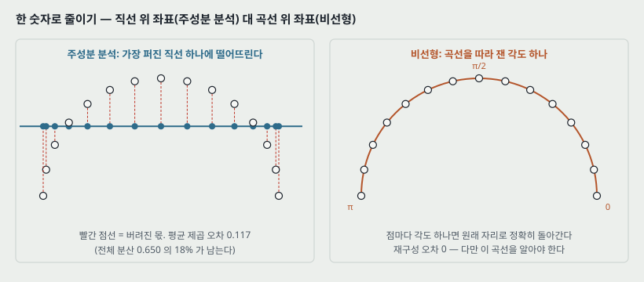

논문 첫 문단의 문제는 한 줄이다. **주성분 분석은 가장 퍼진 방향들을 찾아 그 좌표로 데이터를 적는다.** 방향이 직선이므로, 데이터가 곡선이나 곡면 위에 놓여 있으면 그 곡률만큼이 버려진다.

그림은 이 파일의 그림 코드가 직접 계산한 작은 예다. 반원 위에 15 점을 고르게 놓고 한 숫자로 줄인다.

| 한 숫자로 줄이는 방법 | 점 하나를 되살렸을 때의 평균 제곱 오차 |
|---|---:|
| 주성분 하나(가장 퍼진 직선 위 좌표) | 0.117 (전체 분산 0.650 의 18%) |
| 반원을 따라 잰 각도 | 0 |

**각도 쪽이 이기는 것은 반원이라는 곡선을 알고 있어서다.** 실제 데이터에서는 그 곡선을 모른다. 그래서 곡선을 데이터에서 **배워야** 하고, 그것을 여러 층의 비선형 함수로 배우자는 것이 오토인코더다. 논문의 말로는 「주성분 분석의 비선형 일반화」다.

> **주의.** 반원 예시는 내가 붙인 것이다. 논문 본문에는 이 그림이 없고, 대신 곡선 데이터(11절)가 같은 역할을 한다 — 세 점으로 정해지는 곡선 이미지라 **참 차원이 6 이라는 것을 안다.**

---

## 4. 오토인코더 — 입력을 좁은 코드로 누르고 다시 편다

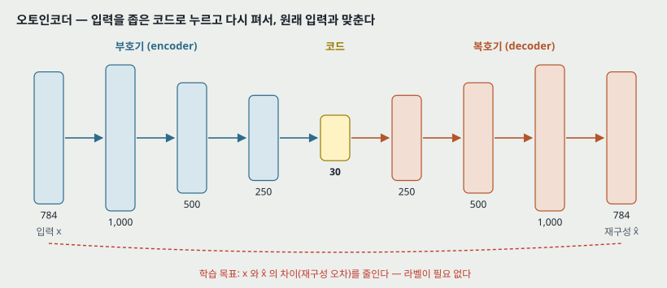

부호기가 고차원 입력 $x$ 를 저차원 코드 $z$ 로 바꾸고, 복호기가 $z$ 에서 $\hat{x}$ 를 되살린다. 두 망을 무작위 가중치에서 시작해 **$x$ 와 $\hat{x}$ 의 차이를 줄이도록** 함께 배운다. 기울기는 연쇄 법칙으로 복호기를 먼저, 부호기를 나중에 거슬러 내려가며 얻는다.

$$z = f_\text{enc}(x), \qquad \hat{x} = f_\text{dec}(z) \qquad (\text{a})$$

**가운데가 좁은 것이 핵심이다.** 코드가 입력만큼 넓으면 항등 함수를 배워 버린다. 작은 예시로, MNIST 망 784-1000-500-250-30 에서 30 개짜리 코드층이 784 픽셀의 정보를 전부 지나가게 할 수는 없으므로, 망은 **자주 함께 나타나는 픽셀 패턴**을 코드에 적는 쪽으로 배운다.

**미세조정의 손실은 데이터에 맞춰 고른다.** 곡선과 MNIST 는 픽셀이 0~1 사이이고 가우스 분포와 멀어서 출력을 로지스틱으로 두고 교차 엔트로피를 줄인다.

$$-\sum_i p_i \log \hat{p}_i - \sum_i (1 - p_i) \log (1 - \hat{p}_i) \qquad (\text{b})$$

$p_i$ 는 픽셀 $i$ 의 밝기, $\hat{p}_i$ 는 그 재구성이다. 문서는 단어 확률 벡터라 여러 부류 교차 엔트로피 $-\sum_i p_i \log \hat{p}_i$ 를 쓴다.

> 식 (a)(b) 의 번호는 이 노트가 붙인 것이다. 논문이 번호를 붙인 식은 6절의 (1) 과 7절의 (2) 둘뿐이다.

**오토인코더를 이 논문이 처음 낸 것이 아니다.** 논문이 스스로 참고 문헌 1~4(1987~1997)를 달고 「1980년대부터 분명했다」고 적는다. 이 논문의 몫은 다음 절의 문제를 푼 것이다.

---

## 5. 왜 깊은 오토인코더가 안 배워지는가

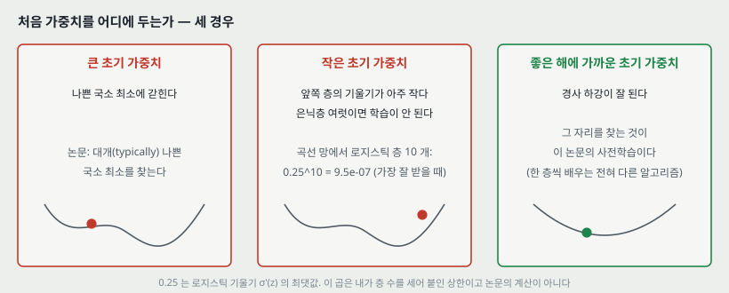

논문이 적은 문장을 그대로 셋으로 나누면 이렇다.

| 처음 가중치 | 논문이 적은 결과 |
|---|---|
| 크다 | 대개(typically) **나쁜 국소 최소**를 찾는다 |
| 작다 | 앞쪽 층의 기울기가 아주 작아 **은닉층이 여럿이면 학습할 수 없다**(infeasible) |
| 좋은 해에 가깝다 | 경사 하강이 잘 된다. **다만 그런 가중치를 찾으려면 한 층씩 특징을 배우는, 전혀 다른 종류의 알고리즘이 필요하다** |

**「작다」 칸을 숫자로 옮겨 본다.** 곡선 오토인코더(784-400-200-100-50-25-6 과 거울상 복호기)에서 맨 아래 가중치 $W_1$ 까지 기울기가 거쳐 내려오는 로지스틱 층을 센다.

- 출력층은 로지스틱에 교차 엔트로피를 붙였으므로 $\partial L / \partial(\text{출력의 입력 합}) = \hat{p} - p$ 가 되어 로지스틱의 기울기가 약분된다.
- 코드층 6 개는 선형이라 곱해지는 기울기가 1 이다.
- 남는 것은 은닉 로지스틱 층 **열 개**(부호기 400·200·100·50·25, 복호기 25·50·100·200·400)다.

로지스틱의 기울기 $\sigma'(z) = \sigma(z)(1-\sigma(z))$ 의 최댓값이 0.25 이므로, 가중치의 크기를 빼고 보면 곱해지는 몫의 상한이 $0.25^{10} = 9.5 \times 10^{-7}$ 이다. **이것은 가장 잘 받았을 때의 값이고 실제는 더 작다.** 가중치를 키워 이 곱을 메우려 하면 윗줄의 「크다」 칸으로 간다.

> **주의.** 이 계산은 내가 층 수를 세어 붙인 상한이다. 논문은 기울기가 「아주 작다(tiny)」고만 적고 숫자를 내지 않는다.

**논문이 한 가지 더 적는다.** 사전학습 없이 이 깊은 곡선 오토인코더를 배우면 **오래 미세조정해도 늘 학습 데이터의 평균을 재구성한다.** 다만 이 관찰의 근거는 보충 자료(8)에 있어 **본문에는 곡선도 숫자도 없다.** 층 하나짜리 얕은 오토인코더는 사전학습 없이도 배워지지만 사전학습이 전체 학습 시간을 크게 줄인다고 적는데, 이것도 보충 자료 인용이다.

---

## 6. RBM — 한 층의 특징을 배우는 장치

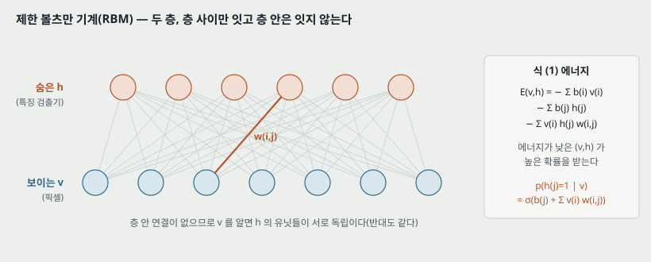

이진 벡터(예: 흑백 이미지)의 모음은 RBM 으로 모형화할 수 있다. 확률적 이진 픽셀(보이는 유닛)이 확률적 이진 특징 검출기(숨은 유닛)와 **대칭 가중치**로 이어진다. 보이는 유닛 $v$ 와 숨은 유닛 $h$ 의 한 배치 $(v, h)$ 에 에너지를 매긴다.

$$E(v, h) = -\sum_{i \in \text{pixels}} b_i v_i - \sum_{j \in \text{features}} b_j h_j - \sum_{i,j} v_i h_j w_{ij} \qquad (1)$$

$v_i$, $h_j$ 는 픽셀 $i$ 와 특징 $j$ 의 이진 상태, $b_i$, $b_j$ 는 치우침(bias), $w_{ij}$ 는 둘 사이의 가중치다. 망은 이 에너지로 모든 가능한 이미지에 확률을 매긴다 — **에너지가 낮을수록 확률이 높다.** 학습 이미지의 확률을 올리려면 그 이미지의 에너지를 낮추고, 망이 실제 데이터보다 더 좋아하는 비슷한 「지어낸」 이미지의 에너지를 올린다.

**층 안이 이어져 있지 않아서** 한 층을 알면 다른 층의 유닛들이 서로 독립이다. 그래서 숨은 유닛 하나가 켜질 확률이 닫힌 꼴로 적힌다.

$$p(h_j = 1 \mid v) = \sigma\left(b_j + \sum_i v_i w_{ij}\right), \qquad \sigma(x) = \frac{1}{1 + e^{-x}}$$

작은 예시로, $b_j = -1$ 이고 켜진 픽셀 둘이 각각 가중치 $1.5$ 로 이어져 있으면 입력 합이 $-1 + 3 = 2$ 라 켜질 확률이 $\sigma(2) = 0.88$ 이다.

---

## 7. 한 번의 갱신 — 데이터에서 한 번, 지어낸 것에서 한 번

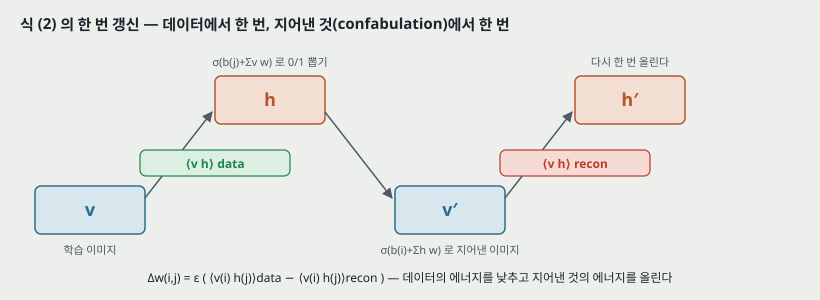

학습 이미지 하나가 주어지면 네 걸음을 간다.

1. 숨은 유닛 $h_j$ 를 확률 $\sigma(b_j + \sum_i v_i w_{ij})$ 로 1 로 뽑는다.
2. 뽑힌 $h$ 로 보이는 유닛 $v_i$ 를 확률 $\sigma(b_i + \sum_j h_j w_{ij})$ 로 1 로 두어 **지어낸 것** $v'$ 을 만든다.
3. $v'$ 을 넣어 숨은 유닛을 한 번 더 갱신해 $h'$ 을 얻는다.
4. 가중치를 이렇게 바꾼다.

$$\Delta w_{ij} = \varepsilon \left( \langle v_i h_j \rangle_\text{data} - \langle v_i h_j \rangle_\text{recon} \right) \qquad (2)$$

$\varepsilon$ 은 학습률, $\langle v_i h_j \rangle_\text{data}$ 는 **특징 검출기가 데이터로 구동될 때** 픽셀 $i$ 와 특징 $j$ 가 함께 켜지는 비율, $\langle v_i h_j \rangle_\text{recon}$ 은 지어낸 것으로 구동될 때의 같은 비율이다. 치우침에는 같은 규칙의 단순화한 꼴을 쓴다.

작은 예시로, 한 묶음 100 장에서 픽셀 $i$ 와 특징 $j$ 가 데이터 쪽에서 30 번, 지어낸 쪽에서 18 번 함께 켜졌고 $\varepsilon = 0.1$ 이면 $\Delta w_{ij} = 0.1 \times (0.30 - 0.18) = 0.012$ 다.

**이 규칙은 학습 데이터 로그 확률의 기울기를 정확히 따르지 않는다.** 논문이 스스로 그렇게 적고, 그래도 잘 된다고 참고 문헌 6(대조 발산을 낸 Hinton 2002)을 단다.

---

## 8. 층을 쌓는다 — 사전학습

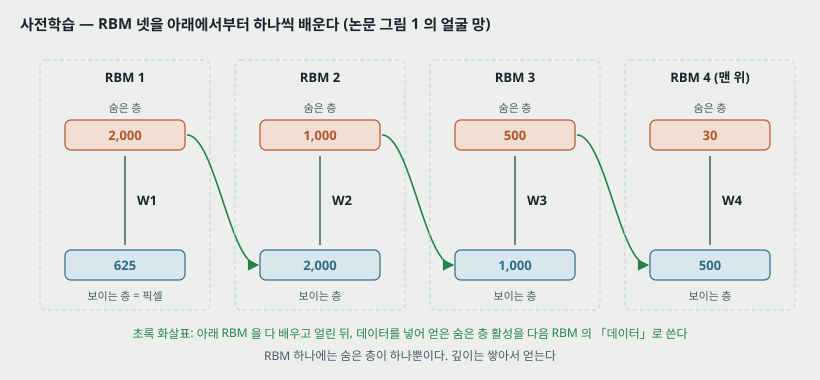

이진 특징 한 층은 이미지 모음의 구조를 적기에 최선이 아니다. 그래서 한 층을 배운 뒤 **데이터로 구동했을 때의 특징 활성**을 다음 층을 배울 「데이터」로 쓴다. 첫 층의 특징 검출기가 다음 RBM 의 보이는 유닛이 된다. 이것을 원하는 만큼 되풀이한다.

그림은 논문 그림 1 의 얼굴 망이다. RBM 넷을 아래부터 차례로 배운다.

| 순서 | 보이는 층 | 숨은 층 | 가중치 |
|---:|---:|---:|---|
| 1 | 625 (25 x 25 픽셀) | 2000 | $W_1$ |
| 2 | 2000 | 1000 | $W_2$ |
| 3 | 1000 | 500 | $W_3$ |
| 4 | 500 | 30 | $W_4$ |

논문은 각 층이 **아래층 유닛 활성 사이의 강한 고차 상관**을 잡는다고 적고, 여러 데이터에서 이것이 저차원 비선형 구조를 차례로 드러내는 효율적인 방법이라고 적는다.

### 8.1 「층을 더하면 좋아진다」가 닿는 자리

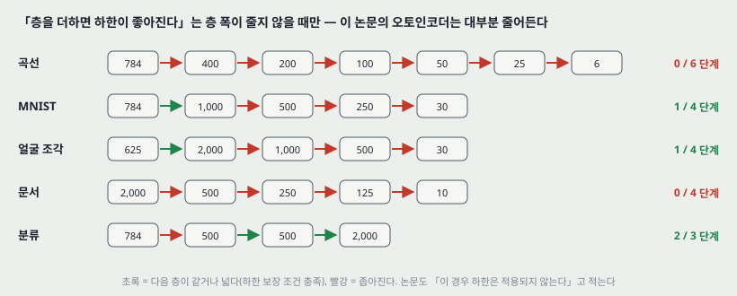

논문은 층을 하나 더할 때마다 **모델이 학습 데이터에 매기는 로그 확률의 하한이 늘 좋아진다**는 것을 보일 수 있다고 적는다(참고 문헌 9, 같은 해의 DBN 논문). **조건이 둘 붙는다** — 층마다 특징 검출기 수가 **줄지 않아야** 하고, 가중치를 올바르게 초기화해야 한다.

그런데 오토인코더는 가운데로 갈수록 좁아진다. 그림 13 은 논문의 망 다섯에서 RBM 한 단계씩 폭이 줄지 않는지를 이 노트의 그림 코드가 판정한 것이다.

| 망 | 폭이 줄지 않는 단계 / 전체 단계 |
|---|---:|
| 곡선 784-400-200-100-50-25-6 | 0 / 6 |
| MNIST 784-1000-500-250-30 | 1 / 4 |
| 얼굴 625-2000-1000-500-30 | 1 / 4 |
| 문서 2000-500-250-125-10 | 0 / 4 |
| 분류 784-500-500-2000 | 2 / 3 |

**논문도 이것을 알고 적는다** — 윗층이 더 좁으면 이 하한은 적용되지 않지만, 그래도 층별 학습이 깊은 오토인코더의 가중치를 사전학습하는 데 매우 효과적인 방법이라고. 곧 **이 논문의 오토인코더에서 사전학습이 돕는다는 근거는 하한이 아니라 실험 결과뿐이다.**

---

## 9. 펼치기와 미세조정

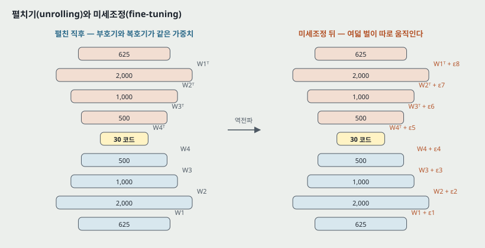

사전학습이 끝나면 모델을 펼쳐 **처음에는 같은 가중치를 쓰는** 부호기와 복호기를 만든다. 부호기는 $W_1, W_2, W_3, W_4$ 를 그대로, 복호기는 $W_4^\mathsf{T}, W_3^\mathsf{T}, W_2^\mathsf{T}, W_1^\mathsf{T}$ 를 쓴다.

미세조정은 두 가지를 바꾼다.

1. **확률적 활성을 결정적 실수 확률로 바꾼다.** 사전학습에서는 숨은 유닛이 0/1 로 뽑혔지만, 펼친 망에서는 $\sigma(\cdot)$ 값을 그대로 다음 층에 넘긴다.
2. **오토인코더 전체에 역전파**를 해서 최적 재구성을 향해 가중치를 고친다. 논문 그림 1 의 오른쪽 판에서 여덟 벌의 가중치가 $W_1 + \varepsilon_1$ 부터 $W_1^\mathsf{T} + \varepsilon_8$ 까지 **각자의 몫 $\varepsilon_k$** 만큼 바뀐다 — 곧 미세조정에서는 부호기와 복호기의 가중치가 **더 이상 묶여 있지 않다.**

작은 예시로, 얼굴 망에서 $W_1$ 은 625 x 2000 = 1,250,000 개다. 펼친 직후 부호기의 $W_1$ 과 복호기의 $W_1^\mathsf{T}$ 는 같은 수 1,250,000 개를 공유하지만, 미세조정 뒤에는 서로 다른 1,250,000 개씩 두 벌이 된다.

---

## 10. 실수값 데이터와 유닛의 종류

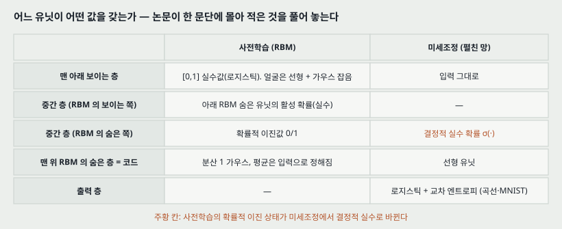

**RBM 은 이진 데이터에서 출발했는데 논문의 실험 데이터는 전부 실수값이다.** 논문은 이 자리를 한 문단에 몰아 적는다. 풀어 놓으면 이렇다.

- **연속 데이터**(얼굴 조각)는 첫 RBM 의 보이는 유닛을 **분산 1 가우스 잡음을 낀 선형 유닛**으로 바꾼다(참고 문헌 10). 숨은 유닛은 이진 그대로이고 갱신 규칙도 같다. 보이는 유닛 $i$ 는 평균 $b_i + \sum_j h_j w_{ij}$, 분산 1 인 가우스에서 뽑는다.
- **모든 실험에서** 모든 RBM 의 보이는 유닛은 실수값이고, 로지스틱 유닛이면 $[0, 1]$ 범위다.
- **윗층 RBM 을 배울 때** 보이는 유닛은 아래 RBM 숨은 유닛의 **활성 확률**(실수)로 둔다. 숨은 유닛은 **맨 위 RBM 만 빼고** 확률적 이진값이다.
- **맨 위 RBM 의 숨은 유닛**(= 코드)은 분산 1 가우스에서 뽑는 확률적 실수값이고, 평균은 그 RBM 의 로지스틱 보이는 유닛에서 오는 입력으로 정해진다. 논문은 이 덕에 **저차원 코드가 연속 변수를 잘 쓰고 주성분 분석과 견주기 쉬워진다**고 적는다.
- **펼친 오토인코더에서** 코드층은 선형이고 나머지는 로지스틱이다(곡선 · MNIST · 문서에서 본문이 이렇게 적는다).

> **내가 짚는 자리.** 분산을 1 로 못 박은 가우스 유닛은 입력의 크기에 매이므로, 얼굴 조각을 어떻게 표준화했는지가 결과에 닿는다. 본문은 그 전처리를 적지 않고 보충 자료로 넘긴다.

---

## 11. 실험 설정 — 망 여섯

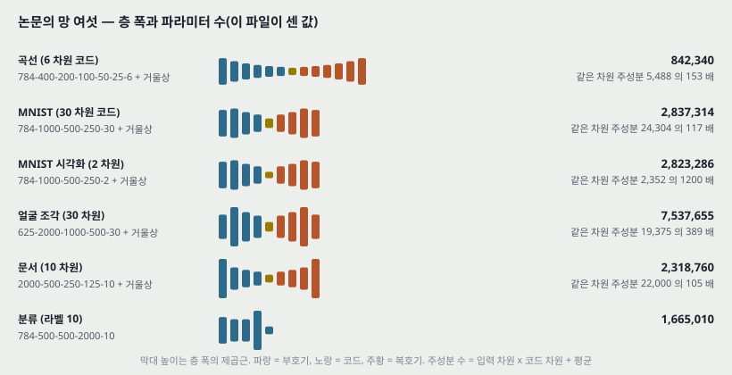

| 데이터 | 망 (부호기, 복호기는 거울상) | 코드 | 학습 / 시험 | 출력과 손실 |
|---|---|---|---|---|
| 곡선 (합성) | 784-400-200-100-50-25-6 | 선형 6 | 20,000 / 10,000 | 로지스틱, 교차 엔트로피 |
| MNIST | 784-1000-500-250-30 | 선형 30 | 60,000 / 10,000 | 로지스틱 |
| MNIST 시각화 | 784-1000-500-250-2 | 2 | 본문에 따로 적지 않았다 | — |
| 얼굴 조각 (Olivetti) | 625-2000-1000-500-30, **입력이 선형 유닛** | 30 | 본문에 적지 않았다 | 본문에 적지 않았다 |
| 뉴스 기사 (로이터 RCV2) | 2000-500-250-125-10 | 선형 10 | 804,414 편의 절반 | 여러 부류 교차 엔트로피 |
| 분류 (MNIST) | 784-500-500-2000-10 | 라벨 10 | 본문에 적지 않았다 | 역전파, 가장 가파른 하강, 작은 학습률 |

**곡선 데이터**는 2 차원 평면의 무작위 세 점으로 만든 곡선 이미지다. 세 점의 좌표 6 개로 이미지가 정해지므로 **참 차원이 6 이라는 것을 알고**, 픽셀 밝기와 그 6 개의 관계가 매우 비선형이다. 그래서 코드를 6 개로 둔 것이다.

**파라미터 수를 세면 이렇다**(가중치 + 치우침, 미세조정 뒤처럼 부호기와 복호기를 따로 센다. 그림 코드가 센 값).

| 망 | 오토인코더 | 같은 코드 차원의 주성분 분석 | 배수 |
|---|---:|---:|---:|
| 곡선 6 | 842,340 | 5,488 | 153 |
| MNIST 30 | 2,837,314 | 24,304 | 117 |
| 얼굴 30 | 7,537,655 | 19,375 | 389 |
| 문서 10 | 2,318,760 | 22,000 | 105 |

주성분 분석의 수는 「입력 차원 x 코드 차원 + 평균 벡터」로 셌다. 작은 예시로 MNIST 30 차원이면 784 x 30 + 784 = 24,304 다. **이 표는 17절에서 다시 쓴다.**

---

## 12. 결과 1 — 재구성 오차

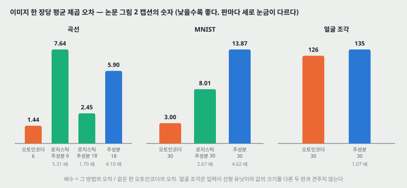

논문 그림 2 는 시험 이미지를 몇 장씩 보이고 캡션에 이미지당 평균 제곱 오차를 적는다. 캡션의 숫자를 모두 옮기고, 배수(= 그 방법의 오차 / 같은 판 오토인코더의 오차)와 픽셀당 값을 그림 코드로 계산했다.

| 데이터 | 방법 · 코드 차원 | 이미지당 제곱 오차 | 오토인코더 대비 | 픽셀당 |
|---|---|---:|---:|---:|
| 곡선 | **오토인코더 6** | **1.44** | 1.00 | 0.00184 |
| 곡선 | 로지스틱 주성분 6 | 7.64 | 5.31 | 0.00974 |
| 곡선 | 로지스틱 주성분 18 | 2.45 | 1.70 | 0.00313 |
| 곡선 | 주성분 18 | 5.90 | 4.10 | 0.00753 |
| MNIST | **오토인코더 30** | **3.00** | 1.00 | 0.00383 |
| MNIST | 로지스틱 주성분 30 | 8.01 | 2.67 | 0.01022 |
| MNIST | 주성분 30 | 13.87 | 4.62 | 0.01769 |
| 얼굴 조각 | **오토인코더 30** | **126** | 1.00 | 0.2016 |
| 얼굴 조각 | 주성분 30 | 135 | 1.07 | 0.2160 |

**읽는 법 셋.**

1. **곡선에서는 코드가 세 배 넓은 주성분 분석도 진다.** 오토인코더 6 차원(1.44)이 로지스틱 주성분 18 차원(2.45)보다 낮다. 논문은 이 재구성을 「거의 완벽(almost perfect)」이라고 부른다 — 이것은 논문의 말이고, 이미지 그림으로 보인 것 말고 기준 수치는 없다.
2. **MNIST 에서는 로지스틱 주성분 분석이 보통 주성분 분석의 절반 아래**(8.01 대 13.87)다. 곧 오토인코더 이득 4.62 배 가운데 **2.67 배는 로지스틱 주성분이 이미 따라잡지 못한 몫**이고, 출력에 로지스틱을 씌우는 것만으로 1.73 배(13.87 / 8.01)가 줄어든다.
3. **얼굴 조각에서는 차이가 7% 다**(126 대 135). 논문은 「분명히 이겼다(clearly outperformed)」고 적지만, 수치 차이는 세 데이터 중 가장 작다. 그림 2C 에서는 오토인코더 쪽 재구성이 더 또렷해 보이는데, 이것은 내 눈의 인상이고 논문이 잰 것이 아니다. **입력이 선형 유닛이라 값의 크기를 다른 두 판과 견주지는 않는다.**

> **주의.** 캡션은 「마지막 네 줄의 이미지당 평균 제곱 오차」라고 적는다. 이것이 **그림에 보인 몇 장의 평균인지, 시험 집합 전체의 평균인지** 본문에 적혀 있지 않다. 이 노트는 어느 쪽으로도 단정하지 않는다.

---

## 13. 결과 2 — 2 차원으로 그리기

논문 그림 3 은 MNIST 학습 이미지를 2 차원으로 줄여 부류별 500 장씩 찍은 것이다.

| | 방법 | 논문이 보인 것 |
|---|---|---|
| 3A | 학습 이미지 60,000 장 전체로 구한 주성분 앞의 둘 | 부류들이 한 덩어리로 겹치고, 한두 부류만 가장자리에 따로 모인다 |
| 3B | 784-1000-500-250-2 오토인코더 | 부류들이 가운데에서 바깥으로 뻗는 **팔** 모양으로 갈린다 |

**논문은 이 그림에 숫자를 붙이지 않는다** — 「더 나은 시각화」라고만 적는다. 부류가 얼마나 갈리는지를 잰 값(이웃 부류 일치율 같은 것)이 본문에 없다.

---

## 14. 결과 3 — 문서 검색

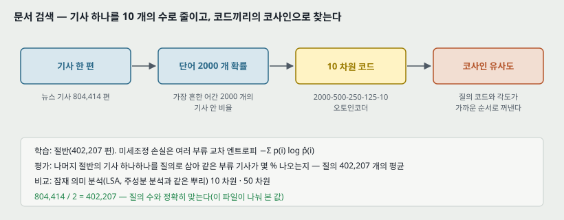

뉴스 기사 804,414 편을 **가장 흔한 어간 2000 개의 기사 안 확률** 벡터로 적고, 절반으로 2000-500-250-125-10 오토인코더를 배웠다. 두 코드의 유사도는 **각의 코사인**으로 쟀다. 평가는 나머지 절반의 기사 하나하나를 질의로 삼아 같은 부류 기사가 몇 % 돌아오는지를 402,207 개 질의 전체로 평균한 것이다. 804,414 / 2 = 402,207 이라 질의 수가 시험 절반과 정확히 맞는다(그림 코드가 나눠 확인했다).

논문 그림 4A 의 값은 본문에 없어서 **300 dpi 로 키워 눈금을 읽었다.** 눈금 간격이 0.05 라 둘째 자리는 ±0.01 로 읽는다.

| 꺼낸 문서 수 | 오토인코더 10 차원 | 잠재 의미 분석 50 차원 | 잠재 의미 분석 10 차원 |
|---:|---:|---:|---:|
| 1 | 0.43 | 0.43 | 0.31 |
| 1023 | 0.25 | 0.23 | 0.18 |

**같은 10 차원끼리는 차이가 크고, 코드가 다섯 배인 50 차원과는 작다.** 꺼낸 문서가 1 편일 때 오토인코더와 50 차원 잠재 의미 분석의 두 점은 눈금으로 가를 수 없고, 1023 편에서 0.02 차이다. 논문의 「분명히 이겼다」는 문장은 10 차원 쪽 비교에서 선다. 50 차원과의 차이는 **변동 폭이 없어** 이 노트는 순서를 매기지 않는다.

그림 4B·4C 는 2 차원 코드를 찍은 것이다. 잠재 의미 분석 2 차원은 부류가 한 덩어리로 겹치고, 2000-500-250-125-2 오토인코더는 「에너지 시장」 · 「법률/사법」 · 「정부 차입」 같은 부류가 서로 다른 방향의 팔로 갈린다.

논문은 오토인코더가 **국소 선형 임베딩(LLE)도 이긴다**고 한 줄 적는데, 근거를 보충 자료에 둔다. 본문에 수치가 없다.

---

## 15. 결과 4 — 분류

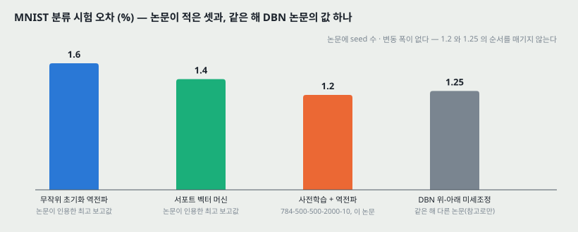

층별 사전학습은 분류와 회귀에도 쓸 수 있다. 널리 쓰는 판의 MNIST(논문은 판을 이름 짓지 않는다)에서 논문이 인용한 최고 보고값과 이 논문의 값은 이렇다.

| 방법 | 시험 오차 |
|---|---:|
| 무작위 초기화 역전파 | 1.6% |
| 서포트 벡터 머신 | 1.4% |
| **784-500-500-2000-10 사전학습 + 역전파**(가장 가파른 하강, 작은 학습률) | **1.2%** |

논문은 이유를 이렇게 적는다. **사전학습은 가중치에 든 정보의 대부분이 이미지를 모형화하는 데서 오게 만든다. 라벨에 든 매우 적은 정보는 사전학습이 찾은 가중치를 조금 고치는 데만 쓰인다.**

> 그림 12 의 넷째 막대(1.25%)는 **같은 해 DBN 논문의 값**으로, 이 논문에 없다. 층 폭 500-500-2000 은 같지만 라벨 10 개를 붙이는 자리(DBN 은 맨 위 2000 층과 함께 연상 기억에 넣는다)와 미세조정 방법(위-아래 알고리즘 대 역전파)이 다르다. 두 논문 모두 seed 수와 변동 폭을 적지 않아 **1.2 와 1.25 의 순서는 매기지 않는다.**

---

## 16. 이 논문이 스스로 적은 한계와 조건

1. **대조 발산은 로그 확률의 기울기를 정확히 따르지 않는다**(7절). 잘 된다는 것은 경험적 주장이다.
2. **층을 더하면 하한이 좋아진다는 보장은 층이 좁아지면 적용되지 않는다**(8.1절). 오토인코더는 좁아진다.
3. **얕은 오토인코더는 사전학습 없이도 배워진다.** 사전학습의 몫은 그 경우 학습 시간이다.
4. **파라미터 수가 같을 때만** 깊은 오토인코더가 얕은 것보다 시험 재구성 오차가 낮고, **파라미터가 늘면 그 이점이 사라진다**(보충 자료 인용).
5. 결론이 세 조건을 단다 — **컴퓨터가 충분히 빠르고, 데이터가 충분히 크고, 처음 가중치가 좋은 해에 충분히 가까우면**(원문의 enough 셋을 옮긴 것이다) 깊은 오토인코더의 역전파가 매우 효과적이라는 것은 1980년대부터 분명했고, **세 조건이 이제 갖춰졌다.** 곧 논문은 자기 기여를 셋째 조건 하나로 좁혀 적는다.

**논문이 내세우는 장점 둘도 함께 적어 둔다.** 비모수 방법(LLE, Isomap)과 달리 오토인코더는 **데이터 → 코드, 코드 → 데이터 두 방향의 사상을 모두 준다.** 그리고 사전학습과 미세조정 둘 다 **학습 사례 수에 대해 시간과 공간이 선형**이라 매우 큰 데이터에 쓸 수 있다.

---

## 17. 논문이 적지 않은 것 — 내가 읽으며 짚은 자리

**하나. 주성분 분석과의 비교는 파라미터 수가 맞지 않는다.** 11절 표대로 오토인코더가 같은 코드 차원 주성분 분석보다 105~389 배 많은 수를 가진다. 코드 차원을 맞추는 것은 「코드를 얼마나 짧게 적는가」의 비교로는 공정하지만, **「같은 크기의 모델로 누가 더 잘 되살리는가」의 비교는 아니다.** 논문이 보충 자료에서 깊은 것과 얕은 것은 파라미터를 맞춰 비교했다고 적는 것과 대조된다.

**둘. 사전학습의 몫을 오토인코더 결과 안에서 가르지 않는다.** 그림 2 의 비교 상대는 전부 주성분 계열이다. **같은 망을 무작위 초기화로 배운 행**이 본문 표에 없고, 「늘 평균을 재구성한다」는 관찰만 보충 자료로 넘긴다. 곧 본문만으로는 1.44 · 3.00 · 126 가운데 사전학습이 낸 몫과 깊은 비선형 망이 낸 몫이 갈리지 않는다.

**셋. 변동 폭이 한 곳도 없다.** 재구성 오차 · 검색 곡선 · 분류 오차 모두 한 번의 값이다. 얼굴 조각의 7% 차이와 검색의 50 차원 비교처럼 차이가 작은 자리는 순서를 매길 근거가 본문 안에 없다.

**넷. 학습은 교차 엔트로피로 하고 보고는 제곱 오차로 한다.** 곡선과 MNIST 의 미세조정은 식 (b) 를 줄였는데 그림 2 는 제곱 오차를 적는다. 주성분 분석은 제곱 오차를 직접 줄이는 방법이므로, **상대가 최적화한 지표로 보고한 셈**이라 이 선택은 오토인코더에 불리한 쪽이다. 그래서 이 자리는 비교를 약하게 만들지 않는다 — 그래도 두 지표가 다르다는 것은 적어 둔다.

**다섯. 학습 설정의 숫자가 본문에 없다.** 학습률, 에폭 수, 미니배치 크기, 학습 시간이 전부 보충 자료에 있다. 분류 실험은 「가장 가파른 하강, 작은 학습률」이라는 말만 있다.

---

## 18. 읽을 때 헷갈리는 지점

**「오토인코더를 제안한 논문」이 아니다.** 오토인코더는 참고 문헌 1~4 가 이미 있다. 이 논문이 낸 것은 **깊은 오토인코더가 학습되게 하는 초기화**다. 제목도 「오토인코더」가 아니라 「신경망으로 데이터의 차원을 줄이기」다.

**사전학습 단계에는 재구성 오차가 들어가지 않는다.** RBM 은 식 (2) 로 배우고, 이것은 생성 모델의 학습 규칙이다. 재구성 오차를 줄이는 것은 미세조정 단계뿐이다. 「층마다 작은 오토인코더를 배워 쌓는다」로 기억하면 틀린다 — 그것은 뒤에 나온 다른 방법이다.

**펼친 직후와 미세조정 뒤의 가중치 수가 다르다.** 펼친 직후에는 부호기와 복호기가 같은 수를 쓰지만(전치 관계), 미세조정은 여덟 벌을 따로 움직인다(그림 1 의 $\varepsilon_1 \ldots \varepsilon_8$).

**코드층은 두 단계에서 성질이 다르다.** 사전학습의 맨 위 RBM 에서는 가우스에서 뽑는 확률적 실수이고, 펼친 망에서는 결정적 선형 유닛이다.

**그림 1 은 얼굴 망이다.** 맨 아래 이미지가 얼굴 조각이고 층이 2000-1000-500-30 이다. MNIST 망(1000-500-250-30)과 층 폭이 다르므로 그림 1 의 숫자를 MNIST 에 옮기지 않는다.

---

## 19. DBN(같은 해, 같은 첫 저자)과 맞춰 보기

같은 해 Neural Computation 의 DBN 논문은 RBM 을 쌓는 방법과 그것이 왜 되는지(상보 사전분포, 변분 하한)를 적는다. 이 논문은 그 쌓기를 **차원 줄이기에 쓴다.**

| | DBN (Neural Computation 2006) | 이 논문 (Science 2006) |
|---|---|---|
| 쌓는 방법 | RBM 을 대조 발산으로 한 층씩 | 같다 |
| 쌓은 뒤 | 맨 위 두 층을 방향 없는 연상 기억으로 두고 **위-아래 알고리즘**으로 생성 모델을 다듬는다 | **펼쳐서 오토인코더**를 만들고 **역전파**로 재구성 오차를 줄인다 |
| 목적 | 이미지와 라벨의 결합 생성 모델 | 두 방향 사상이 있는 짧은 코드 |
| 입력 | 이진 픽셀 | 실수값까지 넓힌다(선형 가우스 유닛) |
| 층 폭 | 500-500-2000 (늘어난다) | 가운데로 좁아진다 → 하한 보장 밖 |
| MNIST 분류 | 1.25% | 1.2% (층 폭이 같고 라벨을 붙이는 자리와 미세조정이 다르다) |

**한 줄로 적으면**, DBN 은 「쌓으면 된다」를 확률 모델로 보였고 이 논문은 **「쌓은 것을 펼쳐 역전파의 출발점으로 쓰면 깊은 망이 배워진다」**를 보였다. 뒤쪽이 이후 사전학습이 널리 쓰인 방식이다.

---

## 20. 계보와 내가 가져갈 것

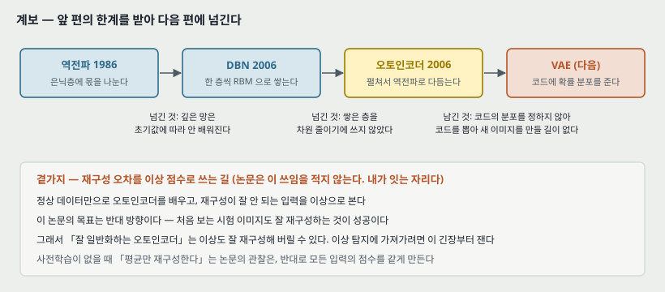

**하나. 역전파의 한계를 받는 자리.** 역전파는 은닉층에 몫을 나누는 길을 냈지만, 깊어지면 그 몫이 아래까지 안 내려온다(5절의 $0.25^{10}$). 이 논문은 기울기를 고치지 않고 **출발점을 바꿔** 우회한다. 여섯 해 뒤의 AlexNet(2012)은 사전학습 없이 ReLU 로 여덟 층 망을 배웠다 — 곧 사전학습은 **유일한 해법이 아니라 이 논문 시점의 한 해법**이다.

**둘. 다음 칸(VAE)으로 넘기는 한계.** 이 논문의 코드에는 **분포가 없다.** 부호기가 입력을 한 점으로 보내고, 그 점들이 코드 공간에 어떻게 퍼지는지를 정하지 않으므로, 코드 공간에서 점을 새로 골라 복호기에 넣으면 무엇이 나올지 보장이 없다. 그림 3B · 4C 에서 부류가 팔 모양으로 뻗고 팔 사이가 빈 것이 이 모습이다. **코드에 확률 분포를 주면** 생성 모델이 되고, 그것이 로드맵의 다음 칸이다.

**셋. 이상 탐지로 가는 곁가지 — 논문은 이 쓰임을 적지 않는다.** 정상 데이터만으로 오토인코더를 배우고 재구성 오차가 큰 입력을 이상으로 보는 방법이 재구성 기반 이상 탐지다. 이 논문에서 가져갈 것과 조심할 것이 하나씩 있다.

- **가져갈 것**: 재구성 오차가 **입력마다 하나의 수**로 나오므로 이상 점수로 바로 쓸 수 있다. 그리고 곡선 결과(6 차원 코드로 1.44)가 보이듯, 데이터가 저차원 곡면 위에 있으면 오토인코더가 그 곡면을 배운다 — **곡면에서 벗어난 입력**이 이상이라는 정의와 맞는다.
- **조심할 것**: 이 논문의 성공 기준은 **처음 보는 시험 이미지도 잘 재구성하는 것**이다. 이상 탐지는 반대로 **처음 보는 이상은 못 재구성해야** 한다. 잘 일반화하는 오토인코더는 이상도 잘 재구성할 수 있다. 그리고 사전학습 없이 「늘 평균을 재구성하는」 망은 모든 입력에 같은 모양의 답을 내므로, 점수가 입력의 평균과의 거리로 줄어든다.

> 셋째 문단은 내가 읽고 이은 것이고 이 논문이 측정한 것이 아니다. 22절에 잴 방법을 적어 둔다.

---

## 21. 다음에 읽을 것

**한계를 적고 그 한계를 푼 것이 다음 논문이다.** 이 논문이 남긴 자리에서 셋을 꼽는다.

| 다음 | 이 논문의 어느 자리에서 나오는가 | 무엇을 확인하고 싶은가 |
|---|---|---|
| **VAE** — Auto-Encoding Variational Bayes (ICLR 2014) | 20절 둘 — 코드에 분포가 없다 | 부호기가 점 대신 분포를 내면 무엇이 바뀌는가. 재구성 오차에 무엇이 더해지는가 |
| **사전학습 없이 같은 깊은 오토인코더를 배운 편** | 5절 · 17절 둘 — 「늘 평균을 재구성한다」가 본문에 수치 없이 있다 | 최적화 방법만 바꾸면 곡선 오토인코더가 사전학습 없이 배워지는가. 그러면 이 논문의 몫이 어디까지인가 |
| **RBM 대신 잡음 제거 오토인코더를 쌓은 편** | 18절 둘 — 사전학습 단계가 생성 모델 규칙이다 | 층마다 재구성으로 배워 쌓아도 같은 출발점이 나오는가 |

읽는 순서로는 **첫째가 먼저**다. 로드맵의 다음 칸이고, 이 논문의 코드 공간이 빈 이유가 거기서 식으로 설명된다.

---

## 22. 돌려 볼 것

노트를 쓰며 나온 물음 중 **직접 잴 수 있는 것 넷**이다. **아직 실험 폴더를 만들지 않았고 돌리지 않았다.** 돌리게 되면 질문과 가설을 먼저 적는 규칙대로 폴더를 만든다.

| 무엇 | 이 노트의 어느 자리 | 묻는 것 |
|---|---|---|
| A | 5절 · 17절 둘 | MNIST 784-1000-500-250-30 을 **사전학습 대 무작위 초기화**로 같은 미세조정만큼 배우면 재구성 오차가 얼마인가. 무작위 쪽이 정말 평균 이미지로 가는가 |
| B | 17절 하나 | **파라미터를 맞춘 비교** — 주성분 분석의 코드 차원을 올려 가며 오토인코더 30 차원의 3.00 에 닿는 차원이 몇인가 |
| C | 12절 · 17절 셋 | seed 셋에서 오토인코더 30 대 주성분 30 의 차이가 변동 폭 밖에 있는가 |
| D | 20절 셋 | MNIST 한 숫자만으로 배운 오토인코더의 재구성 오차로 나머지 아홉 숫자를 얼마나 가르는가. **사전학습이 이 점수를 좋게 하는가 나쁘게 하는가** |

DBN 실험(numpy, MNIST 10,000 장)의 RBM 코드를 A 의 사전학습에 그대로 쓸 수 있다.

---

## 23. 물어 두는 것

- **얼굴 조각은 어떻게 표준화했는가.** 분산 1 가우스 유닛이 입력 크기에 매이는데 본문에 전처리가 없다. 보충 자료를 열면 답이 있을 것이다.
- **그림 2 캡션의 평균은 보인 몇 장인가 시험 전체인가.** 12절의 주의와 같은 물음이다.
- **곡선 데이터를 어떻게 그렸는가.** 세 점에서 곡선을 만드는 방법(선의 굵기, 흐림)이 재구성 오차의 크기를 정할 텐데 본문에 없다.
- **2 차원 시각화(그림 3)를 부류 분리도로 재면** 주성분 두 개와 몇 차이가 나는가. 논문은 그림으로만 보인다.

---

## 24. 참고 문헌

이 노트가 부른 편만 적는다. 원리는 원 출처를, 구현은 그 라이브러리의 편을 적는 규칙을 따른다. 이 노트는 라이브러리를 부르지 않았다.

- Hinton, G. E. and Salakhutdinov, R. R. (2006). Reducing the dimensionality of data with neural networks. **Science**, 313(5786):504–507. — 이 노트의 대상.
- Hinton, G. E. (2002). Training products of experts by minimizing contrastive divergence. **Neural Computation**, 14:1711. — 식 (2) 의 원 출처(논문 참고 문헌 6).
- Smolensky, P. (1986). Parallel Distributed Processing, Vol. 1, pp. 194–281. — RBM 의 원 출처로 논문이 다는 편(참고 문헌 5).
- Hinton, G. E., Osindero, S., and Teh, Y. W. (2006). A fast learning algorithm for deep belief nets. **Neural Computation**, 18:1527. — 층을 더하면 하한이 좋아진다는 근거(참고 문헌 9), 19절의 비교 상대.
- Welling, M., Rosen-Zvi, M., and Hinton, G. (2005). NIPS 17, pp. 1481–1488. — 선형 가우스 보이는 유닛의 출처(참고 문헌 10).
- Deerwester, S. C. et al. (1990). **J. Am. Soc. Inf. Sci.**, 41:391. — 잠재 의미 분석(참고 문헌 14).
- Roweis, S. T. and Saul, L. K. (2000). **Science**, 290:2323. — 국소 선형 임베딩(참고 문헌 15).
- Kingma, D. P. and Welling, M. (2014). Auto-Encoding Variational Bayes. ICLR. — 21절의 다음 읽을 것. **2026-09-28 에 읽었다.**

---

## 25. 경로

| 무엇 | 어디 |
|---|---|
| 원문 PDF | `papers/Science06_AE_Reducing_the_Dimensionality_of_Data_with_Neural_Networks.pdf` |
| 보충 자료(열어 보지 않음) | `www.sciencemag.org/cgi/content/full/313/5786/504/DC1` |
| 이 노트 | `notes/Science06_AE_Reducing_the_Dimensionality_of_Data_with_Neural_Networks.md` |
| 이 노트의 그림 | `figures/Science06_AE/fig01_pca_line_vs_curve.svg` 부터 `fig14_lineage.svg` 까지 열넷 |
| 그림을 만드는 코드 | `figures/Science06_AE/make_figures.py` — 바깥 데이터를 읽지 않으므로 `python make_figures.py` 로 어디서나 다시 만든다. 1 · 3 · 9 · 10 · 11 · 13 번 그림의 수는 이 파일이 계산해 화면에도 찍는다 |
